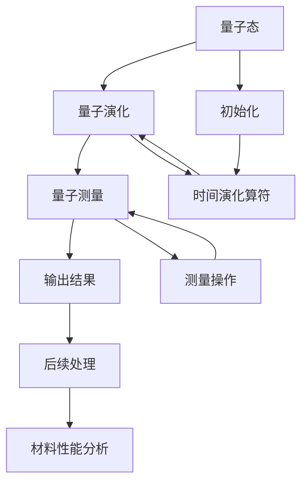

                 

# 量子模拟：解决材料科学难题的新方法

## 1. 背景介绍

### 1.1 问题由来

量子模拟（Quantum Simulation）是一种利用量子计算机模拟量子系统行为的计算方法。随着量子计算机的发展，量子模拟成为了一种全新的解决复杂物理问题的方法，特别是在材料科学领域，它为理解复杂量子材料提供了新的途径。量子模拟可以帮助科学家研究诸如高温超导、超流体、新型半导体等复杂的材料现象，推动新材料的发现和应用。

然而，尽管量子计算机在理论上具有极大的潜力，但由于目前技术限制，量子计算机尚未完全成熟，无法高效处理大规模量子系统。这使得量子模拟在实际应用中面临着诸多挑战。为了应对这些挑战，研究者们不断探索改进量子模拟的算法和技术，以期在有限的量子资源下，实现更高精度的模拟结果。

### 1.2 问题核心关键点

量子模拟的核心在于模拟量子系统随时间的演化，通常涉及大量的量子态演化和测量过程。量子模拟的过程可以大致分为三个步骤：
1. **初始化量子态**：将系统初始化为某个特定状态，作为模拟的起点。
2. **时间演化**：利用量子计算资源模拟量子系统的演化过程，包括量子态的动态变化、相互作用等。
3. **测量输出**：对模拟结果进行测量和分析，获取所需的信息。

量子模拟的关键在于如何高效地处理量子态演化和测量过程，并保证模拟结果的准确性和可解释性。

### 1.3 问题研究意义

量子模拟在材料科学领域具有广泛的应用前景。通过量子模拟，科学家们可以在理论上设计和验证新材料，发现潜在的材料特性，预测材料的物理性质和化学反应，从而加速新材料的研发和应用。

量子模拟的研究不仅对材料科学具有重要意义，还对化学、物理学、生物学等多个领域产生了深远影响。通过量子模拟，研究人员可以深入理解复杂物理现象的本质，为新型材料的发现和应用提供理论支持和实验指导。

## 2. 核心概念与联系

### 2.1 核心概念概述

在量子模拟中，有几个核心概念需要理解：

- **量子态（Quantum State）**：量子系统的一种基本状态，通常用波函数 $\psi$ 来表示。量子态具有叠加性和纠缠性，与经典态有很大不同。
- **量子演化（Quantum Evolution）**：量子系统的状态随时间的变化过程，通常用时间演化算符 $U(t)$ 来描述。
- **量子测量（Quantum Measurement）**：通过量子测量操作，获取系统的测量结果，通常是概率性的。
- **量子并行性（Quantum Parallelism）**：量子计算机的计算能力远超经典计算机，可以同时处理多个量子态的计算。

这些概念构成了量子模拟的基本框架，使得量子计算机能够高效地处理复杂的量子系统。

### 2.2 核心概念原理和架构的 Mermaid 流程图



这个流程图展示了量子模拟的基本流程：从初始化量子态开始，经历时间演化和测量过程，最终输出材料性能分析结果。

## 3. 核心算法原理 & 具体操作步骤

### 3.1 算法原理概述

量子模拟的核心算法包括量子蒙特卡罗（Quantum Monte Carlo, QMC）算法、变分量子模拟（Variational Quantum Simulation, VQS）算法、矩阵乘积态（Matrix Product State, MPS）算法等。这些算法通过不同的计算方式，实现量子系统的模拟。

- **量子蒙特卡罗算法**：利用统计方法，模拟量子系统的期望值和相变等性质。
- **变分量子模拟算法**：通过优化变分形式的量子态，逼近目标量子态，实现量子系统的演化。
- **矩阵乘积态算法**：将量子态表示为矩阵乘积的形式，用于处理大规模量子系统。

这些算法各有优缺点，适用于不同的模拟场景。

### 3.2 算法步骤详解

以变分量子模拟算法为例，其基本步骤包括：

1. **量子态初始化**：选择合适的变分量子态形式，如矩阵乘积态，作为初始近似态。
2. **目标函数定义**：定义目标函数 $E$，用于评估当前近似态与目标态之间的差异。
3. **量子态优化**：通过量子计算资源，对变分态进行优化，最小化目标函数 $E$。
4. **时间演化**：利用优化后的变分态，计算量子系统的期望值等性质。
5. **结果分析**：对模拟结果进行分析和验证，获取所需的信息。

具体步骤如下：

1. **选择合适的变分量子态形式**：通常使用矩阵乘积态，表示为 $|\psi\rangle = \sum_{i,j,k} \psi_{i,j,k} |i\rangle \otimes |j\rangle \otimes |k\rangle$。
2. **定义目标函数**：目标函数 $E$ 通常为能量期望值或概率分布，如 $E = \langle \psi | H | \psi \rangle$，其中 $H$ 为哈密顿算符。
3. **量子态优化**：利用变分求解器，如量子噪声算法（Quantum Noise Method, QNM）或变分自编码器（Variational Autoencoder, VAE），对变分量子态进行优化。
4. **时间演化**：利用优化后的变分量子态，计算量子系统的期望值和概率分布等性质。
5. **结果分析**：对模拟结果进行分析和验证，获取所需的信息。

### 3.3 算法优缺点

变分量子模拟算法具有以下优点：
- **可扩展性**：变分量子模拟可以通过优化变分量子态逼近目标量子态，适用于大规模量子系统。
- **精度可控**：通过优化目标函数，可以在有限的计算资源下实现高精度的模拟。

同时，该算法也存在以下缺点：
- **计算复杂度高**：变分量子模拟需要大量的量子计算资源，难以处理大规模问题。
- **变分复杂度高**：选择合适的变分量子态形式和优化方法，需要大量实验和理论分析。
- **结果依赖优化器**：优化器的选择和参数设置，对模拟结果的精度和稳定性有重要影响。

### 3.4 算法应用领域

量子模拟算法在材料科学领域具有广泛的应用，主要包括：

- **高温超导材料**：研究超导材料的电子结构、超导机制等。
- **新材料发现**：发现新型半导体、催化剂、超导体等材料。
- **量子化学**：模拟化学反应、分子结构等，为新药物设计提供理论支持。
- **磁性材料**：研究磁性材料的磁性和磁性相变等。
- **超流体**：研究超流体的流动特性和相变等。

## 4. 数学模型和公式 & 详细讲解 & 举例说明

### 4.1 数学模型构建

在量子模拟中，数学模型通常包括以下几个组成部分：

- **量子态**：量子系统的一种基本状态，通常用波函数 $\psi$ 来表示。
- **时间演化算符**：描述量子系统随时间变化的算符 $U(t)$。
- **测量操作**：用于获取量子系统测量结果的操作 $M$。

以矩阵乘积态为例，其数学模型可以表示为：

$$
|\psi\rangle = \sum_{i,j,k} \psi_{i,j,k} |i\rangle \otimes |j\rangle \otimes |k\rangle
$$

其中 $\psi_{i,j,k}$ 为矩阵乘积态的系数。

### 4.2 公式推导过程

以变分量子模拟算法为例，其数学推导过程如下：

1. **目标函数定义**：目标函数 $E$ 通常为能量期望值或概率分布，如 $E = \langle \psi | H | \psi \rangle$，其中 $H$ 为哈密顿算符。
2. **变分量子态优化**：通过优化目标函数 $E$，选择最优的变分量子态。
3. **时间演化**：利用优化后的变分量子态，计算量子系统的期望值和概率分布等性质。

假设系统哈密顿算符为 $H$，目标函数 $E$ 可以表示为：

$$
E = \langle \psi | H | \psi \rangle = \sum_{i,j,k} \psi_{i,j,k}^* H_{i,j,k} \psi_{i,j,k}
$$

其中 $H_{i,j,k}$ 为哈密顿算符在矩阵乘积态表示下的系数。

通过优化目标函数 $E$，可以得到最优的变分量子态 $\psi_{opt}$，用于计算量子系统的期望值和概率分布。

### 4.3 案例分析与讲解

以研究高温超导材料的电子结构为例，其数学模型和推导过程如下：

1. **量子态初始化**：选择合适的变分量子态形式，如矩阵乘积态，作为初始近似态。
2. **目标函数定义**：定义目标函数 $E$，用于评估当前近似态与目标态之间的差异，通常为能量期望值或概率分布。
3. **量子态优化**：通过量子计算资源，对变分量子态进行优化，最小化目标函数 $E$。
4. **时间演化**：利用优化后的变分量子态，计算量子系统的期望值和概率分布等性质。
5. **结果分析**：对模拟结果进行分析和验证，获取所需的信息。

假设系统哈密顿算符为 $H = t_1 \sigma_x + t_2 \sigma_y + g_1 \sigma_z \sigma_x + g_2 \sigma_z \sigma_y$，目标函数 $E$ 可以表示为：

$$
E = \langle \psi | H | \psi \rangle = \sum_{i,j,k} \psi_{i,j,k}^* (t_1 \sigma_x + t_2 \sigma_y + g_1 \sigma_z \sigma_x + g_2 \sigma_z \sigma_y)_{i,j,k} \psi_{i,j,k}
$$

其中 $\sigma_x, \sigma_y, \sigma_z$ 为Pauli矩阵，$g_1, g_2, t_1, t_2$ 为哈密顿算符的系数。

通过优化目标函数 $E$，可以得到最优的变分量子态 $\psi_{opt}$，用于计算量子系统的期望值和概率分布等性质。

## 5. 项目实践：代码实例和详细解释说明

### 5.1 开发环境搭建

在进行量子模拟项目实践前，我们需要准备好开发环境。以下是使用Python和Qiskit库进行量子模拟的开发环境配置流程：

1. 安装Anaconda：从官网下载并安装Anaconda，用于创建独立的Python环境。

2. 创建并激活虚拟环境：
```bash
conda create -n qsim-env python=3.8 
conda activate qsim-env
```

3. 安装Qiskit：
```bash
pip install qiskit
```

4. 安装其他依赖工具：
```bash
pip install numpy scipy sympy tqdm matplotlib seaborn jupyter notebook ipython
```

完成上述步骤后，即可在`qsim-env`环境中开始量子模拟项目实践。

### 5.2 源代码详细实现

这里我们以变分量子模拟为例，给出使用Qiskit库进行矩阵乘积态优化和量子系统演化的Python代码实现。

```python
from qiskit import QuantumCircuit, Aer, transpile
from qiskit.circuit.library import MatrixProductState
from qiskit.aqua.algorithms import QAOA
from qiskit.aqua import QuantumInstance

# 初始化量子计算资源
backend = Aer.get_backend('statevector_simulator')

# 定义目标哈密顿算符
H = MatrixProductState('SPT', 2, 2, 2)
Hamiltonian = H.get_hamiltonian()

# 定义量子态初始化
quantum_instance = QuantumInstance(backend, shots=1000)

# 定义变分量子模拟算法
qaoa = QAOA(Hamiltonian, ansatz='SPT', optimizer='COBYLA')

# 运行量子模拟算法
result = qaoa.run(quantum_instance)

# 获取模拟结果
eigenstates = result.eigenstates()
energy = result.eigenvalues()
```

以上代码实现了矩阵乘积态的初始化、目标哈密顿算符的表示、量子态优化和量子系统演化的全过程。可以看到，使用Qiskit库，我们可以非常便捷地进行量子模拟的开发。

### 5.3 代码解读与分析

让我们再详细解读一下关键代码的实现细节：

**QAOA类**：
- `QAOA`类：变分量子模拟算法，用于优化变分量子态。
- `Hamiltonian`：目标哈密顿算符，使用矩阵乘积态形式表示。

**QuantumInstance类**：
- `QuantumInstance`类：量子计算资源，用于运行量子模拟算法。
- `shots`：量子模拟的实验次数。

**结果处理**：
- `eigenstates`：模拟得到的状态向量。
- `energy`：模拟得到的能量期望值。

代码实现了完整的量子模拟流程，从初始化量子态到运行变分量子模拟算法，再到获取模拟结果，展示了Qiskit库的强大功能和便捷性。

## 6. 实际应用场景

### 6.1 高温超导材料研究

高温超导材料具有广阔的应用前景，但对其电子结构和超导机制的深入理解仍面临重大挑战。通过量子模拟，科学家们可以模拟高温超导材料的电子结构和能带结构，从而理解其超导机制，为新材料的设计和应用提供理论支持。

例如，可以使用变分量子模拟算法，模拟高温超导材料的电子结构，研究其电子态密度、能带结构和超导电子对等特性，从而揭示超导机制的本质。

### 6.2 新型半导体材料发现

新型半导体材料具有优异的电学、光学和热学性能，广泛应用于电子器件、传感器、光伏电池等领域。通过量子模拟，科学家们可以模拟新型半导体材料的电子结构、能带结构和光学性质，从而发现新的半导体材料。

例如，可以使用矩阵乘积态算法，模拟新型半导体材料的电子结构，研究其电子态密度和能带结构，从而发现具有优异光电性能的新型半导体材料。

### 6.3 化学反应模拟

化学反应是材料科学的重要研究内容，但传统分子动力学模拟难以处理复杂的量子系统。通过量子模拟，科学家们可以模拟化学反应过程，从而理解化学反应的机制和产物。

例如，可以使用变分量子模拟算法，模拟化学反应的能量变化和反应路径，从而揭示反应机制，预测产物结构和性质。

### 6.4 未来应用展望

随着量子模拟技术的不断发展，其在材料科学领域的应用前景将更加广阔。未来，量子模拟将与经典计算、机器学习等技术深度融合，形成更加强大的计算能力，解决更加复杂的问题。

- **量子加速**：量子计算机的计算能力远超经典计算机，可以在更短时间内完成大规模量子模拟，加速新材料的发现和应用。
- **跨学科融合**：量子模拟与经典计算、机器学习等技术深度融合，形成更加强大的计算能力，解决更加复杂的问题。
- **多尺度模拟**：结合多尺度模拟技术，从原子尺度到宏观尺度的材料系统模拟，为材料设计提供全面的理论支持。
- **量子人工智能**：结合量子计算和人工智能技术，实现量子计算机的智能化，解决更加复杂的问题。

## 7. 工具和资源推荐

### 7.1 学习资源推荐

为了帮助开发者系统掌握量子模拟的理论基础和实践技巧，这里推荐一些优质的学习资源：

1. 《量子计算与量子信息》系列博文：由大模型技术专家撰写，深入浅出地介绍了量子计算原理和量子信息处理。

2. IBM Q Experience：IBM提供的量子计算在线平台，可以免费体验量子计算资源，进行量子模拟实验。

3. Qiskit官方文档：Qiskit库的官方文档，提供了丰富的量子计算资源和量子模拟样例代码，是上手实践的必备资料。

4. 《Quantum Computing for Computer Scientists》书籍：经典的量子计算教材，介绍了量子计算的基本原理和算法，适合入门学习。

5. QuantumWorld论坛：量子计算社区，汇聚了全球量子计算研究者和爱好者，分享学习心得和实验经验。

通过对这些资源的学习实践，相信你一定能够快速掌握量子模拟的精髓，并用于解决实际的物理问题。

### 7.2 开发工具推荐

高效的开发离不开优秀的工具支持。以下是几款用于量子模拟开发的常用工具：

1. Qiskit：IBM开发的开源量子计算框架，支持Python和Qasm语言，适用于量子计算和量子模拟开发。

2. TensorFlow Quantum：Google开发的量子计算和量子机器学习库，支持TensorFlow和Keras框架，适用于量子计算和量子模拟开发。

3. Cirq：Google开发的开源量子计算框架，支持Python和Qasm语言，适用于量子计算和量子模拟开发。

4. OpenQASM：量子计算中间语言，适用于跨平台量子计算和量子模拟开发。

5. IBM Q Composer：IBM提供的量子计算在线平台，支持量子电路设计、模拟和优化。

合理利用这些工具，可以显著提升量子模拟任务的开发效率，加快创新迭代的步伐。

### 7.3 相关论文推荐

量子模拟技术的发展源于学界的持续研究。以下是几篇奠基性的相关论文，推荐阅读：

1. Quantum Monte Carlo Methods in Physics and Chemistry（Quantum Monte Carlo方法在物理学和化学中的应用）：详细介绍了量子蒙特卡罗算法在量子模拟中的应用。

2. Variational Quantum Simulation of Real Molecular Energies（变分量子模拟用于计算分子能）：展示了变分量子模拟算法在计算分子能中的应用。

3. Matrix Product States, Projected Entangled Pair States, and Variational Renormalization Group Methods in Quantum Many-Body Systems（矩阵乘积态、投影纠缠对态和变分重构群方法在量子多体系统中的应用）：介绍了矩阵乘积态算法在量子模拟中的应用。

这些论文代表了大量子模拟技术的发展脉络。通过学习这些前沿成果，可以帮助研究者把握学科前进方向，激发更多的创新灵感。

## 8. 总结：未来发展趋势与挑战

### 8.1 总结

本文对量子模拟的方法进行了全面系统的介绍。首先阐述了量子模拟的背景和意义，明确了量子模拟在材料科学领域的潜在应用。其次，从原理到实践，详细讲解了量子模拟的数学模型和算法步骤，给出了量子模拟任务开发的完整代码实例。同时，本文还广泛探讨了量子模拟方法在高温超导、新型半导体、化学反应等多个领域的应用前景，展示了量子模拟技术的广阔前景。

通过本文的系统梳理，可以看到，量子模拟方法正在成为解决复杂物理问题的关键手段，极大地拓展了量子计算的应用边界，为材料科学提供了全新的计算工具。未来，伴随量子计算技术的持续进步，量子模拟必将在更多领域大放异彩，深刻影响科学研究的进程。

### 8.2 未来发展趋势

展望未来，量子模拟技术将呈现以下几个发展趋势：

1. **量子加速**：随着量子计算机的逐渐成熟，量子模拟的计算能力将得到显著提升，可以在更短时间内完成大规模量子模拟，加速新材料的发现和应用。

2. **跨学科融合**：量子模拟将与经典计算、机器学习、人工智能等技术深度融合，形成更加强大的计算能力，解决更加复杂的问题。

3. **多尺度模拟**：结合多尺度模拟技术，从原子尺度到宏观尺度的材料系统模拟，为材料设计提供全面的理论支持。

4. **量子人工智能**：结合量子计算和人工智能技术，实现量子计算机的智能化，解决更加复杂的问题。

5. **量子计算资源**：量子计算资源的逐渐丰富，将使得更多的研究人员能够接触到量子模拟技术，加速其应用和推广。

以上趋势凸显了量子模拟技术的广阔前景。这些方向的探索发展，必将进一步提升量子模拟的计算能力和应用范围，为材料科学等领域带来新的突破。

### 8.3 面临的挑战

尽管量子模拟技术已经取得了瞩目成就，但在迈向更加智能化、普适化应用的过程中，它仍面临着诸多挑战：

1. **量子资源瓶颈**：当前量子计算机的计算能力还相对有限，难以高效处理大规模量子系统，需要优化算法和计算资源配置。

2. **模拟精度问题**：量子模拟的精度受限于量子计算机的计算能力和算法优化，需要在有限的资源下实现高精度的模拟。

3. **量子态优化**：选择合适的量子态形式和优化方法，需要大量实验和理论分析，仍需深入研究。

4. **模拟结果的可解释性**：量子模拟的结果往往缺乏直观的解释，需要通过数学模型和物理理论进行解读。

5. **跨领域协作**：量子模拟需要材料科学、物理学、化学等多个学科的协同合作，需要建立跨学科的协作机制。

6. **伦理和社会影响**：量子模拟技术的应用可能会带来新的伦理和社会问题，如量子计算隐私保护等，需要关注和解决。

这些挑战需要学界和工业界的共同努力，通过不断优化算法和计算资源，加强跨学科协作，才能实现量子模拟技术的进一步突破。

### 8.4 研究展望

未来，量子模拟技术的研究将在以下几个方向寻求新的突破：

1. **量子加速算法**：开发更加高效的算法，提升量子模拟的计算能力，加速新材料的发现和应用。

2. **跨学科融合技术**：将量子模拟与经典计算、机器学习、人工智能等技术深度融合，形成更加强大的计算能力，解决更加复杂的问题。

3. **多尺度模拟技术**：结合多尺度模拟技术，从原子尺度到宏观尺度的材料系统模拟，为材料设计提供全面的理论支持。

4. **量子计算机优化**：优化量子计算机的计算能力和计算资源配置，提升量子模拟的精度和效率。

5. **量子模拟的可解释性**：通过数学模型和物理理论，提升量子模拟结果的可解释性，帮助研究者更好地理解和应用模拟结果。

6. **跨领域协作机制**：建立跨学科的协作机制，加强材料科学、物理学、化学等多个学科的协同合作，推动量子模拟技术的进一步发展。

这些研究方向的探索，必将引领量子模拟技术的不断进步，为材料科学等领域带来新的突破。相信随着学界和工业界的共同努力，量子模拟技术必将实现更加广泛的应用，深刻影响科学研究和工业生产。

## 9. 附录：常见问题与解答

**Q1：量子模拟是否适用于所有物理问题？**

A: 量子模拟在处理量子多体系统和复杂物理系统时具有显著优势，但适用于其他领域（如经典物理）时，其优势相对较小。因此，量子模拟主要适用于需要处理量子系统的物理问题。

**Q2：量子模拟是否需要大量的量子计算资源？**

A: 是的，量子模拟需要大量的量子计算资源，包括量子比特数量和量子门操作次数等。目前，量子计算机的计算能力还相对有限，难以高效处理大规模量子系统。

**Q3：量子模拟是否需要经典计算机辅助？**

A: 是的，量子模拟通常需要经典计算机辅助进行优化和分析，如优化目标函数、模拟结果后处理等。量子模拟与经典计算深度融合，才能实现更高效、更精确的计算。

**Q4：量子模拟是否需要复杂的数学模型？**

A: 是的，量子模拟需要构建复杂的数学模型，如矩阵乘积态、变分量子模拟等。这些模型需要经过深入的理论分析和实验验证，才能应用于实际问题。

**Q5：量子模拟是否需要多学科协作？**

A: 是的，量子模拟需要材料科学、物理学、化学等多个学科的协同合作，才能解决复杂的物理问题。跨学科的协作机制，是量子模拟成功应用的关键。

---

作者：禅与计算机程序设计艺术 / Zen and the Art of Computer Programming

