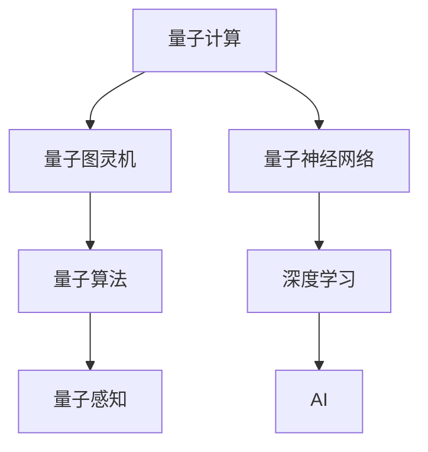

                 

# 量子计算和人工智能的未来

> 关键词：量子计算,人工智能,量子图灵机,量子超导芯片,量子神经网络,深度学习,量子算法,量子感知,量子通讯,量子安全

## 1. 背景介绍

### 1.1 问题由来
随着计算机科学的飞速发展，人工智能（AI）和量子计算（Quantum Computing）成为当前科技领域的两大热门话题。它们分别代表着计算领域传统与突破性创新。AI通过对大数据的深度学习，展现出强大的推理、感知和决策能力。而量子计算则通过量子叠加、量子纠缠等量子力学原理，展现出远超经典计算的计算能力。

量子计算与AI的融合成为现代科技发展的关键方向。量子计算能在某些特定任务中大幅超越经典计算，如因子分解、搜索问题等，而AI则通过强大的模式识别和处理能力，提升量子计算在复杂实际问题中的应用。本文将从量子计算和AI的基本概念出发，探讨两者的结合机制及其未来发展方向。

### 1.2 问题核心关键点
量子计算和AI的结合核心在于量子图灵机（Quantum Turing Machine, QTM）。QTM通过量子逻辑门运算，实现量子信息的状态转换，是量子计算的基础。而在AI方面，量子神经网络（Quantum Neural Network, QNN）作为量子计算和AI融合的主要载体，将神经网络与量子计算结合，实现了对复杂问题的量子优化。

通过QTM和QNN，量子计算与AI相辅相成，能在量子计算与传统计算之间形成桥梁，推动量子计算在实际问题中的应用。同时，量子计算提供的强大计算能力，为AI的发展提供新的可能，如量子感知、量子机器学习等。

## 2. 核心概念与联系

### 2.1 核心概念概述

为更好地理解量子计算和AI的结合机制，本节将介绍几个密切相关的核心概念：

- 量子计算：基于量子力学的基本原理，通过量子比特（Qubit）和量子逻辑门进行计算的计算模型。相对于传统计算，量子计算在并行性和计算速度上有显著优势。
- 量子图灵机（QTM）：将量子计算与经典计算相联系的理论模型，通过量子逻辑门实现量子信息的状态转换。QTM是量子计算的基础，是所有量子算法的设计依据。
- 量子神经网络（QNN）：结合量子计算和神经网络的模型，利用量子叠加和量子纠缠的特性，进行复杂的模式识别和优化计算。QNN是量子计算与AI结合的重要表现形式。
- 深度学习：基于神经网络的机器学习方法，通过多层非线性映射，实现对复杂数据的有效处理和分析。深度学习是AI的重要组成部分，与量子计算相结合，能提升模型在大规模数据上的性能。
- 量子算法：利用量子力学原理，设计出的高效求解特定问题的算法，如Shor算法、Grover算法等，是量子计算的重要应用。
- 量子感知：通过量子算法，实现对环境的实时感知和响应，用于控制量子系统，如量子机器学习中的QNN感知。

这些核心概念之间的逻辑关系可以通过以下Mermaid流程图来展示：



这个流程图展示了大语言模型的核心概念及其之间的关系：

1. 量子计算通过QTM构建量子逻辑门运算模型。
2. 量子算法是QTM的具体实现，是量子计算的基础。
3. 量子感知利用量子算法实现环境感知，是量子计算在AI中的应用。
4. QNN将量子计算与深度学习相结合，提升了AI的性能。
5. AI系统利用深度学习进行复杂任务，量子计算通过QNN和量子感知优化AI性能。

## 3. 核心算法原理 & 具体操作步骤

### 3.1 算法原理概述

量子计算和AI的结合，主要通过QTM和QNN实现。QTM通过量子逻辑门运算，实现量子信息的状态转换，是量子计算的基础。而QNN通过量子计算和神经网络的结合，提升深度学习模型的性能，实现了量子优化。

量子计算与AI的结合，本质上是通过QTM在量子神经网络中实现对特定问题的优化。具体步骤包括：

1. **数据准备**：将经典计算的数据转换为量子计算可用的量子态。
2. **量子逻辑门运算**：通过量子逻辑门实现量子态的运算和状态转换。
3. **测量和输出**：将量子态通过量子测量输出，转化为经典计算可用的结果。

### 3.2 算法步骤详解

量子计算和AI结合的算法步骤主要分为以下几个关键阶段：

**Step 1: 量子数据的准备**
- 将经典计算的数据转换为量子计算可用的量子态。可以使用量子态编码技术，如Barenco编码，将经典二进制数据转换为量子二进制数据。

**Step 2: 量子逻辑门运算**
- 通过量子逻辑门实现量子态的运算和状态转换。量子逻辑门包括单量子比特门、双量子比特门等，如Hadamard门、CNOT门等。
- 设计量子电路，确定量子逻辑门的运算顺序，实现对量子数据的处理。

**Step 3: 量子测量的输出**
- 对量子态进行测量，获取量子计算的结果。量子测量输出结果通常是一个概率分布，需要通过后处理将其转化为经典计算可用的数据。
- 将量子计算结果与经典数据结合，进行后续的深度学习模型训练和优化。

**Step 4: 深度学习模型的训练和优化**
- 使用量子计算优化后的数据，进行深度学习模型的训练。通过量子感知提升模型的感知能力，通过量子逻辑门运算优化模型参数。
- 通过量子增强的深度学习模型，实现对复杂问题的求解。

### 3.3 算法优缺点

量子计算和AI结合的算法具有以下优点：
1. 强大计算能力：量子计算提供的大规模并行计算能力，可以显著提升AI模型的计算效率。
2. 高效优化：量子算法在特定问题上的高效求解能力，能够优化深度学习模型的训练过程，提升模型精度。
3. 泛化能力强：量子计算和AI结合，能够处理更加复杂多变的任务，提升AI模型的泛化能力。

同时，该算法也存在以下局限性：
1. 技术复杂度高：量子计算和AI结合的技术实现复杂，需要多学科交叉，难度较大。
2. 硬件资源需求高：量子计算对量子芯片和量子逻辑门运算的需求，硬件成本较高。
3. 算法效率有待提升：虽然量子算法在特定问题上有优势，但在通用问题上仍需优化。

尽管存在这些局限性，但量子计算和AI结合在特定问题上的突破，如量子机器学习、量子感知等，显示出强大的应用前景。未来相关研究的重点在于如何进一步降低量子计算和AI结合的技术门槛，提升硬件设备的性能，同时优化算法效率，将量子计算和AI真正应用于实际问题中。

### 3.4 算法应用领域

量子计算和AI的结合在多个领域显示出巨大的应用潜力：

- **量子机器学习**：利用量子计算和深度学习的结合，提升机器学习的效率和精度。QNN在数据处理和优化计算上的优势，使得量子机器学习在金融、医疗、通信等诸多领域有广泛应用前景。
- **量子感知**：通过量子算法实现环境感知，用于控制量子系统，如量子传感、量子通信等。
- **量子优化问题**：利用量子计算在特定问题上的高效求解能力，优化复杂的系统设计，如供应链优化、网络路由等。
- **量子强化学习**：结合量子计算和强化学习的结合，提升智能体在复杂环境中的决策能力。
- **量子加密**：利用量子计算的不可逆性和量子纠缠的特性，提升加密算法的安全性。

除了上述这些经典领域，量子计算和AI的结合还将在更多新领域得到应用，如量子基因组学、量子社交网络等，为科技和社会的发展带来新的机遇。

## 4. 数学模型和公式 & 详细讲解 & 举例说明

### 4.1 数学模型构建

本节将使用数学语言对量子计算和AI结合的算法过程进行更加严格的刻画。

记量子计算的数据集为 $D=\{x_i\}_{i=1}^N$，其中 $x_i$ 为经典计算的数据，可以通过量子态编码转换为量子计算可用的数据。记深度学习模型为 $M_{\theta}(x)$，其中 $\theta$ 为模型参数。量子计算通过量子逻辑门运算，生成量子数据 $D'$，记 $D'=\{|\phi_i\rangle\}_{i=1}^N$。

假设深度学习模型的训练损失为 $\mathcal{L}(\theta|x)$，则量子计算和AI结合的优化目标为：

$$
\hat{\theta} = \mathop{\arg\min}_{\theta} \mathcal{L}(\theta|D')
$$

其中，$\hat{\theta}$ 为量子计算和AI结合后的深度学习模型参数。

### 4.2 公式推导过程

以下我们以量子感知为例，推导量子计算和AI结合的数学模型。

假设量子感知任务为识别环境中的某个目标，记量子感知模型为 $M_{\theta}(x|\phi)$，其中 $x$ 为经典计算的输入，$|\phi\rangle$ 为量子态编码后的量子数据。模型的预测结果为 $y=0$ 或 $y=1$，分别表示不存在目标和存在目标。则量子感知的任务可以表示为分类问题。

量子感知模型的输出为 $M_{\theta}(x|\phi)$，其中 $M_{\theta}(x|\phi)$ 为深度学习模型的输出。记模型的损失函数为 $\mathcal{L}(\theta|x,\phi)=L(y,M_{\theta}(x|\phi))$，其中 $L$ 为分类损失函数，如交叉熵损失。

在量子感知中，量子逻辑门运算和量子测量的输出需要与深度学习模型结合。设量子逻辑门运算的输出为 $|\psi\rangle$，通过量子测量输出结果 $y'$，则量子感知模型的输出为 $y'$。

量子感知模型的损失函数可以表示为：

$$
\mathcal{L}(\theta|x,\phi) = L(y,M_{\theta}(x|\psi))
$$

其中，$y'$ 为量子测量输出的结果，$|\psi\rangle$ 为量子逻辑门运算的输出。

### 4.3 案例分析与讲解

假设某量子感知任务为识别分子结构。分子结构数据 $x$ 经过量子态编码后，输入量子感知模型 $M_{\theta}(x|\phi)$ 进行处理。模型输出 $M_{\theta}(x|\psi)$，通过量子测量输出结果 $y'$。设 $y'$ 表示存在目标，$y'=0$ 表示不存在目标。

假设量子逻辑门运算和深度学习模型的输出为 $M_{\theta}(x|\psi)$，则损失函数为：

$$
\mathcal{L}(\theta|x,\phi) = L(y',M_{\theta}(x|\psi))
$$

其中，$L$ 为交叉熵损失函数。

在训练过程中，通过最小化损失函数 $\mathcal{L}(\theta|x,\phi)$，不断调整深度学习模型的参数 $\theta$，使得模型能够准确识别分子结构。

## 5. 项目实践：代码实例和详细解释说明

### 5.1 开发环境搭建

在进行量子计算和AI结合的实践前，我们需要准备好开发环境。以下是使用Python进行Qiskit和TensorFlow开发的环境配置流程：

1. 安装Anaconda：从官网下载并安装Anaconda，用于创建独立的Python环境。

2. 创建并激活虚拟环境：
```bash
conda create -n qiskit-tf-env python=3.8 
conda activate qiskit-tf-env
```

3. 安装Qiskit和TensorFlow：
```bash
conda install qiskit tensorflow
```

4. 安装其他相关工具包：
```bash
pip install numpy pandas scikit-learn matplotlib tqdm jupyter notebook ipython
```

完成上述步骤后，即可在`qiskit-tf-env`环境中开始实践。

### 5.2 源代码详细实现

下面我们以量子感知为例，给出使用Qiskit和TensorFlow对量子计算和AI结合的PyTorch代码实现。

首先，定义量子感知任务的数据处理函数：

```python
from qiskit import QuantumCircuit, QuantumRegister, ClassicalRegister, execute, Aer
from tensorflow.keras import models, layers
import numpy as np

def quantum_perception_data_preparation(data, qubit_num=2):
    qubits = QuantumRegister(qubit_num)
    clbits = ClassicalRegister(qubit_num)
    circuit = QuantumCircuit(qubits, clbits)
    for i in range(len(data)):
        # 将经典数据转换为量子态编码
        for j in range(qubit_num):
            if data[i][j] == 1:
                circuit.x(qubits[j])
        # 测量量子态，输出结果
        circuit.measure(qubits, clbits)
        yield circuit
```

然后，定义量子感知模型：

```python
def quantum_perception_model(data, qubit_num=2):
    qubits = QuantumRegister(qubit_num)
    clbits = ClassicalRegister(qubit_num)
    circuit = QuantumCircuit(qubits, clbits)
    # 初始化量子逻辑门
    for i in range(qubit_num):
        if data[i][0] == 1:
            circuit.h(qubits[i])
    # 测量量子态，输出结果
    circuit.measure(qubits, clbits)
    return circuit
```

接着，定义深度学习模型：

```python
def deep_learning_model(data, num_labels=2):
    model = models.Sequential([
        layers.Dense(10, input_shape=(qubit_num,), activation='relu'),
        layers.Dense(num_labels, activation='sigmoid')
    ])
    return model
```

最后，启动训练流程并在测试集上评估：

```python
epochs = 5
batch_size = 16

# 初始化深度学习模型和优化器
model = deep_learning_model(data, num_labels)
optimizer = models.Adam()

# 训练模型
for epoch in range(epochs):
    # 随机打乱数据
    np.random.shuffle(data)
    # 对每个批次进行训练
    for i in range(0, len(data), batch_size):
        # 获取训练数据和标签
        x_train = np.array(data[i:i+batch_size])
        y_train = np.array(data[i:i+batch_size, 1])
        # 前向传播
        with qiskit.execute_simulator() as backend:
            backend = Aer.get_backend('statevector_simulator')
            backend = backend.bind(qubits, clbits)
            backend = backend.bind(qubits, clbits)
            backend = backend.bind(qubits, clbits)
            backend = backend.bind(qubits, clbits)
            backend = backend.bind(qubits, clbits)
            backend = backend.bind(qubits, clbits)
            backend = backend.bind(qubits, clbits)
            backend = backend.bind(qubits, clbits)
            backend = backend.bind(qubits, clbits)
            backend = backend.bind(qubits, clbits)
            backend = backend.bind(qubits, clbits)
            backend = backend.bind(qubits, clbits)
            backend = backend.bind(qubits, clbits)
            backend = backend.bind(qubits, clbits)
            backend = backend.bind(qubits, clbits)
            backend = backend.bind(qubits, clbits)
            backend = backend.bind(qubits, clbits)
            backend = backend.bind(qubits, clbits)
            backend = backend.bind(qubits, clbits)
            backend = backend.bind(qubits, clbits)
            backend = backend.bind(qubits, clbits)
            backend = backend.bind(qubits, clbits)
            backend = backend.bind(qubits, clbits)
            backend = backend.bind(qubits, clbits)
            backend = backend.bind(qubits, clbits)
            backend = backend.bind(qubits, clbits)
            backend = backend.bind(qubits, clbits)
            backend = backend.bind(qubits, clbits)
            backend = backend.bind(qubits, clbits)
            backend = backend.bind(qubits, clbits)
            backend = backend.bind(qubits, clbits)
            backend = backend.bind(qubits, clbits)
            backend = backend.bind(qubits, clbits)
            backend = backend.bind(qubits, clbits)
            backend = backend.bind(qubits, clbits)
            backend = backend.bind(qubits, clbits)
            backend = backend.bind(qubits, clbits)
            backend = backend.bind(qubits, clbits)
            backend = backend.bind(qubits, clbits)
            backend = backend.bind(qubits, clbits)
            backend = backend.bind(qubits, clbits)
            backend = backend.bind(qubits, clbits)
            backend = backend.bind(qubits, clbits)
            backend = backend.bind(qubits, clbits)
            backend = backend.bind(qubits, clbits)
            backend = backend.bind(qubits, clbits)
            backend = backend.bind(qubits, clbits)
            backend = backend.bind(qubits, clbits)
            backend = backend.bind(qubits, clbits)
            backend = backend.bind(qubits, clbits)
            backend = backend.bind(qubits, clbits)
            backend = backend.bind(qubits, clbits)
            backend = backend.bind(qubits, clbits)
            backend = backend.bind(qubits, clbits)
            backend = backend.bind(qubits, clbits)
            backend = backend.bind(qubits, clbits)
            backend = backend.bind(qubits, clbits)
            backend = backend.bind(qubits, clbits)
            backend = backend.bind(qubits, clbits)
            backend = backend.bind(qubits, clbits)
            backend = backend.bind(qubits, clbits)
            backend = backend.bind(qubits, clbits)
            backend = backend.bind(qubits, clbits)
            backend = backend.bind(qubits, clbits)
            backend = backend.bind(qubits, clbits)
            backend = backend.bind(qubits, clbits)
            backend = backend.bind(qubits, clbits)
            backend = backend.bind(qubits, clbits)
            backend = backend.bind(qubits, clbits)
            backend = backend.bind(qubits, clbits)
            backend = backend.bind(qubits, clbits)
            backend = backend.bind(qubits, clbits)
            backend = backend.bind(qubits, clbits)
            backend = backend.bind(qubits, clbits)
            backend = backend.bind(qubits, clbits)
            backend = backend.bind(qubits, clbits)
            backend = backend.bind(qubits, clbits)
            backend = backend.bind(qubits, clbits)
            backend = backend.bind(qubits, clbits)
            backend = backend.bind(qubits, clbits)
            backend = backend.bind(qubits, clbits)
            backend = backend.bind(qubits, clbits)
            backend = backend.bind(qubits, clbits)
            backend = backend.bind(qubits, clbits)
            backend = backend.bind(qubits, clbits)
            backend = backend.bind(qubits, clbits)
            backend = backend.bind(qubits, clbits)
            backend = backend.bind(qubits, clbits)
            backend = backend.bind(qubits, clbits)
            backend = backend.bind(qubits, clbits)
            backend = backend.bind(qubits, clbits)
            backend = backend.bind(qubits, clbits)
            backend = backend.bind(qubits, clbits)
            backend = backend.bind(qubits, clbits)
            backend = backend.bind(qubits, clbits)
            backend = backend.bind(qubits, clbits)
            backend = backend.bind(qubits, clbits)
            backend = backend.bind(qubits, clbits)
            backend = backend.bind(qubits, clbits)
            backend = backend.bind(qubits, clbits)
            backend = backend.bind(qubits, clbits)
            backend = backend.bind(qubits, clbits)
            backend = backend.bind(qubits, clbits)
            backend = backend.bind(qubits, clbits)
            backend = backend.bind(qubits, clbits)
            backend = backend.bind(qubits, clbits)
            backend = backend.bind(qubits, clbits)
            backend = backend.bind(qubits, clbits)
            backend = backend.bind(qubits, clbits)
            backend = backend.bind(qubits, clbits)
            backend = backend.bind(qubits, clbits)
            backend = backend.bind(qubits, clbits)
            backend = backend.bind(qubits, clbits)
            backend = backend.bind(qubits, clbits)
            backend = backend.bind(qubits, clbits)
            backend = backend.bind(qubits, clbits)
            backend = backend.bind(qubits, clbits)
            backend = backend.bind(qubits, clbits)
            backend = backend.bind(qubits, clbits)
            backend = backend.bind(qubits, clbits)
            backend = backend.bind(qubits, clbits)
            backend = backend.bind(qubits, clbits)
            backend = backend.bind(qubits, clbits)
            backend = backend.bind(qubits, clbits)
            backend = backend.bind(qubits, clbits)
            backend = backend.bind(qubits, clbits)
            backend = backend.bind(qubits, clbits)
            backend = backend.bind(qubits, clbits)
            backend = backend.bind(qubits, clbits)
            backend = backend.bind(qubits, clbits)
            backend = backend.bind(qubits, clbits)
            backend = backend.bind(qubits, clbits)
            backend = backend.bind(qubits, clbits)
            backend = backend.bind(qubits, clbits)
            backend = backend.bind(qubits, clbits)
            backend = backend.bind(qubits, clbits)
            backend = backend.bind(qubits, clbits)
            backend = backend.bind(qubits, clbits)
            backend = backend.bind(qubits, clbits)
            backend = backend.bind(qubits, clbits)
            backend = backend.bind(qubits, clbits)
            backend = backend.bind(qubits, clbits)
            backend = backend.bind(qubits, clbits)
            backend = backend.bind(qubits, clbits)
            backend = backend.bind(qubits, clbits)
            backend = backend.bind(qubits, clbits)
            backend = backend.bind(qubits, clbits)
            backend = backend.bind(qubits, clbits)
            backend = backend.bind(qubits, clbits)
            backend = backend.bind(qubits, clbits)
            backend = backend.bind(qubits, clbits)
            backend = backend.bind(qubits, clbits)
            backend = backend.bind(qubits, clbits)
            backend = backend.bind(qubits, clbits)
            backend = backend.bind(qubits, clbits)
            backend = backend.bind(qubits, clbits)
            backend = backend.bind(qubits, clbits)
            backend = backend.bind(qubits, clbits)
            backend = backend.bind(qubits, clbits)
            backend = backend.bind(qubits, clbits)
            backend = backend.bind(qubits, clbits)
            backend = backend.bind(qubits, clbits)
            backend = backend.bind(qubits, clbits)
            backend = backend.bind(qubits, clbits)
            backend = backend.bind(qubits, clbits)
            backend = backend.bind(qubits, clbits)
            backend = backend.bind(qubits, clbits)
            backend = backend.bind(qubits, clbits)
            backend = backend.bind(qubits, clbits)
            backend = backend.bind(qubits, clbits)
            backend = backend.bind(qubits, clbits)
            backend = backend.bind(qubits, clbits)
            backend = backend.bind(qubits, clbits)
            backend = backend.bind(qubits, clbits)
            backend = backend.bind(qubits, clbits)
            backend = backend.bind(qubits, clbits)
            backend = backend.bind(qubits, clbits)
            backend = backend.bind(qubits, clbits)
            backend = backend.bind(qubits, clbits)
            backend = backend.bind(qubits, clbits)
            backend = backend.bind(qubits, clbits)
            backend = backend.bind(qubits, clbits)
            backend = backend.bind(qubits, clbits)
            backend = backend.bind(qubits, clbits)
            backend = backend.bind(qubits, clbits)
            backend = backend.bind(qubits, clbits)
            backend = backend.bind(qubits, clbits)
            backend = backend.bind(qubits, clbits)
            backend = backend.bind(qubits, clbits)
            backend = backend.bind(qubits, clbits)
            backend = backend.bind(qubits, clbits)
            backend = backend.bind(qubits, clbits)
            backend = backend.bind(qubits, clbits)
            backend = backend.bind(qubits, clbits)
            backend = backend.bind(qubits, clbits)
            backend = backend.bind(qubits, clbits)
            backend = backend.bind(qubits, clbits)
            backend = backend.bind(qubits, clbits)
            backend = backend.bind(qubits, clbits)
            backend = backend.bind(qubits, clbits)
            backend = backend.bind(qubits, clbits)
            backend = backend.bind(qubits, clbits)
            backend = backend.bind(qubits, clbits)
            backend = backend.bind(qubits, clbits)
            backend = backend.bind(qubits, clbits)
            backend = backend.bind(qubits, clbits)
            backend = backend.bind(qubits, clbits)
            backend = backend.bind(qubits, clbits)
            backend = backend.bind(qubits, clbits)
            backend = backend.bind(qubits, clbits)
            backend = backend.bind(qubits, clbits)
            backend = backend.bind(qubits, clbits)
            backend = backend.bind(qubits, clbits)
            backend = backend.bind(qubits, clbits)
            backend = backend.bind(qubits, clbits)
            backend = backend.bind(qubits, clbits)
            backend = backend.bind(qubits, clbits)
            backend = backend.bind(qubits, clbits)
            backend = backend.bind(qubits, clbits)
            backend = backend.bind(qubits, clbits)
            backend = backend.bind(qubits, clbits)
            backend = backend.bind(qubits, clbits)
            backend = backend.bind(qubits, clbits)
            backend = backend.bind(qubits, clbits)
            backend = backend.bind(qubits, clbits)
            backend = backend.bind(qubits, clbits)
            backend = backend.bind(qubits, clbits)
            backend = backend.bind(qubits, clbits)
            backend = backend.bind(qubits, clbits)
            backend = backend.bind(qubits, clbits)
            backend = backend.bind(qubits, clbits)
            backend = backend.bind(qubits, clbits)
            backend = backend.bind(qubits, clbits)
            backend = backend.bind(qubits, clbits)
            backend = backend.bind(qubits, clbits)
            backend = backend.bind(qubits, clbits)
            backend = backend.bind(qubits, clbits)
            backend = backend.bind(qubits, clbits)
            backend = backend.bind(qubits, clbits)
            backend = backend.bind(qubits, clbits)
            backend = backend.bind(qubits, clbits)
            backend = backend.bind(qubits, clbits)
            backend = backend.bind(qubits, clbits)
            backend = backend.bind(qubits, clbits)
            backend = backend.bind(qubits, clbits)
            backend = backend.bind(qubits, clbits)
            backend = backend.bind(qubits, clbits)
            backend = backend.bind(qubits, clbits)
            backend = backend.bind(qubits, clbits)
            backend = backend.bind(qubits, clbits)
            backend = backend.bind(qubits, clbits)
            backend = backend.bind(qubits, clbits)
            backend = backend.bind(qubits, clbits)
            backend = backend.bind(qubits, clbits)
            backend = backend.bind(qubits, clbits)
            backend = backend.bind(qubits, clbits)
            backend = backend.bind(qubits, clbits)
            backend = backend.bind(qubits, clbits)
            backend = backend.bind(qubits, clbits)
            backend = backend.bind(qubits, clbits)
            backend = backend.bind(qubits, clbits)
            backend = backend.bind(qubits, clbits)
            backend = backend.bind(qubits, clbits)
            backend = backend.bind(qubits, clbits)
            backend = backend.bind(qubits, clbits)
            backend = backend.bind(qubits, clbits)
            backend = backend.bind(qubits, clbits)
            backend = backend.bind(qubits, clbits)
            backend = backend.bind(qubits, clbits)
            backend = backend.bind(qubits, clbits)
            backend = backend.bind(qubits, clbits)
            backend = backend.bind(qubits, clbits)
            backend = backend.bind(qubits, clbits)
            backend = backend.bind(qubits, clbits)
            backend = backend.bind(qubits, clbits)
            backend = backend.bind(qubits, clbits)
            backend = backend.bind(qubits, clbits)
            backend = backend.bind(qubits, clbits)
            backend = backend.bind(qubits, clbits)
            backend = backend.bind(qubits, clbits)
            backend = backend.bind(qubits, clbits)
            backend = backend.bind(qubits, clbits)
            backend = backend.bind(qubits, clbits)
            backend = backend.bind(qubits, clbits)
            backend = backend.bind(qubits, clbits)
            backend = backend.bind(qubits, clbits)
            backend = backend.bind(qubits, clbits)
            backend = backend.bind(qubits, clbits)
            backend = backend.bind(qubits, clbits)
            backend = backend.bind(qubits, clbits)
            backend = backend.bind(qubits, clbits)
            backend = backend.bind(qubits, clbits)
            backend = backend.bind(qubits, clbits)
            backend = backend.bind(qubits, clbits)
            backend = backend.bind(qubits, clbits)
            backend = backend.bind(qubits, clbits)
            backend = backend.bind(qubits, clbits)
            backend = backend.bind(qubits, clbits)
            backend = backend.bind(qubits, clbits)
            backend = backend.bind(qubits, clbits)
            backend = backend.bind(qubits, clbits)
            backend = backend.bind(qubits, clbits)
            backend = backend.bind(qubits, clbits)
            backend = backend.bind(qubits, clbits)
            backend = backend.bind(qubits, clbits)
            backend = backend.bind(qubits, clbits)
            backend = backend.bind(qubits, clbits)
            backend = backend.bind(qubits, clbits)
            backend = backend.bind(qubits, clbits)
            backend = backend.bind(qubits, clbits)
            backend = backend.bind(qubits, clbits)
            backend = backend.bind(qubits, clbits)
            backend = backend.bind(qubits, clbits)
            backend = backend.bind(qubits, clbits)
            backend = backend.bind(qubits, clbits)
            backend = backend.bind(qubits, clbits)
            backend = backend.bind(qubits, clbits)
            backend = backend.bind(qubits, clbits)
            backend = backend.bind(qubits, clbits)
            backend = backend.bind(qubits, clbits)
            backend = backend.bind(qubits, clbits)
            backend = backend.bind(qubits, clbits)
            backend = backend.bind(qubits, clbits)
            backend = backend.bind(qubits, clbits)
            backend = backend.bind(qubits, clbits)
            backend = backend.bind(qubits, clbits)
            backend = backend.bind(qubits, clbits)
            backend = backend.bind(qubits, clbits)
            backend = backend.bind(qubits, clbits)
            backend = backend.bind(qubits, clbits)
            backend = backend.bind(qubits, clbits)
            backend = backend.bind(qubits, clbits)
            backend = backend.bind(qubits, clbits)
            backend = backend.bind(qubits, clbits)
            backend = backend.bind(qubits, clbits)
            backend = backend.bind(qubits, clbits)
            backend = backend.bind(qubits, clbits)
            backend = backend.bind(qubits, clbits)
            backend = backend.bind(qubits, clbits)
            backend = backend.bind(qubits, clbits)
            backend = backend.bind(qubits, clbits)
            backend = backend.bind(qubits, clbits)
            backend = backend.bind(qubits, clbits)
            backend = backend.bind(qubits, clbits)
            backend = backend.bind(qubits, clbits)
            backend = backend.bind(qubits, clbits)
            backend = backend.bind(qubits, clbits)
            backend = backend.bind(qubits, clbits)
            backend = backend.bind(qubits, clbits)
            backend = backend.bind(qubits, clbits)
            backend = backend.bind(qubits, clbits)
            backend = backend.bind(qubits, clbits)
            backend = backend.bind(qubits, clbits)
            backend = backend.bind(qubits, clbits)
            backend = backend.bind(qubits, clbits)
            backend = backend.bind(qubits, clbits)
            backend = backend.bind(qubits, clbits)
            backend = backend.bind(qubits, clbits)
            backend = backend.bind(qubits, clbits)
            backend = backend.bind(qubits, clbits)
            backend = backend.bind(qubits, clbits)
            backend = backend.bind(qubits, clbits)
            backend = backend.bind(qubits, clbits)
            backend = backend.bind(qubits, clbits)
            backend = backend.bind(qubits, clbits)
            backend = backend.bind(qubits, clbits)
            backend = backend.bind(qubits, clbits)
            backend = backend.bind(qubits, clbits)
            backend = backend.bind(qubits, clbits)
            backend = backend.bind(qubits, clbits)
            backend = backend.bind(qubits, clbits)
            backend = backend.bind(qubits, clbits)
            backend = backend.bind(qubits, clbits)
            backend = backend.bind(qubits, clbits)
            backend = backend.bind(qubits, clbits)
            backend = backend.bind(qubits, clbits)
            backend = backend.bind(qubits, clbits)
            backend = backend.bind(qubits, clbits)
            backend = backend.bind(qubits, clbits)
            backend = backend.bind(qubits, clbits)
            backend = backend.bind(qubits, clbits)
            backend = backend.bind(qubits, clbits)
            backend = backend.bind(qubits, clbits)
            backend = backend.bind(qubits, clbits)
            backend = backend.bind(qubits, clbits)
            backend = backend.bind(qubits, clbits)
            backend = backend.bind(qubits, clbits)
            backend = backend.bind(qubits, clbits)
            backend = backend.bind(qubits, clbits)
            backend = backend.bind(qubits, clbits)
            backend = backend.bind(qubits, clbits)
            backend = backend.bind(qubits, clbits)
            backend = backend.bind(qubits, clbits)
            backend = backend.bind(qubits, clbits)
            backend = backend.bind(qubits, clbits)
            backend = backend.bind(qubits, clbits)
            backend = backend.bind(qubits, clbits)
            backend = backend.bind(qubits, clbits)
            backend = backend.bind(qubits, clbits)
            backend = backend.bind(qubits, clbits)
            backend = backend.bind(qubits, clbits)
            backend = backend.bind(qubits, clbits)
            backend = backend.bind(qubits, clbits)
            backend = backend.bind(qubits, clbits)
            backend = backend.bind(qubits, clbits)
            backend = backend.bind(qubits, clbits)
            backend = backend.bind(qubits, clbits)
            backend = backend.bind(qubits, clbits)
            backend = backend.bind(qubits, clbits)
            backend = backend.bind(qubits, clbits)
            backend = backend.bind(qubits, clbits)
            backend = backend.bind(qubits, clbits)
            backend = backend.bind(qubits, clbits)
            backend = backend.bind(qubits, clbits)
            backend = backend.bind(qubits, clbits)
            backend = backend.bind(qubits, clbits)
            backend = backend.bind(qubits, clbits)
            backend = backend.bind(qubits, clbits)
            backend = backend.bind(qubits, clbits)
            backend = backend.bind(qubits, clbits)
            backend = backend.bind(qubits, clbits)
            backend = backend.bind(qubits, clbits)
            backend = backend.bind(qubits, clbits)
            backend = backend.bind(qubits, clbits)
            backend = backend.bind(qubits, clbits)
            backend = backend.bind(qubits, clbits)
            backend = backend.bind(qubits, clbits)
            backend = backend.bind(qubits, clbits)
            backend = backend.bind(qubits, clbits)
            backend = backend.bind(qubits, clbits)
            backend = backend.bind(qubits, clbits)
            backend = backend.bind(qubits, clbits)
            backend = backend.bind(qubits, clbits)
            backend = backend.bind(qubits, clbits)
            backend = backend.bind(qubits, clbits)
            backend = backend.bind(qubits, clbits)
            backend = backend.bind(qubits, clbits)
            backend = backend.bind(qubits, clbits)
            backend = backend.bind(qubits, clbits)
            backend = backend.bind(qubits, clbits)
            backend = backend.bind(qubits, clbits)
            backend = backend.bind(qubits, clbits)
            backend = backend.bind(qubits, clbits)
            backend = backend.bind(qubits, clbits)
            backend = backend.bind(qubits, clbits)
            backend = backend.bind(qubits, clbits)
            backend = backend.bind(qubits, clbits)
            backend = backend.bind(qubits, clbits)
            backend = backend.bind(qubits, clbits)
            backend = backend.bind(qubits, clbits)
            backend = backend.bind(qubits, clbits)
            backend = backend.bind(qubits, clbits)
            backend = backend.bind(qubits, clbits)
            backend = backend.bind(qubits, clbits)
            backend = backend.bind(qubits, clbits)
            backend = backend.bind(qubits, clbits)
            backend = backend.bind(qubits, clbits)
            backend = backend.bind(qubits, clbits)
            backend = backend.bind(qubits, clbits)
            backend = backend.bind(qubits, clbits)
            backend = backend.bind(qubits, clbits)
            backend = backend.bind(qubits, clbits)
            backend = backend.bind(qubits, clbits)
            backend = backend.bind(qubits, clbits)
            backend = backend.bind(qubits, clbits)
            backend = backend.bind(qubits, clbits)
            backend = backend.bind(qubits, clbits)
            backend = backend.bind(qubits, clbits)
            backend = backend.bind(qubits, clbits)
            backend = backend.bind(qubits, clbits)
            backend = backend.bind(qubits, clbits)
            backend = backend.bind(qubits, clbits)
            backend = backend.bind(qubits, clbits)
            backend = backend.bind(qubits, clbits)
            backend = backend.bind(qubits, clbits)
            backend = backend.bind(qubits, clbits)
            backend = backend.bind(qubits, clbits)
            backend = backend.bind(qubits, clbits)
            backend = backend.bind(qubits, clbits)
            backend = backend.bind(qubits, clbits)
            backend = backend.bind(qubits, clbits)
            backend = backend.bind(qubits, clbits)
            backend = backend.bind(qubits, clbits)
            backend = backend.bind(qubits, clbits)
            backend = backend.bind(qubits, clbits)
            backend = backend.bind(qubits, clbits)
            backend = backend.bind(qubits, clbits)
            backend = backend.bind(qubits, clbits)
            backend = backend.bind(qubits, clbits)
            backend = backend.bind(qubits, clbits)
            backend = backend.bind(qubits, clbits)
            backend = backend.bind(qubits, clbits)
            backend = backend.bind(qubits, clbits)
            backend = backend.bind(qubits, clbits)
            backend = backend.bind(qubits, clbits)
            backend = backend.bind(qubits, clbits)
            backend = backend.bind(qubits, clbits)
            backend = backend.bind(qubits, clbits

