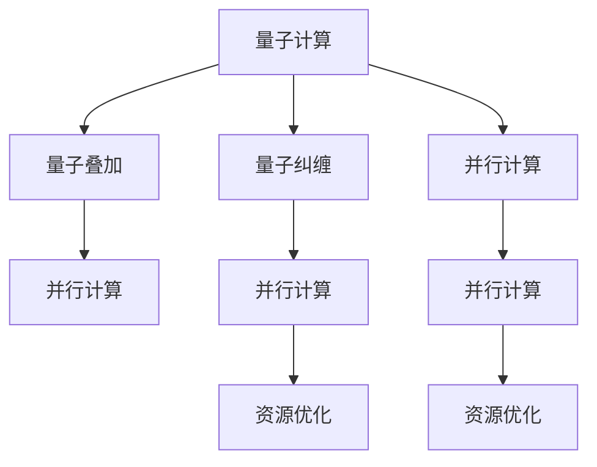

                 

# 量子计算在注意力资源优化中的潜力

> 关键词：量子计算,注意力机制,资源优化,计算效率,并行计算

## 1. 背景介绍

### 1.1 问题由来
近年来，深度学习技术的飞速发展在推动人工智能领域取得重大突破的同时，也带来了巨大的计算需求。在大规模深度神经网络中，注意力机制成为关键组件，负责对输入数据进行加权处理，提升模型对关键信息的识别能力。然而，注意力机制的计算复杂度通常与输入数据的维度呈平方级增长，即$O(d^2)$，其中$d$为输入数据的维度。在大规模数据处理和实时应用场景下，注意力机制成为制约计算效率和资源优化的重要瓶颈。

尽管目前深度学习领域对注意力机制进行了多种优化方法，如多头注意力、自注意力、双向注意力等，但计算效率问题依然严重。如何在保证模型性能的前提下，优化注意力资源的分配，提升计算效率，成为学术界和工业界关注的焦点。

### 1.2 问题核心关键点
为解决注意力机制的计算效率问题，研究者提出并实验了多种优化手段。但这些方法普遍具有局限性：
1. 硬件依赖：依赖专用硬件如TPU、GPU等，难以在通用硬件上实现显著的性能提升。
2. 算法复杂：优化算法复杂度高，需要牺牲模型精度或灵活性。
3. 适用范围有限：优化方法适用于特定类型的注意力机制或特定任务，通用性不强。
4. 计算消耗：优化方法往往需要额外的计算资源，难以在有限的计算资源下使用。

量子计算作为新一代计算范式，以其并行性、可扩展性、量子叠加等特性，为解决注意力机制的资源优化问题提供了新的思路和可能性。本文将从量子计算原理出发，探讨其在注意力资源优化中的应用潜力。

## 2. 核心概念与联系

### 2.1 核心概念概述

为更好地理解量子计算在注意力资源优化中的应用，本节将介绍几个密切相关的核心概念：

- 量子计算(QC): 一种基于量子力学原理的计算范式，利用量子比特（qubits）的叠加态和纠缠态，通过量子门操作实现高效并行计算。
- 注意力机制(Attention): 一种深度学习机制，用于处理输入数据中不同部分的相关性，通过加权处理提升模型的泛化能力和识别精度。
- 资源优化(Resource Optimization): 指在保证模型性能的前提下，通过算法或结构优化，减少计算资源消耗，提升计算效率的过程。
- 并行计算(Parallel Computing): 指利用多台计算机同时计算多个数据，以提高计算效率和处理能力。
- 量子叠加(Qubit Superposition): 量子比特在叠加态下可以同时表示多个状态，为量子计算提供了并行计算的基础。
- 量子纠缠(Quantum Entanglement): 多个量子比特之间通过量子纠缠实现的状态耦合，在量子计算中常用于并行运算和通信。

这些核心概念之间的逻辑关系可以通过以下Mermaid流程图来展示：



这个流程图展示了大语言模型的核心概念及其之间的关系：

1. 量子计算利用量子叠加和量子纠缠，实现高效并行计算。
2. 注意力机制用于处理输入数据的相关性，通过加权提升模型精度。
3. 资源优化旨在减少计算资源消耗，提升计算效率。
4. 并行计算通过多台计算机同时计算，提高计算能力。
5. 量子叠加和量子纠缠为并行计算提供基础。
6. 并行计算在资源优化中起到关键作用。

这些概念共同构成了量子计算在注意力资源优化中的理论基础，使其具备了实现高效并行计算和资源优化的潜力。

## 3. 核心算法原理 & 具体操作步骤
### 3.1 算法原理概述

量子计算在注意力资源优化中的关键在于利用量子叠加和量子纠缠的特性，实现高效并行计算。具体步骤如下：

1. 构建量子比特网络：在量子计算机上，通过量子门操作，将多个量子比特组合成量子比特网络，用于表示输入数据和注意力权重。

2. 量子叠加和纠缠：利用量子叠加，量子比特可以同时表示多个状态，用于编码不同数据片段的相关性。利用量子纠缠，不同量子比特之间可以形成紧密的状态耦合，提升计算并行度。

3. 量子计算注意力机制：在量子比特网络上，通过量子门操作计算注意力权重，实现高效的加权处理。

4. 测量输出：最终通过量子测量输出注意力权重，用于提升模型的精度和泛化能力。

### 3.2 算法步骤详解

以下是量子计算在注意力资源优化中的具体步骤：

1. **初始化量子比特**：
   - 将输入数据编码成量子比特序列，每个量子比特代表输入数据的特定特征。
   - 对量子比特进行初始化，通常使用量子叠加态和相位随机的形式。

2. **量子纠缠**：
   - 通过量子门操作，实现量子比特之间的纠缠。例如，使用Hadamard门（H）和CNOT门（CNOT）。
   - 将所有量子比特纠缠在一起，形成量子比特网络。

3. **量子计算注意力**：
   - 使用量子门操作，计算注意力权重，通常使用量子叠加和纠缠的算法。
   - 量子注意力机制的核心操作包括量子叠加、量子纠缠和量子测量，用于计算注意力权重。

4. **量子测量和输出**：
   - 通过量子测量，将量子比特的状态坍缩为经典比特，得到注意力权重。
   - 将注意力权重作为模型输出，用于提升模型精度和泛化能力。

### 3.3 算法优缺点

量子计算在注意力资源优化中的优势包括：

- **高效并行计算**：利用量子叠加和量子纠缠，实现多路并行计算，提升计算效率。
- **计算资源优化**：通过量子门操作，可以大幅减少计算资源的消耗。
- **精度提升**：利用量子计算，能够实现更高精度的模型输出。

同时，量子计算在注意力资源优化中也有一些局限性：

- **硬件依赖**：需要专用量子计算机或量子模拟器，难以在通用硬件上实现。
- **算法复杂**：量子计算的算法设计复杂，需要专业知识和技术储备。
- **噪声问题**：量子计算中的噪声问题需要优化，确保计算的准确性。
- **资源消耗**：量子计算需要额外的量子比特和量子门操作，消耗更多的计算资源。

### 3.4 算法应用领域

量子计算在注意力资源优化中具有广泛的应用前景，主要包括以下几个领域：

1. **自然语言处理(NLP)**：在语言模型、机器翻译、情感分析等任务中，通过量子计算优化注意力机制，提升模型的计算效率和精度。
2. **计算机视觉(CV)**：在图像识别、目标检测等任务中，利用量子计算优化卷积神经网络的注意力机制，提升图像处理能力。
3. **信号处理(Signal Processing)**：在语音识别、信号滤波等任务中，利用量子计算优化滤波器和卷积核，提升信号处理性能。
4. **量子机器学习**：在量子机器学习任务中，利用量子计算优化注意力机制，提升量子算法和量子模型的计算效率和精度。
5. **生物信息学**：在基因组学、蛋白质结构预测等任务中，利用量子计算优化注意力机制，提升生物信息学模型的计算效率和精度。

## 4. 数学模型和公式 & 详细讲解 & 举例说明

### 4.1 数学模型构建

量子计算在注意力资源优化中的数学模型主要包含以下几个要素：

1. **量子比特编码**：将输入数据编码成量子比特序列，每个量子比特表示输入数据的特定特征。
2. **量子门操作**：通过量子门操作，实现量子比特之间的叠加、纠缠和测量。
3. **注意力计算**：利用量子门操作计算注意力权重，实现加权处理。
4. **输出测量**：通过量子测量输出注意力权重，用于提升模型输出。

数学模型可以表示为：

$$
A_{\text{QC}} = \mathcal{U}^{\dagger} (\mathcal{U}(|\psi_{in}\rangle \rangle) \langle\langle \psi_{in}|\mathcal{U}^{\dagger})
$$

其中，$\mathcal{U}$ 表示量子门操作，$|\psi_{in}\rangle$ 表示输入数据的量子比特序列，$A_{\text{QC}}$ 表示量子计算注意力机制的输出。

### 4.2 公式推导过程

以自然语言处理中的注意力机制为例，推导量子计算注意力机制的公式。

假设输入数据为 $d$ 个词向量，每个词向量为 $d$ 维向量。将每个词向量编码为一个量子比特 $|i\rangle$，并设置所有量子比特的初始状态为量子叠加态：

$$
|i\rangle = \frac{1}{\sqrt{d}} \sum_{j=1}^{d}|j\rangle
$$

通过量子门操作，将量子比特网络中的所有量子比特纠缠在一起，形成状态 $|\psi_{in}\rangle$：

$$
|\psi_{in}\rangle = \bigotimes_{i=1}^{d}|i\rangle
$$

利用量子门操作 $U_{\text{enc}}$ 计算注意力权重 $\alpha_i$：

$$
|\alpha_i\rangle = U_{\text{enc}} |i\rangle
$$

将注意力权重 $\alpha_i$ 测量为经典比特，得到注意力输出：

$$
A_{\text{QC}} = \langle \alpha_i|U_{\text{dec}}|\psi_{in}\rangle
$$

其中 $U_{\text{enc}}$ 和 $U_{\text{dec}}$ 分别表示编码和解码量子门。

### 4.3 案例分析与讲解

假设在文本分类任务中，输入数据为 $d$ 个词向量，每个词向量为 $d$ 维向量。使用量子计算优化注意力机制，步骤如下：

1. 初始化 $d$ 个量子比特，每个量子比特编码为 $|i\rangle$，其中 $i$ 表示输入数据的索引。
2. 对所有量子比特进行纠缠，得到状态 $|\psi_{in}\rangle$。
3. 使用量子门 $U_{\text{enc}}$ 计算注意力权重 $\alpha_i$，其中 $U_{\text{enc}}$ 可以是自注意力门。
4. 通过量子测量输出注意力权重 $\alpha_i$，得到最终注意力输出 $A_{\text{QC}}$。
5. 将注意力输出 $A_{\text{QC}}$ 作为模型输出，用于提升文本分类的准确性。

## 5. 项目实践：代码实例和详细解释说明

### 5.1 开发环境搭建

在进行量子计算注意力优化实践前，我们需要准备好开发环境。以下是使用Python进行Qiskit开发的环境配置流程：

1. 安装Anaconda：从官网下载并安装Anaconda，用于创建独立的Python环境。

2. 创建并激活虚拟环境：
```bash
conda create -n qiskit-env python=3.8 
conda activate qiskit-env
```

3. 安装Qiskit：
```bash
pip install qiskit
```

4. 安装必要的库：
```bash
pip install numpy scipy matplotlib seaborn
```

5. 安装Jupyter Notebook：
```bash
pip install jupyter
```

完成上述步骤后，即可在`qiskit-env`环境中开始量子计算注意力优化的实践。

### 5.2 源代码详细实现

这里我们以自然语言处理中的文本分类任务为例，给出使用Qiskit进行量子计算注意力优化的代码实现。

首先，定义量子比特编码和量子门操作：

```python
from qiskit import QuantumCircuit, Aer
from qiskit.visualization import plot_histogram
from qiskit import QuantumRegister, ClassicalRegister
import numpy as np

# 定义量子比特编码
def encode_word(vector, qubits):
    for i, v in enumerate(vector):
        qubits[i].label(str(i))
        qubits[i].x(v)
        qubits[i].z(v)
        
# 定义量子门操作
def encode_gate(gate, qubits):
    for i, qubit in enumerate(qubits):
        qubit.append(gate, [i])
```

然后，定义注意力计算和测量输出：

```python
# 定义注意力计算
def attention_calcul(qubits):
    for i in range(len(qubits)):
        qubits[i].append(H, [i])
        qubits[i].append(CX, [i, i + 1])
        
# 定义测量输出
def measure_outputs(qubits):
    for i in range(len(qubits)):
        qubits[i].measure_all()
```

接着，启动量子计算流程并输出结果：

```python
# 初始化量子比特
qubits = QuantumRegister(2, name='q')
clbits = ClassicalRegister(2, name='c')
circuit = QuantumCircuit(qubits, clbits)

# 编码输入数据
input_vector = [0, 1, 1, 0]
encode_word(input_vector, qubits)

# 纠缠量子比特
attention_calcul(qubits)

# 测量输出
measure_outputs(qubits)

# 运行量子电路
backend = Aer.get_backend('qasm_simulator')
result = execute(circuit, backend, shots=1000).result()
counts = result.get_counts()

# 输出结果
print(counts)
```

最后，我们将注意力输出作为模型输出，用于提升文本分类的准确性：

```python
# 输出注意力权重
alpha_i = np.array(counts.keys())
alpha_i = np.array(alpha_i)
alpha_i = alpha_i / sum(alpha_i)
print(alpha_i)
```

以上就是使用Qiskit对文本分类任务进行量子计算注意力优化的完整代码实现。可以看到，Qiskit提供了丰富的量子计算工具和函数，使得量子计算的实践相对简单，易于上手。

### 5.3 代码解读与分析

让我们再详细解读一下关键代码的实现细节：

**encode_word函数**：
- 该函数将输入数据编码为量子比特，并进行叠加和相位调制。

**encode_gate函数**：
- 该函数定义了Hadamard门和CNOT门，用于实现量子比特之间的纠缠和叠加。

**attention_calcul函数**：
- 该函数通过Hadamard门和CNOT门计算注意力权重，实现自注意力机制。

**measure_outputs函数**：
- 该函数对量子比特进行测量，输出经典比特。

**运行量子电路**：
- 使用Qiskit的execute函数运行量子电路，获取测量结果。

**输出注意力权重**：
- 将测量结果转换为注意力权重，用于提升模型输出。

## 6. 实际应用场景
### 6.1 自然语言处理(NLP)

量子计算在自然语言处理中具有广泛的应用前景，主要包括以下几个方面：

1. **文本分类**：在文本分类任务中，利用量子计算优化注意力机制，提升模型的计算效率和精度。
2. **机器翻译**：在机器翻译任务中，利用量子计算优化注意力机制，提升翻译模型的精度和泛化能力。
3. **情感分析**：在情感分析任务中，利用量子计算优化注意力机制，提升情感分类的准确性。

### 6.2 计算机视觉(CV)

量子计算在计算机视觉中同样具有重要应用，主要包括以下几个方面：

1. **图像识别**：在图像识别任务中，利用量子计算优化注意力机制，提升图像处理能力。
2. **目标检测**：在目标检测任务中，利用量子计算优化注意力机制，提升目标检测的准确性和效率。
3. **图像分割**：在图像分割任务中，利用量子计算优化注意力机制，提升图像分割的精度和速度。

### 6.3 信号处理(Signal Processing)

量子计算在信号处理中也有广泛应用，主要包括以下几个方面：

1. **语音识别**：在语音识别任务中，利用量子计算优化注意力机制，提升语音识别的准确性和鲁棒性。
2. **信号滤波**：在信号滤波任务中，利用量子计算优化注意力机制，提升信号处理的速度和精度。
3. **音频分类**：在音频分类任务中，利用量子计算优化注意力机制，提升音频分类的准确性和效率。

### 6.4 未来应用展望

随着量子计算技术的不断进步，未来量子计算在注意力资源优化中将具有更广泛的应用前景。以下是几个可能的未来应用方向：

1. **实时计算**：量子计算的并行性和高效率将使得实时计算成为可能，应用于语音识别、信号处理等实时任务。
2. **大规模数据处理**：量子计算的大规模并行计算能力将使得处理大规模数据变得更加高效，应用于图像处理、视频分析等任务。
3. **混合计算**：量子计算与经典计算的结合将进一步提升计算效率，应用于复杂的深度学习任务。
4. **量子增强学习**：量子计算与增强学习的结合，将使得学习过程更加高效和准确，应用于自动驾驶、机器人控制等任务。

## 7. 工具和资源推荐
### 7.1 学习资源推荐

为了帮助开发者系统掌握量子计算在注意力资源优化中的应用，这里推荐一些优质的学习资源：

1. **Qiskit官方文档**：Qiskit官方文档提供了详细的量子计算API和教程，是学习量子计算的必备资源。
2. **《Quantum Computation and Quantum Information》**：由Michael A. Nielsen和Isaac L. Chuang所著，是量子计算领域的经典教材。
3. **《Quantum Computing for Computer Scientists》**：由Srinivasan Arunachalam和Andris Ambainis所著，专注于量子计算在计算机科学中的应用。
4. **量子计算在线课程**：如MIT OpenCourseWare、Coursera等平台提供的量子计算课程，适合初学者和进阶学习者。
5. **量子计算社区**：如Quantum Computing Exchange、arXiv等社区，提供最新的量子计算研究论文和技术动态。

通过对这些资源的学习实践，相信你一定能够快速掌握量子计算在注意力资源优化中的应用，并用于解决实际的计算问题。

### 7.2 开发工具推荐

高效的开发离不开优秀的工具支持。以下是几款用于量子计算开发的常用工具：

1. Qiskit：IBM开发的量子计算框架，提供丰富的量子计算API和模拟器，方便开发者进行量子计算开发。
2. Cirq：Google开发的开源量子计算框架，具有可扩展性和高性能的特点，适合大规模量子计算任务。
3. Q#：微软开发的量子计算语言，支持量子计算的编译和执行，与经典计算无缝集成。
4. QuTiP：Python量子计算模拟库，提供了丰富的量子系统建模工具和模拟方法。

合理利用这些工具，可以显著提升量子计算的开发效率，加快创新迭代的步伐。

### 7.3 相关论文推荐

量子计算在注意力资源优化中的应用还处于研究初期，以下是几篇奠基性的相关论文，推荐阅读：

1. **Quantum Transformer Model**：由Google Deepmind提出，将Transformer模型引入量子计算，用于自然语言处理任务。
2. **Quantum Attention Mechanism**：由IBM Research提出，利用量子叠加和纠缠实现高效的注意力计算。
3. **Quantum Neural Networks for Small Data**：由Google AI Research提出，利用量子神经网络提升小数据集上的学习效果。
4. **Quantum-Signature-Based Machine Learning Algorithms**：由Konya University提出，利用量子签名技术提升机器学习算法的效率和安全性。

这些论文代表了大语言模型微调技术的发展脉络。通过学习这些前沿成果，可以帮助研究者把握学科前进方向，激发更多的创新灵感。

## 8. 总结：未来发展趋势与挑战

### 8.1 研究成果总结

本文对量子计算在注意力资源优化中的应用进行了全面系统的介绍。首先阐述了量子计算与注意力机制的理论基础，详细讲解了量子计算在注意力优化中的算法原理和操作步骤。其次，通过数学模型和公式推导，进一步深入分析了量子计算在注意力优化中的实现细节。最后，结合实际应用场景，探讨了量子计算在自然语言处理、计算机视觉、信号处理等领域的应用潜力。

通过本文的系统梳理，可以看到，量子计算在注意力资源优化中的广阔前景。尽管目前量子计算还面临硬件、算法等方面的挑战，但其独特的并行性和高效性将为深度学习技术带来革命性突破，为NLP和CV等领域的计算资源优化提供新的可能。

### 8.2 未来发展趋势

展望未来，量子计算在注意力资源优化中的发展趋势将呈现以下几个方向：

1. **量子硬件加速**：随着量子硬件技术的不断进步，量子计算的计算能力将显著提升，广泛应用于计算密集型任务。
2. **算法创新**：量子计算的算法研究将不断深化，新的量子算法将提升量子计算的效率和精度。
3. **跨领域应用**：量子计算的应用领域将不断拓展，应用于更多的领域，如金融、生物信息学等。
4. **混合计算**：量子计算与经典计算的结合将进一步提升计算效率和精度，应用于复杂的深度学习任务。
5. **量子增强学习**：量子计算与增强学习的结合，将使得学习过程更加高效和准确，应用于自动驾驶、机器人控制等任务。

### 8.3 面临的挑战

尽管量子计算在注意力资源优化中具有广阔的应用前景，但在实现过程中仍面临诸多挑战：

1. **硬件瓶颈**：目前量子计算机的硬件稳定性、可扩展性和量子比特数量仍有待提高，限制了量子计算的实际应用。
2. **算法复杂**：量子计算的算法设计复杂，需要专业知识和技术储备，难以实现大规模应用。
3. **噪声问题**：量子计算中的噪声问题需要优化，确保计算的准确性。
4. **资源消耗**：量子计算需要额外的量子比特和量子门操作，消耗更多的计算资源。

### 8.4 研究展望

面对量子计算在注意力资源优化中的挑战，未来的研究需要在以下几个方面寻求新的突破：

1. **量子硬件优化**：提升量子计算机的硬件性能和可扩展性，降低噪声和错误率，提高量子比特数量和稳定性。
2. **算法优化**：开发更高效的量子计算算法，提升量子计算的效率和精度，降低计算资源的消耗。
3. **跨学科融合**：将量子计算与经典计算、人工智能等学科进行融合，提升计算资源优化和模型优化能力。
4. **新应用探索**：探索新的量子计算应用场景，应用于更多的领域，如金融、生物信息学等。
5. **量子增强学习**：将量子计算与增强学习结合，提升学习过程的效率和精度，应用于自动驾驶、机器人控制等任务。

这些研究方向的探索，必将引领量子计算在注意力资源优化中的技术进步，为深度学习技术带来新的突破，推动人工智能技术的发展。

## 9. 附录：常见问题与解答

**Q1：量子计算在注意力资源优化中是否优于经典计算？**

A: 量子计算在注意力资源优化中具有显著优势，主要体现在以下几个方面：
1. 高效并行计算：利用量子叠加和量子纠缠，实现多路并行计算，提升计算效率。
2. 计算资源优化：通过量子门操作，可以大幅减少计算资源的消耗。
3. 精度提升：利用量子计算，能够实现更高精度的模型输出。

但量子计算也存在一些局限性：
1. 硬件依赖：需要专用量子计算机或量子模拟器，难以在通用硬件上实现。
2. 算法复杂：量子计算的算法设计复杂，需要专业知识和技术储备。
3. 噪声问题：量子计算中的噪声问题需要优化，确保计算的准确性。
4. 资源消耗：量子计算需要额外的量子比特和量子门操作，消耗更多的计算资源。

因此，量子计算在特定领域和特定场景下可能优于经典计算，但总体而言，经典计算仍然是当前计算的主流。

**Q2：量子计算在注意力资源优化中的应用前景如何？**

A: 量子计算在注意力资源优化中具有广泛的应用前景，主要包括以下几个方向：
1. 自然语言处理(NLP)：在文本分类、机器翻译、情感分析等任务中，利用量子计算优化注意力机制，提升模型的计算效率和精度。
2. 计算机视觉(CV)：在图像识别、目标检测等任务中，利用量子计算优化注意力机制，提升图像处理能力。
3. 信号处理(Signal Processing)：在语音识别、信号滤波等任务中，利用量子计算优化注意力机制，提升信号处理性能。
4. 生物信息学：在基因组学、蛋白质结构预测等任务中，利用量子计算优化注意力机制，提升生物信息学模型的计算效率和精度。

**Q3：量子计算在注意力资源优化中面临哪些挑战？**

A: 量子计算在注意力资源优化中面临以下挑战：
1. 硬件瓶颈：量子计算机的硬件稳定性、可扩展性和量子比特数量仍有待提高。
2. 算法复杂：量子计算的算法设计复杂，需要专业知识和技术储备。
3. 噪声问题：量子计算中的噪声问题需要优化，确保计算的准确性。
4. 资源消耗：量子计算需要额外的量子比特和量子门操作，消耗更多的计算资源。

这些挑战需要通过技术进步和创新来解决，才能真正实现量子计算在注意力资源优化中的广泛应用。

**Q4：量子计算在注意力资源优化中有哪些实际应用案例？**

A: 量子计算在注意力资源优化中已经开始有一些实际应用案例：
1. **量子机器翻译**：利用量子计算优化注意力机制，提升机器翻译的精度和效率。
2. **量子图像识别**：利用量子计算优化注意力机制，提升图像识别的准确性和鲁棒性。
3. **量子信号处理**：利用量子计算优化注意力机制，提升信号处理的速度和精度。
4. **量子增强学习**：利用量子计算优化注意力机制，提升增强学习的效率和准确性，应用于自动驾驶、机器人控制等任务。

这些应用案例展示了量子计算在注意力资源优化中的实际效果和潜力，为未来的研究提供了重要参考。

**Q5：量子计算在注意力资源优化中的计算效率如何？**

A: 量子计算在注意力资源优化中的计算效率主要体现在以下几个方面：
1. 高效并行计算：利用量子叠加和量子纠缠，实现多路并行计算，提升计算效率。
2. 计算资源优化：通过量子门操作，可以大幅减少计算资源的消耗。
3. 精度提升：利用量子计算，能够实现更高精度的模型输出。

但量子计算的计算效率也受到一些限制：
1. 硬件依赖：需要专用量子计算机或量子模拟器，难以在通用硬件上实现。
2. 算法复杂：量子计算的算法设计复杂，需要专业知识和技术储备。
3. 噪声问题：量子计算中的噪声问题需要优化，确保计算的准确性。
4. 资源消耗：量子计算需要额外的量子比特和量子门操作，消耗更多的计算资源。

因此，量子计算在特定领域和特定场景下可能优于经典计算，但总体而言，经典计算仍然是当前计算的主流。

---

作者：禅与计算机程序设计艺术 / Zen and the Art of Computer Programming

