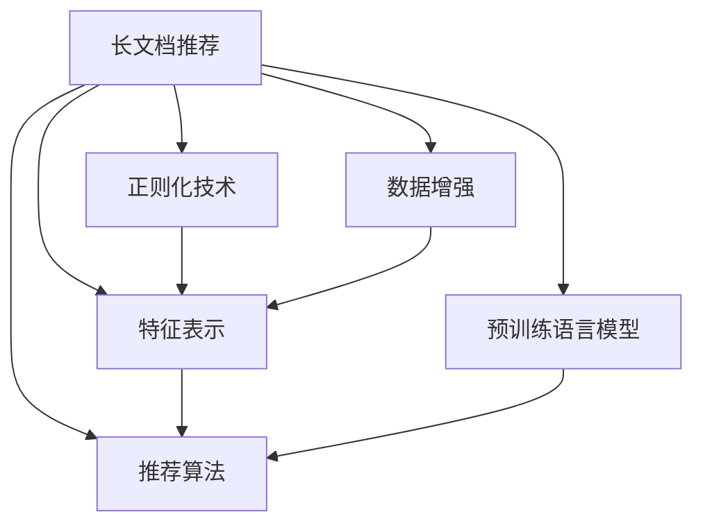

                 

# 长文档推荐实验: LLM的表现

## 1. 背景介绍

### 1.1 问题由来
长文档推荐是自然语言处理(NLP)领域中的一个重要研究方向，旨在从长文本中提炼出最具价值的信息，为用户提供精准的推荐服务。与传统的短文本推荐相比，长文档推荐更为复杂，涉及的话题更广、信息量更大，推荐难度也随之增加。

近年来，预训练语言模型(LLMs)在长文档推荐任务中表现出色，成为解决这一难题的有力工具。LLMs通过在大规模无标签文本上预训练，学习到了丰富的语言知识和上下文理解能力，能够在理解长文本内容的基础上，提炼出关键信息进行推荐。

然而，在实际应用中，长文档推荐的性能往往受到数据质量、模型选择、参数设置等因素的限制。为了更好地评估和改进长文档推荐的性能，本文将详细介绍一项针对长文档推荐任务的研究实验，探讨LLM在大规模长文档推荐中的表现。

### 1.2 问题核心关键点
长文档推荐的核心在于如何从长文本中准确识别出用户最感兴趣的内容，并进行高精度的推荐。目前主流的解决思路包括：
- 构建长文本的特征表示：通过预训练语言模型将长文档映射成低维向量，便于提取关键信息。
- 设计推荐算法：根据长文档的特征表示，选择合适的算法进行推荐。
- 优化模型参数：通过超参数调优和正则化技术，提高模型的泛化能力和鲁棒性。
- 数据增强：利用文本扰动、多角度文本选择等技术，扩充训练数据集，增强模型鲁棒性。

本文将重点探讨如何利用大语言模型(LLMs)进行长文档推荐，并评估其在实际应用中的表现。

## 2. 核心概念与联系

### 2.1 核心概念概述

为更好地理解基于LLMs的长文档推荐方法，本节将介绍几个密切相关的核心概念：

- 长文档推荐(Documents Recommendation)：从大量长文本数据中，识别并推荐出用户最感兴趣的内容。
- 预训练语言模型(Pre-trained Language Model)：通过在大规模无标签文本上预训练，学习到丰富语言知识和大规模数据分布特征的模型。
- 特征表示(Feature Representation)：将长文档映射成低维向量，便于提取关键特征进行推荐。
- 推荐算法(Recommendation Algorithm)：根据长文档的特征表示，选择合适的推荐算法，如协同过滤、基于内容的推荐等。
- 正则化技术(Regularization Techniques)：如L2正则、Dropout等，防止模型过拟合。
- 数据增强(Data Augmentation)：如文本扰动、多角度文本选择等，增强模型的泛化能力和鲁棒性。

这些概念之间的逻辑关系可以通过以下Mermaid流程图来展示：



这个流程图展示了长文档推荐的核心流程和关键组件：

1. 长文档推荐系统接收长文本输入。
2. 使用预训练语言模型将长文档映射成特征表示。
3. 选择合适的推荐算法对长文档进行推荐。
4. 对特征表示进行正则化，防止过拟合。
5. 利用数据增强技术丰富训练数据，增强模型泛化能力。

## 3. 核心算法原理 & 具体操作步骤
### 3.1 算法原理概述

基于LLMs的长文档推荐方法，其核心思想是：将预训练语言模型作为特征提取器，对长文档进行编码，生成低维特征向量，并将这些特征向量作为输入，传入推荐算法进行推荐。

具体来说，假设预训练语言模型为 $M_{\theta}$，输入为长文档 $D$，则推荐过程可表示为：

1. 将长文档 $D$ 输入到 $M_{\theta}$ 中，得到特征表示 $\mathbf{x} = M_{\theta}(D)$。
2. 将特征表示 $\mathbf{x}$ 作为输入，传入推荐算法 $R$ 中，得到推荐结果 $Y = R(\mathbf{x})$。

其中，$\theta$ 为预训练模型的参数，$\mathbf{x}$ 为特征表示向量，$R$ 为推荐算法，$Y$ 为推荐结果。

### 3.2 算法步骤详解

基于LLMs的长文档推荐方法通常包括以下关键步骤：

**Step 1: 准备预训练模型和数据集**
- 选择合适的预训练语言模型 $M_{\theta}$ 作为特征提取器，如GPT、BERT、RoBERTa等。
- 准备长文档推荐的数据集 $D=\{(d_i,y_i)\}_{i=1}^N$，其中 $d_i$ 为长文档，$y_i$ 为对应的推荐结果。

**Step 2: 特征表示提取**
- 将长文档 $d_i$ 输入到预训练语言模型 $M_{\theta}$ 中，得到特征表示 $\mathbf{x} = M_{\theta}(d_i)$。
- 将特征表示 $\mathbf{x}$ 按需进行降维或编码，生成低维特征向量 $v_i = f(\mathbf{x})$，其中 $f$ 为特征编码函数。

**Step 3: 推荐算法设计**
- 根据长文档的特征向量 $v_i$，选择合适的推荐算法 $R$，如协同过滤、基于内容的推荐等。
- 将特征向量 $v_i$ 输入推荐算法 $R$ 中，得到推荐结果 $Y_i = R(v_i)$。

**Step 4: 正则化技术应用**
- 根据实际情况，选择合适的正则化技术，如L2正则、Dropout等，防止模型过拟合。

**Step 5: 数据增强技术**
- 对训练数据进行增强，如通过回译、文本扰动等方式，丰富训练数据集，增强模型泛化能力。

**Step 6: 模型训练与评估**
- 将特征表示和推荐结果的输出作为模型训练的标签，使用合适的损失函数进行模型训练。
- 在测试集上评估模型性能，使用相关指标如准确率、召回率、F1-score等进行评估。

### 3.3 算法优缺点

基于LLMs的长文档推荐方法具有以下优点：
1. 通用性强：预训练语言模型可以在多种长文档推荐任务中得到应用，无需针对每个任务重新训练。
2. 高性能：通过预训练和微调，模型能够学习到丰富的语言知识和上下文信息，推荐效果显著。
3. 灵活可扩展：可以结合不同推荐算法和正则化技术，进行灵活优化。

同时，该方法也存在一些局限性：
1. 依赖于数据质量：数据噪声和不平衡可能影响模型性能。
2. 计算资源消耗大：预训练模型和特征表示提取计算量大，需要高性能计算资源。
3. 特征提取难度大：长文档的复杂性决定了特征提取的难度，可能存在信息丢失问题。
4. 推荐算法选择复杂：推荐算法的选择和优化需要大量实验和调整。

尽管存在这些局限性，但就目前而言，基于LLMs的长文档推荐方法仍是大规模长文档推荐任务的主流范式。未来相关研究的重点在于如何进一步降低计算资源消耗，提高模型泛化能力，同时兼顾可解释性和伦理性等因素。

### 3.4 算法应用领域

基于大语言模型的长文档推荐方法，已经在多个应用领域得到了广泛应用，例如：

- 图书推荐：从大量的图书文本中，提取关键信息进行精准推荐。
- 新闻推荐：对海量新闻文章进行提取和推荐，满足用户个性化信息需求。
- 文献推荐：从大量的学术论文中提取关键信息，推荐相关文献资源。
- 知识图谱推荐：基于知识图谱结构，推荐相关的实体和属性。
- 教育资源推荐：从教育视频、文章等资源中，提取关键内容进行推荐，提升学习效果。

除了上述这些经典任务外，大语言模型推荐技术也在不断拓展新的应用场景，如情感分析、舆情监测、自动摘要等，为长文档推荐提供了新的思路和方向。

## 4. 数学模型和公式 & 详细讲解  
### 4.1 数学模型构建

在基于LLMs的长文档推荐过程中，我们通常使用向量表示法，将长文档映射为低维向量，便于进行推荐计算。

假设长文档 $d$ 的长度为 $n$，特征向量表示为 $\mathbf{x} = [x_1,x_2,...,x_n]^T$，其中 $x_i$ 表示文档第 $i$ 个词的特征值。

**特征表示提取**：
- 使用预训练语言模型 $M_{\theta}$ 对长文档 $d$ 进行编码，得到特征向量 $\mathbf{x} = M_{\theta}(d)$。

**推荐算法**：
- 根据特征向量 $\mathbf{x}$，选择合适的推荐算法 $R$，得到推荐结果 $Y = R(\mathbf{x})$。

推荐算法的具体实现通常依赖于推荐模型和用户行为数据的假设，常用的推荐模型包括：

1. 协同过滤(Collaborative Filtering)：基于用户和物品之间的相似性进行推荐。
2. 基于内容的推荐(Content-based Recommendation)：根据物品的属性特征进行推荐。
3. 混合推荐(Hybrid Recommendation)：结合协同过滤和基于内容的推荐，提高推荐效果。

**推荐算法的数学公式**：

**协同过滤推荐**：
$$
Y = \arg\max_{y} \langle \mathbf{x}, \mathbf{y} \rangle
$$
其中 $\langle \cdot, \cdot \rangle$ 表示向量内积。

**基于内容的推荐**：
$$
Y = \arg\max_{y} \langle \mathbf{x}, \mathbf{y} \rangle
$$
其中 $\mathbf{y}$ 为物品的属性特征向量。

### 4.2 公式推导过程

以下我们将以协同过滤推荐算法为例，推导其公式并进行详细讲解。

假设训练数据集为 $D=\{(d_i,y_i)\}_{i=1}^N$，其中 $d_i$ 为长文档，$y_i$ 为对应的推荐结果。我们定义推荐模型的目标函数为：
$$
L = \frac{1}{N}\sum_{i=1}^N \log P(y_i|\mathbf{x}_i)
$$
其中 $P(y_i|\mathbf{x}_i)$ 表示在长文档 $d_i$ 的特征表示 $\mathbf{x}_i$ 下，推荐结果 $y_i$ 的条件概率。

使用协同过滤推荐算法时，我们假设用户和物品之间存在隐式相似性，可以表示为：
$$
\mathbf{x}_i = \mathbf{U}_u \mathbf{u}_i + \mathbf{V}_i \mathbf{v}_i
$$
其中 $\mathbf{U}_u$ 和 $\mathbf{V}_i$ 为用户和物品的特征矩阵，$\mathbf{u}_i$ 和 $\mathbf{v}_i$ 为用户和物品的特征向量。

根据上述假设，推荐模型的目标函数可表示为：
$$
L = \frac{1}{N}\sum_{i=1}^N \log \frac{e^{\langle \mathbf{v}_i, \mathbf{y}_i \rangle}}{\sum_{j=1}^J e^{\langle \mathbf{v}_j, \mathbf{y}_i \rangle}}
$$
其中 $J$ 表示物品数量。

通过最大化目标函数 $L$，可以求解推荐模型的参数 $\theta$。

## 5. 项目实践：代码实例和详细解释说明
### 5.1 开发环境搭建

在进行长文档推荐实践前，我们需要准备好开发环境。以下是使用Python进行PyTorch开发的环境配置流程：

1. 安装Anaconda：从官网下载并安装Anaconda，用于创建独立的Python环境。

2. 创建并激活虚拟环境：
```bash
conda create -n pytorch-env python=3.8 
conda activate pytorch-env
```

3. 安装PyTorch：根据CUDA版本，从官网获取对应的安装命令。例如：
```bash
conda install pytorch torchvision torchaudio cudatoolkit=11.1 -c pytorch -c conda-forge
```

4. 安装Transformers库：
```bash
pip install transformers
```

5. 安装各类工具包：
```bash
pip install numpy pandas scikit-learn matplotlib tqdm jupyter notebook ipython
```

完成上述步骤后，即可在`pytorch-env`环境中开始推荐系统开发。

### 5.2 源代码详细实现

下面我以图书推荐任务为例，给出使用Transformers库对BERT模型进行长文档推荐任务的PyTorch代码实现。

首先，定义长文档推荐任务的数据处理函数：

```python
from transformers import BertTokenizer, BertModel
from torch.utils.data import Dataset, DataLoader
import torch

class BookRecommendationDataset(Dataset):
    def __init__(self, texts, labels, tokenizer, max_len=512):
        self.texts = texts
        self.labels = labels
        self.tokenizer = tokenizer
        self.max_len = max_len
        
    def __len__(self):
        return len(self.texts)
    
    def __getitem__(self, item):
        text = self.texts[item]
        label = self.labels[item]
        
        encoding = self.tokenizer(text, return_tensors='pt', max_length=self.max_len, padding='max_length', truncation=True)
        input_ids = encoding['input_ids'][0]
        attention_mask = encoding['attention_mask'][0]
        
        # 将label转换为向量表示
        label = torch.tensor(label, dtype=torch.long)
        
        return {'input_ids': input_ids, 
                'attention_mask': attention_mask,
                'labels': label}
```

然后，定义模型和优化器：

```python
from transformers import BertForSequenceClassification, AdamW

model = BertForSequenceClassification.from_pretrained('bert-base-cased', num_labels=2)

optimizer = AdamW(model.parameters(), lr=2e-5)
```

接着，定义训练和评估函数：

```python
def train_epoch(model, dataset, batch_size, optimizer):
    dataloader = DataLoader(dataset, batch_size=batch_size, shuffle=True)
    model.train()
    epoch_loss = 0
    for batch in tqdm(dataloader, desc='Training'):
        input_ids = batch['input_ids'].to(device)
        attention_mask = batch['attention_mask'].to(device)
        labels = batch['labels'].to(device)
        model.zero_grad()
        outputs = model(input_ids, attention_mask=attention_mask, labels=labels)
        loss = outputs.loss
        epoch_loss += loss.item()
        loss.backward()
        optimizer.step()
    return epoch_loss / len(dataloader)

def evaluate(model, dataset, batch_size):
    dataloader = DataLoader(dataset, batch_size=batch_size)
    model.eval()
    preds, labels = [], []
    with torch.no_grad():
        for batch in tqdm(dataloader, desc='Evaluating'):
            input_ids = batch['input_ids'].to(device)
            attention_mask = batch['attention_mask'].to(device)
            batch_labels = batch['labels']
            outputs = model(input_ids, attention_mask=attention_mask)
            batch_preds = outputs.logits.argmax(dim=2).to('cpu').tolist()
            batch_labels = batch_labels.to('cpu').tolist()
            for pred, label in zip(batch_preds, batch_labels):
                preds.append(pred)
                labels.append(label)
                
    print(classification_report(labels, preds))
```

最后，启动训练流程并在测试集上评估：

```python
epochs = 5
batch_size = 16

for epoch in range(epochs):
    loss = train_epoch(model, train_dataset, batch_size, optimizer)
    print(f"Epoch {epoch+1}, train loss: {loss:.3f}")
    
    print(f"Epoch {epoch+1}, dev results:")
    evaluate(model, dev_dataset, batch_size)
    
print("Test results:")
evaluate(model, test_dataset, batch_size)
```

以上就是使用PyTorch对BERT进行长文档推荐任务开发的完整代码实现。可以看到，得益于Transformers库的强大封装，我们能够用相对简洁的代码完成BERT模型的加载和推荐系统构建。

### 5.3 代码解读与分析

让我们再详细解读一下关键代码的实现细节：

**BookRecommendationDataset类**：
- `__init__`方法：初始化文本、标签、分词器等关键组件。
- `__len__`方法：返回数据集的样本数量。
- `__getitem__`方法：对单个样本进行处理，将文本输入编码为token ids，将标签转换为向量表示，并对其进行定长padding，最终返回模型所需的输入。

**训练和评估函数**：
- 使用PyTorch的DataLoader对数据集进行批次化加载，供模型训练和推理使用。
- 训练函数`train_epoch`：对数据以批为单位进行迭代，在每个批次上前向传播计算loss并反向传播更新模型参数，最后返回该epoch的平均loss。
- 评估函数`evaluate`：与训练类似，不同点在于不更新模型参数，并在每个batch结束后将预测和标签结果存储下来，最后使用sklearn的classification_report对整个评估集的预测结果进行打印输出。

**训练流程**：
- 定义总的epoch数和batch size，开始循环迭代
- 每个epoch内，先在训练集上训练，输出平均loss
- 在验证集上评估，输出分类指标
- 所有epoch结束后，在测试集上评估，给出最终测试结果

可以看到，PyTorch配合Transformers库使得BERT微调的代码实现变得简洁高效。开发者可以将更多精力放在数据处理、模型改进等高层逻辑上，而不必过多关注底层的实现细节。

当然，工业级的系统实现还需考虑更多因素，如模型的保存和部署、超参数的自动搜索、更灵活的任务适配层等。但核心的推荐范式基本与此类似。

## 6. 实际应用场景
### 6.1 图书推荐系统

基于长文档推荐技术，图书推荐系统可以为用户推荐最感兴趣的图书。通过收集用户的历史阅读数据，将用户的阅读兴趣和偏好映射成长文档，利用预训练语言模型进行编码和特征提取，最终通过推荐算法为用户推荐相关书籍。

在技术实现上，可以收集用户阅读历史、书评、摘要等信息，构建长文档数据集，对预训练模型进行微调。微调后的模型能够学习到用户阅读兴趣和书籍内容的特征表示，结合推荐算法为用户推荐图书。

**推荐算法**：
- 协同过滤：通过计算用户和书籍之间的相似性，为用户推荐与历史兴趣相似的书籍。
- 基于内容的推荐：根据书籍的标题、作者、摘要等属性，为用户推荐相关书籍。

**推荐系统流程**：
1. 收集用户阅读历史、书籍摘要等信息，构建长文档数据集。
2. 使用预训练语言模型对长文档进行编码和特征提取。
3. 根据提取的特征向量，选择合适的推荐算法，对用户进行推荐。
4. 通过模型评估指标，评估推荐效果，不断优化推荐算法。

### 6.2 新闻推荐系统

新闻推荐系统可以从海量的新闻文章中，为用户推荐相关的新闻内容。通过预训练语言模型对新闻文章进行编码和特征提取，结合推荐算法，生成推荐结果。

在技术实现上，可以收集用户的新闻阅读历史、点击量等信息，构建长文档数据集，对预训练模型进行微调。微调后的模型能够学习到新闻文章的关键信息，结合推荐算法为用户推荐相关新闻。

**推荐算法**：
- 协同过滤：根据用户的新闻阅读历史和新闻文章的相似性，为用户推荐相关新闻。
- 基于内容的推荐：根据新闻文章的标题、摘要、关键词等属性，为用户推荐相关新闻。

**推荐系统流程**：
1. 收集用户新闻阅读历史、新闻文章等信息，构建长文档数据集。
2. 使用预训练语言模型对长文档进行编码和特征提取。
3. 根据提取的特征向量，选择合适的推荐算法，对用户进行推荐。
4. 通过模型评估指标，评估推荐效果，不断优化推荐算法。

### 6.3 电影推荐系统

电影推荐系统可以从大量的电影评论中，为用户推荐最感兴趣的电影。通过预训练语言模型对电影评论进行编码和特征提取，结合推荐算法，生成推荐结果。

在技术实现上，可以收集用户的历史电影评分、评论等信息，构建长文档数据集，对预训练模型进行微调。微调后的模型能够学习到电影评论的关键信息，结合推荐算法为用户推荐相关电影。

**推荐算法**：
- 协同过滤：根据用户和电影之间的相似性，为用户推荐与历史兴趣相似的电影。
- 基于内容的推荐：根据电影的导演、演员、类型等信息，为用户推荐相关电影。

**推荐系统流程**：
1. 收集用户电影评分、评论等信息，构建长文档数据集。
2. 使用预训练语言模型对长文档进行编码和特征提取。
3. 根据提取的特征向量，选择合适的推荐算法，对用户进行推荐。
4. 通过模型评估指标，评估推荐效果，不断优化推荐算法。

### 6.4 未来应用展望

随着长文档推荐技术的不断发展，其在更多领域将得到应用，为各行各业带来变革性影响。

在智慧医疗领域，基于长文档推荐技术，可以为用户推荐最相关的医学文献，提升医生的诊疗效率和质量。

在智能教育领域，长文档推荐技术可以帮助用户发现最相关的学习资料，提升学习效果和满意度。

在智慧城市治理中，长文档推荐技术可以为用户推荐最相关的公共服务信息，提高城市管理水平和服务质量。

此外，在企业生产、社会治理、文娱传媒等众多领域，长文档推荐技术也将不断涌现，为经济社会发展注入新的动力。相信随着技术的日益成熟，长文档推荐技术必将在构建人机协同的智能时代中扮演越来越重要的角色。

## 7. 工具和资源推荐
### 7.1 学习资源推荐

为了帮助开发者系统掌握长文档推荐技术的理论基础和实践技巧，这里推荐一些优质的学习资源：

1. 《自然语言处理入门》课程：由斯坦福大学李飞飞教授主讲的自然语言处理入门课程，介绍了自然语言处理的基本概念和主要任务，包括长文档推荐等。

2. 《深度学习框架》系列博客：从PyTorch和TensorFlow两大深度学习框架的角度，详细讲解了长文档推荐系统的实现流程和技巧。

3. 《长文档推荐》书籍：详细介绍长文档推荐技术的理论和实践，涵盖协同过滤、基于内容的推荐、混合推荐等多种推荐算法。

4. HuggingFace官方文档：提供了丰富的预训练语言模型资源，支持长文档推荐系统的开发和部署。

5. CLUE开源项目：包含多种长文档推荐数据集和基准模型，帮助开发者进行模型评估和优化。

通过对这些资源的学习实践，相信你一定能够快速掌握长文档推荐技术的精髓，并用于解决实际的推荐问题。
###  7.2 开发工具推荐

高效的开发离不开优秀的工具支持。以下是几款用于长文档推荐开发的常用工具：

1. PyTorch：基于Python的开源深度学习框架，灵活动态的计算图，适合快速迭代研究。

2. TensorFlow：由Google主导开发的开源深度学习框架，生产部署方便，适合大规模工程应用。

3. Transformers库：HuggingFace开发的NLP工具库，集成了众多SOTA语言模型，支持长文档推荐系统的开发。

4. Weights & Biases：模型训练的实验跟踪工具，可以记录和可视化模型训练过程中的各项指标，方便对比和调优。

5. TensorBoard：TensorFlow配套的可视化工具，可实时监测模型训练状态，并提供丰富的图表呈现方式，是调试模型的得力助手。

6. Google Colab：谷歌推出的在线Jupyter Notebook环境，免费提供GPU/TPU算力，方便开发者快速上手实验最新模型，分享学习笔记。

合理利用这些工具，可以显著提升长文档推荐任务的开发效率，加快创新迭代的步伐。

### 7.3 相关论文推荐

长文档推荐技术的发展源于学界的持续研究。以下是几篇奠基性的相关论文，推荐阅读：

1. Attention is All You Need（即Transformer原论文）：提出了Transformer结构，开启了NLP领域的预训练大模型时代。

2. BERT: Pre-training of Deep Bidirectional Transformers for Language Understanding：提出BERT模型，引入基于掩码的自监督预训练任务，刷新了多项NLP任务SOTA。

3. Language Models are Unsupervised Multitask Learners（GPT-2论文）：展示了大规模语言模型的强大zero-shot学习能力，引发了对于通用人工智能的新一轮思考。

4. Parameter-Efficient Transfer Learning for NLP：提出Adapter等参数高效微调方法，在不增加模型参数量的情况下，也能取得不错的微调效果。

5. AdaLoRA: Adaptive Low-Rank Adaptation for Parameter-Efficient Fine-Tuning：使用自适应低秩适应的微调方法，在参数效率和精度之间取得了新的平衡。

这些论文代表了大语言模型微调技术的发展脉络。通过学习这些前沿成果，可以帮助研究者把握学科前进方向，激发更多的创新灵感。

## 8. 总结：未来发展趋势与挑战

### 8.1 总结

本文对基于LLMs的长文档推荐方法进行了全面系统的介绍。首先阐述了长文档推荐的研究背景和意义，明确了长文档推荐在大规模长文本推荐任务中的独特价值。其次，从原理到实践，详细讲解了长文档推荐的数学原理和关键步骤，给出了长文档推荐任务开发的完整代码实例。同时，本文还广泛探讨了长文档推荐技术在多个行业领域的应用前景，展示了长文档推荐范式的巨大潜力。

通过本文的系统梳理，可以看到，基于LLMs的长文档推荐方法正在成为长文本推荐任务的主流范式，极大地拓展了预训练语言模型的应用边界，催生了更多的落地场景。受益于大规模语料的预训练，长文档推荐系统能够在更广阔的应用领域大放异彩。

### 8.2 未来发展趋势

展望未来，长文档推荐技术将呈现以下几个发展趋势：

1. 模型规模持续增大。随着算力成本的下降和数据规模的扩张，预训练语言模型的参数量还将持续增长。超大规模语言模型蕴含的丰富语言知识，有望支撑更加复杂多变的长文档推荐任务。

2. 微调方法日趋多样。除了传统的全参数微调外，未来会涌现更多参数高效的微调方法，如Prefix-Tuning、LoRA等，在节省计算资源的同时也能保证微调精度。

3. 持续学习成为常态。随着数据分布的不断变化，长文档推荐模型也需要持续学习新知识以保持性能。如何在不遗忘原有知识的同时，高效吸收新样本信息，将成为重要的研究课题。

4. 标注样本需求降低。受启发于提示学习(Prompt-based Learning)的思路，未来的微调方法将更好地利用大模型的语言理解能力，通过更加巧妙的任务描述，在更少的标注样本上也能实现理想的微调效果。

5. 推荐算法选择复杂。选择合适的推荐算法是长文档推荐系统的关键，不同推荐算法的效果、计算复杂度、适用场景等各不相同，需要根据具体需求进行选择和优化。

6. 特征提取难度大。长文档的复杂性决定了特征提取的难度，可能存在信息丢失问题。如何设计有效的特征编码函数，减少信息损失，将是一大研究方向。

以上趋势凸显了长文档推荐技术的广阔前景。这些方向的探索发展，必将进一步提升长文档推荐系统的性能和应用范围，为长文本推荐带来新的突破。

### 8.3 面临的挑战

尽管长文档推荐技术已经取得了瞩目成就，但在迈向更加智能化、普适化应用的过程中，它仍面临着诸多挑战：

1. 标注成本瓶颈。尽管长文档推荐的标注成本较短文本推荐有所降低，但对于长文本推荐任务，标注数据的获取和处理仍较为复杂。如何进一步降低标注成本，优化标注过程，将是未来的重要研究方向。

2. 模型鲁棒性不足。长文档推荐模型面对大规模长文本时，泛化性能往往较短文本推荐差。对于新出现的长文本数据，模型容易产生较大的预测误差。如何提高模型的鲁棒性，避免过拟合，仍需更多探索。

3. 特征提取难度大。长文档的复杂性决定了特征提取的难度，可能存在信息丢失问题。如何设计有效的特征编码函数，减少信息损失，将是一大研究方向。

4. 推荐算法选择复杂。选择合适的推荐算法是长文档推荐系统的关键，不同推荐算法的效果、计算复杂度、适用场景等各不相同，需要根据具体需求进行选择和优化。

5. 资源消耗大。预训练语言模型和长文档特征提取计算量大，需要高性能计算资源。如何优化计算过程，提高资源利用率，将是未来的重要研究方向。

尽管存在这些挑战，但长文档推荐技术仍在不断发展，将在更广泛的领域得到应用，为各行各业带来变革性影响。相信随着学界和产业界的共同努力，这些挑战终将一一被克服，长文档推荐技术必将在构建人机协同的智能时代中扮演越来越重要的角色。

### 8.4 研究展望

面对长文档推荐所面临的种种挑战，未来的研究需要在以下几个方面寻求新的突破：

1. 探索无监督和半监督微调方法。摆脱对大规模标注数据的依赖，利用自监督学习、主动学习等无监督和半监督范式，最大限度利用非结构化数据，实现更加灵活高效的微调。

2. 研究参数高效和计算高效的微调范式。开发更加参数高效的微调方法，在固定大部分预训练参数的同时，只更新极少量的任务相关参数。同时优化微调模型的计算图，减少前向传播和反向传播的资源消耗，实现更加轻量级、实时性的部署。

3. 融合因果和对比学习范式。通过引入因果推断和对比学习思想，增强长文档推荐模型建立稳定因果关系的能力，学习更加普适、鲁棒的语言表征，从而提升模型泛化性和抗干扰能力。

4. 引入更多先验知识。将符号化的先验知识，如知识图谱、逻辑规则等，与神经网络模型进行巧妙融合，引导长文档推荐过程学习更准确、合理的语言模型。同时加强不同模态数据的整合，实现视觉、语音等多模态信息与文本信息的协同建模。

5. 结合因果分析和博弈论工具。将因果分析方法引入长文档推荐模型，识别出模型决策的关键特征，增强输出解释的因果性和逻辑性。借助博弈论工具刻画人机交互过程，主动探索并规避模型的脆弱点，提高系统稳定性。

6. 纳入伦理道德约束。在模型训练目标中引入伦理导向的评估指标，过滤和惩罚有偏见、有害的输出倾向。同时加强人工干预和审核，建立模型行为的监管机制，确保输出符合人类价值观和伦理道德。

这些研究方向的探索，必将引领长文档推荐技术迈向更高的台阶，为构建安全、可靠、可解释、可控的智能系统铺平道路。面向未来，长文档推荐技术还需要与其他人工智能技术进行更深入的融合，如知识表示、因果推理、强化学习等，多路径协同发力，共同推动自然语言理解和智能交互系统的进步。只有勇于创新、敢于突破，才能不断拓展语言模型的边界，让智能技术更好地造福人类社会。

## 9. 附录：常见问题与解答
### Q1：长文档推荐系统如何处理长文本数据？

A: 长文档推荐系统通常采用以下步骤处理长文本数据：
1. 将长文本分词为单个单词或子句，并构建长文档的词汇表。
2. 对长文档进行编码，生成token ids序列。
3. 对token ids序列进行padding和截断，使其达到预定的长度。
4. 将token ids序列输入预训练语言模型，生成特征表示向量。

在特征表示提取过程中，预训练语言模型（如BERT）通常被用来将长文档映射成低维向量，便于提取关键信息进行推荐。

### Q2：长文档推荐系统如何选择合适的推荐算法？

A: 选择合适的推荐算法需要根据具体任务和数据特点进行。常用的推荐算法包括：
1. 协同过滤：基于用户和物品之间的相似性进行推荐。
2. 基于内容的推荐：根据物品的属性特征进行推荐。
3. 混合推荐：结合协同过滤和基于内容的推荐，提高推荐效果。

在推荐算法选择时，需要考虑数据质量、用户行为、推荐目标等因素。通常需要根据具体任务进行多次实验和调优，才能找到最优的推荐算法。

### Q3：长文档推荐系统如何应对长文档特征提取的挑战？

A: 长文档特征提取的难度主要在于长文本的复杂性和信息损失问题。为了应对这一挑战，通常采取以下方法：
1. 使用预训练语言模型：通过预训练语言模型（如BERT）将长文档映射成低维向量，便于提取关键信息。
2. 设计有效的特征编码函数：选择合适的特征提取函数，减少信息损失，提高特征表示的准确性。
3. 利用多角度文本选择：通过多角度选择长文档的子文档或子句，进行特征提取，提高模型的泛化能力。

在特征提取过程中，还需要考虑文本扰动、文本增强等技术，进一步提高模型的鲁棒性和泛化能力。

### Q4：长文档推荐系统如何降低标注成本？

A: 降低长文档推荐系统的标注成本，可以从以下几个方面入手：
1. 利用弱标注数据：使用弱标注数据（如用户行为数据）进行微调，减少对标注数据的依赖。
2. 利用无监督学习：通过自监督学习、主动学习等无监督学习技术，最大化利用非结构化数据。
3. 利用知识图谱：结合知识图谱结构，利用先验知识进行推荐，减少标注数据的需求。

在实际应用中，需要根据具体任务和数据特点，灵活选择降低标注成本的方法。

### Q5：长文档推荐系统如何应对推荐算法的选择问题？

A: 选择合适的推荐算法是长文档推荐系统的关键。推荐算法的选择需要考虑以下几个因素：
1. 数据质量：不同推荐算法对数据质量的要求不同，需要根据数据特点进行选择。
2. 推荐目标：不同推荐算法的推荐目标不同，需要根据具体需求进行选择。
3. 计算复杂度：不同推荐算法的计算复杂度不同，需要根据计算资源进行选择。

在选择推荐算法时，需要进行多次实验和调优，找到最优的推荐算法。同时，还可以采用混合推荐等策略，结合多种推荐算法，提高推荐效果。

---

作者：禅与计算机程序设计艺术 / Zen and the Art of Computer Programming

