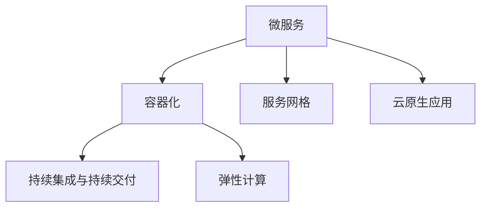

                 

# 阿里云Native应用开发

## 1. 背景介绍

阿里云（Alibaba Cloud）作为全球领先的云计算服务提供商，其“云原生”基础设施——云原生应用（Native Applications），正迅速成为一种新的应用形态。云原生应用开发利用云平台提供的弹性资源、微服务架构、自动化部署、持续集成与持续交付（CI/CD）等技术，构建高效、稳定、可扩展的应用系统。在当今数字化转型的大背景下，云计算正被广泛应用于各个行业，帮助企业实现业务的敏捷化、自动化、持续化和智能化。

云原生应用开发已成为未来软件开发的主流趋势，被越来越多企业和开发者所采纳。阿里云 Native 应用开发则提供了基于云原生架构的应用开发框架、服务和工具，支持企业构建云原生应用，加速企业数字化转型进程。

## 2. 核心概念与联系

### 2.1 核心概念概述

阿里云 Native 应用开发涉及多个关键概念，这些概念之间有着密切的联系，构成了完整的云原生应用开发体系。

- **云原生应用**：基于云原生架构（如微服务、容器化、服务网格、声明式编程等）开发的应用程序。其特点包括弹性和可扩展性、高可用性和容错性、可服务化、持续交付与持续集成。

- **微服务**：将大应用拆分为多个小型服务，每个服务运行在一个独立的进程中，具有独立部署和扩展能力。微服务通过服务网格（如Istio）进行管理和通信。

- **容器化**：使用容器技术（如Docker）封装应用，每个应用以容器形式运行。容器隔离了应用运行环境，确保应用的独立性和稳定性。

- **服务网格**：通过服务网格（如Istio）实现服务之间的通信和调度，保证服务的高可用性和容错性，简化服务的复杂性。

- **持续集成与持续交付**：通过持续集成与持续交付工具（如Jenkins、Travis CI）自动化测试、打包和部署应用，确保代码质量、减少人工干预。

- **弹性计算**：利用云平台提供的弹性计算资源，根据负载动态调整计算资源，实现应用的水平扩展和弹性伸缩。

这些概念之间相互依存，共同构成了阿里云 Native 应用开发的完整体系。在实际开发中，需要综合运用这些技术手段，才能构建出高效、稳定、可扩展的云原生应用。

### 2.2 核心概念原理和架构的 Mermaid 流程图



## 3. 核心算法原理 & 具体操作步骤

### 3.1 算法原理概述

阿里云 Native 应用开发涉及多种技术，但核心算法原理以微服务、容器化和持续集成与持续交付为主。

- **微服务架构**：采用微服务架构将大应用拆分为多个小型服务，每个服务独立部署、独立扩展。每个服务具有高内聚、低耦合的特点，易于独立开发、测试和部署。

- **容器化技术**：使用容器技术封装应用，每个应用以容器形式运行。容器隔离了应用运行环境，确保应用的独立性和稳定性。

- **持续集成与持续交付**：通过持续集成与持续交付工具，自动化测试、打包和部署应用，确保代码质量、减少人工干预，加速应用开发和部署。

### 3.2 算法步骤详解

阿里云 Native 应用开发的步骤主要包括：

1. **应用拆分**：将大应用拆分为多个小型服务。每个服务独立运行，具有独立部署和扩展能力。

2. **服务部署**：将服务打包为容器镜像，通过云平台提供的容器编排服务（如Kubernetes）进行部署和管理。

3. **服务通信**：使用服务网格（如Istio）实现服务之间的通信和调度，保证服务的高可用性和容错性。

4. **持续集成与持续交付**：通过持续集成与持续交付工具，自动化测试、打包和部署应用，确保代码质量、减少人工干预，加速应用开发和部署。

5. **弹性计算**：利用云平台提供的弹性计算资源，根据负载动态调整计算资源，实现应用的水平扩展和弹性伸缩。

### 3.3 算法优缺点

阿里云 Native 应用开发的优势在于：

- **高可用性和容错性**：通过微服务和服务网格技术，保证服务的独立性和高可用性。

- **弹性扩展**：利用云平台提供的弹性计算资源，根据负载动态调整计算资源，实现应用的水平扩展和弹性伸缩。

- **持续交付与持续集成**：通过持续集成与持续交付工具，自动化测试、打包和部署应用，确保代码质量、减少人工干预，加速应用开发和部署。

- **灵活性和可扩展性**：采用微服务架构，每个服务独立运行，具有独立部署和扩展能力，易于应对业务变化和扩展需求。

但阿里云 Native 应用开发也存在一些局限性：

- **学习曲线较高**：微服务、容器化、服务网格等新技术需要开发者掌握新的开发和部署流程，增加了学习成本。

- **资源消耗较大**：容器化和服务网格等技术虽然提供了更强的灵活性和扩展性，但也会带来一定的资源消耗和运行成本。

- **运维复杂性增加**：微服务架构和容器化部署带来了更多的运维复杂性，需要运维人员具备较高的专业水平。

### 3.4 算法应用领域

阿里云 Native 应用开发主要应用于以下领域：

- **金融服务**：银行、证券、保险等金融企业利用阿里云 Native 应用开发构建高可用、高可扩展的金融系统。

- **电商零售**：淘宝、天猫等电商企业利用阿里云 Native 应用开发构建高性能、高可扩展的电商系统。

- **医疗健康**：医院、诊所等医疗机构利用阿里云 Native 应用开发构建高效、稳定的医疗系统。

- **政府公共服务**：政府部门利用阿里云 Native 应用开发构建高效、便捷的公共服务平台。

## 4. 数学模型和公式 & 详细讲解 & 举例说明

### 4.1 数学模型构建

阿里云 Native 应用开发中的数学模型主要涉及持续集成与持续交付（CI/CD）的自动化流程。

- **持续集成（CI）**：将代码提交到代码仓库后，通过自动化工具自动触发构建、测试和部署流程。持续集成模型可以表示为：
$$CI: C = C_b + C_t + C_d$$
其中 $C$ 表示持续集成流程，$C_b$ 表示构建，$C_t$ 表示测试，$C_d$ 表示部署。

- **持续交付（CD）**：在持续集成的基础上，将软件包自动推送到生产环境，进行自动部署和发布。持续交付模型可以表示为：
$$CD: P = P_a + P_t + P_r$$
其中 $P$ 表示持续交付流程，$P_a$ 表示自动测试，$P_t$ 表示自动部署，$P_r$ 表示自动发布。

### 4.2 公式推导过程

以持续集成和持续交付的数学模型为例，推导自动化流程的计算公式。

假设代码提交频率为 $f$，每次提交需要进行构建、测试和部署，分别需要时间 $t_b$、$t_t$ 和 $t_d$。则持续集成流程的计算公式为：
$$C = f(t_b + t_t + t_d)$$

在持续交付流程中，每个阶段的自动测试、部署和发布都需要一定的时间，假设自动测试时间为 $t_a$、自动部署时间为 $t_t$、自动发布时间为 $t_r$。则持续交付流程的计算公式为：
$$P = f(t_a + t_t + t_r)$$

通过上述公式，可以计算出持续集成和持续交付流程的时间消耗，从而优化流程，提高效率。

### 4.3 案例分析与讲解

以阿里巴巴集团的“飞猪”为例，分析其在阿里云 Native 应用开发中的应用。

“飞猪”是一款在线旅游应用，利用阿里云 Native 应用开发构建了高效、稳定的系统。应用采用了微服务架构，将大应用拆分为多个小型服务，每个服务独立运行、独立扩展。服务之间通过Istio进行通信和调度，保证服务的高可用性和容错性。同时，利用阿里云的弹性计算资源，根据负载动态调整计算资源，实现应用的水平扩展和弹性伸缩。持续集成与持续交付工具（如Jenkins）自动化测试、打包和部署应用，确保代码质量、减少人工干预，加速应用开发和部署。

## 5. 项目实践：代码实例和详细解释说明

### 5.1 开发环境搭建

阿里云 Native 应用开发涉及多种技术，需要搭建多种开发环境。以下是搭建基本开发环境的步骤：

1. **安装Docker**：Docker是容器化技术的核心工具，安装Docker并启动容器服务。

2. **安装Kubernetes**：Kubernetes是云平台提供的容器编排服务，通过Kubernetes进行容器编排和管理。

3. **安装Istio**：Istio是服务网格技术，通过Istio实现服务之间的通信和调度。

4. **安装Jenkins**：Jenkins是持续集成与持续交付工具，通过Jenkins自动化测试、打包和部署应用。

5. **安装Elastic Kubernetes Service（EKS）**：EKS是阿里云提供的云原生应用平台，通过EKS进行容器编排和资源管理。

### 5.2 源代码详细实现

以下是一个简单的Spring Boot应用程序的阿里云 Native 应用开发示例。

```java
@SpringBootApplication
public class MyApplication {
    public static void main(String[] args) {
        SpringApplication.run(MyApplication.class, args);
    }
}
```

使用Spring Boot框架，可以快速构建微服务应用。在微服务架构中，每个服务独立运行、独立扩展，具有高内聚、低耦合的特点，易于独立开发、测试和部署。

### 5.3 代码解读与分析

**Spring Boot框架**：Spring Boot是Spring框架的简化版，提供了快速搭建Web应用、微服务应用等功能。Spring Boot应用采用Spring容器进行管理，支持RESTful API、JPA、Redis等多种技术。

**Spring Cloud**：Spring Cloud是基于Spring Boot的云应用开发框架，支持微服务架构、服务网格、声明式编程等功能。通过Spring Cloud，可以构建高可用、高可扩展的云原生应用。

**EKS**：EKS是阿里云提供的云原生应用平台，提供了弹性计算资源、容器编排、服务网格等云原生应用开发所需的功能。使用EKS可以简化应用开发和部署流程，提高应用的可扩展性和稳定性。

### 5.4 运行结果展示

阿里云 Native 应用开发的运行结果包括：

- **应用部署**：通过Kubernetes将服务部署到云平台，实现应用的自动扩展和弹性伸缩。

- **服务通信**：通过Istio实现服务之间的通信和调度，保证服务的高可用性和容错性。

- **持续集成与持续交付**：通过Jenkins自动化测试、打包和部署应用，确保代码质量、减少人工干预，加速应用开发和部署。

## 6. 实际应用场景

### 6.1 金融服务

金融服务是阿里云 Native 应用开发的重要应用场景之一。银行、证券、保险等金融机构利用阿里云 Native 应用开发构建高可用、高可扩展的金融系统。例如，利用微服务架构拆分大应用，将交易系统、风控系统、结算系统等独立部署、独立扩展，每个服务具有独立部署和扩展能力。通过Istio实现服务之间的通信和调度，保证服务的高可用性和容错性。利用云平台提供的弹性计算资源，根据负载动态调整计算资源，实现应用的水平扩展和弹性伸缩。持续集成与持续交付工具（如Jenkins）自动化测试、打包和部署应用，确保代码质量、减少人工干预，加速应用开发和部署。

### 6.2 电商零售

电商零售是阿里云 Native 应用开发的另一个重要应用场景。淘宝、天猫等电商企业利用阿里云 Native 应用开发构建高性能、高可扩展的电商系统。例如，利用微服务架构拆分大应用，将订单系统、库存系统、支付系统等独立部署、独立扩展，每个服务具有独立部署和扩展能力。通过Istio实现服务之间的通信和调度，保证服务的高可用性和容错性。利用云平台提供的弹性计算资源，根据负载动态调整计算资源，实现应用的水平扩展和弹性伸缩。持续集成与持续交付工具（如Jenkins）自动化测试、打包和部署应用，确保代码质量、减少人工干预，加速应用开发和部署。

### 6.3 医疗健康

医疗健康是阿里云 Native 应用开发的又一重要应用场景。医院、诊所等医疗机构利用阿里云 Native 应用开发构建高效、稳定的医疗系统。例如，利用微服务架构拆分大应用，将挂号系统、诊疗系统、病历系统等独立部署、独立扩展，每个服务具有独立部署和扩展能力。通过Istio实现服务之间的通信和调度，保证服务的高可用性和容错性。利用云平台提供的弹性计算资源，根据负载动态调整计算资源，实现应用的水平扩展和弹性伸缩。持续集成与持续交付工具（如Jenkins）自动化测试、打包和部署应用，确保代码质量、减少人工干预，加速应用开发和部署。

### 6.4 政府公共服务

政府公共服务是阿里云 Native 应用开发的另一个重要应用场景。政府部门利用阿里云 Native 应用开发构建高效、便捷的公共服务平台。例如，利用微服务架构拆分大应用，将政务服务、公共安全、城市管理等独立部署、独立扩展，每个服务具有独立部署和扩展能力。通过Istio实现服务之间的通信和调度，保证服务的高可用性和容错性。利用云平台提供的弹性计算资源，根据负载动态调整计算资源，实现应用的水平扩展和弹性伸缩。持续集成与持续交付工具（如Jenkins）自动化测试、打包和部署应用，确保代码质量、减少人工干预，加速应用开发和部署。

## 7. 工具和资源推荐

### 7.1 学习资源推荐

阿里云 Native 应用开发涉及多种技术，需要学习多种开发工具和框架。以下是推荐的几个学习资源：

1. **阿里云官网**：阿里云官网提供丰富的云原生应用开发文档和教程，涵盖微服务、容器化、服务网格、持续集成与持续交付等技术。

2. **Kubernetes文档**：Kubernetes文档提供了详细的容器编排服务文档和示例代码，帮助开发者掌握Kubernetes的使用。

3. **Istio文档**：Istio文档提供了详细的服务网格技术文档和示例代码，帮助开发者掌握Istio的使用。

4. **Spring Boot文档**：Spring Boot文档提供了详细的微服务开发文档和示例代码，帮助开发者掌握Spring Boot的使用。

5. **Jenkins文档**：Jenkins文档提供了详细的持续集成与持续交付工具文档和示例代码，帮助开发者掌握Jenkins的使用。

通过这些学习资源，开发者可以快速掌握阿里云 Native 应用开发的各项技术，构建高效、稳定的云原生应用。

### 7.2 开发工具推荐

阿里云 Native 应用开发涉及多种开发工具和框架，以下是推荐的几款开发工具：

1. **Docker**：Docker是容器化技术的核心工具，用于构建、管理和运行容器镜像。

2. **Kubernetes**：Kubernetes是云平台提供的容器编排服务，用于管理和部署容器化应用。

3. **Istio**：Istio是服务网格技术，用于实现服务之间的通信和调度。

4. **Jenkins**：Jenkins是持续集成与持续交付工具，用于自动化测试、打包和部署应用。

5. **Elastic Kubernetes Service（EKS）**：EKS是阿里云提供的云原生应用平台，用于管理和扩展容器化应用。

通过这些工具，开发者可以高效地构建和部署阿里云 Native 应用，实现应用的自动化、持续化和持续交付。

### 7.3 相关论文推荐

阿里云 Native 应用开发涉及多种技术，以下是推荐的几篇相关论文：

1. **微服务架构**：Pawson S. et al. "Microservices Architecture"。探讨了微服务架构的设计原则和实现方法。

2. **容器化技术**：McGovern S. et al. "Designing Microservices: A Practical Guide"。介绍了容器化技术的基本概念和实现方法。

3. **服务网格技术**：Istio团队. "Istio: Open Platform for Microservices"。介绍了Istio服务网格技术的核心概念和实现方法。

4. **持续集成与持续交付**：Fawcett T. et al. "Continuous Integration and Continuous Deployment"。介绍了持续集成与持续交付工具的基本概念和实现方法。

5. **弹性计算技术**：Alberts M. et al. "Cloud Computing: Principles and Paradigms"。介绍了弹性计算技术的基本概念和实现方法。

这些论文可以帮助开发者深入理解阿里云 Native 应用开发的核心技术，掌握相关技术的应用方法。

## 8. 总结：未来发展趋势与挑战

### 8.1 研究成果总结

阿里云 Native 应用开发是未来软件开发的主流趋势，其核心技术包括微服务、容器化、服务网格、持续集成与持续交付等。阿里云 Native 应用开发具有高可用性、高可扩展性、持续交付等特点，已经在金融服务、电商零售、医疗健康、政府公共服务等多个领域得到广泛应用。

### 8.2 未来发展趋势

阿里云 Native 应用开发将呈现以下几个发展趋势：

1. **生态系统完善**：阿里云 Native 应用开发的生态系统将不断完善，涵盖更多技术栈和开发工具，提供更丰富的应用场景和开发框架。

2. **持续交付与持续集成**：持续交付与持续集成将成为未来软件开发的主流，通过自动化工具和平台，实现应用的快速开发和部署。

3. **多云一体化**：阿里云 Native 应用开发将支持多云平台和混合云环境，实现应用的跨云迁移和部署。

4. **微服务治理**：微服务治理将成为未来软件开发的关键技术，通过服务网格、服务发现、负载均衡等技术，实现服务的稳定运行和高可用性。

5. **全栈云原生**：阿里云 Native 应用开发将涵盖更多技术栈，包括DevOps、云基础设施、云原生应用平台等，实现全栈云原生开发。

### 8.3 面临的挑战

阿里云 Native 应用开发虽然前景广阔，但也面临一些挑战：

1. **学习成本高**：微服务、容器化、服务网格等新技术需要开发者掌握新的开发和部署流程，增加了学习成本。

2. **资源消耗大**：容器化和服务网格等技术虽然提供了更强的灵活性和扩展性，但也会带来一定的资源消耗和运行成本。

3. **运维复杂性高**：微服务架构和容器化部署带来了更多的运维复杂性，需要运维人员具备较高的专业水平。

### 8.4 研究展望

阿里云 Native 应用开发的研究展望包括：

1. **智能化微服务治理**：通过AI技术实现微服务的智能治理，提高微服务系统的稳定性和自动化水平。

2. **多语言支持**：支持多种编程语言和框架，提供更丰富的开发工具和应用场景。

3. **全栈云原生**：构建全栈云原生生态系统，涵盖云基础设施、云原生应用平台、DevOps等技术。

4. **多云一体化**：支持多云平台和混合云环境，实现应用的跨云迁移和部署。

5. **边缘计算**：将阿里云 Native 应用开发延伸到边缘计算，实现更近的数据处理和低延迟应用。

通过这些研究方向，阿里云 Native 应用开发将逐步迈向智能化、全栈化和一体化，为企业提供更高效、稳定、可扩展的云原生应用。

## 9. 附录：常见问题与解答

### Q1：阿里云 Native 应用开发是否适用于所有应用场景？

A: 阿里云 Native 应用开发适用于绝大多数应用场景，特别是高并发、高可扩展的应用场景，如电商零售、金融服务、医疗健康等。但在一些特定领域，如实时数据处理、低延迟计算等，可能需要采用其他技术进行优化。

### Q2：阿里云 Native 应用开发是否需要掌握多种新技术？

A: 是的，阿里云 Native 应用开发涉及多种新技术，包括微服务、容器化、服务网格、持续集成与持续交付等。开发者需要掌握这些新技术的基本概念和实现方法，才能构建高效、稳定的云原生应用。

### Q3：阿里云 Native 应用开发的运维成本是否较高？

A: 阿里云 Native 应用开发的运维成本确实较高，但可以通过多种手段进行优化，如自动化运维、DevOps工具、弹性计算等。同时，阿里云 Native 应用开发的弹性计算能力，也能有效降低运维成本。

### Q4：阿里云 Native 应用开发是否适合小型企业？

A: 阿里云 Native 应用开发适合各种规模的企业，特别是需要快速部署、快速迭代、快速交付的应用场景。阿里云 Native 应用开发提供的弹性计算、持续集成与持续交付等技术，能够帮助小型企业快速构建高效、稳定的应用系统。

通过这些常见问题的解答，开发者可以更好地理解阿里云 Native 应用开发的优势和挑战，选择合适的技术手段，构建高效、稳定的云原生应用。

---

作者：禅与计算机程序设计艺术 / Zen and the Art of Computer Programming

