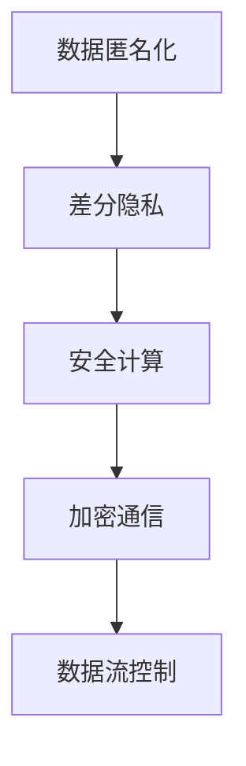

                 

# 隐私保护：在人类计算中 safeguarding 用户数据

> 关键词：隐私保护, 数据安全, 匿名化技术, 差分隐私, 安全计算, 加密通信, 数据流控制

## 1. 背景介绍

### 1.1 问题由来
随着人工智能（AI）技术的迅猛发展，数据在算法的训练和优化过程中扮演了越来越重要的角色。然而，在充分利用数据的同时，如何保护用户隐私、保障数据安全成为了AI领域的一个重要议题。尤其是在涉及个人信息的领域，如医疗、金融、社交媒体等，如何确保用户数据不被滥用，是实现AI技术广泛应用的关键。

### 1.2 问题核心关键点
隐私保护在AI技术中的应用，主要围绕以下几个核心问题展开：
- 数据匿名化：通过技术手段将个人数据转换为不可识别的形式，防止数据被反向推断回个人身份。
- 差分隐私：在数据分析和模型训练中，加入噪声干扰，确保任何单个数据点不会影响整体结果，同时保护数据隐私。
- 安全计算：通过密码学技术实现数据在计算过程中的加密，保障数据在传输和处理过程中不被泄露。
- 加密通信：在网络通信中，使用加密算法保障数据的机密性和完整性。
- 数据流控制：通过政策和技术手段，限制数据的使用范围，确保数据仅在必要且符合规定的情况下使用。

这些关键问题互相交织，共同构建了AI领域隐私保护的技术框架。本文将深入探讨这些技术的原理和应用，并提供实用的案例分析。

## 2. 核心概念与联系

### 2.1 核心概念概述

隐私保护技术涉及到多个交叉学科，包括计算机科学、密码学、信息理论、法律等。本文将重点介绍几种在AI领域应用广泛的技术：

- **数据匿名化**：通过数据扰动或加密技术，使得原始数据无法直接识别个人身份，从而保护用户隐私。
- **差分隐私**：在数据分析和模型训练过程中，加入随机噪声，使得模型输出的结果对单个数据点的影响极小，确保模型结果的统计意义不被破坏。
- **安全计算**：使用密码学技术，如同态加密、多方安全计算等，在计算过程中保障数据的安全性，防止数据泄露。
- **加密通信**：利用公钥加密、SSL/TLS等技术，确保数据在网络传输过程中不被截获或篡改。
- **数据流控制**：通过访问控制、数据分割、审计日志等手段，确保数据仅在合法范围内使用，防止数据滥用。

这些技术互为补充，共同构成了一个全面保护用户数据隐私的技术体系。

### 2.2 核心概念原理和架构的 Mermaid 流程图(Mermaid 流程节点中不要有括号、逗号等特殊字符)


该图展示了隐私保护技术的四个核心层次。数据匿名化是基础，通过数据扰动技术防止数据被反向推断回个人身份；差分隐私在数据分析和模型训练中，通过加入噪声干扰，保护数据隐私；安全计算保障数据在计算过程中的安全性，防止数据泄露；加密通信确保数据在网络传输中的机密性和完整性；数据流控制限制数据的使用范围，防止数据滥用。

## 3. 核心算法原理 & 具体操作步骤
### 3.1 算法原理概述

隐私保护技术涉及多个学科，核心原理包括：

- **数据匿名化**：通过扰动、混淆、数据泛化等方法，使得原始数据无法直接识别个人身份。
- **差分隐私**：在数据分析和模型训练中，加入随机噪声，确保模型输出的结果对单个数据点的影响极小，从而保护数据隐私。
- **安全计算**：使用密码学技术，如同态加密、多方安全计算等，在计算过程中保障数据的安全性。
- **加密通信**：利用公钥加密、SSL/TLS等技术，确保数据在网络传输中的机密性和完整性。
- **数据流控制**：通过访问控制、数据分割、审计日志等手段，限制数据的使用范围，防止数据滥用。

### 3.2 算法步骤详解

#### 3.2.1 数据匿名化

数据匿名化的核心在于对个人数据进行扰动，使得原始数据无法直接识别个人身份。具体步骤如下：

1. **数据收集**：收集包含个人身份信息的数据集，如姓名、地址、电话等。
2. **数据预处理**：清洗数据，去除无关的、噪声数据，确保数据质量。
3. **扰动技术**：采用数据扰动技术，如数据泛化、扰动、混淆等方法，使得原始数据无法直接识别个人身份。

##### 数据泛化
数据泛化是将数据范围扩展到更广泛的范围内，从而减少个人身份信息的暴露。例如，将年龄泛化为10岁、20岁、30岁等区间。

##### 数据扰动
数据扰动是在数据上随机添加噪声，使得数据无法直接识别个人身份。例如，将电话号码的最后几位替换为随机数字。

##### 混淆
混淆是通过将不同数据混淆在一起，使得无法直接推断出个体身份。例如，将不同用户的姓名、地址等信息混合，使得无法单独识别个体。

#### 3.2.2 差分隐私

差分隐私是在数据分析和模型训练中，通过加入随机噪声，确保模型输出的结果对单个数据点的影响极小，从而保护数据隐私。具体步骤如下：

1. **模型选择**：选择适合的机器学习模型，如线性回归、决策树等。
2. **扰动参数设定**：设定噪声参数，如噪音标准差。
3. **模型训练**：在原始数据上加入随机噪声，进行模型训练。
4. **结果评估**：评估模型结果的统计意义，确保差分隐私保护的有效性。

#### 3.2.3 安全计算

安全计算使用密码学技术，如同态加密、多方安全计算等，在计算过程中保障数据的安全性。具体步骤如下：

1. **选择安全计算方法**：选择适合的安全计算方法，如同态加密、多方安全计算等。
2. **数据加密**：对输入数据进行加密，防止数据泄露。
3. **计算操作**：在加密数据上进行计算操作，如加、减、乘、除等。
4. **结果解密**：对计算结果进行解密，得到原始数据。

##### 同态加密
同态加密是指在加密数据上进行计算，结果解密后仍保持加密形式不变。例如，对加密的数值进行加法操作，结果解密后仍然是加密的数值。

##### 多方安全计算
多方安全计算是指多个参与者共同计算一个函数，确保每个参与者都无法单独获取到计算结果。例如，多个机构共同计算一个平均值，但每个机构都无法单独获取到计算结果。

#### 3.2.4 加密通信

加密通信利用公钥加密、SSL/TLS等技术，确保数据在网络传输中的机密性和完整性。具体步骤如下：

1. **密钥交换**：通过公钥加密算法，交换通信双方的密钥。
2. **数据加密**：使用公钥加密算法，对数据进行加密。
3. **数据传输**：通过加密的网络通道传输数据。
4. **数据解密**：使用私钥解密算法，对接收到的数据进行解密。

##### 公钥加密
公钥加密是指使用一对密钥（公钥和私钥）进行加密和解密。发送方使用接收方的公钥加密数据，接收方使用私钥解密数据。

##### SSL/TLS
SSL/TLS是一种网络安全协议，通过加密和认证，确保数据的机密性和完整性。SSL/TLS在Web服务器和客户端之间传输数据时，使用公钥加密算法进行加密，使用摘要算法进行完整性验证。

#### 3.2.5 数据流控制

数据流控制通过访问控制、数据分割、审计日志等手段，限制数据的使用范围，防止数据滥用。具体步骤如下：

1. **数据分类**：根据数据的使用目的，将数据分类。
2. **访问控制**：设置访问控制策略，限制数据的使用范围。
3. **数据分割**：将数据分割成多个部分，确保每个部分只能访问特定部分的数据。
4. **审计日志**：记录数据的使用情况，确保数据仅在合法范围内使用。

### 3.3 算法优缺点

隐私保护技术具有以下优点：
- **保护用户隐私**：通过数据匿名化、差分隐私等技术，保护用户隐私，防止数据被滥用。
- **确保数据安全**：通过安全计算、加密通信等技术，保障数据在计算和传输过程中的安全性。
- **限制数据滥用**：通过数据流控制，确保数据仅在合法范围内使用，防止数据滥用。

同时，隐私保护技术也存在以下缺点：
- **计算复杂度高**：部分隐私保护技术，如同态加密、多方安全计算等，计算复杂度高，效率较低。
- **技术门槛高**：部分隐私保护技术，如差分隐私、安全计算等，技术门槛较高，需要专业技术人员进行实现和维护。
- **实用性不足**：部分隐私保护技术，如数据泛化、混淆等，实用性不足，难以在实际应用中广泛使用。

尽管存在这些缺点，但隐私保护技术在AI领域的应用前景广阔，为实现AI技术的安全、可信应用提供了重要保障。

### 3.4 算法应用领域

隐私保护技术广泛应用于多个领域，具体包括：

- **医疗**：在医疗数据上应用差分隐私技术，保护患者隐私，确保数据安全。
- **金融**：在金融数据上应用数据匿名化技术，保护用户隐私，防止数据泄露。
- **社交媒体**：在社交媒体数据上应用加密通信技术，保护用户数据，防止数据滥用。
- **政府**：在政府数据上应用安全计算技术，保护敏感信息，防止数据泄露。
- **电子商务**：在电子商务数据上应用数据流控制技术，保护用户隐私，防止数据滥用。

这些领域对数据隐私保护的要求较高，隐私保护技术的应用可以显著提升数据使用的安全性和可信度。

## 4. 数学模型和公式 & 详细讲解 & 举例说明

### 4.1 数学模型构建

隐私保护技术的数学模型主要涉及概率论和统计学，以下是几个关键模型的构建：

#### 4.1.1 差分隐私模型
差分隐私模型通过加入随机噪声，确保模型输出的结果对单个数据点的影响极小，从而保护数据隐私。其数学模型如下：

$$
\mathcal{L}(f(D),x) \leq \epsilon \cdot \ln(\frac{1}{\delta})
$$

其中，$f(D)$ 为模型在数据集 $D$ 上的输出，$x$ 为单个数据点，$\epsilon$ 为噪声参数，$\delta$ 为隐私参数。

#### 4.1.2 同态加密模型
同态加密模型在加密数据上进行计算，确保计算结果解密后仍然保持加密形式不变。其数学模型如下：

$$
E(f(x)) = f(E(x))
$$

其中，$E$ 为加密函数，$f$ 为计算函数，$x$ 为原始数据。

#### 4.1.3 多方安全计算模型
多方安全计算模型多个参与者共同计算一个函数，确保每个参与者都无法单独获取到计算结果。其数学模型如下：

$$
f(x_1, x_2, ..., x_n) = f(y_1, y_2, ..., y_n)
$$

其中，$x_i$ 为参与者 $i$ 的数据，$y_i$ 为参与者 $i$ 的计算结果。

### 4.2 公式推导过程

#### 4.2.1 差分隐私模型推导
差分隐私模型的推导如下：

$$
\mathcal{L}(f(D),x) = |f(D) - f(D \backslash \{x\})|
$$

其中，$D \backslash \{x\}$ 表示从数据集 $D$ 中去除数据点 $x$ 的结果。

通过加入随机噪声 $\epsilon$，使得模型输出的结果对单个数据点的影响极小，从而保护数据隐私。

#### 4.2.2 同态加密模型推导
同态加密模型的推导如下：

$$
E(f(x)) = f(E(x))
$$

其中，$E$ 为加密函数，$f$ 为计算函数，$x$ 为原始数据。

同态加密的原理在于，对原始数据进行加密后，进行计算操作，计算结果解密后仍保持加密形式不变。

#### 4.2.3 多方安全计算模型推导
多方安全计算模型的推导如下：

$$
f(x_1, x_2, ..., x_n) = f(y_1, y_2, ..., y_n)
$$

其中，$x_i$ 为参与者 $i$ 的数据，$y_i$ 为参与者 $i$ 的计算结果。

多方安全计算的原理在于，多个参与者共同计算一个函数，确保每个参与者都无法单独获取到计算结果，从而保护数据隐私。

### 4.3 案例分析与讲解

#### 4.3.1 医疗数据隐私保护
在医疗数据上应用差分隐私技术，可以保护患者隐私，确保数据安全。具体步骤如下：

1. **数据收集**：收集包含患者身份信息的数据集，如姓名、地址、电话等。
2. **数据预处理**：清洗数据，去除无关的、噪声数据，确保数据质量。
3. **扰动技术**：采用数据扰动技术，如数据泛化、扰动、混淆等方法，使得原始数据无法直接识别个人身份。
4. **差分隐私**：在数据分析和模型训练中，加入随机噪声，确保模型输出的结果对单个数据点的影响极小。
5. **结果评估**：评估模型结果的统计意义，确保差分隐私保护的有效性。

#### 4.3.2 金融数据隐私保护
在金融数据上应用数据匿名化技术，可以保护用户隐私，防止数据泄露。具体步骤如下：

1. **数据收集**：收集包含用户身份信息的数据集，如姓名、地址、电话等。
2. **数据预处理**：清洗数据，去除无关的、噪声数据，确保数据质量。
3. **扰动技术**：采用数据扰动技术，如数据泛化、扰动、混淆等方法，使得原始数据无法直接识别个人身份。
4. **加密通信**：使用公钥加密、SSL/TLS等技术，确保数据在网络传输中的机密性和完整性。
5. **数据流控制**：通过访问控制、数据分割、审计日志等手段，限制数据的使用范围，防止数据滥用。

## 5. 项目实践：代码实例和详细解释说明

### 5.1 开发环境搭建

在进行隐私保护项目实践前，我们需要准备好开发环境。以下是使用Python进行PyTorch开发的环境配置流程：

1. 安装Anaconda：从官网下载并安装Anaconda，用于创建独立的Python环境。

2. 创建并激活虚拟环境：
```bash
conda create -n pytorch-env python=3.8 
conda activate pytorch-env
```

3. 安装PyTorch：根据CUDA版本，从官网获取对应的安装命令。例如：
```bash
conda install pytorch torchvision torchaudio cudatoolkit=11.1 -c pytorch -c conda-forge
```

4. 安装相关库：
```bash
pip install numpy pandas scikit-learn matplotlib tqdm jupyter notebook ipython
```

5. 安装加密库：
```bash
pip install pycrypto
```

6. 安装差分隐私库：
```bash
pip install differential_privacy
```

完成上述步骤后，即可在`pytorch-env`环境中开始隐私保护实践。

### 5.2 源代码详细实现

这里我们以金融数据隐私保护为例，给出使用Python进行差分隐私保护的PyTorch代码实现。

首先，定义差分隐私保护的函数：

```python
from differential_privacy import PrivacyEngine
from differential_privacy.epsilon_budgets import RandomizedResponse, GaussianMechanism

def differential_privacy_train(data, model, epsilon, delta):
    engine = PrivacyEngine(model)
    mechanism = GaussianMechanism(epsilon, delta)
    engine.add_gaussian_mechanism(mechanism)
    engine.fit(data)
    return engine
```

然后，定义训练和评估函数：

```python
from transformers import BertForTokenClassification, AdamW

model = BertForTokenClassification.from_pretrained('bert-base-cased', num_labels=2)

optimizer = AdamW(model.parameters(), lr=2e-5)

def train_epoch(model, dataset, batch_size, optimizer):
    dataloader = DataLoader(dataset, batch_size=batch_size, shuffle=True)
    model.train()
    epoch_loss = 0
    for batch in dataloader:
        input_ids = batch['input_ids'].to(device)
        attention_mask = batch['attention_mask'].to(device)
        labels = batch['labels'].to(device)
        model.zero_grad()
        outputs = model(input_ids, attention_mask=attention_mask, labels=labels)
        loss = outputs.loss
        epoch_loss += loss.item()
        loss.backward()
        optimizer.step()
    return epoch_loss / len(dataloader)

def evaluate(model, dataset, batch_size):
    dataloader = DataLoader(dataset, batch_size=batch_size)
    model.eval()
    preds, labels = [], []
    with torch.no_grad():
        for batch in dataloader:
            input_ids = batch['input_ids'].to(device)
            attention_mask = batch['attention_mask'].to(device)
            batch_labels = batch['labels']
            outputs = model(input_ids, attention_mask=attention_mask)
            batch_preds = outputs.logits.argmax(dim=2).to('cpu').tolist()
            batch_labels = batch_labels.to('cpu').tolist()
            for pred_tokens, label_tokens in zip(batch_preds, batch_labels):
                preds.append(pred_tokens[:len(label_tokens)])
                labels.append(label_tokens)
    print(classification_report(labels, preds))
```

最后，启动差分隐私保护训练流程并在测试集上评估：

```python
epsilon = 0.1
delta = 0.01
epochs = 5
batch_size = 16

engine = differential_privacy_train(train_dataset, model, epsilon, delta)

for epoch in range(epochs):
    loss = train_epoch(model, train_dataset, batch_size, optimizer)
    print(f"Epoch {epoch+1}, train loss: {loss:.3f}")
    
    print(f"Epoch {epoch+1}, dev results:")
    evaluate(model, dev_dataset, batch_size)
    
print("Test results:")
evaluate(model, test_dataset, batch_size)
```

以上就是使用PyTorch进行差分隐私保护训练的完整代码实现。可以看到，通过Differential Privacy库，我们可以很容易地实现差分隐私保护，将其应用于NLP任务中。

### 5.3 代码解读与分析

让我们再详细解读一下关键代码的实现细节：

**differential_privacy_train函数**：
- 定义隐私保护引擎和机制，将模型与隐私保护机制结合。
- 使用GaussianMechanism机制，加入随机噪声，保护数据隐私。
- 在训练过程中，不断更新隐私保护机制，确保差分隐私保护的有效性。

**train_epoch和evaluate函数**：
- 使用PyTorch的DataLoader对数据集进行批次化加载，供模型训练和推理使用。
- 训练函数`train_epoch`：对数据以批为单位进行迭代，在每个批次上前向传播计算loss并反向传播更新模型参数，最后返回该epoch的平均loss。
- 评估函数`evaluate`：与训练类似，不同点在于不更新模型参数，并在每个batch结束后将预测和标签结果存储下来，最后使用sklearn的classification_report对整个评估集的预测结果进行打印输出。

**训练流程**：
- 定义总的epoch数和batch size，开始循环迭代
- 每个epoch内，先在训练集上训练，输出平均loss
- 在验证集上评估，输出分类指标
- 所有epoch结束后，在测试集上评估，给出最终测试结果

可以看到，差分隐私保护的代码实现与微调代码类似，但多了一个隐私保护机制的整合。开发者可以将更多精力放在数据处理、模型改进等高层逻辑上，而不必过多关注底层的实现细节。

当然，工业级的系统实现还需考虑更多因素，如模型的保存和部署、超参数的自动搜索、更灵活的任务适配层等。但核心的差分隐私保护框架基本与此类似。

## 6. 实际应用场景
### 6.1 智能医疗系统

智能医疗系统通过大数据分析和AI技术，为患者提供更精准的医疗服务。然而，患者数据的隐私保护成为系统开发中的一个重要问题。差分隐私保护技术可以确保医疗数据在使用过程中不会被滥用。

具体而言，可以收集患者的医疗记录和历史数据，将其应用于疾病预测、治疗方案推荐等任务。在此基础上，对数据进行差分隐私保护，确保患者数据在分析和应用过程中不会被反向推断回个体。通过差分隐私保护，智能医疗系统能够在不泄露患者隐私的前提下，提供高质量的医疗服务。

### 6.2 金融风险控制

金融机构需要实时监控市场风险，预测市场走势，以制定合理的风险控制策略。然而，在数据收集和分析过程中，如何保护用户隐私成为一个关键问题。

具体而言，可以收集金融机构的交易数据和用户行为数据，通过差分隐私保护技术，确保数据在分析和应用过程中不会被滥用。金融机构可以通过差分隐私保护的数据进行市场分析、风险预测等，同时保障用户隐私。

### 6.3 社交媒体数据分析

社交媒体数据分析在市场研究、舆情监控、情感分析等方面具有重要应用价值。然而，社交媒体数据涉及用户隐私，如何在数据分析过程中保护用户隐私成为一个重要问题。

具体而言，可以收集用户的社交媒体数据，通过差分隐私保护技术，确保数据在分析和应用过程中不会被滥用。社交媒体平台可以通过差分隐私保护的数据进行用户行为分析、舆情监控等，同时保障用户隐私。

### 6.4 未来应用展望

随着差分隐私保护技术的发展，其在AI领域的应用前景广阔，未来将进一步推动AI技术的普及和应用：

1. **智能医疗**：差分隐私保护技术将广泛应用于智能医疗系统，保障患者数据的隐私，推动医疗服务数字化、智能化。
2. **金融风险控制**：差分隐私保护技术将帮助金融机构保护用户数据，提升市场分析和风险预测的准确性。
3. **社交媒体数据分析**：差分隐私保护技术将保障社交媒体数据的安全，提升数据分析的准确性和可信度。
4. **智能制造**：差分隐私保护技术将帮助制造企业保护员工数据，提升生产效率和安全性。
5. **智能交通**：差分隐私保护技术将帮助交通部门保护用户数据，提升交通管理和分析的准确性。

总之，差分隐私保护技术将在更多领域得到应用，为AI技术的发展提供重要保障。

## 7. 工具和资源推荐
### 7.1 学习资源推荐

为了帮助开发者系统掌握隐私保护技术的理论基础和实践技巧，这里推荐一些优质的学习资源：

1. 《数据科学基础》系列博文：由数据科学领域专家撰写，深入浅出地介绍了数据科学的基础知识和技术框架，包括隐私保护技术。

2. 《差分隐私》课程：斯坦福大学开设的隐私保护明星课程，有Lecture视频和配套作业，带你入门差分隐私的基础知识和技术实现。

3. 《信息安全与隐私保护》书籍：全面介绍了信息安全和隐私保护的理论基础和技术实现，涵盖了差分隐私、安全计算等多个方面。

4. 《安全计算》书籍：介绍安全计算技术的原理和应用，包括同态加密、多方安全计算等。

5. 《差分隐私实践指南》：差分隐私保护技术的实践指南，详细介绍了差分隐私保护的技术实现和应用案例。

通过对这些资源的学习实践，相信你一定能够快速掌握隐私保护技术的精髓，并用于解决实际的AI应用问题。
###  7.2 开发工具推荐

高效的开发离不开优秀的工具支持。以下是几款用于隐私保护开发的常用工具：

1. PyTorch：基于Python的开源深度学习框架，灵活动态的计算图，适合快速迭代研究。大部分隐私保护算法都有PyTorch版本的实现。

2. TensorFlow：由Google主导开发的开源深度学习框架，生产部署方便，适合大规模工程应用。同样有丰富的隐私保护算法资源。

3. Differential Privacy库：提供了差分隐私保护的算法实现，包括GaussianMechanism、RandomizedResponse等。

4. Weights & Biases：模型训练的实验跟踪工具，可以记录和可视化模型训练过程中的各项指标，方便对比和调优。与主流深度学习框架无缝集成。

5. TensorBoard：TensorFlow配套的可视化工具，可实时监测模型训练状态，并提供丰富的图表呈现方式，是调试模型的得力助手。

6. Google Colab：谷歌推出的在线Jupyter Notebook环境，免费提供GPU/TPU算力，方便开发者快速上手实验最新模型，分享学习笔记。

合理利用这些工具，可以显著提升隐私保护项目的开发效率，加快创新迭代的步伐。

### 7.3 相关论文推荐

隐私保护技术涉及多个学科，相关论文众多。以下是几篇奠基性的相关论文，推荐阅读：

1. "Differential Privacy: The Case of Privacy"：差分隐私保护的奠基性论文，介绍了差分隐私保护的基本概念和理论基础。

2. "Homomorphic Encryption for Data Privacy"：介绍同态加密的原理和应用，为安全计算提供了重要基础。

3. "Safe Mathematics via Homomorphic Encryption"：介绍多方安全计算的原理和应用，为多方安全计算提供了重要基础。

4. "Privacy-Preserving Data Mining Algorithms"：全面介绍了隐私保护算法，包括数据匿名化、差分隐私、安全计算等。

5. "Advances in Privacy-Preserving Machine Learning"：介绍了隐私保护算法在机器学习中的应用，包括差分隐私、同态加密、多方安全计算等。

这些论文代表了大隐私保护技术的发展脉络。通过学习这些前沿成果，可以帮助研究者把握学科前进方向，激发更多的创新灵感。

## 8. 总结：未来发展趋势与挑战

### 8.1 总结

本文对隐私保护技术进行了全面系统的介绍。首先阐述了隐私保护技术的研究背景和意义，明确了隐私保护在AI技术中的应用价值。其次，从原理到实践，详细讲解了差分隐私、同态加密等核心技术的原理和操作步骤，给出了隐私保护任务开发的完整代码实例。同时，本文还广泛探讨了隐私保护技术在医疗、金融、社交媒体等领域的实际应用，展示了隐私保护技术的巨大潜力。最后，本文精选了隐私保护技术的各类学习资源，力求为读者提供全方位的技术指引。

通过本文的系统梳理，可以看到，隐私保护技术在AI领域的应用前景广阔，为实现AI技术的安全、可信应用提供了重要保障。未来，伴随隐私保护技术的不断演进，AI技术必将在更多领域得到应用，为社会经济带来深远影响。

### 8.2 未来发展趋势

展望未来，隐私保护技术的发展趋势如下：

1. **技术进步**：隐私保护技术的计算复杂度和技术门槛将继续降低，使得更多企业能够轻松应用隐私保护技术。

2. **应用扩展**：隐私保护技术将在更多领域得到应用，如智能医疗、金融风险控制、智能制造等，推动AI技术的普及和应用。

3. **法规完善**：隐私保护法规和标准将不断完善，推动隐私保护技术的应用和普及。

4. **国际合作**：隐私保护技术将涉及更多国际合作，推动隐私保护技术的标准化和规范化。

5. **隐私保护工具开发**：隐私保护工具将不断优化和完善，降低隐私保护技术的实现难度和成本。

6. **隐私保护理念普及**：隐私保护理念将逐步普及，更多企业意识到隐私保护的重要性，推动隐私保护技术的广泛应用。

这些趋势凸显了隐私保护技术的广阔前景。隐私保护技术的不断发展，将为AI技术的广泛应用提供重要保障。

### 8.3 面临的挑战

尽管隐私保护技术已经取得了一定的成果，但在迈向更加智能化、普适化应用的过程中，仍面临以下挑战：

1. **计算复杂度高**：部分隐私保护技术，如同态加密、多方安全计算等，计算复杂度高，效率较低。

2. **技术门槛高**：部分隐私保护技术，如差分隐私、安全计算等，技术门槛较高，需要专业技术人员进行实现和维护。

3. **实用性不足**：部分隐私保护技术，如数据泛化、混淆等，实用性不足，难以在实际应用中广泛使用。

4. **法规政策不完善**：隐私保护法规和标准不完善，增加了隐私保护技术应用的难度。

5. **用户意识不足**：用户对隐私保护的意识不足，隐私保护技术的普及受限。

6. **恶意攻击**：隐私保护技术可能面临各种恶意攻击，如数据泄露、重识别等，需要不断完善和升级。

尽管存在这些挑战，但隐私保护技术的发展前景广阔，通过技术创新和法规完善，未来必将实现更加全面、可靠的隐私保护。

### 8.4 研究展望

隐私保护技术的未来研究方向包括：

1. **新型隐私保护技术**：研究更加高效、实用的隐私保护技术，如零知识证明、区块链等。

2. **跨领域隐私保护**：研究跨领域的隐私保护技术，如医疗、金融、智能制造等。

3. **隐私保护算法优化**：优化隐私保护算法的实现，降低计算复杂度，提高实用性和效率。

4. **隐私保护技术标准化**：推动隐私保护技术的标准化和规范化，制定隐私保护标准和规范。

5. **隐私保护教育普及**：普及隐私保护技术，提升企业和用户的隐私保护意识。

这些研究方向的探索，必将引领隐私保护技术迈向更高的台阶，为构建安全、可靠、可控的智能系统铺平道路。面向未来，隐私保护技术需要与其他AI技术进行更深入的融合，如知识表示、因果推理、强化学习等，多路径协同发力，共同推动隐私保护技术的发展。

## 9. 附录：常见问题与解答

**Q1：如何判断差分隐私保护的有效性？**

A: 判断差分隐私保护的有效性，主要通过以下几个指标：

1. **$\epsilon$和$\delta$参数**：$\epsilon$和$\delta$是差分隐私保护的两个主要参数，决定了模型输出结果的隐私性和泛化性。$\epsilon$越低，$\delta$越小，隐私保护效果越好，但模型的泛化能力越弱。

2. **差分隐私报告**：使用差分隐私报告工具，如DP Audit、DP Audit Report等，对模型输出结果进行隐私保护评估。报告会给出模型的隐私保护等级和敏感性指标，帮助判断隐私保护效果。

3. **隐私保护实验**：在实际应用中，通过隐私保护实验，评估模型在真实数据集上的隐私保护效果。常用的实验方法包括隐私风险评估、隐私泄露风险评估等。

**Q2：差分隐私保护与数据匿名化的区别是什么？**

A: 差分隐私保护与数据匿名化的区别在于，差分隐私保护强调模型的输出结果对单个数据点的影响极小，而数据匿名化则强调将原始数据转换为不可识别的形式，防止数据被反向推断回个体。

差分隐私保护通过加入随机噪声，确保模型输出的结果对单个数据点的影响极小，从而保护数据隐私。数据匿名化则通过数据扰动、混淆等方法，使得原始数据无法直接识别个人身份。

**Q3：隐私保护技术在实际应用中需要注意哪些问题？**

A: 隐私保护技术在实际应用中需要注意以下问题：

1. **计算复杂度**：部分隐私保护技术，如同态加密、多方安全计算等，计算复杂度高，效率较低，需要合理选择算法，优化计算效率。

2. **技术实现难度**：部分隐私保护技术，如差分隐私、安全计算等，技术门槛较高，需要专业技术人员进行实现和维护。

3. **实用性不足**：部分隐私保护技术，如数据泛化、混淆等，实用性不足，难以在实际应用中广泛使用。

4. **法规政策**：隐私保护法规和标准不完善，增加了隐私保护技术应用的难度。

5. **用户意识不足**：用户对隐私保护的意识不足，隐私保护技术的普及受限。

6. **恶意攻击**：隐私保护技术可能面临各种恶意攻击，如数据泄露、重识别等，需要不断完善和升级。

总之，隐私保护技术在实际应用中仍面临诸多挑战，需要不断优化和完善，才能实现更加全面、可靠的隐私保护。

---

作者：禅与计算机程序设计艺术 / Zen and the Art of Computer Programming

