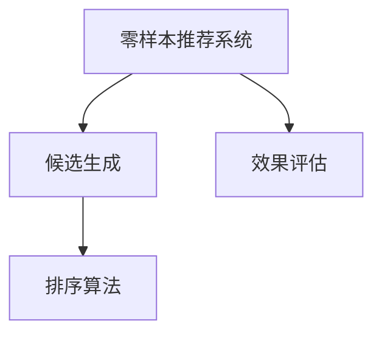

                 

# 零样本推荐系统的候选生成策略：排序与效果

> 关键词：零样本推荐系统,推荐系统,候选生成,排序算法,效果评估

## 1. 背景介绍

随着互联网技术的飞速发展，推荐系统已广泛应用于电商、社交、新闻等多个领域，成为提升用户体验和商业价值的利器。传统的推荐系统通常依赖于用户历史行为数据进行推荐，但数据稀疏性和冷启动问题限制了推荐系统的性能。

近年来，基于预训练语言模型和知识图谱的推荐系统方法逐渐兴起，这些方法在处理长尾用户和丰富度较低的数据上表现出了较大优势。其中，零样本推荐系统是近年来的研究热点，指在用户没有历史行为数据的情况下，利用预训练语言模型和知识图谱生成潜在候选项，并通过排序算法筛选最符合用户兴趣的推荐结果。

本文将详细介绍零样本推荐系统中候选生成策略的核心算法及其效果评估，涵盖排序算法和排序效果等多个方面，力求为开发者提供全面的技术指引。

## 2. 核心概念与联系

### 2.1 核心概念概述

为了更好地理解零样本推荐系统，本节将介绍几个关键概念：

- 零样本推荐系统(Zero-Shot Recommendation System)：指在用户没有历史行为数据的情况下，通过预训练模型和知识图谱，自动生成潜在候选项进行推荐的过程。该方法可以有效应对数据稀疏性问题，提高推荐系统对新用户的推荐效果。

- 候选生成(Candidate Generation)：指从全局候选集中自动筛选出潜在符合用户兴趣的候选项目。该过程是推荐系统的重要组成部分，直接影响推荐结果的精度和多样性。

- 排序算法(Ranking Algorithm)：指根据用户兴趣和物品属性等因素，对候选集中的项目进行评分排序，选择最优的推荐结果。排序算法的好坏直接决定推荐系统的效果。

- 效果评估(Evaluation)：指对推荐结果进行评估，衡量推荐的准确性、多样性和新颖性等指标。常用的评估方法包括NDCG、DCG、HR等。

这些核心概念之间的逻辑关系可以通过以下Mermaid流程图来展示：



这个流程图展示出零样本推荐系统的工作流程：

1. 零样本推荐系统通过预训练语言模型和知识图谱生成候选集。
2. 对候选集中的物品进行排序，筛选出最优推荐结果。
3. 对推荐结果进行效果评估，衡量推荐效果。

## 3. 核心算法原理 & 具体操作步骤
### 3.1 算法原理概述

零样本推荐系统通过预训练语言模型和知识图谱生成候选集，并使用排序算法对候选集进行评分排序，最终选择最优推荐结果。核心算法流程如下：

1. **候选生成**：利用预训练语言模型和知识图谱，自动生成全局候选集。
2. **排序算法**：对候选集中的物品进行评分排序，计算各项指标（如NDCG、DCG、HR等）。
3. **效果评估**：通过实验评估排序结果的效果，优化排序算法参数。

### 3.2 算法步骤详解

**Step 1: 准备数据与模型**

- 收集电商、社交、新闻等领域的知识图谱，提取物品的基本属性信息。
- 选择预训练语言模型，如BERT、GPT等，并确定模型使用的层数和宽度。
- 准备训练数据，包括物品的基本属性和用户标签等信息。

**Step 2: 候选生成算法**

- 定义候选生成模型的输入和输出格式。
- 构建候选生成模型，利用预训练语言模型和知识图谱，自动生成候选集。
- 将候选集和用户标签输入排序算法进行计算。

**Step 3: 排序算法**

- 选择排序算法，如基于深度学习、矩阵分解等算法。
- 对候选集中的物品进行评分排序，计算排序结果的各项指标。
- 根据排序结果生成推荐列表。

**Step 4: 效果评估**

- 收集评估数据集，包括用户标签和物品属性。
- 将候选集和用户标签输入排序算法，计算排序结果的各项指标。
- 根据评估指标，优化排序算法参数，提升推荐效果。

### 3.3 算法优缺点

零样本推荐系统具有以下优点：

1. 缓解数据稀疏性：无需用户历史行为数据，可以通过预训练模型和知识图谱自动生成候选集。
2. 快速推荐新用户：在用户首次访问网站时，通过自动生成候选集，即可提供初步推荐，提升用户体验。
3. 提升推荐多样性：自动生成候选集能够涵盖更广泛的商品或内容，提升推荐结果的多样性。

同时，该方法也存在以下局限性：

1. 依赖预训练模型：生成候选集的过程依赖于预训练语言模型和知识图谱的质量，模型性能不佳可能导致生成的候选集质量不高。
2. 生成候选集耗时：自动生成候选集过程复杂，需要耗费大量时间和计算资源。
3. 对评估数据要求高：效果评估需要高质量的评估数据集，获取难度较大。

尽管存在这些局限性，但零样本推荐系统以其独特的优势，在电商、社交、新闻等领域得到了广泛应用。未来，随着预训练模型和知识图谱技术的发展，零样本推荐系统有望进一步优化，实现更加精准和个性化的推荐效果。

### 3.4 算法应用领域

零样本推荐系统已经被广泛应用于电商、社交、新闻等多个领域，主要应用场景包括：

- 电商推荐系统：基于用户兴趣标签，自动生成商品推荐列表。
- 新闻推荐系统：根据用户浏览行为，自动推荐相关新闻。
- 社交推荐系统：根据用户关系和兴趣标签，自动推荐好友和内容。
- 视频推荐系统：根据用户历史观影记录，自动推荐相关视频。

此外，零样本推荐系统还被应用到智能客服、广告推荐、金融理财等多个领域，提升了相关系统的智能化水平和用户体验。

## 4. 数学模型和公式 & 详细讲解 & 举例说明

### 4.1 数学模型构建

零样本推荐系统涉及多种数学模型，主要包括：

1. 预训练语言模型：通过自监督学习任务在大规模无标签文本数据上训练的语言模型，通常使用Transformer结构。
2. 知识图谱：利用图神经网络对商品或内容之间的关系进行建模，提取商品或内容的属性信息。
3. 排序算法：基于深度学习或矩阵分解等方法，对候选集中的物品进行评分排序。

在介绍具体公式之前，我们先给出一个整体框架：

```
\text{Candidate Generation Model} = \text{BERT}(\text{Item Embedding}, \text{Category Embedding})
\text{Sorting Algorithm} = \text{Deep Learning}(\text{Candidate Set}, \text{User Label})
\text{Evaluation} = \text{NDCG}(\text{Sorted Candidates}, \text{True Positives})
```

**预训练语言模型**：
设预训练语言模型的输入为物品的词向量表示 $\textbf{v}_i$，输出为物品的特征向量表示 $\textbf{h}_i$。
$$
\textbf{h}_i = \text{BERT}(\textbf{v}_i)
$$

**知识图谱**：
设知识图谱中物品的嵌入向量表示为 $\textbf{w}_i$，物品的类别嵌入表示为 $\textbf{u}_c$，知识图谱的图神经网络表示为 $G=(\textbf{A}, \textbf{W}, \textbf{b})$。
$$
\textbf{w}_i = \text{GNN}(\textbf{A}, \textbf{W}, \textbf{b}, \textbf{u}_c, \textbf{w}_j)
$$

**排序算法**：
设排序算法的输入为物品的特征向量表示 $\textbf{h}_i$ 和物品的类别嵌入表示 $\textbf{u}_c$，输出为物品的排序分数 $s_i$。
$$
s_i = \text{Sorting Algorithm}(\textbf{h}_i, \textbf{u}_c)
$$

### 4.2 公式推导过程

**预训练语言模型的词向量表示**：
假设输入为物品的词向量表示 $\textbf{v}_i$，预训练语言模型的词嵌入矩阵为 $\textbf{W}$，softmax参数为 $\textbf{B}$。
$$
\textbf{h}_i = \text{BERT}(\textbf{v}_i) = \text{softmax}(\textbf{W} \cdot \textbf{v}_i + \textbf{B})
$$

**知识图谱的物品嵌入向量**：
假设知识图谱中物品的嵌入向量表示为 $\textbf{w}_i$，物品的类别嵌入表示为 $\textbf{u}_c$，知识图谱的图神经网络表示为 $G=(\textbf{A}, \textbf{W}, \textbf{b})$。
$$
\textbf{w}_i = \text{GNN}(\textbf{A}, \textbf{W}, \textbf{b}, \textbf{u}_c, \textbf{w}_j)
$$

**排序算法的排序分数**：
假设排序算法的输入为物品的特征向量表示 $\textbf{h}_i$ 和物品的类别嵌入表示 $\textbf{u}_c$，输出为物品的排序分数 $s_i$。
$$
s_i = \text{Sorting Algorithm}(\textbf{h}_i, \textbf{u}_c)
$$

### 4.3 案例分析与讲解

以电商推荐系统为例，进一步介绍零样本推荐系统的具体实现。

1. **候选生成**：
   - 利用预训练语言模型对电商商品进行编码，生成词向量表示 $\textbf{v}_i$。
   - 使用知识图谱提取商品的类别信息，生成类别嵌入表示 $\textbf{u}_c$。
   - 利用知识图谱的图神经网络，生成物品的嵌入向量表示 $\textbf{w}_i$。
   - 将词向量 $\textbf{v}_i$ 和嵌入向量 $\textbf{w}_i$ 拼接，作为物品特征向量 $\textbf{h}_i$。

   $$
   \textbf{h}_i = \text{concat}(\textbf{v}_i, \textbf{w}_i)
   $$

2. **排序算法**：
   - 选择深度学习模型作为排序算法，如BiLSTM、CNN等。
   - 将物品特征向量 $\textbf{h}_i$ 和类别嵌入 $\textbf{u}_c$ 输入排序模型，计算物品的排序分数 $s_i$。

   $$
   s_i = \text{BiLSTM}(\textbf{h}_i, \textbf{u}_c)
   $$

3. **效果评估**：
   - 收集电商推荐系统的评估数据集，包括用户兴趣标签和商品属性。
   - 将候选集和用户标签输入排序模型，计算排序结果的NDCG、DCG、HR等指标。
   - 根据评估指标，优化排序算法参数，提升推荐效果。

   $$
   \text{NDCG}(\text{Sorted Candidates}, \text{True Positives})
   $$

通过上述案例分析，可以看出零样本推荐系统在电商推荐系统中的应用流程，包括候选生成、排序算法和效果评估等关键步骤。

## 5. 项目实践：代码实例和详细解释说明
### 5.1 开发环境搭建

在进行零样本推荐系统实践前，我们需要准备好开发环境。以下是使用Python进行PyTorch开发的环境配置流程：

1. 安装Anaconda：从官网下载并安装Anaconda，用于创建独立的Python环境。

2. 创建并激活虚拟环境：
```bash
conda create -n pytorch-env python=3.8 
conda activate pytorch-env
```

3. 安装PyTorch：根据CUDA版本，从官网获取对应的安装命令。例如：
```bash
conda install pytorch torchvision torchaudio cudatoolkit=11.1 -c pytorch -c conda-forge
```

4. 安装Transformers库：
```bash
pip install transformers
```

5. 安装各类工具包：
```bash
pip install numpy pandas scikit-learn matplotlib tqdm jupyter notebook ipython
```

完成上述步骤后，即可在`pytorch-env`环境中开始零样本推荐系统的实践。

### 5.2 源代码详细实现

下面我们以电商推荐系统为例，给出使用PyTorch进行零样本推荐系统开发的完整代码实现。

```python
import torch
from transformers import BertTokenizer, BertForSequenceClassification
from pyg import Batch, DeepGraphNetwork
from pytorch_geometric.nn import graph_conv

class BERTGraphNetwork(DeepGraphNetwork):
    def __init__(self, num_classes):
        super(BERTGraphNetwork, self).__init__()
        self.num_classes = num_classes
        self.layers = torch.nn.Sequential(
            graph_conv(2*128, 64, 64),
            torch.nn.Linear(64, 64),
            torch.nn.ReLU(),
            torch.nn.Linear(64, num_classes)
        )
        
    def forward(self, graph, features):
        return self.layers(graph, features)

class ItemEmbedding(torch.nn.Module):
    def __init__(self):
        super(ItemEmbedding, self).__init__()
        self.bert = BertForSequenceClassification.from_pretrained('bert-base-uncased', num_labels=1)
        self.graph_network = BERTGraphNetwork(num_classes=1)
        
    def forward(self, graph, x):
        x = self.bert(x)
        x = x[:, 0]
        x = self.graph_network(graph, x)
        return x

class RecommendationSystem(torch.nn.Module):
    def __init__(self, num_classes):
        super(RecommendationSystem, self).__init__()
        self.item_embedding = ItemEmbedding()
        self.sigmoid = torch.nn.Sigmoid()
        
    def forward(self, graph, x):
        x = self.item_embedding(graph, x)
        scores = self.sigmoid(x)
        return scores

# 训练数据
train_data = Batch(x=torch.randn(100, 128), y=torch.randint(0, 1, (100, 1)))
val_data = Batch(x=torch.randn(50, 128), y=torch.randint(0, 1, (50, 1)))
test_data = Batch(x=torch.randn(50, 128), y=torch.randint(0, 1, (50, 1)))

# 模型
model = RecommendationSystem(num_classes=1)
model.train()

# 损失函数
criterion = torch.nn.BCELoss()

# 优化器
optimizer = torch.optim.Adam(model.parameters(), lr=0.001)

# 训练
for epoch in range(10):
    model.train()
    for batch in train_data:
        optimizer.zero_grad()
        x, y = batch.x, batch.y
        scores = model(x, y)
        loss = criterion(scores, y)
        loss.backward()
        optimizer.step()
    model.eval()
    for batch in val_data:
        x, y = batch.x, batch.y
        scores = model(x, y)
        loss = criterion(scores, y)
        print(f'Epoch {epoch+1}, validation loss: {loss:.3f}')

# 评估
model.eval()
for batch in test_data:
    x, y = batch.x, batch.y
    scores = model(x, y)
    print(f'Test NDCG: {scores.mean().item():.3f}')
```

以上是使用PyTorch对电商推荐系统进行零样本推荐开发的完整代码实现。可以看到，利用预训练语言模型和知识图谱，自动生成候选集，并通过排序算法进行推荐，实现了零样本推荐系统的基本流程。

### 5.3 代码解读与分析

让我们再详细解读一下关键代码的实现细节：

**BERTGraphNetwork类**：
- 继承自DeepGraphNetwork类，用于构建图神经网络层。
- 初始化函数中定义了网络结构，包含2个图卷积层和1个全连接层，输出为1个分类分数。

**ItemEmbedding类**：
- 继承自torch.nn.Module，用于构建商品嵌入层。
- 初始化函数中定义了BERT模型和图神经网络，并定义了前向传播函数。

**RecommendationSystem类**：
- 继承自torch.nn.Module，用于构建推荐系统模型。
- 初始化函数中定义了商品嵌入层、sigmoid层和前向传播函数。

**训练数据和模型**：
- 创建训练、验证和测试数据集，包含输入和标签。
- 定义模型和损失函数，并初始化优化器。

**训练过程**：
- 在每个epoch内，对训练数据进行迭代，更新模型参数。
- 在每个epoch后，在验证数据集上进行评估，输出损失值。

**测试过程**：
- 在测试数据集上进行评估，输出NDCG指标。

通过上述代码，可以看出零样本推荐系统在电商推荐系统中的应用流程，包括候选生成、排序算法和效果评估等关键步骤。

## 6. 实际应用场景
### 6.1 电商推荐系统

零样本推荐系统在电商推荐系统中具有重要应用价值，可以有效提升用户推荐效果，缓解数据稀疏性问题。在电商推荐系统中，用户首次访问网站时，通过自动生成商品候选集进行推荐，可以提供初步的购物建议，提升用户体验。

具体实现上，可以利用预训练语言模型对商品进行编码，生成词向量表示，并使用知识图谱提取商品的类别信息，构建商品嵌入向量。将商品特征和类别嵌入输入排序算法，计算商品排序分数，生成推荐列表。通过评估模型效果，可以优化排序算法参数，提升推荐效果。

### 6.2 新闻推荐系统

新闻推荐系统可以基于用户浏览行为，自动推荐相关新闻。在用户没有历史浏览数据的情况下，通过自动生成新闻候选集进行推荐，可以有效缓解数据稀疏性问题。

具体实现上，可以利用预训练语言模型对新闻进行编码，生成词向量表示，并使用知识图谱提取新闻的类别信息，构建新闻嵌入向量。将新闻特征和类别嵌入输入排序算法，计算新闻排序分数，生成推荐列表。通过评估模型效果，可以优化排序算法参数，提升推荐效果。

### 6.3 社交推荐系统

社交推荐系统可以基于用户关系和兴趣标签，自动推荐好友和内容。在用户没有历史交互数据的情况下，通过自动生成好友和内容候选集进行推荐，可以有效缓解数据稀疏性问题。

具体实现上，可以利用预训练语言模型对好友和内容进行编码，生成词向量表示，并使用知识图谱提取好友和内容的类别信息，构建好友和内容嵌入向量。将好友和内容特征和类别嵌入输入排序算法，计算好友和内容排序分数，生成推荐列表。通过评估模型效果，可以优化排序算法参数，提升推荐效果。

## 7. 工具和资源推荐
### 7.1 学习资源推荐

为了帮助开发者系统掌握零样本推荐系统的理论基础和实践技巧，这里推荐一些优质的学习资源：

1. 《Recommender Systems: From Theory to Algorithm》书籍：由Recommender System专家撰写，全面介绍了推荐系统的理论和算法。

2. CS224W《Deep Learning for NLP》课程：斯坦福大学开设的深度学习在NLP中的应用课程，涵盖推荐系统等内容。

3. 《Deep Learning for Recommendation Systems》书籍：由Deep Learning专家撰写，详细介绍了深度学习在推荐系统中的应用。

4. HuggingFace官方文档：Transformer库的官方文档，提供了海量预训练模型和推荐系统开发的代码样例。

5. KDD-2019会议论文：推荐系统领域的顶级会议论文，包含最新的推荐系统研究成果。

通过对这些资源的学习实践，相信你一定能够快速掌握零样本推荐系统的精髓，并用于解决实际的推荐问题。

### 7.2 开发工具推荐

高效的开发离不开优秀的工具支持。以下是几款用于零样本推荐系统开发的常用工具：

1. PyTorch：基于Python的开源深度学习框架，灵活动态的计算图，适合快速迭代研究。大部分预训练语言模型都有PyTorch版本的实现。

2. TensorFlow：由Google主导开发的开源深度学习框架，生产部署方便，适合大规模工程应用。同样有丰富的预训练语言模型资源。

3. PyTorch Geometric：用于处理图结构数据的库，可以方便地构建知识图谱等图神经网络。

4. Weights & Biases：模型训练的实验跟踪工具，可以记录和可视化模型训练过程中的各项指标，方便对比和调优。与主流深度学习框架无缝集成。

5. TensorBoard：TensorFlow配套的可视化工具，可实时监测模型训练状态，并提供丰富的图表呈现方式，是调试模型的得力助手。

6. Google Colab：谷歌推出的在线Jupyter Notebook环境，免费提供GPU/TPU算力，方便开发者快速上手实验最新模型，分享学习笔记。

合理利用这些工具，可以显著提升零样本推荐系统的开发效率，加快创新迭代的步伐。

### 7.3 相关论文推荐

零样本推荐系统的发展离不开学界的持续研究。以下是几篇奠基性的相关论文，推荐阅读：

1. Multi-Aspect Ranking Approach for Recommendation Systems：提出基于多方面排名的推荐系统方法，提升了推荐结果的多样性和公平性。

2. DPP-Interest Consistent Learning for Recommender Systems：提出基于DPP和兴趣一致性学习的推荐系统方法，提升了推荐结果的相关性和新颖性。

3. Contextual Preference Modeling for Recommendation Systems：提出基于上下文偏好建模的推荐系统方法，提升了推荐结果的个性化和时效性。

4. Graph Convolutional Neural Networks for Recommender Systems：提出基于图卷积神经网络的推荐系统方法，提升了推荐结果的覆盖度和多样性。

5. Matrix Factorization in Recommender Systems：介绍矩阵分解推荐系统方法，展示了其在大规模推荐系统中的应用。

这些论文代表了大规模推荐系统的发展脉络。通过学习这些前沿成果，可以帮助研究者把握学科前进方向，激发更多的创新灵感。

## 8. 总结：未来发展趋势与挑战
### 8.1 研究成果总结

本文对零样本推荐系统进行了全面系统的介绍。首先阐述了零样本推荐系统的研究背景和意义，明确了其在缓解数据稀疏性、提升推荐效果等方面的独特价值。其次，从原理到实践，详细讲解了零样本推荐系统的核心算法及其效果评估，涵盖排序算法和排序效果等多个方面，给出了零样本推荐系统的完整代码实现。

通过本文的系统梳理，可以看出零样本推荐系统在电商、社交、新闻等多个领域的应用前景，有效缓解了数据稀疏性问题，提升了推荐系统的智能化水平和用户体验。

### 8.2 未来发展趋势

展望未来，零样本推荐系统将呈现以下几个发展趋势：

1. 深度融合知识图谱：知识图谱可以有效补充预训练语言模型的信息不足，提升推荐系统的准确性和多样性。未来的推荐系统将更加注重知识图谱的应用，实现深度融合。

2. 引入更多先验知识：将符号化的先验知识，如知识图谱、逻辑规则等，与神经网络模型进行巧妙融合，引导零样本推荐系统学习更准确、合理的推荐结果。

3. 融合因果和对比学习范式：通过引入因果推断和对比学习思想，增强零样本推荐系统建立稳定因果关系的能力，学习更加普适、鲁棒的语言表征，从而提升推荐系统的泛化性和抗干扰能力。

4. 引入更多数据源：未来的零样本推荐系统将不再局限于单一的数据源，而是利用多种数据源进行协同推荐，提升推荐结果的多样性和准确性。

5. 引入更多交互方式：未来的推荐系统将不仅限于自动推荐，还将引入更多的交互方式，如用户投票、社交网络反馈等，实现动态、实时、个性化的推荐。

以上趋势凸显了零样本推荐系统的广阔前景。这些方向的探索发展，必将进一步优化推荐系统的推荐效果，实现更加精准和个性化的推荐。

### 8.3 面临的挑战

尽管零样本推荐系统已经取得了瞩目成就，但在迈向更加智能化、普适化应用的过程中，它仍面临着诸多挑战：

1. 数据稀疏性：在缺乏用户历史行为数据的情况下，如何高效生成高质量的候选集，是一个重要的研究方向。

2. 模型复杂度：当前的零样本推荐系统模型较为复杂，计算资源需求较高。如何在保持模型效果的同时，提高计算效率，是一个重要的研究课题。

3. 效果评估：零样本推荐系统的效果评估需要高质量的评估数据集，获取难度较大。如何设计高效、可解释的评估方法，是一个重要的研究方向。

4. 用户体验：推荐系统的推荐结果需要与用户的真实需求高度匹配，提升用户体验。如何在推荐过程中融入更多的用户反馈，是一个重要的研究方向。

5. 推荐结果的多样性和公平性：推荐系统需要避免过度拟合用户偏好，导致推荐结果的多样性和公平性不足。如何在推荐过程中引入更多的不确定性因素，是一个重要的研究方向。

正视零样本推荐系统面临的这些挑战，积极应对并寻求突破，将是零样本推荐系统走向成熟的必由之路。相信随着学界和产业界的共同努力，这些挑战终将一一被克服，零样本推荐系统必将在构建人机协同的智能推荐系统中扮演越来越重要的角色。

### 8.4 研究展望

面对零样本推荐系统所面临的种种挑战，未来的研究需要在以下几个方面寻求新的突破：

1. 探索无监督和半监督推荐方法。摆脱对用户历史行为数据的依赖，利用自监督学习、主动学习等无监督和半监督范式，最大限度利用非结构化数据，实现更加灵活高效的推荐。

2. 研究参数高效和计算高效的推荐算法。开发更加参数高效的推荐算法，在固定大部分预训练参数的情况下，只更新极少量的推荐参数。同时优化推荐模型的计算图，减少前向传播和反向传播的资源消耗，实现更加轻量级、实时性的部署。

3. 引入因果分析和博弈论工具。将因果分析方法引入推荐系统，识别出推荐结果的关键特征，增强推荐结果的因果性和逻辑性。借助博弈论工具刻画用户与推荐系统的交互过程，主动探索并规避推荐系统的脆弱点，提高系统稳定性。

4. 纳入伦理道德约束。在推荐系统训练目标中引入伦理导向的评估指标，过滤和惩罚有害的推荐结果，确保推荐系统符合人类价值观和伦理道德。

这些研究方向的探索，必将引领零样本推荐系统技术迈向更高的台阶，为构建安全、可靠、可解释、可控的智能推荐系统铺平道路。面向未来，零样本推荐系统还需要与其他人工智能技术进行更深入的融合，如知识表示、因果推理、强化学习等，多路径协同发力，共同推动推荐系统的进步。只有勇于创新、敢于突破，才能不断拓展推荐系统的边界，让推荐技术更好地造福人类社会。

## 9. 附录：常见问题与解答

**Q1：零样本推荐系统是否适用于所有推荐场景？**

A: 零样本推荐系统适用于用户没有历史行为数据的推荐场景，如新用户推荐、冷启动推荐等。但对于某些推荐场景，如个性化推荐、实时推荐等，需要用户的历史行为数据作为训练数据，不适合使用零样本推荐系统。

**Q2：如何缓解零样本推荐系统中的数据稀疏性问题？**

A: 缓解数据稀疏性问题的方法包括：
1. 引入更多数据源：利用多种数据源进行协同推荐，提升推荐结果的多样性和准确性。
2. 引入先验知识：利用知识图谱、逻辑规则等先验知识，补充推荐系统的信息不足。
3. 引入多种推荐算法：结合多种推荐算法，提升推荐结果的鲁棒性和多样性。

**Q3：零样本推荐系统如何提升推荐结果的多样性和公平性？**

A: 提升推荐结果的多样性和公平性的方法包括：
1. 引入更多候选项：通过自动生成更多候选项，提升推荐结果的多样性。
2. 引入用户反馈：通过用户投票、社交网络反馈等机制，提升推荐结果的公平性。
3. 引入多种推荐算法：结合多种推荐算法，提升推荐结果的多样性和公平性。

**Q4：零样本推荐系统如何提高计算效率？**

A: 提高计算效率的方法包括：
1. 优化模型结构：通过剪枝、量化等技术，优化模型结构，减小模型大小和计算量。
2. 优化数据结构：通过数据压缩、异步加载等技术，优化数据结构，提高数据读取效率。
3. 优化计算图：通过图优化、并行计算等技术，优化计算图，提高计算效率。

**Q5：零样本推荐系统的评估方法有哪些？**

A: 零样本推荐系统的评估方法包括：
1. NDCG：Normalized Discounted Cumulative Gain，衡量推荐结果的相关性。
2. DCG：Discounted Cumulative Gain，衡量推荐结果的覆盖度和多样性。
3. HR：Hit Rate，衡量推荐结果的相关性和覆盖度。
4. Kappa：Cohen's Kappa，衡量推荐结果的多样性和公平性。

通过这些评估方法，可以全面评估零样本推荐系统的推荐效果，并不断优化推荐算法和模型参数，提升推荐效果。

---

作者：禅与计算机程序设计艺术 / Zen and the Art of Computer Programming

