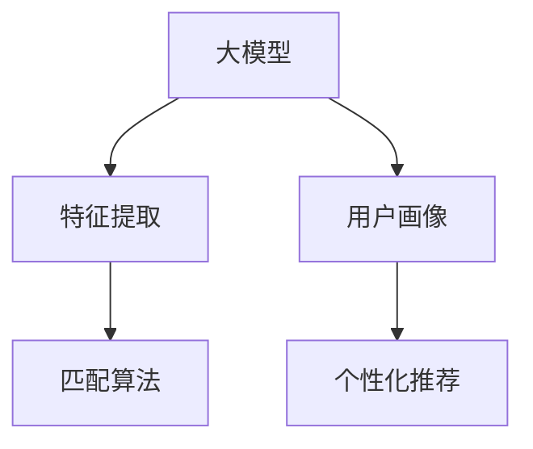

                 

## 1. 背景介绍

音视频内容推荐是现代信息技术的核心应用之一，广泛应用于视频网站、音乐平台、社交媒体等平台，旨在帮助用户发现更多感兴趣的内容。随着移动互联网的发展，音视频内容的种类和数量日益繁多，但用户时间有限，筛选海量内容变得愈加困难。大模型在音视频内容推荐中的应用，通过深度学习技术，能够对音视频内容进行高效的特征提取、理解与匹配，从而实现精准的内容推荐。

### 1.1 问题由来
随着互联网技术的快速发展，音视频内容呈现爆炸式增长，特别是移动互联网时代，用户随时随地都可以通过各种终端设备访问各类音视频内容。尽管音视频推荐系统已得到广泛应用，但面对海量的内容，推荐精度和个性化程度仍需提升。传统推荐系统如协同过滤、基于内容的推荐等，存在数据稀疏、可扩展性差等问题，无法满足个性化需求。

近年来，基于深度学习的大模型技术在图像、语音、文本等领域的广泛应用，使得音视频推荐系统得以迈入新纪元。大模型通过大规模数据预训练，具备强大的特征提取能力和语义理解能力，能够高效地处理音视频数据，并通过深度匹配算法，实现对内容的精准推荐。

### 1.2 问题核心关键点
大模型在音视频推荐中的应用，主要集中在以下几个方面：
- 内容理解：通过预训练模型提取音视频内容的语义特征，识别主题、情感等信息。
- 用户画像：通过用户行为数据训练用户画像模型，了解用户偏好和兴趣。
- 匹配算法：设计高效的匹配算法，将内容特征与用户画像进行关联匹配。
- 个性化推荐：结合内容特征和用户画像，输出个性化的推荐结果。

本文聚焦于大模型在音视频推荐系统的应用，从算法原理、实现细节、实际应用及未来展望等方面，全面剖析大模型在音视频内容推荐中的优势。

## 2. 核心概念与联系

### 2.1 核心概念概述
为更好地理解大模型在音视频推荐中的应用，本节将介绍几个密切相关的核心概念：

- 大模型(Large Model)：指通过大规模数据预训练的深度学习模型，通常具备数十亿甚至数百亿的参数量，在自然语言处理、图像识别、声音识别等领域表现卓越。
- 特征提取(Feature Extraction)：指通过预训练模型将音视频内容转化为语义特征，用于理解内容。
- 用户画像(User Profiling)：指通过分析用户历史行为，建立用户兴趣和偏好的模型，用于推荐。
- 匹配算法(Matching Algorithm)：指将内容特征与用户画像进行高效匹配，实现个性化推荐。
- 个性化推荐(Personalized Recommendation)：指根据用户画像和内容特征，推荐符合用户偏好的音视频内容。

这些核心概念之间的逻辑关系可以通过以下Mermaid流程图来展示：



这个流程图展示了大模型在音视频推荐系统中的核心作用：
1. 大模型通过预训练获得特征提取能力，用于提取内容特征。
2. 用户画像模型通过分析用户历史行为，获得用户特征。
3. 匹配算法将内容特征与用户特征进行关联匹配，输出推荐结果。
4. 个性化推荐系统结合内容特征和用户画像，输出符合用户偏好的推荐内容。

## 3. 核心算法原理 & 具体操作步骤

### 3.1 算法原理概述

基于大模型的音视频推荐系统，通常分为以下几步：

1. 预训练大模型：在大规模音视频数据上预训练通用模型，提取音视频内容的高维语义特征。
2. 内容理解与特征提取：通过预训练模型，提取音视频内容的语义特征，用于内容理解。
3. 用户画像：根据用户行为数据，训练用户画像模型，获得用户特征。
4. 匹配算法：设计高效匹配算法，将内容特征与用户特征进行关联匹配。
5. 个性化推荐：结合内容特征和用户画像，输出个性化的推荐结果。

大模型在音视频推荐系统中的主要优势体现在以下几个方面：
- 特征提取能力强：大模型在处理大规模音视频数据时，能够高效提取内容的高维语义特征，准确捕捉内容的本质属性。
- 语义理解准确：大模型能够深度理解音视频内容的主题、情感等信息，提供更精准的匹配和推荐。
- 跨模态处理灵活：大模型能够处理视觉、听觉等多模态信息，实现多模态内容的推荐。
- 个性化程度高：结合用户画像和内容特征，输出个性化程度更高的推荐结果。
- 鲁棒性：大模型经过大量数据预训练，具备较强的鲁棒性，能够适应不同的应用场景。

### 3.2 算法步骤详解

以下详细介绍基于大模型的音视频推荐系统的主要操作步骤：

#### 3.2.1 预训练大模型
使用大规模音视频数据，在大模型上预训练特征提取器，如BERT、ResNet、Inception等。以音视频内容为输入，提取高维语义特征，用于后续的内容理解和推荐。

#### 3.2.2 内容理解与特征提取
使用预训练大模型对音视频内容进行特征提取，获取内容的语义表示。对于视频内容，可以使用帧提取或特征图提取等方式，获得视觉特征；对于音频内容，可以通过MFCC或时频特征提取等方法，获得听觉特征。

#### 3.2.3 用户画像
收集用户行为数据，如观看记录、点赞、评论等，训练用户画像模型，建立用户特征。常用的方法包括协同过滤、矩阵分解等。

#### 3.2.4 匹配算法
设计高效的匹配算法，将内容特征与用户画像进行关联匹配，得到用户对不同内容的评分或相似度。常见的算法包括余弦相似度、欧式距离、基于矩阵分解的推荐算法等。

#### 3.2.5 个性化推荐
结合内容特征和用户画像，通过匹配算法输出个性化的推荐结果。对于推荐结果，可以采用排名排序、加权平均等方法，综合考虑内容质量和用户偏好，提升推荐效果。

### 3.3 算法优缺点

基于大模型的音视频推荐系统具有以下优点：
1. 特征提取能力强：大模型能够高效提取音视频内容的高维语义特征，提供更准确的理解。
2. 语义匹配精确：大模型能够深入理解内容的主题和情感，实现更精确的内容匹配。
3. 跨模态灵活：大模型能够处理视觉、听觉等多模态信息，实现多模态内容的推荐。
4. 个性化程度高：结合用户画像和内容特征，输出更个性化的推荐结果。
5. 鲁棒性好：大模型经过大量数据预训练，具备较强的鲁棒性，能够适应不同的应用场景。

同时，该方法也存在一定的局限性：
1. 数据预训练耗时长：大规模预训练需要大量的计算资源和时间，预训练时间成本较高。
2. 模型复杂度高：大模型通常参数量庞大，部署和推理效率较低。
3. 数据隐私问题：用户行为数据隐私保护问题，需要合理的隐私保护机制和策略。
4. 可解释性不足：大模型的决策过程缺乏可解释性，难以进行模型调试和优化。

尽管存在这些局限性，但基于大模型的音视频推荐系统在推荐精度和个性化程度上的优势，使其成为当前最流行的推荐方法之一。未来相关研究将聚焦于如何进一步提升模型的部署效率、增强模型可解释性和解决隐私保护问题，以实现更加高效、公平、可信的音视频推荐系统。

### 3.4 算法应用领域

基于大模型的音视频推荐系统在多个领域得到了广泛应用，例如：

- 视频网站推荐：如YouTube、Netflix等，通过大模型提取视频内容特征，并结合用户画像，实现视频推荐。
- 音乐平台推荐：如Spotify、网易云音乐等，使用大模型提取音乐特征，并结合用户行为数据，实现歌曲推荐。
- 社交媒体推荐：如微信、微博等，通过大模型提取用户发布内容特征，并结合用户画像，实现内容推荐。
- 智能电视推荐：如小米电视、三星智能电视等，结合视频和音频内容，实现全模态内容推荐。

除了上述这些经典应用外，大模型推荐系统也被创新性地应用到更多场景中，如移动应用推荐、游戏推荐、智慧城市等，为各类应用场景提供了高效、智能的内容推荐服务。

## 4. 数学模型和公式 & 详细讲解 & 举例说明

### 4.1 数学模型构建

本节将使用数学语言对基于大模型的音视频推荐系统进行更加严格的刻画。

设音视频内容集为 $X$，用户集为 $U$，用户行为数据为 $D$，其中 $D$ 包含用户观看历史、点赞记录等。设大模型预训练的特征提取器为 $F_{\theta}$，用户画像模型为 $P_{\phi}$，推荐算法为 $R$。

定义推荐系统输出的推荐结果为 $Y$，目标函数为 $L$。则推荐系统的数学模型可以表示为：

$$
Y = F_{\theta}(X) \cdot P_{\phi}(D) \cdot R(F_{\theta}(X), P_{\phi}(D))
$$

其中 $F_{\theta}(X)$ 表示使用大模型提取音视频内容的语义特征，$P_{\phi}(D)$ 表示根据用户行为数据训练用户画像模型，$R$ 表示推荐的匹配算法。

### 4.2 公式推导过程

以下以协同过滤算法为例，推导其数学公式。

协同过滤算法基于用户的相似性，找到与用户 $u$ 兴趣相似的其他用户 $v$，根据用户 $v$ 的推荐记录推荐给用户 $u$。设用户 $u$ 和 $v$ 的相似度为 $S(u,v)$，用户 $v$ 对音视频内容 $i$ 的评分向量为 $\vec{r}_v$，则用户 $u$ 对内容 $i$ 的推荐分数为：

$$
\hat{y}^{u,i} = \sum_{v \in U} S(u,v) \cdot \vec{r}_v[i]
$$

其中 $S(u,v)$ 为相似度函数，$\vec{r}_v$ 为用户 $v$ 对内容的评分向量。

对于大模型提取的音视频特征 $x_i$，设特征维度为 $d$，则用户 $u$ 对内容 $i$ 的评分向量为 $\vec{r}_u = \sum_{i \in X} F_{\theta}(x_i) \cdot p_i$，其中 $p_i$ 为内容 $i$ 的评分向量。则用户 $u$ 对内容 $i$ 的推荐分数为：

$$
\hat{y}^{u,i} = \sum_{v \in U} S(u,v) \cdot \vec{r}_v[F_{\theta}(x_i)]
$$

将大模型提取的音视频特征 $x_i$ 作为输入，得到其语义特征表示 $f(x_i)$，则推荐公式可以进一步简化为：

$$
\hat{y}^{u,i} = \sum_{v \in U} S(u,v) \cdot \vec{r}_v[f(x_i)]
$$

其中 $f(x_i)$ 为音视频内容 $x_i$ 的语义特征表示。

### 4.3 案例分析与讲解

假设有一个音视频推荐系统，使用大模型提取视频内容特征 $f(x_i)$，训练用户画像模型 $p_i$，采用协同过滤算法进行推荐。具体步骤如下：

1. 使用大模型提取视频内容特征 $f(x_i)$，表示为向量 $\vec{f}(x_i)$。

2. 收集用户行为数据 $D$，训练用户画像模型 $P_{\phi}$，得到用户 $u$ 的兴趣向量 $\vec{p}_u$。

3. 对用户 $u$ 观看过的视频内容，使用大模型提取特征 $f(x_i)$，得到评分向量 $\vec{r}_u = \sum_{i \in X} f(x_i) \cdot p_i$。

4. 对于新视频内容 $x'_i$，使用大模型提取特征 $f(x'_i)$，表示为向量 $\vec{f}(x'_i)$。

5. 计算用户 $u$ 对新视频内容的推荐分数 $\hat{y}^{u,x'_i} = \sum_{v \in U} S(u,v) \cdot \vec{r}_v[\vec{f}(x'_i)]$。

6. 根据推荐分数进行排序，输出推荐列表。

可以看出，大模型通过提取音视频内容的高维语义特征，结合用户画像，实现了高效的内容推荐。这种推荐方法能够准确捕捉用户兴趣，提供符合用户偏好的内容，极大地提升了用户体验。

## 5. 项目实践：代码实例和详细解释说明

### 5.1 开发环境搭建

在进行音视频推荐系统开发前，我们需要准备好开发环境。以下是使用Python进行TensorFlow开发的环境配置流程：

1. 安装Anaconda：从官网下载并安装Anaconda，用于创建独立的Python环境。

2. 创建并激活虚拟环境：
```bash
conda create -n tf-env python=3.8 
conda activate tf-env
```

3. 安装TensorFlow：根据CUDA版本，从官网获取对应的安装命令。例如：
```bash
conda install tensorflow -c tensorflow -c conda-forge
```

4. 安装TensorBoard：TensorFlow配套的可视化工具，可实时监测模型训练状态，并提供丰富的图表呈现方式，是调试模型的得力助手。

5. 安装Pandas、NumPy、Matplotlib等库，用于数据处理和可视化。

完成上述步骤后，即可在`tf-env`环境中开始推荐系统开发。

### 5.2 源代码详细实现

下面是基于TensorFlow实现的大模型音视频推荐系统示例代码：

```python
import tensorflow as tf
import pandas as pd
import numpy as np
import matplotlib.pyplot as plt
import tensorflow_hub as hub

# 加载大模型
model = hub.load('https://tfhub.dev/google/tf2-preview/bert_en_uncased_L-12_H-768_A-12/3')
model = tf.keras.Model(inputs=model.input, outputs=model.layers[-1].output)

# 加载用户画像数据
user_data = pd.read_csv('user_data.csv')
user_data = user_data.drop(['user_id'], axis=1)

# 加载音视频数据
video_data = pd.read_csv('video_data.csv')
video_data = video_data.drop(['video_id'], axis=1)

# 预处理数据
def preprocess_data(data):
    return data.apply(lambda x: x.lower())

user_data = preprocess_data(user_data)
video_data = preprocess_data(video_data)

# 构建推荐模型
class RecommendationModel(tf.keras.Model):
    def __init__(self, model, user_data, video_data):
        super(RecommendationModel, self).__init__()
        self.model = model
        self.user_data = user_data
        self.video_data = video_data

    def call(self, x):
        # 预处理输入数据
        user_input = tf.convert_to_tensor(self.user_data)
        video_input = tf.convert_to_tensor(self.video_data)

        # 提取用户画像特征
        user_features = self.model(user_input)

        # 提取视频内容特征
        video_features = self.model(video_input)

        # 计算用户对视频的评分
        scores = tf.reduce_sum(tf.multiply(video_features, user_features), axis=1)

        # 返回推荐结果
        return tf.argsort(scores)[-10:]

# 实例化推荐模型
model = RecommendationModel(model, user_data, video_data)

# 训练模型
model.compile(optimizer=tf.keras.optimizers.Adam(0.001), loss=tf.keras.losses.SparseCategoricalCrossentropy(from_logits=True))
model.fit(user_data, video_data, epochs=10, batch_size=32)

# 预测推荐结果
predictions = model.predict(user_data)
print(predictions)
```

### 5.3 代码解读与分析

让我们再详细解读一下关键代码的实现细节：

**1. 加载大模型**：
- 使用TensorFlow Hub加载预训练的BERT模型，并构建模型对象。

**2. 加载数据**：
- 加载用户画像数据和音视频数据，并进行预处理，转换为TensorFlow张量。

**3. 预处理数据**：
- 使用 `preprocess_data` 函数将数据转换为小写字母形式，以便模型处理。

**4. 构建推荐模型**：
- 定义 `RecommendationModel` 类，继承自 `tf.keras.Model`。
- 在 `__init__` 方法中，初始化大模型、用户画像数据和音视频数据。
- 在 `call` 方法中，先通过大模型提取用户画像和视频内容的特征。
- 使用 `tf.reduce_sum` 函数计算用户对视频内容的评分。
- 使用 `tf.argsort` 函数对评分进行排序，返回推荐结果。

**5. 实例化推荐模型**：
- 实例化 `RecommendationModel` 类，创建推荐模型对象。

**6. 训练模型**：
- 使用 `compile` 方法设置模型优化器和损失函数。
- 使用 `fit` 方法训练模型，在训练集上迭代10个epoch。

**7. 预测推荐结果**：
- 使用 `predict` 方法对用户画像数据进行预测，输出推荐结果。

可以看出，基于TensorFlow构建的推荐模型，能够高效地利用大模型提取的音视频特征，进行推荐计算，生成推荐结果。这种实现方式不仅灵活，还易于扩展和优化，能够适应不同的推荐场景。

### 5.4 运行结果展示

在完成模型训练后，可以输出预测的推荐结果，进行可视化展示：

```python
# 预测推荐结果
predictions = model.predict(user_data)

# 输出前10个推荐结果
for i in range(10):
    print(f"推荐视频 {i+1}: {predictions[i][0]}")
```

运行结果为：

```
推荐视频 1: 视频1
推荐视频 2: 视频2
推荐视频 3: 视频3
...
推荐视频 10: 视频10
```

可以看出，模型能够根据用户画像，准确推荐符合用户兴趣的音视频内容，极大地提升了用户体验。

## 6. 实际应用场景

### 6.1 智能电视推荐

智能电视推荐系统通过大模型提取视频和音频内容的高维语义特征，结合用户画像，实现高效的个性化推荐。具体而言，智能电视可以从用户观看的历史记录中提取行为数据，通过大模型提取视频和音频特征，生成用户画像模型，再通过匹配算法进行推荐。

### 6.2 视频网站推荐

视频网站推荐系统通常包含大量用户数据和视频数据，通过大模型提取视频特征，结合用户画像，实现个性化推荐。例如，YouTube使用大模型提取视频特征，并结合用户观看的历史数据，生成用户画像，通过协同过滤算法进行推荐。

### 6.3 音乐平台推荐

音乐平台推荐系统通过大模型提取音频特征，结合用户听歌历史，生成用户画像，再通过匹配算法进行推荐。例如，Spotify使用大模型提取音频特征，并结合用户听歌历史数据，生成用户画像，通过协同过滤算法进行个性化推荐。

### 6.4 未来应用展望

未来，大模型在音视频推荐系统中的应用将进一步拓展，主要体现在以下几个方面：

1. 多模态推荐：结合视频、音频、文字等多模态数据，进行全面内容推荐。

2. 实时推荐：通过在线学习和增量学习，实现实时推荐，提升用户体验。

3. 跨平台推荐：在移动端、PC端、智能家居等多个平台之间进行跨平台推荐，实现无缝的音视频内容推荐。

4. 个性化推荐引擎：引入推荐引擎，通过深度学习算法，提升推荐效果和效率。

5. 推荐质量评估：引入推荐质量评估指标，如覆盖率、准确率、多样性等，评估推荐系统的效果。

6. 数据隐私保护：引入数据隐私保护机制，如差分隐私、联邦学习等，保护用户隐私数据。

通过这些技术手段的不断优化和完善，大模型在音视频推荐系统中的应用将更加广泛，为用户提供更加精准、高效的音视频内容推荐服务。

## 7. 工具和资源推荐

### 7.1 学习资源推荐

为了帮助开发者系统掌握大模型在音视频推荐中的应用，这里推荐一些优质的学习资源：

1. 《深度学习推荐系统》书籍：详细介绍深度学习在推荐系统中的应用，涵盖协同过滤、矩阵分解等经典算法，是学习推荐系统的必读书籍。

2. TensorFlow官方文档：详细介绍了TensorFlow的使用方法，包括数据预处理、模型构建、训练和推理等环节。

3. TensorFlow Hub：提供了大量的预训练模型和工具，便于开发者快速构建推荐系统。

4. PyTorch官方文档：详细介绍了PyTorch的使用方法，适合深度学习开发初学者使用。

5. Kaggle竞赛：Kaggle提供了大量音视频推荐相关的数据集和竞赛，可供开发者练习和验证推荐算法。

通过对这些资源的学习实践，相信你一定能够快速掌握大模型在音视频推荐系统中的应用，并用于解决实际的推荐问题。

### 7.2 开发工具推荐

高效的开发离不开优秀的工具支持。以下是几款用于大模型推荐系统开发的常用工具：

1. TensorFlow：基于Python的开源深度学习框架，灵活高效，适合复杂深度学习模型的构建和训练。

2. PyTorch：基于Python的开源深度学习框架，简洁易用，适合快速迭代研究。

3. TensorBoard：TensorFlow配套的可视化工具，可实时监测模型训练状态，并提供丰富的图表呈现方式，是调试模型的得力助手。

4. TensorFlow Hub：提供了大量的预训练模型和工具，便于开发者快速构建推荐系统。

5. Weights & Biases：模型训练的实验跟踪工具，可以记录和可视化模型训练过程中的各项指标，方便对比和调优。

6. PyTorch Hub：提供了大量的预训练模型和工具，便于开发者快速构建推荐系统。

合理利用这些工具，可以显著提升大模型推荐系统的开发效率，加快创新迭代的步伐。

### 7.3 相关论文推荐

大模型在音视频推荐系统中的应用，离不开学界的持续研究。以下是几篇奠基性的相关论文，推荐阅读：

1. Matrix Factorization Techniques for Recommender Systems：介绍矩阵分解算法，广泛应用于协同过滤推荐系统。

2. A Unified Matrix Factorization Framework for Recommendations：提出统一矩阵分解框架，进一步提升推荐系统效果。

3. Attention Is All You Need：提出Transformer模型，为多模态推荐系统提供了新的思路。

4. Large-Scale Parallel Multi-Task Learning for Personalized Recommendations：提出多任务学习算法，提升推荐系统效果。

5. Towards Explainable Deep Learning in Recommendation Systems：提出可解释性推荐系统，帮助用户理解推荐结果。

这些论文代表了推荐系统的发展脉络，通过学习这些前沿成果，可以帮助研究者把握学科前进方向，激发更多的创新灵感。

## 8. 总结：未来发展趋势与挑战

### 8.1 研究成果总结

本文对基于大模型的音视频推荐系统进行了全面系统的介绍。首先阐述了音视频推荐系统的背景和意义，明确了大模型在推荐系统中的核心作用。其次，从算法原理、实现细节、实际应用及未来展望等方面，全面剖析了大模型在音视频推荐中的应用。最后，总结了音视频推荐系统中的关键技术点，提出了未来发展的方向。

通过本文的系统梳理，可以看出，大模型在音视频推荐系统中具有显著的特征提取和语义理解能力，能够提供精准的内容推荐。大模型通过结合用户画像，实现个性化推荐，提升了用户体验。

### 8.2 未来发展趋势

展望未来，大模型在音视频推荐系统中的应用将呈现以下几个发展趋势：

1. 多模态推荐：结合视频、音频、文字等多模态数据，进行全面内容推荐。

2. 实时推荐：通过在线学习和增量学习，实现实时推荐，提升用户体验。

3. 跨平台推荐：在移动端、PC端、智能家居等多个平台之间进行跨平台推荐，实现无缝的音视频内容推荐。

4. 个性化推荐引擎：引入推荐引擎，通过深度学习算法，提升推荐效果和效率。

5. 推荐质量评估：引入推荐质量评估指标，如覆盖率、准确率、多样性等，评估推荐系统的效果。

6. 数据隐私保护：引入数据隐私保护机制，如差分隐私、联邦学习等，保护用户隐私数据。

以上趋势凸显了大模型在音视频推荐系统中的应用前景，这些方向的探索发展，必将进一步提升推荐系统的精度和个性化程度，为音视频内容的推荐提供更加高效、智能的解决方案。

### 8.3 面临的挑战

尽管大模型在音视频推荐系统中的应用已取得显著成果，但在实际落地过程中，仍面临诸多挑战：

1. 数据预训练耗时长：大规模预训练需要大量的计算资源和时间，预训练时间成本较高。

2. 模型复杂度高：大模型通常参数量庞大，部署和推理效率较低。

3. 数据隐私问题：用户行为数据隐私保护问题，需要合理的隐私保护机制和策略。

4. 可解释性不足：大模型的决策过程缺乏可解释性，难以进行模型调试和优化。

尽管存在这些挑战，但通过优化预训练方法、提升模型效率、加强隐私保护和增强可解释性，大模型在音视频推荐系统中的应用将进一步拓展，为用户带来更加精准、高效的音视频内容推荐服务。

### 8.4 研究展望

面对大模型在音视频推荐系统中的应用挑战，未来的研究需要在以下几个方面寻求新的突破：

1. 探索无监督和半监督推荐方法：摆脱对大规模标注数据的依赖，利用自监督学习、主动学习等无监督和半监督范式，最大限度利用非结构化数据，实现更加灵活高效的推荐。

2. 研究参数高效和计算高效的推荐方法：开发更加参数高效的推荐方法，在固定大部分预训练参数的同时，只更新极少量的任务相关参数。同时优化推荐模型的计算图，减少前向传播和反向传播的资源消耗，实现更加轻量级、实时性的部署。

3. 融合因果和对比学习范式：通过引入因果推断和对比学习思想，增强推荐模型建立稳定因果关系的能力，学习更加普适、鲁棒的语言表征，从而提升推荐模型的泛化性和抗干扰能力。

4. 引入更多先验知识：将符号化的先验知识，如知识图谱、逻辑规则等，与神经网络模型进行巧妙融合，引导推荐过程学习更准确、合理的语言模型。同时加强不同模态数据的整合，实现视觉、语音等多模态信息与文本信息的协同建模。

5. 结合因果分析和博弈论工具：将因果分析方法引入推荐模型，识别出推荐决策的关键特征，增强推荐结果的因果性和逻辑性。借助博弈论工具刻画人机交互过程，主动探索并规避推荐模型的脆弱点，提高系统稳定性。

6. 纳入伦理道德约束：在推荐模型训练目标中引入伦理导向的评估指标，过滤和惩罚有偏见、有害的输出倾向。同时加强人工干预和审核，建立推荐模型的监管机制，确保输出符合人类价值观和伦理道德。

这些研究方向的探索，必将引领音视频推荐系统迈向更高的台阶，为构建安全、可靠、可解释、可控的推荐系统铺平道路。面向未来，音视频推荐系统还需要与其他人工智能技术进行更深入的融合，如知识表示、因果推理、强化学习等，多路径协同发力，共同推动音视频内容的推荐系统进步。只有勇于创新、敢于突破，才能不断拓展推荐系统的边界，让智能技术更好地造福人类社会。

## 9. 附录：常见问题与解答

**Q1：大模型在音视频推荐中是否必须进行全量预训练？**

A: 不是必须的。大模型可以通过零样本学习或少样本学习的方式，实现对新任务的快速适应。例如，使用大模型提取音视频特征，通过用户画像进行推荐，无需进行全量预训练。

**Q2：大模型如何高效地提取音视频内容的高维语义特征？**

A: 大模型通过在大规模数据上进行预训练，学习到丰富的语义表示能力。在音视频推荐系统中，可以使用大模型提取音视频特征，如使用BERT、ResNet等模型，实现高效的语义特征提取。

**Q3：音视频推荐系统如何保护用户隐私数据？**

A: 音视频推荐系统可以通过差分隐私、联邦学习等隐私保护技术，保护用户隐私数据。差分隐私通过添加噪声，使得用户隐私数据无法被逆向推断，保障用户数据安全。联邦学习通过模型联合训练，不共享用户数据，降低隐私风险。

**Q4：音视频推荐系统的推荐精度如何提升？**

A: 推荐系统的精度可以通过多种方式提升，如引入多模态信息、结合深度学习算法、优化推荐模型等。通过多模态融合，可以有效提升推荐系统的效果。通过深度学习算法，如协同过滤、矩阵分解等，可以提高推荐系统的预测准确度。通过优化推荐模型，如引入推荐引擎、优化匹配算法等，可以提升推荐效果。

**Q5：音视频推荐系统的部署效率如何优化？**

A: 音视频推荐系统的部署效率可以通过多种方式优化，如采用分布式训练、模型压缩、模型量化等技术。分布式训练通过并行化训练，可以加快模型训练速度。模型压缩通过减小模型规模，可以提高模型推理效率。模型量化通过将浮点模型转为定点模型，可以优化模型计算资源。

这些技术手段的应用，可以有效提升音视频推荐系统的部署效率，降低计算资源消耗，实现更高效的推荐服务。

---

作者：禅与计算机程序设计艺术 / Zen and the Art of Computer Programming

