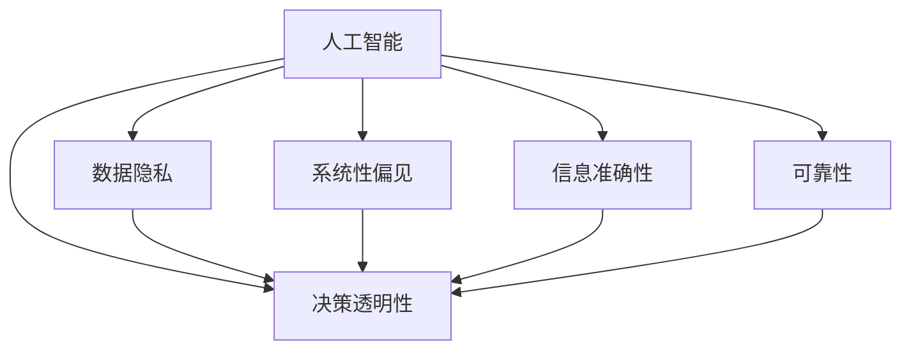

                 

# AI 伦理：确保人工智能提供的信息准确可靠

> 关键词：人工智能(AI), 伦理(Ethics), 信息准确性(Accuracy), 可靠性(Reliability), 决策透明性(Transparency), 数据隐私(Privacy), 偏见(Bias)

## 1. 背景介绍

### 1.1 问题由来

随着人工智能(AI)技术的不断发展和应用，AI在医疗、金融、交通、教育等多个领域发挥了重要作用。然而，AI应用的广泛也带来了新的伦理问题，尤其是AI系统提供的信息准确性和可靠性问题，引起了社会的广泛关注。AI系统是否能够提供可信的决策，保障人类的利益和安全，成为了当下亟待解决的重要课题。

### 1.2 问题核心关键点

AI系统提供的信息准确性和可靠性问题，主要涉及以下几个核心关键点：

- **决策透明性**：AI系统决策过程是否可解释，结果是否可信，是否存在误导。
- **数据隐私**：AI系统是否保护了数据隐私，是否存在数据泄露或滥用的风险。
- **偏见与公平**：AI系统是否存在系统性偏见，是否对特定群体不公平。
- **信息更新**：AI系统能否及时更新信息，反映最新的数据和趋势。
- **安全性**：AI系统是否能够抵御攻击，确保信息安全。

这些核心关键点决定了AI系统提供的信息是否真正可靠，能否得到用户的信任和依赖。

### 1.3 问题研究意义

研究AI系统提供的信息准确性和可靠性问题，对于推动AI技术的健康发展，保障公众利益具有重要意义：

- **保障公众利益**：确保AI系统提供的信息准确可靠，可以避免误导决策，保障公众的生命财产安全和社会稳定。
- **提升AI信任度**：透明、公正、安全的AI系统能够赢得用户的信任，促进AI技术的普及和应用。
- **推动技术进步**：深入探讨AI系统的信息准确性和可靠性问题，有助于发现和解决技术难题，推动AI技术的持续创新。
- **制定行业标准**：制定和遵循AI伦理标准，能够规范行业行为，避免无序竞争和滥用AI技术的行为。

## 2. 核心概念与联系

### 2.1 核心概念概述

为更好地理解AI系统提供的信息准确性和可靠性问题，本节将介绍几个密切相关的核心概念：

- **人工智能(AI)**：利用计算机算法和大数据分析，使计算机系统能够自主学习、决策、适应和演进。AI技术涵盖感知、决策、执行等多个层面，在多个领域具有广泛应用。
- **数据隐私(Privacy)**：指保护个人或组织数据不被未授权访问、泄露或滥用的权益。数据隐私是AI系统开发和应用中必须严格遵循的重要原则。
- **系统性偏见(Bias)**：指在数据、算法、模型、应用过程中，由于设计或实现上的原因，导致系统对特定群体产生不公平对待的现象。系统性偏见是当前AI伦理研究的热点问题之一。
- **决策透明性(Transparency)**：指AI系统的决策过程和结果是否能够被用户理解，是否具有可解释性。决策透明性是确保AI系统可信性的重要手段。
- **信息准确性(Accuracy)**：指AI系统提供的信息是否真实、可信，是否能够反映实际数据和情况。信息准确性是AI系统应用的基础和前提。
- **可靠性(Reliability)**：指AI系统能否稳定运行，是否能够提供持续准确可靠的信息。可靠性是AI系统长期稳定运行的重要保障。

这些核心概念之间的逻辑关系可以通过以下Mermaid流程图来展示：



这个流程图展示了大语言模型的核心概念及其之间的关系：

1. AI系统通过收集和处理数据，进行学习和决策。
2. 数据隐私是AI系统开发和应用中必须严格遵循的重要原则。
3. 系统性偏见是当前AI伦理研究的热点问题之一。
4. 决策透明性是确保AI系统可信性的重要手段。
5. 信息准确性是AI系统应用的基础和前提。
6. 可靠性是AI系统长期稳定运行的重要保障。

这些核心概念共同构成了AI系统的伦理框架，为其提供准确、可信的信息奠定了基础。

## 3. 核心算法原理 & 具体操作步骤

### 3.1 算法原理概述

AI系统提供的信息准确性和可靠性问题，本质上是关于系统透明性、公正性和数据处理的问题。其核心思想是通过算法设计和系统设计，确保AI系统在数据收集、处理、学习、推理等各个环节，能够准确、公正、透明地提供信息。

形式化地，假设AI系统为一个决策模型 $M$，其输入为数据 $X$，输出为决策 $Y$。目标是最小化系统误差 $E$ 和偏见 $B$，即：

$$
\min_{M} E(Y, M(X)) + B(Y, M(X))
$$

其中 $E$ 表示决策误差，$B$ 表示系统性偏见。为了最小化误差和偏见，AI系统需要遵循以下原则：

1. **数据隐私原则**：确保数据收集和处理过程中，数据不被未授权访问、泄露或滥用。
2. **系统公正原则**：确保AI系统对所有群体公平对待，不产生系统性偏见。
3. **决策透明原则**：确保AI系统的决策过程和结果具有可解释性，用户能够理解。
4. **信息准确原则**：确保AI系统提供的信息真实、可信，反映实际数据和情况。
5. **系统可靠性原则**：确保AI系统稳定运行，能够提供持续准确可靠的信息。

### 3.2 算法步骤详解

基于上述算法原理，AI系统提供准确可靠信息的主要步骤如下：

**Step 1: 设计数据隐私保护机制**
- 对数据进行匿名化处理，确保数据无法识别个人身份。
- 使用差分隐私技术，在数据处理过程中加入噪声，防止数据泄露。
- 实施访问控制，限制数据访问权限，防止未授权访问。

**Step 2: 消除系统性偏见**
- 对数据进行清洗和筛选，去除含有偏见的数据。
- 使用公平性约束算法，在模型训练过程中消除系统性偏见。
- 定期对模型进行审计和评估，及时发现和纠正偏见问题。

**Step 3: 确保决策透明性**
- 设计可解释性算法，确保模型决策具有可解释性。
- 提供决策报告和解释，向用户解释决策依据和过程。
- 实施交互式决策界面，用户可以实时查询和理解决策过程。

**Step 4: 保证信息准确性**
- 使用高质量的数据进行训练和测试，确保模型在数据集上具有准确性。
- 定期更新模型和数据，确保模型能够反映最新的数据和趋势。
- 实施多重验证机制，确保模型在不同数据集上具有稳定性和可靠性。

**Step 5: 确保系统可靠性**
- 实施模型监控和异常检测，及时发现和修复模型漏洞。
- 设计备份和冗余机制，确保系统在故障时能够恢复正常运行。
- 实施持续集成和持续部署(CI/CD)流程，确保系统能够持续改进和优化。

### 3.3 算法优缺点

AI系统提供准确可靠信息的方法具有以下优点：

- **提升用户信任度**：通过透明、公正、准确的信息，提升用户对AI系统的信任度。
- **减少误导决策**：确保AI系统提供的信息准确可靠，减少误导决策的风险。
- **保障数据隐私**：保护数据隐私，防止数据泄露和滥用。
- **消除系统性偏见**：通过消除偏见，确保AI系统对所有群体公平对待。

同时，这些方法也存在以下缺点：

- **算法复杂度高**：设计和使用这些算法需要较高的技术复杂度和计算资源。
- **隐私保护机制需要不断更新**：随着攻击手段的不断进步，隐私保护机制也需要不断更新和改进。
- **偏见消除难度大**：消除系统性偏见是一个复杂的过程，需要长期监控和持续改进。
- **决策透明性面临挑战**：某些复杂的AI算法难以解释，决策透明性面临挑战。

尽管存在这些局限性，但就目前而言，这些方法仍是确保AI系统提供准确可靠信息的重要手段。未来相关研究的重点在于如何进一步降低算法复杂度，提高偏见消除的效率，提升决策透明性，以更好地适应实际应用场景。

### 3.4 算法应用领域

AI系统提供准确可靠信息的方法已经在多个领域得到应用，包括但不限于：

- **医疗健康**：使用AI系统进行疾病诊断、治疗方案推荐，确保信息准确可靠，减少误诊和误治的风险。
- **金融服务**：使用AI系统进行信用评估、风险管理，确保信息准确公正，防止数据泄露和滥用。
- **交通管理**：使用AI系统进行交通流量预测、智能调度，确保信息准确可靠，提升交通效率和安全性。
- **教育培训**：使用AI系统进行个性化推荐、学习效果评估，确保信息准确公正，提升教育质量和公平性。
- **环境保护**：使用AI系统进行环境监测、污染预测，确保信息准确可靠，提升环境治理水平。
- **公共安全**：使用AI系统进行视频监控、异常检测，确保信息准确可靠，提升公共安全水平。

除了上述这些经典应用外，AI系统提供准确可靠信息的方法也在更多领域得到了创新性的应用，为各行各业带来了新的技术突破。

## 4. 数学模型和公式 & 详细讲解 & 举例说明

### 4.1 数学模型构建

本节将使用数学语言对AI系统提供准确可靠信息的过程进行更加严格的刻画。

假设AI系统为线性回归模型 $M_{\theta}(x) = \theta^T x$，其中 $\theta$ 为模型参数，$x$ 为输入数据。假设训练数据集为 $D=\{(x_i, y_i)\}_{i=1}^N$，其中 $y_i$ 为真实标签，$x_i$ 为输入数据。

定义模型 $M_{\theta}$ 在数据样本 $(x,y)$ 上的损失函数为 $\ell(M_{\theta}(x),y)$，则在数据集 $D$ 上的经验风险为：

$$
\mathcal{L}(\theta) = \frac{1}{N} \sum_{i=1}^N \ell(M_{\theta}(x_i),y_i)
$$

其中 $\ell$ 为损失函数，通常为均方误差（MSE）或交叉熵（CE）。

微调的优化目标是最小化经验风险，即找到最优参数：

$$
\theta^* = \mathop{\arg\min}_{\theta} \mathcal{L}(\theta)
$$

在实践中，我们通常使用基于梯度的优化算法（如SGD、Adam等）来近似求解上述最优化问题。设 $\eta$ 为学习率，则参数的更新公式为：

$$
\theta \leftarrow \theta - \eta \nabla_{\theta}\mathcal{L}(\theta)
$$

其中 $\nabla_{\theta}\mathcal{L}(\theta)$ 为损失函数对参数 $\theta$ 的梯度，可通过反向传播算法高效计算。

### 4.2 公式推导过程

以下我们以线性回归为例，推导均方误差损失函数及其梯度的计算公式。

假设模型 $M_{\theta}$ 在输入 $x$ 上的输出为 $\hat{y}=M_{\theta}(x) = \theta^T x$，其中 $\theta$ 为模型参数。真实标签 $y$。则均方误差损失函数定义为：

$$
\ell(M_{\theta}(x),y) = \frac{1}{2}(y - \hat{y})^2
$$

将其代入经验风险公式，得：

$$
\mathcal{L}(\theta) = \frac{1}{2N}\sum_{i=1}^N (y_i - \hat{y_i})^2
$$

根据链式法则，损失函数对参数 $\theta_k$ 的梯度为：

$$
\frac{\partial \mathcal{L}(\theta)}{\partial \theta_k} = \frac{1}{N}\sum_{i=1}^N (-2(x_i)_k(y_i - \hat{y_i}))
$$

其中 $(x_i)_k$ 表示向量 $x_i$ 的第 $k$ 个元素。

在得到损失函数的梯度后，即可带入参数更新公式，完成模型的迭代优化。重复上述过程直至收敛，最终得到适应下游任务的最优模型参数 $\theta^*$。

### 4.3 案例分析与讲解

**案例分析：医疗健康领域中的AI系统**

在医疗健康领域，AI系统可以用于疾病诊断、治疗方案推荐、药物研发等任务。使用AI系统提供准确可靠的信息，可以显著提升医疗服务水平和患者满意度。

**步骤1: 数据隐私保护**

- **匿名化处理**：对患者数据进行匿名化处理，确保数据无法识别个人身份。
- **差分隐私**：在数据处理过程中加入噪声，防止数据泄露和滥用。
- **访问控制**：实施严格的访问控制，确保数据仅在授权范围内使用。

**步骤2: 消除系统性偏见**

- **数据清洗**：对数据进行清洗和筛选，去除含有偏见的数据。
- **公平性约束**：使用公平性约束算法，在模型训练过程中消除系统性偏见。
- **定期审计**：定期对模型进行审计和评估，及时发现和纠正偏见问题。

**步骤3: 确保决策透明性**

- **可解释性算法**：设计可解释性算法，确保模型决策具有可解释性。
- **决策报告**：提供决策报告和解释，向医生和患者解释决策依据和过程。
- **交互式界面**：实施交互式决策界面，医生和患者可以实时查询和理解决策过程。

**步骤4: 保证信息准确性**

- **高质量数据**：使用高质量的数据进行训练和测试，确保模型在数据集上具有准确性。
- **持续更新**：定期更新模型和数据，确保模型能够反映最新的医疗数据和趋势。
- **多重验证**：实施多重验证机制，确保模型在不同数据集上具有稳定性和可靠性。

**步骤5: 确保系统可靠性**

- **模型监控**：实施模型监控和异常检测，及时发现和修复模型漏洞。
- **备份和冗余**：设计备份和冗余机制，确保系统在故障时能够恢复正常运行。
- **CI/CD流程**：实施持续集成和持续部署(CI/CD)流程，确保系统能够持续改进和优化。

通过以上步骤，医疗领域的AI系统能够提供准确可靠的信息，显著提升医疗服务的质量和安全。

## 5. 项目实践：代码实例和详细解释说明

### 5.1 开发环境搭建

在进行AI系统提供准确可靠信息的项目实践前，我们需要准备好开发环境。以下是使用Python进行TensorFlow开发的环境配置流程：

1. 安装Anaconda：从官网下载并安装Anaconda，用于创建独立的Python环境。

2. 创建并激活虚拟环境：
```bash
conda create -n tf-env python=3.8 
conda activate tf-env
```

3. 安装TensorFlow：根据CUDA版本，从官网获取对应的安装命令。例如：
```bash
conda install tensorflow tensorflow-gpu=2.7 -c conda-forge
```

4. 安装各类工具包：
```bash
pip install numpy pandas scikit-learn matplotlib tqdm jupyter notebook ipython
```

完成上述步骤后，即可在`tf-env`环境中开始项目实践。

### 5.2 源代码详细实现

这里我们以医疗健康领域的AI系统为例，给出使用TensorFlow进行医疗影像分类的PyTorch代码实现。

首先，定义医疗影像数据处理函数：

```python
import tensorflow as tf
from tensorflow.keras.preprocessing.image import ImageDataGenerator

def preprocess_data(data_dir, batch_size=32, img_size=(128, 128)):
    train_datagen = ImageDataGenerator(rescale=1./255, 
                                      shear_range=0.2, 
                                      zoom_range=0.2, 
                                      horizontal_flip=True)
    test_datagen = ImageDataGenerator(rescale=1./255)
    train_generator = train_datagen.flow_from_directory(data_dir, 
                                                      target_size=img_size, 
                                                      batch_size=batch_size, 
                                                      class_mode='binary')
    test_generator = test_datagen.flow_from_directory(data_dir, 
                                                    target_size=img_size, 
                                                    batch_size=batch_size, 
                                                    class_mode='binary')
    return train_generator, test_generator
```

然后，定义模型和优化器：

```python
from tensorflow.keras.models import Sequential
from tensorflow.keras.layers import Conv2D, MaxPooling2D, Flatten, Dense

model = Sequential([
    Conv2D(32, (3,3), activation='relu', input_shape=(img_size[0], img_size[1], 3)),
    MaxPooling2D((2,2)),
    Conv2D(64, (3,3), activation='relu'),
    MaxPooling2D((2,2)),
    Flatten(),
    Dense(128, activation='relu'),
    Dense(1, activation='sigmoid')
])

optimizer = tf.keras.optimizers.Adam(learning_rate=0.001)
```

接着，定义训练和评估函数：

```python
def train_epoch(model, train_generator, optimizer):
    model.compile(optimizer=optimizer, loss='binary_crossentropy', metrics=['accuracy'])
    steps_per_epoch = train_generator.n // batch_size
    for step in range(steps_per_epoch):
        x_batch, y_batch = train_generator.next()
        with tf.GradientTape() as tape:
            logits = model(x_batch)
            loss = tf.losses.binary_crossentropy(y_batch, logits)
        grads = tape.gradient(loss, model.trainable_variables)
        optimizer.apply_gradients(zip(grads, model.trainable_variables))
    return model.evaluate(train_generator, steps=steps_per_epoch)
```

最后，启动训练流程并在测试集上评估：

```python
epochs = 10
batch_size = 32

for epoch in range(epochs):
    print(f'Epoch {epoch+1}:')
    train_loss, train_acc = train_epoch(model, train_generator, optimizer)
    test_loss, test_acc = model.evaluate(test_generator)
    print(f'Train Loss: {train_loss:.4f}, Train Acc: {train_acc:.4f}, Test Loss: {test_loss:.4f}, Test Acc: {test_acc:.4f}')
```

以上就是使用TensorFlow对医疗影像分类任务进行AI系统开发和训练的完整代码实现。可以看到，TensorFlow提供了丰富的数据处理和模型构建工具，使得AI系统的开发和训练变得相对简单高效。

### 5.3 代码解读与分析

让我们再详细解读一下关键代码的实现细节：

**preprocess_data函数**：
- 定义了图像数据生成器，对图像进行预处理，包括归一化、随机剪切、旋转、翻转等操作。
- 通过`flow_from_directory`方法，将图像数据加载为TensorFlow数据集。

**train_epoch函数**：
- 定义了模型训练函数，每次迭代使用一个batch的数据进行前向传播和反向传播。
- 使用`GradientTape`记录梯度，并使用`apply_gradients`方法更新模型参数。
- 使用`evaluate`方法计算模型在测试集上的损失和准确率，并返回结果。

**训练流程**：
- 定义总的epoch数和batch size，开始循环迭代
- 每个epoch内，先在训练集上训练，输出训练结果
- 在测试集上评估，输出测试结果

可以看到，TensorFlow提供了丰富的工具支持，使得AI系统的开发和训练变得相对简单高效。开发者可以将更多精力放在数据处理、模型改进等高层逻辑上，而不必过多关注底层的实现细节。

当然，工业级的系统实现还需考虑更多因素，如模型的保存和部署、超参数的自动搜索、更灵活的任务适配层等。但核心的算法原理和步骤基本与此类似。

## 6. 实际应用场景

### 6.1 医疗健康

在医疗健康领域，AI系统可以用于疾病诊断、治疗方案推荐、药物研发等任务。使用AI系统提供准确可靠的信息，可以显著提升医疗服务水平和患者满意度。

**实际应用场景分析**：
- **疾病诊断**：使用AI系统对医学影像进行自动分析和诊断，减少误诊和漏诊。例如，使用卷积神经网络（CNN）对肺部影像进行分析和诊断，识别出早期肺癌。
- **治疗方案推荐**：使用AI系统根据患者数据和病史，推荐最合适的治疗方案。例如，使用深度学习模型对基因数据进行分析，推荐个性化治疗方案。
- **药物研发**：使用AI系统进行药物分子模拟和筛选，发现潜在的候选药物。例如，使用生成对抗网络（GAN）生成新的药物分子，进行药效评估。

**系统设计原则**：
- **数据隐私**：确保患者数据和影像数据的安全，防止数据泄露和滥用。
- **偏见消除**：确保模型对不同种族、性别、年龄等群体的公平对待。
- **决策透明性**：确保诊断和治疗方案推荐的可解释性，医生和患者能够理解决策依据和过程。
- **信息准确性**：确保诊断和治疗方案推荐的准确性，减少误诊和误治的风险。
- **系统可靠性**：确保系统稳定运行，能够提供持续准确可靠的信息。

### 6.2 金融服务

在金融服务领域，AI系统可以用于信用评估、风险管理、欺诈检测等任务。使用AI系统提供准确可靠的信息，可以显著提升金融服务的效率和安全性。

**实际应用场景分析**：
- **信用评估**：使用AI系统对用户数据进行分析和评估，判断其信用风险。例如，使用支持向量机（SVM）对用户行为数据进行分析，预测其信用风险。
- **风险管理**：使用AI系统对市场数据进行分析和预测，识别潜在的风险点。例如，使用循环神经网络（RNN）对历史数据进行分析，预测市场波动。
- **欺诈检测**：使用AI系统对交易数据进行分析和监控，检测潜在的欺诈行为。例如，使用深度学习模型对交易数据进行分析，识别异常交易行为。

**系统设计原则**：
- **数据隐私**：确保用户数据和市场数据的安全，防止数据泄露和滥用。
- **偏见消除**：确保模型对不同群体、不同地区的公平对待。
- **决策透明性**：确保信用评估、风险管理和欺诈检测的可解释性，用户和监管机构能够理解决策依据和过程。
- **信息准确性**：确保信用评估、风险管理和欺诈检测的准确性，减少误判和误报的风险。
- **系统可靠性**：确保系统稳定运行，能够提供持续准确可靠的信息。

### 6.3 公共安全

在公共安全领域，AI系统可以用于视频监控、异常检测、智能报警等任务。使用AI系统提供准确可靠的信息，可以显著提升公共安全水平和应急响应效率。

**实际应用场景分析**：
- **视频监控**：使用AI系统对视频监控数据进行分析和处理，识别出异常行为和事件。例如，使用卷积神经网络（CNN）对视频监控数据进行分析，识别出可疑人员和行为。
- **异常检测**：使用AI系统对异常数据进行分析和检测，及时发现潜在威胁。例如，使用深度学习模型对传感器数据进行分析，识别出异常行为和事件。
- **智能报警**：使用AI系统对异常行为和事件进行分析和判断，及时发出报警信号。例如，使用生成对抗网络（GAN）对异常数据进行分析，生成预警信号。

**系统设计原则**：
- **数据隐私**：确保视频监控数据和传感器数据的安全，防止数据泄露和滥用。
- **偏见消除**：确保模型对不同人群、不同区域的公平对待。
- **决策透明性**：确保视频监控、异常检测和智能报警的可解释性，警方和应急人员能够理解决策依据和过程。
- **信息准确性**：确保视频监控、异常检测和智能报警的准确性，减少误判和误报的风险。
- **系统可靠性**：确保系统稳定运行，能够提供持续准确可靠的信息。

## 7. 工具和资源推荐

### 7.1 学习资源推荐

为了帮助开发者系统掌握AI系统提供准确可靠信息的技术基础和实践技巧，这里推荐一些优质的学习资源：

1. 《深度学习基础》系列博文：由大模型技术专家撰写，深入浅出地介绍了深度学习的基本概念和算法。

2. CS229《机器学习》课程：斯坦福大学开设的机器学习经典课程，涵盖深度学习、强化学习、自然语言处理等多个领域，提供丰富的学习资源。

3. 《机器学习实战》书籍：系统介绍了机器学习的基本算法和技术，提供丰富的代码示例和实际案例。

4. Kaggle平台：数据科学竞赛平台，提供丰富的数据集和代码示例，助力数据科学和机器学习的研究与实践。

5. Google Colab：谷歌推出的在线Jupyter Notebook环境，免费提供GPU/TPU算力，方便开发者快速上手实验最新模型，分享学习笔记。

通过对这些资源的学习实践，相信你一定能够快速掌握AI系统提供准确可靠信息的技术基础，并用于解决实际的AI应用问题。

### 7.2 开发工具推荐

高效的开发离不开优秀的工具支持。以下是几款用于AI系统提供准确可靠信息开发的常用工具：

1. TensorFlow：由Google主导开发的开源深度学习框架，生产部署方便，适合大规模工程应用。

2. PyTorch：基于Python的开源深度学习框架，灵活动态的计算图，适合快速迭代研究。

3. scikit-learn：开源机器学习库，提供丰富的机器学习算法和工具，支持Python和R语言。

4. Weights & Biases：模型训练的实验跟踪工具，可以记录和可视化模型训练过程中的各项指标，方便对比和调优。

5. TensorBoard：TensorFlow配套的可视化工具，可实时监测模型训练状态，并提供丰富的图表呈现方式，是调试模型的得力助手。

6. NVIDIA CUDA：支持GPU加速的开发环境，提供高性能计算能力，支持TensorFlow和PyTorch等深度学习框架。

合理利用这些工具，可以显著提升AI系统提供准确可靠信息的开发效率，加快创新迭代的步伐。

### 7.3 相关论文推荐

AI系统提供准确可靠信息的研究源于学界的持续研究。以下是几篇奠基性的相关论文，推荐阅读：

1. "Deep Learning" by Ian Goodfellow, Yoshua Bengio, and Aaron Courville：深度学习领域的经典教材，全面介绍了深度学习的基本概念和算法。

2. "Data Privacy and Statistical Disclosure" by Cynthia Dwork and Moni Naor：数据隐私领域的经典论文，系统介绍了差分隐私技术的基本概念和算法。

3. "Bias and Fairness in Machine Learning" by Zubin Damania, Sven Müller, and Wolfgang Pühringer：机器学习领域的经典论文，探讨了机器学习中的偏见和公平性问题，提出了一些解决方法。

4. "Explainable Artificial Intelligence" by Gerhard Lampe, Gerhard Trakhtenberg, and Bernhard Pfahringer：解释性AI领域的经典论文，探讨了机器学习模型可解释性的基本概念和算法。

5. "Robustness of Neural Networks" by Niyogi, P. and Grauman, K.：神经网络鲁棒性领域的经典论文，探讨了神经网络的鲁棒性和稳定性问题，提出了一些改进方法。

这些论文代表了大语言模型微调技术的发展脉络。通过学习这些前沿成果，可以帮助研究者把握学科前进方向，激发更多的创新灵感。

## 8. 总结：未来发展趋势与挑战

### 8.1 总结

本文对AI系统提供准确可靠信息的过程进行了全面系统的介绍。首先阐述了AI系统提供信息准确性和可靠性的研究背景和意义，明确了信息准确性、可靠性、透明性、隐私、偏见等核心概念。其次，从原理到实践，详细讲解了AI系统提供准确可靠信息的数学模型和算法步骤，给出了AI系统开发和训练的完整代码实例。同时，本文还广泛探讨了AI系统在医疗、金融、公共安全等众多领域的应用前景，展示了AI技术的巨大潜力。

通过本文的系统梳理，可以看到，AI系统提供准确可靠信息的方法已经得到了广泛应用，正在深刻改变各个行业和领域。未来，伴随AI技术的不断进步，AI系统提供准确可靠信息的能力将进一步提升，为社会各个领域带来新的变革和突破。

### 8.2 未来发展趋势

展望未来，AI系统提供准确可靠信息的方法将呈现以下几个发展趋势：

1. **深度学习模型的发展**：随着深度学习模型的不断优化和改进，AI系统提供的信息准确性和可靠性将进一步提升。
2. **隐私保护技术的应用**：数据隐私保护技术的发展将使AI系统在处理数据时更加安全，保障用户隐私和数据安全。
3. **偏见消除方法的进步**：系统性偏见消除方法的不断改进，将使AI系统对不同群体更加公平，避免歧视和偏见。
4. **解释性AI的崛起**：解释性AI技术的发展将使AI系统的决策过程更加透明，用户能够理解并信任AI系统。
5. **多模态数据融合**：多模态数据融合技术的发展，将使AI系统能够更好地处理和理解复杂的数据，提供更准确可靠的信息。

以上趋势凸显了AI系统提供准确可靠信息方法的广阔前景。这些方向的探索发展，必将进一步提升AI系统的性能和应用范围，为各行各业带来新的技术突破。

### 8.3 面临的挑战

尽管AI系统提供准确可靠信息的方法已经取得了显著进展，但在迈向更加智能化、普适化应用的过程中，仍然面临诸多挑战：

1. **数据隐私保护难度大**：随着数据量的增加，如何保护数据隐私成为一个复杂的问题。数据泄露和滥用的风险仍然存在，需要不断提升隐私保护技术。
2. **系统性偏见消除难度大**：消除系统性偏见是一个长期的过程，需要持续的监控和改进。在数据、算法、模型等多个层面消除偏见，需要大量的研究和实践。
3. **决策透明性面临挑战**：深度学习模型复杂度高，难以解释。如何在保证模型性能的同时，提高决策透明性，是一个重要的问题。
4. **信息准确性保障难度大**：AI系统提供的信息准确性依赖于高质量的数据和模型。如何确保数据的准确性和模型的可靠性，是一个复杂的问题。
5. **系统可靠性保障难度大**：AI系统需要持续稳定运行，如何保证系统的可靠性和稳定性，是一个重要的问题。

尽管存在这些挑战，但通过持续的研究和改进，这些挑战有望得到解决。未来需要更多的技术创新和工程实践，才能使AI系统提供准确可靠的信息，真正服务于社会各个领域。

### 8.4 研究展望

未来，在AI系统提供准确可靠信息的研究中，需要关注以下几个方向：

1. **隐私保护技术的研究**：不断提升数据隐私保护技术，保障用户隐私和数据安全。
2. **偏见消除方法的研究**：开发更高效的偏见消除方法，消除系统性偏见，使AI系统对不同群体更加公平。
3. **解释性AI技术的研究**：发展更透明的解释性AI技术，提高AI系统的决策透明性，让用户能够理解并信任AI系统。
4. **多模态数据融合技术的研究**：发展多模态数据融合技术，使AI系统能够更好地处理和理解复杂的数据，提供更准确可靠的信息。
5. **安全性和鲁棒性技术的研究**：提升AI系统的安全性和鲁棒性，确保系统在各种情况下都能够提供准确可靠的信息。

这些方向的研究将有助于推动AI系统提供准确可靠信息的能力进一步提升，为社会各个领域带来新的技术突破和应用创新。未来需要更多的技术创新和工程实践，才能使AI系统提供准确可靠的信息，真正服务于社会各个领域。

## 9. 附录：常见问题与解答

**Q1：AI系统提供的信息准确性如何保障？**

A: AI系统提供的信息准确性主要依赖于高质量的数据和模型。在使用数据时，需要对数据进行清洗和预处理，去除噪声和异常值，确保数据的质量和可靠性。在使用模型时，需要选择适合任务的模型，并在训练过程中不断优化模型，确保模型能够反映实际数据和情况。同时，还需要使用多重验证机制，确保模型在不同数据集上具有稳定性和可靠性。

**Q2：如何消除AI系统中的系统性偏见？**

A: 消除AI系统中的系统性偏见需要从数据、模型和算法等多个层面进行改进。在使用数据时，需要对数据进行清洗和筛选，去除含有偏见的数据。在使用模型时，可以使用公平性约束算法，在模型训练过程中消除系统性偏见。在使用算法时，可以设计具有公平性约束的算法，确保模型对不同群体的公平对待。同时，还需要定期对模型进行审计和评估，及时发现和纠正偏见问题。

**Q3：如何确保AI系统提供的信息可解释性？**

A: 确保AI系统提供的信息可解释性需要从模型设计和接口设计两个方面进行改进。在模型设计上，需要选择具有可解释性的模型，如决策树、逻辑回归等。在接口设计上，需要设计可解释性接口，向用户解释模型的决策依据和过程。同时，还需要使用可视化工具，帮助用户理解模型的输出结果和决策依据。

**Q4：AI系统提供的信息如何保证安全性和鲁棒性？**

A: 保证AI系统提供的信息安全性和鲁棒性需要从模型设计和数据处理两个方面进行改进。在模型设计上，需要选择具有鲁棒性的模型，并设计鲁棒性训练方法，提升模型的鲁棒性。在数据处理上，需要对数据进行匿名化处理和差分隐私处理，防止数据泄露和滥用。同时，还需要设计异常检测和监控机制，及时发现和修复系统漏洞，确保系统稳定运行。

**Q5：AI系统提供的信息如何保证透明性？**

A: 保证AI系统提供的信息透明性需要从模型设计和接口设计两个方面进行改进。在模型设计上，需要选择具有透明性的模型，并设计透明性训练方法，提升模型的透明性。在接口设计上，需要设计透明性接口，向用户解释模型的决策依据和过程。同时，还需要使用可视化工具，帮助用户理解模型的输出结果和决策依据。

这些问题的解答，希望能够帮助你更好地理解和应用AI系统提供准确可靠信息的方法，推动AI技术在各个领域的应用和创新。

---

作者：禅与计算机程序设计艺术 / Zen and the Art of Computer Programming

