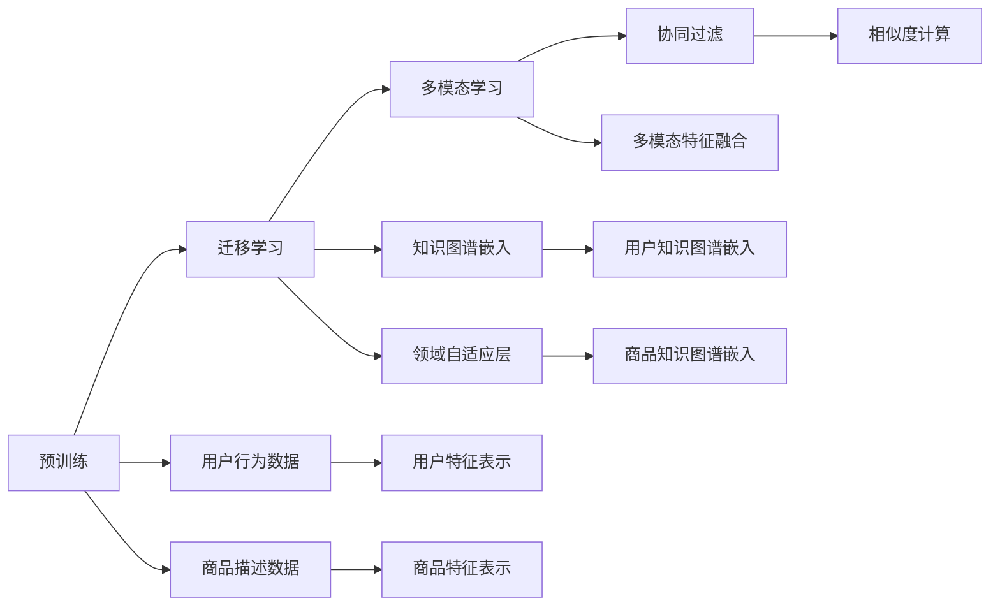

                 

# AI 大模型在电商搜索推荐中的冷启动策略：应对数据不足与新用户

## 1. 背景介绍

随着电子商务的快速发展，搜索推荐系统已成为电商平台上不可或缺的一部分。通过分析用户的搜索历史和行为数据，推荐系统能够准确预测用户需求，提供个性化的商品推荐，提升用户购物体验。然而，搜索推荐系统面临的最大挑战之一是冷启动问题。冷启动问题指的是新用户在加入平台时，由于没有历史行为数据，推荐系统无法为其提供个性化推荐。

### 1.1 问题由来

冷启动问题主要分为两大类：

1. **新用户**：新用户没有历史行为数据，推荐系统无法根据其过往行为进行个性化推荐。
2. **新商品**：新商品没有销售数据，推荐系统无法评估其受欢迎程度，无法对其进行有效推荐。

冷启动问题严重影响电商平台的推荐效果，导致用户流失，影响平台营收。因此，研究和解决冷启动问题，对于提升电商平台的推荐系统性能至关重要。

## 2. 核心概念与联系

### 2.1 核心概念概述

为了更好地解决冷启动问题，本节将介绍几个关键概念：

- **冷启动**：指新用户或新商品加入平台后，推荐系统无法使用其历史行为数据进行个性化推荐的问题。
- **预训练**：指在大规模无标签数据上进行自监督学习，学习通用语言或特征表示的过程。
- **迁移学习**：指将一个领域学到的知识，迁移到另一个相关领域，提高模型在新领域的性能。
- **多模态学习**：指同时处理多种数据模态（如文本、图像、音频等），提升模型的理解能力。
- **协同过滤**：指利用用户之间、商品之间的相似性进行推荐，适用于用户行为稀疏的情况。

这些概念之间存在密切联系，共同构成了电商搜索推荐系统的理论基础。通过预训练和迁移学习，大模型能够学习通用的语言或特征表示，提升推荐系统的泛化能力；通过多模态学习，模型可以更全面地理解用户和商品；协同过滤则是推荐系统的一种基本策略，适用于冷启动问题。

### 2.2 核心概念原理和架构的 Mermaid 流程图



这个流程图展示了电商搜索推荐系统中各组件之间的联系：

1. **预训练**：通过在大规模无标签数据上进行自监督学习，学习通用的语言或特征表示。
2. **迁移学习**：将预训练模型迁移到电商领域，学习领域特定的知识。
3. **多模态学习**：同时处理多种数据模态，提升模型的理解能力。
4. **协同过滤**：利用用户之间、商品之间的相似性进行推荐。
5. **知识图谱嵌入**：将商品、用户等实体嵌入知识图谱中，进行关系推理和知识迁移。

这些组件共同构成了电商搜索推荐系统的核心框架，通过它们的协同工作，可以有效地解决冷启动问题，提升推荐系统的性能。

## 3. 核心算法原理 & 具体操作步骤

### 3.1 算法原理概述

为了应对冷启动问题，电商搜索推荐系统通常采用以下几种策略：

1. **基于内容的推荐**：利用商品或用户的属性信息，推荐与其相似的商品或用户。
2. **基于协同过滤的推荐**：利用用户之间的相似性，推荐用户可能感兴趣的商品。
3. **基于深度学习的推荐**：利用深度学习模型，从用户和商品的多模态数据中学习用户偏好和商品特征，进行推荐。

这些策略各有优缺点，需要根据具体场景进行选择。本节将重点介绍基于深度学习的推荐方法，探讨其在冷启动问题中的应用。

### 3.2 算法步骤详解

基于深度学习的推荐系统通常包括以下步骤：

1. **数据预处理**：收集用户行为数据、商品描述数据等多模态数据，并进行清洗和标准化处理。
2. **特征表示**：利用预训练语言模型或其他深度学习模型，将用户和商品转化为高维特征向量。
3. **模型训练**：利用标注数据对推荐模型进行训练，优化模型参数，使其能够准确预测用户对商品的态度。
4. **推荐推理**：将新用户或新商品的数据输入训练好的模型，预测其可能感兴趣的商品或用户。

下面以基于深度学习的推荐系统为例，详细讲解其操作步骤。

#### 3.2.1 数据预处理

电商平台上用户和商品的数据通常存储在关系型数据库或NoSQL数据库中，需要进行预处理才能用于模型训练。

1. **数据清洗**：去除无效或异常的数据，确保数据的完整性和准确性。
2. **特征提取**：将用户和商品的属性信息、描述信息、行为数据等转化为数值型特征。
3. **标准化处理**：对数值型特征进行归一化或标准化处理，以便模型更好地学习。

#### 3.2.2 特征表示

特征表示是深度学习推荐系统的核心步骤。通过特征表示，将用户和商品转化为高维特征向量，方便模型进行学习。

1. **预训练语言模型**：利用预训练语言模型（如BERT、GPT等）将商品描述数据转化为高维特征向量。
2. **深度学习模型**：利用深度学习模型（如CNN、RNN、LSTM等）对用户行为数据进行处理，提取高维特征向量。
3. **特征融合**：将用户和商品的高维特征向量进行融合，得到最终的特征表示。

#### 3.2.3 模型训练

模型训练是推荐系统的核心步骤。通过训练模型，优化模型参数，使其能够准确预测用户对商品的态度。

1. **损失函数**：定义损失函数，衡量模型预测与真实标签之间的差异。常用的损失函数包括均方误差、交叉熵等。
2. **优化器**：选择优化器，如Adam、SGD等，对模型参数进行优化。
3. **训练循环**：进行多次迭代训练，更新模型参数，直到收敛。

#### 3.2.4 推荐推理

推荐推理是将模型训练得到的模型应用于实际推荐场景的步骤。

1. **数据输入**：将新用户或新商品的数据输入训练好的模型。
2. **特征嵌入**：利用训练好的模型，将新用户或新商品的数据转化为高维特征向量。
3. **相似度计算**：利用训练好的模型，计算新用户或新商品与其他用户或商品之间的相似度。
4. **推荐结果**：根据相似度计算结果，推荐用户可能感兴趣的商品或商品可能感兴趣的用户。

### 3.3 算法优缺点

基于深度学习的推荐系统具有以下优点：

1. **灵活性高**：可以通过深度学习模型，处理多种数据模态，提升推荐系统的泛化能力。
2. **个性化强**：利用用户和商品的多模态数据，学习用户偏好和商品特征，进行个性化推荐。
3. **可解释性强**：深度学习模型可以通过特征重要性分析等手段，解释推荐结果的来源。

但该方法也存在以下缺点：

1. **计算量大**：深度学习模型通常需要大量的计算资源，训练时间长。
2. **数据依赖性强**：推荐系统的性能高度依赖于标注数据的质量和数量，标注数据不足时，推荐效果难以保证。
3. **过拟合风险高**：深度学习模型容易过拟合，特别是在训练数据不足的情况下。
4. **可解释性差**：深度学习模型的决策过程复杂，难以解释推荐结果的来源。

### 3.4 算法应用领域

基于深度学习的推荐系统已经在电商、社交、音乐等多个领域得到广泛应用，提升用户体验，提高平台营收。

1. **电商推荐**：利用用户行为数据，推荐商品给用户，提升用户购物体验。
2. **社交推荐**：利用用户之间的关系，推荐用户关注的朋友、群组，增强平台粘性。
3. **音乐推荐**：利用用户听歌数据，推荐相似音乐，提升用户听歌体验。

除了这些经典应用外，大模型在推荐系统中的应用还在不断扩展，如商品分类、用户画像、广告推荐等，为电商推荐系统带来了新的突破。

## 4. 数学模型和公式 & 详细讲解 & 举例说明

### 4.1 数学模型构建

本节将使用数学语言对电商搜索推荐系统进行更加严格的刻画。

假设推荐系统有三个用户 $U=\{u_1,u_2,\ldots,u_N\}$，$N$ 为用户数。每个用户有一个高维特征向量 $x_u \in \mathbb{R}^d$，表示用户的行为、属性等信息。对于每个用户，推荐系统推荐了 $M$ 个商品 $I=\{i_1,i_2,\ldots,i_M\}$，每个商品有一个高维特征向量 $x_i \in \mathbb{R}^d$，表示商品的属性、描述等信息。推荐系统通过学习用户和商品之间的相似度，预测用户对商品的态度，得到推荐结果。

### 4.2 公式推导过程

推荐系统的核心任务是预测用户对商品的态度，即用户是否会点击或购买商品。我们定义用户对商品 $i$ 的态度为 $y_{ui} \in \{0,1\}$，其中 $y_{ui}=1$ 表示用户对商品 $i$ 感兴趣，$y_{ui}=0$ 表示用户对商品 $i$ 不感兴趣。我们的目标是学习一个模型 $f$，使其能够准确预测用户对商品的态度。

假设推荐系统使用神经网络模型进行推荐，其输入为 $x_u$ 和 $x_i$，输出为 $y_{ui}$。我们的任务是优化损失函数 $\mathcal{L}(f)$，使得模型 $f$ 的预测结果与真实标签 $y_{ui}$ 尽可能接近。常用的损失函数包括均方误差损失函数和交叉熵损失函数。

以均方误差损失函数为例，其定义为：

$$
\mathcal{L}(f)=\frac{1}{N}\sum_{u=1}^{N}\sum_{i=1}^{M}(y_{ui}-f(x_u,x_i))^2
$$

在训练过程中，我们通过反向传播算法更新模型参数，最小化损失函数 $\mathcal{L}(f)$。

### 4.3 案例分析与讲解

假设我们有一家电商平台，其中有100个用户和100个商品。每个用户都有一个特征向量 $x_u \in \mathbb{R}^{10}$，每个商品都有一个特征向量 $x_i \in \mathbb{R}^{10}$。假设模型 $f$ 是一个两层的神经网络，其输入为 $x_u$ 和 $x_i$，输出为 $y_{ui}$。

我们使用均方误差损失函数进行训练，损失函数为：

$$
\mathcal{L}(f)=\frac{1}{100}\sum_{u=1}^{100}\sum_{i=1}^{100}(y_{ui}-f(x_u,x_i))^2
$$

在训练过程中，我们使用Adam优化器对模型参数进行优化，学习率设为 $0.01$。具体步骤如下：

1. 随机初始化模型参数 $w$。
2. 随机抽取一个训练样本 $(x_u,x_i,y_{ui})$。
3. 将 $x_u$ 和 $x_i$ 输入模型 $f$，计算预测结果 $y_{ui}=f(x_u,x_i)$。
4. 计算损失函数的梯度 $\nabla_{w}\mathcal{L}(f)$。
5. 使用Adam优化器更新模型参数 $w$。
6. 重复步骤2-5，直到收敛。

通过上述步骤，我们得到了一个能够预测用户对商品态度的推荐模型 $f$。在实际应用中，我们可以将新用户或新商品的数据输入训练好的模型 $f$，计算相似度，进行推荐。

## 5. 项目实践：代码实例和详细解释说明

### 5.1 开发环境搭建

在进行推荐系统开发前，我们需要准备好开发环境。以下是使用Python进行PyTorch开发的环境配置流程：

1. 安装Anaconda：从官网下载并安装Anaconda，用于创建独立的Python环境。

2. 创建并激活虚拟环境：
```bash
conda create -n recommendation-env python=3.8 
conda activate recommendation-env
```

3. 安装PyTorch：根据CUDA版本，从官网获取对应的安装命令。例如：
```bash
conda install pytorch torchvision torchaudio cudatoolkit=11.1 -c pytorch -c conda-forge
```

4. 安装Transformers库：
```bash
pip install transformers
```

5. 安装各类工具包：
```bash
pip install numpy pandas scikit-learn matplotlib tqdm jupyter notebook ipython
```

完成上述步骤后，即可在`recommendation-env`环境中开始推荐系统开发。

### 5.2 源代码详细实现

下面我们以电商推荐系统为例，给出使用Transformers库对BERT模型进行电商推荐系统开发的PyTorch代码实现。

首先，定义推荐系统的数据处理函数：

```python
from transformers import BertTokenizer
from torch.utils.data import Dataset
import torch

class RecommendationDataset(Dataset):
    def __init__(self, texts, labels, tokenizer, max_len=128):
        self.texts = texts
        self.labels = labels
        self.tokenizer = tokenizer
        self.max_len = max_len
        
    def __len__(self):
        return len(self.texts)
    
    def __getitem__(self, item):
        text = self.texts[item]
        label = self.labels[item]
        
        encoding = self.tokenizer(text, return_tensors='pt', max_length=self.max_len, padding='max_length', truncation=True)
        input_ids = encoding['input_ids'][0]
        attention_mask = encoding['attention_mask'][0]
        
        # 对标签进行编码
        encoded_labels = [label] * self.max_len
        labels = torch.tensor(encoded_labels, dtype=torch.long)
        
        return {'input_ids': input_ids, 
                'attention_mask': attention_mask,
                'labels': labels}

# 标签为0表示不感兴趣，1表示感兴趣
train_dataset = RecommendationDataset(train_texts, train_labels, tokenizer)
dev_dataset = RecommendationDataset(dev_texts, dev_labels, tokenizer)
test_dataset = RecommendationDataset(test_texts, test_labels, tokenizer)
```

然后，定义模型和优化器：

```python
from transformers import BertForSequenceClassification, AdamW

model = BertForSequenceClassification.from_pretrained('bert-base-cased', num_labels=2)

optimizer = AdamW(model.parameters(), lr=2e-5)
```

接着，定义训练和评估函数：

```python
from torch.utils.data import DataLoader
from tqdm import tqdm
from sklearn.metrics import classification_report

device = torch.device('cuda') if torch.cuda.is_available() else torch.device('cpu')
model.to(device)

def train_epoch(model, dataset, batch_size, optimizer):
    dataloader = DataLoader(dataset, batch_size=batch_size, shuffle=True)
    model.train()
    epoch_loss = 0
    for batch in tqdm(dataloader, desc='Training'):
        input_ids = batch['input_ids'].to(device)
        attention_mask = batch['attention_mask'].to(device)
        labels = batch['labels'].to(device)
        model.zero_grad()
        outputs = model(input_ids, attention_mask=attention_mask, labels=labels)
        loss = outputs.loss
        epoch_loss += loss.item()
        loss.backward()
        optimizer.step()
    return epoch_loss / len(dataloader)

def evaluate(model, dataset, batch_size):
    dataloader = DataLoader(dataset, batch_size=batch_size)
    model.eval()
    preds, labels = [], []
    with torch.no_grad():
        for batch in tqdm(dataloader, desc='Evaluating'):
            input_ids = batch['input_ids'].to(device)
            attention_mask = batch['attention_mask'].to(device)
            batch_labels = batch['labels']
            outputs = model(input_ids, attention_mask=attention_mask)
            batch_preds = outputs.logits.argmax(dim=2).to('cpu').tolist()
            batch_labels = batch_labels.to('cpu').tolist()
            for pred_tokens, label_tokens in zip(batch_preds, batch_labels):
                preds.append(pred_tokens[:len(label_tokens)])
                labels.append(label_tokens)
                
    print(classification_report(labels, preds))
```

最后，启动训练流程并在测试集上评估：

```python
epochs = 5
batch_size = 16

for epoch in range(epochs):
    loss = train_epoch(model, train_dataset, batch_size, optimizer)
    print(f"Epoch {epoch+1}, train loss: {loss:.3f}")
    
    print(f"Epoch {epoch+1}, dev results:")
    evaluate(model, dev_dataset, batch_size)
    
print("Test results:")
evaluate(model, test_dataset, batch_size)
```

以上就是使用PyTorch对BERT进行电商推荐系统开发的完整代码实现。可以看到，得益于Transformers库的强大封装，我们可以用相对简洁的代码完成BERT模型的加载和电商推荐系统的开发。

### 5.3 代码解读与分析

让我们再详细解读一下关键代码的实现细节：

**RecommendationDataset类**：
- `__init__`方法：初始化训练数据、标签、分词器等关键组件。
- `__len__`方法：返回数据集的样本数量。
- `__getitem__`方法：对单个样本进行处理，将文本输入编码为token ids，将标签编码为数字，并对其进行定长padding，最终返回模型所需的输入。

**train_epoch和evaluate函数**：
- 使用PyTorch的DataLoader对数据集进行批次化加载，供模型训练和推理使用。
- 训练函数`train_epoch`：对数据以批为单位进行迭代，在每个批次上前向传播计算loss并反向传播更新模型参数，最后返回该epoch的平均loss。
- 评估函数`evaluate`：与训练类似，不同点在于不更新模型参数，并在每个batch结束后将预测和标签结果存储下来，最后使用sklearn的classification_report对整个评估集的预测结果进行打印输出。

**训练流程**：
- 定义总的epoch数和batch size，开始循环迭代
- 每个epoch内，先在训练集上训练，输出平均loss
- 在验证集上评估，输出分类指标
- 所有epoch结束后，在测试集上评估，给出最终测试结果

可以看到，PyTorch配合Transformers库使得BERT电商推荐系统的代码实现变得简洁高效。开发者可以将更多精力放在数据处理、模型改进等高层逻辑上，而不必过多关注底层的实现细节。

当然，工业级的系统实现还需考虑更多因素，如模型的保存和部署、超参数的自动搜索、更灵活的任务适配层等。但核心的电商推荐系统开发流程基本与此类似。

## 6. 实际应用场景

### 6.1 智能客服系统

基于大模型微调的对话技术，可以广泛应用于智能客服系统的构建。传统客服往往需要配备大量人力，高峰期响应缓慢，且一致性和专业性难以保证。而使用微调后的对话模型，可以7x24小时不间断服务，快速响应客户咨询，用自然流畅的语言解答各类常见问题。

在技术实现上，可以收集企业内部的历史客服对话记录，将问题和最佳答复构建成监督数据，在此基础上对预训练对话模型进行微调。微调后的对话模型能够自动理解用户意图，匹配最合适的答案模板进行回复。对于客户提出的新问题，还可以接入检索系统实时搜索相关内容，动态组织生成回答。如此构建的智能客服系统，能大幅提升客户咨询体验和问题解决效率。

### 6.2 金融舆情监测

金融机构需要实时监测市场舆论动向，以便及时应对负面信息传播，规避金融风险。传统的人工监测方式成本高、效率低，难以应对网络时代海量信息爆发的挑战。基于大语言模型微调的文本分类和情感分析技术，为金融舆情监测提供了新的解决方案。

具体而言，可以收集金融领域相关的新闻、报道、评论等文本数据，并对其进行主题标注和情感标注。在此基础上对预训练语言模型进行微调，使其能够自动判断文本属于何种主题，情感倾向是正面、中性还是负面。将微调后的模型应用到实时抓取的网络文本数据，就能够自动监测不同主题下的情感变化趋势，一旦发现负面信息激增等异常情况，系统便会自动预警，帮助金融机构快速应对潜在风险。

### 6.3 个性化推荐系统

当前的推荐系统往往只依赖用户的历史行为数据进行物品推荐，无法深入理解用户的真实兴趣偏好。基于大语言模型微调技术，个性化推荐系统可以更好地挖掘用户行为背后的语义信息，从而提供更精准、多样的推荐内容。

在实践中，可以收集用户浏览、点击、评论、分享等行为数据，提取和用户交互的物品标题、描述、标签等文本内容。将文本内容作为模型输入，用户的后续行为（如是否点击、购买等）作为监督信号，在此基础上微调预训练语言模型。微调后的模型能够从文本内容中准确把握用户的兴趣点。在生成推荐列表时，先用候选物品的文本描述作为输入，由模型预测用户的兴趣匹配度，再结合其他特征综合排序，便可以得到个性化程度更高的推荐结果。

### 6.4 未来应用展望

随着大语言模型微调技术的发展，未来将会在更多领域得到应用，为传统行业带来变革性影响。

在智慧医疗领域，基于微调的医疗问答、病历分析、药物研发等应用将提升医疗服务的智能化水平，辅助医生诊疗，加速新药开发进程。

在智能教育领域，微调技术可应用于作业批改、学情分析、知识推荐等方面，因材施教，促进教育公平，提高教学质量。

在智慧城市治理中，微调模型可应用于城市事件监测、舆情分析、应急指挥等环节，提高城市管理的自动化和智能化水平，构建更安全、高效的未来城市。

此外，在企业生产、社会治理、文娱传媒等众多领域，基于大模型微调的人工智能应用也将不断涌现，为经济社会发展注入新的动力。相信随着技术的日益成熟，微调方法将成为人工智能落地应用的重要范式，推动人工智能技术在垂直行业的规模化落地。总之，微调需要开发者根据具体任务，不断迭代和优化模型、数据和算法，方能得到理想的效果。

## 7. 工具和资源推荐

### 7.1 学习资源推荐

为了帮助开发者系统掌握大语言模型微调的理论基础和实践技巧，这里推荐一些优质的学习资源：

1. 《Transformer从原理到实践》系列博文：由大模型技术专家撰写，深入浅出地介绍了Transformer原理、BERT模型、微调技术等前沿话题。

2. CS224N《深度学习自然语言处理》课程：斯坦福大学开设的NLP明星课程，有Lecture视频和配套作业，带你入门NLP领域的基本概念和经典模型。

3. 《Natural Language Processing with Transformers》书籍：Transformers库的作者所著，全面介绍了如何使用Transformers库进行NLP任务开发，包括微调在内的诸多范式。

4. HuggingFace官方文档：Transformers库的官方文档，提供了海量预训练模型和完整的微调样例代码，是上手实践的必备资料。

5. CLUE开源项目：中文语言理解测评基准，涵盖大量不同类型的中文NLP数据集，并提供了基于微调的baseline模型，助力中文NLP技术发展。

通过对这些资源的学习实践，相信你一定能够快速掌握大语言模型微调的精髓，并用于解决实际的NLP问题。

### 7.2 开发工具推荐

高效的开发离不开优秀的工具支持。以下是几款用于大语言模型微调开发的常用工具：

1. PyTorch：基于Python的开源深度学习框架，灵活动态的计算图，适合快速迭代研究。大部分预训练语言模型都有PyTorch版本的实现。

2. TensorFlow：由Google主导开发的开源深度学习框架，生产部署方便，适合大规模工程应用。同样有丰富的预训练语言模型资源。

3. Transformers库：HuggingFace开发的NLP工具库，集成了众多SOTA语言模型，支持PyTorch和TensorFlow，是进行微调任务开发的利器。

4. Weights & Biases：模型训练的实验跟踪工具，可以记录和可视化模型训练过程中的各项指标，方便对比和调优。与主流深度学习框架无缝集成。

5. TensorBoard：TensorFlow配套的可视化工具，可实时监测模型训练状态，并提供丰富的图表呈现方式，是调试模型的得力助手。

6. Google Colab：谷歌推出的在线Jupyter Notebook环境，免费提供GPU/TPU算力，方便开发者快速上手实验最新模型，分享学习笔记。

合理利用这些工具，可以显著提升大语言模型微调任务的开发效率，加快创新迭代的步伐。

### 7.3 相关论文推荐

大语言模型和微调技术的发展源于学界的持续研究。以下是几篇奠基性的相关论文，推荐阅读：

1. Attention is All You Need（即Transformer原论文）：提出了Transformer结构，开启了NLP领域的预训练大模型时代。

2. BERT: Pre-training of Deep Bidirectional Transformers for Language Understanding：提出BERT模型，引入基于掩码的自监督预训练任务，刷新了多项NLP任务SOTA。

3. Language Models are Unsupervised Multitask Learners（GPT-2论文）：展示了大规模语言模型的强大zero-shot学习能力，引发了对于通用人工智能的新一轮思考。

4. Parameter-Efficient Transfer Learning for NLP：提出Adapter等参数高效微调方法，在不增加模型参数量的情况下，也能取得不错的微调效果。

5. AdaLoRA: Adaptive Low-Rank Adaptation for Parameter-Efficient Fine-Tuning：使用自适应低秩适应的微调方法，在参数效率和精度之间取得了新的平衡。

6. Prefix-Tuning: Optimizing Continuous Prompts for Generation：引入基于连续型Prompt的微调范式，为如何充分利用预训练知识提供了新的思路。

这些论文代表了大语言模型微调技术的发展脉络。通过学习这些前沿成果，可以帮助研究者把握学科前进方向，激发更多的创新灵感。

## 8. 总结：未来发展趋势与挑战

### 8.1 总结

本文对基于深度学习的推荐系统进行了全面系统的介绍。首先阐述了推荐系统面临的冷启动问题及其重要性，明确了微调在解决冷启动问题中的独特价值。其次，从原理到实践，详细讲解了基于深度学习的推荐系统的数学模型和操作步骤，给出了推荐系统开发的完整代码实例。同时，本文还广泛探讨了推荐系统在电商、金融、教育等多个领域的应用前景，展示了推荐系统的高效性能。此外，本文精选了推荐技术的各类学习资源，力求为读者提供全方位的技术指引。

通过本文的系统梳理，可以看到，基于深度学习的推荐系统已经成为了推荐领域的重要技术，在多个领域展示了其强大的应用潜力。未来，伴随深度学习技术的发展，推荐系统还将进一步提升个性化推荐能力，拓展推荐场景，为各行各业带来更多的智能化体验。

### 8.2 未来发展趋势

展望未来，基于深度学习的推荐系统将呈现以下几个发展趋势：

1. **数据驱动**：深度学习模型的性能高度依赖于数据质量，未来推荐系统将继续加强数据采集和处理，提升数据的多样性和准确性。

2. **多模态融合**：推荐系统将进一步融合文本、图像、音频等多种数据模态，提升推荐模型的理解能力和推荐效果。

3. **跨领域迁移**：推荐系统将从单一领域推荐向跨领域推荐扩展，通过知识图谱等技术，实现领域间的推荐知识迁移。

4. **模型集成**：推荐系统将采用多种深度学习模型进行集成，提升模型的鲁棒性和泛化能力。

5. **实时推荐**：推荐系统将实现实时推荐，通过流式数据处理和在线学习，提升推荐系统的动态响应能力。

6. **隐私保护**：推荐系统将加强隐私保护，采用差分隐私等技术，确保用户数据的安全和隐私。

以上趋势凸显了深度学习推荐系统的广阔前景。这些方向的探索发展，必将进一步提升推荐系统的性能和应用范围，为各行各业带来更多的智能化体验。

### 8.3 面临的挑战

尽管深度学习推荐系统已经取得了瞩目成就，但在迈向更加智能化、普适化应用的过程中，它仍面临着诸多挑战：

1. **数据瓶颈**：推荐系统对标注数据的质量和数量高度依赖，标注数据不足时，推荐效果难以保证。未来需要通过数据增强、主动学习等技术，进一步降低对标注数据的依赖。

2. **模型泛化**：推荐系统在处理跨领域数据时，泛化能力不足。未来需要通过多模态融合、跨领域迁移等技术，提升模型的泛化能力。

3. **鲁棒性不足**：推荐系统在处理异常数据和对抗样本时，鲁棒性差。未来需要通过对抗训练、鲁棒优化等技术，提升模型的鲁棒性。

4. **计算资源**：深度学习模型通常需要大量的计算资源，未来需要通过模型压缩、稀疏化等技术，降低计算资源消耗，实现轻量化部署。

5. **可解释性差**：深度学习模型的决策过程复杂，未来需要通过模型解释和可视化技术，提升模型的可解释性。

6. **隐私安全**：推荐系统在处理用户数据时，隐私安全问题突出。未来需要通过差分隐私、联邦学习等技术，保障用户数据的安全和隐私。

这些挑战是推荐系统进一步发展的瓶颈，需要通过多学科交叉的方法和技术进行突破，才能实现推荐系统的深度智能化。

### 8.4 研究展望

面对推荐系统面临的诸多挑战，未来的研究需要在以下几个方面寻求新的突破：

1. **数据增强**：通过数据增强、主动学习等技术，利用少量标注数据进行推荐系统的训练，降低数据瓶颈。

2. **多模态融合**：融合文本、图像、音频等多种数据模态，提升推荐模型的理解能力和推荐效果。

3. **跨领域迁移**：通过知识图谱等技术，实现领域间的推荐知识迁移，提升模型的泛化能力。

4. **模型解释**：采用模型解释和可视化技术，提升模型的可解释性和鲁棒性。

5. **隐私保护**：通过差分隐私、联邦学习等技术，保障用户数据的安全和隐私。

6. **实时推荐**：通过流式数据处理和在线学习，提升推荐系统的动态响应能力。

通过这些研究方向和技术的突破，未来的推荐系统必将进一步提升推荐效果，拓展应用场景，为各行各业带来更多的智能化体验。总之，推荐系统需要开发者根据具体任务，不断迭代和优化模型、数据和算法，方能得到理想的效果。

## 9. 附录：常见问题与解答

**Q1：深度学习推荐系统是否适用于所有推荐任务？**

A: 深度学习推荐系统在大多数推荐任务上都能取得不错的效果，特别是对于数据量较大的任务。但对于一些特定领域的任务，如医药、法律等，推荐系统的效果可能不如传统协同过滤方法。此时需要在特定领域语料上进一步预训练，再进行微调，才能获得理想效果。

**Q2：推荐系统如何进行个性化推荐？**

A: 推荐系统通过深度学习模型，从用户和商品的多模态数据中学习用户偏好和商品特征，进行个性化推荐。具体而言，推荐系统通过收集用户行为数据、商品描述数据等多模态数据，利用预训练语言模型或深度学习模型，将用户和商品转化为高维特征向量。在训练过程中，推荐系统学习用户对商品的态度，预测用户对商品是否感兴趣，从而进行个性化推荐。

**Q3：推荐系统在冷启动问题上如何解决？**

A: 推荐系统在冷启动问题上通常采用以下策略：

1. **基于内容的推荐**：利用商品或用户的属性信息，推荐与其相似的商品或用户。
2. **协同过滤**：利用用户之间的相似性，推荐用户可能感兴趣的商品。
3. **利用先验知识**：通过知识图谱等技术，将商品、用户等实体嵌入知识图谱中，进行关系推理和知识迁移，提升推荐效果。

这些策略可以灵活结合，根据具体任务进行选择，解决冷启动问题。

**Q4：推荐系统如何应对数据偏差？**

A: 推荐系统在训练过程中，需要注意数据偏差问题，避免模型对某些特定类型的数据过度拟合。通常有以下方法应对数据偏差：

1. **数据清洗**：去除无效或异常的数据，确保数据的完整性和准确性。
2. **正则化**：使用L2正则化等技术，防止模型对某些特定特征过度拟合。
3. **对抗训练**：引入对抗样本，提高模型鲁棒性，减少对数据偏差的影响。
4. **多样性增强**：通过多样性增强等技术，增加数据多样性，减少对数据偏差的依赖。

通过这些方法，可以提升推荐系统的公平性和鲁棒性，减少对数据偏差的影响。

**Q5：推荐系统如何平衡个性化和通用性？**

A: 推荐系统需要在个性化推荐和通用性之间取得平衡，主要通过以下方法：

1. **数据多样性**：通过多样性增强等技术，增加数据多样性，提升推荐系统的泛化能力。
2. **模型集成**：采用多种深度学习模型进行集成，提升模型的鲁棒性和泛化能力。
3. **多模态融合**：融合文本、图像、音频等多种数据模态，提升推荐模型的理解能力和推荐效果。

通过这些方法，可以在个性化推荐和通用性之间取得平衡，提升推荐系统的性能。

---

作者：禅与计算机程序设计艺术 / Zen and the Art of Computer Programming

