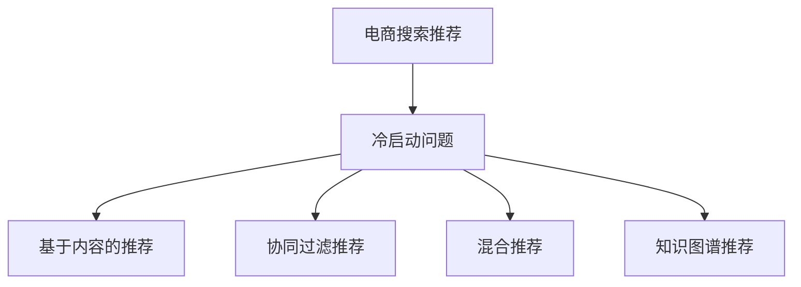

                 

# AI 大模型在电商搜索推荐中的冷启动策略：应对数据不足的挑战

## 1. 背景介绍

### 1.1 问题由来
在电商搜索推荐系统中，当新商品或用户进入市场时，数据集往往非常稀疏，系统难以利用传统机器学习模型进行有效的推荐。特别是在电商平台的冷启动阶段，用户行为数据非常有限，传统的协同过滤、基于内容的推荐方法难以奏效。这使得新的搜索推荐算法需要解决在数据不足情况下的推荐精度问题。

### 1.2 问题核心关键点
冷启动是电商搜索推荐面临的一个关键问题，需要在数据稀疏、用户行为历史短、商品稀疏等复杂场景下进行推荐。常见的冷启动策略包括基于内容的推荐、协同过滤推荐、混合推荐、知识图谱推荐等。

## 2. 核心概念与联系

### 2.1 核心概念概述

为更好地理解电商搜索推荐中的冷启动策略，本节将介绍几个密切相关的核心概念：

- 电商搜索推荐：基于用户历史行为、商品属性、实时查询等数据，为用户提供个性化的商品推荐，提升用户购物体验和转化率。
- 冷启动问题：新商品或新用户进入市场，由于数据稀疏，无法利用已有数据进行有效推荐。
- 基于内容的推荐(Content-based Recommendation)：基于商品描述、属性等商品自身信息，推荐与查询商品相似的商品。
- 协同过滤推荐(Collaborative Filtering)：通过分析用户历史行为和商品评分，寻找相似用户或相似商品进行推荐。
- 混合推荐(Hybrid Recommendation)：结合基于内容的推荐和协同过滤推荐，取长补短，提高推荐效果。
- 知识图谱推荐(Knowledge Graph Recommendation)：利用知识图谱结构化数据，通过实体关系图进行推荐。

这些核心概念之间的逻辑关系可以通过以下Mermaid流程图来展示：



这个流程图展示了几类主要的冷启动策略，以及它们之间的关系：

1. 电商搜索推荐通过各种方式获取推荐结果。
2. 当遇到数据不足的情况，比如新商品或新用户，就需要用到冷启动策略。
3. 常见的冷启动策略包括基于内容的推荐、协同过滤推荐、混合推荐和知识图谱推荐。

## 3. 核心算法原理 & 具体操作步骤
### 3.1 算法原理概述

在大模型中，冷启动问题通常被认为是一个稀疏矩阵的推荐问题。当新商品或用户进入系统时，由于缺乏足够的交互数据，推荐系统难以找到相似的商品或用户进行推荐。这时，可以利用大模型强大的表示学习能力和迁移学习能力，通过微调或微调后迁移学习的方式，将预训练语言模型应用于电商搜索推荐系统，从而缓解冷启动问题。

### 3.2 算法步骤详解

以下是基于大模型在电商搜索推荐中缓解冷启动问题的一般步骤：

**Step 1: 准备预训练模型和数据集**
- 选择合适的预训练语言模型，如BERT、GPT-3等。
- 准备电商领域的商品、用户和行为数据集，确保数据的规模和质量。

**Step 2: 设计任务适配层**
- 根据电商推荐任务，设计合适的任务适配层，通常包括商品相似度计算、用户兴趣抽取、点击率预测等。
- 定义损失函数，例如均方误差、交叉熵等。

**Step 3: 微调大模型**
- 将预训练模型作为初始化参数，使用电商推荐数据集进行微调。
- 设置合适的超参数，如学习率、批大小、迭代轮数等。
- 使用优化器（如AdamW、SGD等）进行参数更新。

**Step 4: 模型评估和优化**
- 在验证集上评估微调后模型的性能。
- 根据评估结果进行模型优化，如调整超参数、改进任务适配层等。

**Step 5: 实际部署**
- 将微调后的模型部署到电商推荐系统中。
- 在实时查询中，使用模型进行商品推荐。

### 3.3 算法优缺点

基于大模型的冷启动策略有以下优点：
1. 能够处理稀疏数据：大模型可以通过迁移学习，利用预训练过程中学到的通用知识，处理新商品和新用户的数据稀疏问题。
2. 泛化能力较强：大模型已经在大规模语料上进行了预训练，具备较强的泛化能力，能够适应多种推荐场景。
3. 无需额外数据：大模型可以在无需额外数据的情况下进行微调，适应性较强。
4. 高效性：在大模型上进行微调，通常需要的数据量和计算资源较少，能够快速适应新场景。

但同时，该方法也存在一定的局限性：
1. 依赖高质量预训练模型：大模型的效果很大程度上依赖于预训练的质量和泛化能力，构建高质量预训练模型需要耗费大量计算资源。
2. 需要大量标注数据：虽然微调过程对标注数据需求较低，但在数据稀疏情况下，仍需一定量的标注数据进行微调。
3. 可解释性不足：大模型通常是"黑盒"模型，难以解释其决策过程，对某些高风险应用可能存在挑战。
4. 资源需求高：大模型通常占用大量的计算资源和存储空间，部署和维护成本较高。

尽管存在这些局限性，但在大数据时代，大模型微调方法在电商搜索推荐中的应用前景广阔。

### 3.4 算法应用领域

基于大模型的冷启动策略在电商搜索推荐中的应用场景非常广泛，包括但不限于以下方面：

- 新商品推荐：当新商品进入系统时，利用已有的商品数据，通过大模型进行相似性分析和推荐。
- 新用户推荐：当新用户进入系统时，利用已有的用户行为数据，通过大模型进行兴趣抽取和推荐。
- 实时查询推荐：在用户进行实时查询时，利用大模型进行实时商品推荐，提升用户体验。
- 跨商品推荐：将不同类别的商品通过大模型进行关联推荐，拓展用户的选择范围。

此外，基于大模型的冷启动策略还可以应用于个性化推荐、广告推荐、内容推荐等多个电商领域，带来显著的用户体验和商业价值提升。

## 4. 数学模型和公式 & 详细讲解 & 举例说明
### 4.1 数学模型构建

本节将使用数学语言对基于大模型的电商推荐冷启动问题进行更加严格的刻画。

记电商推荐系统中的商品为 $S$，用户为 $U$，行为数据为 $B$。假设商品 $s$ 与用户 $u$ 的交互数据为 $b_{us}$，商品 $s_1$ 与 $s_2$ 的相似度为 $\text{sim}(s_1,s_2)$，用户 $u$ 对商品 $s$ 的评分 $r_{us}$ 为 $\hat{r}_{us}$。

定义模型的损失函数为：

$$
\mathcal{L} = \frac{1}{N} \sum_{u \in U} \sum_{s \in S} \sum_{s' \in S} \left( \ell(r_{us},\hat{r}_{us}) + \frac{\lambda}{2} ||w_u - w_s||^2 + \frac{\lambda}{2} ||w_s - w_{s'}||^2 \right)
$$

其中 $w_u, w_s$ 分别表示用户 $u$ 和商品 $s$ 在大模型中的表示，$\ell$ 为评分预测误差函数（如均方误差、交叉熵等），$\lambda$ 为正则化系数。

### 4.2 公式推导过程

以下我们以电商推荐为例，推导评分预测误差函数及其梯度的计算公式。

假设用户 $u$ 对商品 $s$ 的评分预测模型为 $M_{\theta}(s_u)$，其中 $\theta$ 为模型参数。评分误差函数为 $\ell(M_{\theta}(s_u),r_{us})$。

对于二分类评分预测模型，假设 $M_{\theta}(s_u) = \sigma(\langle w_u, w_s \rangle)$，其中 $\sigma$ 为激活函数，$\langle \cdot, \cdot \rangle$ 为向量点积。则评分误差函数可写为：

$$
\ell(M_{\theta}(s_u),r_{us}) = \ell(\sigma(\langle w_u, w_s \rangle),r_{us})
$$

常见的评分误差函数包括均方误差（Mean Squared Error, MSE）和交叉熵损失（Cross-Entropy Loss）：

- 均方误差：
$$
\ell_{MSE} = \frac{1}{2} ||\sigma(\langle w_u, w_s \rangle) - r_{us}||^2
$$

- 交叉熵损失：
$$
\ell_{CE} = -r_{us} \log(\sigma(\langle w_u, w_s \rangle)) + (1 - r_{us}) \log(1 - \sigma(\langle w_u, w_s \rangle))
$$

利用链式法则，评分预测误差函数对模型参数 $\theta$ 的梯度为：

$$
\nabla_{\theta}\mathcal{L} = \sum_{u \in U} \sum_{s \in S} \sum_{s' \in S} \left( \nabla_{\theta}\ell(\sigma(\langle w_u, w_s \rangle),r_{us}) + \lambda \nabla_{\theta}||w_u - w_s||^2 + \lambda \nabla_{\theta}||w_s - w_{s'}||^2 \right)
$$

其中 $\nabla_{\theta}\ell(\sigma(\langle w_u, w_s \rangle),r_{us})$ 可进一步递归展开，利用自动微分技术完成计算。

### 4.3 案例分析与讲解

下面以电商商品推荐为例，具体分析基于大模型的冷启动策略：

假设电商平台上有 $N$ 个商品，每个商品有 $D$ 个特征，预训练语言模型通过下式学习商品的特征表示：

$$
w_s = \mathcal{F}(s_{1:D})
$$

其中 $s_{1:D}$ 为商品 $s$ 的特征向量，$\mathcal{F}$ 为预训练模型的特征提取函数。

对于新商品 $s_{new}$，假设其特征向量为 $s_{new_{1:D}}$，则利用大模型的迁移学习能力，可以生成新商品的特征表示：

$$
\hat{w}_{s_{new}} = \mathcal{F}(s_{new_{1:D}})
$$

在电商推荐任务中，利用新商品 $s_{new}$ 的特征表示 $w_{s_{new}}$ 和已有的 $N$ 个商品 $s$ 的特征表示 $w_s$，可以计算新商品与已有商品的相似度 $\text{sim}(s_{new},s)$：

$$
\text{sim}(s_{new},s) = \text{sim}(w_{s_{new}},w_s)
$$

例如，可以使用余弦相似度（Cosine Similarity）计算：

$$
\text{sim}(s_{new},s) = \langle w_{s_{new}}, w_s \rangle
$$

对于新商品 $s_{new}$，可以利用已有的 $N$ 个商品 $s$ 的评分数据 $r_{us}$，进行冷启动推荐。具体地，对于新商品 $s_{new}$ 和任意商品 $s$，计算评分预测值 $\hat{r}_{us_{new}}$：

$$
\hat{r}_{us_{new}} = \sigma(\langle \hat{w}_{s_{new}}, w_s \rangle)
$$

利用评分误差函数 $\ell$，可以计算新商品与任意商品的评分误差：

$$
\ell(\hat{r}_{us_{new}},r_{us}) = \ell(\sigma(\langle \hat{w}_{s_{new}}, w_s \rangle),r_{us})
$$

最后，利用损失函数 $\mathcal{L}$ 进行模型优化，最小化评分误差：

$$
\mathcal{L} = \frac{1}{N} \sum_{s \in S} \sum_{u \in U} \ell(\hat{r}_{us_{new}},r_{us})
$$

通过上述步骤，可以基于大模型进行电商搜索推荐的冷启动，缓解数据不足问题，提高推荐精度。

## 5. 项目实践：代码实例和详细解释说明
### 5.1 开发环境搭建

在进行电商搜索推荐冷启动策略实践前，我们需要准备好开发环境。以下是使用Python进行TensorFlow开发的环境配置流程：

1. 安装Anaconda：从官网下载并安装Anaconda，用于创建独立的Python环境。

2. 创建并激活虚拟环境：
```bash
conda create -n tf-env python=3.8 
conda activate tf-env
```

3. 安装TensorFlow：根据CUDA版本，从官网获取对应的安装命令。例如：
```bash
conda install tensorflow tensorflow-gpu -c conda-forge
```

4. 安装各类工具包：
```bash
pip install numpy pandas scikit-learn matplotlib tqdm jupyter notebook ipython
```

完成上述步骤后，即可在`tf-env`环境中开始微调实践。

### 5.2 源代码详细实现

下面我们以电商商品推荐为例，给出使用TensorFlow对BERT模型进行微调的Python代码实现。

首先，定义电商商品推荐的任务适配层：

```python
import tensorflow as tf
from transformers import BertTokenizer
from transformers import TFBertForSequenceClassification

# 定义模型参数
d_model = 768
n_classes = 2

# 定义tokenizer和模型
tokenizer = BertTokenizer.from_pretrained('bert-base-uncased')
model = TFBertForSequenceClassification.from_pretrained('bert-base-uncased', num_labels=n_classes)

# 定义任务适配层
input_ids = tf.keras.layers.Input(shape=(MAX_LEN,))
input_mask = tf.keras.layers.Input(shape=(MAX_LEN,))
segment_ids = tf.keras.layers.Input(shape=(MAX_LEN,))
outputs = model(input_ids, attention_mask=input_mask, token_type_ids=segment_ids)

# 输出层
preds = tf.keras.layers.Dense(n_classes, activation='sigmoid')(outputs)
```

然后，定义优化器和训练函数：

```python
from tensorflow.keras.optimizers import Adam
from tensorflow.keras.losses import BinaryCrossentropy

# 定义优化器和损失函数
optimizer = Adam(lr=2e-5)
loss_fn = BinaryCrossentropy()

# 定义训练函数
def train_epoch(model, dataset, batch_size, optimizer, loss_fn):
    dataloader = tf.data.Dataset.from_tensor_slices((dataset.input_ids, dataset.input_mask, dataset.segment_ids, dataset.labels))
    dataloader = dataloader.shuffle(buffer_size=BATCH_SIZE).batch(BATCH_SIZE)
    
    model.compile(optimizer=optimizer, loss=loss_fn)
    model.fit(dataloader, epochs=1, validation_split=0.2)

# 定义测试函数
def evaluate(model, dataset, batch_size):
    dataloader = tf.data.Dataset.from_tensor_slices((dataset.input_ids, dataset.input_mask, dataset.segment_ids, dataset.labels))
    dataloader = datalooader.shuffle(buffer_size=BATCH_SIZE).batch(BATCH_SIZE)
    
    model.compile(optimizer=optimizer, loss=loss_fn)
    model.evaluate(dataloader)
```

最后，启动训练流程并在测试集上评估：

```python
# 设置模型参数
MAX_LEN = 128
BATCH_SIZE = 16

# 准备数据集
# 假设训练集和测试集已经准备好的tensorflow数据集
train_dataset = ...
test_dataset = ...

# 训练和评估
epochs = 5
for epoch in range(epochs):
    print(f"Epoch {epoch+1}")
    train_epoch(model, train_dataset, BATCH_SIZE, optimizer, loss_fn)
    evaluate(model, test_dataset, BATCH_SIZE)
```

以上就是使用TensorFlow对BERT模型进行电商商品推荐冷启动的完整代码实现。可以看到，得益于TensorFlow的强大封装，我们能够相对简洁地实现电商搜索推荐的冷启动策略。

### 5.3 代码解读与分析

让我们再详细解读一下关键代码的实现细节：

**任务适配层**：
- `input_ids`、`input_mask`、`segment_ids`：分别表示输入的token ids、mask和segment ids，用于模型进行编码。
- `outputs`：模型在输入上的输出，包含对商品进行分类预测的结果。
- `preds`：利用输出结果进行评分预测。

**优化器和损失函数**：
- `Adam`：优化器，用于更新模型参数。
- `BinaryCrossentropy`：损失函数，用于计算评分预测误差。

**训练和评估函数**：
- `train_epoch`函数：定义一个epoch的训练过程，使用TensorFlow的`fit`方法。
- `evaluate`函数：定义一个epoch的评估过程，使用TensorFlow的`evaluate`方法。

**训练流程**：
- 设置模型参数 `MAX_LEN`、`BATCH_SIZE`，准备训练集和测试集。
- 循环训练 `epochs` 次，每次训练一个epoch，并在测试集上评估模型性能。

可以看到，TensorFlow配合BERT模型使得电商搜索推荐的冷启动策略代码实现变得简洁高效。开发者可以将更多精力放在数据处理、模型改进等高层逻辑上，而不必过多关注底层的实现细节。

当然，工业级的系统实现还需考虑更多因素，如模型的保存和部署、超参数的自动搜索、更灵活的任务适配层等。但核心的冷启动范式基本与此类似。

## 6. 实际应用场景
### 6.1 智能客服系统

基于大模型的电商搜索推荐算法，可以广泛应用于智能客服系统的构建。传统客服往往需要配备大量人力，高峰期响应缓慢，且一致性和专业性难以保证。而使用基于大模型的搜索推荐算法，可以7x24小时不间断服务，快速响应客户查询，用自然流畅的语言进行智能客服，提升客户满意度和转化率。

在技术实现上，可以收集用户的历史查询记录和购买行为，将查询和购买记录构建成监督数据，在此基础上对预训练语言模型进行微调。微调后的模型能够自动理解用户意图，匹配最合适的商品或服务进行推荐，构建更高效的智能客服系统。

### 6.2 个性化推荐系统

基于大模型的电商搜索推荐算法，可以应用于个性化推荐系统的构建。传统的推荐系统往往只依赖用户的历史行为数据进行物品推荐，难以深度理解用户兴趣和行为背后的语义信息。

在实践中，可以收集用户浏览、点击、评论、分享等行为数据，提取和用户交互的物品标题、描述、标签等文本内容。将文本内容作为模型输入，用户的后续行为（如是否点击、购买等）作为监督信号，在此基础上微调预训练语言模型。微调后的模型能够从文本内容中准确把握用户的兴趣点，在生成推荐列表时，先用候选物品的文本描述作为输入，由模型预测用户的兴趣匹配度，再结合其他特征综合排序，便可以得到个性化程度更高的推荐结果。

### 6.3 广告推荐系统

基于大模型的电商搜索推荐算法，可以应用于广告推荐系统的构建。传统的广告推荐系统往往基于用户的历史行为进行精准投放，但随着个性化需求和用户兴趣的多样化，传统的推荐系统难以满足用户需求。

在实践中，可以利用电商推荐系统中的商品信息和用户行为数据，进行广告投放的精准匹配。具体而言，将用户的浏览、点击等行为数据与广告内容进行匹配，利用大模型进行广告推荐。微调后的模型能够自动理解用户兴趣和广告内容，进行精准投放，提高广告点击率和转化率，降低广告成本。

### 6.4 未来应用展望

随着大模型和微调方法的不断发展，基于大模型的电商搜索推荐算法将在更多领域得到应用，为电商产业带来变革性影响。

在智慧物流领域，基于大模型的推荐系统可以优化供应链管理，提高物流效率。通过实时监控和预测用户需求，动态调整库存和物流计划，实现高效、智能的物流管理。

在智慧营销领域，基于大模型的推荐系统可以进行精准营销，提升品牌影响力和用户忠诚度。通过分析用户行为数据，进行个性化推荐，提升用户体验和品牌认可度。

在智慧零售领域，基于大模型的推荐系统可以优化库存管理和货架陈列，提升商品销售效率。通过分析用户购买行为，进行商品推荐，优化库存结构，提高销售额和库存周转率。

总之，大模型在电商搜索推荐中的应用前景广阔，未来将在多个电商领域带来新的机遇和挑战。

## 7. 工具和资源推荐
### 7.1 学习资源推荐

为了帮助开发者系统掌握大模型在电商搜索推荐中的应用，这里推荐一些优质的学习资源：

1. 《深度学习在推荐系统中的应用》系列博文：由知名深度学习专家撰写，深入浅出地介绍了深度学习在推荐系统中的应用，涵盖了大模型在电商搜索推荐中的应用。

2. 《Transformer from Scratch》课程：斯坦福大学开设的NLP入门课程，系统讲解了Transformer模型的原理和实现方法。

3. 《Recommender Systems: Non-negative Matrix Factorization》书籍：系统介绍了推荐系统中的矩阵分解算法，包括基于大模型的推荐算法。

4. CS246《深度学习》课程：斯坦福大学开设的深度学习课程，涵盖深度学习的基础理论和实践方法，适合深入学习大模型的原理和应用。

5. 《推荐系统实战》书籍：系统介绍了推荐系统中的经典算法和实际应用，包括基于大模型的推荐系统。

通过对这些资源的学习实践，相信你一定能够快速掌握大模型在电商搜索推荐中的应用，并用于解决实际的推荐问题。

### 7.2 开发工具推荐

高效的开发离不开优秀的工具支持。以下是几款用于大模型在电商搜索推荐中的应用开发的常用工具：

1. TensorFlow：基于Python的开源深度学习框架，灵活性高，支持分布式计算，适合大规模深度学习模型的开发。

2. PyTorch：基于Python的开源深度学习框架，动态计算图，适合快速迭代研究。

3. Keras：基于Python的高层深度学习API，简单易用，适合快速搭建深度学习模型原型。

4. HuggingFace Transformers：提供了丰富的预训练语言模型，方便进行微调和应用。

5. Weights & Biases：模型训练的实验跟踪工具，可以记录和可视化模型训练过程中的各项指标，方便对比和调优。

6. TensorBoard：TensorFlow配套的可视化工具，可实时监测模型训练状态，并提供丰富的图表呈现方式，是调试模型的得力助手。

合理利用这些工具，可以显著提升电商搜索推荐系统的开发效率，加快创新迭代的步伐。

### 7.3 相关论文推荐

大模型在电商搜索推荐中的应用研究源于学界的持续研究。以下是几篇奠基性的相关论文，推荐阅读：

1. Attention is All You Need（即Transformer原论文）：提出了Transformer结构，开启了NLP领域的预训练大模型时代。

2. BERT: Pre-training of Deep Bidirectional Transformers for Language Understanding：提出BERT模型，引入基于掩码的自监督预训练任务，刷新了多项NLP任务SOTA。

3. Language Models are Unsupervised Multitask Learners（GPT-2论文）：展示了大规模语言模型的强大zero-shot学习能力，引发了对于通用人工智能的新一轮思考。

4. Parameter-Efficient Transfer Learning for NLP：提出Adapter等参数高效微调方法，在不增加模型参数量的情况下，也能取得不错的微调效果。

5. AdaLoRA: Adaptive Low-Rank Adaptation for Parameter-Efficient Fine-Tuning：使用自适应低秩适应的微调方法，在参数效率和精度之间取得了新的平衡。

这些论文代表了大模型在电商搜索推荐中的研究进展，为未来的研究和应用提供了理论基础。

## 8. 总结：未来发展趋势与挑战
### 8.1 总结

本文对基于大模型的电商搜索推荐冷启动策略进行了全面系统的介绍。首先阐述了大模型在电商推荐中的应用背景和冷启动问题，明确了冷启动在电商推荐中的重要性和复杂性。其次，从原理到实践，详细讲解了大模型在电商推荐中的微调方法，给出了电商商品推荐的具体代码实现。同时，本文还广泛探讨了大模型在智能客服、个性化推荐、广告推荐等多个电商领域的应用前景，展示了冷启动策略的巨大潜力。此外，本文精选了冷启动技术的各类学习资源，力求为读者提供全方位的技术指引。

通过本文的系统梳理，可以看到，基于大模型的冷启动策略在电商搜索推荐中具有广泛的应用前景，可以有效缓解数据不足问题，提升推荐精度。未来，伴随大模型和微调方法的不断演进，电商搜索推荐技术必将迎来新的突破，为电商产业带来更智能、更高效、更个性化的购物体验。

### 8.2 未来发展趋势

展望未来，大模型在电商搜索推荐领域将呈现以下几个发展趋势：

1. 模型规模持续增大。随着算力成本的下降和数据规模的扩张，预训练语言模型的参数量还将持续增长。超大规模语言模型蕴含的丰富语言知识，有望支撑更加复杂多变的电商推荐场景。

2. 微调方法日趋多样。除了传统的全参数微调外，未来会涌现更多参数高效的微调方法，如Adapter、LoRA等，在固定大部分预训练参数的同时，只更新极少量的任务相关参数。

3. 持续学习成为常态。随着数据分布的不断变化，冷启动模型也需要持续学习新知识以保持性能。如何在不遗忘原有知识的同时，高效吸收新样本信息，将成为重要的研究课题。

4. 标注样本需求降低。受启发于提示学习(Prompt-based Learning)的思路，未来的冷启动方法将更好地利用大模型的语言理解能力，通过更加巧妙的任务描述，在更少的标注样本上也能实现理想的微调效果。

5. 多模态微调崛起。当前的冷启动主要聚焦于纯文本数据，未来会进一步拓展到图像、视频、语音等多模态数据微调。多模态信息的融合，将显著提升电商推荐模型的表现。

6. 知识图谱推荐融入。未来的电商推荐系统将更广泛地融合知识图谱等结构化数据，通过实体关系图进行推荐，提升推荐效果和精度。

以上趋势凸显了大模型在电商搜索推荐中的未来发展前景。这些方向的探索发展，必将进一步提升电商推荐系统的性能和应用范围，为电商产业带来新的机遇和挑战。

### 8.3 面临的挑战

尽管大模型在电商搜索推荐中的应用前景广阔，但在迈向更加智能化、普适化应用的过程中，它仍面临诸多挑战：

1. 标注成本瓶颈。虽然微调大大降低了标注数据的需求，但在数据稀疏情况下，仍需一定量的标注数据进行微调。如何进一步降低冷启动对标注样本的依赖，将是一大难题。

2. 模型鲁棒性不足。当前冷启动模型面对域外数据时，泛化性能往往大打折扣。对于测试样本的微小扰动，冷启动模型的预测也容易发生波动。如何提高冷启动模型的鲁棒性，避免灾难性遗忘，还需要更多理论和实践的积累。

3. 推理效率有待提高。大规模语言模型虽然精度高，但在实际部署时往往面临推理速度慢、内存占用大等效率问题。如何在保证性能的同时，简化模型结构，提升推理速度，优化资源占用，将是重要的优化方向。

4. 可解释性亟需加强。当前冷启动模型通常是"黑盒"模型，难以解释其决策过程。对于电商等高风险应用，算法的可解释性和可审计性尤为重要。如何赋予冷启动模型更强的可解释性，将是亟待攻克的难题。

5. 安全性有待保障。预训练语言模型难免会学习到有偏见、有害的信息，通过微调传递到电商推荐中，产生误导性、歧视性的输出，给实际应用带来安全隐患。如何从数据和算法层面消除模型偏见，避免恶意用途，确保输出的安全性，也将是重要的研究课题。

6. 知识整合能力不足。现有的冷启动模型往往局限于任务内数据，难以灵活吸收和运用更广泛的先验知识。如何让冷启动过程更好地与外部知识库、规则库等专家知识结合，形成更加全面、准确的信息整合能力，还有很大的想象空间。

正视冷启动面临的这些挑战，积极应对并寻求突破，将是大模型在电商搜索推荐领域迈向成熟的必由之路。相信随着学界和产业界的共同努力，这些挑战终将一一被克服，大模型冷启动技术必将在构建智能电商推荐系统中扮演越来越重要的角色。

### 8.4 研究展望

面对大模型在电商搜索推荐中面临的种种挑战，未来的研究需要在以下几个方面寻求新的突破：

1. 探索无监督和半监督冷启动方法。摆脱对大规模标注数据的依赖，利用自监督学习、主动学习等无监督和半监督范式，最大限度利用非结构化数据，实现更加灵活高效的冷启动。

2. 研究参数高效和计算高效的冷启动范式。开发更加参数高效的冷启动方法，在固定大部分预训练参数的同时，只更新极少量的任务相关参数。同时优化冷启动模型的计算图，减少前向传播和反向传播的资源消耗，实现更加轻量级、实时性的部署。

3. 融合因果和对比学习范式。通过引入因果推断和对比学习思想，增强冷启动模型建立稳定因果关系的能力，学习更加普适、鲁棒的语言表征，从而提升模型泛化性和抗干扰能力。

4. 引入更多先验知识。将符号化的先验知识，如知识图谱、逻辑规则等，与神经网络模型进行巧妙融合，引导冷启动过程学习更准确、合理的语言模型。同时加强不同模态数据的整合，实现视觉、语音等多模态信息与文本信息的协同建模。

5. 结合因果分析和博弈论工具。将因果分析方法引入冷启动模型，识别出模型决策的关键特征，增强输出解释的因果性和逻辑性。借助博弈论工具刻画人机交互过程，主动探索并规避模型的脆弱点，提高系统稳定性。

6. 纳入伦理道德约束。在冷启动模型的训练目标中引入伦理导向的评估指标，过滤和惩罚有偏见、有害的输出倾向。同时加强人工干预和审核，建立冷启动模型的监管机制，确保输出符合人类价值观和伦理道德。

这些研究方向的探索，必将引领大模型冷启动技术迈向更高的台阶，为构建安全、可靠、可解释、可控的智能电商推荐系统铺平道路。面向未来，大模型冷启动技术还需要与其他人工智能技术进行更深入的融合，如知识表示、因果推理、强化学习等，多路径协同发力，共同推动电商搜索推荐系统的进步。只有勇于创新、敢于突破，才能不断拓展电商搜索推荐系统的边界，让智能技术更好地造福电商产业。

## 9. 附录：常见问题与解答

**Q1：大模型在电商推荐中是否适用于所有推荐场景？**

A: 大模型在电商推荐中适用范围广泛，可以应用于商品推荐、广告推荐、个性化推荐等多个场景。但对于一些特定场景，如需要实时性极高的推荐系统，大模型的推理速度和资源占用可能存在瓶颈，需要根据具体场景进行优化。

**Q2：微调大模型时如何选择超参数？**

A: 微调大模型的超参数选择非常重要，建议采用网格搜索、随机搜索等方法进行调参，选择最优的超参数组合。一般建议选择学习率、批大小、迭代轮数等关键超参数，并根据模型性能进行微调。

**Q3：大模型在电商推荐中的泛化能力如何？**

A: 大模型在电商推荐中通常具有较强的泛化能力，但泛化能力受限于预训练数据和微调数据的质量和分布。在数据稀疏情况下，大模型的泛化能力可能会受到影响，需要结合具体场景进行优化。

**Q4：大模型在电商推荐中的资源需求如何？**

A: 大模型的资源需求相对较高，需要高性能的GPU/TPU等硬件设备进行训练和推理。为了降低资源消耗，可以采用分布式训练、混合精度训练、模型压缩等技术进行优化。

**Q5：如何提高大模型在电商推荐中的鲁棒性？**

A: 提高大模型在电商推荐中的鲁棒性，需要结合多种方法，如对抗训练、正则化技术、数据增强等。具体而言，可以通过引入对抗样本、加入正则化项、扩充训练集等方式，提高模型对异常数据的鲁棒性。

这些常见问题与解答可以帮助开发者更好地理解和应用大模型在电商推荐中的冷启动策略，解决实际问题。

---

作者：禅与计算机程序设计艺术 / Zen and the Art of Computer Programming

