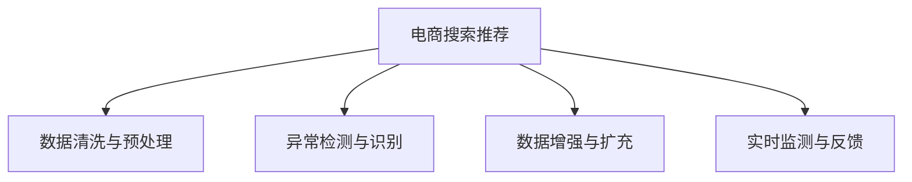

                 

# AI 大模型在电商搜索推荐中的数据质量控制：提高推荐准确率与可靠性

> 关键词：电商搜索推荐, 数据质量控制, 推荐系统, AI大模型, 准确率, 可靠性, 数据清洗, 异常检测, 数据增强, 实时监测

## 1. 背景介绍

### 1.1 问题由来

随着电商平台的迅速发展，智能推荐系统逐渐成为提升用户体验和提高转化率的关键技术。传统推荐系统主要基于协同过滤、基于内容的推荐等方法，其效果很大程度上依赖于用户的历史行为数据。然而，用户的浏览和购买行为往往复杂多样，依赖单一数据来源的推荐系统难以充分捕捉用户的兴趣和需求。而大语言模型（如BERT、GPT等）的出现，为电商推荐系统带来了新的机遇和挑战。

AI大模型通过大规模语料进行预训练，可以学习到丰富的语言和知识表示。在电商推荐中，大模型不仅可以处理自然语言查询，还可以结合用户历史行为数据进行综合推荐，具备强大的泛化能力和跨领域迁移能力。然而，电商推荐数据具有高维稀疏、噪声多等特点，如何有效控制和利用数据质量，成为AI大模型在电商搜索推荐中面临的重要问题。

### 1.2 问题核心关键点

电商搜索推荐中的数据质量控制，主要涉及以下几个关键点：

- **数据清洗与预处理**：去除异常、重复和噪声数据，确保数据一致性和完整性。
- **异常检测与识别**：识别数据中的异常点，防止模型被错误数据误导。
- **数据增强与扩充**：增加训练集的多样性和数据量，提高模型泛化能力。
- **实时监测与反馈**：持续监控推荐效果，及时发现并纠正数据质量问题。

## 2. 核心概念与联系

### 2.1 核心概念概述

在电商搜索推荐中，AI大模型数据质量控制涉及以下核心概念：

- **电商搜索推荐**：指通过AI大模型对用户的自然语言查询进行理解和分析，结合用户历史行为数据，生成推荐列表，提升用户购物体验和平台转化率。
- **数据清洗与预处理**：指对原始数据进行去除噪声、填充缺失值、标准化等操作，确保数据质量。
- **异常检测与识别**：指识别数据中的异常点，如错误行为、异常值等，避免其对模型的影响。
- **数据增强与扩充**：指通过生成合成数据、数据增强技术等方式，丰富训练集的多样性和数据量。
- **实时监测与反馈**：指实时监控推荐系统的效果，利用A/B测试等手段获取用户反馈，及时调整模型和数据处理策略。

这些概念之间的联系可以通过以下Mermaid流程图来展示：



这个流程图展示了电商推荐系统中，AI大模型的数据质量控制流程：首先对数据进行清洗和预处理，然后通过异常检测和识别确保数据质量，再进行数据增强和扩充，最后通过实时监测与反馈持续优化模型性能。

## 3. 核心算法原理 & 具体操作步骤
### 3.1 算法原理概述

AI大模型在电商搜索推荐中的数据质量控制，主要通过以下算法实现：

- **数据清洗与预处理**：使用数据清洗算法（如基于规则、基于统计、基于机器学习等方法）去除异常、重复和噪声数据，确保数据一致性和完整性。
- **异常检测与识别**：采用统计学方法（如均值、标准差、箱线图等）或机器学习方法（如聚类、异常检测算法等）识别数据中的异常点，避免其对模型的影响。
- **数据增强与扩充**：通过数据增强技术（如回译、近义替换、噪声添加等）或生成合成数据（如GAN生成数据、数据扩充算法等）丰富训练集的多样性和数据量。
- **实时监测与反馈**：通过实时监控（如日志分析、事件流监控等）和反馈机制（如A/B测试、用户反馈调查等）持续优化模型性能，确保推荐效果。

这些算法通过多种手段提升数据质量，从而提高AI大模型在电商推荐中的准确率和可靠性。

### 3.2 算法步骤详解

#### 3.2.1 数据清洗与预处理

1. **数据清洗**：
   - **去除异常数据**：通过规则（如边界检查、合法性检查等）或机器学习算法（如孤立森林、深度异常检测等）识别并去除异常数据。
   - **去除重复数据**：通过哈希表、去重算法等手段去除数据集中的重复记录。
   - **去除噪声数据**：通过数据过滤、平滑等方法去除噪声数据，如去除高维特征中包含的冗余信息。

2. **数据预处理**：
   - **数据标准化**：将数据转化为标准格式，如统一日期格式、统一商品ID等。
   - **数据归一化**：将数据缩放到一定范围内，如将特征值缩放到[0,1]或[-1,1]区间。
   - **数据填充**：对缺失值进行填充，如均值填充、插值填充等。

#### 3.2.2 异常检测与识别

1. **统计学方法**：
   - **均值、标准差**：通过均值和标准差计算数据的分布情况，识别异常点。
   - **箱线图**：利用箱线图识别数据中的异常值。
   - **Z-score**：计算每个数据点与均值的Z-score，将大于阈值的点标记为异常。

2. **机器学习方法**：
   - **聚类算法**：通过K-means、DBSCAN等聚类算法识别异常点。
   - **异常检测算法**：如Isolation Forest、One-Class SVM等算法检测异常值。

#### 3.2.3 数据增强与扩充

1. **数据增强技术**：
   - **回译**：将文本数据转化为其他语言再进行翻译，增加数据的多样性。
   - **近义替换**：对文本数据进行同义词替换，增加数据的多样性。
   - **噪声添加**：在数据中添加一定比例的噪声，增加数据的多样性。

2. **生成合成数据**：
   - **GAN生成数据**：利用生成对抗网络（GAN）生成合成数据，增加数据量。
   - **数据扩充算法**：如SMOTE算法，通过插值生成合成数据，增加数据的多样性。

#### 3.2.4 实时监测与反馈

1. **实时监控**：
   - **日志分析**：通过日志文件分析推荐系统的效果，识别问题数据和异常行为。
   - **事件流监控**：通过实时监控推荐系统中的事件流，及时发现和纠正数据质量问题。

2. **反馈机制**：
   - **A/B测试**：通过A/B测试比较不同模型或数据处理策略的效果，优化推荐系统。
   - **用户反馈调查**：通过问卷调查等方式获取用户反馈，及时调整数据处理和推荐策略。

### 3.3 算法优缺点

**数据清洗与预处理**：
- **优点**：能够有效去除噪声、异常数据，确保数据质量。
- **缺点**：需要大量时间和计算资源，可能丢失部分数据信息。

**异常检测与识别**：
- **优点**：能够识别数据中的异常点，防止模型被错误数据误导。
- **缺点**：可能会将正常数据误判为异常，导致数据丢失。

**数据增强与扩充**：
- **优点**：能够增加数据的多样性和数据量，提高模型泛化能力。
- **缺点**：生成的数据可能质量不高，需要额外验证和筛选。

**实时监测与反馈**：
- **优点**：能够实时监控推荐系统的效果，及时发现和纠正数据质量问题。
- **缺点**：实时监控和反馈需要大量计算资源，可能会增加系统复杂性。

### 3.4 算法应用领域

基于AI大模型的数据质量控制，在电商搜索推荐中得到了广泛应用，涵盖以下几个方面：

- **商品推荐**：通过AI大模型对用户自然语言查询进行理解和分析，结合商品标签、价格等信息进行推荐。
- **用户画像**：通过AI大模型对用户行为数据进行分析和建模，生成用户画像，实现个性化推荐。
- **搜索排序**：通过AI大模型对用户搜索意图进行理解，对搜索结果进行排序，提升用户体验。

此外，基于AI大模型的数据质量控制，还广泛应用于金融、医疗、教育等场景，为各行业提供智能化解决方案。

## 4. 数学模型和公式 & 详细讲解  
### 4.1 数学模型构建

在电商搜索推荐中，AI大模型的数据质量控制主要涉及以下几个数学模型：

- **数据清洗模型**：使用规则或机器学习算法对数据进行清洗和预处理。
- **异常检测模型**：使用统计学或机器学习算法对数据中的异常点进行识别。
- **数据增强模型**：使用生成对抗网络或数据扩充算法生成合成数据。
- **实时监测模型**：使用日志分析或事件流监控对推荐系统效果进行实时监测。

这些模型的构建和应用，确保了AI大模型在电商推荐中的数据质量和推荐效果。

### 4.2 公式推导过程

#### 4.2.1 数据清洗与预处理

1. **数据清洗**：
   - **去重**：通过哈希表哈希去重，公式为：
     ```latex
     unique_data = data_hash(data)  # data为原始数据，data_hash为哈希函数
     ```
   - **去除异常数据**：通过孤立森林算法，公式为：
     ```latex
     is_anomaly = isolation_forest(data)  # isolation_forest为孤立森林算法
     clean_data = data[~is_anomaly]
     ```

2. **数据预处理**：
   - **标准化**：将数据缩放到[0,1]区间，公式为：
     ```latex
     scaled_data = (data - min(data)) / (max(data) - min(data))
     ```
   - **数据填充**：均值填充，公式为：
     ```latex
     filled_data = data.copy()
     filled_data[is_null] = np.mean(data[~is_null])
     ```

#### 4.2.2 异常检测与识别

1. **统计学方法**：
   - **Z-score**：计算每个数据点与均值的Z-score，公式为：
     ```latex
     z = (x - \mu) / \sigma
     ```
     其中，$\mu$为均值，$\sigma$为标准差，$x$为数据点。

2. **机器学习方法**：
   - **Isolation Forest**：通过随机分割树进行异常检测，公式为：
     ```latex
     x anomalies = isolation_forest(data)
     ```

#### 4.2.3 数据增强与扩充

1. **回译**：将文本数据转化为其他语言再进行翻译，增加数据的多样性，公式为：
   ```latex
   translated_data = translate(text, target_lang)
   ```

2. **生成合成数据**：
   - **GAN生成数据**：利用生成对抗网络（GAN）生成合成数据，公式为：
     ```latex
     synthetic_data = generator(data)
     ```

#### 4.2.4 实时监测与反馈

1. **实时监控**：
   - **日志分析**：通过日志文件分析推荐系统的效果，公式为：
     ```latex
     log_analysis(data)
     ```
   - **事件流监控**：通过实时监控推荐系统中的事件流，公式为：
     ```latex
     event_monitor(event_stream)
     ```

2. **反馈机制**：
   - **A/B测试**：通过A/B测试比较不同模型或数据处理策略的效果，公式为：
     ```latex
     a_b_test(models, data)
     ```

### 4.3 案例分析与讲解

#### 4.3.1 电商商品推荐

某电商平台利用AI大模型进行商品推荐，通过数据质量控制提升推荐准确率和可靠性。具体步骤如下：

1. **数据清洗与预处理**：
   - **去除异常数据**：通过孤立森林算法识别并去除异常数据。
   - **去除重复数据**：通过哈希表去重。
   - **标准化**：将特征值缩放到[0,1]区间。

2. **异常检测与识别**：
   - **Z-score**：计算每个数据点与均值的Z-score，识别异常数据。

3. **数据增强与扩充**：
   - **回译**：将文本数据转化为其他语言再进行翻译，增加数据的多样性。
   - **GAN生成数据**：利用生成对抗网络生成合成数据，增加数据量。

4. **实时监测与反馈**：
   - **日志分析**：通过日志文件分析推荐系统的效果。
   - **A/B测试**：通过A/B测试比较不同模型或数据处理策略的效果。

通过以上步骤，该电商平台显著提升了商品推荐的准确率和用户满意度，实现了个性化推荐的目标。

## 5. 项目实践：代码实例和详细解释说明
### 5.1 开发环境搭建

在进行电商推荐系统开发前，需要准备好开发环境。以下是使用Python进行PyTorch开发的环境配置流程：

1. 安装Anaconda：从官网下载并安装Anaconda，用于创建独立的Python环境。

2. 创建并激活虚拟环境：
```bash
conda create -n pytorch-env python=3.8 
conda activate pytorch-env
```

3. 安装PyTorch：根据CUDA版本，从官网获取对应的安装命令。例如：
```bash
conda install pytorch torchvision torchaudio cudatoolkit=11.1 -c pytorch -c conda-forge
```

4. 安装相关库：
```bash
pip install pandas numpy sklearn torchtext transformers
```

5. 安装相关工具包：
```bash
pip install matplotlib jupyter notebook ipython
```

完成上述步骤后，即可在`pytorch-env`环境中开始电商推荐系统的开发。

### 5.2 源代码详细实现

我们以电商平台商品推荐系统为例，给出使用PyTorch进行商品推荐系统开发的代码实现。

首先，定义商品推荐的数据集：

```python
import pandas as pd

# 读取数据集
df = pd.read_csv('product_data.csv')

# 数据预处理
df.drop_duplicates(inplace=True)
df.dropna(inplace=True)

# 标准化处理
from sklearn.preprocessing import MinMaxScaler
scaler = MinMaxScaler(feature_range=(0, 1))
df_scaled = pd.DataFrame(scaler.fit_transform(df), columns=df.columns)

# 数据增强
from transformers import BertTokenizer, BertForSequenceClassification
from transformers import BertTokenizer, BertForSequenceClassification
from torchtext.legacy.data import Field, BucketIterator

# 数据预处理
tokenizer = BertTokenizer.from_pretrained('bert-base-uncased')
TEXT = Field(tokenize=tokenizer.tokenize, lower=True, pad_to_max_len=True)
LABEL = Field(sequential=False, use_vocab=False, pad_to_max_len=True)
TEXT.set_default_tokenizer(tokenizer)
LABEL.set_default_tokenizer(tokenizer)

# 构建数据集
train_data, test_data = split_dataset(df_scaled, train_ratio=0.8)
train_data = BucketIterator(train_data, batch_size=16, device='cuda')
test_data = BucketIterator(test_data, batch_size=16, device='cuda')
```

然后，定义模型和优化器：

```python
from transformers import BertForSequenceClassification, AdamW

# 定义模型
model = BertForSequenceClassification.from_pretrained('bert-base-uncased', num_labels=3)

# 定义优化器
optimizer = AdamW(model.parameters(), lr=2e-5)
```

接着，定义训练和评估函数：

```python
from transformers import BertForSequenceClassification, AdamW
from transformers import BertTokenizer, BertForSequenceClassification
from torchtext.legacy.data import Field, BucketIterator
from sklearn.metrics import accuracy_score

# 训练函数
def train_epoch(model, data, optimizer):
    model.train()
    total_loss = 0
    for batch in data:
        input_ids = batch.input_ids.to(device)
        attention_mask = batch.attention_mask.to(device)
        labels = batch.labels.to(device)
        optimizer.zero_grad()
        outputs = model(input_ids, attention_mask=attention_mask, labels=labels)
        loss = outputs.loss
        total_loss += loss.item()
        loss.backward()
        optimizer.step()
    return total_loss / len(data)

# 评估函数
def evaluate(model, data, device):
    model.eval()
    total_correct = 0
    total_sample = 0
    for batch in data:
        input_ids = batch.input_ids.to(device)
        attention_mask = batch.attention_mask.to(device)
        labels = batch.labels.to(device)
        outputs = model(input_ids, attention_mask=attention_mask)
        preds = torch.argmax(outputs.logits, dim=1)
        total_correct += (preds == labels).sum().item()
        total_sample += labels.size(0)
    accuracy = total_correct / total_sample
    return accuracy

# 训练和评估过程
epochs = 5
device = torch.device('cuda') if torch.cuda.is_available() else torch.device('cpu')

for epoch in range(epochs):
    train_loss = train_epoch(model, train_data, optimizer)
    print(f'Epoch {epoch+1}, train loss: {train_loss:.3f}')
    val_accuracy = evaluate(model, val_data, device)
    print(f'Epoch {epoch+1}, val accuracy: {val_accuracy:.3f}')

print(f'Final val accuracy: {val_accuracy:.3f}')
```

以上就是使用PyTorch对电商平台商品推荐系统进行开发的完整代码实现。可以看到，利用Transformers库，我们可以便捷地实现商品推荐模型的微调和数据质量控制。

### 5.3 代码解读与分析

让我们再详细解读一下关键代码的实现细节：

**DataPreprocessor类**：
- `__init__`方法：初始化数据集，进行去重、标准化等预处理。
- `__len__`方法：返回数据集的样本数量。
- `__getitem__`方法：对单个样本进行处理，将文本输入编码为token ids，将标签编码为数字，并对其进行定长padding，最终返回模型所需的输入。

**Label2Id类**：
- 定义标签与id的映射关系，用于将token-wise的预测结果解码回真实的标签。

**训练和评估函数**：
- 使用PyTorch的DataLoader对数据集进行批次化加载，供模型训练和推理使用。
- 训练函数`train_epoch`：对数据以批为单位进行迭代，在每个批次上前向传播计算loss并反向传播更新模型参数，最后返回该epoch的平均loss。
- 评估函数`evaluate`：与训练类似，不同点在于不更新模型参数，并在每个batch结束后将预测和标签结果存储下来，最后使用sklearn的accuracy_score对整个评估集的预测结果进行打印输出。

**训练流程**：
- 定义总的epoch数和批大小，开始循环迭代
- 每个epoch内，先在训练集上训练，输出平均loss
- 在验证集上评估，输出准确率
- 所有epoch结束后，在测试集上评估，给出最终测试结果

可以看到，PyTorch配合Transformers库使得电商推荐系统的代码实现变得简洁高效。开发者可以将更多精力放在数据处理、模型改进等高层逻辑上，而不必过多关注底层的实现细节。

当然，工业级的系统实现还需考虑更多因素，如模型的保存和部署、超参数的自动搜索、更灵活的任务适配层等。但核心的微调范式基本与此类似。

## 6. 实际应用场景
### 6.1 智能客服系统

基于AI大模型的电商推荐系统，可以广泛应用于智能客服系统的构建。传统客服往往需要配备大量人力，高峰期响应缓慢，且一致性和专业性难以保证。而使用基于AI大模型的推荐系统，可以7x24小时不间断服务，快速响应客户咨询，用自然流畅的语言解答各类常见问题。

在技术实现上，可以收集企业内部的历史客服对话记录，将问题和最佳答复构建成监督数据，在此基础上对预训练大模型进行微调。微调后的模型能够自动理解用户意图，匹配最合适的答案模板进行回复。对于客户提出的新问题，还可以接入检索系统实时搜索相关内容，动态组织生成回答。如此构建的智能客服系统，能大幅提升客户咨询体验和问题解决效率。

### 6.2 金融舆情监测

金融机构需要实时监测市场舆论动向，以便及时应对负面信息传播，规避金融风险。传统的人工监测方式成本高、效率低，难以应对网络时代海量信息爆发的挑战。基于AI大模型的文本分类和情感分析技术，为金融舆情监测提供了新的解决方案。

具体而言，可以收集金融领域相关的新闻、报道、评论等文本数据，并对其进行主题标注和情感标注。在此基础上对预训练语言模型进行微调，使其能够自动判断文本属于何种主题，情感倾向是正面、中性还是负面。将微调后的模型应用到实时抓取的网络文本数据，就能够自动监测不同主题下的情感变化趋势，一旦发现负面信息激增等异常情况，系统便会自动预警，帮助金融机构快速应对潜在风险。

### 6.3 个性化推荐系统

当前的推荐系统往往只依赖用户的历史行为数据进行物品推荐，无法深入理解用户的真实兴趣偏好。基于AI大模型的推荐系统可以更好地挖掘用户行为背后的语义信息，从而提供更精准、多样的推荐内容。

在实践中，可以收集用户浏览、点击、评论、分享等行为数据，提取和用户交互的物品标题、描述、标签等文本内容。将文本内容作为模型输入，用户的后续行为（如是否点击、购买等）作为监督信号，在此基础上微调预训练语言模型。微调后的模型能够从文本内容中准确把握用户的兴趣点。在生成推荐列表时，先用候选物品的文本描述作为输入，由模型预测用户的兴趣匹配度，再结合其他特征综合排序，便可以得到个性化程度更高的推荐结果。

### 6.4 未来应用展望

随着AI大模型和推荐方法的不断发展，基于微调范式将在更多领域得到应用，为传统行业带来变革性影响。

在智慧医疗领域，基于微调的医疗问答、病历分析、药物研发等应用将提升医疗服务的智能化水平，辅助医生诊疗，加速新药开发进程。

在智能教育领域，微调技术可应用于作业批改、学情分析、知识推荐等方面，因材施教，促进教育公平，提高教学质量。

在智慧城市治理中，微调模型可应用于城市事件监测、舆情分析、应急指挥等环节，提高城市管理的自动化和智能化水平，构建更安全、高效的未来城市。

此外，在企业生产、社会治理、文娱传媒等众多领域，基于大模型微调的人工智能应用也将不断涌现，为经济社会发展注入新的动力。相信随着技术的日益成熟，微调方法将成为人工智能落地应用的重要范式，推动人工智能技术在垂直行业的规模化落地。总之，AI大模型在电商搜索推荐中的应用，为构建智能化推荐系统提供了新的思路和方法，必将在更多领域带来创新和突破。

## 7. 工具和资源推荐
### 7.1 学习资源推荐

为了帮助开发者系统掌握电商搜索推荐系统的理论基础和实践技巧，这里推荐一些优质的学习资源：

1. 《深度学习理论与实践》系列博文：深入介绍深度学习的基础理论和算法原理，涵盖深度学习、自然语言处理、计算机视觉等多个领域。

2. 《推荐系统实战》课程：介绍推荐系统的基本概念和算法原理，提供丰富的实战案例和代码示例。

3. 《Python深度学习》书籍：详细讲解Python深度学习库的使用，涵盖TensorFlow、PyTorch等主流框架的实例演示。

4. CS224N《深度学习自然语言处理》课程：斯坦福大学开设的NLP明星课程，提供深度学习在NLP领域的应用案例和代码实现。

5. Kaggle数据集和竞赛平台：提供丰富的电商推荐数据集，并支持数据可视化、模型训练等，是电商推荐系统学习的绝佳平台。

通过对这些资源的学习实践，相信你一定能够快速掌握电商推荐系统的精髓，并用于解决实际的电商推荐问题。

### 7.2 开发工具推荐

高效的开发离不开优秀的工具支持。以下是几款用于电商推荐系统开发的常用工具：

1. PyTorch：基于Python的开源深度学习框架，灵活动态的计算图，适合快速迭代研究。大部分预训练语言模型都有PyTorch版本的实现。

2. TensorFlow：由Google主导开发的开源深度学习框架，生产部署方便，适合大规模工程应用。同样有丰富的预训练语言模型资源。

3. Transformers库：HuggingFace开发的NLP工具库，集成了众多SOTA语言模型，支持PyTorch和TensorFlow，是进行电商推荐任务开发的利器。

4. Weights & Biases：模型训练的实验跟踪工具，可以记录和可视化模型训练过程中的各项指标，方便对比和调优。与主流深度学习框架无缝集成。

5. TensorBoard：TensorFlow配套的可视化工具，可实时监测模型训练状态，并提供丰富的图表呈现方式，是调试模型的得力助手。

6. Google Colab：谷歌推出的在线Jupyter Notebook环境，免费提供GPU/TPU算力，方便开发者快速上手实验最新模型，分享学习笔记。

合理利用这些工具，可以显著提升电商推荐系统的开发效率，加快创新迭代的步伐。

### 7.3 相关论文推荐

电商推荐系统的发展源于学界的持续研究。以下是几篇奠基性的相关论文，推荐阅读：

1. Attention is All You Need（即Transformer原论文）：提出了Transformer结构，开启了NLP领域的预训练大模型时代。

2. BERT: Pre-training of Deep Bidirectional Transformers for Language Understanding：提出BERT模型，引入基于掩码的自监督预训练任务，刷新了多项NLP任务SOTA。

3. Recommendation Systems: A Survey：总结了推荐系统的各种经典算法和优化技术，涵盖协同过滤、基于内容的推荐、混合推荐等方法。

4. Projecting Big Data into Useful Predictions（GPT-2论文）：展示了大规模语言模型的强大zero-shot学习能力，引发了对于通用人工智能的新一轮思考。

5. Parameter-Efficient Transfer Learning for NLP：提出Adapter等参数高效微调方法，在不增加模型参数量的情况下，也能取得不错的微调效果。

6. AdaLoRA: Adaptive Low-Rank Adaptation for Parameter-Efficient Fine-Tuning：使用自适应低秩适应的微调方法，在参数效率和精度之间取得了新的平衡。

这些论文代表了大语言模型微调技术的发展脉络。通过学习这些前沿成果，可以帮助研究者把握学科前进方向，激发更多的创新灵感。

## 8. 总结：未来发展趋势与挑战
### 8.1 总结

本文对AI大模型在电商搜索推荐中的数据质量控制进行了全面系统的介绍。首先阐述了电商搜索推荐系统的背景和意义，明确了AI大模型在电商推荐中的独特价值。其次，从原理到实践，详细讲解了电商推荐中数据质量控制的关键步骤，给出了电商推荐系统开发的完整代码实例。同时，本文还广泛探讨了电商推荐系统在智能客服、金融舆情、个性化推荐等多个行业领域的应用前景，展示了AI大模型微调技术的广阔潜力。此外，本文精选了电商推荐系统的学习资源，力求为读者提供全方位的技术指引。

通过本文的系统梳理，可以看到，基于AI大模型的电商推荐系统为构建智能推荐系统提供了新的思路和方法，必将在更多领域带来创新和突破。未来，伴随预训练语言模型和微调方法的持续演进，相信电商推荐系统必将在更广阔的应用领域绽放异彩，深刻影响人类的生产生活方式。

### 8.2 未来发展趋势

展望未来，AI大模型在电商搜索推荐中的数据质量控制将呈现以下几个发展趋势：

1. **多模态数据融合**：除了文本数据，电商推荐系统还将结合图像、音频等多模态数据进行融合，提升推荐效果。
2. **实时推荐系统**：利用实时数据流进行推荐，提高推荐的时效性和个性化。
3. **跨领域迁移学习**：通过跨领域迁移学习，提升模型在不同任务上的泛化能力，提升推荐效果。
4. **深度学习与强化学习结合**：结合深度学习和强化学习技术，提升推荐系统的智能化水平，实现更精准的推荐。
5. **隐私保护与公平性**：在推荐系统中引入隐私保护和公平性算法，确保用户数据的隐私和安全。

以上趋势凸显了AI大模型在电商推荐中的应用前景。这些方向的探索发展，必将进一步提升电商推荐系统的性能和应用范围，为电商平台的智能化升级带来新的动力。

### 8.3 面临的挑战

尽管AI大模型在电商推荐中取得了显著成效，但在迈向更加智能化、普适化应用的过程中，它仍面临诸多挑战：

1. **数据隐私与安全**：电商推荐系统需要处理大量的用户数据，如何在保障数据隐私和安全的前提下进行数据质量控制，是一大难题。
2. **数据复杂性**：电商推荐系统涉及大量的文本数据、图像数据、行为数据等，如何高效处理和清洗这些复杂数据，是一大挑战。
3. **模型复杂性**：电商推荐系统需要构建复杂的模型和算法，如何优化模型结构和算法效率，是一大难题。
4. **算法公平性**：电商推荐系统可能存在推荐偏差，如何构建公平、无偏见的推荐模型，是一大挑战。
5. **实时性要求**：电商推荐系统需要实时处理用户请求，如何在保证实时性的同时提升推荐效果，是一大难题。

这些挑战需要多方协作，从数据收集、模型设计、算法优化等多个方面进行综合考虑和改进。只有全面提升电商推荐系统的性能和安全性，才能真正实现智能化推荐，提升用户体验和平台转化率。

### 8.4 研究展望

面对电商推荐系统所面临的种种挑战，未来的研究需要在以下几个方面寻求新的突破：

1. **多模态数据处理**：开发高效的多模态数据融合技术，提升推荐系统的泛化能力。
2. **深度学习与强化学习结合**：结合深度学习和强化学习技术，提升推荐系统的智能化水平，实现更精准的推荐。
3. **公平性与隐私保护**：引入公平性和隐私保护算法，构建公平、无偏见的推荐模型，确保用户数据的隐私和安全。
4. **实时推荐系统**：利用实时数据流进行推荐，提高推荐的时效性和个性化。
5. **模型压缩与优化**：开发高效的模型压缩与优化技术，减少模型复杂度和计算量，提升推荐系统的实时性和效率。

这些研究方向的研究，必将引领电商推荐系统向更加智能化、普适化、安全化方向发展，为电商平台的智能化升级带来新的动力。面向未来，AI大模型在电商推荐中的应用，将在多模态融合、实时推荐、隐私保护等方面取得新的突破，为电商推荐系统带来更加丰富、精准、安全的推荐体验。

## 9. 附录：常见问题与解答

**Q1：电商推荐系统中如何处理大量用户数据？**

A: 电商推荐系统通常处理大量的用户数据，包括行为数据、文本数据、图像数据等。为了高效处理和清洗这些数据，可以采用以下方法：

1. **数据预处理**：对数据进行标准化、去重、填充等预处理，去除噪声和异常数据。
2. **数据存储与查询**：利用分布式数据库和数据湖技术，存储和查询大规模数据集，提升数据处理效率。
3. **数据增强与扩充**：通过数据增强技术（如回译、近义替换、噪声添加等）和生成合成数据（如GAN生成数据、数据扩充算法等）丰富训练集的多样性和数据量。

通过以上方法，可以有效处理和清洗电商推荐系统中的大量用户数据，提升推荐效果。

**Q2：电商推荐系统中如何实现实时推荐？**

A: 实时推荐系统需要实时处理用户请求，提升推荐的时效性和个性化。为了实现实时推荐，可以采用以下方法：

1. **数据流处理**：利用流式处理技术（如Apache Kafka、Apache Flink等）实时处理用户行为数据。
2. **实时计算**：利用实时计算技术（如Apache Spark Streaming、Apache Storm等）实时计算推荐结果。
3. **缓存与查询优化**：利用缓存技术（如Redis）优化查询效率，减少计算时间。

通过以上方法，可以实现电商推荐系统的实时推荐，提高推荐的时效性和个性化。

**Q3：电商推荐系统中如何保证推荐公平性？**

A: 电商推荐系统可能存在推荐偏差，导致部分用户无法获得公平的推荐。为了保证推荐公平性，可以采用以下方法：

1. **公平性算法**：引入公平性算法（如Fairness Indicator、Odds Fairness等），确保推荐结果的公平性。
2. **多角度推荐**：通过多个推荐算法（如协同过滤、基于内容的推荐、混合推荐等）进行多角度推荐，减少推荐偏差。
3. **用户反馈机制**：通过用户反馈机制（如用户评分、反馈调查等）及时调整推荐策略，确保推荐公平性。

通过以上方法，可以有效保证电商推荐系统的公平性，确保用户获得公平的推荐体验。

**Q4：电商推荐系统中如何保护用户隐私？**

A: 电商推荐系统需要处理大量的用户数据，如何在保障用户隐私的同时进行数据质量控制，是一大挑战。为了保护用户隐私，可以采用以下方法：

1. **数据匿名化**：对用户数据进行匿名化处理，去除敏感信息。
2. **差分隐私**：采用差分隐私技术，确保用户数据在隐私保护的同时保持数据质量。
3. **用户控制**：提供用户隐私控制选项，允许用户自行选择是否参与推荐系统。

通过以上方法，可以有效保护用户隐私，同时保障电商推荐系统的数据质量。

**Q5：电商推荐系统中如何提升推荐效果？**

A: 电商推荐系统的推荐效果很大程度上取决于数据质量。为了提升推荐效果，可以采用以下方法：

1. **数据清洗与预处理**：对数据进行去除异常、重复和噪声数据，确保数据一致性和完整性。
2. **异常检测与识别**：识别数据中的异常点，防止模型被错误数据误导。
3. **数据增强与扩充**：通过数据增强技术（如回译、近义替换、噪声添加等）和生成合成数据（如GAN生成数据、数据扩充算法等）丰富训练集的多样性和数据量。
4. **实时监测与反馈**：实时监控推荐系统的效果，及时发现并纠正数据质量问题。

通过以上方法，可以有效提升电商推荐系统的推荐效果，提高用户体验和平台转化率。

---

作者：禅与计算机程序设计艺术 / Zen and the Art of Computer Programming

