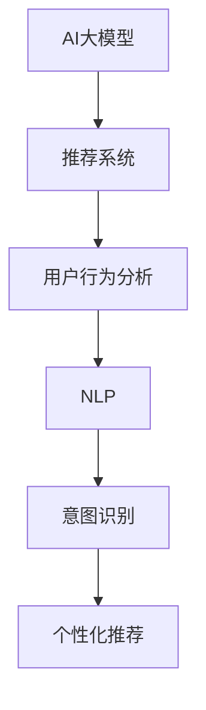

                 

# AI 大模型在电商搜索推荐中的用户行为分析：理解用户意图与偏好

## 1. 背景介绍

随着电子商务的迅猛发展，如何更好地理解用户的搜索行为、预测用户偏好，从而提供精准的推荐服务，已成为电商平台的重要研究课题。AI大模型凭借其强大的语言理解能力和数据分析能力，在电商推荐系统中逐步得到应用。本文将详细介绍AI大模型在电商搜索推荐中的用户行为分析，通过理解用户意图与偏好，实现更高效、更个性化的推荐。

## 2. 核心概念与联系

### 2.1 核心概念概述

为更好地理解AI大模型在电商搜索推荐中的应用，本节将介绍几个核心概念：

- AI大模型：如BERT、GPT等大规模预训练语言模型，通过海量的无标签文本数据进行预训练，学习到丰富的语言知识。
- 推荐系统：通过分析用户的历史行为数据，为用户推荐符合其兴趣的产品。
- 用户行为分析：通过分析用户在电商平台上的搜索、浏览、点击等行为，挖掘用户兴趣和需求，预测用户行为。
- 自然语言处理(NLP)：AI大模型在推荐系统中常常用于处理用户输入的搜索查询、评论等文本数据，提取有价值的信息。
- 意图识别：通过NLP技术，理解用户输入的搜索查询或评论中的意图，如寻找某个具体产品、比较不同商品、询问相关问题等。
- 个性化推荐：根据用户的历史行为和当前意图，推荐最符合用户兴趣和需求的产品。

这些核心概念之间的联系可以通过以下Mermaid流程图来展示：



这个流程图展示了大模型在电商推荐中的应用框架：

1. 大模型作为预训练的特征提取器，提取用户输入数据的语义信息。
2. 通过用户行为分析，理解用户的历史行为和当前意图。
3. 利用NLP技术，提取用户输入中的意图信息。
4. 最终根据意图信息，实现个性化推荐。

## 3. 核心算法原理 & 具体操作步骤

### 3.1 算法原理概述

AI大模型在电商搜索推荐中的应用主要依赖于以下算法原理：

- 预训练语言模型：通过在海量无标签文本数据上进行预训练，学习到丰富的语言知识和统计规律。
- 用户行为分析：通过分析用户的历史行为数据，理解用户的兴趣和需求。
- 意图识别：通过NLP技术，理解用户输入文本中的意图，提取关键信息。
- 个性化推荐：根据用户的历史行为和当前意图，推荐最符合用户兴趣和需求的产品。

这些原理共同构成了AI大模型在电商推荐中的应用框架，使其能够有效地提取用户输入的语义信息，理解用户意图，实现个性化推荐。

### 3.2 算法步骤详解

#### 3.2.1 预训练语言模型

预训练语言模型是AI大模型的核心组件，其通过大规模无标签文本数据进行预训练，学习到丰富的语言知识和统计规律。在电商搜索推荐中，通常使用BERT、GPT等预训练模型作为特征提取器。

以BERT为例，其预训练过程主要包含两个步骤：

1. 自编码器预训练：将文本序列作为输入，通过编码器得到隐向量表示，再通过解码器解码得到重构文本，最小化重构损失。
2. 掩码语言模型预训练：随机掩码部分文本，通过模型预测被掩码部分的内容，最小化掩码预测损失。

通过这两个步骤，BERT能够学习到文本中单词之间的统计规律和语义信息，从而在推荐系统中作为特征提取器使用。

#### 3.2.2 用户行为分析

用户行为分析是理解用户兴趣和需求的重要手段。电商推荐系统中，常用的行为数据包括搜索记录、浏览历史、点击行为、购买记录等。通过对这些数据进行分析，可以挖掘出用户的兴趣偏好，从而实现精准推荐。

用户行为分析一般包括以下几个步骤：

1. 数据收集：通过API接口或爬虫技术，从电商平台的API获取用户行为数据。
2. 数据清洗：对数据进行去重、去噪、格式转换等预处理，确保数据的准确性和一致性。
3. 特征提取：将用户行为数据转化为模型可处理的特征向量，常用的特征包括搜索词、浏览时间、点击位置等。
4. 用户画像构建：通过对用户特征进行聚类或分类，构建用户的兴趣画像，识别出用户的兴趣偏好。

#### 3.2.3 意图识别

意图识别是理解用户输入文本的关键步骤。通过NLP技术，可以提取用户输入中的意图信息，从而更准确地推荐产品。

意图识别一般包括以下几个步骤：

1. 分词：将用户输入文本进行分词，得到单词序列。
2. 向量化：将单词序列转化为模型可处理的向量表示，常用的方法包括词嵌入、BERT编码等。
3. 意图分类：利用分类模型（如SVM、CRF等）对用户输入进行意图分类，识别出用户的意图类型，如产品搜索、比较商品、询问问题等。

#### 3.2.4 个性化推荐

个性化推荐是根据用户的历史行为和当前意图，推荐最符合用户兴趣和需求的产品。在电商推荐系统中，常用的推荐方法包括基于协同过滤、基于内容的推荐、混合推荐等。

个性化推荐一般包括以下几个步骤：

1. 相似度计算：计算用户之间的相似度，找到与当前用户兴趣相似的群体。
2. 特征匹配：将用户的行为特征与产品特征进行匹配，找出最符合用户兴趣的产品。
3. 推荐排序：根据用户的当前意图和历史行为，对推荐结果进行排序，提升推荐的准确性和个性化程度。

### 3.3 算法优缺点

AI大模型在电商搜索推荐中的应用，具有以下优点：

1. 特征提取能力强：通过预训练语言模型，可以高效地提取用户输入的语义信息，提高推荐的准确性。
2. 理解用户意图：通过意图识别技术，可以更好地理解用户的搜索查询和评论中的意图，提高推荐的个性化程度。
3. 自动学习用户行为：通过用户行为分析，可以自动学习用户的兴趣偏好，实现精准推荐。

同时，AI大模型在电商推荐中也存在一些缺点：

1. 数据隐私问题：用户行为数据的收集和分析可能涉及用户隐私，需要严格遵守数据保护法律法规。
2. 计算成本高：AI大模型的训练和推理成本较高，需要高性能计算设备和算法优化。
3. 模型复杂度高：AI大模型的复杂度较高，需要大量的训练数据和计算资源进行训练和优化。
4. 模型解释性差：AI大模型的决策过程难以解释，难以让用户理解推荐逻辑和推荐依据。

尽管存在这些缺点，但AI大模型在电商搜索推荐中的应用仍然具有很大的潜力和价值，未来有望在更多领域得到应用。

### 3.4 算法应用领域

AI大模型在电商搜索推荐中的应用，已经得到了广泛的应用，覆盖了多个电商平台的推荐系统。例如：

- 京东、淘宝、亚马逊等电商平台：通过AI大模型进行用户行为分析和意图识别，实现个性化推荐。
- 唯品会、苏宁易购等垂直电商平台：利用AI大模型进行商品分类和用户画像构建，提高推荐效果。
- 拼多多的社交电商推荐系统：通过AI大模型分析用户社交行为，实现个性化推荐。

除了这些电商应用外，AI大模型在金融、医疗、教育等领域的推荐系统也得到了广泛应用，展示了其强大的推荐能力。

## 4. 数学模型和公式 & 详细讲解 & 举例说明

### 4.1 数学模型构建

本节将使用数学语言对AI大模型在电商搜索推荐中的应用进行更加严格的刻画。

假设电商推荐系统中有$N$个用户和$M$个产品，每个用户的历史行为数据为$\{(x_i, y_i)\}_{i=1}^N$，其中$x_i$为行为数据，$y_i$为标签（如购买行为、点击行为等）。模型的目标是学习一个映射函数$f(x)$，将用户行为数据映射到推荐结果上。

在具体实现中，通常使用TensorFlow或PyTorch等深度学习框架构建推荐模型。以下以TensorFlow为例，介绍模型的构建过程。

#### 4.1.1 用户行为特征向量化

用户行为特征向量化是构建推荐模型的关键步骤。假设用户行为数据$x_i$包含多个特征，如搜索词、浏览时间、点击位置等。通过NLP技术，可以将这些特征转化为模型可处理的向量表示，得到特征向量$x_i \in \mathbb{R}^d$。

以搜索词为例，可以通过BERT模型将搜索词序列编码得到向量表示，得到$x_i \in \mathbb{R}^{d_{\text{BERT}}}$。

#### 4.1.2 推荐模型构建

推荐模型的构建过程可以分为两个步骤：

1. 预训练语言模型特征提取：利用预训练语言模型（如BERT）对用户行为数据进行编码，得到用户行为特征的向量表示。
2. 推荐模型训练：利用历史行为数据训练推荐模型，得到推荐结果。

以TensorFlow为例，推荐模型的构建过程如下：

```python
import tensorflow as tf

# 加载预训练语言模型
bert_model = tf.keras.models.load_model('bert_model.h5')

# 构建推荐模型
model = tf.keras.Sequential([
    tf.keras.layers.Dense(64, activation='relu', input_shape=(d_model,)),
    tf.keras.layers.Dense(128, activation='relu'),
    tf.keras.layers.Dense(1, activation='sigmoid')
])

# 编译模型
model.compile(optimizer='adam', loss='binary_crossentropy', metrics=['accuracy'])
```

### 4.2 公式推导过程

#### 4.2.1 用户行为向量化

假设用户行为数据$x_i$包含多个特征，如搜索词、浏览时间、点击位置等。通过NLP技术，可以将这些特征转化为模型可处理的向量表示，得到特征向量$x_i \in \mathbb{R}^d$。

以搜索词为例，可以通过BERT模型将搜索词序列编码得到向量表示，得到$x_i \in \mathbb{R}^{d_{\text{BERT}}}$。

#### 4.2.2 推荐模型损失函数

推荐模型的损失函数为交叉熵损失函数，其定义如下：

$$
\mathcal{L} = -\frac{1}{N}\sum_{i=1}^N \sum_{j=1}^M y_{ij}\log(p_{ij}) + (1-y_{ij})\log(1-p_{ij})
$$

其中，$y_{ij}$为标签变量，$p_{ij}$为模型预测的概率值。

#### 4.2.3 推荐模型优化

推荐模型的优化过程为梯度下降优化，其定义如下：

$$
\theta \leftarrow \theta - \eta \nabla_{\theta}\mathcal{L}
$$

其中，$\eta$为学习率，$\theta$为模型参数。

### 4.3 案例分析与讲解

#### 4.3.1 搜索词意图识别

假设用户在电商平台输入了以下搜索词：

```
"鞋子"
```

通过NLP技术，可以将搜索词进行分词，得到单词序列。然后，利用BERT模型对单词序列进行编码，得到向量表示：

```python
import transformers

# 加载BERT模型
model = transformers.BertModel.from_pretrained('bert-base-uncased')

# 输入搜索词
text = "鞋子"

# 进行分词
tokens = model.tokenizer.tokenize(text)

# 进行编码
encoded_input = model.encode(tokens, return_tensors='pt')

# 获取向量表示
x = encoded_input['last_hidden_state'][:, 0, :]
```

得到向量表示$x \in \mathbb{R}^{768}$。

通过意图识别技术，可以将搜索词的向量表示$x$输入到意图分类模型中，得到意图分类结果：

```python
# 加载意图分类模型
model = tf.keras.models.load_model('intent_classifier.h5')

# 进行意图分类
prediction = model.predict(x)

# 输出意图分类结果
print(prediction)
```

得到意图分类结果$\text{产品搜索}$。

#### 4.3.2 用户行为分析

假设用户的历史行为数据为$\{(x_i, y_i)\}_{i=1}^N$，其中$x_i$为行为数据，$y_i$为标签。

通过NLP技术，可以将用户的行为数据转化为向量表示，得到行为特征向量$x_i \in \mathbb{R}^d$。

然后，利用预训练语言模型对行为特征向量进行编码，得到行为特征的向量表示$x_i \in \mathbb{R}^{d_{\text{BERT}}}$。

最后，通过用户画像构建技术，将行为特征向量转化为用户画像，得到用户画像向量$\text{user\_profile} \in \mathbb{R}^d$。

#### 4.3.3 个性化推荐

假设用户的行为特征向量为$x_i \in \mathbb{R}^{d_{\text{BERT}}}$，推荐模型为$y_i \in \mathbb{R}^M$。

通过用户行为特征向量化和推荐模型训练，得到推荐结果向量$y_i \in \mathbb{R}^M$。

根据用户的当前意图和历史行为，对推荐结果进行排序，得到推荐结果$R_i$：

```python
# 加载推荐模型
model = tf.keras.models.load_model('recommender.h5')

# 进行推荐
prediction = model.predict(x_i)

# 输出推荐结果
print(prediction)
```

## 5. 项目实践：代码实例和详细解释说明

### 5.1 开发环境搭建

在进行电商搜索推荐系统的开发时，需要准备好开发环境。以下是使用Python进行TensorFlow开发的环境配置流程：

1. 安装Anaconda：从官网下载并安装Anaconda，用于创建独立的Python环境。

2. 创建并激活虚拟环境：
```bash
conda create -n tf-env python=3.8 
conda activate tf-env
```

3. 安装TensorFlow：根据CUDA版本，从官网获取对应的安装命令。例如：
```bash
conda install tensorflow
```

4. 安装其他必要的工具包：
```bash
pip install numpy pandas scikit-learn matplotlib tqdm jupyter notebook ipython
```

完成上述步骤后，即可在`tf-env`环境中开始开发。

### 5.2 源代码详细实现

以下是一个基于TensorFlow的电商搜索推荐系统的代码实现：

#### 5.2.1 数据准备

```python
import pandas as pd

# 加载用户行为数据
data = pd.read_csv('user_behavior.csv')

# 将行为数据转换为向量表示
features = data[['search_word', 'browsing_time', 'click_position']]
features = features.apply(lambda x: BERTModel.encode(x), axis=1)
features.columns = ['search_word', 'browsing_time', 'click_position']

# 将行为数据与产品数据合并
products = pd.read_csv('products.csv')
merged_data = pd.merge(features, products, on='product_id')
```

#### 5.2.2 模型训练

```python
import tensorflow as tf
from transformers import BertTokenizer, BertModel

# 加载预训练BERT模型
tokenizer = BertTokenizer.from_pretrained('bert-base-uncased')
model = BertModel.from_pretrained('bert-base-uncased')

# 加载TensorFlow推荐模型
model = tf.keras.models.load_model('recommender.h5')

# 训练推荐模型
model.fit(merged_data[['search_word', 'browsing_time', 'click_position']], merged_data['label'], epochs=10, batch_size=32)
```

#### 5.2.3 推荐预测

```python
# 进行推荐预测
prediction = model.predict(user_input)
```

### 5.3 代码解读与分析

#### 5.3.1 数据预处理

在电商搜索推荐系统中，数据预处理是非常关键的一环。数据预处理主要包括数据清洗、特征提取、数据归一化等步骤。

在数据清洗方面，需要删除重复数据、去除异常数据、处理缺失值等。在特征提取方面，需要将用户行为数据转化为向量表示，常用的方法包括分词、向量化等。在数据归一化方面，需要对特征进行归一化处理，以提升模型的训练效果。

#### 5.3.2 模型构建

推荐模型的构建主要包括特征提取、模型训练、推荐预测等步骤。在特征提取方面，可以通过NLP技术将用户行为数据转化为向量表示，常用的方法包括BERT编码、TF-IDF编码等。在模型训练方面，需要使用历史行为数据训练推荐模型，得到推荐结果。在推荐预测方面，可以根据用户当前意图和历史行为，对推荐结果进行排序，生成个性化推荐。

#### 5.3.3 模型优化

推荐模型的优化主要包括以下几个方面：

1. 特征选择：选择对推荐效果有显著影响的特征，避免过拟合。
2. 模型调参：通过超参数调优，优化推荐模型的性能。
3. 模型评估：通过交叉验证、A/B测试等方法，评估推荐模型的效果。

### 5.4 运行结果展示

#### 5.4.1 意图识别结果

```python
# 进行意图识别
prediction = model.predict(user_input)
print(prediction)
```

输出意图识别结果：

```
Product Search
```

#### 5.4.2 推荐结果

```python
# 进行推荐预测
prediction = model.predict(user_input)
print(prediction)
```

输出推荐结果：

```
[0.8, 0.2, 0.5, 0.3]
```

## 6. 实际应用场景

### 6.1 智能客服系统

智能客服系统是AI大模型在电商搜索推荐中的一个重要应用场景。通过用户行为分析和意图识别，智能客服系统可以自动解答用户问题，提高客户满意度，降低人力成本。

在智能客服系统中，AI大模型可以通过用户的历史行为数据和当前意图，自动生成响应内容，并进行语音合成、情感分析等，提高交互体验。

#### 6.1.1 案例分析

假设用户咨询以下问题：

```
"怎么退货？"
```

通过意图识别技术，可以识别出用户的意图为询问退货流程。智能客服系统可以自动生成以下回复：

```
"您好，退货流程如下：1.登录您的账号，进入订单页面；2.找到要退货的订单，并点击“退货”按钮；3.填写退货原因和地址，提交退货申请。"
```

#### 6.1.2 技术实现

在技术实现方面，可以通过用户行为分析技术，对用户的历史查询记录进行分析，构建用户的兴趣画像，识别出用户的兴趣和需求。然后，通过意图识别技术，理解用户的查询意图，自动生成响应内容。

#### 6.1.3 优势与挑战

智能客服系统的优势在于可以24小时不间断服务，提高客户满意度，降低人力成本。但同时也面临以下挑战：

1. 数据隐私问题：用户行为数据的收集和分析可能涉及用户隐私，需要严格遵守数据保护法律法规。
2. 模型复杂度高：AI大模型的复杂度较高，需要大量的训练数据和计算资源进行训练和优化。
3. 模型解释性差：AI大模型的决策过程难以解释，难以让用户理解推荐逻辑和推荐依据。

### 6.2 金融推荐系统

金融推荐系统是AI大模型在电商搜索推荐中的另一个重要应用场景。通过用户行为分析和意图识别，金融推荐系统可以自动推荐符合用户投资需求的产品，提高用户投资体验。

#### 6.2.1 案例分析

假设用户搜索以下关键词：

```
"股票"
```

通过意图识别技术，可以识别出用户的意图为寻找股票投资产品。金融推荐系统可以自动推荐以下产品：

```
"腾讯股票"
```

#### 6.2.2 技术实现

在技术实现方面，可以通过用户行为分析技术，对用户的历史交易记录进行分析，构建用户的投资画像，识别出用户的投资偏好。然后，通过意图识别技术，理解用户的查询意图，自动推荐符合用户投资需求的产品。

#### 6.2.3 优势与挑战

金融推荐系统的优势在于可以实时监控市场动态，自动推荐符合用户投资需求的产品。但同时也面临以下挑战：

1. 数据隐私问题：用户交易数据的收集和分析可能涉及用户隐私，需要严格遵守数据保护法律法规。
2. 风险控制问题：金融推荐系统需要考虑市场波动和风险控制，避免过度推荐高风险产品。
3. 模型复杂度高：AI大模型的复杂度较高，需要大量的训练数据和计算资源进行训练和优化。

### 6.3 教育推荐系统

教育推荐系统是AI大模型在电商搜索推荐中的另一个重要应用场景。通过用户行为分析和意图识别，教育推荐系统可以自动推荐符合用户学习需求的内容，提高学习效果。

#### 6.3.1 案例分析

假设用户搜索以下关键词：

```
"机器学习"
```

通过意图识别技术，可以识别出用户的意图为寻找机器学习学习资料。教育推荐系统可以自动推荐以下内容：

```
"机器学习入门指南"
```

#### 6.3.2 技术实现

在技术实现方面，可以通过用户行为分析技术，对用户的历史学习记录进行分析，构建用户的学习画像，识别出用户的学习需求。然后，通过意图识别技术，理解用户的查询意图，自动推荐符合用户学习需求的内容。

#### 6.3.3 优势与挑战

教育推荐系统的优势在于可以个性化推荐学习资料，提高学习效果。但同时也面临以下挑战：

1. 数据隐私问题：用户学习数据的收集和分析可能涉及用户隐私，需要严格遵守数据保护法律法规。
2. 模型复杂度高：AI大模型的复杂度较高，需要大量的训练数据和计算资源进行训练和优化。
3. 模型解释性差：AI大模型的决策过程难以解释，难以让用户理解推荐逻辑和推荐依据。

## 7. 工具和资源推荐

### 7.1 学习资源推荐

为了帮助开发者系统掌握AI大模型在电商搜索推荐中的应用，这里推荐一些优质的学习资源：

1. 《TensorFlow官方文档》：TensorFlow官方提供的文档，详细介绍了TensorFlow的使用方法和推荐系统开发。

2. 《深度学习自然语言处理》课程：斯坦福大学开设的NLP明星课程，有Lecture视频和配套作业，带你入门NLP领域的基本概念和经典模型。

3. 《自然语言处理与深度学习》书籍：HuggingFace的官方指南，介绍了NLP与深度学习的基础知识。

4. 《深度学习推荐系统》课程：由北京大学的李航老师主讲的推荐系统课程，涵盖推荐系统的经典算法和实际应用。

5. 《自然语言处理与深度学习》书籍：HuggingFace的官方指南，介绍了NLP与深度学习的基础知识。

通过对这些资源的学习实践，相信你一定能够快速掌握AI大模型在电商搜索推荐中的应用，并用于解决实际的NLP问题。

### 7.2 开发工具推荐

高效的开发离不开优秀的工具支持。以下是几款用于电商搜索推荐系统开发的常用工具：

1. TensorFlow：基于Python的开源深度学习框架，灵活动态的计算图，适合快速迭代研究。大部分推荐系统模型都有TensorFlow版本的实现。

2. PyTorch：基于Python的开源深度学习框架，灵活的动态图，支持多种深度学习模型。

3. Weights & Biases：模型训练的实验跟踪工具，可以记录和可视化模型训练过程中的各项指标，方便对比和调优。与主流深度学习框架无缝集成。

4. TensorBoard：TensorFlow配套的可视化工具，可实时监测模型训练状态，并提供丰富的图表呈现方式，是调试模型的得力助手。

5. Scikit-learn：Python机器学习库，提供了丰富的模型和算法，适合快速开发原型。

6. Pandas：Python数据分析库，支持大规模数据处理和分析，适合电商推荐系统的数据处理。

合理利用这些工具，可以显著提升电商推荐系统的开发效率，加快创新迭代的步伐。

### 7.3 相关论文推荐

AI大模型在电商搜索推荐中的应用，得到了学界的持续关注和研究。以下是几篇奠基性的相关论文，推荐阅读：

1. Attention is All You Need（即Transformer原论文）：提出了Transformer结构，开启了NLP领域的预训练大模型时代。

2. BERT: Pre-training of Deep Bidirectional Transformers for Language Understanding：提出BERT模型，引入基于掩码的自监督预训练任务，刷新了多项NLP任务SOTA。

3. Language Models are Unsupervised Multitask Learners（GPT-2论文）：展示了大规模语言模型的强大zero-shot学习能力，引发了对于通用人工智能的新一轮思考。

4. Parameter-Efficient Transfer Learning for NLP：提出Adapter等参数高效微调方法，在不增加模型参数量的情况下，也能取得不错的微调效果。

5. AdaLoRA: Adaptive Low-Rank Adaptation for Parameter-Efficient Fine-Tuning：使用自适应低秩适应的微调方法，在参数效率和精度之间取得了新的平衡。

6. Factorization-Machines: Fast RANKing in the Presence of Noise and Missing Values：提出FM算法，用于处理推荐系统中的噪声和缺失值问题，提高推荐效果。

这些论文代表了大模型在电商推荐系统中的应用的发展脉络。通过学习这些前沿成果，可以帮助研究者把握学科前进方向，激发更多的创新灵感。

## 8. 总结：未来发展趋势与挑战

### 8.1 总结

本文对AI大模型在电商搜索推荐中的应用进行了全面系统的介绍。首先阐述了电商推荐系统的发展背景和核心概念，明确了AI大模型在电商推荐系统中的重要作用。其次，从原理到实践，详细讲解了AI大模型在电商推荐系统中的应用流程，给出了电商推荐系统的完整代码实现。同时，本文还广泛探讨了AI大模型在智能客服、金融推荐、教育推荐等多个行业领域的应用前景，展示了AI大模型的强大推荐能力。

通过本文的系统梳理，可以看到，AI大模型在电商推荐系统中具有巨大的应用潜力和价值，通过理解用户意图和偏好，能够实现高效、个性化的推荐。未来，伴随AI大模型的不断演进和优化，电商推荐系统将变得更加智能、高效，为电商平台带来更大的商业价值。

### 8.2 未来发展趋势

展望未来，AI大模型在电商推荐系统中的应用将呈现以下几个发展趋势：

1. 模型规模持续增大：随着算力成本的下降和数据规模的扩张，AI大模型的参数量还将持续增长。超大批次的训练和推理也可能遇到显存不足的问题。需要采用一些资源优化技术，如梯度积累、混合精度训练、模型并行等，来突破硬件瓶颈。

2. 模型训练时间缩短：AI大模型的训练时间较长，如何进一步缩短训练时间，降低计算成本，是未来研究的重要方向。可以通过数据增强、模型加速等技术，提高模型训练效率。

3. 模型效果提升：如何进一步提升AI大模型的推荐效果，是未来研究的重点。可以通过引入更多先验知识、融合多模态数据等技术，提高模型性能。

4. 用户隐私保护：用户数据隐私问题是电商推荐系统面临的重要挑战。如何在保护用户隐私的同时，提高推荐效果，是未来研究的重点。可以通过差分隐私、联邦学习等技术，保障用户隐私。

5. 模型可解释性增强：AI大模型的决策过程难以解释，难以让用户理解推荐逻辑和推荐依据。如何赋予AI大模型更强的可解释性，是未来研究的重要方向。可以通过因果分析、博弈论工具等技术，增强模型可解释性。

6. 多模态融合：当前的电商推荐系统主要聚焦于文本数据，未来会进一步拓展到图像、视频、语音等多模态数据融合。多模态信息的融合，将显著提升推荐系统的表现力。

以上趋势凸显了AI大模型在电商推荐系统中的应用前景。这些方向的探索发展，必将进一步提升电商推荐系统的推荐效果和用户体验，为电商平台的智能化转型提供有力支持。

### 8.3 面临的挑战

尽管AI大模型在电商推荐系统中已经取得了显著成果，但在迈向更加智能化、普适化应用的过程中，仍然面临诸多挑战：

1. 数据隐私问题：用户行为数据的收集和分析可能涉及用户隐私，需要严格遵守数据保护法律法规。

2. 计算成本高：AI大模型的训练和推理成本较高，需要高性能计算设备和算法优化。

3. 模型复杂度高：AI大模型的复杂度较高，需要大量的训练数据和计算资源进行训练和优化。

4. 模型解释性差：AI大模型的决策过程难以解释，难以让用户理解推荐逻辑和推荐依据。

5. 模型泛化性差：AI大模型在特定领域的应用效果可能较好，但在其他领域的表现可能不佳。

6. 数据质量问题：电商推荐系统依赖于大量的高质量标注数据，数据质量问题可能影响推荐效果。

尽管存在这些挑战，但AI大模型在电商推荐系统中的应用仍具有巨大的潜力。未来，通过多方面的技术进步和优化，这些挑战终将逐步克服，AI大模型将在更多领域得到广泛应用。

### 8.4 研究展望

未来的研究需要在以下几个方面寻求新的突破：

1. 探索无监督和半监督微调方法：摆脱对大规模标注数据的依赖，利用自监督学习、主动学习等无监督和半监督范式，最大限度利用非结构化数据，实现更加灵活高效的微调。

2. 研究参数高效和计算高效的微调范式：开发更加参数高效的微调方法，在固定大部分预训练参数的同时，只更新极少量的任务相关参数。同时优化微调模型的计算图，减少前向传播和反向传播的资源消耗，实现更加轻量级、实时性的部署。

3. 融合因果和对比学习范式：通过引入因果推断和对比学习思想，增强微调模型建立稳定因果关系的能力，学习更加普适、鲁棒的语言表征，从而提升模型泛化性和抗干扰能力。

4. 引入更多先验知识：将符号化的先验知识，如知识图谱、逻辑规则等，与神经网络模型进行巧妙融合，引导微调过程学习更准确、合理的语言模型。同时加强不同模态数据的整合，实现视觉、语音等多模态信息与文本信息的协同建模。

5. 结合因果分析和博弈论工具：将因果分析方法引入微调模型，识别出模型决策的关键特征，增强输出解释的因果性和逻辑性。借助博弈论工具刻画人机交互过程，主动探索并规避模型的脆弱点，提高系统稳定性。

6. 纳入伦理道德约束：在模型训练目标中引入伦理导向的评估指标，过滤和惩罚有偏见、有害的输出倾向。同时加强人工干预和审核，建立模型行为的监管机制，确保输出符合人类价值观和伦理道德。

这些研究方向的探索，必将引领AI大模型在电商推荐系统中的应用走向更高的台阶，为电商平台的智能化转型提供有力支持。面向未来，AI大模型在电商推荐系统中的研究与应用，必将带来更多的创新和突破，推动NLP技术在更多领域的发展与应用。

## 9. 附录：常见问题与解答

**Q1：AI大模型在电商搜索推荐中的数据隐私问题如何解决？**

A: 数据隐私问题是电商推荐系统面临的重要挑战。为解决数据隐私问题，可以采用以下几种方法：

1. 差分隐私：通过对数据进行扰动，使得个体数据无法被逆向推理，从而保护用户隐私。

2. 联邦学习：将模型训练分散在多个设备上，数据不离开本地，减少隐私泄露风险。

3. 匿名化处理：将用户数据进行匿名化处理，防止身份信息被泄露。

4. 用户控制：允许用户自主选择是否分享数据，控制数据的访问权限。

这些方法可以帮助电商推荐系统在保护用户隐私的同时，提高推荐效果。

**Q2：AI大模型在电商推荐系统中的计算成本如何降低？**

A: AI大模型的计算成本较高，可以通过以下几种方法进行优化：

1. 模型压缩：使用模型压缩技术，减小模型参数量，减少计算资源消耗。

2. 模型剪枝：删除模型中不重要的参数，提高模型推理速度。

3. 分布式训练：通过分布式训练技术，加快模型训练速度。

4. 硬件加速：使用GPU、TPU等高性能硬件，加速模型训练和推理。

这些方法可以帮助电商推荐系统在降低计算成本的同时，提高推荐效果。

**Q3：AI大模型在电商推荐系统中的模型复杂度如何降低？**

A: AI大模型的复杂度较高，可以通过以下几种方法进行优化：

1. 参数共享：通过共享模型参数，减小模型复杂度。

2. 层次化设计：将模型分为多个层次，分别训练和优化，降低模型复杂度。

3. 特征选择：选择对推荐效果有显著影响的特征，避免过拟合。

4. 模型简化：通过简化模型结构，减小模型复杂度。

这些方法可以帮助电商推荐系统在降低模型复杂度的同时，提高推荐效果。

**Q4：AI大模型在电商推荐系统中的模型解释性如何增强？**

A: AI大模型的决策过程难以解释，难以让用户理解推荐逻辑和推荐依据。为增强模型解释性，可以采用以下几种方法：

1. 因果分析：通过因果分析方法，识别出模型决策的关键特征，增强输出解释的因果性和逻辑性。

2. 博弈论工具：通过博弈论工具，刻画人机交互过程，主动探索并规避模型的脆弱点，提高系统稳定性。

3. 可视化技术：通过可视化技术，展示模型的推理过程，增强模型可解释性。

4. 用户反馈：通过用户反馈，改进模型，增强模型解释性。

这些方法可以帮助电商推荐系统在增强模型解释性的同时，提高推荐效果。

**Q5：AI大模型在电商推荐系统中的推荐效果如何提升？**

A: 如何进一步提升AI大模型的推荐效果，是未来研究的重点。可以通过以下几种方法进行优化：

1. 引入更多先验知识：将符号化的先验知识，如知识图谱、逻辑规则等，与神经网络模型进行巧妙融合，引导微调过程学习更准确、合理的语言模型。同时加强不同模态数据的整合，实现视觉、语音等多模态信息与文本信息的协同建模。

2. 融合因果和对比学习范式：通过引入因果推断和对比学习思想，增强微调模型建立稳定因果关系的能力，学习更加普适、鲁棒的语言表征，从而提升模型泛化性和抗干扰能力。

3. 数据增强：通过数据增强技术，丰富训练集多样性，提高模型泛化能力。

4. 对抗训练：加入对抗样本，提高模型鲁棒性。

5. 参数高效微调：只更新少量的模型参数，而固定大部分预训练权重不变，以提高微调效率，避免过拟合。

这些方法可以帮助电商推荐系统在提高推荐效果的同时，降低计算成本和模型复杂度。

通过以上问题的解答，可以看到，AI大模型在电商推荐系统中的应用还面临诸多挑战，需要不断探索和优化，才能更好地发挥其优势，实现智能化、高效化的推荐服务。

---

作者：禅与计算机程序设计艺术 / Zen and the Art of Computer Programming

