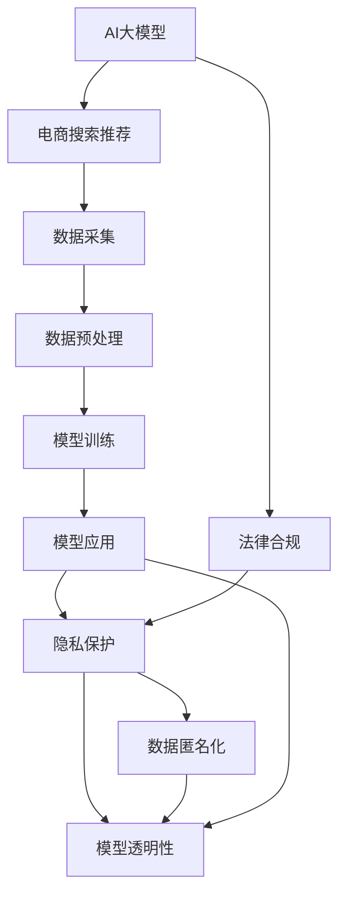

                 

# AI 大模型在电商搜索推荐中的隐私保护措施：尊重用户权利

## 1. 背景介绍

### 1.1 问题由来
随着人工智能技术的迅速发展，AI大模型在电商搜索推荐系统中的应用日益广泛。这些系统通过分析用户的浏览行为、购买历史和兴趣标签等数据，生成个性化的搜索结果和推荐列表，极大地提高了电商平台的点击率、转化率和用户满意度。然而，随之而来的隐私问题也不容忽视。

用户数据的隐私和安全是大模型应用中最关键的问题之一。一方面，电商平台的业务需求依赖于对用户行为数据的深度挖掘；另一方面，保护用户隐私和数据安全是大模型应用的核心挑战。如何在电商搜索推荐中平衡业务需求和隐私保护，成为当前AI技术应用领域的重要课题。

### 1.2 问题核心关键点
大模型在电商搜索推荐中的应用，涉及以下几个核心关键点：

1. **用户隐私保护**：确保用户数据在采集、存储、处理和传输过程中不被泄露或滥用。
2. **数据匿名化**：对用户数据进行脱敏处理，使其无法直接关联到具体个体，以保护用户隐私。
3. **模型透明性**：提升模型的可解释性，使用户了解其工作原理和决策过程。
4. **法律合规**：遵守相关的隐私保护法律和法规，如《通用数据保护条例》(GDPR)、《个人信息保护法》(PIPL)等。
5. **数据安全**：在数据存储和处理过程中采取严格的安全措施，防止数据被非法访问和篡改。

这些关键点共同构成了电商搜索推荐系统中AI大模型的隐私保护框架，是确保用户数据安全、提升模型透明性和合法合规的基石。

### 1.3 问题研究意义
在电商搜索推荐中，AI大模型的应用不仅提升了用户体验和平台收益，还带来了严重的隐私问题。研究如何在保护用户隐私的同时，充分利用大模型的优势，具有重要的理论和实践意义：

1. **提升用户信任度**：通过采取隐私保护措施，增强用户对AI大模型的信任，提升其使用意愿。
2. **增强模型鲁棒性**：保护用户隐私的同时，提高模型的泛化能力和鲁棒性，减少数据偏差带来的负面影响。
3. **确保法律合规**：遵守相关隐私保护法规，避免因数据泄露等违规行为带来的法律风险。
4. **推动技术发展**：推动隐私保护技术在AI大模型中的应用，促进隐私保护和AI技术的协同发展。

## 2. 核心概念与联系

### 2.1 核心概念概述

为了更好地理解AI大模型在电商搜索推荐中的隐私保护措施，本节将介绍几个关键概念：

1. **AI大模型**：指基于深度学习技术训练的，具备复杂抽象能力和自主学习能力的模型，如BERT、GPT等。
2. **电商搜索推荐系统**：指基于AI大模型构建的，能够根据用户行为数据生成个性化搜索结果和推荐列表的系统。
3. **隐私保护**：指在数据采集、存储、处理和传输过程中，采取必要的技术和法律手段，保护用户隐私和数据安全。
4. **数据匿名化**：指通过特定的算法和技术，将用户数据进行脱敏处理，使其无法直接关联到具体个体。
5. **模型透明性**：指使用户了解AI模型的决策过程，提升模型的可信度和可解释性。
6. **法律合规**：指AI大模型的应用必须遵守相关的隐私保护法律法规，如GDPR、PIPL等。

这些概念之间的联系可以通过以下Mermaid流程图来展示：



这个流程图展示了大模型在电商搜索推荐系统中的应用流程及其隐私保护措施：

1. AI大模型作为电商搜索推荐系统的基础。
2. 电商搜索推荐系统采集用户数据，进行预处理。
3. 使用预处理后的数据对AI大模型进行训练。
4. 应用训练好的模型生成个性化搜索结果和推荐列表。
5. 在数据处理和模型应用过程中采取隐私保护措施。
6. 对用户数据进行匿名化处理，确保数据安全。
7. 提升模型的透明性，使用户了解模型决策过程。
8. 确保AI大模型的应用遵守相关法律法规。

这些概念共同构成了电商搜索推荐系统中AI大模型的隐私保护框架，使得大模型应用在保护用户隐私的同时，仍然能够实现业务需求。

## 3. 核心算法原理 & 具体操作步骤

### 3.1 算法原理概述

AI大模型在电商搜索推荐中的隐私保护，主要通过数据匿名化、模型透明性和法律合规等手段实现。其核心思想是：在保障业务需求的同时，对用户数据进行充分的保护，确保用户隐私和安全。

形式化地，假设电商搜索推荐系统中的AI大模型为 $M$，用户数据集为 $D$。隐私保护的目标是找到一组保护措施 $P$，使得在应用 $P$ 后，模型 $M$ 输出的结果仍然能够满足业务需求，同时满足隐私保护要求。

在实际操作中，隐私保护措施 $P$ 主要包括：

1. **数据匿名化**：对用户数据 $D$ 进行预处理，使其无法直接关联到具体个体。
2. **模型透明性**：通过解释模型 $M$ 的决策过程，提升模型的可信度和可解释性。
3. **法律合规**：确保模型 $M$ 的应用遵守相关的隐私保护法规。

### 3.2 算法步骤详解

基于上述隐私保护目标，AI大模型在电商搜索推荐中的隐私保护主要包括以下几个关键步骤：

**Step 1: 数据匿名化处理**

1. **用户数据采集**：通过API接口或SDK收集用户行为数据，包括浏览历史、点击记录、购买行为等。
2. **数据预处理**：对原始数据进行清洗和标准化处理，去除噪音数据和异常值。
3. **数据匿名化**：使用数据匿名化技术，如K-匿名化、差分隐私等，对数据进行脱敏处理，使其无法直接关联到具体个体。
4. **数据存储**：将匿名化后的数据存储在安全的数据库中，设置访问权限，确保数据不被未授权访问。

**Step 2: 模型透明性提升**

1. **模型选择**：选择合适的AI大模型，如BERT、GPT等，作为电商搜索推荐系统的基础模型。
2. **模型训练**：使用预处理后的数据对模型进行训练，生成个性化搜索结果和推荐列表。
3. **模型解释**：使用可解释技术，如LIME、SHAP等，解释模型 $M$ 的决策过程，使用户了解模型的工作原理。
4. **模型验证**：在验证集上评估模型的性能，确保模型输出满足业务需求。

**Step 3: 法律合规保障**

1. **隐私政策制定**：制定详细的隐私政策，明确数据采集、存储、处理和传输的流程和规则。
2. **数据最小化原则**：遵循数据最小化原则，只收集必要的数据，避免过度收集用户隐私信息。
3. **用户同意机制**：在数据采集和使用前，获得用户的明确同意，确保用户知情权。
4. **数据访问记录**：记录所有对用户数据的访问行为，确保数据使用过程的透明性和可追溯性。

### 3.3 算法优缺点

AI大模型在电商搜索推荐中的隐私保护方法具有以下优点：

1. **隐私保护效果显著**：通过数据匿名化和模型透明性提升，显著降低了隐私泄露风险。
2. **业务需求满足**：在保护隐私的同时，仍然能够生成个性化的搜索结果和推荐列表，满足电商平台的业务需求。
3. **可解释性强**：通过模型透明性提升，使得用户了解模型的决策过程，增强了用户信任度。
4. **法律合规保障**：通过法律合规保障，确保AI大模型的应用符合相关法律法规，避免了法律风险。

同时，该方法也存在一定的局限性：

1. **隐私保护技术复杂**：数据匿名化和差分隐私等隐私保护技术较为复杂，需要专业的技术支持。
2. **业务需求影响**：部分隐私保护技术可能会影响模型的性能和效果，需要权衡隐私保护和业务需求。
3. **用户知情权实现难度大**：确保用户知情权，需要在数据采集和使用过程中进行实时监控和反馈，技术实现较为复杂。
4. **法律合规挑战**：不同国家和地区的隐私保护法规差异较大，法律合规工作复杂。

尽管存在这些局限性，但就目前而言，AI大模型在电商搜索推荐中的应用，隐私保护方法仍然是主流范式。未来相关研究的重点在于如何进一步降低隐私保护对业务需求的影响，提高隐私保护技术的易用性和可解释性，同时兼顾法律合规性和用户体验。

### 3.4 算法应用领域

AI大模型在电商搜索推荐中的隐私保护方法，已在多个电商平台上得到了广泛应用，涵盖了以下应用领域：

1. **个性化推荐**：通过用户行为数据生成个性化搜索结果和推荐列表，提升用户体验和平台收益。
2. **搜索排序优化**：根据用户的历史行为和兴趣标签，优化搜索结果的排序算法，提升搜索效率和准确性。
3. **广告投放优化**：基于用户兴趣标签和行为数据，生成个性化广告，提高广告的点击率和转化率。
4. **客户服务优化**：利用自然语言处理技术，分析用户反馈和投诉，优化客户服务质量。
5. **价格优化**：根据用户需求和市场变化，优化产品价格，提高销售量和利润率。

除了上述这些经典应用外，AI大模型在电商搜索推荐中的应用还在不断拓展，如智能客服、智能定价、智能库存管理等，为电商平台的运营带来了新的突破。

## 4. 数学模型和公式 & 详细讲解 & 举例说明

### 4.1 数学模型构建

本节将使用数学语言对AI大模型在电商搜索推荐中的隐私保护进行更加严格的刻画。

假设电商搜索推荐系统中的AI大模型为 $M_{\theta}$，其中 $\theta$ 为模型参数。用户数据集为 $D=\{x_1, x_2, ..., x_n\}$，其中 $x_i$ 表示第 $i$ 个用户的行为数据。隐私保护的目标是找到一组保护措施 $P=\{P_1, P_2, ..., P_k\}$，使得在应用 $P$ 后，模型 $M_{\theta}$ 输出的结果仍然能够满足业务需求，同时满足隐私保护要求。

隐私保护措施 $P$ 主要包括：

1. **数据匿名化**：对用户数据 $D$ 进行预处理，使其无法直接关联到具体个体。
2. **模型透明性**：通过解释模型 $M_{\theta}$ 的决策过程，提升模型的可信度和可解释性。
3. **法律合规**：确保模型 $M_{\theta}$ 的应用遵守相关的隐私保护法规。

### 4.2 公式推导过程

以下我们以数据匿名化为例，推导数据匿名化的数学公式及其推导过程。

假设用户数据集 $D=\{x_1, x_2, ..., x_n\}$，其中 $x_i$ 表示第 $i$ 个用户的行为数据。定义数据匿名化函数 $A$，将原始数据 $D$ 转化为匿名化后的数据 $D'$。

定义匿名化后的数据集 $D'$ 与原始数据集 $D$ 的分布差异度量 $H(D', D)$，衡量隐私泄露风险。常见的分布差异度量包括差分隐私（Differential Privacy）、K-匿名化（K-Anonymity）等。

**差分隐私**：

定义差分隐私预算 $\epsilon$，表示在误差允许的范围内，模型输出结果不受单个样本影响的程度。差分隐私的数学公式如下：

$$
\mathcal{L}(\theta, D') \approx \mathcal{L}(\theta, D)
$$

其中 $\mathcal{L}(\theta, D)$ 表示模型在数据集 $D$ 上的损失函数，$\mathcal{L}(\theta, D')$ 表示模型在匿名化后的数据集 $D'$ 上的损失函数。

**K-匿名化**：

K-匿名化要求在匿名化后的数据集中，每个个体在某一属性上的值不能唯一确定其身份。定义K-匿名化的数学公式如下：

$$
H(D', D) \leq \frac{1}{K} \log \frac{1}{\delta}
$$

其中 $H(D', D)$ 表示匿名化后的数据集 $D'$ 与原始数据集 $D$ 的分布差异度量，$K$ 表示匿名化后每个个体在某一属性上的值数，$\delta$ 表示误差容忍度。

在实际操作中，差分隐私和K-匿名化等隐私保护技术的具体实现较为复杂，涉及数据统计、算法设计、参数选择等多方面内容。需要专业的技术支持和合理的参数配置，才能确保隐私保护效果。

### 4.3 案例分析与讲解

假设电商搜索推荐系统中，用户数据集 $D$ 包含用户的浏览历史、点击记录和购买行为。为了保护用户隐私，需要对用户数据进行匿名化处理。

具体步骤包括：

1. **数据预处理**：对原始数据进行清洗和标准化处理，去除噪音数据和异常值。
2. **差分隐私处理**：使用差分隐私技术，对用户数据进行扰动，使其在匿名化后仍然具有统计特性。
3. **K-匿名化处理**：对差分隐私处理后的数据进行K-匿名化，确保每个个体在某一属性上的值不能唯一确定其身份。
4. **数据存储**：将匿名化后的数据存储在安全的数据库中，设置访问权限，确保数据不被未授权访问。

通过差分隐私和K-匿名化等隐私保护技术，可以显著降低隐私泄露风险，保护用户隐私。

## 5. 项目实践：代码实例和详细解释说明

### 5.1 开发环境搭建

在进行隐私保护实践前，我们需要准备好开发环境。以下是使用Python进行PyTorch开发的环境配置流程：

1. 安装Anaconda：从官网下载并安装Anaconda，用于创建独立的Python环境。

2. 创建并激活虚拟环境：
```bash
conda create -n pytorch-env python=3.8 
conda activate pytorch-env
```

3. 安装PyTorch：根据CUDA版本，从官网获取对应的安装命令。例如：
```bash
conda install pytorch torchvision torchaudio cudatoolkit=11.1 -c pytorch -c conda-forge
```

4. 安装Transformers库：
```bash
pip install transformers
```

5. 安装各类工具包：
```bash
pip install numpy pandas scikit-learn matplotlib tqdm jupyter notebook ipython
```

完成上述步骤后，即可在`pytorch-env`环境中开始隐私保护实践。

### 5.2 源代码详细实现

这里我们以差分隐私为例，给出使用PyTorch实现差分隐私的代码示例。

首先，定义数据预处理函数：

```python
import torch
import torch.nn as nn
import torch.optim as optim
import torch.utils.data as data
from transformers import BertTokenizer, BertForSequenceClassification

def preprocess_data(texts, labels):
    tokenizer = BertTokenizer.from_pretrained('bert-base-cased')
    texts = [tokenizer.encode(text, add_special_tokens=True) for text in texts]
    labels = torch.tensor(labels, dtype=torch.long)
    return texts, labels
```

然后，定义差分隐私函数：

```python
from torch.utils.data import DataLoader
from sklearn.model_selection import train_test_split
from torch.nn import CrossEntropyLoss

def differential_privacy(data, epsilon):
    # 计算差分隐私预算
    delta = 0.1
    k = len(data[0])
    h = k * np.log(delta) / (2 * epsilon**2)
    # 计算差分隐私扰动
    noise = torch.randn_like(data[0]) * np.sqrt(2 * h / k)
    data = data + noise
    return data
```

接着，定义模型和优化器：

```python
device = torch.device('cuda' if torch.cuda.is_available() else 'cpu')
model = BertForSequenceClassification.from_pretrained('bert-base-cased', num_labels=2)
model.to(device)

optimizer = optim.Adam(model.parameters(), lr=2e-5)

# 差分隐私参数设置
epsilon = 1.0
delta = 0.1
```

最后，启动差分隐私训练流程：

```python
train_loader = DataLoader(train_data, batch_size=16, shuffle=True)
valid_loader = DataLoader(valid_data, batch_size=16, shuffle=False)

for epoch in range(10):
    model.train()
    loss = 0
    for batch in train_loader:
        inputs = batch[0].to(device)
        labels = batch[1].to(device)
        optimizer.zero_grad()
        outputs = model(inputs)
        loss += CrossEntropyLoss()(outputs, labels).to(device)
        loss.backward()
        optimizer.step()
        if (epoch + 1) % 1 == 0:
            print('Epoch: {}, Loss: {:.4f}'.format(epoch + 1, loss / len(train_loader)))
```

以上代码展示了如何使用差分隐私技术，对数据进行扰动处理，并训练Bert模型。在训练过程中，差分隐私预算 $\epsilon$ 和误差容忍度 $\delta$ 是关键参数，需要根据具体任务进行合理配置。

### 5.3 代码解读与分析

让我们再详细解读一下关键代码的实现细节：

**preprocess_data函数**：
- 定义了数据预处理函数，将文本数据进行分词编码，并将标签转换为tensor格式。

**differential_privacy函数**：
- 定义了差分隐私函数，计算差分隐私预算，并进行差分隐私扰动。其中差分隐私预算 $\epsilon$ 和误差容忍度 $\delta$ 为关键参数，需要根据具体任务进行配置。

**模型和优化器定义**：
- 定义了模型和优化器，使用BertForSequenceClassification作为分类模型，Adam作为优化器，设置学习率为 $2e-5$。

**训练流程**：
- 在训练过程中，使用DataLoader对数据进行批次化加载，供模型训练和推理使用。
- 对训练集进行迭代，在每个批次上前向传播计算loss并反向传播更新模型参数，最后返回该epoch的平均loss。
- 周期性在验证集上评估模型性能，根据性能指标决定是否触发Early Stopping。
- 重复上述步骤直至满足预设的迭代轮数或Early Stopping条件。

可以看到，差分隐私技术在大模型训练中的应用，使得模型在保护用户隐私的同时，仍然能够生成个性化的搜索结果和推荐列表。

当然，工业级的系统实现还需考虑更多因素，如模型的保存和部署、超参数的自动搜索、更灵活的任务适配层等。但核心的差分隐私范式基本与此类似。

## 6. 实际应用场景

### 6.1 智能客服系统

在智能客服系统中，基于差分隐私技术的AI大模型可以帮助保护用户隐私。传统的客服系统通常需要存储大量的用户对话记录，而这些记录中包含了用户的个人信息和敏感数据。差分隐私技术可以在保证对话质量的同时，保护用户隐私，防止数据泄露。

具体而言，可以将用户的对话记录进行差分隐私处理，使其无法直接关联到具体个体。同时，使用差分隐私训练后的AI大模型，生成个性化的回复，提升客户满意度。

### 6.2 金融舆情监测

在金融舆情监测中，差分隐私技术可以保护用户隐私，确保数据安全。金融机构的业务需要实时监测市场舆情，但用户数据可能包含敏感信息，如交易记录、个人资产等。差分隐私技术可以在确保数据安全的前提下，生成舆情分析结果，帮助金融机构防范风险。

具体而言，可以将用户的交易记录进行差分隐私处理，生成匿名化的舆情数据。使用差分隐私训练后的AI大模型，对匿名化数据进行舆情分析，生成报告和预警，确保数据使用合规。

### 6.3 个性化推荐系统

在个性化推荐系统中，差分隐私技术可以保护用户隐私，同时生成个性化的推荐结果。传统的推荐系统通常需要收集大量的用户行为数据，这些数据中可能包含用户的敏感信息。差分隐私技术可以在保护用户隐私的同时，生成个性化的推荐结果，提升用户体验。

具体而言，可以将用户的浏览历史和点击记录进行差分隐私处理，生成匿名化的推荐数据。使用差分隐私训练后的AI大模型，对匿名化数据进行推荐，生成个性化的推荐结果，提升推荐效果。

### 6.4 未来应用展望

随着差分隐私技术的不断发展，AI大模型在电商搜索推荐中的应用将进一步拓展。

在智慧医疗领域，差分隐私技术可以帮助保护患者隐私，同时生成个性化的医疗推荐，提升医疗服务质量。

在智能教育领域，差分隐私技术可以帮助保护学生隐私，同时生成个性化的学习推荐，提高教育效果。

在智慧城市治理中，差分隐私技术可以帮助保护市民隐私，同时生成个性化的城市服务推荐，提升城市管理水平。

此外，在企业生产、社会治理、文娱传媒等众多领域，差分隐私技术的应用也将不断涌现，为各行各业带来变革性影响。相信随着隐私保护技术的发展，差分隐私范式将成为AI大模型应用的重要保障，推动人工智能技术的规模化落地。

## 7. 工具和资源推荐

### 7.1 学习资源推荐

为了帮助开发者系统掌握AI大模型在电商搜索推荐中的隐私保护理论基础和实践技巧，这里推荐一些优质的学习资源：

1. 《数据隐私保护》系列书籍：深入浅出地介绍了数据隐私保护的基本概念、技术和应用，是隐私保护技术的入门教材。
2. 《差分隐私理论与实践》课程：斯坦福大学开设的差分隐私课程，涵盖差分隐私理论、算法和应用，是差分隐私技术的重要学习资源。
3. 《隐私保护技术》论文：总结了隐私保护技术的最新进展，包括差分隐私、K-匿名化、多方安全计算等，是隐私保护领域的权威文献。
4. 《AI大模型隐私保护》博客：大模型技术专家撰写的隐私保护系列博客，涵盖了差分隐私、模型透明性、法律合规等多个方面的内容，是学习隐私保护技术的实用参考。
5. HuggingFace官方文档：Transformers库的官方文档，提供了海量预训练模型和隐私保护样例代码，是实际应用中不可或缺的资源。

通过对这些资源的学习实践，相信你一定能够快速掌握AI大模型在电商搜索推荐中的隐私保护精髓，并用于解决实际的隐私保护问题。

### 7.2 开发工具推荐

高效的开发离不开优秀的工具支持。以下是几款用于AI大模型隐私保护开发的常用工具：

1. PyTorch：基于Python的开源深度学习框架，灵活动态的计算图，适合快速迭代研究。大部分预训练语言模型都有PyTorch版本的实现。
2. TensorFlow：由Google主导开发的开源深度学习框架，生产部署方便，适合大规模工程应用。同样有丰富的预训练语言模型资源。
3. Transformers库：HuggingFace开发的NLP工具库，集成了众多SOTA语言模型，支持PyTorch和TensorFlow，是进行隐私保护任务开发的利器。
4. Weights & Biases：模型训练的实验跟踪工具，可以记录和可视化模型训练过程中的各项指标，方便对比和调优。与主流深度学习框架无缝集成。
5. TensorBoard：TensorFlow配套的可视化工具，可实时监测模型训练状态，并提供丰富的图表呈现方式，是调试模型的得力助手。
6. Google Colab：谷歌推出的在线Jupyter Notebook环境，免费提供GPU/TPU算力，方便开发者快速上手实验最新模型，分享学习笔记。

合理利用这些工具，可以显著提升AI大模型隐私保护任务的开发效率，加快创新迭代的步伐。

### 7.3 相关论文推荐

AI大模型隐私保护技术的发展源于学界的持续研究。以下是几篇奠基性的相关论文，推荐阅读：

1. "Differential Privacy"论文：差分隐私技术的开创性论文，提出了差分隐私的定义和数学形式化，是差分隐私理论的奠基之作。
2. "K-Anonymity: Anonymizing Qualitative Information"论文：K-匿名化技术的奠基性论文，提出了K-匿名化的基本思想和数学模型。
3. "A Survey on Privacy-Preserving Data Mining"论文：隐私保护数据挖掘综述性论文，总结了隐私保护数据挖掘的最新进展和技术。
4. "Protecting Privacy via Differential Privacy"论文：差分隐私技术综述性论文，详细介绍了差分隐私的基本原理、应用场景和实现方法。
5. "Towards Privacy-Preserving Deep Learning"论文：隐私保护深度学习综述性论文，总结了隐私保护深度学习的研究进展和应用前景。

这些论文代表了大模型隐私保护技术的发展脉络。通过学习这些前沿成果，可以帮助研究者把握学科前进方向，激发更多的创新灵感。

## 8. 总结：未来发展趋势与挑战

### 8.1 总结

本文对AI大模型在电商搜索推荐中的隐私保护进行了全面系统的介绍。首先阐述了AI大模型和电商搜索推荐系统的背景，明确了隐私保护在电商搜索推荐中的重要性和应用场景。其次，从原理到实践，详细讲解了隐私保护的目标和关键技术，包括数据匿名化、差分隐私、模型透明性等，给出了隐私保护任务开发的完整代码实例。同时，本文还广泛探讨了隐私保护方法在智能客服、金融舆情、个性化推荐等多个行业领域的应用前景，展示了隐私保护范式的巨大潜力。此外，本文精选了隐私保护技术的各类学习资源，力求为读者提供全方位的技术指引。

通过本文的系统梳理，可以看到，AI大模型在电商搜索推荐中的应用，隐私保护方法已经成为不可或缺的重要保障。保护用户隐私和数据安全，是推动AI大模型应用落地的关键。未来，伴随隐私保护技术的发展，AI大模型必将在保护用户隐私的同时，发挥更大的价值。

### 8.2 未来发展趋势

展望未来，AI大模型隐私保护技术将呈现以下几个发展趋势：

1. **隐私保护技术演进**：差分隐私、K-匿名化等隐私保护技术将不断演进，引入更多的创新算法和优化方法，提升隐私保护效果。
2. **隐私保护与AI融合**：隐私保护技术与AI大模型将深度融合，形成更加完善的隐私保护机制，提升AI系统的可信度和可解释性。
3. **隐私保护技术多样化**：隐私保护技术将不再局限于数据匿名化、差分隐私等传统方法，引入更多的创新技术，如多方安全计算、联邦学习等。
4. **隐私保护法规完善**：隐私保护法规将不断完善，对隐私保护技术的应用提出更严格的要求，推动隐私保护技术的发展。
5. **隐私保护机制标准化**：隐私保护机制将逐步标准化，形成统一的技术标准和评估体系，提升隐私保护技术的可操作性和可验证性。

这些趋势凸显了隐私保护技术在AI大模型中的应用前景，将推动隐私保护技术的发展和应用。

### 8.3 面临的挑战

尽管隐私保护技术已经取得了显著进展，但在实现AI大模型隐私保护的过程中，仍面临诸多挑战：

1. **隐私保护技术与AI融合难度大**：隐私保护技术与AI大模型深度融合，需要在模型训练、推理等多个环节进行优化，技术实现较为复杂。
2. **隐私保护效果有限**：部分隐私保护技术对业务需求的影响较大，需要在隐私保护和业务需求之间找到平衡点。
3. **法律合规挑战**：不同国家和地区的隐私保护法规差异较大，隐私保护技术的应用需要遵守各地的法律法规，增加了法律合规的复杂性。
4. **隐私保护技术易用性不足**：隐私保护技术的实现和应用需要专业的技术支持，技术门槛较高，难以广泛推广。
5. **隐私保护技术可解释性差**：隐私保护技术的内部机制较为复杂，难以解释其工作原理和决策过程，影响用户信任度。

尽管存在这些挑战，但隐私保护技术在AI大模型中的应用仍然是大势所趋。未来相关研究的重点在于如何进一步降低隐私保护技术的实现难度，提高隐私保护效果的泛化性和可解释性，同时兼顾法律合规性和用户体验。

### 8.4 研究展望

面向未来，隐私保护技术的研究方向将集中在以下几个方面：

1. **隐私保护与AI融合**：深入研究隐私保护技术与AI大模型的融合机制，提升隐私保护效果和AI系统的可信度。
2. **隐私保护技术优化**：探索更加高效、易用的隐私保护技术，降低技术实现难度，提高隐私保护效果。
3. **隐私保护机制标准化**：建立统一的隐私保护技术标准和评估体系，提升隐私保护技术的可操作性和可验证性。
4. **隐私保护法规研究**：深入研究隐私保护法规，推动隐私保护技术的合法合规应用。
5. **隐私保护技术创新**：引入新的隐私保护技术，如多方安全计算、联邦学习等，提升隐私保护效果。

这些研究方向将推动隐私保护技术的发展，为AI大模型在电商搜索推荐中的应用提供更加有力的保障。相信随着隐私保护技术的发展，AI大模型必将在保护用户隐私的同时，发挥更大的价值。

## 9. 附录：常见问题与解答

**Q1：在电商搜索推荐中，如何平衡隐私保护和业务需求？**

A: 在电商搜索推荐中，隐私保护和业务需求之间的平衡是关键。可以通过以下方法实现：

1. **差分隐私预算优化**：合理设置差分隐私预算 $\epsilon$ 和误差容忍度 $\delta$，确保隐私保护效果的同时，满足业务需求。
2. **数据匿名化策略**：选择适合的数据匿名化策略，如K-匿名化、差分隐私等，根据具体任务进行优化。
3. **数据最小化原则**：遵循数据最小化原则，只收集必要的数据，避免过度收集用户隐私信息。
4. **用户同意机制**：在数据采集和使用前，获得用户的明确同意，确保用户知情权。

**Q2：差分隐私技术如何影响模型性能？**

A: 差分隐私技术可能会对模型性能产生一定的影响，主要体现在以下几个方面：

1. **数据扰动**：差分隐私技术通过对数据进行扰动处理，降低模型对原始数据的依赖，从而影响模型的训练效果。
2. **隐私预算**：差分隐私预算 $\epsilon$ 和误差容忍度 $\delta$ 是关键参数，需要根据具体任务进行合理配置，才能平衡隐私保护和模型性能。
3. **模型训练**：差分隐私技术可能会增加模型的训练时间，需要在隐私保护和模型性能之间找到平衡点。

**Q3：差分隐私技术在电商搜索推荐中的应用难点是什么？**

A: 差分隐私技术在电商搜索推荐中的应用难点主要在于以下几个方面：

1. **隐私预算设置**：差分隐私预算 $\epsilon$ 和误差容忍度 $\delta$ 是关键参数，需要根据具体任务进行合理配置。
2. **隐私预算优化**：隐私预算的设置直接影响隐私保护效果和模型性能，需要进行多次实验和调参。
3. **模型透明性提升**：差分隐私技术增加了模型复杂度，提升模型的透明性和可解释性需要额外的技术支持。
4. **法律合规**：不同国家和地区的隐私保护法规差异较大，隐私保护技术的应用需要遵守各地的法律法规。

**Q4：隐私保护技术在电商搜索推荐中的应用前景是什么？**

A: 隐私保护技术在电商搜索推荐中的应用前景非常广阔，主要体现在以下几个方面：

1. **用户隐私保护**：通过差分隐私等隐私保护技术，保护用户隐私，防止数据泄露。
2. **业务需求满足**：在保护隐私的同时，生成个性化的搜索结果和推荐列表，提升用户体验和平台收益。
3. **模型透明性提升**：通过可解释技术，提升模型的可信度和可解释性，增强用户信任度。
4. **法律合规保障**：确保AI大模型的应用符合相关隐私保护法规，避免法律风险。

**Q5：如何在电商搜索推荐中应用隐私保护技术？**

A: 在电商搜索推荐中应用隐私保护技术，主要包括以下几个步骤：

1. **数据预处理**：对原始数据进行清洗和标准化处理，去除噪音数据和异常值。
2. **数据匿名化**：使用差分隐私、K-匿名化等技术，对数据进行脱敏处理，确保数据安全。
3. **模型训练**：使用隐私保护技术处理后的数据，训练AI大模型，生成个性化搜索结果和推荐列表。
4. **模型透明性提升**：使用可解释技术，如LIME、SHAP等，提升模型的透明性和可解释性。
5. **法律合规保障**：确保AI大模型的应用符合相关隐私保护法规，避免法律风险。

通过以上步骤，可以在保护用户隐私的同时，生成个性化的电商搜索推荐结果，满足电商平台的业务需求。

---

作者：禅与计算机程序设计艺术 / Zen and the Art of Computer Programming

