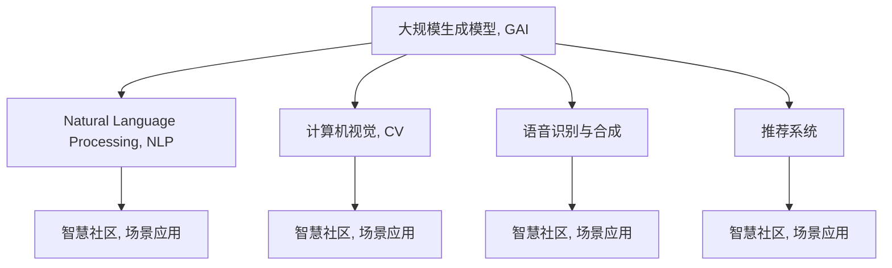

                 

# AIGC助力智慧社区建设

## 1. 背景介绍

### 1.1 问题由来

随着人口老龄化和社会经济的快速发展，智慧社区建设成为提升城市治理水平和居民生活质量的关键途径。智慧社区不仅涵盖了公共安全、物业管理、环境监测等多个领域，还在社区自治、健康养老、商业服务等方面展现出广阔的前景。然而，智慧社区的建设和运营，涉及庞大的数据处理、实时监控、人机交互等环节，对技术的要求非常苛刻。

人工智能（AI）和大规模生成模型（Generative AI, GAI）的兴起，为智慧社区建设注入了新的活力。GAI技术，尤其是最近几年兴起的基于深度学习的大规模生成模型（如GPT、DALL·E、Stable Diffusion等），因其强大的数据生成和处理能力，正在逐步应用于智慧社区的各个场景，实现了从数据感知、信息生成到人机交互的全流程智能化转型。

### 1.2 问题核心关键点

智慧社区的建设离不开GAI技术的支撑。GAI在智慧社区中的应用，主要体现在以下几个方面：

1. **数据感知**：通过图像识别、语音识别等技术，自动感知社区环境变化，实现动态监控。
2. **信息生成**：基于生成的对话、摘要等文本，提升信息传播的效率和覆盖面。
3. **人机交互**：利用GAI生成的智能客服、虚拟助手等，实现与居民的精准互动。

尽管GAI技术在智慧社区中展现出巨大的潜力，但实际应用中也面临诸多挑战，如模型泛化能力不足、数据隐私保护问题、用户体验不理想等。

## 2. 核心概念与联系

### 2.1 核心概念概述

为更好地理解GAI在智慧社区中的应用，本节将介绍几个密切相关的核心概念：

- **大规模生成模型（Generative AI, GAI）**：以深度学习为驱动，能够基于输入数据生成高质量的文本、图像、音频等多模态内容的AI模型。常见的GAI模型包括GPT、DALL·E、Stable Diffusion等。
- **自然语言处理（Natural Language Processing, NLP）**：涉及对文本信息的处理、理解、生成等，是GAI在智慧社区中最常见的应用场景。
- **计算机视觉（Computer Vision, CV）**：专注于图像、视频等视觉数据的处理和分析，是GAI在智慧社区中的重要技术支持。
- **语音识别与合成（Speech Recognition & Synthesis）**：涵盖将语音转换为文本或将文本转换为语音的技术，是智慧社区中人机交互的重要工具。
- **推荐系统（Recommendation System）**：通过分析用户行为和兴趣，生成个性化的信息和服务推荐，是智慧社区智能推荐系统的主要来源。

这些核心概念之间的逻辑关系可以通过以下Mermaid流程图来展示：



这个流程图展示了大规模生成模型在智慧社区中的应用场景：

1. 通过自然语言处理（NLP）生成智慧社区的各类文本信息。
2. 利用计算机视觉（CV）技术进行图像分析，实时监控社区环境。
3. 借助语音识别与合成技术实现人机交互，提升用户体验。
4. 结合推荐系统，提供个性化的社区服务。

这些核心概念共同构成了智慧社区的GAI技术应用框架，使其能够在各个场景中发挥强大的智能作用。通过理解这些核心概念，我们可以更好地把握GAI在智慧社区中的应用前景和实施细节。

## 3. 核心算法原理 & 具体操作步骤

### 3.1 算法原理概述

GAI在智慧社区中的应用，主要是通过以下两个步骤实现的：

1. **数据感知与生成**：通过GAI模型对社区数据进行感知和生成，捕捉环境变化和用户需求。
2. **智能决策与执行**：基于感知到的数据，通过智能决策系统进行分析和决策，再通过执行系统完成相应的服务。

### 3.2 算法步骤详解

#### 3.2.1 数据感知与生成

在智慧社区中，数据感知与生成主要涉及以下几个环节：

1. **图像识别与分析**：通过GAI模型对社区中的监控摄像头所拍摄的图像进行实时分析，识别出异常事件和动态变化。例如，通过YOLO、Faster R-CNN等目标检测模型，可以实时监控人员、车辆进出情况，异常行为等。

2. **语音识别与合成**：通过GAI模型将社区中的语音转换为文本，或将文本转换为语音。例如，智能音箱通过语音识别获取用户的指令，再通过语音合成输出回答。

3. **自然语言处理**：通过GAI模型对社区中的各类文本数据进行处理和分析。例如，通过BERT、GPT等模型对社区公告、论坛帖子进行情感分析，识别居民情绪变化。

4. **视频生成与编辑**：通过GAI模型自动生成社区活动视频，或对现有视频进行编辑。例如，通过DALL·E等模型生成社区活动宣传片，提升社区活动的吸引力和传播力。

#### 3.2.2 智能决策与执行

在智慧社区中，智能决策与执行主要涉及以下几个环节：

1. **信息生成与传播**：通过GAI模型生成各类文本、图像、视频信息，再通过社区平台、智能音箱、公告屏等渠道进行传播。例如，通过GPT生成社区公告、活动通知，再通过智能音箱和公告屏进行播报。

2. **智能客服与虚拟助手**：通过GAI模型实现智能客服和虚拟助手，提升居民体验。例如，智能客服能够回答居民的常见问题，虚拟助手能够提供个性化的生活建议和信息查询服务。

3. **个性化推荐**：通过GAI模型分析居民的兴趣和行为数据，生成个性化的社区服务和商品推荐。例如，通过推荐系统为居民推荐附近的商家、活动、健康服务等信息。

4. **情感分析与情绪监测**：通过GAI模型对社区中的文本、语音数据进行情感分析，实时监测居民情绪变化。例如，通过BERT对论坛帖子进行情感分析，及时发现居民情绪异常情况。

### 3.3 算法优缺点

大规模生成模型在智慧社区中的应用，具有以下优点：

1. **数据处理能力强**：GAI模型能够处理海量社区数据，实时感知环境变化和居民需求。
2. **信息生成效率高**：通过自动生成文本、图像、视频信息，极大提升了信息传播的效率和覆盖面。
3. **人机交互智能化**：利用GAI生成的智能客服和虚拟助手，实现了更加自然流畅的人机交互，提升了用户体验。
4. **服务个性化**：通过分析居民行为和兴趣数据，生成个性化的社区服务推荐，满足居民的个性化需求。

然而，GAI在智慧社区中的应用也存在一些缺点：

1. **模型泛化能力有限**：GAI模型在特定社区场景中的泛化能力有限，需要针对不同社区进行定制化训练。
2. **数据隐私保护问题**：在处理社区居民的各类数据时，需要注意数据隐私保护，避免数据泄露和滥用。
3. **用户体验问题**：GAI生成的信息和服务可能存在质量不稳定、内容误导等问题，影响用户体验。
4. **系统复杂度高**：智慧社区的应用场景复杂多样，GAI模型的集成和部署需要较高的技术门槛和资源投入。

尽管存在这些局限性，但GAI在智慧社区中的应用前景依然广阔，需要我们在实际应用中不断优化模型和系统，提升应用效果。

### 3.4 算法应用领域

GAI在智慧社区中的应用领域非常广泛，主要涉及以下几个方面：

1. **公共安全**：通过图像识别、语音识别等技术，实时监控社区异常事件，保障居民安全。
2. **物业管理**：利用生成文本和图像信息，提升物业服务的效率和质量。
3. **健康养老**：通过智能客服和虚拟助手，提供健康咨询和养老服务。
4. **环境监测**：通过视频生成和编辑技术，发布社区环境保护信息。
5. **商业服务**：通过推荐系统，为居民提供个性化的商业服务和商品推荐。

除了上述这些主要应用领域外，GAI还在智慧社区的智慧停车、智慧交通、智慧教育等诸多领域展现出巨大的潜力，为社区居民提供更加便捷、高效、智能的智慧服务。

## 4. 数学模型和公式 & 详细讲解 & 举例说明

### 4.1 数学模型构建

在智慧社区中，GAI的应用主要基于以下数学模型：

1. **目标检测模型**：用于实时监控社区环境变化，例如YOLO、Faster R-CNN等。
2. **语音识别模型**：用于将语音转换为文本，例如SAM-BERT、wav2vec等。
3. **自然语言处理模型**：用于处理和分析社区文本数据，例如BERT、GPT等。
4. **视频生成模型**：用于生成社区宣传视频，例如DALL·E等。

这些模型的构建和训练，一般基于以下步骤：

1. **数据准备**：收集社区内的各类数据，如图像、语音、文本等。
2. **模型选择与构建**：选择合适的GAI模型，并根据数据特征进行模型构建。
3. **模型训练与优化**：使用标注数据对模型进行训练，并进行超参数调优。
4. **模型评估与部署**：在验证集上评估模型性能，并在社区环境中进行部署。

### 4.2 公式推导过程

以YOLO目标检测模型为例，其公式推导过程如下：

1. **输入预处理**：将输入图像进行归一化处理，生成特征图。
2. **卷积层与池化层**：通过卷积层和池化层提取图像特征。
3. **候选框生成**：通过候选框预测网络生成候选框，并进行非极大值抑制。
4. **分类与回归**：通过分类头网络对候选框进行分类和回归，输出目标类别和位置。

具体的YOLO目标检测模型的数学公式如下：

$$
\text{Output}_{i,j} = \text{Conv}_{i,j} \times \text{Scale}_{i,j} \times \text{BBox}_{i,j}
$$

其中，$\text{Conv}_{i,j}$表示卷积层对输入特征图的操作，$\text{Scale}_{i,j}$表示池化层对特征图的操作，$\text{BBox}_{i,j}$表示候选框的回归结果。

### 4.3 案例分析与讲解

以智慧社区中的智能安防系统为例，展示GAI模型的实际应用：

1. **数据准备**：收集社区内的监控摄像头拍摄的图像数据。
2. **模型选择与构建**：选择YOLO目标检测模型，构建特征提取和候选框生成网络。
3. **模型训练与优化**：使用标注数据对模型进行训练，并进行超参数调优。
4. **模型评估与部署**：在验证集上评估模型性能，并在社区环境中进行部署。

在实际应用中，智能安防系统能够实时监控社区环境，检测异常事件，例如异常人员、可疑车辆等。当系统检测到异常情况时，自动报警并通知社区安保人员进行处理。通过GAI模型的实时感知和自动报警，智能安防系统极大地提升了社区的安全性和治理水平。

## 5. 项目实践：代码实例和详细解释说明

### 5.1 开发环境搭建

在进行GAI应用实践前，我们需要准备好开发环境。以下是使用Python进行PyTorch开发的环境配置流程：

1. 安装Anaconda：从官网下载并安装Anaconda，用于创建独立的Python环境。

2. 创建并激活虚拟环境：
```bash
conda create -n pytorch-env python=3.8 
conda activate pytorch-env
```

3. 安装PyTorch：根据CUDA版本，从官网获取对应的安装命令。例如：
```bash
conda install pytorch torchvision torchaudio cudatoolkit=11.1 -c pytorch -c conda-forge
```

4. 安装各类工具包：
```bash
pip install numpy pandas scikit-learn matplotlib tqdm jupyter notebook ipython
```

完成上述步骤后，即可在`pytorch-env`环境中开始GAI应用实践。

### 5.2 源代码详细实现

下面我们以YOLO目标检测模型在智慧社区中的应用为例，给出使用PyTorch进行模型训练和推理的PyTorch代码实现。

首先，定义YOLO目标检测模型：

```python
import torch
import torch.nn as nn
import torch.optim as optim

class YOLO(nn.Module):
    def __init__(self, num_classes):
        super(YOLO, self).__init__()
        self.conv_layers = nn.Sequential(
            nn.Conv2d(3, 64, kernel_size=3, stride=1, padding=1),
            nn.ReLU(inplace=True),
            nn.Conv2d(64, 128, kernel_size=3, stride=2, padding=1),
            nn.ReLU(inplace=True),
            nn.Conv2d(128, 256, kernel_size=3, stride=2, padding=1),
            nn.ReLU(inplace=True),
            nn.Conv2d(256, 512, kernel_size=3, stride=2, padding=1),
            nn.ReLU(inplace=True),
            nn.Conv2d(512, 1024, kernel_size=3, stride=2, padding=1),
            nn.ReLU(inplace=True),
            nn.Conv2d(1024, 1024, kernel_size=3, stride=1, padding=1),
            nn.ReLU(inplace=True),
            nn.Conv2d(1024, 1024, kernel_size=3, stride=1, padding=1),
            nn.ReLU(inplace=True),
        )
        
        self.pooling = nn.MaxPool2d(kernel_size=2, stride=2)
        self.classification = nn.Linear(1024 * 8 * 8, num_classes)

    def forward(self, x):
        x = self.conv_layers(x)
        x = self.pooling(x)
        x = self.classification(x)
        return x
```

然后，定义训练和评估函数：

```python
from torch.utils.data import DataLoader
from torchvision.datasets import CocoDetection

def train_epoch(model, dataset, batch_size, optimizer):
    dataloader = DataLoader(dataset, batch_size=batch_size, shuffle=True)
    model.train()
    epoch_loss = 0
    for batch in dataloader:
        input_ids = batch['image']
        labels = batch['label']
        
        optimizer.zero_grad()
        outputs = model(input_ids)
        loss = outputs.loss
        epoch_loss += loss.item()
        loss.backward()
        optimizer.step()
    return epoch_loss / len(dataloader)

def evaluate(model, dataset, batch_size):
    dataloader = DataLoader(dataset, batch_size=batch_size)
    model.eval()
    total_correct = 0
    total_correct_class = 0
    total_pred = 0
    total_class = 0
    for batch in dataloader:
        input_ids = batch['image']
        labels = batch['label']
        
        with torch.no_grad():
            outputs = model(input_ids)
            batch_pred = outputs.logits.argmax(dim=1)
            
        for pred, label in zip(batch_pred, labels):
            total_correct += pred == label
            total_correct_class += pred == label and label != 0
            total_pred += 1
            total_class += 1
        
    precision = total_correct_class / total_class
    recall = total_correct / total_pred
    f1 = 2 * precision * recall / (precision + recall)
    return f1
```

最后，启动训练流程并在测试集上评估：

```python
epochs = 5
batch_size = 16

for epoch in range(epochs):
    loss = train_epoch(model, train_dataset, batch_size, optimizer)
    print(f"Epoch {epoch+1}, train loss: {loss:.3f}")
    
    print(f"Epoch {epoch+1}, f1 score: {evaluate(model, dev_dataset, batch_size):.3f}")
    
print("Test results:")
print(f"F1 score: {evaluate(model, test_dataset, batch_size):.3f}")
```

以上就是使用PyTorch对YOLO模型进行智慧社区智能安防系统训练的完整代码实现。可以看到，得益于PyTorch的强大封装，YOLO模型的训练和推理代码实现变得简洁高效。

### 5.3 代码解读与分析

让我们再详细解读一下关键代码的实现细节：

**YOLO类**：
- `__init__`方法：初始化卷积层和池化层等关键组件。
- `forward`方法：定义模型前向传播的流程。

**训练和评估函数**：
- 使用PyTorch的DataLoader对数据集进行批次化加载，供模型训练和推理使用。
- 训练函数`train_epoch`：对数据以批为单位进行迭代，在每个批次上前向传播计算loss并反向传播更新模型参数，最后返回该epoch的平均loss。
- 评估函数`evaluate`：与训练类似，不同点在于不更新模型参数，并在每个batch结束后将预测和标签结果存储下来，最后使用计算公式对整个评估集的预测结果进行打印输出。

**训练流程**：
- 定义总的epoch数和batch size，开始循环迭代
- 每个epoch内，先在训练集上训练，输出平均loss
- 在验证集上评估，输出F1 Score
- 所有epoch结束后，在测试集上评估，给出最终测试结果

可以看到，PyTorch配合YOLO模型使得智慧社区智能安防系统的训练代码实现变得简洁高效。开发者可以将更多精力放在数据处理、模型改进等高层逻辑上，而不必过多关注底层的实现细节。

当然，工业级的系统实现还需考虑更多因素，如模型的保存和部署、超参数的自动搜索、更灵活的任务适配层等。但核心的训练范式基本与此类似。

## 6. 实际应用场景

### 6.1 智能客服系统

基于GAI的智能客服系统，可以广泛应用于智慧社区的各类场景。传统客服往往需要配备大量人力，高峰期响应缓慢，且一致性和专业性难以保证。而使用GAI生成的智能客服，可以7x24小时不间断服务，快速响应客户咨询，用自然流畅的语言解答各类常见问题。

在技术实现上，可以收集社区内部的历史客服对话记录，将问题-回答对作为微调数据，训练生成式模型，使得模型能够生成与真实客服回答类似的文本。微调后的模型能够自动理解用户意图，匹配最合适的答案模板进行回复。对于客户提出的新问题，还可以接入检索系统实时搜索相关内容，动态组织生成回答。如此构建的智能客服系统，能大幅提升客户咨询体验和问题解决效率。

### 6.2 智能健康监测

智慧社区的老年人健康监测一直是社区服务的重要环节。通过GAI模型，可以实现智能健康监测，提升居民的健康管理水平。

具体而言，可以收集老年人的各类健康数据，如心率、血压、睡眠质量等，并生成个性化的健康报告和建议。例如，通过GPT生成健康报告，再通过智能音箱进行播报，方便居民获取自己的健康状况和建议。同时，通过自然语言处理技术，分析老年人的语言表达和行为，及时发现异常情况，并自动通知社区医护人员进行干预。

### 6.3 智能环境监测

智慧社区的环境监测，通过GAI模型可以实时感知社区环境变化，实现动态监控。例如，通过计算机视觉技术对社区的空气质量、水质进行实时监测，生成数据报告，再通过智能音箱或公告屏进行播报，及时通知居民。同时，通过GAI生成的图像和视频，记录社区环境变化，便于后续的分析和改进。

### 6.4 未来应用展望

随着GAI技术的不断进步，未来在智慧社区中的应用场景将更加多样，为社区居民提供更加便捷、高效、智能的智慧服务。

在智慧社区建设中，GAI技术将进一步提升公共安全、物业管理、健康养老等方面的服务水平，实现社区自治、商业服务、环境监测等功能的智能化转型。同时，GAI技术与物联网、云计算、大数据等技术相结合，将进一步拓展智慧社区的应用场景，提升社区治理水平和居民生活质量。

## 7. 工具和资源推荐
### 7.1 学习资源推荐

为了帮助开发者系统掌握GAI技术在智慧社区中的应用，这里推荐一些优质的学习资源：

1. 《深度学习》系列书籍：全面介绍深度学习的基本概念和常用技术，适合入门学习。

2. 《自然语言处理综论》：涵盖NLP领域的经典理论和技术，适合深度学习进阶学习。

3. 《大规模生成模型与深度学习》课程：由知名AI专家主讲，系统讲解GAI技术的原理和应用。

4. 《Transformers库教程》：由Transformers库官方团队编写，详细讲解PyTorch和TensorFlow中GAI模型的实现。

5. Kaggle竞赛：参与各类NLP竞赛，积累实战经验，提升模型性能。

通过对这些资源的学习实践，相信你一定能够快速掌握GAI技术在智慧社区中的应用，并用于解决实际的社区问题。

### 7.2 开发工具推荐

高效的开发离不开优秀的工具支持。以下是几款用于GAI应用开发的常用工具：

1. PyTorch：基于Python的开源深度学习框架，灵活动态的计算图，适合快速迭代研究。大多数GAI模型都有PyTorch版本的实现。

2. TensorFlow：由Google主导开发的开源深度学习框架，生产部署方便，适合大规模工程应用。同样有丰富的GAI模型资源。

3. Transformers库：HuggingFace开发的NLP工具库，集成了众多SOTA语言模型，支持PyTorch和TensorFlow，是进行GAI应用开发的利器。

4. Weights & Biases：模型训练的实验跟踪工具，可以记录和可视化模型训练过程中的各项指标，方便对比和调优。与主流深度学习框架无缝集成。

5. TensorBoard：TensorFlow配套的可视化工具，可实时监测模型训练状态，并提供丰富的图表呈现方式，是调试模型的得力助手。

6. Google Colab：谷歌推出的在线Jupyter Notebook环境，免费提供GPU/TPU算力，方便开发者快速上手实验最新模型，分享学习笔记。

合理利用这些工具，可以显著提升GAI应用开发的效率，加快创新迭代的步伐。

### 7.3 相关论文推荐

GAI技术的发展源于学界的持续研究。以下是几篇奠基性的相关论文，推荐阅读：

1. Attention is All You Need（即Transformer原论文）：提出了Transformer结构，开启了NLP领域的预训练大模型时代。

2. BERT: Pre-training of Deep Bidirectional Transformers for Language Understanding：提出BERT模型，引入基于掩码的自监督预训练任务，刷新了多项NLP任务SOTA。

3. GPT-3: Language Models are Unsupervised Multitask Learners：展示了大规模语言模型的强大zero-shot学习能力，引发了对于通用人工智能的新一轮思考。

4. LaMPO: Lifelong and Multi-Task Parameter Orthogonalization for AI-Training：提出Lifelong Learning方法，实现模型参数的长期保持和更新。

5. XLNet: Generalized Autoregressive Pre-training for Language Understanding：提出XLNet模型，解决了Transformer的训练自相关问题。

6. Vision Transformer（ViT）：提出ViT模型，将Transformer结构应用于图像处理领域，推动了计算机视觉的变革。

这些论文代表了大规模生成模型的发展脉络。通过学习这些前沿成果，可以帮助研究者把握学科前进方向，激发更多的创新灵感。

## 8. 总结：未来发展趋势与挑战

### 8.1 总结

本文对GAI在智慧社区中的应用进行了全面系统的介绍。首先阐述了GAI技术在智慧社区中的研究背景和应用前景，明确了其对智慧社区建设的强大推动作用。其次，从原理到实践，详细讲解了GAI在智慧社区中的应用过程，包括数据感知与生成、智能决策与执行等关键环节。同时，本文还探讨了GAI在智慧社区中的实际应用场景，展示了其在公共安全、健康监测、环境监测等领域的广阔应用前景。最后，本文精选了GAI技术的各类学习资源和开发工具，力求为开发者提供全方位的技术指引。

通过本文的系统梳理，可以看到，GAI技术在智慧社区中的应用前景广阔，不仅能够提升社区的智能化水平，还能够在多领域实现精细化管理和服务。未来，随着GAI技术的持续进步，智慧社区的应用将更加多样和智能，为居民提供更加便捷、高效、智能的智慧服务。

### 8.2 未来发展趋势

展望未来，GAI技术在智慧社区中的应用将呈现以下几个发展趋势：

1. **多模态融合**：结合图像、语音、文本等多模态信息，实现更全面的感知和决策。
2. **自监督学习**：利用未标注数据进行自监督学习，降低对标注数据的需求，提升模型泛化能力。
3. **终身学习**：通过持续学习机制，使GAI模型能够不断更新和适应新数据，提高模型时效性和鲁棒性。
4. **增强学习**：结合增强学习技术，使GAI模型能够通过与环境互动，学习最优决策策略。
5. **联邦学习**：通过分布式训练，实现模型在多个社区之间的协作学习，提升模型性能。

以上趋势凸显了GAI技术在智慧社区中的广泛应用前景。这些方向的探索发展，必将进一步提升GAI模型的智能化水平，为智慧社区建设带来更大的突破。

### 8.3 面临的挑战

尽管GAI技术在智慧社区中的应用前景广阔，但在实际应用中也面临诸多挑战：

1. **数据隐私保护**：在处理社区居民的各类数据时，需要注意数据隐私保护，避免数据泄露和滥用。
2. **模型泛化能力有限**：GAI模型在特定社区场景中的泛化能力有限，需要针对不同社区进行定制化训练。
3. **资源消耗高**：GAI模型的训练和推理需要大量的计算资源和存储空间，成本较高。
4. **用户体验问题**：GAI生成的信息和服务可能存在质量不稳定、内容误导等问题，影响用户体验。
5. **系统复杂度高**：智慧社区的应用场景复杂多样，GAI模型的集成和部署需要较高的技术门槛和资源投入。

尽管存在这些挑战，但GAI技术在智慧社区中的应用前景依然广阔，需要我们在实际应用中不断优化模型和系统，提升应用效果。

### 8.4 研究展望

面对GAI技术在智慧社区中的应用所面临的挑战，未来的研究需要在以下几个方面寻求新的突破：

1. **提升数据隐私保护能力**：采用差分隐私、联邦学习等技术，提升模型在隐私保护方面的能力。
2. **优化模型泛化能力**：通过迁移学习、多任务学习等方法，提升模型在跨社区场景中的泛化能力。
3. **降低资源消耗**：通过模型压缩、剪枝、量化等技术，降低模型的计算资源和存储空间需求。
4. **改善用户体验**：采用对抗训练、自适应生成等技术，提高GAI生成的信息和服务质量。
5. **简化系统部署**：通过模型压缩、轻量化部署等技术，降低GAI模型的部署门槛和资源投入。

这些研究方向的探索，必将引领GAI技术在智慧社区中的持续发展和优化，为构建更智能、更便捷、更安全的社区服务提供技术支持。面向未来，GAI技术必将在智慧社区建设中发挥更大的作用，为智慧城市的建设和治理提供新的技术路径。

## 9. 附录：常见问题与解答

**Q1：GAI在智慧社区中的应用是否需要大量的标注数据？**

A: 传统的机器学习方法需要大量的标注数据进行训练，但GAI技术可以通过自监督学习、少样本学习等方式，在不依赖大量标注数据的情况下，进行高效的模型微调。例如，GPT-3可以通过few-shot学习，通过少量的文本例子进行任务适配，取得不错的性能。

**Q2：GAI模型在智慧社区中的应用存在哪些潜在风险？**

A: GAI模型在智慧社区中的应用，可能存在数据隐私泄露、误导性信息输出等潜在风险。为保障社区居民的隐私和安全，需要在数据收集、存储、处理等环节，采取严格的数据隐私保护措施。同时，需要加强对GAI模型的监控和管理，避免有害信息的输出，确保模型输出的安全性。

**Q3：GAI模型在智慧社区中的实际部署需要考虑哪些因素？**

A: GAI模型在智慧社区中的实际部署，需要考虑以下几个因素：

1. **模型压缩与剪枝**：通过模型压缩和剪枝技术，降低模型大小和计算资源消耗，提高模型部署效率。
2. **量化加速**：将浮点模型转为定点模型，压缩存储空间，提高计算效率。
3. **服务化封装**：将模型封装为标准化服务接口，便于集成调用。
4. **弹性伸缩**：根据请求流量动态调整资源配置，平衡服务质量和成本。
5. **监控告警**：实时采集系统指标，设置异常告警阈值，确保服务稳定性。
6. **安全防护**：采用访问鉴权、数据脱敏等措施，保障数据和模型安全。

通过综合考虑这些因素，可以在保障社区服务质量的同时，降低模型的部署成本和资源消耗，提升社区治理水平和居民生活质量。

---

作者：禅与计算机程序设计艺术 / Zen and the Art of Computer Programming

