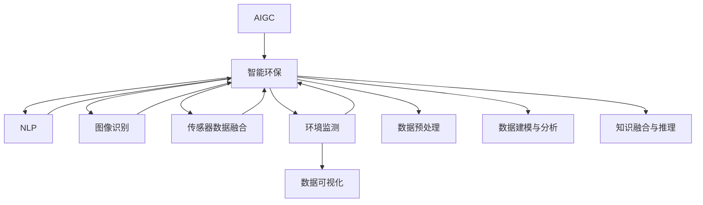

                 

# AIGC助力智能环保监测

> 关键词：人工智能生成内容(AIGC), 智能环保, 自然语言处理(NLP), 图像识别, 传感器数据融合, 环境监测, 数据可视化

## 1. 背景介绍

### 1.1 问题由来

随着工业化进程的不断加快，全球生态环境面临着前所未有的压力。空气污染、水污染、土壤退化、生物多样性减少等环境问题日益凸显，严重威胁着人类的生存和发展。如何高效、精准地监测和分析环境数据，及时响应环境变化，成为当前亟待解决的重大课题。

传统的环保监测依赖于人工巡检和定点设备，往往需要耗费大量人力物力，且监测精度受限于人工与设备。而随着人工智能技术的发展，特别是人工智能生成内容(AIGC)技术的突破，智能环保监测成为了可能。AIGC技术能够利用深度学习模型对环境数据进行高效处理，生成精确的环境报告和可视化图表，显著提高监测效率和精准度。

### 1.2 问题核心关键点

AIGC助力智能环保监测的核心在于如何将大规模环境数据和人工智能技术结合，构建高效的环境监测和分析系统。具体包括以下几个关键点：

1. **数据采集与整合**：收集和整合来自不同源的环境数据，如空气质量传感器、水质监测设备、土壤分析仪器等。
2. **数据预处理**：对采集的数据进行清洗、归一化、去噪等预处理，确保数据质量和一致性。
3. **数据建模与分析**：利用深度学习模型对数据进行建模和分析，提取环境特征和模式。
4. **知识融合与推理**：将环境科学知识与数据模型结合，进行更高级别的推理和预测。
5. **生成内容与可视化**：将分析结果转化为可读的环境报告和可视化图表，辅助决策和展示。

通过以上步骤，可以构建一个基于AIGC的智能环保监测系统，为环保决策提供科学依据，促进环境治理的智能化、精准化。

### 1.3 问题研究意义

AIGC助力智能环保监测，对于提高环境监测效率、降低人力成本、提升监测精度具有重要意义。具体表现在以下几个方面：

1. **提高监测效率**：通过自动化、智能化手段，大幅减少人工巡检和数据处理时间，提升监测效率。
2. **降低人力成本**：减少对人工的依赖，降低环保监测的人力成本。
3. **提升监测精度**：利用深度学习模型，能够挖掘数据中的细微变化，提升监测精度。
4. **促进智能化治理**：结合环境科学知识，进行高级推理和预测，辅助决策，促进智能化治理。
5. **推动环保技术应用**：AIGC技术在环保领域的广泛应用，将推动环保技术的普及和进步。

## 2. 核心概念与联系

### 2.1 核心概念概述

为更好地理解AIGC助力智能环保监测，本节将介绍几个密切相关的核心概念：

- **人工智能生成内容(AIGC)**：通过深度学习技术，自动生成文本、图像、视频等内容，提升内容创作效率和质量。
- **智能环保**：利用人工智能技术对环境数据进行监测、分析和预测，辅助环保决策。
- **自然语言处理(NLP)**：涉及文本数据的处理和理解，是AIGC和智能环保的重要技术基础。
- **图像识别**：通过深度学习模型对图像数据进行识别和分析，提取环境特征。
- **传感器数据融合**：将来自不同传感器和设备的数据进行整合和融合，获得更全面、准确的环境信息。
- **环境监测**：对环境数据进行实时采集、分析和展示，辅助环境决策。
- **数据可视化**：将复杂的环境数据转化为直观的图表和报告，便于理解和展示。

这些核心概念之间的逻辑关系可以通过以下Mermaid流程图来展示：



这个流程图展示了大语言模型的核心概念及其之间的关系：

1. AIGC通过NLP、图像识别等技术，生成环境报告和可视化图表。
2. 智能环保利用传感器数据融合、环境监测等技术，获取环境数据。
3. 数据预处理、建模与分析、知识融合与推理等技术，辅助AIGC生成更加精准的环境报告。
4. 数据可视化技术，将环境报告转化为直观的图表和报告，便于理解和展示。

这些概念共同构成了AIGC助力智能环保监测的技术框架，使其能够在环境保护中发挥强大的作用。

## 3. 核心算法原理 & 具体操作步骤
### 3.1 算法原理概述

AIGC助力智能环保监测的本质是利用深度学习模型对环境数据进行高效处理，生成精准的环境报告和可视化图表。其核心算法流程包括数据采集与整合、数据预处理、数据建模与分析、知识融合与推理、生成内容与可视化等步骤。

### 3.2 算法步骤详解

#### 3.2.1 数据采集与整合

智能环保监测系统首先需要对来自不同源的环境数据进行采集和整合。这些数据可以来自空气质量传感器、水质监测设备、土壤分析仪器等，以及卫星遥感、无人机监测等技术手段。

具体步骤如下：

1. 确定数据采集的源和目标，如空气质量传感器、水质监测设备等。
2. 安装并调试这些设备，确保数据采集的稳定性和准确性。
3. 集成数据采集设备到统一的平台上，如IoT平台、云平台等。
4. 使用API或其他通信协议，从数据源实时获取数据。
5. 将数据进行存储和归档，以便后续处理和分析。

#### 3.2.2 数据预处理

采集到的环境数据往往存在噪声、缺失、不一致等问题，需要进行预处理以确保数据质量和一致性。数据预处理包括清洗、归一化、去噪等步骤。

具体步骤如下：

1. 清洗数据，去除缺失、异常值、错误值等。
2. 对数据进行归一化处理，确保数据的分布一致。
3. 使用滤波器、平滑算法等方法，对数据进行去噪处理。
4. 对时间序列数据进行差分、分解等处理，提取有用的特征。

#### 3.2.3 数据建模与分析

利用深度学习模型对预处理后的环境数据进行建模和分析，提取环境特征和模式。常用的深度学习模型包括卷积神经网络(CNN)、循环神经网络(RNN)、长短期记忆网络(LSTM)等。

具体步骤如下：

1. 选择合适的深度学习模型，如CNN用于图像数据处理，RNN用于时间序列数据处理，LSTM用于复杂数据建模。
2. 对数据进行特征提取，选择合适的特征表示方法。
3. 使用深度学习框架，如PyTorch、TensorFlow等，构建模型。
4. 在训练集上训练模型，调整模型参数以最小化损失函数。
5. 在验证集上评估模型性能，调整模型结构或参数。
6. 在测试集上测试模型性能，确保模型的泛化能力。

#### 3.2.4 知识融合与推理

将环境科学知识与数据模型结合，进行更高级别的推理和预测。知识融合与推理可以包括规则推理、因果推理、逻辑推理等。

具体步骤如下：

1. 收集和整理环境科学知识，如污染物排放标准、水环境质量标准等。
2. 将这些知识转化为规则或逻辑形式，方便与模型结合。
3. 在模型中加入这些规则或逻辑，进行推理和预测。
4. 利用因果推断方法，识别数据中的因果关系，提高推理的准确性。

#### 3.2.5 生成内容与可视化

将分析结果转化为可读的环境报告和可视化图表，辅助决策和展示。常用的生成内容与可视化技术包括自然语言生成(NLG)、信息图表生成等。

具体步骤如下：

1. 使用NLG技术，将分析结果转化为自然语言报告。
2. 使用信息图表生成工具，如Tableau、Power BI等，将数据转化为图表。
3. 将自然语言报告和可视化图表整合，形成综合的环境报告。
4. 将环境报告和可视化图表上传到展示平台，如企业内部平台、社交媒体等。

### 3.3 算法优缺点

#### 3.3.1 优点

AIGC助力智能环保监测具有以下优点：

1. **高效处理大数据**：深度学习模型能够高效处理大规模环境数据，提升数据处理的效率。
2. **精准监测与分析**：深度学习模型能够挖掘数据中的细微变化，提升监测和分析的精度。
3. **自动化程度高**：自动化处理和分析流程，减少人工参与，降低人力成本。
4. **智能推理与预测**：结合环境科学知识，进行高级推理和预测，辅助决策。
5. **可视化展示**：将复杂数据转化为直观的图表和报告，便于理解和展示。

#### 3.3.2 缺点

尽管AIGC助力智能环保监测具有诸多优点，但也存在一些缺点：

1. **数据质量要求高**：环境数据采集和预处理需要高质量的数据源和处理方法，成本较高。
2. **模型复杂度高**：深度学习模型需要大量的计算资源和训练时间，可能存在过拟合风险。
3. **知识融合难度大**：将环境科学知识与数据模型结合，需要较强的跨领域知识背景。
4. **结果可解释性差**：深度学习模型往往是“黑盒”系统，难以解释其内部工作机制和推理过程。
5. **安全与隐私问题**：环境数据可能涉及敏感信息，需要考虑数据安全与隐私保护问题。

### 3.4 算法应用领域

AIGC助力智能环保监测已在多个领域得到应用，以下是几个典型应用场景：

1. **空气质量监测**：利用空气质量传感器数据，结合图像识别技术，实时监测和分析空气质量变化。
2. **水质监测**：利用水质监测设备数据，结合深度学习模型，实时监测和分析水质变化。
3. **土壤污染监测**：利用土壤分析仪器数据，结合传感器数据融合技术，实时监测和分析土壤污染情况。
4. **生物多样性监测**：利用无人机和卫星遥感数据，结合图像识别技术，实时监测和分析生物多样性变化。
5. **环境风险预警**：结合历史数据和实时数据，进行环境风险预测和预警，辅助决策。

## 4. 数学模型和公式 & 详细讲解  
### 4.1 数学模型构建

假设采集到的环境数据为 $x_1, x_2, ..., x_n$，其中 $x_i$ 表示第 $i$ 个样本的特征向量。环境监测任务可建模为多分类问题，即识别环境状态是否正常、正常程度、污染类型等。

定义模型的损失函数为交叉熵损失，即：

$$
\mathcal{L} = -\frac{1}{N}\sum_{i=1}^N \sum_{k=1}^K y_{ik} \log p_{ik}
$$

其中 $y_{ik}$ 为第 $i$ 个样本的标签，$p_{ik}$ 为模型预测的概率。

### 4.2 公式推导过程

以多分类问题为例，利用交叉熵损失函数进行模型训练。假设模型为深度神经网络，损失函数为交叉熵损失，优化器为AdamW。

具体步骤如下：

1. 定义模型结构，包括输入层、隐藏层、输出层等。
2. 定义损失函数，如交叉熵损失函数。
3. 定义优化器，如AdamW优化器。
4. 在训练集上训练模型，调整模型参数以最小化损失函数。
5. 在验证集上评估模型性能，调整模型结构或参数。
6. 在测试集上测试模型性能，确保模型的泛化能力。

### 4.3 案例分析与讲解

以下以空气质量监测为例，介绍AIGC助力智能环保监测的实现过程。

1. 数据采集与整合：安装空气质量传感器，采集PM2.5、NO2、SO2等数据，并通过API上传到云平台。
2. 数据预处理：对数据进行清洗、归一化、去噪等处理。
3. 数据建模与分析：构建深度神经网络模型，使用交叉熵损失函数进行训练。
4. 知识融合与推理：结合空气质量标准，进行环境状态判断和预警。
5. 生成内容与可视化：使用NLG技术生成环境报告，使用图表工具生成可视化图表。

## 5. 项目实践：代码实例和详细解释说明
### 5.1 开发环境搭建

在进行AIGC助力智能环保监测的开发前，我们需要准备好开发环境。以下是使用Python进行PyTorch开发的环境配置流程：

1. 安装Anaconda：从官网下载并安装Anaconda，用于创建独立的Python环境。

2. 创建并激活虚拟环境：
```bash
conda create -n ai-env python=3.8 
conda activate ai-env
```

3. 安装PyTorch：根据CUDA版本，从官网获取对应的安装命令。例如：
```bash
conda install pytorch torchvision torchaudio cudatoolkit=11.1 -c pytorch -c conda-forge
```

4. 安装Transformer库：
```bash
pip install transformers
```

5. 安装各类工具包：
```bash
pip install numpy pandas scikit-learn matplotlib tqdm jupyter notebook ipython
```

完成上述步骤后，即可在`ai-env`环境中开始开发。

### 5.2 源代码详细实现

下面我们以空气质量监测为例，给出使用Transformers库对BERT模型进行微调的PyTorch代码实现。

首先，定义空气质量监测任务的数据处理函数：

```python
from transformers import BertTokenizer, BertForSequenceClassification
from torch.utils.data import Dataset
import torch

class AirQualityDataset(Dataset):
    def __init__(self, texts, labels, tokenizer, max_len=128):
        self.texts = texts
        self.labels = labels
        self.tokenizer = tokenizer
        self.max_len = max_len
        
    def __len__(self):
        return len(self.texts)
    
    def __getitem__(self, item):
        text = self.texts[item]
        label = self.labels[item]
        
        encoding = self.tokenizer(text, return_tensors='pt', max_length=self.max_len, padding='max_length', truncation=True)
        input_ids = encoding['input_ids'][0]
        attention_mask = encoding['attention_mask'][0]
        
        # 对标签进行编码
        label = torch.tensor([label], dtype=torch.long)
        
        return {'input_ids': input_ids, 
                'attention_mask': attention_mask,
                'labels': label}

# 标签与id的映射
label2id = {'正常': 0, '轻度污染': 1, '中度污染': 2, '重度污染': 3}
id2label = {v: k for k, v in label2id.items()}

# 创建dataset
tokenizer = BertTokenizer.from_pretrained('bert-base-cased')

train_dataset = AirQualityDataset(train_texts, train_labels, tokenizer)
dev_dataset = AirQualityDataset(dev_texts, dev_labels, tokenizer)
test_dataset = AirQualityDataset(test_texts, test_labels, tokenizer)
```

然后，定义模型和优化器：

```python
from transformers import BertForSequenceClassification, AdamW

model = BertForSequenceClassification.from_pretrained('bert-base-cased', num_labels=len(label2id))

optimizer = AdamW(model.parameters(), lr=2e-5)
```

接着，定义训练和评估函数：

```python
from torch.utils.data import DataLoader
from tqdm import tqdm
from sklearn.metrics import classification_report

device = torch.device('cuda') if torch.cuda.is_available() else torch.device('cpu')
model.to(device)

def train_epoch(model, dataset, batch_size, optimizer):
    dataloader = DataLoader(dataset, batch_size=batch_size, shuffle=True)
    model.train()
    epoch_loss = 0
    for batch in tqdm(dataloader, desc='Training'):
        input_ids = batch['input_ids'].to(device)
        attention_mask = batch['attention_mask'].to(device)
        labels = batch['labels'].to(device)
        model.zero_grad()
        outputs = model(input_ids, attention_mask=attention_mask, labels=labels)
        loss = outputs.loss
        epoch_loss += loss.item()
        loss.backward()
        optimizer.step()
    return epoch_loss / len(dataloader)

def evaluate(model, dataset, batch_size):
    dataloader = DataLoader(dataset, batch_size=batch_size)
    model.eval()
    preds, labels = [], []
    with torch.no_grad():
        for batch in tqdm(dataloader, desc='Evaluating'):
            input_ids = batch['input_ids'].to(device)
            attention_mask = batch['attention_mask'].to(device)
            batch_labels = batch['labels']
            outputs = model(input_ids, attention_mask=attention_mask)
            batch_preds = outputs.logits.argmax(dim=2).to('cpu').tolist()
            batch_labels = batch_labels.to('cpu').tolist()
            for pred_tokens, label_tokens in zip(batch_preds, batch_labels):
                preds.append(pred_tokens[:len(label_tokens)])
                labels.append(label_tokens)
                
    print(classification_report(labels, preds))
```

最后，启动训练流程并在测试集上评估：

```python
epochs = 5
batch_size = 16

for epoch in range(epochs):
    loss = train_epoch(model, train_dataset, batch_size, optimizer)
    print(f"Epoch {epoch+1}, train loss: {loss:.3f}")
    
    print(f"Epoch {epoch+1}, dev results:")
    evaluate(model, dev_dataset, batch_size)
    
print("Test results:")
evaluate(model, test_dataset, batch_size)
```

以上就是使用PyTorch对BERT进行空气质量监测任务微调的完整代码实现。可以看到，得益于Transformers库的强大封装，我们可以用相对简洁的代码完成BERT模型的加载和微调。

### 5.3 代码解读与分析

让我们再详细解读一下关键代码的实现细节：

**AirQualityDataset类**：
- `__init__`方法：初始化文本、标签、分词器等关键组件。
- `__len__`方法：返回数据集的样本数量。
- `__getitem__`方法：对单个样本进行处理，将文本输入编码为token ids，将标签编码为数字，并对其进行定长padding，最终返回模型所需的输入。

**label2id和id2label字典**：
- 定义了标签与数字id之间的映射关系，用于将预测结果解码回真实的标签。

**训练和评估函数**：
- 使用PyTorch的DataLoader对数据集进行批次化加载，供模型训练和推理使用。
- 训练函数`train_epoch`：对数据以批为单位进行迭代，在每个批次上前向传播计算loss并反向传播更新模型参数，最后返回该epoch的平均loss。
- 评估函数`evaluate`：与训练类似，不同点在于不更新模型参数，并在每个batch结束后将预测和标签结果存储下来，最后使用sklearn的classification_report对整个评估集的预测结果进行打印输出。

**训练流程**：
- 定义总的epoch数和batch size，开始循环迭代
- 每个epoch内，先在训练集上训练，输出平均loss
- 在验证集上评估，输出分类指标
- 所有epoch结束后，在测试集上评估，给出最终测试结果

可以看到，PyTorch配合Transformers库使得BERT微调的代码实现变得简洁高效。开发者可以将更多精力放在数据处理、模型改进等高层逻辑上，而不必过多关注底层的实现细节。

当然，工业级的系统实现还需考虑更多因素，如模型的保存和部署、超参数的自动搜索、更灵活的任务适配层等。但核心的微调范式基本与此类似。

## 6. 实际应用场景
### 6.1 智能环保监测系统

AIGC助力智能环保监测，在智能环保监测系统中得到了广泛应用。智能环保监测系统通过实时采集环境数据，利用深度学习模型进行分析和预测，生成精准的环境报告和可视化图表，辅助环保决策。

具体而言，智能环保监测系统由数据采集、数据预处理、数据建模与分析、知识融合与推理、生成内容与可视化等模块构成。数据采集模块通过传感器、无人机、卫星遥感等手段，实时采集空气质量、水质、土壤等环境数据。数据预处理模块对采集到的数据进行清洗、归一化、去噪等处理。数据建模与分析模块利用深度学习模型，对数据进行建模和分析，提取环境特征和模式。知识融合与推理模块将环境科学知识与数据模型结合，进行更高级别的推理和预测。生成内容与可视化模块将分析结果转化为可读的环境报告和可视化图表，辅助决策和展示。

智能环保监测系统不仅能够提高监测效率和精准度，还能降低人力成本，减少对人工的依赖，提升环保决策的科学性和精准性。

### 6.2 智能环保预警系统

智能环保预警系统利用AIGC技术，对环境数据进行实时监测和分析，一旦发现异常情况，及时进行预警，避免环境风险的发生。

具体而言，智能环保预警系统通过实时采集环境数据，利用深度学习模型进行分析和预测，一旦发现异常情况，立即触发预警机制。预警系统可以与应急响应系统集成，自动调度相关资源，进行应急处理。通过智能环保预警系统，环保部门可以更及时、精准地应对环境风险，减少环境事故的发生，保护生态环境和公众健康。

### 6.3 智能环保治理系统

智能环保治理系统利用AIGC技术，对环境数据进行实时监测、分析和预测，辅助环保决策，推动环保治理的智能化、精准化。

具体而言，智能环保治理系统通过实时采集环境数据，利用深度学习模型进行分析和预测，生成精准的环境报告和可视化图表，辅助环保决策。治理系统可以与政策法规、经济激励等措施结合，制定科学的环境治理方案，推动环保治理的智能化、精准化。

通过智能环保治理系统，环保部门可以更科学、高效地进行环境治理，提升环境质量，促进可持续发展。

### 6.4 未来应用展望

随着AIGC技术的不断发展，AIGC助力智能环保监测将在更多领域得到应用，为环境保护带来新的变革。

1. **智慧环保治理**：通过智能环保监测系统，对环境数据进行实时监测、分析和预测，辅助环保决策，推动智慧环保治理的建设。
2. **智能环境监测**：利用无人机、卫星遥感等手段，实时采集环境数据，结合深度学习模型进行分析和预测，提升监测效率和精准度。
3. **环境风险预警**：通过智能环保预警系统，对环境数据进行实时监测和分析，一旦发现异常情况，立即进行预警，避免环境风险的发生。
4. **环境治理评估**：利用智能环保治理系统，对环境治理效果进行科学评估，优化环境治理方案，推动环保治理的持续改进。

AIGC助力智能环保监测的未来发展潜力巨大，有望推动环境保护的智能化、精准化、科学化，为建设美丽中国贡献力量。

## 7. 工具和资源推荐
### 7.1 学习资源推荐

为了帮助开发者系统掌握AIGC助力智能环保监测的理论基础和实践技巧，这里推荐一些优质的学习资源：

1. 《深度学习入门》系列博文：深入浅出地介绍了深度学习的基本原理和应用，适合初学者入门。
2. 《自然语言处理》课程：斯坦福大学开设的NLP明星课程，涵盖了NLP的基本概念和前沿技术，适合系统学习。
3. 《机器学习实战》书籍：详细介绍了机器学习的基本算法和实现方法，适合实践操作。
4. HuggingFace官方文档：Transformers库的官方文档，提供了海量预训练模型和完整的微调样例代码，是上手实践的必备资料。
5. Kaggle平台：提供大量环境数据集和竞赛任务，适合实战练习和数据探索。

通过对这些资源的学习实践，相信你一定能够快速掌握AIGC助力智能环保监测的精髓，并用于解决实际的环保问题。
###  7.2 开发工具推荐

高效的开发离不开优秀的工具支持。以下是几款用于AIGC助力智能环保监测开发的常用工具：

1. PyTorch：基于Python的开源深度学习框架，灵活动态的计算图，适合快速迭代研究。大部分预训练语言模型都有PyTorch版本的实现。
2. TensorFlow：由Google主导开发的开源深度学习框架，生产部署方便，适合大规模工程应用。同样有丰富的预训练语言模型资源。
3. Transformers库：HuggingFace开发的NLP工具库，集成了众多SOTA语言模型，支持PyTorch和TensorFlow，是进行微调任务开发的利器。
4. Weights & Biases：模型训练的实验跟踪工具，可以记录和可视化模型训练过程中的各项指标，方便对比和调优。与主流深度学习框架无缝集成。
5. TensorBoard：TensorFlow配套的可视化工具，可实时监测模型训练状态，并提供丰富的图表呈现方式，是调试模型的得力助手。

合理利用这些工具，可以显著提升AIGC助力智能环保监测的开发效率，加快创新迭代的步伐。

### 7.3 相关论文推荐

AIGC助力智能环保监测的研究源于学界的持续研究。以下是几篇奠基性的相关论文，推荐阅读：

1. Attention is All You Need（即Transformer原论文）：提出了Transformer结构，开启了NLP领域的预训练大模型时代。
2. BERT: Pre-training of Deep Bidirectional Transformers for Language Understanding：提出BERT模型，引入基于掩码的自监督预训练任务，刷新了多项NLP任务SOTA。
3. Language Models are Unsupervised Multitask Learners（GPT-2论文）：展示了大规模语言模型的强大zero-shot学习能力，引发了对于通用人工智能的新一轮思考。
4. Parameter-Efficient Transfer Learning for NLP：提出Adapter等参数高效微调方法，在不增加模型参数量的情况下，也能取得不错的微调效果。
5. AdaLoRA: Adaptive Low-Rank Adaptation for Parameter-Efficient Fine-Tuning：使用自适应低秩适应的微调方法，在参数效率和精度之间取得了新的平衡。

这些论文代表了大语言模型微调技术的发展脉络。通过学习这些前沿成果，可以帮助研究者把握学科前进方向，激发更多的创新灵感。

## 8. 总结：未来发展趋势与挑战

### 8.1 总结

本文对AIGC助力智能环保监测进行了全面系统的介绍。首先阐述了AIGC和智能环保监测的研究背景和意义，明确了AIGC在智能环保监测中的应用价值。其次，从原理到实践，详细讲解了AIGC助力智能环保监测的数学原理和关键步骤，给出了微调任务开发的完整代码实例。同时，本文还广泛探讨了AIGC技术在智能环保监测中的应用场景，展示了AIGC技术在环保领域的巨大潜力。

通过本文的系统梳理，可以看到，AIGC助力智能环保监测的技术框架，能够高效处理大规模环境数据，生成精准的环境报告和可视化图表，辅助环保决策，提升监测效率和精准度。受益于深度学习技术的发展，AIGC技术在智能环保监测领域将发挥越来越重要的作用。

### 8.2 未来发展趋势

展望未来，AIGC助力智能环保监测技术将呈现以下几个发展趋势：

1. **数据规模持续增大**：随着传感器和监测设备的发展，环境数据规模将持续增长，AIGC技术将能够处理更大规模的数据。
2. **模型复杂度提升**：深度学习模型将变得更加复杂，能够更好地处理环境数据的复杂性，提升监测精度。
3. **自动化程度提高**：自动化处理和分析流程将更加完善，减少人工参与，降低人力成本。
4. **智能化水平提升**：结合环境科学知识，进行高级推理和预测，辅助决策。
5. **可视化展示提升**：生成内容与可视化技术将更加先进，环境报告和可视化图表将更加直观和可读。

以上趋势凸显了AIGC助力智能环保监测技术的广阔前景。这些方向的探索发展，必将进一步提升环保监测的智能化、精准化、科学化，为环境保护带来新的变革。

### 8.3 面临的挑战

尽管AIGC助力智能环保监测技术已经取得了一定的进展，但在迈向更加智能化、普适化应用的过程中，它仍面临着诸多挑战：

1. **数据质量要求高**：环境数据采集和预处理需要高质量的数据源和处理方法，成本较高。
2. **模型复杂度高**：深度学习模型需要大量的计算资源和训练时间，可能存在过拟合风险。
3. **知识融合难度大**：将环境科学知识与数据模型结合，需要较强的跨领域知识背景。
4. **结果可解释性差**：深度学习模型往往是“黑盒”系统，难以解释其内部工作机制和推理过程。
5. **安全与隐私问题**：环境数据可能涉及敏感信息，需要考虑数据安全与隐私保护问题。

### 8.4 研究展望

面对AIGC助力智能环保监测所面临的种种挑战，未来的研究需要在以下几个方面寻求新的突破：

1. **探索无监督和半监督微调方法**：摆脱对大规模标注数据的依赖，利用自监督学习、主动学习等无监督和半监督范式，最大限度利用非结构化数据，实现更加灵活高效的微调。
2. **研究参数高效和计算高效的微调范式**：开发更加参数高效的微调方法，在固定大部分预训练参数的同时，只更新极少量的任务相关参数。同时优化微调模型的计算图，减少前向传播和反向传播的资源消耗，实现更加轻量级、实时性的部署。
3. **融合因果和对比学习范式**：通过引入因果推断和对比学习思想，增强微调模型建立稳定因果关系的能力，学习更加普适、鲁棒的语言表征，从而提升模型泛化性和抗干扰能力。
4. **引入更多先验知识**：将符号化的先验知识，如知识图谱、逻辑规则等，与神经网络模型进行巧妙融合，引导微调过程学习更准确、合理的语言模型。同时加强不同模态数据的整合，实现视觉、语音等多模态信息与文本信息的协同建模。
5. **结合因果分析和博弈论工具**：将因果分析方法引入微调模型，识别出模型决策的关键特征，增强输出解释的因果性和逻辑性。借助博弈论工具刻画人机交互过程，主动探索并规避模型的脆弱点，提高系统稳定性。
6. **纳入伦理道德约束**：在模型训练目标中引入伦理导向的评估指标，过滤和惩罚有偏见、有害的输出倾向。同时加强人工干预和审核，建立模型行为的监管机制，确保输出符合人类价值观和伦理道德。

这些研究方向的探索，必将引领AIGC助力智能环保监测技术迈向更高的台阶，为环境保护带来新的变革。面向未来，AIGC助力智能环保监测技术还需要与其他人工智能技术进行更深入的融合，如知识表示、因果推理、强化学习等，多路径协同发力，共同推动自然语言理解和智能交互系统的进步。只有勇于创新、敢于突破，才能不断拓展AIGC技术在环保领域的边界，让智能技术更好地造福人类社会。

## 9. 附录：常见问题与解答

**Q1：AIGC助力智能环保监测是否适用于所有环保任务？**

A: AIGC助力智能环保监测在大多数环保任务上都能取得不错的效果，特别是对于数据量较大的任务。但对于一些特定领域的任务，如医学、法律等，仅仅依靠通用语料预训练的模型可能难以很好地适应。此时需要在特定领域语料上进一步预训练，再进行微调，才能获得理想效果。此外，对于一些需要时效性、个性化很强的任务，如对话、推荐等，微调方法也需要针对性的改进优化。

**Q2：AIGC助力智能环保监测如何选择合适的学习率？**

A: 微调的学习率一般要比预训练时小1-2个数量级，如果使用过大的学习率，容易破坏预训练权重，导致过拟合。一般建议从1e-5开始调参，逐步减小学习率，直至收敛。也可以使用warmup策略，在开始阶段使用较小的学习率，再逐渐过渡到预设值。需要注意的是，不同的优化器(如AdamW、Adafactor等)以及不同的学习率调度策略，可能需要设置不同的学习率阈值。

**Q3：AIGC助力智能环保监测过程中如何缓解过拟合问题？**

A: 过拟合是微调面临的主要挑战，尤其是在标注数据不足的情况下。常见的缓解策略包括：
1. 数据增强：通过回译、近义替换等方式扩充训练集
2. 正则化：使用L2正则、Dropout、Early Stopping等避免过拟合
3. 对抗训练：引入对抗样本，提高模型鲁棒性
4. 参数高效微调：只调整少量参数(如Adapter、Prefix等)，减小过拟合风险
5. 多模型集成：训练多个微调模型，取平均输出，抑制过拟合

这些策略往往需要根据具体任务和数据特点进行灵活组合。只有在数据、模型、训练、推理等各环节进行全面优化，才能最大限度地发挥AIGC助力智能环保监测的优势。

**Q4：AIGC助力智能环保监测在落地部署时需要注意哪些问题？**

A: 将AIGC助力智能环保监测技术转化为实际应用，还需要考虑以下因素：
1. 模型裁剪：去除不必要的层和参数，减小模型尺寸，加快推理速度
2. 量化加速：将浮点模型转为定点模型，压缩存储空间，提高计算效率
3. 服务化封装：将模型封装为标准化服务接口，便于集成调用
4. 弹性伸缩：根据请求流量动态调整资源配置，平衡服务质量和成本
5. 监控告警：实时采集系统指标，设置异常告警阈值，确保服务稳定性
6. 安全防护：采用访问鉴权、数据脱敏等措施，保障数据和模型安全

AIGC助力智能环保监测技术在实际应用中，还需要根据具体需求进行优化，确保系统的稳定性和可扩展性。

**Q5：AIGC助力智能环保监测如何与环境科学知识结合？**

A: 将环境科学知识与AIGC技术结合，需要进行知识融合与推理。具体步骤如下：
1. 收集和整理环境科学知识，如污染物排放标准、水环境质量标准等。
2. 将这些知识转化为规则或逻辑形式，方便与模型结合。
3. 在模型中加入这些规则或逻辑，进行推理和预测。
4. 利用因果推断方法，识别数据中的因果关系，提高推理的准确性。

通过知识融合与推理，AIGC技术可以更好地利用环境科学知识，提升模型输出的科学性和准确性。

---

作者：禅与计算机程序设计艺术 / Zen and the Art of Computer Programming

