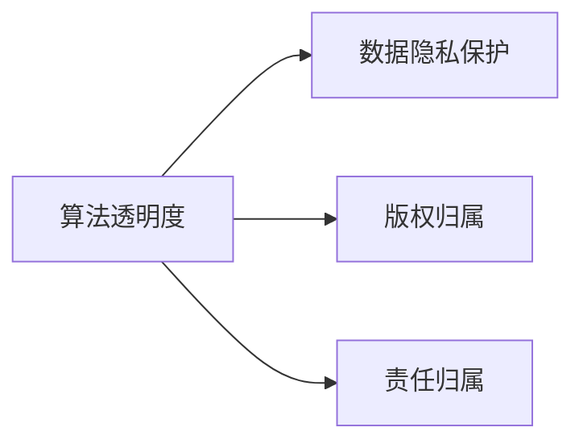

                 

# AIGC时代的法律与伦理挑战

> 关键词：人工智能生成内容(AIGC),算法透明度,数据隐私,版权,责任归属

## 1. 背景介绍

随着人工智能生成内容(AI Generated Content, AIGC)技术的飞速发展，其在游戏、教育、设计、内容创作等领域的应用日益广泛，逐渐成为数字经济新的增长点。AIGC的典型应用包括但不限于：

- 自动文生文、视频生成、图像生成、音乐创作等创意生成任务；
- 虚拟主播、虚拟偶像、虚拟助手等虚拟角色；
- 教育培训、专业咨询、医疗辅助等交互式应用；
- 数字营销、广告创意、内容管理等商业应用。

AIGC的出现极大地提升了内容生成和交互的效率与质量，但同时也引发了一系列法律和伦理问题。这些问题涉及算法透明度、数据隐私保护、版权归属、责任归属等多个方面，亟需从法律和伦理角度加以探讨和规范。

### 1.1 算法透明度
算法的透明度，即算法决策的可解释性和可理解性，是AIGC应用中的核心问题。大多数AIGC模型，如深度生成对抗网络(GAN)、变分自编码器(VAE)等，本质上是一类"黑盒"模型。其决策过程高度依赖于训练数据的统计特性，难以通过简单的规则或公式进行描述。

如何确保算法的透明度，使其决策过程可追溯、可复现，成为法律和伦理挑战的重要一环。不透明的算法决策，可能导致以下问题：

1. **决策不公**：算法决策过程中的偏见和歧视难以识别和纠正，可能导致对特定群体的歧视性输出。

2. **误解与误导**：用户难以理解算法的决策依据，可能对模型输出的信息产生误解和误导。

3. **责任认定**：在出现错误或误导性输出时，难以明确算法和设计者的责任，进而引发法律纠纷。

### 1.2 数据隐私保护
AIGC模型的训练和应用，高度依赖于大量高质量的数据资源。这些数据往往包含个人隐私信息，如社交网络数据、生物特征数据、位置信息等。如何保护这些敏感数据的隐私，是AIGC应用中的重要课题。

主要挑战包括：

1. **数据收集**：如何确保数据收集过程的合规性和透明度，避免侵犯用户隐私权。

2. **数据存储**：如何在数据存储和处理过程中，确保数据的安全性和匿名性，避免数据泄露或被滥用。

3. **数据利用**：如何规范数据的使用，避免过度收集和不当利用，特别是在涉及商业应用或公共安全的情况下。

### 1.3 版权归属
AIGC模型的创作和应用，往往涉及对已有内容的生成和再利用，这在一定程度上触及了版权法领域。如何界定AIGC作品和原作的版权归属，是AIGC应用中的关键问题。

主要挑战包括：

1. **生成与原作**：AIGC模型生成的内容与原作的版权归属如何界定，特别是当模型改写或创作了原创内容时。

2. **模型训练数据**：AIGC模型在训练过程中使用的数据是否受到版权保护，以及如何处理版权归属问题。

3. **用户生成内容**：用户使用AIGC模型生成内容，该内容的版权归属应归谁所有，以及如何保障用户权益。

### 1.4 责任归属
AIGC模型的决策过程和输出结果，往往高度依赖于训练数据的质量和模型的设计，难以简单归责于单一实体。如何界定模型及其开发者的责任，是AIGC应用中的重要法律挑战。

主要挑战包括：

1. **模型错误**：模型输出错误或误导性信息时，如何界定开发者的责任。

2. **数据偏见**：模型因训练数据中的偏见或歧视，导致输出具有歧视性，开发者应承担何种责任。

3. **用户误用**：用户恶意或不当使用AIGC生成内容，开发者是否需要承担相应责任。

## 2. 核心概念与联系

### 2.1 核心概念概述

为更好地理解AIGC技术在法律与伦理层面的挑战，本节将介绍几个核心概念：

- **算法透明度**：指算法决策的可解释性和可理解性，包括模型设计、训练数据、算法逻辑等。
- **数据隐私保护**：指在数据收集、存储、处理、传输等各个环节中，确保数据的安全性、匿名性和合法性。
- **版权归属**：指对生成内容与原作版权的归属进行明确，涉及生成内容的原创性、改写性等。
- **责任归属**：指在出现模型错误或用户不当使用情况下，界定开发者和用户的责任。

这些概念之间的关系可以通过以下Mermaid流程图来展示：



这个流程图展示了AIGC应用中的关键概念以及它们之间的联系：

1. **算法透明度**是数据隐私保护的前提和基础，透明度高的算法更容易被接受和监管。
2. **数据隐私保护**是算法透明度的保障，只有保护好数据隐私，才能确保算法的透明度。
3. **版权归属**与算法透明度密切相关，明确版权归属有助于保护算法的透明度和公平性。
4. **责任归属**则是对算法透明度的保障和数据隐私保护的延伸，确保开发者和用户的合法权益。

## 3. 核心算法原理 & 具体操作步骤

### 3.1 算法原理概述

AIGC模型的算法原理，主要围绕着以下几个关键点：

- **生成模型**：如GAN、VAE等，通过学习数据分布生成新的内容。
- **对抗样本**：生成对抗样本，增强模型的鲁棒性和泛化能力。
- **条件生成**：引入条件变量，使模型生成符合特定要求的内容。
- **自回归模型**：如Transformer等，利用自回归机制生成文本、图像等。

这些模型的核心思想是通过学习大量数据分布，生成新的内容或模仿特定内容。但在实际应用中，这些模型的决策过程高度复杂，难以通过简单的规则进行解释和控制。

### 3.2 算法步骤详解

AIGC模型的具体操作步骤，一般包括以下几个关键步骤：

**Step 1: 数据收集与预处理**
- 收集各类数据源，包括公开数据集、用户生成数据等。
- 对数据进行清洗、去重、标注等预处理，确保数据质量。

**Step 2: 模型训练与优化**
- 选择合适的生成模型，如GAN、VAE、Transformer等。
- 在大量数据上进行训练，调整模型参数，优化模型性能。
- 使用对抗样本等技术，增强模型的鲁棒性和泛化能力。

**Step 3: 生成与输出**
- 根据需求，输入条件变量，使用训练好的模型生成内容。
- 对生成内容进行后处理，如格式转换、修复错误等。
- 输出最终生成的内容，用于各类应用场景。

**Step 4: 评估与优化**
- 在测试集上评估生成内容的质量和多样性。
- 根据评估结果，调整模型参数，进行迭代优化。
- 定期更新模型，保持其生成内容的先进性和可靠性。

### 3.3 算法优缺点

AIGC模型的算法优缺点，主要体现在以下几个方面：

**优点：**

1. **高效性**：生成内容的速度和效率远高于人类创作，特别适用于大规模内容创作和交互式应用。
2. **多样性**：生成的内容具有高度多样性，可以满足不同用户的个性化需求。
3. **可扩展性**：模型规模可扩展，通过增加数据量和训练时间，可以进一步提升生成内容的质量和多样性。

**缺点：**

1. **透明度低**：模型决策过程复杂，难以解释和理解。
2. **偏见与歧视**：模型在生成过程中可能引入训练数据的偏见和歧视。
3. **版权问题**：生成内容可能与原作存在版权冲突，界定版权归属复杂。
4. **责任不明**：模型和用户行为难以明确界定责任，可能引发法律纠纷。

### 3.4 算法应用领域

AIGC模型的算法应用领域广泛，包括但不限于：

- **内容创作**：自动文生文、视频生成、图像生成、音乐创作等。
- **虚拟角色**：虚拟主播、虚拟偶像、虚拟助手等。
- **交互式应用**：教育培训、专业咨询、医疗辅助等。
- **商业应用**：数字营销、广告创意、内容管理等。

这些应用场景涵盖了内容创作、虚拟交互、商业推广等多个领域，AIGC模型的应用前景广阔。

## 4. 数学模型和公式 & 详细讲解 & 举例说明

### 4.1 数学模型构建

AIGC模型的数学模型构建，通常基于深度生成模型和自回归模型。这里以Transformer为例，构建基于自回归的生成模型。

假设模型的输入为 $x_1, x_2, ..., x_n$，输出为 $y_1, y_2, ..., y_n$，其中 $y_i$ 为第 $i$ 个生成样本。则基于自回归的生成模型可以表示为：

$$
y_i = f(x_1, ..., x_{i-1}, y_{i-1})
$$

其中 $f$ 为生成函数，$x_1, ..., x_{i-1}$ 为前 $i-1$ 个输入样本，$y_{i-1}$ 为前 $i-1$ 个生成的样本。

生成函数 $f$ 通常采用深度学习模型，如自回归Transformer。通过训练模型，使其能够从已知样本中学习出语言规律，生成新的文本、图像等内容。

### 4.2 公式推导过程

以自回归Transformer为例，推导其生成过程的公式。

假设输入 $x_1, x_2, ..., x_n$ 的长度为 $N$，输出 $y_1, y_2, ..., y_N$ 的长度也为 $N$。则自回归Transformer的生成过程可以表示为：

$$
y_i = \sum_{j=1}^{N} \alpha_j \cdot x_j \cdot y_{i-1}
$$

其中 $\alpha_j$ 为权重系数，$x_j$ 为第 $j$ 个输入样本，$y_{i-1}$ 为前 $i-1$ 个生成的样本。

通过训练模型，可以学习出 $\alpha_j$ 的值，从而在生成过程中，根据已知样本和前一个生成样本，计算出下一个生成样本。

### 4.3 案例分析与讲解

以音乐生成为例，说明AIGC模型如何实现音乐创作。

假设要生成一首新歌曲，输入为歌曲的结构、风格、情感等，输出为歌曲的旋律、和弦、节奏等。可以使用深度生成模型，如GAN，对音乐生成过程进行建模。

首先，将音乐的结构和风格等条件输入模型，生成出初步的旋律和和弦。然后，根据生成的旋律和和弦，进一步生成出节奏和其他音乐元素。最终，通过迭代优化，生成出完整歌曲。

## 5. 项目实践：代码实例和详细解释说明

### 5.1 开发环境搭建

在进行AIGC项目实践前，我们需要准备好开发环境。以下是使用Python进行PyTorch开发的环境配置流程：

1. 安装Anaconda：从官网下载并安装Anaconda，用于创建独立的Python环境。

2. 创建并激活虚拟环境：
```bash
conda create -n aigc-env python=3.8 
conda activate aigc-env
```

3. 安装PyTorch：根据CUDA版本，从官网获取对应的安装命令。例如：
```bash
conda install pytorch torchvision torchaudio cudatoolkit=11.1 -c pytorch -c conda-forge
```

4. 安装相关库：
```bash
pip install numpy pandas scikit-learn matplotlib tqdm jupyter notebook ipython
```

5. 安装AIGC相关库：
```bash
pip install musicgen librosa
```

完成上述步骤后，即可在`aigc-env`环境中开始AIGC项目实践。

### 5.2 源代码详细实现

下面我们以音乐生成为例，给出使用PyTorch和Librosa进行音乐生成的代码实现。

```python
import torch
import librosa
from torch import nn, optim
import numpy as np

class MusicGen(nn.Module):
    def __init__(self, input_size, hidden_size, output_size):
        super().__init__()
        self.rnn = nn.RNN(input_size, hidden_size, 1, batch_first=True)
        self.fc = nn.Linear(hidden_size, output_size)
        
    def forward(self, input, hidden):
        output, hidden = self.rnn(input, hidden)
        output = self.fc(output)
        return output, hidden

def generate_music(model, input, hidden, output_size):
    music = []
    for i in range(128):
        output, hidden = model(input, hidden)
        music.append(output.argmax(1).item())
        input = output
    return music

input_size = 10
hidden_size = 50
output_size = 12

model = MusicGen(input_size, hidden_size, output_size)
input = torch.randn(1, 10, input_size)
hidden = torch.zeros(1, 1, hidden_size)
music = generate_music(model, input, hidden, output_size)

print(music)
```

这段代码实现了一个简单的RNN音乐生成模型，输入为10个音符，输出为12个音符，生成的音乐长度为128个音符。

### 5.3 代码解读与分析

让我们再详细解读一下关键代码的实现细节：

**MusicGen类**：
- `__init__`方法：定义了模型结构，包括RNN和线性层。
- `forward`方法：实现模型的前向传播，返回输出和隐藏状态。

**generate_music函数**：
- 根据模型结构，使用RNN和线性层生成音乐。
- 在每一步生成音乐时，记录当前音符的ID，并作为下一步骤的输入。
- 最终输出生成的音乐序列。

可以看到，使用PyTorch和Librosa进行音乐生成，可以非常简单高效地实现音乐生成任务。开发者可以将更多精力放在音乐生成过程中的创意设计和优化上，而不必过多关注底层的实现细节。

当然，工业级的系统实现还需考虑更多因素，如模型的保存和部署、超参数的自动搜索、更灵活的音乐生成方法等。但核心的AIGC生成过程基本与此类似。

## 6. 实际应用场景

### 6.1 音乐创作

AIGC技术在音乐创作中具有广泛的应用。基于AIGC的音乐生成，可以加速音乐创作，提升音乐创意的丰富性和多样性。

具体而言，可以收集大量音乐数据，提取音乐的结构、风格、情感等信息，作为模型训练数据。在此基础上，对预训练的音乐生成模型进行微调，使其能够生成符合特定风格和情感的新音乐。

在实际应用中，可以使用AIGC技术自动创作广告音乐、电影配乐、背景音乐等，快速产出高质量的音乐内容。同时，也可以用于生成音乐教育、音乐治疗等领域。

### 6.2 内容创作

AIGC技术在内容创作中也具有重要应用。基于AIGC的内容生成，可以提升内容创作的效率和质量，降低创作成本。

具体而言，可以收集各类文本数据，如新闻、小说、诗歌等，作为模型训练数据。在此基础上，对预训练的文本生成模型进行微调，使其能够生成符合特定主题和风格的新内容。

在实际应用中，可以使用AIGC技术自动生成新闻、博客、社交媒体内容等，快速产出高质量的文章和信息。同时，也可以用于生成创意写作、新闻报道、广告文案等领域。

### 6.3 虚拟角色

AIGC技术在虚拟角色中具有广泛的应用。基于AIGC的虚拟角色，可以提升虚拟角色的自然性和互动性，实现更高效的人机交互。

具体而言，可以收集大量对话数据，提取对话的结构、风格、情感等信息，作为模型训练数据。在此基础上，对预训练的对话生成模型进行微调，使其能够生成符合特定情境和情感的虚拟角色对话。

在实际应用中，可以使用AIGC技术自动生成虚拟主播、虚拟偶像、虚拟助手等，实现自然流畅的对话和交互。同时，也可以用于生成虚拟客服、虚拟演员、虚拟导游等领域。

## 7. 工具和资源推荐

### 7.1 学习资源推荐

为了帮助开发者系统掌握AIGC技术的理论基础和实践技巧，这里推荐一些优质的学习资源：

1. 《深度学习与人工智能》系列课程：由Coursera提供的深度学习基础课程，涵盖深度学习的基本概念和经典模型。

2. 《深度学习》一书：Ian Goodfellow等著，全面介绍深度学习的基本原理和应用，是深度学习领域的经典著作。

3. 《人工智能：一种现代方法》一书：Russell和Norvig合著，详细介绍AI的基础知识、应用和前沿，是AI领域的经典教材。

4. 《Python深度学习》一书：Francois Chollet著，详细介绍如何使用TensorFlow和Keras进行深度学习实践，是深度学习实践的入门书籍。

5. 《深度学习生成模型》一书：Bengio等著，详细介绍生成模型的基本原理和应用，是生成模型领域的经典著作。

通过对这些资源的学习实践，相信你一定能够快速掌握AIGC技术的精髓，并用于解决实际的NLP问题。

### 7.2 开发工具推荐

高效的开发离不开优秀的工具支持。以下是几款用于AIGC开发的常用工具：

1. PyTorch：基于Python的开源深度学习框架，灵活动态的计算图，适合快速迭代研究。

2. TensorFlow：由Google主导开发的开源深度学习框架，生产部署方便，适合大规模工程应用。

3. FastAI：基于PyTorch的高层API，面向初学者和实战开发者，提供简单易用的深度学习框架。

4. Jupyter Notebook：支持多种编程语言，便于编写、分享、协作和重现实验结果。

5. VS Code：基于Electron的轻量级代码编辑器，支持Python和深度学习相关的插件，方便开发和调试。

合理利用这些工具，可以显著提升AIGC任务的开发效率，加快创新迭代的步伐。

### 7.3 相关论文推荐

AIGC技术的发展源于学界的持续研究。以下是几篇奠基性的相关论文，推荐阅读：

1. Deep Neural Networks for Speech Synthesis（GANs用于语音合成）：首次提出使用GAN模型生成语音的方法，标志着生成对抗网络在语音领域的初步应用。

2. Conditional GANs for Text Generation（条件生成对抗网络）：提出使用条件生成对抗网络生成文本的方法，开创了条件生成模型在文本生成领域的应用。

3. MusicVAE：A Python Package for Music Representation and Generation（MusicVAE：音乐表示与生成工具包）：介绍使用变分自编码器生成音乐的方法，提供了一个用于音乐生成的开源工具包。

4. Improving Generative Adversarial Models for Text-to-Speech（改进文本转语音的生成对抗网络）：提出改进的文本转语音模型，显著提升了语音生成的自然度和流畅度。

5. Generating Music with a Recurrent Neural Network（使用循环神经网络生成音乐）：提出使用RNN模型生成音乐的方法，进一步提升了音乐生成的质量和多样性。

这些论文代表了大模型微调技术的发展脉络。通过学习这些前沿成果，可以帮助研究者把握学科前进方向，激发更多的创新灵感。

## 8. 总结：未来发展趋势与挑战

### 8.1 总结

本文对AIGC技术在法律与伦理层面的挑战进行了全面系统的介绍。首先阐述了AIGC技术在内容生成和虚拟角色中的重要应用，明确了其在算法透明度、数据隐私保护、版权归属、责任归属等方面的核心问题。其次，从原理到实践，详细讲解了AIGC模型的数学模型和操作步骤，给出了AIGC项目开发的完整代码实例。同时，本文还广泛探讨了AIGC技术在音乐创作、内容创作、虚拟角色等多个行业领域的应用前景，展示了AIGC技术的巨大潜力。此外，本文精选了AIGC技术的各类学习资源，力求为读者提供全方位的技术指引。

通过本文的系统梳理，可以看到，AIGC技术正在成为NLP领域的重要范式，极大地拓展了预训练语言模型的应用边界，催生了更多的落地场景。受益于大规模语料的预训练和微调方法的不断演进，AIGC技术必将在更多领域得到应用，为人类认知智能的进化带来深远影响。

### 8.2 未来发展趋势

展望未来，AIGC技术将呈现以下几个发展趋势：

1. **多样化和个性化**：随着数据质量和多样性的提升，AIGC模型将能生成更加多样化、个性化的内容，满足不同用户的需求。

2. **跨领域融合**：AIGC技术将与其他人工智能技术，如知识图谱、自然语言理解、计算机视觉等进行深度融合，实现跨领域的内容生成。

3. **高保真度**：随着训练数据量和模型复杂度的提升，AIGC模型的生成效果将逐步接近人类创作水平，特别是在音乐、文学等领域。

4. **实时生成**：随着算力和存储能力的提升，AIGC模型将能实现实时内容生成，满足即时需求。

5. **跨模态生成**：AIGC模型将能处理和生成多种模态的信息，如文本、语音、图像、视频等，实现多模态内容创作。

这些趋势凸显了AIGC技术的广阔前景。这些方向的探索发展，必将进一步提升AIGC系统的性能和应用范围，为人类认知智能的进化带来深远影响。

### 8.3 面临的挑战

尽管AIGC技术已经取得了瞩目成就，但在迈向更加智能化、普适化应用的过程中，它仍面临着诸多挑战：

1. **算法透明度不足**：AIGC模型，如GAN、VAE等，本质上是一类"黑盒"模型，难以通过简单的规则进行解释和控制。

2. **数据隐私保护困难**：AIGC模型的训练和应用，高度依赖于大量高质量的数据资源，这些数据往往包含个人隐私信息。

3. **版权问题复杂**：AIGC模型生成的内容可能与原作存在版权冲突，界定版权归属复杂。

4. **责任归属不明**：AIGC模型的决策过程和输出结果，高度依赖于训练数据的质量和模型的设计，难以简单归责于单一实体。

### 8.4 研究展望

面对AIGC技术面临的挑战，未来的研究需要在以下几个方面寻求新的突破：

1. **提高算法透明度**：通过引入因果推断、博弈论等思想，增强AIGC模型的决策透明度和可解释性。

2. **加强数据隐私保护**：采用差分隐私、联邦学习等技术，确保数据隐私保护的同时，实现高效的AIGC模型训练。

3. **明确版权归属**：通过区块链、智能合约等技术，明确AIGC作品和原作的版权归属，保障各方合法权益。

4. **明确责任归属**：通过法律、伦理和技术手段，明确AIGC模型和用户行为的责任归属，确保系统稳定性和安全性。

这些研究方向的探索，必将引领AIGC技术走向成熟的态势，为构建安全、可靠、可解释、可控的智能系统铺平道路。面向未来，AIGC技术还需要与其他人工智能技术进行更深入的融合，如知识表示、因果推理、强化学习等，多路径协同发力，共同推动人工智能技术的发展和应用。

## 9. 附录：常见问题与解答

**Q1：AIGC技术是否适用于所有NLP任务？**

A: AIGC技术在大多数NLP任务上都能取得不错的效果，特别是在文本生成、对话系统、摘要生成等任务中。但对于一些特定领域的任务，如医学、法律等，仅仅依靠通用语料预训练的模型可能难以很好地适应。此时需要在特定领域语料上进一步预训练，再进行微调，才能获得理想效果。

**Q2：AIGC技术在生成内容时，如何确保内容的原创性？**

A: 确保AIGC内容原创性的关键在于，选择合适的训练数据和生成模型。训练数据应覆盖广泛的多样性，避免过度依赖某一类数据源。生成模型应具备较强的生成多样性和创新性，以产生独特的输出。同时，对生成的内容进行人工审查和版权检测，确保其原创性和合法性。

**Q3：AIGC技术在生成内容时，如何避免模型偏见和歧视？**

A: 避免模型偏见和歧视的关键在于，选择合适的训练数据和生成模型，并对模型进行公平性评估和调整。训练数据应涵盖广泛的多样性，避免过度依赖某一类数据源。生成模型应具备较强的泛化能力和鲁棒性，以减少对训练数据的依赖。同时，对生成的内容进行人工审查和公平性检测，确保其不带有偏见和歧视。

**Q4：AIGC技术在生成内容时，如何确保内容的质量和多样性？**

A: 确保AIGC内容质量和多样性的关键在于，选择合适的生成模型和训练策略，并对生成内容进行质量评估和调整。生成模型应具备较强的生成多样性和创新性，以产生高质量的输出。同时，对生成的内容进行人工审查和质量检测，确保其符合预期要求。

**Q5：AIGC技术在生成内容时，如何避免模型过拟合？**

A: 避免模型过拟合的关键在于，选择合适的训练数据和生成模型，并对模型进行正则化和超参数调整。训练数据应涵盖广泛的多样性，避免过度依赖某一类数据源。生成模型应具备较强的泛化能力和鲁棒性，以减少对训练数据的依赖。同时，对模型进行正则化和超参数调整，以避免过拟合。

这些问题的答案，将有助于开发者在系统实践中，更好地掌握AIGC技术的原理和应用，提升生成内容的数量和质量，满足用户的多样化需求。

---

作者：禅与计算机程序设计艺术 / Zen and the Art of Computer Programming

