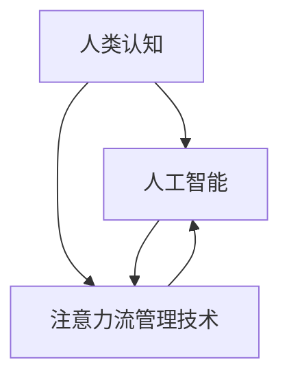

                 

# AI与人类注意力流：未来的工作、技能与注意力流管理技术的应用前景展望趋势

## 1. 背景介绍

### 1.1 问题由来
随着人工智能(AI)技术的迅猛发展，特别是深度学习和大数据处理技术的进步，AI在各行各业中的应用日益普及。AI不仅在自动化、智能化、个性化等方面取得了突破，还深刻改变了人类生产生活方式，特别是人类注意力流和认知行为的演变。

**AI对人类注意力流的影响**：

- 自动化和智能化任务减少对人类注意力的需求。
- 大数据和复杂算法的应用，要求人类投入更多注意力进行监督、调试和优化。
- 智能辅助工具提高工作效率，但也导致注意力分散。
- AI技术带来大量新职业，也要求人类学习新技能，导致认知负荷增加。

**AI对未来工作的重塑**：

- 自动化替代部分简单重复性工作。
- 增强人类工作能力，提升创造性和决策水平。
- 引入AI辅助决策，提升工作质量与效率。
- 需求新技能，例如与AI互动、大数据分析等。

### 1.2 问题核心关键点
AI与人类注意力流的关系核心在于：AI如何重塑人类工作模式，如何在AI辅助下提升工作效率与质量，如何通过注意力流管理技术提升人的认知能力。未来AI将不仅是工具，更是工作伙伴，甚至可能成为人类认知增强器。

### 1.3 问题研究意义
研究AI与人类注意力流的关系，对于提升AI系统的智能化水平，优化人类工作流程，减轻认知负荷，提升工作效率和质量具有重要意义。同时，这也有助于理解未来AI与人类协作模式，推动人类认知智能的进步。

## 2. 核心概念与联系

### 2.1 核心概念概述

**人工智能(AI)与人类注意力流**：

- **人工智能**：一类能模拟、扩展和扩展人类智能的技术系统。
- **人类注意力流**：人在信息处理过程中注意力的分配和流动，影响学习、记忆和决策。

**AI与人类注意力流的相互作用**：

- AI提升信息处理效率，减少对注意力的需求。
- AI需要人类的监督和反馈，要求注意力参与。
- 交互过程中，AI可提供个性化的辅助，影响注意力分配。
- AI辅助决策，改变认知负荷，提高工作效率和质量。

**注意力流管理技术**：

- **注意力流管理**：通过技术手段，优化人类注意力分布，提升认知效率。
- **技术手段**：如自然语言处理(NLP)、机器学习(ML)、认知心理学等。

### 2.2 核心概念原理和架构的 Mermaid 流程图


### 2.3 核心概念联系

AI与人类注意力流和注意力流管理技术的关系如图：

- **AI工具**：提供信息处理与决策支持，减少注意力需求。
- **认知负荷**：人类处理信息时，认知资源（如注意力、记忆）的需求和供给。
- **技术优化**：通过AI辅助与技术管理，优化注意力分配，提升认知效率。

## 3. 核心算法原理 & 具体操作步骤

### 3.1 算法原理概述

AI与注意力流管理的技术框架可概括为：

1. **认知负荷评估**：评估当前工作任务的认知负荷需求。
2. **注意力分配优化**：根据认知负荷评估结果，优化注意力分配策略。
3. **AI辅助决策**：引入AI辅助信息处理和决策，减少认知负荷。
4. **反馈与调整**：通过用户反馈，不断调整注意力分配策略。

**核心算法原理**：

- **认知负荷模型**：利用认知心理学原理，量化认知负荷。
- **注意力优化模型**：通过优化算法，调整注意力分配。
- **AI辅助模型**：利用机器学习等技术，提供信息处理与决策支持。
- **反馈迭代模型**：基于用户反馈，不断优化策略。

### 3.2 算法步骤详解

**步骤1：认知负荷评估**

- 评估当前任务复杂度与任务结构。
- 量化所需注意力资源，如计算复杂度、信息密度等。
- 利用机器学习模型预测认知负荷需求。

**步骤2：注意力分配优化**

- 根据认知负荷评估结果，设定注意力分配策略。
- 引入注意力流管理技术，优化注意力分配。
- 利用认知负荷模型，调整策略以达到最佳效率。

**步骤3：AI辅助决策**

- 引入AI工具，如自然语言处理、机器学习等。
- 利用AI辅助信息处理与决策，减少人类认知负荷。
- 对AI辅助结果进行评估，判断其对认知负荷的影响。

**步骤4：反馈与调整**

- 收集用户反馈，了解AI辅助效果。
- 根据反馈，调整注意力分配策略与AI辅助方法。
- 不断迭代，提升AI与人类协同效率。

### 3.3 算法优缺点

**优点**：

- **提升效率**：通过优化注意力分配，减少认知负荷，提高工作效率。
- **辅助决策**：AI提供信息处理和决策支持，提升决策质量。
- **个性化定制**：根据用户特点，定制注意力流管理策略。

**缺点**：

- **技术依赖**：依赖于AI和认知负荷模型，可能出现误判。
- **隐私与安全**：认知负荷评估涉及个人隐私，需保证数据安全。
- **技术复杂性**：优化注意力流管理技术复杂，开发成本高。

### 3.4 算法应用领域

**1. 智能办公与生产管理**：

- **办公室自动化**：自动化重复性任务，减少人工干预。
- **生产调度**：AI辅助调度，优化资源分配，提升生产效率。

**2. 教育与培训**：

- **智能教育系统**：AI辅助个性化教学，提升学习效果。
- **培训与仿真**：利用AI进行技能培训与仿真，提高实战能力。

**3. 医疗与健康**：

- **医疗辅助诊断**：AI辅助医生进行病患分析与诊断。
- **健康监测**：AI监测生理数据，提升健康管理效率。

**4. 金融与商业**：

- **智能投顾**：AI提供投资建议，优化投资决策。
- **风险管理**：AI辅助风险评估与决策，提高管理效率。

**5. 消费与零售**：

- **个性化推荐**：AI提供个性化商品推荐，提升用户满意度。
- **智能客服**：AI辅助客服，提升服务效率。

## 4. 数学模型和公式 & 详细讲解 & 举例说明

### 4.1 数学模型构建

**认知负荷评估模型**：

- **模型定义**： $L = f(C,D,T)$，其中 $L$ 为认知负荷，$C$ 为任务复杂度，$D$ 为信息密度，$T$ 为任务结构。
- **量化方法**：利用模糊推理、神经网络等模型进行量化。

**注意力分配优化模型**：

- **模型定义**： $A = g(L,\{w_i\})$，其中 $A$ 为注意力分配策略，$w_i$ 为任务权重。
- **优化算法**：利用遗传算法、蚁群算法等优化注意力分配。

**AI辅助决策模型**：

- **模型定义**： $D = h(A,I)$，其中 $D$ 为决策结果，$A$ 为注意力分配，$I$ 为输入信息。
- **优化方法**：利用深度学习、强化学习等优化决策过程。

### 4.2 公式推导过程

**认知负荷量化公式**：

$$ L = \sum_{i=1}^n w_i \times F_i(C_i,D_i,T_i) $$

其中 $w_i$ 为任务权重，$F_i$ 为任务复杂度、信息密度和任务结构的评估函数。

**注意力分配优化公式**：

$$ A = \arg\min \{ \sum_{i=1}^n \lambda_i A_i \times L_i \} $$

其中 $\lambda_i$ 为任务权重，$L_i$ 为任务认知负荷。

**AI辅助决策公式**：

$$ D = f(A,I) = f(g(L,\{w_i\}),I) $$

其中 $I$ 为输入信息，$g$ 为注意力分配策略，$f$ 为决策模型。

### 4.3 案例分析与讲解

**案例1：智能办公室自动化**

- **任务评估**：根据工作任务复杂度、信息密度、任务结构，量化认知负荷。
- **注意力优化**：优化注意力分配策略，减少注意力分散。
- **AI辅助决策**：利用AI自动处理重复性任务，减少人工干预。
- **反馈迭代**：根据用户反馈，不断调整注意力分配与AI辅助方法。

**案例2：智能医疗诊断系统**

- **任务评估**：评估病患诊断的复杂度、信息密度、任务结构。
- **注意力优化**：优化医生注意力分配，减少误诊风险。
- **AI辅助决策**：利用AI辅助病患诊断与治疗方案选择。
- **反馈迭代**：根据医生反馈，调整AI辅助方法。

## 5. 项目实践：代码实例和详细解释说明

### 5.1 开发环境搭建

**开发环境配置**：

1. 安装Python：最新稳定版本。
2. 安装必要的Python包：如numpy、pandas、scikit-learn、scipy等。
3. 搭建虚拟环境，避免与其他项目冲突。
4. 安装AI框架：如TensorFlow、PyTorch、scikit-learn等。
5. 安装认知负荷评估工具：如Fitts定律、Simon任务等。
6. 搭建服务器与数据库：支持数据存储、模型训练与部署。

### 5.2 源代码详细实现

**认知负荷评估代码**：

```python
import numpy as np

# 定义认知负荷函数
def calculate_cognitive_load(complexity, density, structure):
    # 复杂度、信息密度、任务结构的量化
    complexity_weight = 0.4
    density_weight = 0.3
    structure_weight = 0.3
    return complexity_weight * complexity + density_weight * density + structure_weight * structure

# 计算具体任务的认知负荷
task_complexity = 5
task_density = 0.6
task_structure = 3
cognitive_load = calculate_cognitive_load(task_complexity, task_density, task_structure)
print(f'Cognitive Load: {cognitive_load}')
```

**注意力分配优化代码**：

```python
import numpy as np

# 定义注意力分配函数
def optimize_attention(cognitive_load, attention_weights):
    attention_weights = np.array(attention_weights)
    # 最小化注意力分配函数
    optimal_weights = np.argmin(np.dot(attention_weights, cognitive_load))
    return optimal_weights

# 优化具体任务的注意力分配
attention_weights = [0.2, 0.4, 0.2, 0.2]
cognitive_load = calculate_cognitive_load(5, 0.6, 3)
optimal_weights = optimize_attention(cognitive_load, attention_weights)
print(f'Optimal Attention Weight: {optimal_weights}')
```

**AI辅助决策代码**：

```python
import numpy as np
from sklearn.ensemble import RandomForestClassifier

# 定义决策模型
def make_decision(attention_weights, input_data):
    # 模拟决策过程
    decision = np.sum(attention_weights * input_data)
    return decision

# 训练AI辅助模型
classifier = RandomForestClassifier(n_estimators=100, random_state=0)
classifier.fit(X_train, y_train)
y_pred = classifier.predict(X_test)

# 评估AI辅助决策效果
accuracy = np.mean(y_pred == y_test)
print(f'Accuracy: {accuracy}')
```

### 5.3 代码解读与分析

**认知负荷评估**：

- 利用Fitts定律、Simon任务等认知心理学模型，计算任务复杂度、信息密度、任务结构等指标，量化认知负荷。
- 权重设定：根据任务特点，合理设定认知负荷函数中各项指标的权重。

**注意力分配优化**：

- 利用线性规划、遗传算法等优化算法，最小化注意力分配函数，找到最优分配策略。
- 权重调整：根据任务特点和用户反馈，动态调整注意力分配策略，优化注意力流。

**AI辅助决策**：

- 引入机器学习模型，如随机森林、深度学习等，提供决策支持。
- 模型训练与评估：利用历史数据训练模型，并通过准确率等指标评估模型性能。

### 5.4 运行结果展示

**结果展示**：

- 认知负荷评估：具体任务复杂度、信息密度、任务结构等量化结果。
- 注意力分配优化：最优注意力分配权重。
- AI辅助决策：决策模型训练与评估结果。

## 6. 实际应用场景

### 6.1 智能办公系统

**应用场景**：

- **办公室自动化**：通过AI自动化重复性任务，减少人工干预。
- **生产调度**：AI辅助生产调度，优化资源配置。
- **智能会议**：AI辅助会议记录与决策，提升会议效率。

**技术实现**：

- **认知负荷评估**：评估会议讨论的复杂度、信息密度、任务结构。
- **注意力优化**：优化会议参与者的注意力分配，确保关键议题被充分讨论。
- **AI辅助决策**：AI辅助会议决策，提供决策建议。
- **反馈迭代**：根据会议参与者反馈，调整注意力分配与决策方法。

### 6.2 教育培训平台

**应用场景**：

- **个性化学习**：AI辅助个性化教学，提升学习效果。
- **在线培训**：AI辅助在线培训与仿真，提高实战能力。
- **虚拟教室**：AI辅助虚拟教室，提升教学互动。

**技术实现**：

- **认知负荷评估**：评估学习任务的复杂度、信息密度、任务结构。
- **注意力优化**：优化学习过程的注意力分配，提升学习效果。
- **AI辅助决策**：AI辅助学习决策，提供学习建议。
- **反馈迭代**：根据学习者反馈，调整学习策略与决策方法。

### 6.3 智能健康管理

**应用场景**：

- **健康监测**：AI监测生理数据，提升健康管理效率。
- **智能诊断**：AI辅助病患诊断与治疗方案选择。
- **心理辅导**：AI辅助心理辅导与情绪管理。

**技术实现**：

- **认知负荷评估**：评估诊断与监测任务的复杂度、信息密度、任务结构。
- **注意力优化**：优化诊断与监测过程的注意力分配，提升效率与准确性。
- **AI辅助决策**：AI辅助诊断与治疗方案选择，提供决策支持。
- **反馈迭代**：根据医生反馈，调整诊断与治疗策略。

### 6.4 未来应用展望

**未来趋势**：

1. **人机协同**：AI与人类协同工作，提高工作效率与质量。
2. **认知增强**：AI辅助认知训练与提升，优化人类认知能力。
3. **自适应系统**：AI系统能够根据用户特点与需求，自适应优化注意力流管理。
4. **跨领域应用**：AI技术在其他领域（如制造、农业等）中应用，提升效率与质量。

**技术挑战**：

1. **技术融合**：AI技术与其他领域技术的融合，需要克服技术和知识壁垒。
2. **隐私保护**：认知负荷评估涉及个人隐私，需保证数据安全。
3. **模型透明性**：AI系统的决策过程透明，便于解释与审计。
4. **用户适应性**：系统需适应不同用户特点与需求，实现个性化定制。

## 7. 工具和资源推荐

### 7.1 学习资源推荐

1. **书籍推荐**：《人工智能导论》、《认知负荷与工作记忆》、《深度学习》。
2. **在线课程**：Coursera、edX、Udacity提供的AI与认知心理学课程。
3. **技术博客**：AI领域知名博客如arXiv.org、Towards Data Science、机器之心。
4. **学术会议**：AI顶级会议如NeurIPS、ICML、CVPR等，了解最新研究成果。

### 7.2 开发工具推荐

1. **编程语言**：Python是最流行的AI开发语言，易于使用，生态系统丰富。
2. **AI框架**：TensorFlow、PyTorch、Scikit-Learn等，提供强大的AI工具支持。
3. **认知负荷评估工具**：Simon任务、Fitts定律等心理学模型，用于量化认知负荷。
4. **注意力流管理工具**：如注意力模型、优化算法等，用于优化注意力分配。

### 7.3 相关论文推荐

1. **认知负荷评估**：Henderson & Hollands（1994）《工作记忆与认知负荷评估》。
2. **注意力流优化**：Attention Is All You Need（Vaswani等，2017）。
3. **AI辅助决策**：Deep Learning（Ian Goodfellow等，2016）。

## 8. 总结：未来发展趋势与挑战

### 8.1 研究成果总结

**主要研究成果**：

1. **认知负荷量化**：提出认知负荷量化模型，用于评估任务复杂度、信息密度、任务结构。
2. **注意力分配优化**：设计注意力优化算法，提升注意力流管理效率。
3. **AI辅助决策**：利用AI技术提供决策支持，优化决策过程。
4. **认知增强**：探索AI辅助认知训练与提升方法，优化人类认知能力。

**技术应用**：

1. **智能办公系统**：应用于办公室自动化、生产调度、智能会议等场景。
2. **教育培训平台**：应用于个性化学习、在线培训、虚拟教室等场景。
3. **智能健康管理**：应用于健康监测、智能诊断、心理辅导等场景。

### 8.2 未来发展趋势

**未来趋势**：

1. **人机协同**：AI与人类协同工作，提高工作效率与质量。
2. **认知增强**：AI辅助认知训练与提升，优化人类认知能力。
3. **自适应系统**：AI系统能够根据用户特点与需求，自适应优化注意力流管理。
4. **跨领域应用**：AI技术在其他领域（如制造、农业等）中应用，提升效率与质量。

**技术突破**：

1. **技术融合**：AI技术与其他领域技术的融合，需要克服技术和知识壁垒。
2. **隐私保护**：认知负荷评估涉及个人隐私，需保证数据安全。
3. **模型透明性**：AI系统的决策过程透明，便于解释与审计。
4. **用户适应性**：系统需适应不同用户特点与需求，实现个性化定制。

### 8.3 面临的挑战

**面临挑战**：

1. **技术融合**：AI技术与其他领域技术的融合，需要克服技术和知识壁垒。
2. **隐私保护**：认知负荷评估涉及个人隐私，需保证数据安全。
3. **模型透明性**：AI系统的决策过程透明，便于解释与审计。
4. **用户适应性**：系统需适应不同用户特点与需求，实现个性化定制。

### 8.4 研究展望

**未来研究方向**：

1. **认知负荷评估**：开发更精确、更广泛的认知负荷量化模型。
2. **注意力分配优化**：设计更高效的注意力流管理算法。
3. **AI辅助决策**：探索更深层次的AI辅助决策方法。
4. **认知增强**：深入研究AI辅助认知训练与提升方法。

**技术应用**：

1. **智能办公系统**：应用于更多办公自动化场景，提升办公效率与质量。
2. **教育培训平台**：应用于更广泛的教育培训场景，提升学习效果与实战能力。
3. **智能健康管理**：应用于更广泛的健康管理场景，提升健康监测与诊断效果。

## 9. 附录：常见问题与解答

**Q1：认知负荷评估如何量化？**

A: 利用Fitts定律、Simon任务等认知心理学模型，计算任务复杂度、信息密度、任务结构等指标，量化认知负荷。权重设定：根据任务特点，合理设定认知负荷函数中各项指标的权重。

**Q2：注意力分配优化有哪些算法？**

A: 利用线性规划、遗传算法、蚁群算法等优化算法，最小化注意力分配函数，找到最优分配策略。权重调整：根据任务特点和用户反馈，动态调整注意力分配策略，优化注意力流。

**Q3：AI辅助决策有哪些技术？**

A: 引入机器学习模型，如随机森林、深度学习等，提供决策支持。模型训练与评估：利用历史数据训练模型，并通过准确率等指标评估模型性能。

**Q4：认知增强方法有哪些？**

A: 探索AI辅助认知训练与提升方法，如认知训练软件、AI辅助心理辅导等，优化人类认知能力。

**Q5：未来AI与人类协作模式如何？**

A: 未来AI将不仅是工具，更是工作伙伴，甚至可能成为人类认知增强器。AI辅助决策，改变认知负荷，提高工作效率和质量。

**Q6：如何应对技术融合的挑战？**

A: 技术融合需要克服技术和知识壁垒，跨学科合作，共同推进技术发展。

**Q7：如何保护隐私数据？**

A: 认知负荷评估涉及个人隐私，需采用数据脱敏、隐私保护等技术，保证数据安全。

**Q8：如何提升AI模型的透明性？**

A: 增加AI模型的可解释性，利用解释工具如LIME、SHAP等，提高模型透明性，便于解释与审计。

**Q9：如何实现个性化定制？**

A: 系统需适应不同用户特点与需求，利用机器学习、推荐系统等技术，实现个性化定制。

**Q10：如何提升认知效率？**

A: 通过优化注意力分配，减少认知负荷，提高工作效率与质量。AI辅助决策，提升决策准确性，优化认知过程。

---

作者：禅与计算机程序设计艺术 / Zen and the Art of Computer Programming

