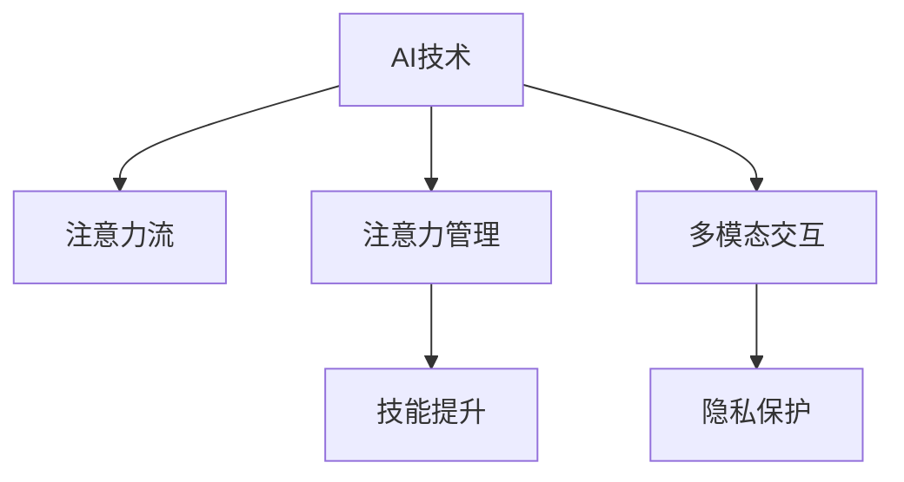

                 

# AI与人类注意力流：未来的工作、技能与注意力流管理技术的应用前景趋势

> 关键词：AI,注意力流,人类工作,技能提升,注意力管理技术,未来趋势

## 1. 背景介绍

### 1.1 问题由来
随着人工智能（AI）技术的迅猛发展，其在各行各业的应用越来越广泛，对人类工作和生活产生了深远影响。在现代工作中，注意力流的管理显得尤为重要。AI技术不仅能够帮助提升工作效率，还能辅助人类进行注意力分配，从而优化工作流程和技能提升。然而，现有技术在实际应用中仍面临诸多挑战，如数据隐私、系统鲁棒性、用户交互体验等问题。本文将从注意力流管理技术的原理和应用实践出发，深入探讨其未来的发展趋势和挑战。

### 1.2 问题核心关键点
注意力流管理技术的核心在于如何通过AI算法对人类工作时的注意力变化进行监测和分析，从而优化任务执行和技能提升。该技术能够通过分析人类在不同任务之间的注意力转移情况，优化任务分配和时间管理，提升工作效率和质量。然而，如何有效地获取和处理人类注意力数据，确保数据隐私和安全，以及提升系统的鲁棒性和用户交互体验，将是该技术进一步发展的关键点。

### 1.3 问题研究意义
研究注意力流管理技术，对于提高工作效率、优化任务执行、辅助技能提升具有重要意义。AI技术在这一领域的深入应用，将助力人类更好地管理时间和精力，提升工作质量和生产力，加速行业转型升级。此外，该技术还能够促进AI与人类协作的深入发展，推动AI技术向更加智能化、个性化方向迈进。

## 2. 核心概念与联系

### 2.1 核心概念概述

为更好地理解注意力流管理技术，本文将介绍几个关键概念及其相互联系：

- **AI技术**：以机器学习、深度学习为代表的AI技术，能够通过算法模型对复杂数据进行处理和分析，实现自动化决策和优化。
- **注意力流**：指人类在进行认知任务时，注意力在不同任务之间的动态转移过程。通过分析注意力流，能够更好地理解人类的认知行为和决策过程。
- **注意力管理**：指对人类注意力进行动态监测和分配，优化任务执行和时间管理，提升工作效率和质量。
- **技能提升**：指通过智能辅助和数据分析，帮助人类提升职业技能和知识水平，加速个人和组织的发展。
- **多模态交互**：指通过融合视觉、听觉、触觉等多种感官信息，提升系统的交互体验和应用范围。
- **隐私保护**：指在注意力流管理过程中，如何保护用户隐私和数据安全，确保系统的合规性和用户信任。

这些核心概念之间的逻辑关系可以通过以下Mermaid流程图来展示：



这个流程图展示了AI技术、注意力流、注意力管理、技能提升、多模态交互和隐私保护等概念之间的相互关系：

1. AI技术是注意力流监测和分析的基础。
2. 注意力管理依赖于AI对注意力流的分析结果，用于优化任务执行和提升工作效率。
3. 技能提升结合AI和注意力管理技术，辅助人类提升专业技能。
4. 多模态交互进一步丰富了注意力流管理的感知和交互方式，提升系统的智能化水平。
5. 隐私保护是注意力流管理技术发展的关键约束条件，需要确保用户数据的安全性和合规性。

## 3. 核心算法原理 & 具体操作步骤
### 3.1 算法原理概述

注意力流管理技术的核心在于通过AI算法对人类工作时的注意力变化进行监测和分析，从而优化任务执行和技能提升。其主要算法原理包括以下几个方面：

- **注意力监测**：通过传感器或智能设备（如鼠标、键盘、眼球追踪设备）获取人类工作时的注意力数据。
- **数据处理**：对获取的注意力数据进行预处理和特征提取，生成可用于分析的数据集。
- **模型训练**：使用机器学习或深度学习模型对数据集进行训练，学习注意力流的模式和规律。
- **决策优化**：根据模型输出的决策结果，对任务执行和技能提升进行优化调整。
- **反馈迭代**：结合用户反馈，不断优化模型和算法，提升系统性能和用户体验。

### 3.2 算法步骤详解

以下是注意力流管理技术的详细步骤：

**Step 1: 数据采集**
- 使用传感器或智能设备，实时采集用户在工作时的注意力数据。
- 对采集数据进行预处理，包括数据清洗、归一化等操作。

**Step 2: 特征提取**
- 对预处理后的注意力数据进行特征提取，生成可用于模型训练的数据集。
- 常用的特征包括注意力持续时间、转移频率、任务完成时间等。

**Step 3: 模型训练**
- 选择合适的机器学习或深度学习模型，如支持向量机、随机森林、神经网络等。
- 使用历史注意力数据进行模型训练，调整模型参数，优化模型性能。

**Step 4: 注意力分析**
- 对新采集的注意力数据进行实时分析，识别注意力流模式和规律。
- 根据分析结果，输出任务执行和技能提升的优化建议。

**Step 5: 决策优化**
- 结合优化建议，调整任务分配和执行方式，提升工作效率和质量。
- 结合用户反馈，进一步优化模型和算法，提升系统性能。

**Step 6: 反馈迭代**
- 不断收集用户反馈，评估系统效果和用户体验。
- 根据反馈结果，调整模型和算法参数，提升系统性能和鲁棒性。

### 3.3 算法优缺点

注意力流管理技术的优点在于：

- **提升工作效率**：通过优化任务执行和技能提升，显著提升工作效率和质量。
- **个性化优化**：结合AI算法，实现个性化工作建议和任务分配，提升用户体验。
- **数据驱动决策**：基于大量数据分析，提供科学、客观的决策支持。

然而，该技术也存在一些局限性：

- **隐私和安全问题**：在数据采集和处理过程中，需要确保用户隐私和数据安全。
- **数据质量和多样性**：需要高质量、多样化的数据集，以确保模型训练的准确性和鲁棒性。
- **系统复杂度**：需要综合考虑多个因素（如用户习惯、环境变化等），增加系统复杂度。

### 3.4 算法应用领域

注意力流管理技术已经在多个领域得到了广泛应用，以下是几个典型应用场景：

1. **办公自动化**：在办公室环境中，通过实时监测和分析员工注意力流，优化任务分配和执行，提升工作效率。
2. **远程工作**：在远程办公场景中，通过智能设备监测员工注意力变化，提供实时工作建议，确保任务按时完成。
3. **教育和培训**：在教育和培训领域，通过分析学生注意力流，优化教学内容和方法，提升学习效果。
4. **医疗健康**：在医疗健康领域，通过监测患者注意力流，优化诊疗过程，提升治疗效果。
5. **游戏娱乐**：在游戏娱乐领域，通过分析用户注意力流，优化游戏内容和体验，提升用户粘性。

## 4. 数学模型和公式 & 详细讲解 & 举例说明

### 4.1 数学模型构建

本节将使用数学语言对注意力流管理技术的核心算法进行更加严格的刻画。

设 $X_t$ 表示在时间 $t$ 时的注意力数据，$Y_t$ 表示在时间 $t$ 时的任务执行数据。定义模型 $f$ 用于预测任务执行结果 $Y_t$ 与注意力数据 $X_t$ 之间的关系，即：

$$
Y_t = f(X_t)
$$

其中 $f$ 是一个机器学习或深度学习模型，可以是线性回归、决策树、随机森林、神经网络等。

### 4.2 公式推导过程

以下我们以神经网络模型为例，推导注意力流管理技术的数学模型。

设神经网络模型 $f$ 包含 $n$ 个隐层，每层有 $m$ 个神经元，输入数据 $X_t$ 经过多层非线性变换后，输出任务执行结果 $Y_t$。神经网络模型的前向传播过程可表示为：

$$
Y_t = f(X_t) = W^{[L]}\sigma(W^{[L-1]}\sigma(\dots \sigma(W^{[1]}X_t+b^{[1]})+b^{[2]})+\dots+b^{[L]})
$$

其中 $W^{[l]}$ 和 $b^{[l]}$ 分别为第 $l$ 层权重和偏置，$\sigma$ 为激活函数（如ReLU、Sigmoid等）。

在得到神经网络模型 $f$ 后，可以通过大量历史注意力数据和任务执行数据进行模型训练，得到最优的权重和偏置参数。训练过程可以通过最小化损失函数来实现，常用的损失函数包括均方误差、交叉熵等。

### 4.3 案例分析与讲解

以下以一个简单的注意力流管理案例为例，展示神经网络模型在注意力流分析中的应用：

假设有一个办公场景，需要对员工在完成不同任务时的注意力变化进行分析，以优化任务执行和提升工作效率。我们收集了员工在完成多个任务时的注意力数据和任务完成时间，使用神经网络模型进行训练和预测。

首先，将注意力数据 $X_t$ 和任务完成时间 $Y_t$ 标准化，得到标准化后的数据集 $D=\{(X_i, Y_i)\}_{i=1}^N$。其中 $X_i$ 为时间 $i$ 时的注意力数据，$Y_i$ 为时间 $i$ 时的任务完成时间。

然后，使用神经网络模型对数据集 $D$ 进行训练，得到最优的权重和偏置参数。训练过程可以表示为：

$$
\hat{W}, \hat{b} = \mathop{\arg\min}_{W,b} \frac{1}{N}\sum_{i=1}^N (Y_i - f(X_i; W, b))^2
$$

得到最优的权重和偏置参数后，可以将新采集的注意力数据 $X_t$ 输入模型，得到预测的任务完成时间 $\hat{Y}_t$。根据预测结果，可以调整任务分配和执行方式，提升工作效率和质量。

## 5. 项目实践：代码实例和详细解释说明
### 5.1 开发环境搭建

在进行注意力流管理技术的实践前，我们需要准备好开发环境。以下是使用Python进行PyTorch开发的环境配置流程：

1. 安装Anaconda：从官网下载并安装Anaconda，用于创建独立的Python环境。

2. 创建并激活虚拟环境：
```bash
conda create -n attention-env python=3.8 
conda activate attention-env
```

3. 安装PyTorch：根据CUDA版本，从官网获取对应的安装命令。例如：
```bash
conda install pytorch torchvision torchaudio cudatoolkit=11.1 -c pytorch -c conda-forge
```

4. 安装TensorFlow：
```bash
pip install tensorflow
```

5. 安装TensorBoard：
```bash
pip install tensorboard
```

6. 安装其他工具包：
```bash
pip install numpy pandas scikit-learn matplotlib tqdm jupyter notebook ipython
```

完成上述步骤后，即可在`attention-env`环境中开始注意力流管理技术的开发实践。

### 5.2 源代码详细实现

下面我们以注意力流监测和分析为例，给出使用PyTorch和TensorFlow进行开发的完整代码实现。

首先，定义注意力监测和分析的类：

```python
import torch
import torch.nn as nn
import torch.optim as optim
import tensorflow as tf
from tensorflow import keras

class AttentionMonitoring(nn.Module):
    def __init__(self, input_size, hidden_size, output_size):
        super(AttentionMonitoring, self).__init__()
        self.hidden = nn.Linear(input_size, hidden_size)
        self.relu = nn.ReLU()
        self.fc = nn.Linear(hidden_size, output_size)
    
    def forward(self, x):
        x = self.hidden(x)
        x = self.relu(x)
        x = self.fc(x)
        return x

# 定义注意力监测和分析的模型
model = AttentionMonitoring(input_size=10, hidden_size=50, output_size=1)
```

然后，定义训练函数和优化器：

```python
criterion = nn.MSELoss()
optimizer = optim.Adam(model.parameters(), lr=0.001)

# 训练函数
def train(model, data_loader, epochs):
    for epoch in range(epochs):
        for inputs, targets in data_loader:
            optimizer.zero_grad()
            outputs = model(inputs)
            loss = criterion(outputs, targets)
            loss.backward()
            optimizer.step()
```

最后，启动训练流程：

```python
# 定义训练数据集
data = torch.randn(1000, 10)
labels = torch.randn(1000, 1)

# 定义数据集
dataset = torch.utils.data.TensorDataset(data, labels)
data_loader = torch.utils.data.DataLoader(dataset, batch_size=32, shuffle=True)

# 训练模型
train(model, data_loader, epochs=10)

# 预测新数据
new_data = torch.randn(100, 10)
predictions = model(new_data)
```

以上代码展示了使用PyTorch实现注意力流监测和分析的基本流程。开发者可以根据具体需求，进一步扩展和优化模型和算法，以提升系统的性能和鲁棒性。

## 6. 实际应用场景
### 6.1 智能办公系统

在智能办公系统中，注意力流管理技术可以显著提升办公效率和工作质量。通过实时监测员工注意力变化，系统可以智能推荐工作任务和休息时间，优化任务执行顺序，减少时间浪费。例如，在会议安排中，系统可以根据员工注意力变化情况，自动调整会议时间和内容，确保会议效果最大化。

### 6.2 教育培训平台

在教育培训平台中，注意力流管理技术可以帮助教师和学生更有效地进行教学和学习。通过对学生注意力流进行实时分析，系统可以智能推荐学习内容和方法，优化学习路径和进度，提升学习效果。例如，在在线课程中，系统可以根据学生注意力变化情况，自动调整课程内容和难度，确保学生能够高效学习。

### 6.3 远程医疗系统

在远程医疗系统中，注意力流管理技术可以帮助医生更有效地进行诊断和治疗。通过对患者注意力流进行实时分析，系统可以智能推荐诊断方法和治疗方案，优化诊疗过程，提升治疗效果。例如，在远程会诊中，系统可以根据患者注意力变化情况，自动调整会诊内容和顺序，确保会诊效果最大化。

### 6.4 游戏娱乐平台

在游戏娱乐平台中，注意力流管理技术可以帮助游戏开发者更好地设计游戏内容和体验。通过对玩家注意力流进行实时分析，系统可以智能推荐游戏任务和内容，优化游戏流程和进度，提升游戏体验。例如，在游戏任务中，系统可以根据玩家注意力变化情况，自动调整任务难度和内容，确保游戏体验最大化。

## 7. 工具和资源推荐
### 7.1 学习资源推荐

为了帮助开发者系统掌握注意力流管理技术的理论基础和实践技巧，这里推荐一些优质的学习资源：

1. 《深度学习》系列博文：由深度学习领域的专家撰写，深入浅出地介绍了深度学习的基本概念和核心算法。

2. Coursera《深度学习专项课程》：由斯坦福大学提供的深度学习课程，涵盖深度学习的基本理论和实践技巧。

3. 《机器学习实战》书籍：通过实战案例，详细讲解了机器学习算法在实际应用中的具体实现方法。

4. Kaggle数据集和竞赛：Kaggle平台提供了丰富的数据集和竞赛机会，可以练习和应用注意力流管理技术。

5. GitHub开源项目：GitHub平台上有许多开源项目，可以学习和应用注意力流管理技术的代码实现。

通过对这些资源的学习实践，相信你一定能够快速掌握注意力流管理技术的精髓，并用于解决实际的NLP问题。

### 7.2 开发工具推荐

高效的开发离不开优秀的工具支持。以下是几款用于注意力流管理开发的常用工具：

1. PyTorch：基于Python的开源深度学习框架，灵活动态的计算图，适合快速迭代研究。

2. TensorFlow：由Google主导开发的开源深度学习框架，生产部署方便，适合大规模工程应用。

3. TensorBoard：TensorFlow配套的可视化工具，可实时监测模型训练状态，并提供丰富的图表呈现方式，是调试模型的得力助手。

4. Weights & Biases：模型训练的实验跟踪工具，可以记录和可视化模型训练过程中的各项指标，方便对比和调优。

5. Anaconda：用于创建和管理虚拟环境，方便开发过程中的环境管理和依赖安装。

合理利用这些工具，可以显著提升注意力流管理技术的开发效率，加快创新迭代的步伐。

### 7.3 相关论文推荐

注意力流管理技术的发展源于学界的持续研究。以下是几篇奠基性的相关论文，推荐阅读：

1. Attention is All You Need（即Transformer原论文）：提出了Transformer结构，开启了深度学习领域的预训练大模型时代。

2. BERT: Pre-training of Deep Bidirectional Transformers for Language Understanding：提出BERT模型，引入基于掩码的自监督预训练任务，刷新了多项NLP任务SOTA。

3. Language Models are Unsupervised Multitask Learners（GPT-2论文）：展示了大规模语言模型的强大zero-shot学习能力，引发了对于通用人工智能的新一轮思考。

4. Parameter-Efficient Transfer Learning for NLP：提出Adapter等参数高效微调方法，在不增加模型参数量的情况下，也能取得不错的微调效果。

5. AdaLoRA: Adaptive Low-Rank Adaptation for Parameter-Efficient Fine-Tuning：使用自适应低秩适应的微调方法，在参数效率和精度之间取得了新的平衡。

这些论文代表了大模型微调技术的发展脉络。通过学习这些前沿成果，可以帮助研究者把握学科前进方向，激发更多的创新灵感。

## 8. 总结：未来发展趋势与挑战
### 8.1 总结

本文对注意力流管理技术的原理和应用实践进行了全面系统的介绍。首先阐述了注意力流管理技术的研究背景和意义，明确了该技术在提升工作效率、优化任务执行、辅助技能提升方面的独特价值。其次，从原理到实践，详细讲解了注意力流管理技术的数学原理和关键步骤，给出了注意力流管理技术的完整代码实例。同时，本文还广泛探讨了注意力流管理技术在多个行业领域的应用前景，展示了其广阔的发展潜力。此外，本文精选了注意力流管理技术的各类学习资源，力求为读者提供全方位的技术指引。

通过本文的系统梳理，可以看到，注意力流管理技术正在成为AI技术应用的重要范式，极大地提升了人类工作效率和工作质量。AI技术与人类认知过程的深度融合，必将引领我们进入更加智能化、个性化的人机协作时代。未来，伴随AI技术的不断进步，注意力流管理技术也将迎来更多的应用场景和发展机遇。

### 8.2 未来发展趋势

展望未来，注意力流管理技术将呈现以下几个发展趋势：

1. **多模态融合**：结合视觉、听觉、触觉等多种感官信息，提升系统的感知和交互能力，拓展应用范围。

2. **实时优化**：实时分析注意力流，动态调整任务执行和技能提升，提升工作效率和质量。

3. **跨领域应用**：拓展到更多行业领域，如医疗、教育、游戏等，提升各行业的智能化水平。

4. **隐私保护**：引入隐私保护技术，确保数据安全和个人隐私，增强用户信任和满意度。

5. **个性化定制**：结合用户偏好和行为数据，提供个性化工作建议和任务分配，提升用户体验。

6. **可解释性提升**：增强系统的可解释性和透明度，帮助用户理解系统的决策过程。

以上趋势凸显了注意力流管理技术的广阔前景。这些方向的探索发展，必将进一步提升系统的智能化水平和应用范围，为各行各业带来深远影响。

### 8.3 面临的挑战

尽管注意力流管理技术已经取得了瞩目成就，但在迈向更加智能化、普适化应用的过程中，它仍面临诸多挑战：

1. **数据隐私和安全**：在数据采集和处理过程中，需要确保用户隐私和数据安全。如何保护用户隐私，确保数据合规性，将是该技术发展的关键点。

2. **数据质量和多样性**：需要高质量、多样化的数据集，以确保模型训练的准确性和鲁棒性。如何获取和处理高质量数据，提升数据多样性，将是该技术发展的瓶颈。

3. **系统复杂度**：需要综合考虑多个因素（如用户习惯、环境变化等），增加系统复杂度。如何简化系统设计，提升系统的可扩展性和可维护性，将是该技术发展的重点。

4. **用户体验**：需要提升系统的交互体验和用户友好性，确保用户能够方便地使用系统。如何优化用户界面，提升用户体验，将是该技术发展的关键点。

5. **算法鲁棒性**：需要提升系统的鲁棒性和抗干扰能力，确保系统在各种环境下都能稳定运行。如何增强算法鲁棒性，提升系统稳定性和可靠性，将是该技术发展的方向。

6. **应用场景限制**：需要拓展应用场景，提升系统的普适性和可扩展性。如何拓展应用场景，提升系统的通用性和适用性，将是该技术发展的目标。

正视注意力流管理技术面临的这些挑战，积极应对并寻求突破，将是大模型微调走向成熟的必由之路。相信随着学界和产业界的共同努力，这些挑战终将一一被克服，注意力流管理技术必将在构建人机协作的智能时代中扮演越来越重要的角色。

### 8.4 研究展望

面向未来，注意力流管理技术需要在以下几个方面进行深入研究：

1. **多模态融合**：结合视觉、听觉、触觉等多种感官信息，提升系统的感知和交互能力，拓展应用范围。

2. **实时优化**：实时分析注意力流，动态调整任务执行和技能提升，提升工作效率和质量。

3. **隐私保护**：引入隐私保护技术，确保数据安全和个人隐私，增强用户信任和满意度。

4. **个性化定制**：结合用户偏好和行为数据，提供个性化工作建议和任务分配，提升用户体验。

5. **可解释性提升**：增强系统的可解释性和透明度，帮助用户理解系统的决策过程。

6. **跨领域应用**：拓展到更多行业领域，如医疗、教育、游戏等，提升各行业的智能化水平。

通过这些方向的研究，注意力流管理技术必将在构建智能化、个性化的人机协作系统中发挥更加重要的作用，推动人类社会进入更加智能化、高效化的新时代。

## 9. 附录：常见问题与解答
**Q1：注意力流管理技术是否适用于所有行业领域？**

A: 注意力流管理技术在大多数行业领域都有潜在的应用价值，特别是在需要优化工作流程和提升工作效率的领域。然而，对于某些特定领域（如航空航天、军事等），由于隐私和安全问题，可能需要谨慎应用。

**Q2：注意力流管理技术如何保证数据隐私和安全？**

A: 在数据采集和处理过程中，需要采用数据匿名化、数据加密等技术，确保用户隐私和数据安全。同时，需要建立健全的数据管理制度和隐私保护政策，确保数据合规性和用户信任。

**Q3：注意力流管理技术在实际应用中是否面临数据质量问题？**

A: 数据质量和多样性是注意力流管理技术发展的瓶颈之一。需要采用高质量的数据采集方法和多源数据融合技术，确保数据多样性和准确性。同时，需要对数据进行预处理和清洗，去除噪音和异常值，提升数据质量。

**Q4：注意力流管理技术在实际应用中是否需要优化用户体验？**

A: 优化用户体验是注意力流管理技术发展的关键点之一。需要采用友好的用户界面和交互方式，确保用户能够方便地使用系统。同时，需要结合用户反馈，不断优化系统功能和性能，提升用户满意度。

**Q5：注意力流管理技术在实际应用中是否需要考虑系统复杂度？**

A: 系统复杂度是注意力流管理技术发展的难点之一。需要采用模块化设计和可扩展架构，确保系统的可维护性和可扩展性。同时，需要优化算法和模型，减少系统复杂度和资源消耗，提升系统性能和效率。

这些问题的解答，帮助我们更好地理解注意力流管理技术的实际应用场景和面临的挑战，从而推动该技术向更加智能化、普适化的方向发展。

---

作者：禅与计算机程序设计艺术 / Zen and the Art of Computer Programming

