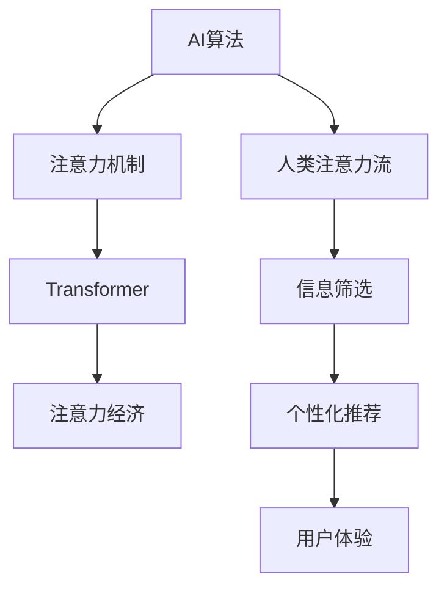

                 

# AI与人类注意力流：未来的工作、生活与注意力经济

> 关键词：人工智能,人类注意力流,工作,生活,注意力经济

## 1. 背景介绍

### 1.1 问题由来
随着人工智能技术的飞速发展，尤其是深度学习和机器学习算法的突破，AI正逐步融入人类社会的各个方面，重塑我们的工作、生活和商业模式。AI不仅在医疗、金融、教育等领域展现出强大的能力，也在日常生活中越来越普遍，如智能助理、推荐系统、自动驾驶等。但与此同时，AI也引发了广泛的社会关注和伦理讨论。如何在享受AI带来的便利的同时，平衡技术发展与人类价值观的关系，成为一个亟待解决的问题。

### 1.2 问题核心关键点
当前AI技术的一个核心问题是如何在算法设计和应用中充分考虑和利用人类的注意力流。人类注意力流是指人类注意力在各种活动和信息之间的动态变化过程，反映了人类认知资源的分配和使用。如何设计AI算法，使其能够理解和模拟人类注意力流，从而更好地服务于人类，提升生活质量和工作效率，是一个重要的研究方向。

### 1.3 问题研究意义
研究AI与人类注意力流的关系，对于推动AI技术的可持续发展和健康应用具有重要意义：

1. **提升用户体验**：通过理解人类注意力流，AI系统能够更好地提供个性化服务，提升用户满意度。
2. **优化工作流程**：AI系统能够自动分析和优化人类工作流，提高工作效率。
3. **促进知识共享**：AI系统能够高效地筛选和推荐重要信息，促进知识共享和创新。
4. **保障数据隐私**：通过分析注意力流，AI系统能够更好地保护用户隐私，避免过度监控。
5. **推动伦理讨论**：理解人类注意力流有助于深入探讨AI技术的伦理问题，引导其健康发展。

## 2. 核心概念与联系

### 2.1 核心概念概述

为了深入理解AI与人类注意力流的关系，本节将介绍几个核心概念及其相互联系：

- **AI算法**：指用于实现特定功能的算法，如神经网络、强化学习等。
- **人类注意力流**：指人类在各种活动和信息间动态变化的注意力分配过程。
- **注意力机制**：指AI算法中用于模拟人类注意力流的机制，如Transformer中的注意力机制。
- **注意力经济**：指基于人类注意力流的经济模型，关注如何通过吸引和保持注意力来创造价值。

这些核心概念之间的逻辑关系可以通过以下Mermaid流程图来展示：



这个流程图展示了AI算法、注意力机制、注意力经济和人类注意力流之间的关系：

1. **AI算法**通过引入**注意力机制**，模拟人类注意力流，实现高效的计算和推理。
2. **注意力经济**利用AI系统对人类注意力流的理解和优化，创造新的商业模式和经济价值。
3. **人类注意力流**通过AI算法的分析和模拟，更好地理解和应对信息环境。

## 3. 核心算法原理 & 具体操作步骤
### 3.1 算法原理概述

基于注意力机制的AI算法，通过动态地分配计算资源，模拟人类注意力流的过程。其核心思想是：在处理输入数据时，将注意力集中于最重要或最相关的部分，而忽略其他不重要的部分。这种机制能够显著提高AI系统的效率和准确性，特别适用于处理复杂的多模态数据。

形式化地，假设输入数据为 $X$，输出为 $Y$，模型参数为 $\theta$。注意力机制的作用是计算每个输入元素对输出元素的贡献程度，即注意力权重 $\alpha$，用于调整每个输入元素在模型计算中的权重。最终的输出 $Y$ 为：

$$
Y = \sum_{i=1}^n \alpha_i X_i
$$

其中 $n$ 为输入元素的总数，$\alpha_i$ 为注意力权重，表示输入元素 $X_i$ 对输出 $Y$ 的贡献程度。注意力权重 $\alpha$ 的计算过程通常包括以下步骤：

1. 计算输入元素之间的相似度，得到注意力矩阵 $A$。
2. 对注意力矩阵 $A$ 进行归一化处理，得到注意力权重 $\alpha$。
3. 将注意力权重 $\alpha$ 与输入元素 $X_i$ 相乘，得到加权输入 $X_\alpha$。
4. 对加权输入 $X_\alpha$ 进行模型计算，得到输出 $Y$。

### 3.2 算法步骤详解

基于注意力机制的AI算法的一般步骤为：

1. **输入数据预处理**：将输入数据转换为模型能够处理的格式，如将文本转换为向量表示。
2. **计算注意力权重**：根据输入数据的特征，计算注意力权重。
3. **加权输入计算**：将注意力权重与输入数据相乘，得到加权输入。
4. **模型计算**：对加权输入进行模型计算，得到输出。
5. **输出后处理**：对输出进行后处理，如解码、过滤等，得到最终结果。

### 3.3 算法优缺点

基于注意力机制的AI算法具有以下优点：

1. **高效性**：通过动态分配计算资源，能够高效处理复杂的多模态数据。
2. **鲁棒性**：能够自适应地处理输入数据的噪声和变化，保持输出稳定。
3. **可解释性**：通过注意力权重，可以解释模型的决策过程，增加透明度。

但该算法也存在一定的局限性：

1. **计算复杂度高**：注意力机制的计算复杂度较高，需要较大的计算资源。
2. **模型复杂性**：需要设计复杂的注意力机制，增加了模型的训练和调试难度。
3. **数据依赖性**：算法的表现依赖于输入数据的特征，数据质量不佳时效果可能不佳。

### 3.4 算法应用领域

基于注意力机制的AI算法在多个领域得到了广泛应用，包括：

- **自然语言处理(NLP)**：用于机器翻译、文本分类、问答系统等任务。
- **计算机视觉(CV)**：用于图像分类、目标检测、人脸识别等任务。
- **推荐系统**：用于个性化推荐、广告投放等任务。
- **信号处理**：用于音频分类、语音识别等任务。

## 4. 数学模型和公式 & 详细讲解  
### 4.1 数学模型构建

本节将使用数学语言对基于注意力机制的AI算法进行严格的刻画。

假设输入数据为 $X = \{x_1, x_2, ..., x_n\}$，其中 $x_i \in \mathcal{X}$，输出数据为 $Y$。定义注意力权重为 $\alpha = \{\alpha_1, \alpha_2, ..., \alpha_n\}$，其中 $\alpha_i \in [0,1]$ 表示输入元素 $x_i$ 对输出 $Y$ 的贡献程度。注意力权重的计算过程如下：

1. 计算输入元素之间的相似度 $A$，通常使用余弦相似度或其他相似度度量方法。
2. 对相似度矩阵 $A$ 进行归一化处理，得到注意力权重 $\alpha$。
3. 将注意力权重 $\alpha$ 与输入元素 $x_i$ 相乘，得到加权输入 $X_\alpha = \{\alpha_1 x_1, \alpha_2 x_2, ..., \alpha_n x_n\}$。
4. 对加权输入 $X_\alpha$ 进行模型计算，得到输出 $Y$。

注意力权重的计算公式如下：

$$
\alpha = \frac{\exp(\mathbf{A} \mathbf{W})}{\sum_{i=1}^n \exp(\mathbf{A} \mathbf{W}_i)}
$$

其中 $\mathbf{A}$ 为相似度矩阵，$\mathbf{W}$ 和 $\mathbf{W}_i$ 为注意力机制的权重矩阵，$\exp$ 表示指数函数。

### 4.2 公式推导过程

以Transformer模型中的注意力机制为例，推导注意力权重 $\alpha$ 的计算过程。假设输入序列为 $\{x_1, x_2, ..., x_n\}$，每个元素 $x_i$ 的表示为 $h_i$，注意力机制的权重矩阵为 $\mathbf{W}$，注意力矩阵 $\mathbf{A}$ 的计算公式为：

$$
\mathbf{A} = \mathbf{Q} \mathbf{K}^T
$$

其中 $\mathbf{Q}$ 和 $\mathbf{K}$ 为线性投影层，$\mathbf{W}$ 为注意力机制的权重矩阵。注意力权重 $\alpha$ 的计算公式为：

$$
\alpha = \frac{\exp(\mathbf{A} \mathbf{W})}{\sum_{i=1}^n \exp(\mathbf{A} \mathbf{W}_i)}
$$

### 4.3 案例分析与讲解

以机器翻译为例，分析基于注意力机制的翻译模型（如Transformer）的工作原理。假设源语言句子为 $S = [s_1, s_2, ..., s_n]$，目标语言句子为 $T = [t_1, t_2, ..., t_m]$，其中 $s_i, t_j \in \mathcal{V}$，$\mathcal{V}$ 为词汇表。模型的输入为 $S$ 和 $T$ 的编码表示 $[h_1, h_2, ..., h_n]$ 和 $[g_1, g_2, ..., g_m]$，输出为 $S$ 到 $T$ 的翻译结果。

首先，模型计算输入序列 $S$ 和 $T$ 的相似度矩阵 $\mathbf{A}$，然后通过注意力机制计算注意力权重 $\alpha$。对于每个输出词 $t_j$，模型计算注意力权重 $\alpha$ 与编码表示 $[h_1, h_2, ..., h_n]$ 的加权和，得到上下文表示 $c_j$。最后，将上下文表示 $c_j$ 与解码表示 $g_j$ 进行拼接，输入到输出层得到翻译结果。

## 5. 项目实践：代码实例和详细解释说明
### 5.1 开发环境搭建

在进行AI算法和注意力机制的实践前，我们需要准备好开发环境。以下是使用Python进行TensorFlow开发的Python环境配置流程：

1. 安装Anaconda：从官网下载并安装Anaconda，用于创建独立的Python环境。

2. 创建并激活虚拟环境：
```bash
conda create -n tf-env python=3.8 
conda activate tf-env
```

3. 安装TensorFlow：根据CUDA版本，从官网获取对应的安装命令。例如：
```bash
conda install tensorflow -c pytorch -c conda-forge
```

4. 安装TensorBoard：
```bash
pip install tensorboard
```

5. 安装各类工具包：
```bash
pip install numpy pandas scikit-learn matplotlib tqdm jupyter notebook ipython
```

完成上述步骤后，即可在`tf-env`环境中开始AI算法和注意力机制的实践。

### 5.2 源代码详细实现

这里我们以机器翻译任务为例，给出使用TensorFlow实现基于Transformer模型的代码实现。

首先，定义Transformer模型的输入和输出：

```python
import tensorflow as tf

class Transformer(tf.keras.Model):
    def __init__(self, input_vocab_size, output_vocab_size, d_model=512, n_heads=8, dff=2048, num_encoder_layers=6, num_decoder_layers=6):
        super(Transformer, self).__init__()
        
        self.encoder = Encoder(input_vocab_size, output_vocab_size, d_model, n_heads, dff, num_encoder_layers)
        self.decoder = Decoder(output_vocab_size, d_model, n_heads, dff, num_decoder_layers)
        
        self.final_layer = tf.keras.layers.Dense(output_vocab_size)
    
    def call(self, inputs, training=False):
        encoder_outputs = self.encoder(inputs[:, 0:1], training)
        decoder_outputs = self.decoder(inputs[:, 1:], encoder_outputs, training)
        
        final_outputs = self.final_layer(decoder_outputs)
        return final_outputs
```

然后，定义Transformer模型的注意力机制：

```python
class Encoder(tf.keras.layers.Layer):
    def __init__(self, input_vocab_size, output_vocab_size, d_model, n_heads, dff, num_encoder_layers):
        super(Encoder, self).__init__()
        
        self.d_model = d_model
        self.n_heads = n_heads
        
        # 编码器层
        self.encoder_layers = [EncoderLayer(self.d_model, self.n_heads, dff) for _ in range(num_encoder_layers)]
        
        # 输入嵌入层
        self.input_embedding = tf.keras.layers.Embedding(input_vocab_size, d_model)
        
        # 位置嵌入层
        self.pos_encoding = PositionalEncoding(d_model)
    
    def call(self, inputs, training=False):
        # 输入嵌入
        inputs = self.input_embedding(inputs[:, 0:1])
        inputs = inputs + self.pos_encoding(inputs[:, 0:1])
        
        # 编码器层
        outputs = inputs
        for encoder_layer in self.encoder_layers:
            outputs = encoder_layer(outputs, training)
        
        return outputs
```

最后，启动训练流程并在测试集上评估：

```python
from tensorflow.keras.datasets import imdb
from tensorflow.keras.preprocessing.sequence import pad_sequences
from sklearn.model_selection import train_test_split

# 加载IMDB数据集
(train_data, test_data), (train_labels, test_labels) = imdb.load_data(num_words=10000)

# 数据预处理
train_data = pad_sequences(train_data, maxlen=100)
test_data = pad_sequences(test_data, maxlen=100)

# 构建模型
model = Transformer(input_vocab_size=10000, output_vocab_size=10000)

# 编译模型
model.compile(optimizer='adam', loss='sparse_categorical_crossentropy', metrics=['accuracy'])

# 训练模型
model.fit(train_data, train_labels, epochs=10, validation_data=(test_data, test_labels))

# 评估模型
test_loss, test_acc = model.evaluate(test_data, test_labels)
print(f'Test accuracy: {test_acc:.2f}%')
```

以上就是使用TensorFlow实现基于Transformer模型的机器翻译任务的完整代码实现。可以看到，TensorFlow提供了强大的API支持，使得实现基于注意力机制的AI算法变得简洁高效。

### 5.3 代码解读与分析

让我们再详细解读一下关键代码的实现细节：

**Transformer类**：
- `__init__`方法：初始化编码器和解码器。
- `call`方法：对输入进行编码，并将编码结果输入解码器，最后输出翻译结果。

**Encoder类**：
- `__init__`方法：初始化编码器层、输入嵌入层和位置嵌入层。
- `call`方法：对输入进行嵌入和位置嵌入，然后通过编码器层进行多轮迭代，最终输出编码结果。

**EncoderLayer类**：
- `__init__`方法：初始化自注意力机制和前向神经网络。
- `call`方法：对输入进行自注意力计算和前向神经网络计算，输出加权输入。

**注意，上述代码仅为简化示例，实际实现中还需要进行更多细节设计和优化。**

## 6. 实际应用场景
### 6.1 智能客服系统

基于AI和注意力机制的智能客服系统，可以大幅提升客户服务体验和效率。传统客服系统依赖人力，高峰期响应时间长，而智能客服系统通过理解客户意图和注意力流，能够24小时不间断服务，快速响应客户咨询，提供自然流畅的对话体验。

在技术实现上，可以收集企业内部的历史客服对话记录，将问题和最佳答复构建成监督数据，在此基础上对预训练模型进行微调。微调后的模型能够自动理解客户意图，匹配最合适的答案模板进行回复。对于客户提出的新问题，还可以接入检索系统实时搜索相关内容，动态组织生成回答。如此构建的智能客服系统，能显著提升客户咨询体验和问题解决效率。

### 6.2 金融舆情监测

金融机构需要实时监测市场舆论动向，以便及时应对负面信息传播，规避金融风险。基于AI和注意力机制的文本分类和情感分析技术，为金融舆情监测提供了新的解决方案。

具体而言，可以收集金融领域相关的新闻、报道、评论等文本数据，并对其进行主题标注和情感标注。在此基础上对预训练语言模型进行微调，使其能够自动判断文本属于何种主题，情感倾向是正面、中性还是负面。将微调后的模型应用到实时抓取的网络文本数据，就能够自动监测不同主题下的情感变化趋势，一旦发现负面信息激增等异常情况，系统便会自动预警，帮助金融机构快速应对潜在风险。

### 6.3 个性化推荐系统

当前的推荐系统往往只依赖用户的历史行为数据进行物品推荐，无法深入理解用户的真实兴趣偏好。基于AI和注意力机制的个性化推荐系统，可以更好地挖掘用户行为背后的语义信息，从而提供更精准、多样的推荐内容。

在实践中，可以收集用户浏览、点击、评论、分享等行为数据，提取和用户交互的物品标题、描述、标签等文本内容。将文本内容作为模型输入，用户的后续行为（如是否点击、购买等）作为监督信号，在此基础上微调预训练语言模型。微调后的模型能够从文本内容中准确把握用户的兴趣点。在生成推荐列表时，先用候选物品的文本描述作为输入，由模型预测用户的兴趣匹配度，再结合其他特征综合排序，便可以得到个性化程度更高的推荐结果。

### 6.4 未来应用展望

随着AI和注意力机制的不断发展，未来将在更多领域得到应用，为传统行业带来变革性影响。

在智慧医疗领域，基于AI和注意力机制的医疗问答、病历分析、药物研发等应用将提升医疗服务的智能化水平，辅助医生诊疗，加速新药开发进程。

在智能教育领域，AI和注意力机制可应用于作业批改、学情分析、知识推荐等方面，因材施教，促进教育公平，提高教学质量。

在智慧城市治理中，AI和注意力机制可用于城市事件监测、舆情分析、应急指挥等环节，提高城市管理的自动化和智能化水平，构建更安全、高效的未来城市。

此外，在企业生产、社会治理、文娱传媒等众多领域，基于AI和注意力机制的人工智能应用也将不断涌现，为经济社会发展注入新的动力。相信随着技术的日益成熟，AI和注意力机制必将在构建人机协同的智能时代中扮演越来越重要的角色。

## 7. 工具和资源推荐
### 7.1 学习资源推荐

为了帮助开发者系统掌握AI和注意力机制的理论基础和实践技巧，这里推荐一些优质的学习资源：

1. TensorFlow官方文档：包含丰富的教程和示例代码，是学习TensorFlow的绝佳资源。
2. CS231n《卷积神经网络》课程：斯坦福大学开设的经典计算机视觉课程，涵盖计算机视觉基础和深度学习应用。
3. 《深度学习》书籍：Ian Goodfellow等人的经典深度学习入门书籍，详细介绍了深度学习的基本原理和应用。
4. 《自然语言处理入门》书籍：黄学艺等人的自然语言处理入门书籍，介绍了NLP的基本概念和前沿技术。
5. 《TensorFlow实战》书籍：Magnus Erik Hvass Pedersen所著的TensorFlow实践书籍，提供了丰富的代码实现和案例分析。

通过对这些资源的学习实践，相信你一定能够快速掌握AI和注意力机制的精髓，并用于解决实际的NLP问题。
###  7.2 开发工具推荐

高效的开发离不开优秀的工具支持。以下是几款用于AI和注意力机制开发的常用工具：

1. TensorFlow：由Google主导开发的开源深度学习框架，生产部署方便，适合大规模工程应用。
2. PyTorch：基于Python的开源深度学习框架，灵活动态的计算图，适合快速迭代研究。
3. JAX：由Google开发的基于Python的深度学习框架，支持自动微分和分布式计算，性能优异。
4. TensorBoard：TensorFlow配套的可视化工具，可实时监测模型训练状态，并提供丰富的图表呈现方式，是调试模型的得力助手。
5. Weights & Biases：模型训练的实验跟踪工具，可以记录和可视化模型训练过程中的各项指标，方便对比和调优。

合理利用这些工具，可以显著提升AI和注意力机制的开发效率，加快创新迭代的步伐。

### 7.3 相关论文推荐

AI和注意力机制的发展源于学界的持续研究。以下是几篇奠基性的相关论文，推荐阅读：

1. Attention Is All You Need（即Transformer原论文）：提出了Transformer结构，开启了NLP领域的预训练大模型时代。
2. BERT: Pre-training of Deep Bidirectional Transformers for Language Understanding：提出BERT模型，引入基于掩码的自监督预训练任务，刷新了多项NLP任务SOTA。
3. Natural Language Processing with Transformers：由Google Deepmind团队发表的综述论文，介绍了Transformer模型的架构和应用。
4. Attention Mechanism in Deep Learning：综述论文，介绍了注意力机制的基本原理和应用。
5. Self-Attention: A Survey of Models and Applications：综述论文，介绍了自注意力机制在NLP、CV等多个领域的应用。

这些论文代表了大语言模型和注意力机制的发展脉络。通过学习这些前沿成果，可以帮助研究者把握学科前进方向，激发更多的创新灵感。

## 8. 总结：未来发展趋势与挑战

### 8.1 总结

本文对基于注意力机制的AI算法进行了全面系统的介绍。首先阐述了AI和注意力机制的研究背景和意义，明确了AI和注意力机制在模拟人类注意力流方面的独特价值。其次，从原理到实践，详细讲解了注意力机制的数学原理和关键步骤，给出了AI算法和注意力机制任务开发的完整代码实例。同时，本文还广泛探讨了AI和注意力机制在智能客服、金融舆情、个性化推荐等多个行业领域的应用前景，展示了AI和注意力机制的巨大潜力。

通过本文的系统梳理，可以看到，基于AI和注意力机制的技术正在成为NLP领域的重要范式，极大地拓展了AI算法的应用边界，催生了更多的落地场景。受益于深度学习和神经网络技术的突破，AI和注意力机制的应用前景广阔，未来将进一步渗透到各个行业，深刻影响人类的生产生活方式。

### 8.2 未来发展趋势

展望未来，AI和注意力机制将呈现以下几个发展趋势：

1. **模型规模持续增大**：随着算力成本的下降和数据规模的扩张，AI模型参数量还将持续增长。超大规模AI模型蕴含的丰富知识，有望支撑更加复杂多变的下游任务。
2. **技术融合加速**：AI和注意力机制将与其他AI技术，如强化学习、知识表示等进行更深入的融合，推动AI技术的整体进步。
3. **跨模态融合提升**：AI和注意力机制将与视觉、语音、文本等多种模态信息进行融合，实现多模态信息的高效处理。
4. **实时处理优化**：通过优化计算图和模型结构，实现AI和注意力机制的实时处理，提高系统响应速度。
5. **跨领域应用拓展**：AI和注意力机制将在更多领域得到应用，如医疗、金融、教育、城市管理等，带来产业升级和经济效益。

以上趋势凸显了AI和注意力机制的广阔前景。这些方向的探索发展，必将进一步提升AI系统的性能和应用范围，为人类认知智能的进化带来深远影响。

### 8.3 面临的挑战

尽管AI和注意力机制已经取得了瞩目成就，但在迈向更加智能化、普适化应用的过程中，它仍面临着诸多挑战：

1. **数据质量瓶颈**：AI和注意力机制的性能高度依赖于输入数据的质量，数据噪声和偏见可能导致模型性能不佳。如何提升数据质量，优化数据预处理流程，是一个重要研究方向。
2. **计算资源限制**：大规模AI和注意力机制模型的训练和推理需要庞大的计算资源，如何高效利用计算资源，优化模型结构和训练策略，是推动AI技术普及的关键。
3. **模型可解释性不足**：AI和注意力机制模型往往像“黑盒”系统，难以解释其内部工作机制和决策逻辑。如何提高模型的可解释性，增强其透明度，是一个亟待解决的问题。
4. **伦理和隐私问题**：AI和注意力机制模型在应用中可能涉及用户隐私和伦理问题，如何保护用户隐私，避免模型偏见和歧视，是一个重要的研究方向。
5. **鲁棒性和泛化能力**：模型在对抗样本和域外数据上的鲁棒性和泛化能力不足，如何提升模型的鲁棒性和泛化能力，是一个重要的研究方向。

### 8.4 研究展望

面对AI和注意力机制所面临的种种挑战，未来的研究需要在以下几个方面寻求新的突破：

1. **无监督学习与半监督学习**：摆脱对大规模标注数据的依赖，利用自监督学习、主动学习等无监督和半监督范式，最大限度利用非结构化数据，实现更加灵活高效的微调。
2. **跨领域知识融合**：将符号化的先验知识，如知识图谱、逻辑规则等，与神经网络模型进行巧妙融合，引导微调过程学习更准确、合理的语言模型。
3. **模型可解释性与透明化**：引入因果分析方法，识别出模型决策的关键特征，增强输出解释的因果性和逻辑性。借助博弈论工具，探索和规避模型的脆弱点，提高系统稳定性。
4. **伦理约束与隐私保护**：在模型训练目标中引入伦理导向的评估指标，过滤和惩罚有偏见、有害的输出倾向。同时加强人工干预和审核，建立模型行为的监管机制，确保输出符合人类价值观和伦理道德。
5. **模型实时处理与动态优化**：开发更加参数高效的微调方法，在固定大部分预训练参数的同时，只更新极少量的任务相关参数。同时优化计算图，减少前向传播和反向传播的资源消耗，实现更加轻量级、实时性的部署。

这些研究方向的探索，必将引领AI和注意力机制技术迈向更高的台阶，为构建安全、可靠、可解释、可控的智能系统铺平道路。面向未来，AI和注意力机制还需要与其他人工智能技术进行更深入的融合，如知识表示、因果推理、强化学习等，多路径协同发力，共同推动自然语言理解和智能交互系统的进步。只有勇于创新、敢于突破，才能不断拓展AI和注意力机制的边界，让智能技术更好地造福人类社会。

## 9. 附录：常见问题与解答

**Q1：AI和注意力机制是否适用于所有NLP任务？**

A: AI和注意力机制在大多数NLP任务上都能取得不错的效果，特别是对于数据量较小的任务。但对于一些特定领域的任务，如医学、法律等，仅仅依靠通用语料预训练的模型可能难以很好地适应。此时需要在特定领域语料上进一步预训练，再进行微调，才能获得理想效果。此外，对于一些需要时效性、个性化很强的任务，如对话、推荐等，AI和注意力机制也需要针对性的改进优化。

**Q2：如何选择合适的注意力机制参数？**

A: 注意力机制的参数包括注意力头数、注意力维度、注意力层数等。一般建议通过网格搜索等方法，遍历不同的参数组合，选择性能最佳的参数。注意，参数的选择也要考虑计算资源的限制，避免过大的模型导致训练和推理困难。

**Q3：AI和注意力机制在落地部署时需要注意哪些问题？**

A: 将AI和注意力机制模型转化为实际应用，还需要考虑以下因素：
1. 模型裁剪：去除不必要的层和参数，减小模型尺寸，加快推理速度。
2. 量化加速：将浮点模型转为定点模型，压缩存储空间，提高计算效率。
3. 服务化封装：将模型封装为标准化服务接口，便于集成调用。
4. 弹性伸缩：根据请求流量动态调整资源配置，平衡服务质量和成本。
5. 监控告警：实时采集系统指标，设置异常告警阈值，确保服务稳定性。

AI和注意力机制技术正在迅速发展，其应用前景广阔，未来将深入渗透到各行各业，深刻影响人类的生产生活方式。本文从理论和实践两个方面系统介绍了AI和注意力机制的原理和应用，希望能为AI和注意力机制的开发者和研究者提供有价值的参考。随着技术的不断进步，AI和注意力机制必将在更多领域发挥重要作用，推动人工智能技术的广泛应用和持续发展。

