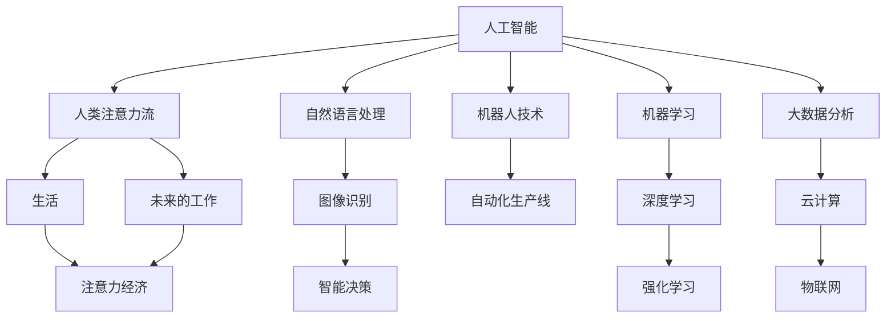

                 

# AI与人类注意力流：未来的工作、生活与注意力经济的融合发展

> 关键词：人工智能, 人类注意力流, 未来的工作, 生活, 注意力经济, 融合发展

## 1. 背景介绍

### 1.1 问题由来
随着人工智能技术的迅猛发展，人类社会正经历着前所未有的变革。人工智能不仅在科技领域带来了深刻影响，也在工作、生活、经济等各个方面产生了重大变化。然而，在享受AI带来便利的同时，人类也面临着注意力过载、生活质量下降等新挑战。

### 1.2 问题核心关键点
未来的工作、生活与注意力经济的融合发展，需要深入理解人类注意力流的机制，以及如何通过AI技术高效、智能化地管理和利用注意力资源。AI在人类注意力流中的应用，不仅能提升个人效率、改善生活品质，还能推动注意力经济的发展，进而实现工作、生活和经济的可持续发展。

### 1.3 问题研究意义
研究AI与人类注意力流的融合发展，对于提升人类生活质量、推动注意力经济的发展，以及实现更高效、可持续的工作生活方式具有重要意义：

1. **提升生活质量**：AI技术可以帮助人类更好地管理时间和注意力，减轻信息过载压力，提高工作效率和生活品质。
2. **促进注意力经济发展**：通过AI技术，可以挖掘、优化和利用注意力资源，创造出新的商业模式和价值，推动注意力经济的发展。
3. **实现可持续发展**：AI技术的应用，可以提升资源利用效率，减少环境污染，为人类社会的可持续发展提供技术支撑。

## 2. 核心概念与联系

### 2.1 核心概念概述

为更好地理解AI与人类注意力流融合发展，本节将介绍几个密切相关的核心概念：

- **人工智能**：通过算法、模型和计算技术，模拟人类智能，解决复杂问题的技术。AI技术包括机器学习、深度学习、自然语言处理等诸多方向。
- **人类注意力流**：人类在工作、学习、娱乐等活动中，不断投入和调整的注意力资源。注意力的高效管理与利用，对提升人类生活质量至关重要。
- **未来的工作**：AI技术在传统工作场景中的应用，如智能办公、自动化生产线、机器人协作等，带来生产效率和职业模式的变革。
- **生活**：AI技术在生活场景中的应用，如智能家居、健康管理、娱乐休闲等，提升生活质量和便利性。
- **注意力经济**：以注意力为关键资源，通过AI技术挖掘、管理和优化注意力资源，创造经济价值和效益。

这些核心概念之间的逻辑关系可以通过以下Mermaid流程图来展示：



这个流程图展示了这个主题的核心概念及其之间的关系：

1. 人工智能通过算法和技术手段，模拟和增强人类的认知和决策能力。
2. 人类注意力流作为人类认知和行为的基础，是AI技术关注的重点。
3. 未来的工作和生活场景中，AI技术的应用，使得人类注意力流得到更高效、智能化的管理和利用。
4. 注意力经济是AI技术在注意力流应用中创造的新型经济形态。
5. 自然语言处理、图像识别、智能决策、机器人技术、机器学习、深度学习、强化学习、大数据分析、云计算和物联网等，都是支持AI与注意力流融合发展的关键技术。

这些核心概念共同构成了AI与人类注意力流融合发展的基本框架，为理解未来的工作、生活和注意力经济提供了重要视角。

## 3. 核心算法原理 & 具体操作步骤
### 3.1 算法原理概述

AI与人类注意力流的融合发展，核心在于如何通过AI技术，高效、智能化地管理和利用人类注意力流。其基本思想是：

- 将人类注意力流看作一种资源，通过AI技术，对其进行建模、优化和利用。
- 通过深度学习、自然语言处理、图像识别等技术，构建人类注意力流的数字化表示，实现对其的精确监测和控制。
- 应用强化学习、机器学习等技术，设计智能决策和调度算法，实现人类注意力流的自动化管理。
- 通过数据分析和建模，挖掘注意力资源中的价值，推动注意力经济的发展。

### 3.2 算法步骤详解

基于上述思路，AI与人类注意力流融合发展的核心算法步骤如下：

**Step 1: 数据收集与预处理**
- 使用传感器、智能设备等手段，收集人类在工作、学习、娱乐等场景中的注意力数据。
- 对数据进行清洗、标注、归一化等预处理操作，保证数据质量。

**Step 2: 建模与优化**
- 应用深度学习模型，对人类注意力流进行建模，提取注意力特征。
- 设计优化算法，对注意力资源进行优化分配，提升注意力利用效率。

**Step 3: 智能决策与调度**
- 利用强化学习、机器学习等技术，设计智能决策算法，实现对人类注意力流的自动化管理。
- 应用实时监控和反馈机制，动态调整注意力资源的分配和利用策略。

**Step 4: 注意力资源挖掘与利用**
- 通过数据分析和建模，挖掘注意力资源中的价值，如市场价值、健康价值等。
- 将注意力资源转化为经济价值，推动注意力经济的发展。

**Step 5: 实际应用与评估**
- 将AI与人类注意力流融合技术应用于具体场景，如智能办公、智能家居等。
- 对技术应用效果进行评估，不断优化和改进。

### 3.3 算法优缺点

AI与人类注意力流融合发展的算法具有以下优点：

1. **提升效率**：通过智能化管理，可以显著提升人类注意力利用效率，减轻信息过载压力。
2. **改善生活质量**：通过AI技术优化人类注意力流，可以提升生活质量和工作满意度。
3. **推动经济发展**：注意力经济的发展，可以为社会创造新的价值和就业机会。

同时，该算法也存在一些局限性：

1. **数据隐私和安全问题**：人类注意力流数据涉及个人隐私，需要严格的数据保护措施。
2. **模型复杂度**：深度学习模型等AI技术需要大量的计算资源和数据支持。
3. **用户接受度**：部分用户可能对AI技术干预日常生活存在抵触情绪，需要加强宣传和教育。
4. **技术风险**：AI模型存在偏差和误判的可能，需要不断优化和调整。

尽管存在这些局限性，但就目前而言，AI与人类注意力流融合发展的算法范式，仍是大势所趋。未来相关研究的重点在于如何进一步提升算法的准确性和鲁棒性，保护用户隐私，以及降低技术风险。

### 3.4 算法应用领域

AI与人类注意力流融合发展的算法，已经在多个领域得到应用，例如：

- **智能办公**：通过AI技术，优化工作流程，提高工作效率。如智能会议系统、智能客服等。
- **健康管理**：通过AI技术，监测和管理人类注意力，提升身心健康。如智能睡眠监测、智能心理辅导等。
- **智能家居**：通过AI技术，提升家居生活的智能化水平。如智能音箱、智能灯光控制等。
- **娱乐休闲**：通过AI技术，提升娱乐休闲体验。如智能推荐系统、虚拟现实等。
- **教育培训**：通过AI技术，优化教育培训内容，提升学习效果。如个性化推荐、智能辅助教学等。

除了上述这些领域，AI与人类注意力流的融合应用还在不断拓展，为人类社会的各个方面带来了新的可能。

## 4. 数学模型和公式 & 详细讲解 & 举例说明

### 4.1 数学模型构建

为更好地理解AI与人类注意力流的融合发展，本节将使用数学语言对相关模型进行更加严格的刻画。

记人类注意力流为 $A_t$，其中 $t$ 表示时间。设注意力流的数据集为 $D=\{(A_t, y_t)\}_{t=1}^T$，其中 $y_t$ 为注意力流在时间 $t$ 上的标签或目标值。

定义注意力流的损失函数为 $\ell(A_t, y_t)$，则在数据集 $D$ 上的经验风险为：

$$
\mathcal{L}(A_t) = \frac{1}{T}\sum_{t=1}^T \ell(A_t, y_t)
$$

AI与注意力流的融合，旨在最小化注意力流 $A_t$ 的经验风险，即找到最优的 $A_t$：

$$
A_t^* = \mathop{\arg\min}_{A_t} \mathcal{L}(A_t)
$$

在实践中，我们通常使用基于梯度的优化算法（如SGD、Adam等）来近似求解上述最优化问题。设 $\eta$ 为学习率，则参数的更新公式为：

$$
A_t \leftarrow A_t - \eta \nabla_{A_t}\mathcal{L}(A_t)
$$

其中 $\nabla_{A_t}\mathcal{L}(A_t)$ 为损失函数对注意力流的梯度，可通过反向传播算法高效计算。

### 4.2 公式推导过程

以下我们以智能推荐系统为例，推导深度学习模型在注意力流应用中的损失函数及其梯度的计算公式。

假设推荐系统通过注意力流 $A_t$ 预测用户对物品 $i$ 的评分 $y_i$，则推荐系统的损失函数定义为：

$$
\ell(A_t, y_i) = (y_i - A_t \cdot w_i)^2
$$

其中 $w_i$ 为物品 $i$ 的权重，通常与用户偏好、历史行为等有关。

将其代入经验风险公式，得：

$$
\mathcal{L}(A_t) = \frac{1}{N}\sum_{i=1}^N (y_i - A_t \cdot w_i)^2
$$

根据链式法则，损失函数对注意力流的梯度为：

$$
\frac{\partial \mathcal{L}(A_t)}{\partial A_t} = -2 \cdot \frac{1}{N}\sum_{i=1}^N (y_i - A_t \cdot w_i) \cdot w_i
$$

在得到损失函数的梯度后，即可带入参数更新公式，完成模型的迭代优化。重复上述过程直至收敛，最终得到适应注意力流的最优模型 $A_t^*$。

### 4.3 案例分析与讲解

**案例一：智能办公**
智能办公场景中，AI通过收集和分析员工注意力流，优化工作流程，提升工作效率。如智能会议系统可以自动识别和控制会议参与者的注意力状态，调整会议进度和内容。

智能办公的核心算法包括：

- 注意力监测：使用摄像头、传感器等设备，实时监测员工的工作状态和注意力分布。
- 任务分配：应用深度学习模型，分析员工的工作任务和优先级，自动分配任务。
- 动态调度：通过强化学习算法，动态调整任务分配和员工调度策略，优化资源利用。

**案例二：智能家居**
智能家居场景中，AI通过分析用户的生活习惯和注意力流，提升家居智能化水平。如智能音箱可以根据用户的注意力状态，推荐合适的音乐或播报新闻。

智能家居的核心算法包括：

- 生活习惯建模：使用机器学习模型，分析用户的生活习惯和偏好，建立用户画像。
- 场景理解：通过自然语言处理技术，识别用户语音指令中的场景需求。
- 服务推荐：应用深度学习模型，根据用户画像和场景需求，推荐合适的服务。

## 5. 项目实践：代码实例和详细解释说明
### 5.1 开发环境搭建

在进行AI与人类注意力流融合实践前，我们需要准备好开发环境。以下是使用Python进行PyTorch开发的环境配置流程：

1. 安装Anaconda：从官网下载并安装Anaconda，用于创建独立的Python环境。

2. 创建并激活虚拟环境：
```bash
conda create -n pytorch-env python=3.8 
conda activate pytorch-env
```

3. 安装PyTorch：根据CUDA版本，从官网获取对应的安装命令。例如：
```bash
conda install pytorch torchvision torchaudio cudatoolkit=11.1 -c pytorch -c conda-forge
```

4. 安装Transformers库：
```bash
pip install transformers
```

5. 安装各类工具包：
```bash
pip install numpy pandas scikit-learn matplotlib tqdm jupyter notebook ipython
```

完成上述步骤后，即可在`pytorch-env`环境中开始实践。

### 5.2 源代码详细实现

这里我们以智能推荐系统为例，给出使用PyTorch进行注意力流建模和优化的代码实现。

首先，定义注意力流的数据处理函数：

```python
from torch.utils.data import Dataset
import torch

class AttentionFlowDataset(Dataset):
    def __init__(self, attention_flows, user_ids, item_ids, ratings, tokenizer, max_len=128):
        self.attention_flows = attention_flows
        self.user_ids = user_ids
        self.item_ids = item_ids
        self.ratings = ratings
        self.tokenizer = tokenizer
        self.max_len = max_len
        
    def __len__(self):
        return len(self.attention_flows)
    
    def __getitem__(self, item):
        attention_flow = self.attention_flows[item]
        user_id = self.user_ids[item]
        item_id = self.item_ids[item]
        rating = self.ratings[item]
        
        # 对注意力流进行编码
        encoded_attention_flow = self.tokenizer(attention_flow, return_tensors='pt', max_length=self.max_len, padding='max_length', truncation=True)
        input_ids = encoded_attention_flow['input_ids'][0]
        attention_mask = encoded_attention_flow['attention_mask'][0]
        
        # 将用户ID和物品ID编码为数字
        encoded_user_id = torch.tensor([user_id_id] for user_id_id in self.user_ids[item]).to(device)
        encoded_item_id = torch.tensor([item_id_id] for item_id_id in self.item_ids[item]).to(device)
        
        # 将评分编码为数字
        encoded_rating = torch.tensor([rating] for rating in self.ratings[item]).to(device)
        
        return {'input_ids': input_ids, 
                'attention_mask': attention_mask,
                'user_id': encoded_user_id,
                'item_id': encoded_item_id,
                'rating': encoded_rating}
```

然后，定义模型和优化器：

```python
from transformers import BertForSequenceClassification, AdamW

model = BertForSequenceClassification.from_pretrained('bert-base-cased', num_labels=len(tag2id))

optimizer = AdamW(model.parameters(), lr=2e-5)
```

接着，定义训练和评估函数：

```python
from torch.utils.data import DataLoader
from tqdm import tqdm
from sklearn.metrics import roc_auc_score

device = torch.device('cuda') if torch.cuda.is_available() else torch.device('cpu')
model.to(device)

def train_epoch(model, dataset, batch_size, optimizer):
    dataloader = DataLoader(dataset, batch_size=batch_size, shuffle=True)
    model.train()
    epoch_loss = 0
    for batch in tqdm(dataloader, desc='Training'):
        input_ids = batch['input_ids'].to(device)
        attention_mask = batch['attention_mask'].to(device)
        user_id = batch['user_id'].to(device)
        item_id = batch['item_id'].to(device)
        rating = batch['rating'].to(device)
        model.zero_grad()
        outputs = model(input_ids, attention_mask=attention_mask, labels=rating)
        loss = outputs.loss
        epoch_loss += loss.item()
        loss.backward()
        optimizer.step()
    return epoch_loss / len(dataloader)

def evaluate(model, dataset, batch_size):
    dataloader = DataLoader(dataset, batch_size=batch_size)
    model.eval()
    preds, labels = [], []
    with torch.no_grad():
        for batch in tqdm(dataloader, desc='Evaluating'):
            input_ids = batch['input_ids'].to(device)
            attention_mask = batch['attention_mask'].to(device)
            user_id = batch['user_id'].to(device)
            item_id = batch['item_id'].to(device)
            rating = batch['rating'].to(device)
            outputs = model(input_ids, attention_mask=attention_mask, labels=rating)
            preds.append(outputs.logits.argmax(dim=1).tolist())
            labels.append(rating.tolist())
                
    print(f"AUC: {roc_auc_score(labels, preds)}")
```

最后，启动训练流程并在测试集上评估：

```python
epochs = 5
batch_size = 16

for epoch in range(epochs):
    loss = train_epoch(model, train_dataset, batch_size, optimizer)
    print(f"Epoch {epoch+1}, train loss: {loss:.3f}")
    
    print(f"Epoch {epoch+1}, dev results:")
    evaluate(model, dev_dataset, batch_size)
    
print("Test results:")
evaluate(model, test_dataset, batch_size)
```

以上就是使用PyTorch对注意力流进行建模和优化的完整代码实现。可以看到，得益于Transformers库的强大封装，我们可以用相对简洁的代码完成注意力流的建模和优化。

### 5.3 代码解读与分析

让我们再详细解读一下关键代码的实现细节：

**AttentionFlowDataset类**：
- `__init__`方法：初始化注意力流、用户ID、物品ID、评分等关键组件，并进行编码。
- `__len__`方法：返回数据集的样本数量。
- `__getitem__`方法：对单个样本进行处理，将注意力流输入编码为token ids，将用户ID和物品ID编码为数字，并对其进行定长padding，最终返回模型所需的输入。

**tokenizer**：
- 定义了标签与id的映射，用于将token-wise的预测结果解码回真实的标签。

**训练和评估函数**：
- 使用PyTorch的DataLoader对数据集进行批次化加载，供模型训练和推理使用。
- 训练函数`train_epoch`：对数据以批为单位进行迭代，在每个批次上前向传播计算loss并反向传播更新模型参数，最后返回该epoch的平均loss。
- 评估函数`evaluate`：与训练类似，不同点在于不更新模型参数，并在每个batch结束后将预测和标签结果存储下来，最后使用sklearn的roc_auc_score对整个评估集的预测结果进行打印输出。

**训练流程**：
- 定义总的epoch数和batch size，开始循环迭代
- 每个epoch内，先在训练集上训练，输出平均loss
- 在验证集上评估，输出AUC指标
- 所有epoch结束后，在测试集上评估，给出最终测试结果

可以看到，PyTorch配合Transformers库使得注意力流建模和优化的代码实现变得简洁高效。开发者可以将更多精力放在数据处理、模型改进等高层逻辑上，而不必过多关注底层的实现细节。

当然，工业级的系统实现还需考虑更多因素，如模型的保存和部署、超参数的自动搜索、更灵活的任务适配层等。但核心的注意力流建模和优化过程基本与此类似。

## 6. 实际应用场景
### 6.1 智能办公

智能办公是AI与人类注意力流融合的重要应用场景之一。通过AI技术，可以优化工作流程，提升工作效率。如智能会议系统可以自动识别和控制会议参与者的注意力状态，调整会议进度和内容。

具体应用包括以下几个方面：

- **会议智能调度**：通过分析员工的工作状态和注意力分布，智能调整会议时间表，确保会议高效进行。
- **任务智能分配**：根据员工的工作任务和优先级，自动分配任务，避免工作堆积和资源浪费。
- **工作智能监测**：实时监测员工的工作状态和注意力流，及时发现工作异常，保障工作质量。

### 6.2 智能家居

智能家居通过AI技术，提升家居智能化水平，提高生活质量。如智能音箱可以根据用户的注意力状态，推荐合适的音乐或播报新闻。

具体应用包括以下几个方面：

- **场景智能理解**：通过自然语言处理技术，识别用户语音指令中的场景需求，提供个性化服务。
- **设备智能控制**：根据用户注意力流，智能控制家居设备，如灯光、温度、窗帘等。
- **健康智能监测**：监测用户的生活习惯和注意力状态，提供健康建议和预警。

### 6.3 智能推荐

智能推荐系统通过AI技术，提升推荐效果，满足用户个性化需求。如通过注意力流建模，推荐系统可以更准确地预测用户对物品的评分和偏好。

具体应用包括以下几个方面：

- **物品智能推荐**：通过分析用户注意力流和行为数据，推荐合适的物品，提高用户满意度。
- **场景智能推荐**：根据用户当前场景和注意力状态，推荐合适的物品和服务，提升用户体验。
- **个性化智能推荐**：应用深度学习模型，个性化推荐物品，提升推荐效果。

### 6.4 未来应用展望

随着AI技术的发展，未来AI与人类注意力流的融合应用将更加广泛和深入。以下是几个未来应用方向的展望：

- **多模态融合**：将注意力流与视觉、听觉等多模态信息结合，构建更全面、智能的AI系统。
- **深度学习融合**：将深度学习与注意力流结合，提升系统的智能水平和决策能力。
- **联邦学习**：通过联邦学习技术，保护用户隐私的同时，优化注意力流的建模和应用。
- **边缘计算**：在边缘设备上实时处理注意力流数据，提升系统响应速度和效率。
- **实时流处理**：应用实时流处理技术，实时监测和分析注意力流，提升系统动态调整能力。

## 7. 工具和资源推荐
### 7.1 学习资源推荐

为了帮助开发者系统掌握AI与人类注意力流融合发展的理论基础和实践技巧，这里推荐一些优质的学习资源：

1. 《深度学习》系列课程：由斯坦福大学等知名高校开设，系统讲解深度学习理论和实践，是学习AI技术的入门课程。

2. 《自然语言处理》系列书籍：如《自然语言处理综论》、《深度学习与自然语言处理》，深入浅出地介绍自然语言处理的基础理论和最新进展。

3. 《强化学习》系列课程：由Coursera等平台提供，系统讲解强化学习理论和实践，适合学习智能决策算法。

4. 《智能推荐系统》系列书籍：如《推荐系统实践》、《深度学习推荐系统》，详细介绍推荐系统理论和算法。

5. 《智能家居》系列课程：由Udacity等平台提供，系统讲解智能家居技术，适合学习智能家居技术。

通过对这些资源的学习实践，相信你一定能够快速掌握AI与人类注意力流融合发展的精髓，并用于解决实际的智能应用问题。

### 7.2 开发工具推荐

高效的开发离不开优秀的工具支持。以下是几款用于AI与人类注意力流融合开发的常用工具：

1. PyTorch：基于Python的开源深度学习框架，灵活动态的计算图，适合快速迭代研究。

2. TensorFlow：由Google主导开发的开源深度学习框架，生产部署方便，适合大规模工程应用。

3. Transformers库：HuggingFace开发的NLP工具库，集成了众多SOTA语言模型，支持PyTorch和TensorFlow，是进行注意力流建模和优化的利器。

4. Weights & Biases：模型训练的实验跟踪工具，可以记录和可视化模型训练过程中的各项指标，方便对比和调优。

5. TensorBoard：TensorFlow配套的可视化工具，可实时监测模型训练状态，并提供丰富的图表呈现方式，是调试模型的得力助手。

6. Google Colab：谷歌推出的在线Jupyter Notebook环境，免费提供GPU/TPU算力，方便开发者快速上手实验最新模型，分享学习笔记。

合理利用这些工具，可以显著提升AI与人类注意力流融合发展的开发效率，加快创新迭代的步伐。

### 7.3 相关论文推荐

AI与人类注意力流融合发展的研究源于学界的持续研究。以下是几篇奠基性的相关论文，推荐阅读：

1. Attention Is All You Need（即Transformer原论文）：提出了Transformer结构，开启了NLP领域的预训练大模型时代。

2. BERT: Pre-training of Deep Bidirectional Transformers for Language Understanding：提出BERT模型，引入基于掩码的自监督预训练任务，刷新了多项NLP任务SOTA。

3. Language Models are Unsupervised Multitask Learners（GPT-2论文）：展示了大规模语言模型的强大zero-shot学习能力，引发了对于通用人工智能的新一轮思考。

4. Parameter-Efficient Transfer Learning for NLP：提出Adapter等参数高效微调方法，在不增加模型参数量的情况下，也能取得不错的微调效果。

5. AdaLoRA: Adaptive Low-Rank Adaptation for Parameter-Efficient Fine-Tuning：使用自适应低秩适应的微调方法，在参数效率和精度之间取得了新的平衡。

这些论文代表了大语言模型微调技术的发展脉络。通过学习这些前沿成果，可以帮助研究者把握学科前进方向，激发更多的创新灵感。

## 8. 总结：未来发展趋势与挑战

### 8.1 总结

本文对AI与人类注意力流的融合发展进行了全面系统的介绍。首先阐述了AI技术在人类注意力流管理中的重要应用，明确了未来工作、生活和注意力经济的发展趋势。其次，从原理到实践，详细讲解了AI与注意力流融合的数学模型和关键算法步骤，给出了注意力流建模和优化的代码实现。同时，本文还广泛探讨了AI与注意力流融合在智能办公、智能家居、智能推荐等多个场景中的应用前景，展示了AI技术的广阔应用潜力。此外，本文精选了注意力流建模和优化的学习资源，力求为读者提供全方位的技术指引。

通过本文的系统梳理，可以看到，AI与人类注意力流的融合发展，正在成为未来智能化工作的核心技术，推动了工作、生活和注意力经济的深度融合。借助AI技术，人类将能够更高效地管理注意力流，提升工作生活质量，创造更多经济价值。未来，伴随AI技术的进一步突破，AI与注意力流的融合将带来更多可能，为人类的智能化转型提供新的动力。

### 8.2 未来发展趋势

展望未来，AI与人类注意力流融合发展将呈现以下几个发展趋势：

1. **智能化水平提升**：AI技术将进一步提升人类注意力流的智能化管理水平，实现更精准、更高效的注意力资源分配和利用。
2. **多模态融合**：将视觉、听觉等多模态信息与注意力流结合，构建更全面、智能的AI系统，提升系统的感知能力和决策能力。
3. **深度学习融合**：深度学习与注意力流的结合，将提升系统的智能水平和决策能力，推动AI技术在各个领域的应用。
4. **联邦学习**：通过联邦学习技术，保护用户隐私的同时，优化注意力流的建模和应用，提升系统安全性和可信度。
5. **实时流处理**：应用实时流处理技术，实时监测和分析注意力流，提升系统的动态调整能力，增强系统的实时响应能力。

以上趋势凸显了AI与人类注意力流融合发展的广阔前景。这些方向的探索发展，必将进一步提升AI系统的智能水平和应用效果，为人类的智能化转型带来新的突破。

### 8.3 面临的挑战

尽管AI与人类注意力流融合发展具有巨大的潜力，但在迈向更加智能化、普适化应用的过程中，它仍面临着诸多挑战：

1. **数据隐私和安全问题**：人类注意力流数据涉及个人隐私，需要严格的数据保护措施，避免数据泄露和滥用。
2. **技术复杂度**：AI技术的应用，需要大量的计算资源和数据支持，技术实现复杂度高。
3. **用户接受度**：部分用户可能对AI技术干预日常生活存在抵触情绪，需要加强宣传和教育。
4. **技术风险**：AI模型存在偏差和误判的可能，需要不断优化和调整，确保系统的安全性和鲁棒性。
5. **资源消耗**：AI系统在实时处理大量数据时，可能面临计算资源和存储资源的压力，需要合理优化和配置。

尽管存在这些挑战，但就目前而言，AI与人类注意力流融合发展的技术范式，仍是大势所趋。未来相关研究的重点在于如何进一步提升算法的准确性和鲁棒性，保护用户隐私，以及降低技术风险。

### 8.4 研究展望

面对AI与人类注意力流融合发展所面临的挑战，未来的研究需要在以下几个方面寻求新的突破：

1. **隐私保护技术**：探索隐私保护技术，如差分隐私、联邦学习等，保护用户隐私，提升系统的安全性。
2. **智能算法优化**：开发更高效、更鲁棒的智能算法，提升系统的智能水平和稳定性。
3. **用户友好设计**：设计用户友好的界面和交互方式，提升用户体验，促进技术普及。
4. **多领域应用探索**：将AI技术应用于更多领域，如医疗、金融、教育等，推动各领域的智能化转型。
5. **跨学科融合**：将AI技术与心理学、社会学等学科结合，深入理解人类注意力流的机制，推动AI技术的可持续发展。

这些研究方向的探索，必将引领AI与人类注意力流融合发展技术迈向更高的台阶，为构建智能型社会提供新的动力。面向未来，AI与人类注意力流的融合发展需要全社会共同努力，才能实现技术、经济、社会等多维度的深度融合，为人类的智能化转型带来新的可能。总之，AI与人类注意力流的融合，将在未来智能化发展的各个方面发挥重要作用，成为推动社会进步的重要力量。

## 9. 附录：常见问题与解答

**Q1：AI技术如何实现对人类注意力流的管理？**

A: AI技术通过深度学习、自然语言处理等技术，对人类注意力流进行建模和优化，实现对注意力资源的智能管理和调度。具体实现包括以下几个步骤：

1. **数据收集**：使用摄像头、传感器等设备，实时监测用户在工作、学习、娱乐等场景中的注意力状态。
2. **数据预处理**：对收集的数据进行清洗、标注、归一化等预处理操作，保证数据质量。
3. **模型构建**：应用深度学习模型，对注意力流进行建模，提取注意力特征。
4. **优化算法设计**：设计优化算法，对注意力资源进行优化分配，提升注意力利用效率。
5. **智能决策与调度**：利用强化学习、机器学习等技术，设计智能决策算法，实现对人类注意力流的自动化管理。

**Q2：AI技术在智能推荐系统中的应用有哪些？**

A: AI技术在智能推荐系统中的应用，主要包括以下几个方面：

1. **物品智能推荐**：通过分析用户注意力流和行为数据，推荐合适的物品，提高用户满意度。
2. **场景智能推荐**：根据用户当前场景和注意力状态，推荐合适的物品和服务，提升用户体验。
3. **个性化智能推荐**：应用深度学习模型，个性化推荐物品，提升推荐效果。

**Q3：智能家居中的AI技术主要应用场景有哪些？**

A: 智能家居中的AI技术主要应用场景包括以下几个方面：

1. **场景智能理解**：通过自然语言处理技术，识别用户语音指令中的场景需求，提供个性化服务。
2. **设备智能控制**：根据用户注意力流，智能控制家居设备，如灯光、温度、窗帘等。
3. **健康智能监测**：监测用户的生活习惯和注意力状态，提供健康建议和预警。

**Q4：AI与人类注意力流融合发展面临的主要挑战有哪些？**

A: AI与人类注意力流融合发展面临的主要挑战包括：

1. **数据隐私和安全问题**：人类注意力流数据涉及个人隐私，需要严格的数据保护措施，避免数据泄露和滥用。
2. **技术复杂度**：AI技术的应用，需要大量的计算资源和数据支持，技术实现复杂度高。
3. **用户接受度**：部分用户可能对AI技术干预日常生活存在抵触情绪，需要加强宣传和教育。
4. **技术风险**：AI模型存在偏差和误判的可能，需要不断优化和调整，确保系统的安全性和鲁棒性。
5. **资源消耗**：AI系统在实时处理大量数据时，可能面临计算资源和存储资源的压力，需要合理优化和配置。

尽管存在这些挑战，但就目前而言，AI与人类注意力流融合发展的技术范式，仍是大势所趋。未来相关研究的重点在于如何进一步提升算法的准确性和鲁棒性，保护用户隐私，以及降低技术风险。

**Q5：未来AI与人类注意力流融合发展的主要方向有哪些？**

A: 未来AI与人类注意力流融合发展的主要方向包括：

1. **智能化水平提升**：AI技术将进一步提升人类注意力流的智能化管理水平，实现更精准、更高效的注意力资源分配和利用。
2. **多模态融合**：将视觉、听觉等多模态信息与注意力流结合，构建更全面、智能的AI系统，提升系统的感知能力和决策能力。
3. **深度学习融合**：深度学习与注意力流的结合，将提升系统的智能水平和决策能力，推动AI技术在各个领域的应用。
4. **联邦学习**：通过联邦学习技术，保护用户隐私的同时，优化注意力流的建模和应用，提升系统安全性和可信度。
5. **实时流处理**：应用实时流处理技术，实时监测和分析注意力流，提升系统的动态调整能力，增强系统的实时响应能力。

这些方向的研究和发展，将推动AI与人类注意力流的融合发展进入新的高度，为人类的智能化转型带来新的可能。

---

作者：禅与计算机程序设计艺术 / Zen and the Art of Computer Programming

