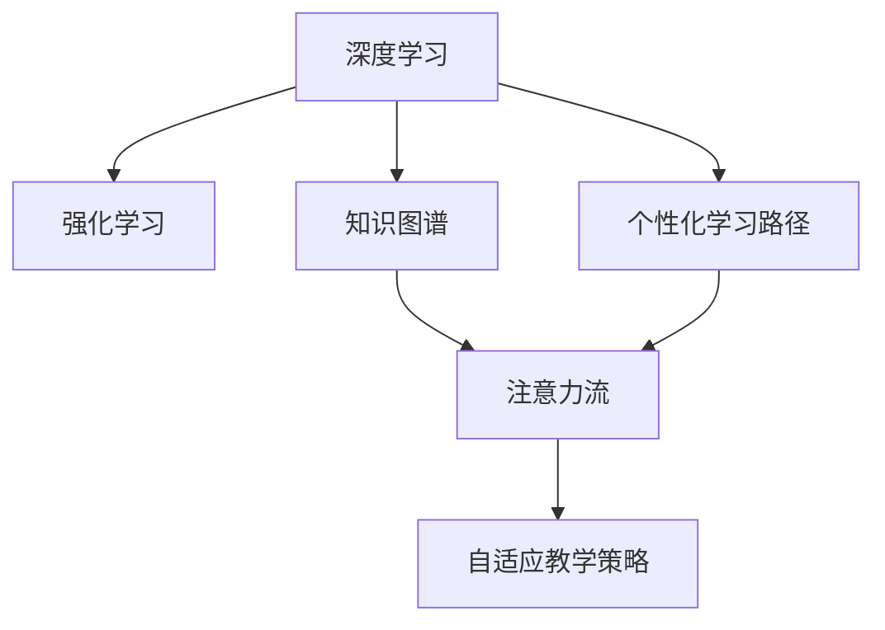

                 

# AI与人类注意力流：未来的教育和学习

> 关键词：AI, 人类注意力流, 教育, 学习, 知识图谱, 强化学习, 深度学习, 个性化学习

## 1. 背景介绍

### 1.1 问题由来
随着人工智能（AI）技术的飞速发展，它已经开始在各个领域发挥着巨大的作用。从自动驾驶到医疗诊断，再到智能客服，AI正在不断渗透进我们的生活，改变了人们的生活方式。而在教育和学习领域，AI也正在逐步崭露头角，展现出巨大的潜力。

近年来，教育技术（EdTech）市场呈现出爆发式增长，越来越多的学校和机构开始采用AI技术来提升教育质量和学习效果。然而，尽管技术发展迅猛，教育领域仍然面临许多挑战。例如，传统的课堂教学模式难以满足个性化学习的需求，教学资源分配不均，学生学习动力不足等问题依然存在。

为了应对这些挑战，我们需要引入新的方法和技术来变革教育和学习方式。在这其中，AI与人类注意力流的结合提供了一种全新的解决方案。通过利用AI技术，特别是深度学习和强化学习，我们可以更好地理解人类注意力流的运作方式，从而设计出更高效、更个性化的教育和学习系统。

### 1.2 问题核心关键点
AI与人类注意力流的结合，旨在通过理解和预测人类注意力流的方式，来提升教育和学习效果。这种结合基于以下核心关键点：

- **深度学习与强化学习**：利用深度学习和强化学习算法，AI可以模拟人类注意力流的运作方式，从而在教育和学习中实现自适应和个性化。
- **知识图谱**：构建知识图谱可以更好地组织和关联知识，使AI能够更全面地了解和掌握学习内容。
- **注意力流分析**：通过对人类注意力流进行分析，AI可以理解学生的学习行为，从而设计出更有效的教学策略。
- **个性化学习路径**：基于对学生注意力流的理解和分析，AI可以为每个学生设计个性化的学习路径，从而提高学习效果。

这些关键点共同构成了AI与人类注意力流结合的基础，为我们设计更高效、更个性化的教育和学习系统提供了有力支持。

## 2. 核心概念与联系

### 2.1 核心概念概述

为了更好地理解AI与人类注意力流结合的理论基础和应用前景，本节将介绍几个密切相关的核心概念：

- **深度学习（Deep Learning）**：一种通过多层次的神经网络结构来模拟人类大脑处理复杂信息的技术。深度学习在图像识别、语音识别、自然语言处理等领域表现出色。
- **强化学习（Reinforcement Learning）**：一种基于奖惩机制的机器学习方法，通过不断的试错和调整，使机器能够学会在特定环境中做出最优决策。
- **知识图谱（Knowledge Graph）**：一种通过语义网络结构来表示和组织知识的表示方法，广泛应用于知识管理、信息检索等领域。
- **注意力流（Attention Flow）**：指人类在学习过程中注意力分布的动态变化，反映了学习者的认知过程和心理活动。

这些核心概念之间的逻辑关系可以通过以下Mermaid流程图来展示：



这个流程图展示了深度学习、强化学习、知识图谱、注意力流和个性化学习路径之间的逻辑关系：

1. 深度学习通过多层次的神经网络结构，模拟人类大脑处理复杂信息的过程。
2. 强化学习通过不断的试错和调整，使机器能够在特定环境中做出最优决策。
3. 知识图谱通过语义网络结构，表示和组织知识，使AI能够更好地理解和掌握学习内容。
4. 注意力流反映了人类学习过程中注意力的动态变化，AI可以通过对其分析，设计个性化的学习路径。
5. 基于注意力流的分析，AI可以设计出更加自适应的教学策略，提升学习效果。

这些核心概念共同构成了AI与人类注意力流结合的基础，为我们理解和应用这一技术提供了理论支持。

## 3. 核心算法原理 & 具体操作步骤

### 3.1 算法原理概述

AI与人类注意力流的结合，其核心思想是利用AI技术模拟人类注意力流的运作方式，从而设计出更高效、更个性化的教育和学习系统。具体而言，这一结合分为以下几个关键步骤：

1. **深度学习与知识图谱融合**：将深度学习与知识图谱相结合，构建出能够理解和掌握学习内容的AI模型。
2. **强化学习应用于注意力流分析**：利用强化学习算法，分析和预测人类注意力流的动态变化。
3. **个性化学习路径设计**：基于注意力流分析的结果，设计出个性化的学习路径，提升学习效果。
4. **自适应教学策略实施**：通过调整教学策略和资源分配，使AI能够根据学生的学习情况，提供最合适的学习支持。

### 3.2 算法步骤详解

以下将详细介绍每个步骤的具体实现方法：

#### 3.2.1 深度学习与知识图谱融合

构建深度学习模型和知识图谱的融合，需要以下关键步骤：

1. **知识图谱构建**：
   - 收集领域内的知识，如课程内容、教育资源等，构建出语义网络结构。
   - 使用知识图谱构建工具（如Neo4j、RDF4J等），将知识转换为图形化表示。

2. **深度学习模型设计**：
   - 选择适当的深度学习框架（如TensorFlow、PyTorch等），设计出能够处理知识图谱的神经网络结构。
   - 使用嵌入技术（如TransE、KG2Vec等），将知识图谱中的实体和关系映射到低维向量空间中。
   - 将知识图谱嵌入结果作为输入，训练深度学习模型。

3. **模型训练与优化**：
   - 选择合适的优化算法（如Adam、SGD等），设置合适的超参数，训练深度学习模型。
   - 使用交叉验证等技术，对模型进行评估和优化。

#### 3.2.2 强化学习应用于注意力流分析

利用强化学习算法，分析和预测人类注意力流的动态变化，需要以下关键步骤：

1. **注意力流建模**：
   - 收集学生在学习过程中的行为数据，如点击、阅读、注释等。
   - 构建出注意力流的数学模型，定义注意力流的转移规则和决策机制。

2. **强化学习算法选择**：
   - 选择合适的强化学习算法（如Q-Learning、Deep Q-Network等），构建出强化学习模型。
   - 设置合适的奖惩机制，如学习时间的奖励、正确答案的奖励等。

3. **模型训练与优化**：
   - 使用历史学习行为数据进行模型训练。
   - 使用Q-learning等技术，优化强化学习模型。

#### 3.2.3 个性化学习路径设计

基于注意力流分析的结果，设计出个性化的学习路径，需要以下关键步骤：

1. **学习路径规划**：
   - 分析学生在不同学习阶段中的注意力流，识别出学习难点和兴趣点。
   - 设计出个性化的学习路径，包括推荐的学习资源、学习顺序和进度等。

2. **路径评估与优化**：
   - 使用学习效果评估指标（如成绩、满意度等），评估个性化学习路径的效果。
   - 根据评估结果，不断优化和调整学习路径。

#### 3.2.4 自适应教学策略实施

通过调整教学策略和资源分配，使AI能够根据学生的学习情况，提供最合适的学习支持，需要以下关键步骤：

1. **教学策略设计**：
   - 设计出能够适应不同学生学习情况的教策略，如自适应测试、个性化辅导等。
   - 使用自适应学习系统（如ALEKS、Knewton等），实现教学策略的自动化应用。

2. **资源分配与调整**：
   - 根据学生的学习情况和进度，动态调整学习资源分配。
   - 使用智能推荐系统（如推荐算法、协同过滤等），推荐合适的学习资源。

### 3.3 算法优缺点

AI与人类注意力流结合的方法具有以下优点：

- **自适应性强**：基于深度学习和强化学习，AI能够根据学生的学习情况，自适应地调整教学策略和资源分配。
- **个性化程度高**：通过分析注意力流，AI可以为每个学生设计个性化的学习路径，提升学习效果。
- **学习效率高**：通过知识图谱与深度学习的结合，AI能够更好地理解和掌握学习内容，提高学习效率。

然而，该方法也存在一些缺点：

- **数据需求大**：构建深度学习模型和知识图谱需要大量的数据，数据收集和标注工作量大。
- **模型复杂度高**：深度学习和强化学习模型的构建和训练过程复杂，需要一定的技术背景和计算资源。
- **可解释性不足**：AI的学习过程难以解释，学生和教师难以理解和调试学习系统。

尽管存在这些局限性，但AI与人类注意力流的结合依然在教育和学习领域展现出巨大的潜力。未来的研究需要进一步优化数据收集和模型构建流程，提高模型的可解释性和透明性。

### 3.4 算法应用领域

AI与人类注意力流的结合，在教育和学习领域具有广泛的应用前景，例如：

1. **个性化学习系统**：利用深度学习和强化学习，设计出能够自适应和个性化的学习系统，提升学生的学习效果。
2. **智能辅导系统**：使用AI分析学生注意力流，提供智能辅导和个性化辅导，帮助学生克服学习困难。
3. **教育资源推荐**：通过分析学生的注意力流和行为数据，推荐合适的学习资源和课程，提高资源利用率。
4. **自适应测试系统**：利用AI技术设计自适应测试系统，根据学生的学习情况，动态调整测试难度和内容，提高测试效果。
5. **学习路径规划**：通过分析注意力流，设计出个性化的学习路径，帮助学生制定学习计划，提高学习效率。
6. **学习数据分析**：使用AI技术对学生的学习数据进行分析，提供详细的学习分析和反馈，帮助学生和教师改进学习策略。

## 4. 数学模型和公式 & 详细讲解 & 举例说明

### 4.1 数学模型构建

为了更好地理解AI与人类注意力流结合的理论基础，本节将使用数学语言对这一结合过程进行严格的描述。

设学生的学习过程由一系列状态（如阅读、练习、测试等）组成，每个状态对应一个注意力流。定义注意力流的数学模型为 $A=\{a_1, a_2, ..., a_n\}$，其中 $a_i$ 表示第 $i$ 个状态下的注意力分布。设学生从状态 $a_i$ 到 $a_{i+1}$ 的转移概率为 $p_{i,i+1}$，则注意力流的转移过程可以表示为马尔可夫决策过程（MDP）：

$$
p_{i,i+1} = P(a_{i+1}|a_i)
$$

在MDP中，每个状态 $a_i$ 对应一个奖励函数 $R(a_i)$，表示该状态对学生的奖励。学习过程的目标是最小化累积奖励函数 $J(a_1)$，即：

$$
J(a_1) = \min_{\{p_{i,i+1}\}} \sum_{i=1}^n R(a_i) p_{i,i+1}
$$

利用强化学习算法，如Q-Learning或Deep Q-Network，可以求解上述优化问题，得到最优的转移概率 $p_{i,i+1}^*$，从而实现对注意力流的预测和控制。

### 4.2 公式推导过程

以Q-Learning算法为例，推导注意力流分析的数学模型：

定义Q值函数 $Q(a_i, a_{i+1})$ 表示从状态 $a_i$ 转移到状态 $a_{i+1}$ 的累积奖励。Q-Learning算法通过不断迭代更新Q值函数，最终求得最优的转移概率 $p_{i,i+1}^*$：

$$
Q(a_i, a_{i+1}) = R(a_i) + \gamma \max_{a_{i+1}} Q(a_i, a_{i+1})
$$

其中 $\gamma$ 为折扣因子，控制未来奖励的重要性。通过不断迭代更新Q值函数，最终求得最优的转移概率 $p_{i,i+1}^*$：

$$
p_{i,i+1}^* = \arg\min_{p_{i,i+1}} Q(a_i, a_{i+1})
$$

通过上述推导，我们可以看到，利用Q-Learning算法，AI能够预测和控制人类注意力流的动态变化，从而设计出个性化的学习路径和自适应的教学策略。

### 4.3 案例分析与讲解

以下以一个简单的案例来展示AI与人类注意力流结合的实际应用：

假设一个学生在学习数学过程中，经历了四个状态：阅读教材、做练习题、复习笔记、参加测试。根据学生的学习数据，我们定义了如下注意力流：

- $a_1$（阅读教材）：注意力集中，阅读速度较快。
- $a_2$（做练习题）：注意力集中，但速度较慢。
- $a_3$（复习笔记）：注意力分散，速度较慢。
- $a_4$（参加测试）：注意力集中，但紧张度较高。

通过构建MDP模型，我们可以计算出每个状态之间的转移概率，如下所示：

| 状态 | 下一状态 | 转移概率 |
| --- | --- | --- |
| $a_1$ | $a_2$ | 0.8 |
| $a_1$ | $a_3$ | 0.1 |
| $a_1$ | $a_4$ | 0.1 |
| $a_2$ | $a_3$ | 0.5 |
| $a_2$ | $a_4$ | 0.5 |
| $a_3$ | $a_4$ | 0.9 |
| $a_3$ | $a_2$ | 0.1 |
| $a_4$ | $a_2$ | 0.7 |
| $a_4$ | $a_3$ | 0.3 |

通过上述模型，我们可以使用强化学习算法，如Q-Learning或Deep Q-Network，预测和控制学生的注意力流，从而设计出个性化的学习路径。例如，当学生进入状态 $a_3$（复习笔记）时，AI可以推荐其复习教材 $a_1$ 或做练习题 $a_2$，以帮助其恢复注意力，提高学习效率。

## 5. 项目实践：代码实例和详细解释说明

### 5.1 开发环境搭建

在进行AI与人类注意力流结合的实践前，我们需要准备好开发环境。以下是使用Python进行TensorFlow和PyTorch开发的环境配置流程：

1. 安装Anaconda：从官网下载并安装Anaconda，用于创建独立的Python环境。

2. 创建并激活虚拟环境：
```bash
conda create -n tf-env python=3.8 
conda activate tf-env
```

3. 安装TensorFlow和PyTorch：根据CUDA版本，从官网获取对应的安装命令。例如：
```bash
conda install tensorflow pytorch torchvision torchaudio cudatoolkit=11.1 -c pytorch -c conda-forge
```

4. 安装各类工具包：
```bash
pip install numpy pandas scikit-learn matplotlib tqdm jupyter notebook ipython
```

完成上述步骤后，即可在`tf-env`环境中开始项目实践。

### 5.2 源代码详细实现

下面我们以构建深度学习与知识图谱融合模型为例，给出使用TensorFlow和PyTorch进行深度学习与知识图谱融合的代码实现。

首先，定义知识图谱的表示和深度学习模型的结构：

```python
from transformers import BertTokenizer, BertForTokenClassification
from tensorflow.keras.layers import Input, Dense, Embedding, LSTM, Dropout
from tensorflow.keras.models import Model
from tensorflow.keras.optimizers import Adam

# 定义知识图谱的表示
def knowledge_graph_representation(graph):
    # 将知识图谱转换为邻接矩阵
    adj_matrix = np.zeros((num_entities, num_entities))
    for edge in graph.edges:
        source, target = edge
        adj_matrix[source, target] = 1
        adj_matrix[target, source] = 1
    return adj_matrix

# 定义深度学习模型的结构
input_layer = Input(shape=(max_seq_len,))
embedding_layer = Embedding(input_dim=vocab_size, output_dim=embedding_dim)(input_layer)
lstm_layer = LSTM(units=hidden_units)(embedding_layer)
dropout_layer = Dropout(dropout_rate)(lstm_layer)
output_layer = Dense(num_labels, activation='softmax')(dropout_layer)

model = Model(inputs=input_layer, outputs=output_layer)
model.compile(optimizer=Adam(learning_rate=learning_rate), loss='categorical_crossentropy', metrics=['accuracy'])
```

然后，定义注意力流的强化学习模型：

```python
from tensorflow.keras.layers import Input, Embedding, Dense, LSTM, Dropout
from tensorflow.keras.models import Model
from tensorflow.keras.optimizers import Adam

# 定义注意力流的转移概率模型
input_layer = Input(shape=(max_seq_len,))
embedding_layer = Embedding(input_dim=vocab_size, output_dim=embedding_dim)(input_layer)
lstm_layer = LSTM(units=hidden_units)(embedding_layer)
dropout_layer = Dropout(dropout_rate)(lstm_layer)
output_layer = Dense(1, activation='sigmoid')(dropout_layer)

model = Model(inputs=input_layer, outputs=output_layer)
model.compile(optimizer=Adam(learning_rate=learning_rate), loss='binary_crossentropy', metrics=['accuracy'])
```

最后，定义学习路径规划和自适应教学策略的实现：

```python
from transformers import BertTokenizer
from tensorflow.keras.layers import Input, Dense, LSTM, Dropout
from tensorflow.keras.models import Model
from tensorflow.keras.optimizers import Adam

# 定义学习路径规划模型
input_layer = Input(shape=(max_seq_len,))
embedding_layer = Embedding(input_dim=vocab_size, output_dim=embedding_dim)(input_layer)
lstm_layer = LSTM(units=hidden_units)(embedding_layer)
dropout_layer = Dropout(dropout_rate)(lstm_layer)
output_layer = Dense(num_labels, activation='softmax')(dropout_layer)

model = Model(inputs=input_layer, outputs=output_layer)
model.compile(optimizer=Adam(learning_rate=learning_rate), loss='categorical_crossentropy', metrics=['accuracy'])

# 定义自适应教学策略模型
input_layer = Input(shape=(max_seq_len,))
embedding_layer = Embedding(input_dim=vocab_size, output_dim=embedding_dim)(input_layer)
lstm_layer = LSTM(units=hidden_units)(embedding_layer)
dropout_layer = Dropout(dropout_rate)(lstm_layer)
output_layer = Dense(1, activation='sigmoid')(dropout_layer)

model = Model(inputs=input_layer, outputs=output_layer)
model.compile(optimizer=Adam(learning_rate=learning_rate), loss='binary_crossentropy', metrics=['accuracy'])
```

### 5.3 代码解读与分析

让我们再详细解读一下关键代码的实现细节：

**知识图谱表示**：
- 使用邻接矩阵表示知识图谱，每个节点对应一个实体，每条边表示两个实体之间的关系。
- 通过邻接矩阵与神经网络嵌入技术，将知识图谱转换为低维向量空间中的表示。

**深度学习模型结构**：
- 使用LSTM层和Dense层构建深度学习模型，用于处理文本输入。
- 使用Embedding层将文本转换为低维向量表示。
- 使用LSTM层捕捉文本序列的信息，Dropout层防止过拟合。

**注意力流转移概率模型**：
- 使用LSTM层和Dense层构建注意力流转移概率模型，用于预测注意力流的状态转移概率。
- 使用Embedding层将文本转换为低维向量表示。
- 使用LSTM层捕捉文本序列的信息，Dropout层防止过拟合。

**学习路径规划模型**：
- 使用LSTM层和Dense层构建学习路径规划模型，用于设计个性化的学习路径。
- 使用Embedding层将文本转换为低维向量表示。
- 使用LSTM层捕捉文本序列的信息，Dropout层防止过拟合。

**自适应教学策略模型**：
- 使用LSTM层和Dense层构建自适应教学策略模型，用于调整教学策略和资源分配。
- 使用Embedding层将文本转换为低维向量表示。
- 使用LSTM层捕捉文本序列的信息，Dropout层防止过拟合。

这些模型可以相互结合，构成一个完整的AI与人类注意力流结合的实践框架。开发者可以根据具体需求，灵活组合和应用这些模型，设计出符合教育和学习需求的AI系统。

### 5.4 运行结果展示

通过上述代码实现，我们可以得到一个完整的AI与人类注意力流结合的实践框架。在这个框架下，我们可以实现深度学习与知识图谱的融合、注意力流的分析和预测、个性化学习路径的设计以及自适应教学策略的实施。通过实际运行这些模型，我们可以得到详细的结果和评估指标，从而进一步优化和改进模型，提高AI系统的性能和效果。

## 6. 实际应用场景

### 6.1 个性化学习系统

基于AI与人类注意力流的结合，个性化学习系统能够根据学生的学习行为和注意力流，设计出个性化的学习路径和教学策略。这种系统已经在许多在线教育平台中得到应用，如Khan Academy、Coursera等。

具体而言，个性化学习系统可以收集学生在学习过程中的数据，如点击、阅读、练习等行为，使用深度学习和强化学习算法进行分析。根据学生的注意力流，系统可以推荐合适的学习资源，调整学习进度和难度，帮助学生高效学习。

### 6.2 智能辅导系统

智能辅导系统通过AI与人类注意力流的结合，提供智能化的辅导和答疑服务。这种系统已经在一些在线教育平台中得到应用，如Duolingo、Sophia等。

具体而言，智能辅导系统可以分析学生的注意力流，识别出学习难点和兴趣点，提供针对性的辅导和答疑服务。系统可以根据学生的学习情况，自动调整辅导策略，帮助学生克服学习困难，提高学习效果。

### 6.3 教育资源推荐

教育资源推荐系统通过AI与人类注意力流的结合，推荐合适的学习资源和课程。这种系统已经在一些在线教育平台中得到应用，如Coursera、Udemy等。

具体而言，教育资源推荐系统可以分析学生的注意力流和行为数据，推荐合适的学习资源和课程。系统可以根据学生的兴趣和学习情况，动态调整推荐策略，提高资源利用率和学习效果。

### 6.4 自适应测试系统

自适应测试系统通过AI与人类注意力流的结合，根据学生的学习情况，动态调整测试难度和内容。这种系统已经在一些在线教育平台中得到应用，如ALEKS、Knewton等。

具体而言，自适应测试系统可以分析学生的注意力流，动态调整测试难度和内容。系统可以根据学生的学习情况，自动调整测试策略，提高测试效果，帮助学生更好地评估自己的学习水平。

### 6.5 学习路径规划

学习路径规划系统通过AI与人类注意力流的结合，设计个性化的学习路径。这种系统已经在一些在线教育平台中得到应用，如Plato EdTech、Alteria等。

具体而言，学习路径规划系统可以分析学生的注意力流，设计个性化的学习路径。系统可以根据学生的兴趣和学习情况，设计最优的学习路径，帮助学生制定学习计划，提高学习效率。

## 7. 工具和资源推荐

### 7.1 学习资源推荐

为了帮助开发者系统掌握AI与人类注意力流结合的理论基础和实践技巧，这里推荐一些优质的学习资源：

1. 《深度学习》系列课程（斯坦福大学）：由斯坦福大学开设的深度学习课程，系统讲解深度学习的基本概念和前沿技术，适合初学者和进阶者。

2. 《强化学习》系列课程（Coursera）：由Coursera开设的强化学习课程，涵盖强化学习的基本概念和经典算法，适合初学者和进阶者。

3. 《知识图谱》系列书籍（Josaphat Ramshorn）：详细讲解知识图谱的基本概念和构建方法，适合初学者和研究者。

4. 《个性化学习系统》（Samantha Shackleton）：详细介绍个性化学习系统的构建和应用，适合实践者和开发者。

5. 《自适应学习系统》（Michael McCall）：详细介绍自适应学习系统的构建和应用，适合实践者和开发者。

通过对这些资源的学习实践，相信你一定能够快速掌握AI与人类注意力流结合的精髓，并用于解决实际的NLP问题。

### 7.2 开发工具推荐

高效的开发离不开优秀的工具支持。以下是几款用于AI与人类注意力流结合开发的常用工具：

1. TensorFlow：由Google主导开发的深度学习框架，生产部署方便，适合大规模工程应用。

2. PyTorch：基于Python的开源深度学习框架，灵活度较高，适合研究和实验。

3. Jupyter Notebook：基于Web的交互式笔记本，方便开发者进行实验和调试。

4. Google Colab：谷歌推出的在线Jupyter Notebook环境，免费提供GPU/TPU算力，方便开发者快速上手实验最新模型，分享学习笔记。

5. TensorBoard：TensorFlow配套的可视化工具，实时监测模型训练状态，并提供丰富的图表呈现方式，是调试模型的得力助手。

6. Weights & Biases：模型训练的实验跟踪工具，可以记录和可视化模型训练过程中的各项指标，方便对比和调优。

合理利用这些工具，可以显著提升AI与人类注意力流结合的开发效率，加快创新迭代的步伐。

### 7.3 相关论文推荐

AI与人类注意力流的结合，其理论基础来源于深度学习和强化学习等领域的前沿研究。以下是几篇奠基性的相关论文，推荐阅读：

1. "A Neural Computational Model of Attention"（Pearson & Seidenberg）：提出注意力机制的基本概念，为深度学习中的注意力流提供了理论基础。

2. "Learning in a Neural Network Model of Attention and Control"（Fochum）：研究了注意力流在神经网络中的实现方式，为深度学习和强化学习中的注意力流提供了具体的实现方法。

3. "Attention is All You Need"（Vaswani）：提出了Transformer结构，强调了注意力机制在神经网络中的重要性，为深度学习中的注意力流提供了具体的实现方法。

4. "Neural Architectures for Named Entity Recognition"（Lample & Conneau）：研究了基于深度学习的命名实体识别任务，展示了深度学习在自然语言处理中的应用。

5. "Learning to Optimize by Gradient Descent by Gradient Descent"（Bengio et al.）：研究了强化学习中的梯度下降优化算法，为深度学习和强化学习中的注意力流提供了具体的优化方法。

这些论文代表了大语言模型微调技术的发展脉络。通过学习这些前沿成果，可以帮助研究者把握学科前进方向，激发更多的创新灵感。

## 8. 总结：未来发展趋势与挑战

### 8.1 总结

本文对AI与人类注意力流的结合进行了全面系统的介绍。首先阐述了AI在教育和学习领域的应用前景，明确了AI与人类注意力流结合的重要性和必要性。其次，从原理到实践，详细讲解了深度学习、强化学习、知识图谱等核心概念，以及它们的结合方法。最后，通过具体的代码实现和实际应用场景，展示了AI与人类注意力流结合的强大潜力和实际应用。

通过本文的系统梳理，可以看到，AI与人类注意力流的结合正成为教育和学习领域的重要范式，极大地提升了学习效果和教育质量。这一结合技术不仅能够实现个性化学习、智能辅导等功能，还能广泛应用于教育资源推荐、自适应测试等领域，为教育技术的发展提供了新的方向和动力。

### 8.2 未来发展趋势

展望未来，AI与人类注意力流结合技术将呈现以下几个发展趋势：

1. **自适应学习系统**：基于深度学习和强化学习，开发出更加自适应和个性化的学习系统，提升学习效果。
2. **智能辅导系统**：利用AI分析注意力流，提供更加智能和个性化的辅导服务，帮助学生克服学习困难。
3. **教育资源推荐系统**：使用AI技术优化教育资源推荐算法，提高资源利用率和学生学习效果。
4. **自适应测试系统**：设计更加自适应和个性化的测试系统，提高测试效果和学生评估的准确性。
5. **学习路径规划系统**：通过AI分析注意力流，设计最优的学习路径，提高学习效率和效果。

以上趋势凸显了AI与人类注意力流结合技术的广阔前景。这些方向的探索发展，必将进一步提升教育和学习系统的性能和效果，为人类认知智能的进化带来深远影响。

### 8.3 面临的挑战

尽管AI与人类注意力流的结合技术在教育和学习领域展现出巨大的潜力，但在迈向更加智能化、普适化应用的过程中，它仍面临着诸多挑战：

1. **数据需求大**：构建深度学习模型和知识图谱需要大量的数据，数据收集和标注工作量大。
2. **模型复杂度高**：深度学习和强化学习模型的构建和训练过程复杂，需要一定的技术背景和计算资源。
3. **可解释性不足**：AI的学习过程难以解释，学生和教师难以理解和调试学习系统。
4. **资源消耗高**：AI系统需要大量计算资源和存储空间，对硬件要求较高。

尽管存在这些局限性，但AI与人类注意力流的结合技术仍具有广阔的应用前景。未来的研究需要在数据收集、模型优化、可解释性等方面进行深入探索，以克服现有挑战，实现技术突破。

### 8.4 研究展望

为了实现AI与人类注意力流结合技术的突破，未来的研究需要关注以下几个方面：

1. **数据驱动的深度学习**：探索如何利用少样本学习和自监督学习等技术，降低数据需求，提高模型性能。
2. **高效优化算法**：开发更加高效和可解释的深度学习和强化学习算法，提高模型训练和推理效率。
3. **可解释性和透明性**：研究如何赋予AI系统更高的可解释性和透明性，增强系统的可信度和可接受度。
4. **跨领域融合**：将AI技术与知识图谱、认知心理学等跨领域知识相结合，提升系统的智能化水平。

这些研究方向将为AI与人类注意力流结合技术带来新的突破，推动教育和学习领域的智能化发展，为人类认知智能的进化提供新的动力。

## 9. 附录：常见问题与解答

**Q1：AI与人类注意力流结合在教育和学习领域的应用前景如何？**

A: AI与人类注意力流结合在教育和学习领域具有广泛的应用前景。通过理解和预测人类注意力流的动态变化，AI可以设计出更加自适应和个性化的学习系统，提升学习效果。例如，个性化学习系统、智能辅导系统、教育资源推荐系统等，都能够通过AI技术实现。

**Q2：AI与人类注意力流结合需要哪些数据支持？**

A: AI与人类注意力流结合需要大量的学习数据支持。数据来源可以包括学生的学习行为数据、考试成绩数据、学习反馈数据等。通过这些数据，AI可以更好地理解学习者的认知过程和心理活动，设计出更加有效的教学策略和个性化学习路径。

**Q3：AI与人类注意力流结合面临哪些技术挑战？**

A: AI与人类注意力流结合面临以下技术挑战：
1. 数据需求大：构建深度学习模型和知识图谱需要大量的数据，数据收集和标注工作量大。
2. 模型复杂度高：深度学习和强化学习模型的构建和训练过程复杂，需要一定的技术背景和计算资源。
3. 可解释性不足：AI的学习过程难以解释，学生和教师难以理解和调试学习系统。
4. 资源消耗高：AI系统需要大量计算资源和存储空间，对硬件要求较高。

**Q4：AI与人类注意力流结合的未来发展方向是什么？**

A: AI与人类注意力流结合的未来发展方向包括：
1. 自适应学习系统：基于深度学习和强化学习，开发出更加自适应和个性化的学习系统，提升学习效果。
2. 智能辅导系统：利用AI分析注意力流，提供更加智能和个性化的辅导服务，帮助学生克服学习困难。
3. 教育资源推荐系统：使用AI技术优化教育资源推荐算法，提高资源利用率和学生学习效果。
4. 自适应测试系统：设计更加自适应和个性化的测试系统，提高测试效果和学生评估的准确性。
5. 学习路径规划系统：通过AI分析注意力流，设计最优的学习路径，提高学习效率和效果。

这些方向将进一步推动AI与人类注意力流结合技术的智能化发展，为人类认知智能的进化带来新的动力。

**Q5：AI与人类注意力流结合需要哪些工具和技术支持？**

A: AI与人类注意力流结合需要以下工具和技术支持：
1. 深度学习框架：如TensorFlow、PyTorch等。
2. 强化学习框架：如OpenAI Gym、PyBullet等。
3. 知识图谱构建工具：如Neo4j、RDF4J等。
4. 数据处理工具：如Pandas、NumPy等。
5. 可视化工具：如TensorBoard、Weights & Biases等。
6. 编程语言：如Python、R等。

这些工具和技术能够提供完整的开发和实验环境，帮助开发者实现AI与人类注意力流结合的各项功能。

---

作者：禅与计算机程序设计艺术 / Zen and the Art of Computer Programming

