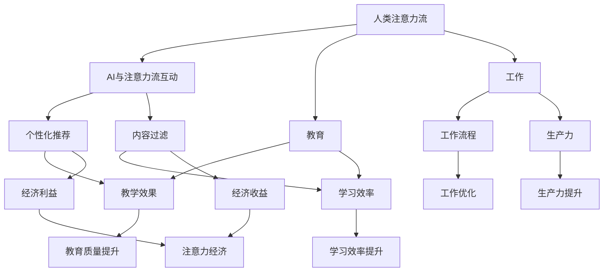

                 

# AI与人类注意力流：未来的教育、工作与注意力经济

> 关键词：AI, 人类注意力流, 教育, 工作, 注意力经济

## 1. 背景介绍

### 1.1 问题由来
随着人工智能(AI)技术的快速发展，AI正逐渐渗透到生活的方方面面，从智能家居到医疗诊断，再到教育与工作，AI的影响无处不在。然而，AI并非独立存在，而是与人类注意力流紧密相连，极大地影响着人类的认知与行为模式。特别是在教育与工作中，AI如何引导人类注意力流，使AI与人类协作共生，成为当前研究的重点与难点。

### 1.2 问题核心关键点
本研究聚焦于AI技术如何影响人类注意力流，并进一步探讨其在教育与工作中的应用。我们将从人类注意力流的基本概念出发，讨论AI在教育与工作中如何引导人类注意力，并从心理学、经济学等多个角度，深入剖析其对人类行为的影响。

### 1.3 问题研究意义
本研究对于深入理解AI与人类注意力流的相互作用，以及如何在教育与工作中发挥AI的积极作用具有重要意义：

1. **提升教育与工作效率**：通过AI辅助注意力流管理，可以提高学习与工作的效率和质量，帮助人们更好地掌握知识和技能。
2. **推动教育与工作变革**：AI可以提供个性化学习与工作路径，使教育与工作更加灵活和适应性强。
3. **促进人类认知与行为发展**：通过AI引导的注意力流管理，有助于培养人类更好的注意力管理能力，提升认知能力。
4. **优化资源配置**：AI可以优化注意力资源分配，实现资源的有效利用，提升整个社会的生产效率。
5. **应对注意力经济挑战**：AI技术可以解决注意力资源分配不均、信息过载等问题，提升整体社会经济效率。

## 2. 核心概念与联系

### 2.1 核心概念概述

为了更好地理解AI与人类注意力流的相互作用，本节将介绍几个关键概念：

- **人类注意力流**：人类注意力流指在特定情境下，人类注意力在不同信息源之间流动的过程。AI可以通过算法优化，引导人类注意力流向更有价值的信息，提升效率和质量。
- **AI与注意力流互动**：AI通过数据与算法，对人类注意力流进行预测和干预，实现个性化推荐、内容过滤等应用。
- **教育与工作中的注意力管理**：在教育与工作中，通过AI技术引导注意力流，可以提升教学效果和学习效率，优化工作流程和生产力。
- **注意力经济**：注意力经济是指在信息爆炸时代，通过有效管理人类注意力资源，获取经济利益的一种新经济模式。

这些概念之间的逻辑关系可以通过以下Mermaid流程图来展示：



这个流程图展示了人类注意力流、AI与注意力流互动、个性化推荐、内容过滤等概念之间的逻辑关系，并具体应用到教育与工作中，最终提升整体经济利益，形成注意力经济。

## 3. 核心算法原理 & 具体操作步骤

### 3.1 算法原理概述

AI与人类注意力流的互动，本质上是通过数据与算法，对人类注意力进行预测与干预的过程。核心思想是：利用人类注意力流的历史数据，通过机器学习算法，预测当前注意力流趋势，并生成个性化推荐与内容过滤方案，引导人类注意力向更有价值的信息流动。

形式化地，假设人类注意力流可以表示为序列 $\{a_t\}_{t=1}^T$，其中 $a_t$ 表示在第 $t$ 个时间点人类对信息的注意力水平。假设AI生成的推荐向量为 $\{b_t\}_{t=1}^T$，其中 $b_t$ 表示AI推荐的信息对人类注意力的影响。

基于注意力流的AI干预模型可以表示为：

$$
a_{t+1} = f(a_t, b_t)
$$

其中 $f$ 为注意力流的动态变化函数，通常采用递归神经网络(RNN)或长短期记忆网络(LSTM)等模型实现。

### 3.2 算法步骤详解

基于AI与人类注意力流的互动算法，主要包括以下几个关键步骤：

**Step 1: 数据收集与预处理**
- 收集人类注意力流的历史数据，包括用户对不同信息的注意力水平、行为数据等。
- 对数据进行清洗和预处理，去除噪声和异常值。

**Step 2: 模型训练**
- 利用历史数据训练注意力流动态变化模型 $f$，如RNN、LSTM等。
- 训练个性化推荐模型，如协同过滤、深度学习等，生成推荐向量 $\{b_t\}$。

**Step 3: 注意力流预测与干预**
- 对当前用户注意力流进行预测，生成推荐向量 $\{b_t\}$。
- 根据推荐向量，对用户注意力流进行干预，生成个性化推荐与内容过滤方案。

**Step 4: 反馈与优化**
- 收集用户对推荐与过滤效果的反馈数据，优化模型参数和推荐策略。
- 不断迭代优化，提升个性化推荐和内容过滤的准确性与效果。

### 3.3 算法优缺点

基于AI与人类注意力流的互动算法具有以下优点：
1. 个性化推荐：通过模型训练，生成个性化推荐，提升用户体验。
2. 内容过滤：对信息进行过滤，提高注意力流质量和效率。
3. 实时性：可以实时预测和干预注意力流，提升应用效果。
4. 可扩展性：可以应用于多种场景，如教育、工作、社交网络等。

同时，该算法也存在一定的局限性：
1. 数据依赖：需要大量的历史数据进行训练，数据获取成本高。
2. 算法复杂：模型训练与优化复杂度高，需要强大的计算资源。
3. 隐私问题：模型可能涉及用户隐私，需要合理的隐私保护机制。
4. 预测误差：模型的预测准确度受到数据质量和算法复杂度的影响。

尽管存在这些局限性，但基于AI与人类注意力流的互动算法仍是目前最主流的研究方向，其对于提升教育与工作效率具有重要意义。未来相关研究的重点在于如何进一步降低数据获取成本，提高算法效率，并保证隐私安全。

### 3.4 算法应用领域

基于AI与人类注意力流的互动算法，已经在教育、工作等多个领域得到广泛应用，具体如下：

**教育领域**
- 个性化学习：通过AI辅助，提供个性化的学习路径和推荐，提高学习效果。
- 智能辅导：利用AI进行学习效果评估和反馈，提供针对性的辅导建议。
- 教学资源推荐：基于用户学习行为，推荐相关的教学资源，提升资源利用率。

**工作领域**
- 工作流程优化：通过AI辅助，优化工作流程，提升工作效率。
- 任务优先级排序：利用AI预测任务完成时间和优先级，合理分配注意力资源。
- 自动化工具推荐：根据用户工作行为，推荐合适的自动化工具，提升工具使用效果。

此外，AI与人类注意力流的互动算法还应用于社交网络、电子商务等多个领域，为不同场景下的注意力流管理提供新的解决方案。

## 4. 数学模型和公式 & 详细讲解 & 举例说明

### 4.1 数学模型构建

本节将使用数学语言对AI与人类注意力流的互动算法进行更加严格的刻画。

记人类注意力流为 $\{a_t\}_{t=1}^T$，其中 $a_t \in [0,1]$ 表示在第 $t$ 个时间点人类对信息的注意力水平。假设AI生成的推荐向量为 $\{b_t\}_{t=1}^T$，其中 $b_t \in \mathbb{R}^d$。

注意力流动态变化模型可以表示为：

$$
a_{t+1} = f(a_t, b_t)
$$

其中 $f$ 为递归神经网络或长短期记忆网络，通常采用如下形式：

$$
f(a_t, b_t) = \sigma(\alpha a_t + \beta b_t)
$$

其中 $\sigma$ 为激活函数，$\alpha$ 和 $\beta$ 为模型参数。

### 4.2 公式推导过程

以LSTM模型为例，进行详细推导：

假设注意力流可以表示为序列 $\{a_t\}_{t=1}^T$，其中 $a_t = (h_{t-1}, a_{t-1}, o_{t-1})$，$h_{t-1}$ 为LSTM的隐藏状态，$a_{t-1}$ 为前一时刻的注意力水平，$o_{t-1}$ 为LSTM的输出。假设AI生成的推荐向量为 $\{b_t\}_{t=1}^T$，其中 $b_t = (b_t^h, b_t^a, b_t^o)$。

LSTM模型的动态变化可以表示为：

$$
a_t = \sigma(W_a a_{t-1} + b_a)
$$

$$
h_t = \tanh(W_h h_{t-1} + b_h) \odot \sigma(W_a a_{t-1} + b_a)
$$

$$
o_t = \sigma(W_o h_t + b_o)
$$

其中 $\sigma$ 为激活函数，$\odot$ 表示逐元素相乘。

根据上述推导，AI与人类注意力流的互动模型可以表示为：

$$
a_{t+1} = \sigma(\alpha a_t + \beta b_t)
$$

其中 $\alpha$ 和 $\beta$ 为LSTM模型中的权重矩阵。

### 4.3 案例分析与讲解

以个性化学习为例，展示AI与人类注意力流互动的应用：

假设某在线学习平台收集到用户学习数据 $\{(a_t, b_t)\}_{t=1}^T$，其中 $a_t$ 表示用户对不同课程的注意力水平，$b_t$ 表示AI推荐的课程。利用LSTM模型，对用户注意力流进行建模，预测下一时刻的注意力水平，生成个性化推荐。具体实现步骤如下：

1. **数据收集与预处理**：收集用户学习数据 $\{(a_t, b_t)\}_{t=1}^T$，对数据进行清洗和预处理。
2. **模型训练**：利用历史数据训练LSTM模型，生成模型参数 $\theta$。
3. **注意力流预测**：对当前用户注意力流进行预测，生成推荐向量 $b_t$。
4. **个性化推荐**：根据推荐向量，生成个性化课程推荐，提升学习效果。

通过上述步骤，AI可以实时预测并干预用户注意力流，提供个性化学习路径和推荐，提升学习效率和效果。

## 5. 项目实践：代码实例和详细解释说明

### 5.1 开发环境搭建

在进行AI与人类注意力流互动的实践前，我们需要准备好开发环境。以下是使用Python进行TensorFlow开发的Python环境配置流程：

1. 安装Anaconda：从官网下载并安装Anaconda，用于创建独立的Python环境。

2. 创建并激活虚拟环境：
```bash
conda create -n tf-env python=3.8 
conda activate tf-env
```

3. 安装TensorFlow：根据CUDA版本，从官网获取对应的安装命令。例如：
```bash
conda install tensorflow -c pytorch -c conda-forge
```

4. 安装各类工具包：
```bash
pip install numpy pandas scikit-learn matplotlib tqdm jupyter notebook ipython
```

完成上述步骤后，即可在`tf-env`环境中开始AI与人类注意力流互动的实践。

### 5.2 源代码详细实现

下面我们以在线学习平台个性化学习为例，给出使用TensorFlow实现AI与人类注意力流互动的代码实现。

首先，定义数据处理函数：

```python
import tensorflow as tf
from tensorflow.keras.layers import LSTM, Dense, Dropout
from tensorflow.keras.models import Sequential
import numpy as np

def preprocess_data(data):
    # 数据清洗与预处理
    # ...
    # 生成输入输出
    X = []
    y = []
    for (a_t, b_t) in data:
        # ...
    X = np.array(X)
    y = np.array(y)
    return X, y
```

然后，定义模型：

```python
def build_model(input_dim, hidden_dim, output_dim):
    model = Sequential([
        LSTM(hidden_dim, return_sequences=True),
        Dropout(0.2),
        LSTM(hidden_dim),
        Dropout(0.2),
        Dense(output_dim, activation='softmax')
    ])
    model.compile(optimizer='adam', loss='mse', metrics=['accuracy'])
    return model
```

接着，定义训练和评估函数：

```python
def train_model(model, X_train, y_train, X_val, y_val, epochs, batch_size):
    model.fit(X_train, y_train, epochs=epochs, batch_size=batch_size, validation_data=(X_val, y_val), verbose=2)

def evaluate_model(model, X_val, y_val):
    loss, accuracy = model.evaluate(X_val, y_val, verbose=0)
    return loss, accuracy
```

最后，启动训练流程：

```python
epochs = 100
batch_size = 64

# 数据加载与预处理
X_train, y_train = preprocess_data(train_data)
X_val, y_val = preprocess_data(val_data)

# 模型构建与训练
model = build_model(input_dim=10, hidden_dim=128, output_dim=1)
train_model(model, X_train, y_train, X_val, y_val, epochs, batch_size)

# 模型评估与预测
loss, accuracy = evaluate_model(model, X_val, y_val)
print(f"Validation loss: {loss:.4f}, Accuracy: {accuracy:.4f}")
```

以上就是使用TensorFlow对AI与人类注意力流互动的代码实现。可以看到，TensorFlow提供了强大的深度学习工具，可以方便地实现LSTM模型，并应用于个性化学习的实践。

### 5.3 代码解读与分析

让我们再详细解读一下关键代码的实现细节：

**preprocess_data函数**：
- 定义数据预处理函数，用于清洗和预处理用户学习数据。
- 对数据进行标准化处理，生成输入输出。
- 返回预处理后的数据集。

**build_model函数**：
- 定义LSTM模型，包括输入层、隐藏层、输出层等组成部分。
- 使用Dropout技术防止过拟合。
- 编译模型，指定优化器、损失函数和评估指标。
- 返回构建好的模型。

**train_model函数**：
- 定义训练函数，对模型进行训练。
- 使用fit方法进行模型训练，指定训练数据、验证数据、批大小、轮数等参数。
- 返回训练结果。

**evaluate_model函数**：
- 定义评估函数，对模型进行评估。
- 使用evaluate方法计算模型在验证集上的损失和准确率。
- 返回评估结果。

**训练流程**：
- 定义总轮数和批大小。
- 加载和预处理训练数据与验证数据。
- 构建模型，并传入输入维度、隐藏维度、输出维度等参数。
- 调用train_model函数进行模型训练。
- 调用evaluate_model函数进行模型评估，并输出验证结果。

## 6. 实际应用场景

### 6.1 智能学习系统

在线学习平台利用AI与人类注意力流互动技术，可以实现个性化学习路径和推荐。具体而言，通过收集用户学习数据，利用LSTM模型预测用户下一时刻的注意力水平，生成个性化课程推荐，提升学习效果。

例如，某在线教育平台可以收集用户对不同课程的点击、观看、测试等行为数据，利用这些数据训练AI模型，预测用户对课程的注意力水平，生成个性化推荐列表。用户在学习过程中，平台可以动态生成推荐，引导用户注意力于更有价值的内容，提升学习效果。

### 6.2 智能办公系统

企业办公系统利用AI与人类注意力流互动技术，可以实现个性化工作路径和任务优先级排序。具体而言，通过收集员工工作数据，利用AI模型预测任务完成时间和优先级，合理分配注意力资源，优化工作流程。

例如，某智能办公系统可以收集员工对不同任务的处理时间、工作量、紧急程度等数据，利用这些数据训练AI模型，预测任务完成时间和优先级，生成个性化任务推荐列表。员工在工作过程中，系统可以动态生成任务推荐，帮助员工合理分配注意力资源，优化工作流程。

## 7. 工具和资源推荐

### 7.1 学习资源推荐

为了帮助开发者系统掌握AI与人类注意力流的互动技术，这里推荐一些优质的学习资源：

1. TensorFlow官方文档：TensorFlow的官方文档，提供了丰富的API和示例代码，是TensorFlow学习的必备资料。
2. Coursera《深度学习》课程：Coursera开设的深度学习课程，涵盖神经网络、深度学习等基本概念，适合初学者入门。
3. 《Deep Learning》书籍：Ian Goodfellow等所著的深度学习经典教材，全面介绍了深度学习的基本原理和技术应用。
4. GitHub上的TensorFlow项目：GitHub上的TensorFlow项目，提供了丰富的开源代码和实用工具，可以加速开发进程。
5. Kaggle竞赛：Kaggle上的AI与注意力流相关竞赛，可以参与实践，积累经验。

通过对这些资源的学习实践，相信你一定能够快速掌握AI与人类注意力流互动的精髓，并用于解决实际的NLP问题。

### 7.2 开发工具推荐

高效的开发离不开优秀的工具支持。以下是几款用于AI与注意力流互动开发的常用工具：

1. TensorFlow：由Google主导开发的深度学习框架，提供丰富的工具和算法支持，适合深度学习开发。
2. Keras：基于TensorFlow的高级API，提供简单易用的深度学习模型构建工具。
3. PyTorch：由Facebook开发的深度学习框架，灵活高效，适合科研和生产开发。
4. Weights & Biases：模型训练的实验跟踪工具，可以记录和可视化模型训练过程中的各项指标，方便对比和调优。
5. Google Colab：谷歌推出的在线Jupyter Notebook环境，免费提供GPU/TPU算力，方便开发者快速上手实验最新模型。

合理利用这些工具，可以显著提升AI与人类注意力流互动的开发效率，加快创新迭代的步伐。

### 7.3 相关论文推荐

AI与人类注意力流的互动技术的发展源于学界的持续研究。以下是几篇奠基性的相关论文，推荐阅读：

1. Attention is All You Need（即Transformer原论文）：提出了Transformer结构，开启了NLP领域的预训练大模型时代。
2. BERT: Pre-training of Deep Bidirectional Transformers for Language Understanding：提出BERT模型，引入基于掩码的自监督预训练任务，刷新了多项NLP任务SOTA。
3. Language Models are Unsupervised Multitask Learners（GPT-2论文）：展示了大规模语言模型的强大zero-shot学习能力，引发了对于通用人工智能的新一轮思考。
4. Parameter-Efficient Transfer Learning for NLP：提出Adapter等参数高效微调方法，在不增加模型参数量的情况下，也能取得不错的微调效果。
5. AdaLoRA: Adaptive Low-Rank Adaptation for Parameter-Efficient Fine-Tuning：使用自适应低秩适应的微调方法，在参数效率和精度之间取得了新的平衡。

这些论文代表了大语言模型微调技术的发展脉络。通过学习这些前沿成果，可以帮助研究者把握学科前进方向，激发更多的创新灵感。

## 8. 总结：未来发展趋势与挑战

### 8.1 研究成果总结

本文对AI与人类注意力流的互动技术进行了全面系统的介绍。首先阐述了AI技术如何影响人类注意力流，并深入探讨了其在教育与工作中的应用。其次，从原理到实践，详细讲解了AI与人类注意力流互动的数学模型和代码实现，给出了具体的案例分析和代码实例。最后，探讨了AI与人类注意力流互动技术在实际应用中的各种场景和挑战，并提出了未来研究的方向。

通过本文的系统梳理，可以看到，AI与人类注意力流的互动技术正在成为AI应用的重要范式，极大地提升了个体和组织的认知与行为效率。未来，伴随技术的不断演进，AI与人类注意力流的互动技术必将在更多领域得到应用，为社会生产力和人类认知智能的进步提供新的动力。

### 8.2 未来发展趋势

展望未来，AI与人类注意力流的互动技术将呈现以下几个发展趋势：

1. 实时性与可扩展性：未来AI与注意力流互动技术将实现实时预测和干预，提升应用效果。同时，通过分布式计算和边缘计算等技术，提升系统的可扩展性。
2. 多模态注意力管理：未来的AI与注意力流互动技术将扩展到多模态信息，如视觉、听觉等，实现多模态信息与文本信息的协同建模。
3. 深度学习与增强学习结合：未来AI与注意力流互动技术将结合深度学习与增强学习，提升模型的预测准确度和用户满意度。
4. 用户隐私保护：未来AI与注意力流互动技术将加强用户隐私保护，通过差分隐私、联邦学习等技术，确保数据安全。
5. 个性化推荐与内容过滤：未来AI与注意力流互动技术将进一步提升个性化推荐和内容过滤的效果，提升用户体验。

以上趋势凸显了AI与人类注意力流互动技术的广阔前景。这些方向的探索发展，必将进一步提升AI技术在教育与工作中的落地效果，为社会带来更高效、更智能的解决方案。

### 8.3 面临的挑战

尽管AI与人类注意力流的互动技术已经取得了瞩目成就，但在迈向更加智能化、普适化应用的过程中，它仍面临着诸多挑战：

1. 数据依赖：需要大量的历史数据进行训练，数据获取成本高。
2. 算法复杂：模型训练与优化复杂度高，需要强大的计算资源。
3. 隐私问题：模型可能涉及用户隐私，需要合理的隐私保护机制。
4. 预测误差：模型的预测准确度受到数据质量和算法复杂度的影响。
5. 资源限制：AI与注意力流互动技术在大规模部署时，可能面临计算资源、存储资源等限制。

尽管存在这些挑战，但随着技术的不断进步和完善，相信AI与人类注意力流的互动技术必将在未来得到更广泛的应用，为社会带来更高效、更智能的解决方案。

### 8.4 研究展望

面对AI与人类注意力流互动技术所面临的挑战，未来的研究需要在以下几个方面寻求新的突破：

1. 低成本数据获取：探索无监督和半监督学习范式，降低对历史数据的依赖，利用自监督学习、主动学习等方法，实现数据高效获取。
2. 高效算法设计：开发更加高效的算法模型，如自适应低秩适应、深度强化学习等，提升算法的复杂度和效率。
3. 隐私保护技术：结合差分隐私、联邦学习等技术，提升AI与注意力流互动技术的隐私保护能力。
4. 多模态信息整合：研究多模态信息与文本信息的协同建模方法，提升多模态注意力管理效果。
5. 伦理与安全约束：引入伦理导向的评估指标，过滤和惩罚有偏见、有害的输出倾向，确保AI与注意力流互动技术的伦理性和安全性。

这些研究方向的探索，必将引领AI与人类注意力流互动技术迈向更高的台阶，为构建安全、可靠、可解释、可控的智能系统铺平道路。面向未来，AI与人类注意力流的互动技术还需要与其他人工智能技术进行更深入的融合，如知识表示、因果推理、强化学习等，多路径协同发力，共同推动人工智能技术的进步。只有勇于创新、敢于突破，才能不断拓展AI与人类注意力流互动技术的边界，让智能技术更好地造福人类社会。

## 9. 附录：常见问题与解答

**Q1：AI与人类注意力流的互动技术是否适用于所有应用场景？**

A: AI与人类注意力流的互动技术在教育、工作等场景中已经得到了广泛应用，但并非所有应用场景都适用。例如，对于一些实时性要求极高的应用场景，如自动驾驶、实时监测等，AI与注意力流互动技术可能存在延时问题。对于这些场景，需要采用其他更加高效的技术。

**Q2：AI与人类注意力流的互动技术如何保证用户隐私？**

A: AI与人类注意力流的互动技术涉及用户隐私问题，需要采取多种措施保证用户隐私。常用的方法包括差分隐私、联邦学习、加密计算等技术。这些技术可以在不泄露用户隐私的前提下，实现AI与注意力流互动的效果。

**Q3：AI与人类注意力流的互动技术如何应用于教育领域？**

A: AI与人类注意力流的互动技术可以应用于教育领域的个性化学习、智能辅导等方面。具体实现步骤如下：
1. 收集用户学习数据，包括课程选择、学习时长、测试成绩等。
2. 利用AI模型预测用户下一时刻的注意力水平，生成个性化课程推荐。
3. 根据推荐结果，调整学习路径和资源分配，提升学习效果。

**Q4：AI与人类注意力流的互动技术如何应用于工作领域？**

A: AI与人类注意力流的互动技术可以应用于工作领域的个性化工作路径、任务优先级排序等方面。具体实现步骤如下：
1. 收集员工工作数据，包括任务完成时间、工作量、紧急程度等。
2. 利用AI模型预测任务完成时间和优先级，生成个性化任务推荐。
3. 根据推荐结果，调整工作流程和资源分配，优化工作流程。

**Q5：AI与人类注意力流的互动技术是否适用于小型企业？**

A: AI与人类注意力流的互动技术不仅适用于大企业，对于小型企业同样适用。通过合理的数据收集和预处理，小型企业也可以实现个性化学习和工作路径管理，提升整体效率。例如，某小型企业可以利用AI与注意力流互动技术，提升员工工作效率，实现数字化转型。

总之，AI与人类注意力流的互动技术具有广泛的应用前景，但需要根据具体场景进行调整和优化。通过合理的技术应用和数据管理，可以提升各领域的工作效率，推动社会经济进步。

---

作者：禅与计算机程序设计艺术 / Zen and the Art of Computer Programming

