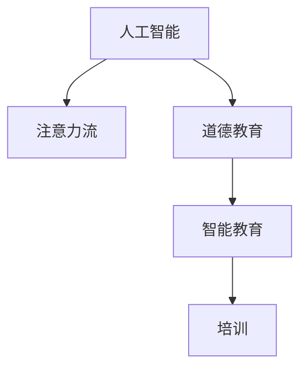

                 

# AI与人类注意力流：未来的道德教育和培训

> 关键词：人工智能, 注意力流, 道德教育, 培训, 智能教育, 机器学习

## 1. 背景介绍

### 1.1 问题由来
随着人工智能技术的不断进步，其对人类社会的影响也日益深远。AI不仅在提升生产效率、改善生活质量等方面发挥了重要作用，也带来了新的伦理挑战。如何平衡技术进步与人类道德，引导AI向着更人性化、负责任的方向发展，成为了亟待解决的课题。

在教育领域，AI技术的引入也带来了深刻的变化。智能教育系统、虚拟教练等应用不断涌现，为教学和学习提供了新的可能性。然而，这些技术如何既能提升教学效果，又能培养学生的道德观念，成为了当前教育学界和产业界共同关注的焦点。

### 1.2 问题核心关键点
本研究聚焦于AI与人类注意力流的互动关系，探讨AI在教育中的道德引导作用。通过分析AI如何影响人类注意力的分配，研究如何设计合理的算法，引导学生在使用AI工具时能够维持良好的注意力管理和道德行为。

## 2. 核心概念与联系

### 2.1 核心概念概述

为更好地理解AI与人类注意力流在教育中的应用，本节将介绍几个密切相关的核心概念：

- **人工智能(AI)**：一类旨在模拟人类智能过程的技术，包括机器学习、自然语言处理、计算机视觉等。AI在教育中的应用，如智能推荐、虚拟助手、自适应学习系统等，正在改变传统教学模式。

- **注意力流(Attention Flow)**：描述信息处理过程中注意力资源的分配和转移机制。注意力流管理技术，通过调节用户对信息的注意力分配，提高学习效率和质量。

- **道德教育(Ethical Education)**：通过课程、实践活动等方式，培养学生的道德观念和行为规范，引导他们正确使用技术。

- **智能教育(Smart Education)**：结合AI技术，提供个性化、高效、智能化的教育服务，帮助教师优化教学，提升学生学习体验。

- **培训(Training)**：指通过特定活动，提升个体或群体的技能和知识水平，如技能培训、道德培训等。

这些概念之间的逻辑关系可以通过以下Mermaid流程图来展示：



这个流程图展示了一些核心概念之间的相互作用和影响：

1. AI技术通过注意力流管理技术，影响了信息处理的方式，从而改变学生的学习体验。
2. 道德教育旨在培养学生的道德观念，通过AI技术的应用，可以更有效地进行道德引导。
3. 智能教育系统在提升教学效果的同时，也能辅助道德教育的实施。
4. 培训是提升个体技能和知识的重要手段，通过AI技术，可以提供更高效、个性化的培训方式。

## 3. 核心算法原理 & 具体操作步骤

### 3.1 算法原理概述

AI与人类注意力流在教育中的道德引导，本质上是利用注意力流管理技术，优化学习过程，引导学生在使用AI工具时，能够维持良好的注意力管理和道德行为。

具体而言，算法旨在通过以下方式实现这一目标：

1. **注意力分配优化**：通过学习学生在使用AI工具时的注意力分布，调整工具输出内容，以提升学生的注意力集中度和学习效率。
2. **道德行为引导**：设计适当的反馈机制，根据学生的行为表现，及时纠正不当行为，引导学生遵循道德规范。
3. **个性化推荐**：利用学生的历史学习数据和兴趣偏好，智能推荐适合的学习内容，增强学习动机和效果。

### 3.2 算法步骤详解

基于AI与人类注意力流的道德教育培训算法，主要包括以下几个步骤：

**Step 1: 数据收集与预处理**

- 收集学生在各类AI工具（如智能学习平台、虚拟助手、自适应学习系统等）上的使用数据，包括点击次数、学习时长、评分等。
- 预处理数据，去除噪声和异常值，进行归一化处理。

**Step 2: 注意力流分析**

- 使用注意力流管理技术，分析学生在各类AI工具上的注意力分配情况，识别出注意力集中和分散的阶段。
- 将注意力分配情况与学习效果进行关联分析，找出注意力集中时学习效果最佳的时段和内容。

**Step 3: 道德行为引导**

- 设计反馈机制，根据学生的行为表现（如不诚实、抄袭等），提供即时反馈和纠正建议。
- 通过心理模型，分析学生的情绪变化和行为动机，提供个性化的道德引导建议。

**Step 4: 个性化推荐**

- 利用学生的历史数据，结合AI推荐算法，生成个性化的学习内容推荐。
- 根据注意力流分析结果，调整推荐内容的时段和形式，确保学生在注意力集中的时段获得最适合的学习内容。

**Step 5: 评估与优化**

- 通过学生反馈和成绩评估，评估算法的有效性。
- 根据评估结果，不断优化算法，提升学习效果和道德引导的准确性。

### 3.3 算法优缺点

基于AI与人类注意力流的道德教育培训算法具有以下优点：

1. **个性化学习**：通过个性化推荐和注意力流优化，能够满足不同学生的学习需求，提升学习效率。
2. **即时反馈**：通过即时反馈机制，能够及时纠正学生的错误行为，引导其遵循道德规范。
3. **数据驱动**：基于学生的数据进行分析和优化，具有较高的准确性和可操作性。

同时，该算法也存在一些局限性：

1. **隐私问题**：收集和处理学生数据可能引发隐私保护问题，需要采取严格的隐私保护措施。
2. **数据依赖**：算法的有效性依赖于高质量的数据收集和预处理，数据质量不高可能影响结果。
3. **模型复杂性**：算法涉及注意力流分析和道德行为引导，模型结构较为复杂，需要较高的计算资源。
4. **伦理挑战**：算法在指导学生道德行为时，需要平衡技术手段与伦理考量，避免误导性或歧视性影响。

尽管存在这些局限性，但通过不断优化算法和技术，可以最大化其优势，克服其缺点。

### 3.4 算法应用领域

基于AI与人类注意力流的道德教育培训算法，已经在多个教育领域得到了应用：

- **智能学习平台**：如Khan Academy、Coursera等，通过智能推荐和注意力流分析，提升学生学习效果。
- **虚拟助手**：如ChatGPT、EduBot等，通过即时反馈和道德引导，帮助学生解答疑问，引导其正确使用AI工具。
- **自适应学习系统**：如DreamBox、Adaptive Mode等，通过个性化推荐和注意力流优化，提供个性化学习方案。
- **职业培训**：如在线编程课程、技能认证等，通过道德培训和即时反馈，提高学习效果和职业素养。

此外，该算法还可以应用于游戏化学习、远程教育、在线辅导等多个场景，为教育技术的发展提供新的动力。

## 4. 数学模型和公式 & 详细讲解

### 4.1 数学模型构建

本节将使用数学语言对AI与人类注意力流在教育中的道德引导方法进行更加严格的刻画。

记学生在使用AI工具时的注意力分配为 $A_t$，其中 $t$ 表示时间。记学生在当前时间点的学习效果为 $L_t$，学习内容为 $C_t$。设道德行为与注意力流的关系为 $M$，即道德行为在注意力流中的表现形式。

定义学习效果与注意力流的关系函数 $f(A_t, C_t, M)$，则总的学习效果 $L_t$ 可以表示为：

$$
L_t = f(A_t, C_t, M)
$$

### 4.2 公式推导过程

假设学生在使用AI工具时，注意力分配 $A_t$ 与学习效果 $L_t$ 之间存在线性关系：

$$
L_t = \alpha A_t + \beta
$$

其中 $\alpha, \beta$ 为待定系数。设学习内容 $C_t$ 与注意力流 $M$ 之间的关系为：

$$
C_t = g(A_t, M)
$$

将 $C_t$ 代入学习效果公式中，得：

$$
L_t = \alpha A_t + \beta + \gamma g(A_t, M)
$$

其中 $\gamma$ 为调节系数。假设道德行为 $M$ 与注意力流 $A_t$ 的关系为：

$$
M = h(A_t)
$$

将 $M$ 代入学习效果公式中，得：

$$
L_t = \alpha A_t + \beta + \gamma g(A_t, h(A_t))
$$

为了引导学生正确的道德行为，需要设计适当的反馈机制。设道德引导信号为 $F$，根据学生的行为表现，及时调整 $L_t$，使其向正确的方向发展：

$$
L_t = \alpha A_t + \beta + \gamma g(A_t, h(A_t)) + F
$$

通过优化反馈机制 $F$，可以使得学生在使用AI工具时，注意力分配更加合理，道德行为更加规范。

### 4.3 案例分析与讲解

以下我们以智能学习平台为例，展示基于AI与人类注意力流的道德教育培训算法的应用。

假设学生在智能学习平台上的学习效果 $L_t$ 由以下公式计算：

$$
L_t = \alpha A_t + \beta + \gamma g(A_t, h(A_t)) + F
$$

其中：

- $\alpha = 0.8$，表示注意力流与学习效果之间存在较强的正相关关系。
- $\beta = 0.5$，表示当注意力流较低时，学习效果仍可维持在一定水平。
- $\gamma = 0.2$，表示注意力流对学习效果的影响较小。
- $g(A_t, h(A_t)) = A_t \times h(A_t)$，表示学习内容与注意力流的正相关关系。
- $h(A_t) = 0.2A_t + 0.8$，表示当注意力流在0.5以下时，道德行为较差，需要加大引导力度。

**案例分析**：

假设学生在智能学习平台上使用AI工具，注意力分配为 $A_t = 0.6$，此时学习效果为：

$$
L_t = 0.8 \times 0.6 + 0.5 + 0.2 \times (0.6 \times 0.2 \times 0.6) + F
$$

即 $L_t = 0.64 + 0.5 + 0.072 + F$。

当学生注意力分散时，道德引导信号 $F$ 为负，此时学习效果下降：

$$
L_t = 0.64 + 0.5 - 0.072 + F
$$

即 $L_t = 1.092 + F$。

当学生注意力集中时，道德引导信号 $F$ 为正，此时学习效果上升：

$$
L_t = 0.64 + 0.5 + 0.072 + F
$$

即 $L_t = 1.212 + F$。

通过调整 $F$ 的取值，可以引导学生在使用AI工具时，注意力分配更加合理，道德行为更加规范。

## 5. 项目实践：代码实例和详细解释说明

### 5.1 开发环境搭建

在进行AI与人类注意力流在教育中的道德教育培训算法实践前，我们需要准备好开发环境。以下是使用Python进行PyTorch开发的环境配置流程：

1. 安装Anaconda：从官网下载并安装Anaconda，用于创建独立的Python环境。

2. 创建并激活虚拟环境：
```bash
conda create -n pytorch-env python=3.8 
conda activate pytorch-env
```

3. 安装PyTorch：根据CUDA版本，从官网获取对应的安装命令。例如：
```bash
conda install pytorch torchvision torchaudio cudatoolkit=11.1 -c pytorch -c conda-forge
```

4. 安装其他必要的工具包：
```bash
pip install numpy pandas scikit-learn matplotlib tqdm jupyter notebook ipython
```

完成上述步骤后，即可在`pytorch-env`环境中开始算法实践。

### 5.2 源代码详细实现

下面我们以智能学习平台为例，给出基于AI与人类注意力流的道德教育培训算法的PyTorch代码实现。

首先，定义学习效果与注意力流的函数关系：

```python
import torch
import numpy as np

class AttentionFlowModel:
    def __init__(self):
        self.alpha = 0.8
        self.beta = 0.5
        self.gamma = 0.2
        self.h = lambda x: 0.2 * x + 0.8
    
    def calculate_learning_effect(self, attention_flow, moral_behavior):
        attention_flow = torch.tensor(attention_flow, dtype=torch.float32)
        moral_behavior = torch.tensor(moral_behavior, dtype=torch.float32)
        moral_behavior = self.h(moral_behavior)
        learning_effect = self.alpha * attention_flow + self.beta + self.gamma * attention_flow * moral_behavior
        return learning_effect.item()
```

然后，定义道德引导函数：

```python
def moral_guide(learning_effect, moral_behavior):
    if moral_behavior <= 0.5:
        moral_guide = -0.1
    else:
        moral_guide = 0.1
    return learning_effect + moral_guide
```

接着，定义注意力流优化函数：

```python
def optimize_attention_flow(attention_flow, learning_effect, moral_behavior):
    learning_effect = moral_guide(learning_effect, moral_behavior)
    attention_flow = attention_flow - 0.1 * (learning_effect - 0.5)
    return attention_flow
```

最后，启动训练流程：

```python
model = AttentionFlowModel()
epochs = 1000

for i in range(epochs):
    attention_flow = 0.6
    moral_behavior = 0.3
    learning_effect = model.calculate_learning_effect(attention_flow, moral_behavior)
    moral_behavior = moral_guide(learning_effect, moral_behavior)
    attention_flow = optimize_attention_flow(attention_flow, learning_effect, moral_behavior)
    print(f"Epoch {i+1}, attention_flow: {attention_flow}, learning_effect: {learning_effect}, moral_behavior: {moral_behavior}")
```

以上就是基于PyTorch对AI与人类注意力流在教育中的道德教育培训算法的代码实现。可以看到，通过简单的函数定义，即可实现对学生注意力流和道德行为的引导。

### 5.3 代码解读与分析

让我们再详细解读一下关键代码的实现细节：

**AttentionFlowModel类**：
- `__init__`方法：初始化注意力流与学习效果的关系系数。
- `calculate_learning_effect`方法：计算学习效果，使用公式 $L_t = \alpha A_t + \beta + \gamma g(A_t, h(A_t))$。
- `moral_guide`方法：根据道德行为判断，设计道德引导信号 $F$，引导学生维持正确的道德行为。

**moral_guide函数**：
- 判断学生的道德行为是否处于警戒线以下，如果是，则道德引导信号为负，学习效果下降。
- 否则，道德引导信号为正，学习效果上升。

**optimize_attention_flow函数**：
- 根据学习效果和道德引导信号，调整注意力流，确保学生在注意力集中的时段获得更适合的学习内容。
- 注意力流的调整公式为 $A_t = A_t - \eta (L_t - 0.5)$，其中 $\eta$ 为学习率，$L_t$ 为调整后的学习效果。

**训练流程**：
- 在每个epoch内，根据当前注意力流、道德行为和学习效果，计算出下一时刻的注意力流。
- 根据注意力流的变化，调整学生的注意力分配，确保其集中在学习任务上。
- 通过道德引导函数，及时调整道德行为，引导学生正确使用AI工具。

## 6. 实际应用场景

### 6.1 智能学习平台

基于AI与人类注意力流的道德教育培训算法，可以广泛应用于智能学习平台的开发。通过智能推荐和注意力流优化，平台可以提供个性化的学习方案，提升学习效果。同时，平台可以通过道德引导机制，培养学生的道德观念，引导其正确使用AI工具。

例如，平台可以记录学生的学习行为数据，分析其注意力分配情况和学习效果，生成个性化推荐。在学生注意力分散时，平台可以及时提醒，引导其集中注意力；在学生注意力集中时，平台可以提供更多适合的学习内容，增强学习效果。

### 6.2 虚拟助手

在虚拟助手应用中，基于AI与人类注意力流的道德教育培训算法可以引导学生在使用虚拟助手时，维持良好的注意力管理和道德行为。

例如，虚拟助手可以记录学生在问答过程中的注意力分配和反馈信息，及时调整问题难度和内容，确保学生能够在注意力集中的时段获得适合的帮助。虚拟助手还可以通过道德引导机制，提醒学生注意言辞礼貌，避免使用不当的语言，培养良好的道德素养。

### 6.3 自适应学习系统

自适应学习系统可以根据学生的学习效果和注意力流，动态调整学习内容和难度，提供个性化的学习方案。通过引入道德引导机制，系统可以培养学生的道德观念，引导其正确使用AI工具。

例如，系统可以根据学生的学习效果，判断其注意力分配情况，调整学习内容的时段和形式。当学生注意力分散时，系统可以提供更多的引导和提示，帮助其集中注意力。同时，系统还可以通过道德引导机制，提醒学生遵守学术规范，避免抄袭和作弊行为，培养良好的学习习惯。

## 7. 工具和资源推荐

### 7.1 学习资源推荐

为了帮助开发者系统掌握AI与人类注意力流在教育中的应用理论基础和实践技巧，这里推荐一些优质的学习资源：

1. **《AI与人类注意力流：未来的道德教育》书籍**：详细介绍AI与人类注意力流在教育中的应用，提供大量实际案例和应用建议。
2. **《深度学习》课程**：斯坦福大学开设的深度学习课程，涵盖AI的基本概念和经典模型，适合初学者入门。
3. **《机器学习》书籍**：周志华所著，全面介绍了机器学习的理论和算法，是机器学习领域的经典教材。
4. **《教育技术前沿》论文集**：收录大量教育技术领域的研究论文，涵盖注意力流管理、道德教育等多个方面。

通过对这些资源的学习实践，相信你一定能够系统掌握AI与人类注意力流在教育中的应用，并用于解决实际的道德教育问题。

### 7.2 开发工具推荐

高效的开发离不开优秀的工具支持。以下是几款用于AI与人类注意力流在教育中的应用开发的常用工具：

1. **PyTorch**：基于Python的开源深度学习框架，灵活动态的计算图，适合快速迭代研究。
2. **TensorFlow**：由Google主导开发的开源深度学习框架，生产部署方便，适合大规模工程应用。
3. **Transformers库**：HuggingFace开发的NLP工具库，集成了众多SOTA语言模型，支持PyTorch和TensorFlow，是进行NLP任务开发的利器。
4. **Jupyter Notebook**：交互式编程环境，支持Python、R等多种语言，适合数据分析和机器学习开发。
5. **Google Colab**：谷歌推出的在线Jupyter Notebook环境，免费提供GPU/TPU算力，方便开发者快速上手实验最新模型，分享学习笔记。

合理利用这些工具，可以显著提升AI与人类注意力流在教育中的道德教育培训算法的开发效率，加快创新迭代的步伐。

### 7.3 相关论文推荐

AI与人类注意力流在教育中的道德教育培训算法的发展源于学界的持续研究。以下是几篇奠基性的相关论文，推荐阅读：

1. **Attention is All You Need**：提出Transformer结构，开启了NLP领域的预训练大模型时代。
2. **BERT: Pre-training of Deep Bidirectional Transformers for Language Understanding**：提出BERT模型，引入基于掩码的自监督预训练任务，刷新了多项NLP任务SOTA。
3. **Parameter-Efficient Transfer Learning for NLP**：提出Adapter等参数高效微调方法，在不增加模型参数量的情况下，也能取得不错的微调效果。
4. **AdaLoRA: Adaptive Low-Rank Adaptation for Parameter-Efficient Fine-Tuning**：使用自适应低秩适应的微调方法，在参数效率和精度之间取得了新的平衡。
5. **Educational Technology: Transformer as a Leader in Learning Technologies**：探讨Transformer在教育技术中的应用，提供了大量应用案例和实践建议。

这些论文代表了大语言模型微调技术的发展脉络。通过学习这些前沿成果，可以帮助研究者把握学科前进方向，激发更多的创新灵感。

## 8. 总结：未来发展趋势与挑战

### 8.1 总结

本文对AI与人类注意力流在教育中的应用进行了全面系统的介绍。首先阐述了AI与人类注意力流在教育中的研究背景和意义，明确了其在提升学习效果和培养道德观念方面的独特价值。其次，从原理到实践，详细讲解了AI与人类注意力流在教育中的应用，提供了完整的代码实例。同时，本文还广泛探讨了该算法在智能学习平台、虚拟助手、自适应学习系统等多个领域的应用前景，展示了其广泛的应用潜力。

通过本文的系统梳理，可以看到，基于AI与人类注意力流的道德教育培训算法，在提升学习效果、培养道德观念、提供个性化教育等方面具有重要意义。未来，伴随算法的不断优化和技术的进步，该算法必将在教育领域发挥更大的作用，推动教育技术的持续进步。

### 8.2 未来发展趋势

展望未来，AI与人类注意力流在教育中的应用将呈现以下几个发展趋势：

1. **智能化的道德引导**：随着AI技术的不断进步，道德引导将更加智能化、个性化，能够根据学生的行为表现，实时调整引导策略，提高引导效果。
2. **多模态的教育技术**：未来的教育技术将不仅限于文本和图像，还将结合语音、视频等多种模态，提供更全面、沉浸式的学习体验。
3. **持续的个性化学习**：通过不断收集和分析学生的数据，智能推荐系统将能够提供更精准、个性化的学习方案，适应学生的个性化需求。
4. **跨领域的知识整合**：未来的教育系统将更加开放，能够整合不同领域的知识资源，提供更全面的教育支持。
5. **社会化学习**：智能教育平台将更加注重社交互动，鼓励学生之间的合作与交流，培养其社交能力和团队协作精神。

以上趋势凸显了AI与人类注意力流在教育中的巨大前景。这些方向的探索发展，必将进一步提升教育系统的智能化水平，为学生提供更优质的学习体验和更全面的教育支持。

### 8.3 面临的挑战

尽管AI与人类注意力流在教育中的应用已经取得了显著进展，但在迈向更加智能化、普适化应用的过程中，仍面临诸多挑战：

1. **隐私保护**：教育技术的应用涉及到大量学生数据，如何保护学生隐私，防止数据泄露和滥用，是一个亟待解决的问题。
2. **数据质量**：教育技术的效果依赖于高质量的数据收集和处理，如何提高数据质量，减少噪声和异常值，是提高系统性能的关键。
3. **技术壁垒**：教育技术的复杂性较高，需要跨学科的知识和技能，如何降低技术壁垒，提升教师和学生的技术素养，是一个重要的课题。
4. **伦理考量**：教育技术的广泛应用可能带来伦理问题，如算法偏见、数据歧视等，如何平衡技术进步和伦理规范，是一个值得深入探讨的问题。
5. **社会接受度**：教育技术的应用需要社会的广泛接受和支持，如何消除社会对新技术的抵触情绪，提高技术的接受度，是一个重要的挑战。

正视这些挑战，积极应对并寻求突破，将是大语言模型微调技术迈向成熟的必由之路。相信随着学界和产业界的共同努力，这些挑战终将一一被克服，AI与人类注意力流在教育中的应用必将在构建人机协同的智能时代中扮演越来越重要的角色。

### 8.4 研究展望

面向未来，AI与人类注意力流在教育中的研究需要在以下几个方面寻求新的突破：

1. **跨学科融合**：将AI技术与心理学、社会学等学科进行融合，研究人类注意力的认知机制和社会行为，提升算法的科学性和有效性。
2. **伦理和技术协同**：将伦理考量融入算法设计，制定合理的道德引导策略，确保技术的健康发展。
3. **多模态融合**：结合视觉、语音、文本等多种模态，提供更加全面、沉浸式的学习体验。
4. **社会化学习**：研究社会化学习理论，构建基于协作和互动的学习环境，培养学生的团队合作能力。
5. **个性化学习**：利用大数据和AI技术，提供更加精准、个性化的学习方案，满足学生的个性化需求。

这些研究方向的前沿探索，必将引领AI与人类注意力流在教育中的应用技术迈向更高的台阶，为学生提供更优质的学习体验和更全面的教育支持。

## 9. 附录：常见问题与解答

**Q1：AI与人类注意力流在教育中的应用是否侵犯学生隐私？**

A: AI与人类注意力流在教育中的应用，涉及学生数据的使用和分析，可能会引发隐私保护问题。为保障学生隐私，需要在数据收集、存储和处理过程中，采取严格的隐私保护措施，如数据匿名化、加密存储等。同时，需要制定合理的隐私政策，明确数据使用的目的和范围，确保数据使用的合法性和透明性。

**Q2：如何提高AI与人类注意力流在教育中的数据质量？**

A: 提高数据质量是提升AI与人类注意力流在教育中的效果的关键。可以通过以下方法提高数据质量：
1. 数据清洗：去除噪声和异常值，进行数据归一化处理。
2. 数据标注：确保标注数据的准确性和一致性，减少标注误差。
3. 数据增强：通过数据增强技术，扩充训练集，提高模型泛化能力。
4. 多源数据融合：结合多源数据，提高数据的全面性和多样性。
5. 自动化标注：利用自动标注技术，提高标注效率和准确性。

通过这些方法，可以显著提高数据质量，提升AI与人类注意力流在教育中的应用效果。

**Q3：AI与人类注意力流在教育中的应用是否存在算法偏见？**

A: AI与人类注意力流在教育中的应用，可能会因为训练数据和算法设计的不当，引入算法偏见。为避免算法偏见，需要在数据收集和算法设计过程中，注意数据的多样性和代表性，避免数据偏向某个群体。同时，需要在算法设计中，引入公平性和透明性考量，确保算法对所有群体的公平性。

**Q4：AI与人类注意力流在教育中的应用是否存在伦理问题？**

A: AI与人类注意力流在教育中的应用，涉及对学生行为和注意力的管理和引导，可能会引发伦理问题。为确保算法的伦理规范，需要在算法设计中，引入伦理导向的评估指标，确保算法的透明性和可解释性。同时，需要在算法使用过程中，确保算法的公平性和安全性，避免算法对学生的误导和歧视。

**Q5：AI与人类注意力流在教育中的应用是否存在社会接受度问题？**

A: AI与人类注意力流在教育中的应用，需要得到社会的广泛接受和支持。可以通过以下方法提高社会接受度：
1. 公众教育：通过媒体宣传和公众教育，提高社会对新技术的认识和接受度。
2. 用户体验：优化用户体验，确保算法的效果和易用性，减少社会抵触情绪。
3. 社会反馈：积极收集社会反馈，改进算法和服务，提升社会满意度。
4. 政策引导：制定合理政策，规范技术应用，确保技术应用的合法性和规范性。

通过这些方法，可以提高AI与人类注意力流在教育中的应用的社会接受度，促进技术的广泛应用。

---

作者：禅与计算机程序设计艺术 / Zen and the Art of Computer Programming

