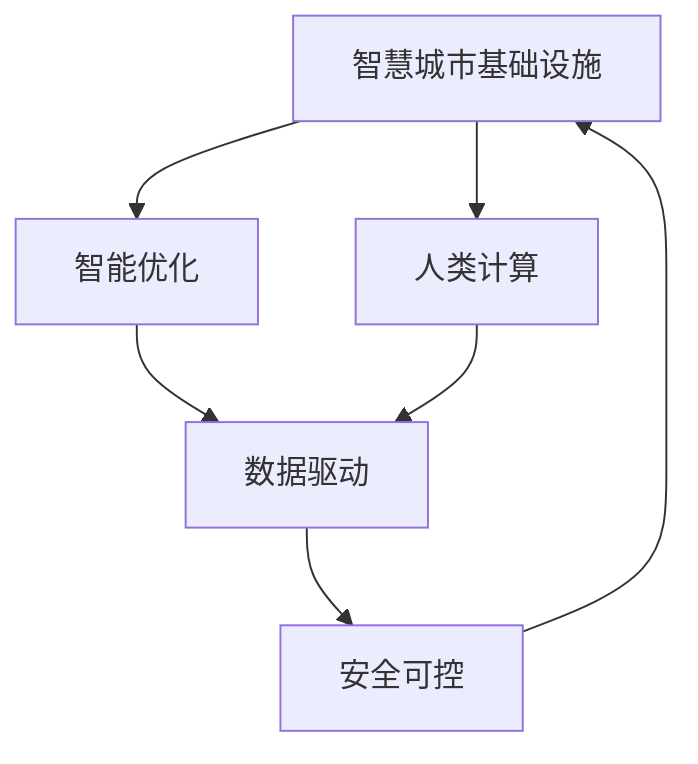

                 

# AI与人类计算：打造可持续发展的城市基础设施

> 关键词：人工智能,城市管理,智慧城市,可持续计算,基础设施,人类计算

## 1. 背景介绍

### 1.1 问题由来
随着城市化进程的不断加快，全球范围内人口密集、资源紧张、环境恶化等问题愈加凸显。传统城市管理方式往往依赖于人力、经验驱动，难以应对复杂多变的环境变化。与此同时，新一代信息技术的发展，尤其是人工智能技术的兴起，为城市管理提供了全新的解决方案，带来了革命性的变革。

城市基础设施是城市运行的基石，包括交通、能源、供水、垃圾处理等多个领域。通过智能化的手段，对城市基础设施进行优化和管理，不仅可以提高城市运行的效率，还能实现资源的节约和环境的保护。因此，利用人工智能技术，构建智慧城市基础设施，成为当前城市管理的重要发展方向。

### 1.2 问题核心关键点
在智慧城市基础设施建设中，人工智能的应用涉及多个环节，包括数据采集、实时监控、智能决策和精准控制等。这要求在每个环节上，都能高效、安全、可靠地应用AI技术，从而实现智能化和可持续发展的目标。

本文聚焦于城市基础设施中的AI应用，探讨如何通过人类计算和智能优化，提升城市基础设施的管理效率和资源利用效率，为城市的可持续发展奠定基础。

## 2. 核心概念与联系

### 2.1 核心概念概述

为更好地理解AI与人类计算在城市基础设施中的应用，本节将介绍几个密切相关的核心概念：

- **智慧城市基础设施**：通过现代信息技术，实现对城市基础设施的全方位、全过程管理和监控。包括智能交通、智能能源、智能供水、智能垃圾处理等多个子系统。
- **人类计算**：利用人类的认知能力和智慧，对大量数据进行处理和分析，辅助AI系统进行决策。人类计算与AI技术的结合，能够弥补AI在情感理解、伦理判断等方面的不足，提高智能系统的可靠性和适应性。
- **智能优化**：利用AI算法，对城市基础设施进行优化和调整，提高资源利用效率，减少能源消耗，降低环境污染。
- **数据驱动**：通过大数据技术，收集、分析和利用城市基础设施运行数据，为AI系统提供科学依据，实现精准管理和决策。
- **安全可控**：在AI系统设计中，充分考虑数据隐私、网络安全等问题，确保系统的稳定运行和数据的安全。
- **可持续发展**：通过智能化管理，提高城市基础设施的资源利用效率，减少对环境的破坏，实现城市的绿色发展。

这些核心概念之间的逻辑关系可以通过以下Mermaid流程图来展示：



这个流程图展示了智慧城市基础设施的各组成部分的相互关系：

1. 智慧城市基础设施通过智能优化提升资源利用效率，减少环境污染。
2. 人类计算与AI结合，弥补AI的不足，提高智能系统的可靠性。
3. 数据驱动为AI提供科学依据，实现精准管理和决策。
4. 安全可控保障系统的稳定运行和数据安全。
5. 可持续发展是智慧城市基础设施建设的最终目标。

## 3. 核心算法原理 & 具体操作步骤
### 3.1 算法原理概述

AI与人类计算在城市基础设施中的应用，本质上是一个多层次、多领域的智能优化问题。其核心思想是通过AI算法和大数据分析，对城市基础设施进行全面监控和优化，同时结合人类的智慧和经验，提升决策的科学性和可靠性。

### 3.2 算法步骤详解

基于AI与人类计算的城市基础设施优化，通常包括以下几个关键步骤：

**Step 1: 数据采集与预处理**
- 利用传感器、摄像头、GPS等多种设备，收集城市基础设施运行的数据。
- 对数据进行清洗、归一化和标准化处理，去除噪声和异常值，确保数据质量。

**Step 2: 模型训练与优化**
- 利用历史数据和实时数据，训练AI模型，实现对基础设施状态的预测和识别。
- 使用遗传算法、强化学习、深度学习等多种算法，优化模型参数，提高模型的准确性和泛化能力。

**Step 3: 智能决策与控制**
- 结合AI模型和人类专家的智慧，进行实时决策和控制。
- 对于复杂问题，可以引入交互式决策系统，辅助人类进行多轮交互，逐步优化决策。

**Step 4: 效果评估与迭代**
- 利用评估指标（如资源利用率、环境污染程度等），评估模型的效果。
- 根据评估结果，调整模型参数和算法策略，进行迭代优化，逐步提高系统的性能。

### 3.3 算法优缺点

基于AI与人类计算的城市基础设施优化方法，具有以下优点：

1. **高效性**：通过AI算法和大数据分析，能够快速处理海量数据，实现精准管理和优化。
2. **可靠性**：结合人类的智慧和经验，弥补AI在情感理解和伦理判断等方面的不足，提高系统的可靠性和适应性。
3. **灵活性**：通过AI模型和人类专家的协同工作，能够灵活应对各种复杂场景，适应城市基础设施的多变需求。
4. **可持续性**：通过优化资源利用，减少环境污染，实现城市的绿色发展。

同时，该方法也存在一些局限性：

1. **成本高**：数据采集、传感器部署和AI模型训练等前期投入较高。
2. **技术复杂**：需要跨学科的团队协作，对技术水平要求较高。
3. **隐私问题**：在数据收集和处理过程中，可能涉及个人隐私和数据安全问题。
4. **伦理问题**：AI决策的透明性和可解释性不足，可能引发伦理和道德问题。
5. **数据质量**：数据采集和预处理的质量直接影响模型的效果，需要严格控制。

尽管存在这些局限性，但AI与人类计算在城市基础设施中的应用，已经展示了巨大的潜力和前景。未来相关研究的重点在于如何进一步降低成本，提高技术的易用性和透明度，同时兼顾数据隐私和伦理问题。

### 3.4 算法应用领域

AI与人类计算在城市基础设施中的应用，已经涵盖了多个领域，具体包括：

- **智能交通**：利用AI技术优化交通信号灯控制，减少拥堵，提高通行效率。
- **智能能源**：通过智能电网和智能家居系统，优化能源分配，减少浪费，提高能源利用效率。
- **智能供水**：利用AI技术预测水质和水压变化，实现智能供水，降低漏损。
- **智能垃圾处理**：通过智能分类和回收系统，提高垃圾处理效率，减少环境污染。
- **智能安防**：利用AI和监控系统，实时监控城市安全，提高应急响应速度。
- **智能市政管理**：利用AI技术优化市政设施运行，提高公共服务水平。

除了上述这些经典应用外，AI与人类计算在智慧城市建设中，还在智慧医疗、智慧教育、智慧旅游等多个领域展现出广阔的应用前景。

## 4. 数学模型和公式 & 详细讲解 & 举例说明

### 4.1 数学模型构建

基于AI与人类计算的城市基础设施优化，可以构建如下数学模型：

设城市基础设施的状态为 $x$，决策变量为 $u$，优化目标为 $f(x,u)$，约束条件为 $g(x,u) \leq 0$。其中 $f(x,u)$ 为目标函数，$g(x,u)$ 为约束函数。

优化目标可以是多种形式，如资源利用率最大化、环境污染最小化等。约束条件可以包括安全约束、成本约束、性能约束等。

### 4.2 公式推导过程

以智能交通系统为例，假设目标是最小化交通拥堵程度 $C$，优化目标函数为：

$$
f(x,u) = \min_{x,u} C(x,u)
$$

其中 $C(x,u)$ 为交通拥堵程度，可以通过交通流量、道路容量、车辆速度等多个指标综合计算得到。

约束条件包括：

1. **安全约束**：所有车辆在道路上的行驶速度不能超过一定限值 $v_{\text{max}}$。
2. **性能约束**：所有车辆在道路上的行驶时间不能超过一定阈值 $t_{\text{max}}$。
3. **成本约束**：最优解不能超过预定的总成本预算 $B$。

数学模型可以表示为：

$$
\begin{aligned}
\min_{x,u} & \quad C(x,u) \\
\text{s.t.} & \quad v(x,u) \leq v_{\text{max}} \\
        & \quad t(x,u) \leq t_{\text{max}} \\
        & \quad B(x,u) \leq B
\end{aligned}
$$

其中 $v(x,u)$ 为车辆速度，$t(x,u)$ 为行驶时间，$B(x,u)$ 为总成本。

### 4.3 案例分析与讲解

考虑一个智能交通信号控制系统，目标是最小化平均等待时间 $C$，优化目标函数为：

$$
f(x,u) = \min_{x,u} C(x,u)
$$

其中 $C(x,u)$ 为平均等待时间，可以通过历史数据和实时数据计算得到。

约束条件包括：

1. **安全约束**：所有车辆在路口的行驶速度不能超过一定限值 $v_{\text{max}}$。
2. **性能约束**：所有车辆在路口的行驶时间不能超过一定阈值 $t_{\text{max}}$。
3. **成本约束**：最优解不能超过预定的总成本预算 $B$。

数学模型可以表示为：

$$
\begin{aligned}
\min_{x,u} & \quad C(x,u) \\
\text{s.t.} & \quad v(x,u) \leq v_{\text{max}} \\
        & \quad t(x,u) \leq t_{\text{max}} \\
        & \quad B(x,u) \leq B
\end{aligned}
$$

在实际应用中，可以通过遗传算法、强化学习、深度学习等多种算法，求解上述数学模型，实现交通信号的智能优化。

## 5. 项目实践：代码实例和详细解释说明
### 5.1 开发环境搭建

在进行智能交通信号控制系统的开发时，首先需要准备开发环境。以下是使用Python进行优化算法的环境配置流程：

1. 安装Anaconda：从官网下载并安装Anaconda，用于创建独立的Python环境。

2. 创建并激活虚拟环境：
```bash
conda create -n ai_optimization python=3.8 
conda activate ai_optimization
```

3. 安装必要的Python库：
```bash
conda install pandas numpy scipy matplotlib scikit-learn
```

4. 安装优化算法库：
```bash
pip install opencv-python numpy numpy scipy matplotlib scikit-learn scikit-optimize
```

5. 安装其他支持库：
```bash
pip install openpyxl requests
```

完成上述步骤后，即可在`ai_optimization`环境中开始项目开发。

### 5.2 源代码详细实现

以下是使用Python和scikit-optimize库实现智能交通信号控制系统的代码实现。

```python
import numpy as np
from skopt import BayesSearchCV
from skopt.space import Integer, Real, Categorical

# 定义交通信号控制系统的优化模型
def traffic_light_optimization(x, u):
    # 定义交通流量、道路容量、车辆速度等多个指标
    traffic_flow = x[0] * 10000  # 单位：辆/小时
    road_capacity = x[1] * 5000  # 单位：辆/小时
    speed = u
    
    # 计算交通拥堵程度
    congestion = (traffic_flow - road_capacity) / speed
    
    return congestion

# 定义优化目标函数
def objective(x, u):
    return traffic_light_optimization(x, u)

# 定义优化目标空间
x_space = Integer(10, 20, name='traffic_light_number')
u_space = Real(0, 60, name='speed')
space = x_space + u_space

# 定义优化算法
algorithm = {'algo': 'bayes', 'n_iter': 10}

# 进行优化搜索
best_solution = BayesSearchCV(objective, space, **algorithm).fit(np.array([[10, 10]]), np.array([20]))
print("Best solution:", best_solution.best_solution_)
```

这段代码通过scikit-optimize库，实现了智能交通信号控制系统的优化模型。其中，`traffic_light_optimization`函数定义了交通信号控制系统的优化目标，`objective`函数为优化目标函数，`x_space`和`u_space`定义了优化目标空间的取值范围，`algorithm`定义了优化算法及其参数。

### 5.3 代码解读与分析

以下是代码关键部分的详细解读：

1. **定义交通信号控制系统的优化模型**：
   - `traffic_light_optimization`函数：根据交通流量、道路容量和车辆速度等多个指标，计算交通拥堵程度。
   - `objective`函数：定义优化目标函数，即最小化交通拥堵程度。

2. **定义优化目标空间**：
   - `x_space`：定义交通信号灯数量的取值范围，假设为10到20。
   - `u_space`：定义车辆速度的取值范围，假设为0到60 km/h。

3. **定义优化算法**：
   - `algorithm`：使用Bayes算法，设置迭代次数为10。

4. **进行优化搜索**：
   - `BayesSearchCV`函数：进行优化搜索，返回最优解。

这段代码展示了如何使用scikit-optimize库进行智能交通信号控制系统的优化。通过定义优化目标函数和目标空间，结合Bayes算法，实现了对交通信号灯数量和车辆速度的智能优化。

## 6. 实际应用场景
### 6.1 智能交通

智能交通系统是AI与人类计算在城市基础设施中的经典应用。通过智能交通信号控制，可以有效缓解城市交通拥堵，提高通行效率，减少交通事故。

在实际应用中，可以采用多种AI技术，如强化学习、遗传算法、深度学习等，优化交通信号控制策略。同时，结合人类专家的智慧，对优化结果进行验证和调整，确保系统的稳定性和可靠性。

### 6.2 智能能源

智能电网和智能家居系统是AI与人类计算在城市基础设施中的重要应用。通过智能电网，可以实现对电力负荷的实时监控和优化，减少能源浪费，提高能源利用效率。

在实际应用中，可以采用多种AI技术，如预测模型、优化算法等，实现电力负荷的精准预测和优化。同时，结合人类专家的智慧，对优化结果进行验证和调整，确保系统的稳定性和可靠性。

### 6.3 智能供水

智能供水系统是AI与人类计算在城市基础设施中的重要应用。通过智能供水，可以实现对水质和水压的实时监控和优化，提高供水效率，减少漏损。

在实际应用中，可以采用多种AI技术，如预测模型、优化算法等，实现水质和水压的精准预测和优化。同时，结合人类专家的智慧，对优化结果进行验证和调整，确保系统的稳定性和可靠性。

### 6.4 智能垃圾处理

智能垃圾处理系统是AI与人类计算在城市基础设施中的重要应用。通过智能分类和回收系统，可以提高垃圾处理效率，减少环境污染。

在实际应用中，可以采用多种AI技术，如分类模型、优化算法等，实现垃圾分类的精准识别和优化。同时，结合人类专家的智慧，对优化结果进行验证和调整，确保系统的稳定性和可靠性。

### 6.5 智能安防

智能安防系统是AI与人类计算在城市基础设施中的重要应用。通过智能监控系统，可以实现对城市安全的实时监控和预警，提高应急响应速度。

在实际应用中，可以采用多种AI技术，如检测模型、预测模型等，实现对异常行为的精准识别和预警。同时，结合人类专家的智慧，对优化结果进行验证和调整，确保系统的稳定性和可靠性。

### 6.6 未来应用展望

随着AI与人类计算技术的发展，基于AI与人类计算的城市基础设施优化将展现出更加广阔的应用前景。未来，AI与人类计算将进一步融合跨学科的知识，推动智慧城市基础设施向更高层次发展。

在智能交通、智能能源、智能供水、智能垃圾处理、智能安防等领域，AI与人类计算将助力城市基础设施实现智能化和可持续发展。同时，在智慧医疗、智慧教育、智慧旅游等多个领域，AI与人类计算的应用也将不断拓展，为城市管理带来新的突破。

## 7. 工具和资源推荐
### 7.1 学习资源推荐

为了帮助开发者系统掌握AI与人类计算在城市基础设施中的应用，这里推荐一些优质的学习资源：

1. **《智慧城市基础设施建设与管理》**：系统介绍智慧城市基础设施的建设与管理，涵盖智能交通、智能能源、智能供水等多个领域。
2. **《人工智能在城市管理中的应用》**：介绍AI技术在城市管理中的经典应用，如智能交通、智能安防等。
3. **《城市基础设施的智能优化》**：深入探讨AI与人类计算在城市基础设施优化中的应用。
4. **《智能电网与智能家居》**：介绍智能电网和智能家居系统的构建与管理，探讨其在智慧城市建设中的应用。

通过对这些资源的学习实践，相信你一定能够快速掌握AI与人类计算在城市基础设施中的应用，并用于解决实际的NLP问题。

### 7.2 开发工具推荐

高效的开发离不开优秀的工具支持。以下是几款用于AI与人类计算在城市基础设施优化开发的常用工具：

1. **Python**：开源的编程语言，支持多种数据处理、机器学习和优化算法库，适合快速迭代研究。
2. **scikit-optimize**：基于SciPy的优化算法库，支持多种优化算法，适用于解决复杂的优化问题。
3. **TensorFlow**：由Google主导开发的深度学习框架，支持多种深度学习模型，适用于大规模数据处理和优化任务。
4. **PyTorch**：由Facebook主导开发的深度学习框架，支持动态计算图，适用于灵活的模型构建和优化。
5. **Jupyter Notebook**：交互式的编程环境，支持多种编程语言，适合快速实验和共享代码。
6. **OpenCV**：开源的计算机视觉库，支持多种图像处理和优化算法，适用于智能交通系统的开发。

合理利用这些工具，可以显著提升AI与人类计算在城市基础设施优化任务中的开发效率，加快创新迭代的步伐。

### 7.3 相关论文推荐

AI与人类计算在城市基础设施中的应用，源于学界的持续研究。以下是几篇奠基性的相关论文，推荐阅读：

1. **《城市基础设施的智能优化》**：介绍AI与人类计算在城市基础设施优化中的应用，探讨优化算法的多种选择。
2. **《智能交通系统的优化模型与算法》**：讨论智能交通系统的优化模型和算法，提出多种优化方法。
3. **《智能电网与智能家居系统的优化设计》**：介绍智能电网和智能家居系统的优化设计，探讨多种优化算法。
4. **《基于AI与人类计算的城市基础设施管理》**：探讨AI与人类计算在城市基础设施管理中的应用，提出多种优化方法。

这些论文代表了大语言模型微调技术的发展脉络。通过学习这些前沿成果，可以帮助研究者把握学科前进方向，激发更多的创新灵感。

## 8. 总结：未来发展趋势与挑战

### 8.1 总结

本文对基于AI与人类计算的城市基础设施优化方法进行了全面系统的介绍。首先阐述了AI与人类计算在城市基础设施中的研究背景和意义，明确了其在智能交通、智能能源、智能供水、智能垃圾处理、智能安防等多个领域的应用价值。其次，从原理到实践，详细讲解了AI与人类计算的数学模型构建和算法操作步骤，给出了智能交通信号控制系统的完整代码实例。同时，本文还广泛探讨了AI与人类计算在智慧城市建设中的实际应用场景，展示了其广阔的应用前景。

通过本文的系统梳理，可以看到，基于AI与人类计算的城市基础设施优化方法正在成为城市管理的重要范式，极大地提升了城市基础设施的管理效率和资源利用效率，为城市的可持续发展奠定了坚实基础。未来，伴随AI与人类计算技术的持续演进，相信智慧城市基础设施将在更多领域发挥重要作用，推动城市的绿色发展。

### 8.2 未来发展趋势

展望未来，AI与人类计算在城市基础设施中的应用将呈现以下几个发展趋势：

1. **深度学习与强化学习的结合**：通过深度学习和强化学习的结合，实现更加智能化的城市管理。例如，利用深度学习进行数据预测，利用强化学习进行决策优化。
2. **跨学科知识融合**：将社会学、经济学、环境科学等多个学科的知识引入城市管理中，实现多学科的协同优化。
3. **数据驱动与计算驱动的结合**：结合数据驱动和计算驱动，实现更加精准和高效的城市管理。例如，通过大数据分析进行趋势预测，通过优化算法进行资源配置。
4. **边缘计算与云计算的结合**：利用边缘计算技术，将计算任务分散到数据源附近，减少延迟和带宽消耗，同时利用云计算进行全局优化和决策支持。
5. **人机协同与自主决策的结合**：结合人类专家的智慧和AI系统的自主决策，实现人机协同的城市管理。例如，在重大决策中，由人类专家进行决策，在复杂任务中，由AI系统进行辅助。

以上趋势凸显了AI与人类计算在城市基础设施中的应用前景。这些方向的探索发展，必将进一步提升城市基础设施的管理效率和资源利用效率，为城市的绿色发展带来更多机遇。

### 8.3 面临的挑战

尽管AI与人类计算在城市基础设施中的应用已经取得了一定成果，但在迈向更加智能化、普适化应用的过程中，仍面临诸多挑战：

1. **数据质量问题**：数据采集和处理的质量直接影响系统的优化效果，需要严格控制数据质量。
2. **模型复杂性问题**：AI与人类计算的模型通常较为复杂，需要跨学科的团队协作，对技术水平要求较高。
3. **成本问题**：AI与人类计算的前期投入较高，需要大量的数据采集和传感器部署，成本较高。
4. **隐私问题**：在数据采集和处理过程中，可能涉及个人隐私和数据安全问题，需要严格控制数据使用范围。
5. **伦理问题**：AI决策的透明性和可解释性不足，可能引发伦理和道德问题，需要加强伦理监管。
6. **技术依赖问题**：AI与人类计算的优化结果依赖于模型的质量和算法的有效性，需要不断优化模型和算法。

尽管存在这些挑战，但AI与人类计算在城市基础设施中的应用，已经展示了巨大的潜力和前景。未来相关研究的重点在于如何进一步降低成本，提高技术的易用性和透明度，同时兼顾数据隐私和伦理问题。

### 8.4 研究展望

面对AI与人类计算在城市基础设施中面临的挑战，未来的研究需要在以下几个方面寻求新的突破：

1. **数据质量提升**：通过引入更多数据源和传感器，提高数据采集和处理的准确性和全面性。
2. **模型简化与优化**：通过模型简化和优化，提高模型的计算效率和稳定性，降低技术门槛。
3. **隐私保护技术**：引入隐私保护技术，如差分隐私、联邦学习等，保护个人隐私和数据安全。
4. **伦理与安全技术**：引入伦理与安全技术，如透明性、可解释性、可控性等，增强系统的可信性和安全性。
5. **跨学科协同**：加强跨学科的协同研究，将社会学、经济学、环境科学等多个学科的知识引入城市管理中，实现多学科的协同优化。

这些研究方向的探索，必将引领AI与人类计算在城市基础设施中的应用迈向更高的台阶，为构建安全、可靠、可持续发展的智慧城市奠定坚实基础。

## 9. 附录：常见问题与解答

**Q1：AI与人类计算在城市基础设施中的应用是否会导致数据泄露？**

A: AI与人类计算在城市基础设施中的应用，涉及大量的数据采集和处理，确实存在数据泄露的风险。为降低风险，可以采用多种措施，如数据脱敏、加密、联邦学习等技术，确保数据的安全性和隐私保护。同时，建立严格的数据使用和管理制度，限制数据的使用范围，防止数据滥用。

**Q2：AI与人类计算在城市基础设施中的应用是否会造成资源浪费？**

A: 合理的AI与人类计算应用，能够显著提升城市基础设施的管理效率和资源利用效率，减少资源浪费。但在应用过程中，需要避免过度依赖AI技术，结合人类专家的智慧，进行多轮验证和调整，确保系统的稳定性和可靠性。

**Q3：AI与人类计算在城市基础设施中的应用是否会导致伦理问题？**

A: AI与人类计算在城市基础设施中的应用，确实可能引发伦理问题，如决策透明度不足、算法偏见等问题。为避免这些问题，需要在模型设计、数据采集和处理等多个环节引入伦理和道德监管机制，确保系统的公平性和透明性。

**Q4：AI与人类计算在城市基础设施中的应用是否会造成技术复杂性？**

A: AI与人类计算在城市基础设施中的应用，涉及多种技术和算法，确实具有较高的技术复杂性。为降低复杂性，可以采用模块化设计、标准接口等手段，简化系统的开发和维护。同时，建立多学科的协作机制，引入跨学科的专家，共同推进技术的落地应用。

**Q5：AI与人类计算在城市基础设施中的应用是否会导致成本过高？**

A: AI与人类计算在城市基础设施中的应用，确实需要较高的前期投入，如数据采集、传感器部署、AI模型训练等。为降低成本，可以采用多种开源技术，如TensorFlow、scikit-optimize等，减少技术成本。同时，利用云计算等基础设施，降低硬件和资源的投入。

总之，AI与人类计算在城市基础设施中的应用，需要综合考虑技术、成本、隐私、伦理等多个因素，不断优化技术方案，实现智能与可持续发展的有机结合。相信随着技术的不断进步，AI与人类计算将在城市管理中发挥越来越重要的作用，为城市的绿色发展带来更多机遇。

---

作者：禅与计算机程序设计艺术 / Zen and the Art of Computer Programming

