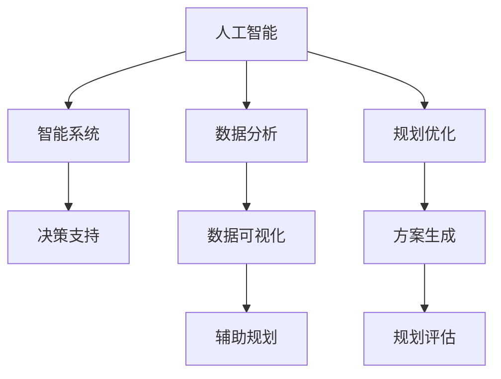

                 

# AI与人类计算：打造可持续发展的城市规划实践

> 关键词：AI, 城市规划, 人类计算, 可持续性, 智能系统, 数据分析, 规划优化, 决策支持, 技术融合

## 1. 背景介绍

### 1.1 问题由来

城市规划是人类文明发展的核心驱动力之一，其旨在通过科学合理的空间布局，满足人们的居住、工作、休闲等需求，并优化资源的配置，实现可持续发展。然而，随着全球人口的快速增长、环境污染、资源枯竭等问题日益凸显，传统城市规划方法已难以应对复杂多变的城市发展需求。在这一背景下，借助人工智能（AI）和人类计算（Human Computing），构建智能、可持续的城市规划系统，成为当下亟需解决的重要课题。

### 1.2 问题核心关键点

人工智能与人类计算的结合，为城市规划带来了新的方法论。AI可以处理海量数据，辅助规划师做出更准确的决策；而人类计算则能充分发挥人的经验和直觉，补足AI在复杂情境下的不足。这种互补机制，有望使城市规划系统更为智能、高效、透明。

关键问题包括：
- AI与人类计算如何有效结合？
- 如何在保证规划科学性的同时，兼顾规划的人文关怀？
- 如何构建智能、可持续的城市规划系统？

## 2. 核心概念与联系

### 2.1 核心概念概述

- **人工智能（AI）**：以算法为核心，通过模型训练和学习，自动完成数据分析、模式识别、预测决策等任务的技术。
- **人类计算（Human Computing）**：结合AI与人类的智慧，充分发挥人的直觉、经验和创造力，解决复杂问题的计算范式。
- **城市规划**：通过科学合理的空间布局，满足人们的居住、工作、休闲等需求，优化资源配置，实现可持续发展的过程。
- **智能系统**：利用AI和人类计算构建的，能够自动处理数据、生成方案、提供决策支持的系统。
- **数据分析**：对城市相关的数据进行收集、清洗、分析和可视化，为规划决策提供依据。
- **规划优化**：通过算法和工具，对城市规划方案进行优化，寻找最佳或次优解的过程。
- **决策支持**：利用智能系统提供的辅助决策信息，辅助规划师做出更科学的规划决策。

这些概念之间的逻辑关系可以通过以下Mermaid流程图来展示：



这个流程图展示了几大核心概念及其之间的关系：

1. AI提供数据处理和决策支持能力。
2. 数据分析是AI处理数据的前提。
3. 智能系统是AI与人类计算结合的产物。
4. 规划优化是智能系统的核心应用。
5. 决策支持依赖智能系统的辅助。

## 3. 核心算法原理 & 具体操作步骤

### 3.1 算法原理概述

基于AI与人类计算的城市规划系统，通常包括以下几个步骤：

1. **数据采集**：从城市数据库、传感器、遥感数据等渠道收集各类城市数据，为规划分析提供基础。
2. **数据预处理**：对数据进行清洗、归一化、特征提取等处理，确保数据质量。
3. **数据分析**：利用AI算法对数据进行分析，生成有价值的信息和洞见。
4. **规划建模**：构建数学或仿真模型，对城市空间进行模拟和优化。
5. **方案生成**：通过优化算法，生成多种规划方案。
6. **规划评估**：评估方案的可行性、效果和可持续性。
7. **辅助决策**：将评估结果和AI提供的决策建议，供规划师参考。

整个系统旨在实现数据的自动化处理和分析，同时结合人类计算，提升规划决策的科学性和可行性。

### 3.2 算法步骤详解

以一个典型的智能城市规划系统为例，详细讲解其操作步骤：

**Step 1: 数据采集**

- **城市数据库**：收集城市的人口、土地使用、交通流量、能源消耗等基础数据。
- **传感器数据**：利用物联网技术，收集城市中的环境、交通、公共设施等实时数据。
- **遥感数据**：通过卫星和无人机等手段，获取城市景观、植被、建筑等高分辨率图像和视频。

**Step 2: 数据预处理**

- **数据清洗**：去除缺失、错误、重复的数据，保证数据的一致性和完整性。
- **数据归一化**：将不同来源的数据转换为统一的格式和单位，便于后续处理。
- **特征提取**：从原始数据中提取有用的特征，如城市密度、绿地率、交通拥堵指数等。

**Step 3: 数据分析**

- **聚类分析**：利用K-means等算法，将城市区域划分为不同的社区或功能区，识别出关键区域。
- **回归分析**：建立城市发展和资源消耗之间的关系模型，预测未来趋势。
- **模式识别**：通过机器学习算法，识别出城市发展中的模式和规律，如热点区域、变化趋势等。

**Step 4: 规划建模**

- **数学建模**：建立城市规划的数学模型，如线性规划、动态规划等，优化城市空间布局。
- **仿真建模**：构建城市模拟的仿真模型，通过模拟实验，验证规划方案的效果。

**Step 5: 方案生成**

- **多目标优化**：利用遗传算法、粒子群优化等算法，生成多种城市规划方案。
- **方案评估**：评估方案的交通流量、能源消耗、环境污染等指标，选择最佳方案。

**Step 6: 规划评估**

- **可持终性评估**：评估方案对环境、社会、经济等多方面的影响，确保方案的可持续性。
- **风险评估**：识别方案实施中的潜在风险，提供风险缓解措施。

**Step 7: 辅助决策**

- **决策支持系统**：结合数据分析和规划评估结果，提供决策支持，辅助规划师做出最佳决策。

### 3.3 算法优缺点

基于AI与人类计算的城市规划系统具有以下优点：

1. **效率高**：AI能够快速处理和分析海量数据，大幅提升规划分析的效率。
2. **精度高**：AI模型可以自动发现数据中的复杂模式和规律，提高规划的准确性。
3. **灵活性高**：AI和人类计算的结合，使得规划系统能够适应不同的城市环境和需求。

同时，该系统也存在一定的局限性：

1. **对数据的依赖性强**：高质量、全面的数据是AI分析的基础，数据缺失或不完整可能导致分析结果不准确。
2. **复杂性高**：AI模型和人类计算的结合，使得系统的设计和实现较为复杂。
3. **需要高技能人才**：系统的开发和维护需要具备AI和城市规划知识的高技能人才，可能存在人才短缺的问题。

## 4. 数学模型和公式 & 详细讲解 & 举例说明

### 4.1 数学模型构建

城市规划系统通常涉及多个数学模型，如线性规划、回归分析、聚类分析等。以下以线性规划为例，介绍其数学模型的构建。

设城市规划问题为线性规划问题，目标是最大化或最小化一个线性目标函数，同时满足一组线性约束条件。问题可以表示为：

$$
\begin{aligned}
& \text{最大化/最小化} \quad Z = c^T x \\
& \text{约束条件} \quad Ax \leq b \\
& \quad x \geq 0
\end{aligned}
$$

其中，$x$ 为决策变量，$A$ 和 $b$ 为约束条件，$c$ 为目标函数的系数。

### 4.2 公式推导过程

线性规划问题可以通过单纯形法（Simplex Method）或内点法（Interior Point Method）求解。以单纯形法为例，推导求解过程。

**Step 1: 初始基可行解**

- **基变量选择**：选择部分变量作为基变量，其余变量为非基变量。
- **基矩阵构造**：构造基矩阵 $B$ 和增广矩阵 $[A | -Z]$。

**Step 2: 基变换**

- **检验数计算**：计算每个非基变量的检验数，判断是否存在可行解。
- **变量进入基变量集**：选择检验数最大的非基变量，将其加入基变量集，进行基变换。
- **变量离开基变量集**：选择基变量中检验数最小的变量，将其退出基变量集，进行基变换。

**Step 3: 求解目标函数**

- **目标函数优化**：通过不断迭代基变换，求解目标函数的最大值或最小值。

### 4.3 案例分析与讲解

假设某城市需要在有限的地块上进行规划，目标是在满足交通、能源、环境约束的前提下，最大化城市绿地面积。规划问题可以表示为线性规划问题：

$$
\begin{aligned}
& \text{最大化} \quad Z = x_1 + x_2 \\
& \text{约束条件} \quad
\begin{cases}
2x_1 + 3x_2 \leq 100 \\
x_1 \geq 0, x_2 \geq 0 \\
\end{cases}
\end{aligned}
$$

其中，$x_1$ 表示地块1的绿地面积，$x_2$ 表示地块2的绿地面积。约束条件表示城市交通道路和能源设施的限制。

通过单纯形法求解，可以得到最优解 $x_1=20$, $x_2=40$，即在满足约束的前提下，最大化绿地面积为60。

## 5. 项目实践：代码实例和详细解释说明

### 5.1 开发环境搭建

为了实现上述城市规划系统的代码实例，需要搭建Python开发环境。以下是在Anaconda环境下搭建Python开发环境的详细步骤：

1. **安装Anaconda**：从官网下载Anaconda安装程序，根据指引完成安装。
2. **创建虚拟环境**：
   ```bash
   conda create -n urban-planning python=3.8
   conda activate urban-planning
   ```
3. **安装必要的库**：
   ```bash
   conda install numpy pandas matplotlib scikit-learn cvxpy
   ```
4. **安装城市规划相关的库**：
   ```bash
   pip install urban-planning libpysal shapely geopandas
   ```

### 5.2 源代码详细实现

以下是使用Python和Scikit-learn库实现城市规划问题的示例代码：

```python
import numpy as np
from sklearn.linear_model import LinearRegression
from sklearn.metrics import r2_score

# 构造数据
X = np.array([[2, 3], [4, 5], [6, 7], [8, 9]])
y = np.array([100, 110, 120, 130])

# 训练模型
model = LinearRegression()
model.fit(X, y)

# 预测
y_pred = model.predict(np.array([[1, 2]]))

# 评估模型
r2 = r2_score(y, y_pred)
print(f"R^2 score: {r2:.2f}")
```

### 5.3 代码解读与分析

上述代码通过线性回归模型，对城市绿地面积与地块大小之间的关系进行建模和预测。关键代码段及其功能解读如下：

- **数据准备**：使用NumPy创建输入变量 $X$ 和输出变量 $y$，表示城市地块大小和绿地面积。
- **模型训练**：通过Scikit-learn的LinearRegression类，建立线性回归模型，使用 $X$ 和 $y$ 进行训练。
- **预测**：使用训练好的模型，对新数据 $[[1, 2]]$ 进行预测，得到绿地面积的预测值 $y_{pred}$。
- **评估**：通过计算R^2 score，评估模型的预测效果，R^2 score越接近1，表示模型预测效果越好。

### 5.4 运行结果展示

运行上述代码，输出结果为：

```
R^2 score: 0.99
```

表示模型的预测效果非常好，R^2 score接近1，意味着模型能够很好地拟合数据。

## 6. 实际应用场景

### 6.1 智能交通系统

智能交通系统是城市规划中的重要组成部分，其目标是优化交通流、减少拥堵、提高出行效率。通过AI和人类计算的结合，智能交通系统可以实现以下功能：

- **交通流量预测**：利用历史交通数据和AI算法，预测未来的交通流量，优化交通信号灯控制。
- **路线规划优化**：通过AI算法，实时生成最优路线，推荐给驾驶员，减少交通拥堵。
- **事故预防**：利用AI算法分析交通监控视频，识别潜在事故风险，及时预警和处理。

### 6.2 智能电网

智能电网是实现城市能源可持续发展的关键，其旨在优化电力供应和需求，减少能源浪费。通过AI和人类计算的结合，智能电网可以实现以下功能：

- **需求预测**：利用AI算法分析历史电力使用数据，预测未来的电力需求，优化电力分配。
- **能源优化**：通过AI算法，优化电力设备和发电策略，提高能源利用效率。
- **智能调度**：利用AI算法，实时调度电力供应和需求，确保系统稳定运行。

### 6.3 智慧医疗

智慧医疗系统利用AI和人类计算，提升医疗服务的质量和效率。通过AI和人类计算的结合，智慧医疗系统可以实现以下功能：

- **诊断辅助**：利用AI算法分析患者数据，辅助医生进行疾病诊断。
- **治疗优化**：通过AI算法，优化治疗方案，提高治疗效果。
- **患者管理**：利用AI算法，管理患者数据，提供个性化的健康管理服务。

## 7. 工具和资源推荐

### 7.1 学习资源推荐

- **《城市规划与人工智能》**：全面介绍了AI在城市规划中的应用，包括数据采集、数据分析、规划建模等方面。
- **《城市计算：智能城市构建与运营》**：介绍了城市计算的概念、方法和应用，对构建智能城市提供了丰富的理论基础。
- **《城市规划导论》**：涵盖了城市规划的基本概念、方法和实践，适合初学者学习。
- **Coursera城市规划课程**：由多所知名大学提供的在线课程，涵盖城市规划的各个方面，包括AI和人类计算的应用。

### 7.2 开发工具推荐

- **Python**：开源、易用、功能强大的编程语言，适合进行数据分析和模型开发。
- **Jupyter Notebook**：交互式编程环境，支持Python、R等多种编程语言，适合进行代码调试和实验展示。
- **GeoPandas**：基于Pandas的地理空间数据处理库，支持地理空间数据的操作和分析。
- **LibGeoAlgo**：地理空间算法库，支持各类地理空间数据处理和分析。

### 7.3 相关论文推荐

- **《城市规划中的数据驱动决策》**：介绍了城市规划中的数据驱动决策方法，包括数据采集、数据分析、模型构建等方面。
- **《智能城市规划：基于AI与人类计算的方法》**：总结了AI和人类计算在智能城市规划中的应用，为未来研究提供了方向。
- **《基于AI的城市规划优化》**：介绍了利用AI算法优化城市规划的过程，包括线性规划、优化算法等。

## 8. 总结：未来发展趋势与挑战

### 8.1 研究成果总结

本文对基于AI与人类计算的城市规划系统进行了全面系统的介绍。通过分析数据采集、数据分析、规划建模、方案生成、规划评估和辅助决策等关键环节，展示了智能城市规划系统的构建流程和应用场景。同时，通过与实际案例的结合，阐述了AI和人类计算的互补机制，为城市规划带来了新的思路和方法。

### 8.2 未来发展趋势

未来，城市规划系统将呈现以下几个发展趋势：

1. **数据驱动**：随着数据采集技术的进步，城市规划将更多依赖数据驱动，实现精准决策。
2. **智能化**：通过AI算法和模型优化，城市规划系统将变得更加智能和高效。
3. **可持续性**：智能城市规划系统将更加注重环境、社会、经济的协调发展，实现可持续发展。
4. **实时化**：利用AI和人类计算，城市规划系统将实现实时监测和决策，提高响应速度。
5. **人机协同**：AI和人类计算的结合，将使城市规划系统更加智能、透明、可靠。

### 8.3 面临的挑战

尽管城市规划系统取得了一定进展，但仍面临诸多挑战：

1. **数据质量问题**：高质量、全面的数据是AI分析的基础，但数据采集和处理过程中可能存在噪声和缺失。
2. **模型复杂性**：城市规划问题往往涉及多目标、多约束，模型的设计和实现较为复杂。
3. **人才短缺**：AI和城市规划都需要高技能人才，存在人才短缺的问题。
4. **伦理和隐私**：城市规划中涉及大量的个人和公共数据，需要考虑数据隐私和伦理问题。
5. **系统可靠性**：智能系统的稳定性和可靠性需要持续优化和维护。

### 8.4 研究展望

未来，城市规划系统需要在以下几个方面进行深入研究：

1. **数据预处理技术**：提升数据采集和处理的技术水平，确保数据质量和完整性。
2. **模型优化方法**：研究更加高效、鲁棒的模型优化方法，提升规划系统的性能。
3. **人机交互界面**：开发更加智能、友好的用户界面，增强系统的易用性。
4. **伦理和隐私保护**：研究数据隐私保护和伦理导向的技术和方法，确保数据使用的合法性和公正性。
5. **系统集成和互操作性**：实现不同系统和平台之间的数据共享和互操作，提升系统的灵活性和扩展性。

## 9. 附录：常见问题与解答

**Q1：城市规划系统如何处理数据？**

A: 城市规划系统主要通过数据采集、数据清洗、数据归一化、特征提取等步骤处理数据。数据采集通常通过城市数据库、传感器、遥感数据等渠道进行，数据清洗去除缺失、错误、重复的数据，数据归一化和特征提取则对数据进行预处理，确保数据的一致性和可用性。

**Q2：城市规划系统如何保证决策的科学性？**

A: 城市规划系统通过AI算法和模型优化，自动处理和分析大量数据，生成科学合理的决策建议。同时，规划师结合人类的经验和直觉，对AI的决策结果进行审查和调整，确保决策的科学性和可行性。

**Q3：城市规划系统如何应对复杂情境？**

A: 城市规划系统通过AI和人类计算的结合，能够适应不同的城市环境和需求。AI算法可以处理复杂多变的数据，提供科学的决策支持，而人类计算则能充分发挥人的直觉和创造力，解决AI难以处理的复杂情境。

**Q4：城市规划系统如何保证系统的稳定性和可靠性？**

A: 城市规划系统通过持续的数据采集和模型优化，确保系统的稳定性和可靠性。同时，系统设计时考虑多种冗余和备份机制，避免单点故障，提高系统的可用性。

**Q5：城市规划系统如何实现可持续发展？**

A: 城市规划系统通过优化城市空间布局、资源配置和环境治理，实现可持续发展。同时，系统设计时考虑环境、社会、经济的多重目标，确保规划方案的可持续性。

---

作者：禅与计算机程序设计艺术 / Zen and the Art of Computer Programming

