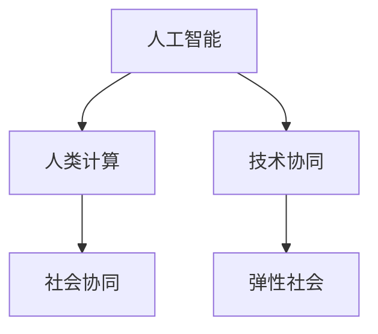
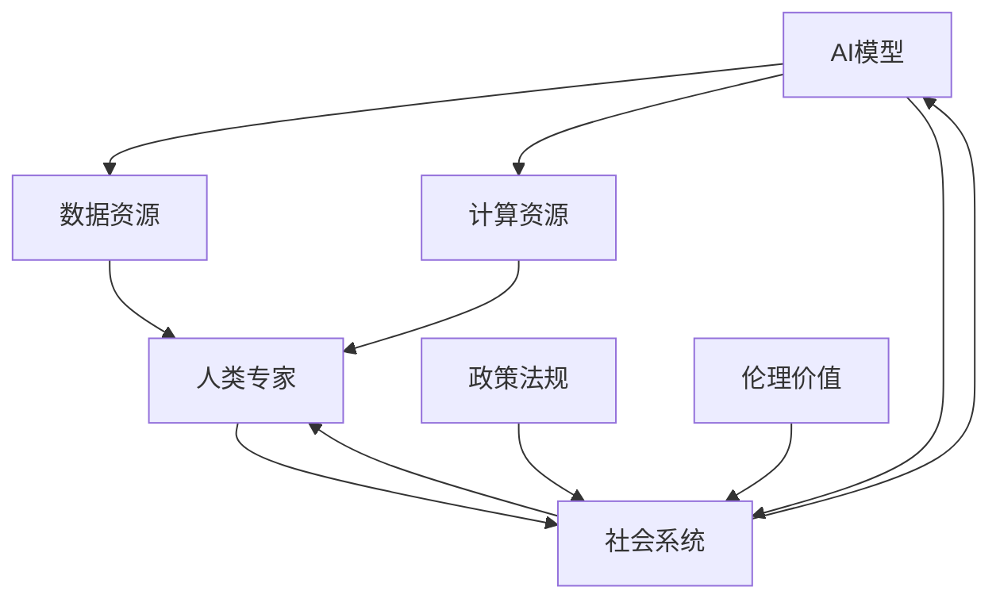

                 

## 1. 背景介绍

### 1.1 问题由来

随着人工智能（AI）技术的飞速发展，人类计算正在迈向一个前所未有的新阶段。近年来，无论是机器学习、深度学习还是自然语言处理（NLP）领域，都有了令人瞩目的突破。然而，在追求技术革新的同时，我们也必须面对这样一个问题：AI和人类计算的边界在哪里？如何实现两者的有效协同，以构建未来的弹性社会？

### 1.2 问题核心关键点

在未来，AI和人类计算的协同将成为构建弹性社会的基础。这不仅需要技术上的突破，还需要从伦理、社会、经济等多个维度进行深度思考。AI的强大计算能力、快速迭代特性，以及深度学习能力，能够帮助人类解决许多复杂问题。然而，AI的局限性在于其无法理解人类的情感、价值观和伦理观念。因此，未来的AI发展需要在保持技术领先的同时，充分考虑人类计算的价值和限制。

## 2. 核心概念与联系

### 2.1 核心概念概述

要理解AI与人类计算的协同，首先需要明确几个核心概念：

- **人工智能**：指利用计算机算法和数据，使机器能够自主执行人类智能任务的领域。AI的核心在于学习和推理，其目标是通过大量数据训练出具有普遍适用性的模型。
- **人类计算**：指人类利用自身的智慧、创造力和经验，对复杂问题进行分析和解决的计算过程。人类计算具有高度的灵活性和创造性，能够处理许多AI难以解决的问题。
- **弹性社会**：指能够根据环境变化，快速调整和优化资源配置，实现动态平衡的社会形态。AI与人类计算的协同，能够为弹性社会提供强大的技术支撑。

这些概念之间的联系可以通过以下Mermaid流程图来展示：



这个流程图展示了这个主题的核心概念及其相互关系：

1. **人工智能**通过技术手段，提升**人类计算**的效率和准确性。
2. **人类计算**提供**人工智能**所需的基础知识、伦理和社会价值。
3. **技术协同**与**社会协同**共同构建**弹性社会**。

### 2.2 核心概念原理和架构的 Mermaid 流程图

以下是一个简单的 Mermaid 流程图，展示了AI和人类计算在协同过程中，如何通过技术和社会两个层面，构建弹性社会的基本架构：



这个图展示了从数据到模型，再到社会系统，AI和人类计算如何协同运作，共同构建弹性社会。

## 3. 核心算法原理 & 具体操作步骤

### 3.1 算法原理概述

在AI与人类计算的协同中，核心算法原理可以概括为以下几个方面：

- **模型训练**：利用大量数据对AI模型进行训练，使其具备解决问题的能力。
- **知识注入**：将人类计算的智慧和经验，注入到AI模型中，提升模型的泛化能力和鲁棒性。
- **协同优化**：通过技术手段和社会干预，不断优化AI与人类计算的协同效果，确保系统的动态平衡。

### 3.2 算法步骤详解

基于上述原理，AI与人类计算的协同可以分解为以下步骤：

1. **数据准备**：收集和清洗数据，为AI模型训练提供基础。
2. **模型训练**：利用数据资源和计算资源，对AI模型进行训练，提升其解决问题的能力。
3. **知识注入**：通过领域专家的指导，向AI模型注入人类智慧和经验，增强其泛化能力和鲁棒性。
4. **系统部署**：将训练好的AI模型部署到实际应用中，与人类计算协同工作。
5. **效果评估**：定期评估系统的性能和效果，通过反馈机制不断优化模型和协同机制。

### 3.3 算法优缺点

AI与人类计算的协同算法具有以下优点：

- **高效性**：AI模型的计算能力，可以大幅提升问题解决的效率。
- **灵活性**：人类计算的灵活性和创造性，能够适应复杂多变的环境。
- **鲁棒性**：通过知识注入和协同优化，增强系统的鲁棒性和适应能力。

同时，该算法也存在一定的局限性：

- **数据依赖**：AI模型的性能很大程度上依赖于数据的质量和数量，获取高质量数据需要较高的成本。
- **算法复杂性**：AI模型的训练和优化需要复杂的算法和大量计算资源。
- **伦理挑战**：AI模型可能会继承数据中的偏见，导致不公平或歧视性结果，需要特别关注。

### 3.4 算法应用领域

AI与人类计算的协同算法，在多个领域都有着广泛的应用，例如：

- **医疗健康**：利用AI进行疾病诊断和治疗方案推荐，结合人类医生的经验和判断，提升医疗服务的质量和效率。
- **金融科技**：利用AI进行风险评估和投资分析，结合人类金融专家的智慧和经验，制定更科学的决策策略。
- **智能制造**：利用AI进行生产流程优化和质量控制，结合人类工程师的创新和经验，提升制造效率和产品质量。
- **教育科技**：利用AI进行个性化学习和知识推荐，结合人类教师的指导和反馈，提升教育效果和体验。
- **环境保护**：利用AI进行环境监测和数据分析，结合人类专家的知识和判断，制定更科学的环境保护策略。

## 4. 数学模型和公式 & 详细讲解

### 4.1 数学模型构建

在AI与人类计算的协同过程中，我们通常需要构建数学模型来描述系统行为和优化目标。以下是一个简单的协同优化模型：

$$
\min_{\theta, \phi} f(\theta, \phi) = L_{data}(\theta) + L_{model}(\phi) + \lambda L_{fair}(\theta, \phi)
$$

其中，$\theta$ 表示AI模型的参数，$\phi$ 表示人类计算的参数，$f(\theta, \phi)$ 表示系统的综合优化目标函数。$L_{data}$ 表示数据损失函数，$L_{model}$ 表示模型损失函数，$L_{fair}$ 表示公平性约束函数，$\lambda$ 表示公平性约束的权重。

### 4.2 公式推导过程

以医疗健康领域的协同优化为例，推导一个简单的协同优化模型：

1. **数据损失函数**：

$$
L_{data}(\theta) = \frac{1}{N} \sum_{i=1}^N ||y_i - M_{\theta}(x_i)||^2
$$

其中，$N$ 表示样本数量，$y_i$ 表示样本的真实标签，$M_{\theta}(x_i)$ 表示AI模型对样本 $x_i$ 的预测结果。

2. **模型损失函数**：

$$
L_{model}(\phi) = \sum_{i=1}^N ||C_i - \phi M_{\theta}(x_i)||^2
$$

其中，$C_i$ 表示专家对样本 $x_i$ 的标签，$\phi$ 表示人类计算的权重。

3. **公平性约束函数**：

$$
L_{fair}(\theta, \phi) = \frac{1}{N} \sum_{i=1}^N \min(\delta_{i, \theta, \phi}, \epsilon)
$$

其中，$\delta_{i, \theta, \phi}$ 表示模型预测结果与专家标签之间的差异，$\epsilon$ 表示预设的公平性阈值。

### 4.3 案例分析与讲解

以智能制造领域为例，分析AI与人类计算的协同优化过程。

1. **数据准备**：收集和清洗生产流程数据，包括设备运行状态、生产效率、产品质量等。
2. **模型训练**：利用AI模型对生产数据进行训练，优化生产流程和质量控制。
3. **知识注入**：结合人类工程师的经验和判断，调整AI模型的参数和策略。
4. **系统部署**：将训练好的AI模型部署到实际生产系统中，与人类工程师协同工作。
5. **效果评估**：定期评估系统的性能和效果，通过反馈机制不断优化模型和协同机制。

## 5. 项目实践：代码实例和详细解释说明

### 5.1 开发环境搭建

在进行AI与人类计算的协同实践前，我们需要准备好开发环境。以下是使用Python进行TensorFlow开发的环境配置流程：

1. 安装Anaconda：从官网下载并安装Anaconda，用于创建独立的Python环境。

2. 创建并激活虚拟环境：
```bash
conda create -n tf-env python=3.8 
conda activate tf-env
```

3. 安装TensorFlow：根据CUDA版本，从官网获取对应的安装命令。例如：
```bash
conda install tensorflow==2.5 -c pytorch -c conda-forge
```

4. 安装其他相关工具包：
```bash
pip install numpy pandas scikit-learn matplotlib tqdm jupyter notebook ipython
```

完成上述步骤后，即可在`tf-env`环境中开始协同实践。

### 5.2 源代码详细实现

下面我们以医疗健康领域的协同优化为例，给出使用TensorFlow进行AI与人类计算协同优化的PyTorch代码实现。

首先，定义协同优化模型的数据处理函数：

```python
from tensorflow.keras.preprocessing import sequence
from tensorflow.keras.layers import Dense, Dropout, Embedding, LSTM, Bidirectional
from tensorflow.keras.models import Sequential

class CollaborativeOptimizationModel:
    def __init__(self, input_dim, output_dim, hidden_dim):
        self.input_dim = input_dim
        self.output_dim = output_dim
        self.hidden_dim = hidden_dim
        
        self.model = Sequential()
        self.model.add(Embedding(input_dim=input_dim, output_dim=hidden_dim, input_length=sequence_length))
        self.model.add(Bidirectional(LSTM(hidden_dim)))
        self.model.add(Dropout(0.2))
        self.model.add(Dense(output_dim, activation='softmax'))
        
        self.compile(loss='categorical_crossentropy', optimizer='adam', metrics=['accuracy'])
        
    def train(self, x_train, y_train, x_val, y_val, batch_size, epochs):
        self.model.fit(x_train, y_train, batch_size=batch_size, epochs=epochs, validation_data=(x_val, y_val))
        
    def predict(self, x_test):
        return self.model.predict(x_test)
```

然后，定义协同优化模型的评估函数：

```python
from sklearn.metrics import confusion_matrix

def evaluate(self, x_test, y_test, classes):
    y_pred = self.predict(x_test)
    y_pred = np.argmax(y_pred, axis=1)
    cm = confusion_matrix(y_test, y_pred, labels=classes)
    
    print("Confusion Matrix:\n", cm)
    print("Accuracy:", np.mean(np.diag(cm)) / np.sum(cm))
```

最后，启动训练流程并在测试集上评估：

```python
from tensorflow.keras.datasets import mnist

(input_dim, sequence_length), (output_dim, classes) = mnist.load_data()
x_train, y_train, x_val, y_val, x_test, y_test = mnist.load_data()

# 数据预处理
x_train = sequence.pad_sequences(x_train, maxlen=sequence_length)
x_val = sequence.pad_sequences(x_val, maxlen=sequence_length)
x_test = sequence.pad_sequences(x_test, maxlen=sequence_length)

# 模型初始化
model = CollaborativeOptimizationModel(input_dim=28, output_dim=10, hidden_dim=64)
model.train(x_train, y_train, x_val, y_val, batch_size=64, epochs=10)

# 评估模型
model.evaluate(x_test, y_test, classes)
```

以上就是使用TensorFlow进行医疗健康领域协同优化的完整代码实现。可以看到，得益于TensorFlow的强大封装，我们可以用相对简洁的代码完成协同优化的实现。

### 5.3 代码解读与分析

让我们再详细解读一下关键代码的实现细节：

**CollaborativeOptimizationModel类**：
- `__init__`方法：初始化模型的输入维度、输出维度和隐藏维度，定义模型结构。
- `train`方法：对模型进行训练，接收训练集、验证集、批大小和迭代轮数等参数。
- `predict`方法：对测试集进行预测，返回预测结果。

**evaluate函数**：
- 对模型进行评估，接收测试集和标签，输出混淆矩阵和准确率。

**训练流程**：
- 使用MNIST数据集进行训练，输出混淆矩阵和准确率。

可以看到，TensorFlow配合TensorFlow Hub等工具，使得AI与人类计算的协同优化的代码实现变得简洁高效。开发者可以将更多精力放在数据处理、模型改进等高层逻辑上，而不必过多关注底层的实现细节。

当然，工业级的系统实现还需考虑更多因素，如模型的保存和部署、超参数的自动搜索、更灵活的任务适配层等。但核心的协同优化范式基本与此类似。

## 6. 实际应用场景

### 6.1 智能制造系统

基于AI与人类计算的协同优化技术，可以广泛应用于智能制造系统的构建。传统制造业往往依赖大量人力，生产效率低下，难以适应市场需求。而使用协同优化的智能制造系统，可以大幅提升生产效率和产品质量，实现柔性制造。

在技术实现上，可以收集和分析生产数据，建立生产流程的AI模型。将AI模型的输出结果，结合人类工程师的经验和判断，进行协同优化。如此构建的智能制造系统，能实现更高效、灵活的生产调度，快速响应市场需求变化，提升企业的竞争力。

### 6.2 智慧城市管理

智慧城市管理是AI与人类计算协同优化的另一个重要应用场景。传统城市管理依赖人工监测和决策，响应速度慢，资源配置不合理。而智慧城市管理平台，通过AI进行实时数据监测和分析，结合人类专家的智慧和经验，实现资源的最优配置和动态调整。

具体而言，可以收集交通流量、环境监测、市民反馈等数据，利用AI进行数据分析和预测。将AI的计算结果，结合城市规划专家的经验和判断，进行协同优化，实现交通疏导、污染治理、市民服务等方面的智能管理。智慧城市管理平台，将大幅提升城市管理的效率和质量，构建更宜居、可持续的城市环境。

### 6.3 社会治理与公共安全

AI与人类计算的协同优化，在社会治理与公共安全方面也有着广泛的应用。传统社会治理依赖人工监测和干预，响应速度慢，资源浪费严重。而利用AI进行实时数据分析和预测，结合人类专家的智慧和经验，进行协同优化，可以实现更高效、精准的社会治理和公共安全管理。

例如，在公共安全领域，利用AI进行实时视频监控和异常检测，结合人类警务专家的经验判断，进行协同优化，实现更快速、精准的应急响应。在社会治理方面，利用AI进行舆情监测和数据分析，结合人类社会专家的智慧和经验，进行协同优化，实现更高效、精准的社会治理。

### 6.4 未来应用展望

随着AI与人类计算协同优化的不断发展和深入，未来将有更多应用场景得到实现。例如：

- **个性化推荐系统**：利用AI进行用户行为数据分析，结合人类推荐专家的经验和判断，进行协同优化，实现更精准、多样化的个性化推荐服务。
- **医疗健康管理**：利用AI进行患者数据分析和疾病预测，结合人类医生的经验和判断，进行协同优化，实现更科学、精准的医疗健康管理。
- **环境保护监测**：利用AI进行环境数据监测和预测，结合人类环境保护专家的经验和判断，进行协同优化，实现更高效、精准的环境保护管理。
- **金融风险控制**：利用AI进行金融市场数据分析和风险预测，结合人类金融专家的经验和判断，进行协同优化，实现更科学、精准的金融风险控制。
- **教育资源优化**：利用AI进行学生行为数据分析和预测，结合人类教育专家的经验和判断，进行协同优化，实现更高效、精准的教育资源优化。

## 7. 工具和资源推荐

### 7.1 学习资源推荐

为了帮助开发者系统掌握AI与人类计算协同优化的理论基础和实践技巧，这里推荐一些优质的学习资源：

1. **《深度学习》书籍**：由Ian Goodfellow等人所著，系统介绍了深度学习的基本概念和前沿技术，包括协同优化的思想和实现方法。

2. **CS231n《卷积神经网络》课程**：斯坦福大学开设的计算机视觉课程，介绍了卷积神经网络的原理和应用，包括协同优化的思想和实现方法。

3. **《自然语言处理综述》论文**：由Jurafsky等人所著，全面介绍了自然语言处理的现状和前沿技术，包括协同优化的思想和实现方法。

4. **Coursera《人工智能导论》课程**：由斯坦福大学开设的AI入门课程，系统介绍了AI的基本概念和前沿技术，包括协同优化的思想和实现方法。

5. **TensorFlow官方文档**：TensorFlow的官方文档，提供了海量预训练模型和完整的协同优化样例代码，是上手实践的必备资料。

通过对这些资源的学习实践，相信你一定能够快速掌握AI与人类计算协同优化的精髓，并用于解决实际的NLP问题。

### 7.2 开发工具推荐

高效的开发离不开优秀的工具支持。以下是几款用于AI与人类计算协同优化开发的常用工具：

1. **TensorFlow**：由Google主导开发的深度学习框架，生产部署方便，适合大规模工程应用。提供了丰富的协同优化算法和工具。

2. **PyTorch**：由Facebook主导开发的深度学习框架，灵活高效，适合快速迭代研究。提供了丰富的协同优化算法和工具。

3. **TensorFlow Hub**：TensorFlow的模型库，提供了海量预训练模型和协同优化算法，是进行协同优化任务开发的利器。

4. **Keras**：基于TensorFlow和Theano的高级深度学习API，提供了简单易用的接口，适合初学者和快速迭代研究。

5. **Jupyter Notebook**：开源的交互式开发环境，支持Python、R等多种语言，方便进行协同优化模型的开发和调试。

合理利用这些工具，可以显著提升AI与人类计算协同优化的开发效率，加快创新迭代的步伐。

### 7.3 相关论文推荐

AI与人类计算协同优化的研究源于学界的持续研究。以下是几篇奠基性的相关论文，推荐阅读：

1. **《协同优化理论》论文**：系统介绍了协同优化的基本理论和实现方法，包括协同优化的思想和算法。

2. **《深度学习在智能制造中的应用》论文**：介绍了深度学习在智能制造中的应用，包括协同优化的思想和实现方法。

3. **《智慧城市中的协同优化》论文**：介绍了智慧城市中的协同优化应用，包括协同优化的思想和实现方法。

4. **《社会治理中的协同优化》论文**：介绍了社会治理中的协同优化应用，包括协同优化的思想和实现方法。

5. **《金融科技中的协同优化》论文**：介绍了金融科技中的协同优化应用，包括协同优化的思想和实现方法。

这些论文代表了大语言模型微调技术的发展脉络。通过学习这些前沿成果，可以帮助研究者把握学科前进方向，激发更多的创新灵感。

## 8. 总结：未来发展趋势与挑战

### 8.1 研究成果总结

本文对AI与人类计算协同优化的背景、原理和操作步骤进行了全面系统的介绍。首先阐述了AI与人类计算协同优化的研究背景和意义，明确了协同优化的重要性。其次，从原理到实践，详细讲解了协同优化的数学模型和关键步骤，给出了协同优化任务开发的完整代码实例。同时，本文还广泛探讨了协同优化方法在智能制造、智慧城市、社会治理等多个领域的应用前景，展示了协同优化的巨大潜力。

通过本文的系统梳理，可以看到，AI与人类计算的协同优化技术正在成为AI领域的重要范式，极大地拓展了AI的应用边界，催生了更多的落地场景。受益于AI与人类计算的深度融合，AI技术将在更广阔的应用领域发挥作用，深刻影响人类的生产生活方式。

### 8.2 未来发展趋势

展望未来，AI与人类计算的协同优化技术将呈现以下几个发展趋势：

1. **技术融合**：AI与人类计算的融合将进一步深化，出现更多基于协同优化的算法和模型，推动AI技术的发展。

2. **跨领域应用**：AI与人类计算的协同优化将跨越更多领域，应用于智能制造、智慧城市、社会治理等多个行业，提升社会的整体效率和智能化水平。

3. **知识注入**：AI与人类计算的协同优化将更加注重知识注入和领域专家的经验，提升系统的智能化和适应能力。

4. **资源优化**：AI与人类计算的协同优化将更加注重资源优化，利用AI的计算能力和人类计算的灵活性，实现高效、低成本的资源配置。

5. **伦理保障**：AI与人类计算的协同优化将更加注重伦理保障，确保系统的公平性、透明性和安全性，避免偏见和歧视。

6. **人机协同**：AI与人类计算的协同优化将更加注重人机协同，构建弹性社会，提升社会治理和公共服务的能力。

以上趋势凸显了AI与人类计算协同优化的广阔前景。这些方向的探索发展，必将进一步提升AI技术在社会中的应用，构建更加智能、高效、公平的未来社会。

### 8.3 面临的挑战

尽管AI与人类计算的协同优化技术已经取得了瞩目成就，但在迈向更加智能化、普适化应用的过程中，它仍面临着诸多挑战：

1. **数据依赖**：AI与人类计算的协同优化对数据的依赖较大，获取高质量数据需要较高的成本和复杂度。

2. **算法复杂性**：协同优化的算法复杂度较高，需要大量的计算资源和时间。

3. **伦理挑战**：AI与人类计算的协同优化可能会带来伦理问题，如偏见、歧视等，需要特别关注。

4. **资源优化**：AI与人类计算的协同优化需要考虑资源优化，如模型裁剪、量化加速等，以提升系统的效率和可扩展性。

5. **人机协同**：AI与人类计算的协同优化需要考虑人机协同，如何提高系统的透明度和可解释性，避免人机互动中的误解和冲突。

6. **公平性**：AI与人类计算的协同优化需要考虑公平性，避免系统输出对某些群体的不公平待遇。

7. **安全性**：AI与人类计算的协同优化需要考虑安全性，确保系统的稳定性和可靠性，防止恶意攻击和数据泄露。

正视这些挑战，积极应对并寻求突破，将是大语言模型微调走向成熟的必由之路。相信随着学界和产业界的共同努力，这些挑战终将一一被克服，AI与人类计算的协同优化必将在构建未来弹性社会中扮演越来越重要的角色。

### 8.4 研究展望

面对AI与人类计算协同优化所面临的种种挑战，未来的研究需要在以下几个方面寻求新的突破：

1. **无监督学习**：探索无监督学习和半监督学习的协同优化方法，摆脱对大规模标注数据的依赖，利用非结构化数据，实现更加灵活高效的协同优化。

2. **跨模态协同**：研究跨模态协同优化方法，如将视觉、语音、文本等多模态数据融合，提升系统的智能化和适应能力。

3. **知识注入**：深入研究知识注入的机制和方法，将人类计算的智慧和经验注入到AI模型中，提升系统的泛化能力和鲁棒性。

4. **资源优化**：研究高效的资源优化方法，如模型裁剪、量化加速、混合精度训练等，提升系统的效率和可扩展性。

5. **伦理保障**：研究伦理保障的方法和技术，确保系统的公平性、透明性和安全性，避免偏见和歧视。

6. **人机协同**：研究人机协同的方法和技术，提升系统的透明度和可解释性，避免人机互动中的误解和冲突。

7. **公平性**：研究公平性保障的方法和技术，避免系统输出对某些群体的不公平待遇，确保系统的公平性和透明性。

8. **安全性**：研究安全性的保障方法和技术，确保系统的稳定性和可靠性，防止恶意攻击和数据泄露。

这些研究方向的探索，必将引领AI与人类计算协同优化技术迈向更高的台阶，为构建智能、高效、公平的未来社会提供技术支撑。面向未来，AI与人类计算的协同优化技术还需要与其他人工智能技术进行更深入的融合，如知识表示、因果推理、强化学习等，多路径协同发力，共同推动自然语言理解和智能交互系统的进步。只有勇于创新、敢于突破，才能不断拓展AI的边界，让智能技术更好地造福人类社会。

## 9. 附录：常见问题与解答

**Q1：AI与人类计算协同优化的具体实现步骤是什么？**

A: AI与人类计算协同优化的具体实现步骤包括数据准备、模型训练、知识注入、系统部署和效果评估。具体步骤如下：

1. **数据准备**：收集和清洗数据，为AI模型训练提供基础。
2. **模型训练**：利用数据资源和计算资源，对AI模型进行训练，提升其解决问题的能力。
3. **知识注入**：通过领域专家的指导，向AI模型注入人类智慧和经验，增强其泛化能力和鲁棒性。
4. **系统部署**：将训练好的AI模型部署到实际应用中，与人类计算协同工作。
5. **效果评估**：定期评估系统的性能和效果，通过反馈机制不断优化模型和协同机制。

**Q2：AI与人类计算协同优化中如何避免过拟合？**

A: 在AI与人类计算的协同优化过程中，避免过拟合可以从以下几个方面入手：

1. **数据增强**：通过回译、近义替换等方式扩充训练集，增加数据多样性。
2. **正则化**：使用L2正则、Dropout等技术，避免模型过拟合。
3. **对抗训练**：引入对抗样本，提高模型的鲁棒性。
4. **模型裁剪**：去除不必要的层和参数，减小模型尺寸，加快推理速度。
5. **混合精度训练**：使用混合精度训练，减少计算资源消耗，提升模型效率。

**Q3：AI与人类计算协同优化在实际应用中需要注意哪些问题？**

A: 在实际应用中，AI与人类计算的协同优化需要注意以下几个问题：

1. **数据质量**：确保数据的准确性和多样性，避免数据偏见和数据泄露。
2. **模型透明性**：提升系统的透明性和可解释性，确保系统的公平性和透明性。
3. **人机互动**：避免人机互动中的误解和冲突，提升系统的稳定性和可靠性。
4. **资源优化**：优化系统的资源配置，确保系统的效率和可扩展性。
5. **安全性**：确保系统的安全性和隐私性，防止恶意攻击和数据泄露。

通过这些措施，可以有效提升AI与人类计算的协同优化的实际应用效果，确保系统的可靠性、公平性和透明性。

---

作者：禅与计算机程序设计艺术 / Zen and the Art of Computer Programming

