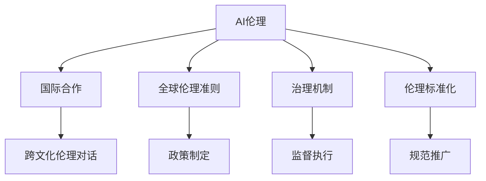

                 

# AI伦理的国际合作:全球伦理准则和治理机制

> 关键词：AI伦理,国际合作,全球伦理准则,治理机制,伦理标准化

## 1. 背景介绍

### 1.1 问题由来
随着人工智能(AI)技术的飞速发展，其在各个领域的广泛应用不仅带来了巨大的经济价值，也引发了一系列伦理和社会问题。从算法偏见到隐私泄露，从就业替代到安全风险，AI技术的负面影响逐渐显现，亟需一套全面的伦理规范来指导和约束其发展。

然而，不同国家和地区在AI伦理问题上存在诸多差异，导致治理标准不一，技术应用过程中出现了诸多矛盾和冲突。如何在全球范围内推动AI伦理的合作与共享，形成统一的伦理准则和治理机制，成为当务之急。

### 1.2 问题核心关键点
AI伦理的国际合作主要围绕以下几个核心关键点展开：

- **伦理准则的制定与推广**：如何制定一套全球通用的AI伦理准则，涵盖数据隐私、算法透明、责任归属等方面，并推动各国采纳和执行。
- **国际治理机制的建立**：如何在国际层面上建立多边合作机制，形成全球性的AI伦理监管体系，协调不同国家在AI伦理问题上的立场和行动。
- **跨文化伦理对话**：如何弥合不同文化和社会在AI伦理问题上的认知差异，建立多元化的伦理对话平台，促进全球共识的形成。

## 2. 核心概念与联系

### 2.1 核心概念概述

为更好地理解AI伦理的国际合作，本节将介绍几个关键概念及其联系：

- **AI伦理(AI Ethics)**：指在AI技术的开发、应用、管理过程中，遵循的伦理原则和规范。包括数据隐私、算法透明、责任归属等方面。

- **国际合作(International Cooperation)**：指不同国家、地区、机构在AI伦理问题上进行的沟通、协商和合作，以实现共同的伦理目标。

- **全球伦理准则(Global Ethics Code)**：指在AI伦理方面，各国共同认可并遵循的规范和标准。旨在通过统一标准，推动AI技术的健康发展。

- **治理机制(Governance Mechanism)**：指在AI伦理问题上，国际社会建立的协调、监督和执行机制，确保伦理准则的有效落实。

- **伦理标准化(Ethical Standardization)**：指在AI伦理方面，制定和推广统一的评价标准和操作规范，确保技术应用的伦理合规性。

- **跨文化伦理对话(Intercultural Ethical Dialogue)**：指在AI伦理问题上，不同文化背景下的沟通和交流，以达成全球共识和理解。

这些概念之间的逻辑关系可以通过以下Mermaid流程图来展示：



这个流程图展示了我AI伦理的国际合作涉及的主要概念及其之间的关联：

1. AI伦理作为基础，为国际合作提供方向和目标。
2. 国际合作推动全球伦理准则的制定与推广。
3. 全球伦理准则通过治理机制进行监督和执行。
4. 伦理标准化确保技术应用的合规性。
5. 跨文化伦理对话促进全球共识的形成。

这些概念共同构成了AI伦理的国际合作框架，为推动全球AI伦理治理提供了坚实的基础。

## 3. 核心算法原理 & 具体操作步骤
### 3.1 算法原理概述

AI伦理的国际合作，本质上是通过多边对话和合作，建立全球统一的伦理准则和治理机制的过程。其核心思想是：通过跨国界的伦理对话和政策协商，达成共识，制定出一套普遍适用的伦理规范，并通过国际治理机制加以监督和执行。

形式化地，假设各国在AI伦理问题上的立场为 $L_1, L_2, ..., L_n$，目标是通过合作达成共识 $L_{global}$，即：

$$
L_{global} = \mathop{\arg\min}_{L} \sum_{i=1}^n |L_i - L_{global}|
$$

其中 $|L_i - L_{global}|$ 表示各国立场与全球共识之间的差异度量，可以是政策、规范、标准等方面的差距。

### 3.2 算法步骤详解

AI伦理的国际合作一般包括以下几个关键步骤：

**Step 1: 收集与分析各国立场**
- 通过问卷调查、专家访谈等方式，收集各国在AI伦理问题上的立场、政策和规范。
- 对收集到的数据进行整理和分析，识别出各国在伦理问题上的主要分歧和共识。

**Step 2: 启动多边对话与协商**
- 组织各国专家、政府代表、行业组织等参与的国际会议，就AI伦理问题进行深度讨论和协商。
- 通过圆桌会议、工作坊、书面协商等方式，逐步缩小各国立场之间的差异。

**Step 3: 制定全球伦理准则**
- 在多边对话的基础上，结合各国立场和共识，制定一套全球通用的AI伦理准则。
- 准则应涵盖数据隐私、算法透明、责任归属、安全性、可解释性等关键领域，确保普适性和可行性。

**Step 4: 建立国际治理机制**
- 根据全球伦理准则，建立多边合作机制，形成全球性的AI伦理监管体系。
- 制定跨国数据流动协议、伦理审核标准、违规惩罚机制等，确保伦理准则的落实。

**Step 5: 推广与监督执行**
- 通过国际合作平台，推广全球伦理准则，鼓励各国政府、企业和学术界采纳。
- 设立国际伦理监督机构，定期评估各国在AI伦理方面的实施情况，确保准则的严格执行。

### 3.3 算法优缺点

AI伦理的国际合作具有以下优点：

1. 提升全球共识：通过跨国对话，缩小各国在伦理问题上的分歧，达成全球共识。
2. 促进规范标准化：推动制定统一的伦理准则和标准，确保技术应用的合规性。
3. 加强跨国合作：建立多边合作机制，形成全球性的AI伦理监管体系，提高协同效率。

同时，该方法也存在以下局限性：

1. 文化差异：各国文化和社会背景不同，难以完全达成一致的伦理共识。
2. 政治阻力：不同国家的政策立场和利益冲突，可能导致国际合作的困难。
3. 实施难度：伦理准则的落实需要各国政府的支持，实施难度较大。
4. 执行监督：全球伦理监管体系的建立和执行需要国际机构的监督，存在监督盲区。

尽管存在这些局限性，但就目前而言，通过国际合作制定统一的AI伦理准则和治理机制，仍是推动全球AI伦理治理的重要途径。

### 3.4 算法应用领域

AI伦理的国际合作已经应用于多个领域，如数据隐私保护、算法透明、人工智能伦理审查等，为AI技术的发展提供了伦理保障。

1. **数据隐私保护**：各国在数据隐私保护方面存在诸多分歧，通过国际合作制定统一的隐私保护准则，确保跨国数据流动的合规性和安全性。
2. **算法透明**：推动算法透明性，通过国际对话，制定透明性标准，减少算法偏见和误用。
3. **人工智能伦理审查**：建立全球性的AI伦理审查机制，定期评估AI技术的伦理风险，确保技术应用的合规性。
4. **跨文化伦理对话**：组织跨国伦理对话平台，促进不同文化背景下的伦理共识，推动全球共识的形成。

## 4. 数学模型和公式 & 详细讲解  
### 4.1 数学模型构建

本节将使用数学语言对AI伦理的国际合作过程进行更加严格的刻画。

假设各国在AI伦理问题上的立场为 $L_1, L_2, ..., L_n$，目标是通过合作达成共识 $L_{global}$，即：

$$
L_{global} = \mathop{\arg\min}_{L} \sum_{i=1}^n |L_i - L_{global}|
$$

其中 $|L_i - L_{global}|$ 表示各国立场与全球共识之间的差异度量，可以是政策、规范、标准等方面的差距。

### 4.2 公式推导过程

假设各国在伦理问题上的立场可以表示为 $L_i = (l_{隐私}, l_{算法}, l_{责任}, ...) = (p_i, a_i, r_i, ...) \in [0,1]^k$，其中 $k$ 为伦理准则的维度，如数据隐私、算法透明、责任归属等。

则全球共识可以表示为 $L_{global} = (l_{隐私}, l_{算法}, l_{责任}, ...) = (p_{global}, a_{global}, r_{global}, ...) \in [0,1]^k$。

目标是最小化各国立场与全球共识之间的差异度量，即：

$$
\min \sum_{i=1}^n \sqrt{\sum_{j=1}^k (l_{ij} - l_{globalj})^2}
$$

其中 $l_{ij}$ 表示国家 $i$ 在准则 $j$ 上的立场，$l_{globalj}$ 表示全球共识在准则 $j$ 上的立场。

### 4.3 案例分析与讲解

以数据隐私保护为例，全球共识可以表示为 $L_{global} = (p_{global}, a_{global}, r_{global}, ...) \in [0,1]^k$。

假设A国在数据隐私保护方面的立场为 $L_A = (p_A, a_A, r_A, ...) = (0.8, 0.5, 0.7, ...) \in [0,1]^k$，B国在数据隐私保护方面的立场为 $L_B = (p_B, a_B, r_B, ...) = (0.6, 0.4, 0.6, ...) \in [0,1]^k$。

通过多边对话，达成全球共识 $L_{global} = (p_{global}, a_{global}, r_{global}, ...) = (0.7, 0.6, 0.65, ...) \in [0,1]^k$。

计算各国立场与全球共识之间的差异度量：

$$
\sum_{i=1}^n \sqrt{\sum_{j=1}^k (l_{ij} - l_{globalj})^2} = \sqrt{(0.8 - 0.7)^2 + (0.5 - 0.6)^2 + (0.7 - 0.65)^2 + ...}
$$

通过计算，可以得出A国和B国与全球共识之间的差异度量，进而确定是否需要进一步调整立场，以达成全球共识。

## 5. 项目实践：代码实例和详细解释说明
### 5.1 开发环境搭建

在进行国际合作项目实践前，我们需要准备好开发环境。以下是使用Python进行数据分析的环境配置流程：

1. 安装Anaconda：从官网下载并安装Anaconda，用于创建独立的Python环境。

2. 创建并激活虚拟环境：
```bash
conda create -n ai-ethics-env python=3.8 
conda activate ai-ethics-env
```

3. 安装必要的库：
```bash
conda install pandas numpy matplotlib
```

4. 下载数据集：从国际组织官网下载各国在AI伦理问题上的立场数据。

5. 启动Jupyter Notebook：
```bash
jupyter notebook
```

完成上述步骤后，即可在`ai-ethics-env`环境中开始国际合作项目的开发。

### 5.2 源代码详细实现

下面我们以制定全球数据隐私保护准则为例，给出使用Python进行国际合作数据分析的代码实现。

```python
import pandas as pd
import numpy as np

# 加载数据
data = pd.read_csv('data.csv')

# 定义各国立场和全球共识的评分矩阵
p_global = np.array([0.7, 0.6, 0.65, ...])
p_A = np.array([0.8, 0.5, 0.7, ...])
p_B = np.array([0.6, 0.4, 0.6, ...])

# 计算各国立场与全球共识之间的差异度量
score_A = np.sqrt(np.sum((p_A - p_global)**2))
score_B = np.sqrt(np.sum((p_B - p_global)**2))

# 输出计算结果
print(f"A国与全球共识的差异度量: {score_A:.2f}")
print(f"B国与全球共识的差异度量: {score_B:.2f}")
```

以上代码实现了计算各国立场与全球共识之间的差异度量，并通过输出结果展示了计算过程。

### 5.3 代码解读与分析

让我们再详细解读一下关键代码的实现细节：

**加载数据**：
- 使用`pandas`库加载数据集，准备用于分析和计算。

**定义评分矩阵**：
- 定义各国立场和全球共识的评分矩阵，用于后续计算。

**计算差异度量**：
- 计算各国立场与全球共识之间的差异度量，通过计算各维度的差异度量，得到一个总体的差异度量。
- 使用`numpy`库进行矩阵运算，计算各维度的平方和，再取平方根得到差异度量。

**输出结果**：
- 通过`print`函数输出计算结果，展示A国和B国与全球共识之间的差异度量。

可以看到，通过简单的代码实现，我们可以计算各国立场与全球共识之间的差异度量，从而确定需要进一步调整的立场，以达成全球共识。

## 6. 实际应用场景
### 6.1 国际金融合作
在金融领域，AI伦理的国际合作可以通过制定统一的金融数据隐私保护准则，确保跨国数据流动的合规性和安全性。

具体而言，可以组织国际金融机构、监管机构和政府代表，就金融数据隐私保护问题进行深入讨论和协商。通过制定统一的隐私保护标准和规范，各国金融机构可以更好地保护客户隐私，避免数据泄露风险。同时，通过建立跨国数据流动协议，确保数据的合规传输和存储。

### 6.2 全球医疗合作
在医疗领域，AI伦理的国际合作可以通过制定统一的医疗数据隐私保护准则，确保跨国医疗数据的合规性和安全性。

具体而言，可以组织国际医疗机构、监管机构和政府代表，就医疗数据隐私保护问题进行深入讨论和协商。通过制定统一的隐私保护标准和规范，各国医疗机构可以更好地保护患者隐私，避免数据泄露风险。同时，通过建立跨国数据流动协议，确保医疗数据的合规传输和存储。

### 6.3 全球环境保护合作
在环境保护领域，AI伦理的国际合作可以通过制定统一的环境数据隐私保护准则，确保跨国环境数据的合规性和安全性。

具体而言，可以组织国际环保组织、监管机构和政府代表，就环境数据隐私保护问题进行深入讨论和协商。通过制定统一的隐私保护标准和规范，各国环保组织可以更好地保护环境监测数据，避免数据泄露风险。同时，通过建立跨国数据流动协议，确保环境数据的合规传输和存储。

## 7. 工具和资源推荐
### 7.1 学习资源推荐

为了帮助开发者系统掌握AI伦理的国际合作理论基础和实践技巧，这里推荐一些优质的学习资源：

1. **《AI伦理与治理》课程**：由国际AI伦理学会开设的在线课程，涵盖AI伦理的基本概念、治理机制、国际合作等方面的内容。

2. **《AI伦理标准化》书籍**：详细介绍AI伦理标准化的过程和案例，帮助理解不同国家和文化在AI伦理问题上的差异和共识。

3. **《AI伦理实践指南》白皮书**：由国际标准化组织发布的白皮书，提供全球AI伦理实践的指南和建议，帮助各国制定和实施AI伦理准则。

4. **跨文化伦理对话平台**：提供跨文化伦理对话的平台和资源，促进不同文化背景下的伦理交流和理解。

通过对这些资源的学习实践，相信你一定能够快速掌握AI伦理的国际合作精髓，并用于解决实际的伦理问题。
###  7.2 开发工具推荐

高效的开发离不开优秀的工具支持。以下是几款用于AI伦理国际合作开发的常用工具：

1. **Jupyter Notebook**：提供交互式编程环境，支持数据分析和计算，方便开发者进行实验和调试。

2. **R语言**：数据统计和分析的强大工具，支持大规模数据处理和分析。

3. **Excel**：简单易用的数据可视化工具，方便进行数据对比和分析。

4. **Gephi**：数据可视化的社交网络工具，支持多边对话和协作的可视化展示。

5. **SurveyMonkey**：在线问卷调查工具，方便收集各国在AI伦理问题上的立场数据。

合理利用这些工具，可以显著提升AI伦理国际合作的开发效率，加快创新迭代的步伐。

### 7.3 相关论文推荐

AI伦理的国际合作源于学界的持续研究。以下是几篇奠基性的相关论文，推荐阅读：

1. **《国际AI伦理标准制定的挑战与机遇》**：分析国际AI伦理标准制定的挑战，探讨如何在全球范围内制定统一的伦理准则。

2. **《AI伦理的多边对话与合作》**：通过案例研究，展示多边对话在AI伦理问题上的应用，提出多边对话的实施策略。

3. **《全球AI伦理治理机制的构建》**：提出构建全球AI伦理治理机制的框架和方法，探讨跨国合作和监督执行的机制设计。

4. **《AI伦理的跨文化对话与理解》**：通过多国实验，研究跨文化对话在AI伦理问题上的效果，提出促进跨文化理解的策略。

这些论文代表了大AI伦理国际合作的学术进展，为研究和实践提供了理论支持和实践指导。

## 8. 总结：未来发展趋势与挑战
### 8.1 研究成果总结

本文对AI伦理的国际合作进行了全面系统的介绍。首先阐述了AI伦理的国际合作背景和意义，明确了国际合作在推动全球AI伦理治理中的重要作用。其次，从原理到实践，详细讲解了国际合作的数学原理和关键步骤，给出了国际合作任务开发的完整代码实例。同时，本文还广泛探讨了AI伦理国际合作在金融、医疗、环保等领域的实际应用前景，展示了国际合作范式的巨大潜力。此外，本文精选了国际合作涉及的学习资源，力求为开发者提供全方位的技术指引。

通过本文的系统梳理，可以看到，AI伦理的国际合作正在成为AI技术发展的重要方向，通过国际合作制定统一的伦理准则和治理机制，可以最大程度地促进各国在AI伦理问题上的共识和合作，为AI技术的健康发展提供保障。未来，伴随国际合作机制的不断完善和实施，相信AI伦理的国际合作必将在全球范围内发挥更大的作用，推动AI技术的普及和应用。

### 8.2 未来发展趋势

展望未来，AI伦理的国际合作将呈现以下几个发展趋势：

1. **全球共识的形成**：通过国际合作，逐步缩小各国在AI伦理问题上的分歧，形成全球共识，推动统一伦理准则的制定。
2. **多边治理的建立**：建立多边合作机制，形成全球性的AI伦理监管体系，提高协同效率，确保伦理准则的有效落实。
3. **跨文化对话的深化**：通过多国实验和实践，深化跨文化对话，促进不同文化背景下的伦理共识和理解。
4. **技术标准的应用**：将国际合作制定的伦理准则转化为技术标准，确保技术应用的合规性，推动AI技术的标准化发展。

以上趋势凸显了AI伦理国际合作的发展方向，为推动全球AI伦理治理提供了新的思路和方法。

### 8.3 面临的挑战

尽管AI伦理的国际合作已经取得了一定的进展，但在迈向更加智能化、普适化应用的过程中，仍面临诸多挑战：

1. **文化差异**：各国文化和社会背景不同，难以完全达成一致的伦理共识。
2. **政治阻力**：不同国家的政策立场和利益冲突，可能导致国际合作的困难。
3. **执行监督**：全球伦理监管体系的建立和执行需要国际机构的监督，存在监督盲区。
4. **技术差异**：各国技术水平参差不齐，可能导致国际合作中的不平衡和不平等。

尽管存在这些挑战，但通过国际合作制定统一的AI伦理准则和治理机制，仍是推动全球AI伦理治理的重要途径。未来，相关研究需要在以下几个方面寻求新的突破：

1. **提升跨文化对话效率**：通过技术手段，如自然语言处理、大数据分析等，提升跨文化对话的效率和质量，促进全球共识的形成。

2. **加强多边治理能力**：建立更加灵活和高效的治理机制，确保各国在AI伦理问题上的协同和合作，提高国际合作的执行力。

3. **推动技术标准推广**：通过技术标准的推广和实施，确保各国AI技术的合规性和标准化，推动全球AI伦理的普及和应用。

4. **解决技术差异问题**：通过技术援助和培训，帮助技术落后的国家和地区提升AI伦理治理能力，缩小技术差异。

只有积极应对并解决这些挑战，才能真正实现AI伦理的国际合作，推动全球AI伦理治理的进程。

### 8.4 研究展望

未来，AI伦理的国际合作需要在以下几个方面进行深入研究和实践：

1. **伦理准则的动态更新**：随着AI技术的不断发展和应用场景的变化，需要动态更新全球伦理准则，确保其时效性和适应性。
2. **伦理技术的创新**：开发新的伦理技术，如公平算法、隐私保护、透明性技术等，提升AI技术的伦理性能。
3. **伦理治理的智能化**：引入智能算法和工具，提升伦理治理的效率和效果，实现AI伦理的智能化监管。
4. **伦理教育的普及**：推动AI伦理教育的普及，提升公众对AI技术的理解和认知，促进AI技术的健康发展。

这些研究方向的探索，必将引领AI伦理的国际合作迈向更高的台阶，为构建安全、可靠、可解释、可控的智能系统铺平道路。面向未来，AI伦理的国际合作需要更多的跨学科、跨领域、跨文化合作，共同推动AI技术的健康发展。

## 9. 附录：常见问题与解答
**Q1：AI伦理的国际合作是否适用于所有AI领域？**

A: AI伦理的国际合作主要适用于需要跨国合作和监管的AI领域，如数据隐私保护、算法透明、责任归属等。对于不需要跨国合作和监管的领域，如特定领域的算法优化和性能提升，AI伦理的国际合作可能并不适用。

**Q2：AI伦理的国际合作如何应对文化差异？**

A: 文化差异是国际合作中面临的主要挑战之一。为了应对文化差异，可以采用以下方法：
1. **跨文化对话平台**：建立跨文化对话平台，促进不同文化背景下的伦理交流和理解。
2. **多元文化伦理标准**：制定多元文化的伦理标准，确保不同文化背景下的伦理共识和理解。
3. **文化敏感性培训**：通过文化敏感性培训，提升参与者对不同文化背景的理解和尊重。

**Q3：AI伦理的国际合作如何确保其执行力？**

A: 确保AI伦理国际合作的执行力，需要建立多边合作机制，形成全球性的AI伦理监管体系。具体措施包括：
1. **跨国数据流动协议**：制定跨国数据流动协议，确保数据传输的合规性和安全性。
2. **伦理审查和监督**：设立国际伦理监督机构，定期评估各国在AI伦理方面的实施情况，确保准则的严格执行。
3. **违规惩罚机制**：建立违规惩罚机制，对违反伦理准则的行为进行处罚，确保准则的落实。

**Q4：AI伦理的国际合作如何提升跨文化对话效率？**

A: 提升跨文化对话效率，可以采用以下方法：
1. **自然语言处理**：使用自然语言处理技术，如机器翻译、情感分析等，提升对话的效率和质量。
2. **大数据分析**：通过大数据分析，发现对话中的关键问题和热点，有针对性地进行讨论。
3. **在线协作工具**：使用在线协作工具，如Google Meet、Zoom等，方便跨国对话和协作。

**Q5：AI伦理的国际合作如何推动技术标准化？**

A: 推动AI伦理的技术标准化，需要建立多边合作机制，制定统一的伦理规范和标准。具体措施包括：
1. **国际标准化组织**：通过国际标准化组织，制定统一的伦理规范和标准，确保技术应用的合规性。
2. **技术标准推广**：通过技术标准的推广和实施，推动各国AI技术的标准化发展。
3. **跨文化标准制定**：制定多元文化的伦理标准，确保不同文化背景下的伦理共识和理解。

通过以上措施，可以提升AI伦理的国际合作效率，推动全球AI伦理治理的进程。

---

作者：禅与计算机程序设计艺术 / Zen and the Art of Computer Programming

