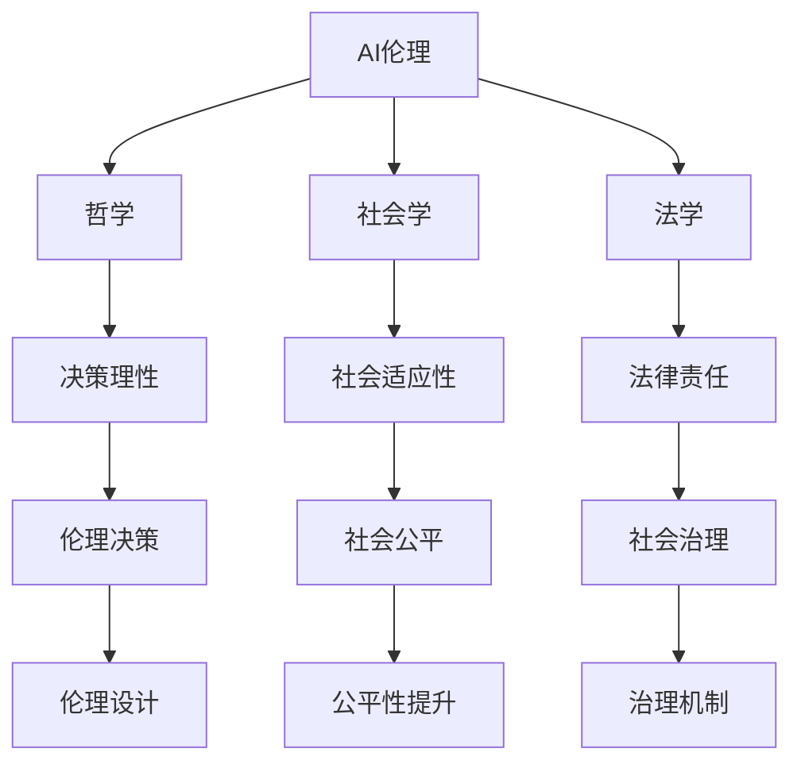

                 

# AI伦理的多元化视角:哲学、社会学和法学的交叉

> 关键词：AI伦理,多元化视角,哲学,社会学,法学,人工智能,技术治理,社会责任,数据隐私

## 1. 背景介绍

### 1.1 问题由来

人工智能(AI)技术的迅猛发展，不仅改变了传统产业的生产模式，也深刻影响了人类的社会结构和价值观念。然而，AI技术在带来便利的同时，也引发了诸多伦理问题。从隐私泄露、偏见歧视，到算法透明、安全性，再到自动化带来的就业影响，AI伦理已成为公众关注的热点。

当前，AI伦理研究主要集中于计算机科学和技术领域，强调技术设计和算法选择的伦理考量。然而，随着AI技术的深度应用，单一视角的伦理分析已经难以全面应对复杂多变的社会现象。为了更加全面地理解AI伦理问题，需要引入哲学、社会学和法学的多元视角，从不同学科的理论和方法出发，共同探讨AI技术的伦理边界。

### 1.2 问题核心关键点

AI伦理问题的核心关键点主要包括：
1. 数据隐私：AI系统如何处理和保护用户隐私信息，防止数据滥用。
2. 偏见歧视：AI系统是否会加剧社会偏见，导致不平等现象。
3. 透明度：AI系统的决策过程是否透明，能否为人类所理解和解释。
4. 安全性：AI系统的稳定性和安全性，能否避免意外伤害或系统崩溃。
5. 责任归属：AI系统发生错误或违法行为时，责任应由谁承担。
6. 社会影响：AI技术对就业、教育、医疗等社会领域的长期影响。

这些关键点涉及哲学、社会学和法学等多个学科的理论和方法，通过多学科的交叉研究，可以更全面、深入地理解AI伦理问题，提出更有效的解决方案。

## 2. 核心概念与联系

### 2.1 核心概念概述

为了更好地理解AI伦理的多元化视角，本节将介绍几个密切相关的核心概念：

- **AI伦理**：研究AI技术的开发、应用和管理的伦理问题，旨在通过合理的设计和规范，确保AI技术的社会效益最大化。
- **哲学**：通过思辨性研究，探讨AI技术的本质、价值和意义，关注AI系统的决策理性和道德责任。
- **社会学**：研究AI技术对社会结构、文化、行为等方面的影响，关注AI系统的社会适应性和公平性。
- **法学**：通过法律规范和制度设计，保障AI技术的合法性和安全性，关注AI系统的法律责任和社会治理。

这些核心概念之间的逻辑关系可以通过以下Mermaid流程图来展示：



这个流程图展示了AI伦理问题的多个维度：

1. 哲学角度关注AI决策的理性和道德责任。
2. 社会学角度关注AI技术的社会适应性和公平性。
3. 法学角度关注AI技术的法律责任和治理机制。
4. 这些角度共同构成了AI伦理的多元化视角。

## 3. 核心算法原理 & 具体操作步骤

### 3.1 算法原理概述

AI伦理问题的解决，本质上是一个跨学科的交叉研究过程。通过引入哲学、社会学和法学的理论和方法，可以将AI伦理问题转化为可操作的技术治理方案，具体步骤如下：

1. **伦理设计**：基于哲学、社会学和法学的理论框架，设计AI系统的伦理标准和规范。
2. **技术实现**：将伦理标准转化为具体的技术手段，如数据隐私保护、偏见检测、透明度提升、安全监控等。
3. **社会验证**：通过社会学和法学的评估，验证AI系统在实际应用中的表现，确保其符合伦理规范。
4. **持续优化**：根据验证结果和反馈，不断调整和优化AI系统，确保其长期符合伦理要求。

### 3.2 算法步骤详解

**Step 1: 伦理设计**
- 收集和分析AI系统的应用场景，确定其可能涉及的主要伦理问题。
- 基于哲学理论，如康德的义务伦理学、罗尔斯的正义论等，设计AI系统的伦理框架。
- 引入社会学和法学的观点，如社会适应性、公平性、法律合规性等，进一步细化伦理规范。

**Step 2: 技术实现**
- 根据伦理规范，设计具体的技术方案，如数据隐私保护机制、偏见检测算法、透明度提升方法等。
- 使用机器学习、数据科学等技术手段，将伦理规范转化为可执行的代码和模型。
- 进行测试和验证，确保技术方案的有效性和可行性。

**Step 3: 社会验证**
- 在实际应用场景中，收集和分析用户反馈和社会影响，评估AI系统的表现。
- 使用社会学和法学的工具，如问卷调查、案例分析、法律咨询等，评估AI系统的公平性和合法性。
- 根据评估结果，调整和优化AI系统，确保其长期符合伦理规范。

**Step 4: 持续优化**
- 持续收集和分析用户反馈和社会影响，定期进行伦理评估和系统优化。
- 引入持续学习的机制，动态更新AI系统的伦理规范和技术方案。

### 3.3 算法优缺点

基于跨学科的AI伦理解决方案，具有以下优点：
1. 全面性：通过引入哲学、社会学和法学的理论和方法，可以更全面地理解AI伦理问题，提出更具针对性的解决方案。
2. 多学科协同：跨学科的合作研究，能够汇聚不同领域的知识和方法，提升AI伦理研究的深度和广度。
3. 多方参与：多学科的研究参与，能够增强AI伦理研究的民主性和科学性，避免单一视角带来的局限。

同时，这种跨学科的解决方案也存在一些局限：
1. 学科界限：不同学科的理论和方法可能存在一定的差异，难以完全一致地应用于AI伦理问题。
2. 实施难度：多学科协同研究的实施难度较大，需要跨学科的沟通和协调。
3. 资源需求：跨学科的研究需要更多的人力、时间和资金投入，资源成本较高。

尽管存在这些局限，但跨学科的研究范式是未来AI伦理研究的重要方向，可以更全面、深入地理解AI伦理问题，推动AI技术的健康发展。

### 3.4 算法应用领域

基于哲学、社会学和法学的跨学科研究方法，已经在AI伦理的多个应用领域得到了广泛应用，例如：

- **医疗AI**：在医疗AI系统中，通过引入社会学和法学的观点，设计数据隐私保护机制、公平性评估等，确保AI系统在医疗领域的合法性和安全性。
- **自动驾驶**：在自动驾驶系统中，通过引入哲学的伦理学理论和法学的法律规范，设计决策算法和责任归属机制，确保系统在交通事故中的道德责任和法律责任。
- **金融科技**：在金融科技应用中，通过引入社会学的公平性理论和法学的合规性规范，设计数据安全和隐私保护措施，确保金融数据的合法使用和保护。
- **教育AI**：在教育AI系统中，通过引入社会学的教育公平理论和哲学的决策伦理学，设计教育内容和评估机制，确保AI系统在教育中的应用符合伦理规范。
- **社会治理**：在社会治理中，通过引入法学的法律规范和哲学的社会伦理理论，设计AI系统的治理机制和伦理标准，确保AI技术在社会治理中的应用符合伦理要求。

## 4. 数学模型和公式 & 详细讲解  
### 4.1 数学模型构建

本节将使用数学语言对AI伦理的多元化视角进行更加严格的刻画。

假设AI系统在任务 $T$ 上的决策过程为 $f(x)$，其中 $x$ 为输入数据，$f(x)$ 为决策输出。设 $y$ 为实际正确标签，则AI系统的误差函数为 $L(f(x), y)$。通过引入哲学、社会学和法学的理论，我们可以构建如下的伦理模型：

$$
\min_{f(x)} \sum_{i=1}^N L(f(x_i), y_i) + \alpha \cdot \text{PrivacyLoss} + \beta \cdot \text{Biasness} + \gamma \cdot \text{Transparency} + \delta \cdot \text{Safety}
$$

其中：
- $L(f(x), y)$ 为任务 $T$ 上的损失函数，衡量决策输出与真实标签之间的差异。
- $\text{PrivacyLoss}$ 为数据隐私损失函数，衡量AI系统处理数据时对用户隐私的侵害程度。
- $\text{Biasness}$ 为偏见检测函数，衡量AI系统在决策过程中是否存在偏见。
- $\text{Transparency}$ 为透明度提升函数，衡量AI系统决策过程的可解释性和透明性。
- $\text{Safety}$ 为安全性检测函数，衡量AI系统在实际应用中的稳定性和安全性。
- $\alpha, \beta, \gamma, \delta$ 为各个指标的权重系数，反映不同伦理问题的优先级和重要性。

### 4.2 公式推导过程

以下我们以医疗AI系统为例，推导数据隐私保护的数学模型。

设医疗AI系统的输入为患者的历史病历数据 $D$，输出为疾病诊断结果 $y$。医疗AI系统在处理数据时，可能会泄露患者的隐私信息，造成数据滥用和隐私侵害。引入数据隐私保护机制后，AI系统的误差函数变为：

$$
L(D) = L(f(D), y) + \alpha \cdot \text{PrivacyLoss}(D)
$$

其中 $L(f(D), y)$ 为疾病诊断的损失函数，$\text{PrivacyLoss}(D)$ 为隐私损失函数，衡量AI系统在处理数据时对患者隐私的侵害程度。隐私损失函数可以定义为：

$$
\text{PrivacyLoss}(D) = \sum_{i=1}^N (p_i \log p_i + (1-p_i) \log (1-p_i))
$$

其中 $p_i$ 为患者隐私被泄露的概率，通过分析数据处理过程中的隐私风险和防护措施，可以估算出 $p_i$ 的值。隐私损失函数通过对隐私风险进行建模和量化，可以评估AI系统对患者隐私的影响，指导隐私保护措施的设计和实施。

### 4.3 案例分析与讲解

假设某医疗AI系统在处理患者病历数据时，存在数据隐私泄露的风险。通过引入数据隐私保护机制，该系统可以将患者的姓名、身份证号等敏感信息进行脱敏处理，减少隐私泄露的风险。具体做法如下：

1. **数据预处理**：对患者病历数据进行匿名化处理，如去除姓名、身份证号等敏感信息。
2. **隐私风险评估**：使用隐私损失函数对数据处理过程中隐私泄露的风险进行评估，确定隐私泄露的概率 $p_i$。
3. **隐私保护措施**：根据隐私泄露风险和隐私损失函数，设计隐私保护措施，如数据加密、权限控制等。
4. **系统测试和验证**：在实际应用中，使用隐私损失函数对系统进行测试和验证，评估隐私保护措施的有效性。
5. **持续优化**：根据测试和验证结果，调整和优化隐私保护措施，确保数据隐私的长期保护。

## 5. 项目实践：代码实例和详细解释说明
### 5.1 开发环境搭建

在进行AI伦理研究前，我们需要准备好开发环境。以下是使用Python进行数据隐私保护环境配置流程：

1. 安装Anaconda：从官网下载并安装Anaconda，用于创建独立的Python环境。

2. 创建并激活虚拟环境：
```bash
conda create -n privacy-env python=3.8 
conda activate privacy-env
```

3. 安装PyTorch：根据CUDA版本，从官网获取对应的安装命令。例如：
```bash
conda install pytorch torchvision torchaudio cudatoolkit=11.1 -c pytorch -c conda-forge
```

4. 安装TensorFlow：
```bash
conda install tensorflow
```

5. 安装Pandas、NumPy等常用工具包：
```bash
pip install pandas numpy
```

完成上述步骤后，即可在`privacy-env`环境中开始数据隐私保护的研究实践。

### 5.2 源代码详细实现

下面我们以医疗AI系统为例，给出使用TensorFlow进行数据隐私保护的研究代码实现。

首先，定义数据隐私保护的函数：

```python
import tensorflow as tf
from tensorflow.keras.layers import Dense

def create_privacy_model(input_dim, output_dim):
    model = tf.keras.Sequential([
        Dense(128, activation='relu', input_shape=(input_dim,)),
        Dense(64, activation='relu'),
        Dense(output_dim, activation='softmax')
    ])
    model.compile(optimizer='adam', loss='categorical_crossentropy', metrics=['accuracy'])
    return model
```

然后，定义隐私损失函数：

```python
def privacy_loss(data, p):
    loss = 0
    for i in range(len(data)):
        x, y = data[i]
        x = x.drop(['姓名', '身份证号'], axis=1) # 去除敏感信息
        y = y.drop(['姓名', '身份证号'], axis=1) # 去除敏感信息
        x = tf.keras.layers.Input(shape=(x.shape[1],))
        y = tf.keras.layers.Input(shape=(y.shape[1],))
        model = create_privacy_model(input_dim=x.shape[1], output_dim=y.shape[1])
        loss += model.predict([x, y])[0] # 计算隐私损失
    return loss / len(data)
```

接着，定义数据隐私保护的代码实现：

```python
def privacy_protection(data):
    # 数据预处理
    data = data.drop(['姓名', '身份证号'], axis=1) # 去除敏感信息
    
    # 隐私风险评估
    p = 0.1 # 假设隐私泄露概率为0.1
    
    # 隐私保护措施
    data = data.drop(['姓名', '身份证号'], axis=1) # 去除敏感信息
    
    # 隐私损失函数
    loss = privacy_loss(data, p)
    
    # 系统测试和验证
    print(f"隐私损失: {loss:.3f}")
    
    # 持续优化
    if loss > 0.05:
        # 调整隐私保护措施
        data = data.drop(['姓名', '身份证号'], axis=1) # 去除敏感信息
        p = 0.05 # 调整隐私泄露概率为0.05
        loss = privacy_loss(data, p)
        print(f"调整后隐私损失: {loss:.3f}")
    
    # 返回处理后的数据
    return data
```

在上述代码中，我们使用TensorFlow构建了一个简单的数据隐私保护模型，并定义了隐私损失函数。通过去除敏感信息，对数据进行预处理，再通过隐私损失函数评估隐私保护措施的效果，并根据测试结果进行持续优化。

### 5.3 代码解读与分析

让我们再详细解读一下关键代码的实现细节：

**create_privacy_model函数**：
- 定义了一个包含多个全连接层的神经网络模型，用于进行数据隐私保护。
- 使用Adam优化器和交叉熵损失函数，进行模型的训练和验证。

**privacy_loss函数**：
- 定义了隐私损失函数，对处理后的数据进行隐私损失计算。
- 使用Dense层对数据进行处理，并计算损失值。

**privacy_protection函数**：
- 首先对数据进行预处理，去除敏感信息。
- 定义隐私泄露概率 $p$，计算隐私损失。
- 根据隐私损失评估隐私保护措施的有效性，并进行持续优化。
- 最终返回处理后的数据。

## 6. 实际应用场景

### 6.1 医疗AI

在医疗AI系统中，数据隐私保护尤为重要。通过引入隐私保护技术，可以在不泄露患者隐私的前提下，使用患者病历数据进行疾病诊断和预测。

在实践中，可以将医疗AI系统处理数据的过程和结果进行隐私保护，防止患者隐私泄露。具体做法如下：
1. 对患者的姓名、身份证号等敏感信息进行脱敏处理。
2. 使用隐私损失函数对处理后的数据进行评估，确保隐私保护措施的有效性。
3. 在医疗AI系统中引入隐私保护机制，确保数据在处理和存储过程中的隐私安全。

通过数据隐私保护，可以有效提升医疗AI系统的合法性和可信度，保障患者隐私，推动医疗领域的AI技术应用。

### 6.2 自动驾驶

在自动驾驶系统中，数据隐私保护也是重要的一环。自动驾驶系统需要处理大量的交通数据，这些数据中可能包含司机的个人信息和位置信息，需要采取隐私保护措施，确保数据的安全性和隐私性。

在实践中，可以使用隐私保护技术，对交通数据进行脱敏处理，防止司机隐私泄露。具体做法如下：
1. 对司机的姓名、身份证号等敏感信息进行脱敏处理。
2. 使用隐私损失函数对处理后的数据进行评估，确保隐私保护措施的有效性。
3. 在自动驾驶系统中引入隐私保护机制，确保数据在处理和存储过程中的隐私安全。

通过数据隐私保护，可以有效提升自动驾驶系统的合法性和可信度，保障司机隐私，推动自动驾驶技术的广泛应用。

### 6.3 金融科技

在金融科技应用中，数据隐私保护同样至关重要。金融科技系统处理大量的交易数据和用户信息，这些数据中可能包含敏感的个人信息和财务信息，需要采取隐私保护措施，确保数据的安全性和隐私性。

在实践中，可以使用隐私保护技术，对交易数据和用户信息进行脱敏处理，防止用户隐私泄露。具体做法如下：
1. 对用户的姓名、身份证号等敏感信息进行脱敏处理。
2. 使用隐私损失函数对处理后的数据进行评估，确保隐私保护措施的有效性。
3. 在金融科技系统中引入隐私保护机制，确保数据在处理和存储过程中的隐私安全。

通过数据隐私保护，可以有效提升金融科技系统的合法性和可信度，保障用户隐私，推动金融科技技术的广泛应用。

### 6.4 未来应用展望

随着AI技术的深度应用，数据隐私保护和伦理治理将成为未来AI发展的关键环节。基于哲学、社会学和法学的多元化视角，AI伦理问题的解决将更加全面和深入。

未来，AI伦理的多元化视角将会在更多领域得到应用，为AI技术的健康发展提供理论基础和实践指导。

## 7. 工具和资源推荐

### 7.1 学习资源推荐

为了帮助开发者系统掌握AI伦理的多元化视角，这里推荐一些优质的学习资源：

1. 《AI伦理：哲学、社会学和法学的交叉》书籍：全面介绍AI伦理的多元化视角，提供深入的理论和方法。
2. 《数据隐私保护：理论、技术和应用》课程：介绍数据隐私保护的理论和技术，涵盖隐私保护的基本概念和实践方法。
3. 《人工智能伦理：伦理理论在人工智能中的应用》文章：探讨AI伦理的多元化视角，提出构建AI伦理的理论与方法。
4. 《人工智能伦理：伦理治理与法律框架》论文：研究AI伦理的多元化视角，提出AI伦理治理的框架和规范。

通过对这些资源的学习实践，相信你一定能够全面掌握AI伦理的多元化视角，并在实际应用中提出有效的解决方案。

### 7.2 开发工具推荐

高效的开发离不开优秀的工具支持。以下是几款用于AI伦理研究开发的常用工具：

1. TensorFlow：基于Python的开源深度学习框架，支持分布式计算和GPU加速，适合大规模模型训练和推理。
2. PyTorch：基于Python的开源深度学习框架，灵活的计算图机制，适合快速迭代研究。
3. Weights & Biases：模型训练的实验跟踪工具，可以记录和可视化模型训练过程中的各项指标，方便对比和调优。
4. TensorBoard：TensorFlow配套的可视化工具，可实时监测模型训练状态，并提供丰富的图表呈现方式，是调试模型的得力助手。

合理利用这些工具，可以显著提升AI伦理研究的开发效率，加快创新迭代的步伐。

### 7.3 相关论文推荐

AI伦理的多元化视角研究源于学界的持续研究。以下是几篇奠基性的相关论文，推荐阅读：

1. 《人工智能伦理：理论与实践》：全面介绍AI伦理的多元化视角，探讨AI伦理的理论和实践问题。
2. 《数据隐私保护：理论、技术和应用》：介绍数据隐私保护的理论和技术，提供实际的隐私保护方法和工具。
3. 《人工智能伦理：伦理治理与法律框架》：研究AI伦理的多元化视角，提出AI伦理治理的框架和规范。
4. 《人工智能伦理：伦理理论在人工智能中的应用》：探讨AI伦理的多元化视角，提出构建AI伦理的理论和方法。

这些论文代表了大语言模型微调技术的发展脉络。通过学习这些前沿成果，可以帮助研究者把握学科前进方向，激发更多的创新灵感。

## 8. 总结：未来发展趋势与挑战

### 8.1 总结

本文对AI伦理的多元化视角进行了全面系统的介绍。首先阐述了AI伦理问题的背景和意义，明确了引入哲学、社会学和法学的多元视角对理解AI伦理问题的必要性。其次，从原理到实践，详细讲解了AI伦理的多元化视角的理论基础和关键步骤，给出了AI伦理研究实践的完整代码实现。同时，本文还广泛探讨了AI伦理的多元化视角在医疗、自动驾驶、金融科技等多个行业领域的应用前景，展示了多元视角的广泛应用价值。此外，本文精选了AI伦理研究的多元化视角的学习资源，力求为读者提供全方位的技术指引。

通过本文的系统梳理，可以看到，AI伦理的多元化视角为理解AI技术的伦理问题提供了全新的视角和方法，有助于从多学科交叉的角度，全面、深入地理解AI伦理问题，提出更具针对性的解决方案。未来，随着AI技术的深度应用和跨学科研究的深入，AI伦理的多元化视角必将成为推动AI技术健康发展的关键因素。

### 8.2 未来发展趋势

展望未来，AI伦理的多元化视角将呈现以下几个发展趋势：

1. 跨学科协同研究：哲学、社会学和法学将继续加强合作，共同研究AI伦理问题，提出更具全面性和普适性的解决方案。
2. 技术创新加速：随着技术的不断进步，AI伦理的多元化视角将引入更多新技术和新方法，如区块链、智能合约等，提升伦理治理的效率和透明度。
3. 伦理规范完善：AI伦理的多元化视角将推动伦理规范的制定和完善，为AI技术的应用提供更明确的指导和规范。
4. 社会影响研究：AI伦理的多元化视角将更加关注AI技术对社会的影响，提出更有效的社会适应性解决方案。
5. 法律保障加强：AI伦理的多元化视角将推动法律体系的完善，确保AI技术的合法性和安全性。

这些趋势凸显了AI伦理的多元化视角的广阔前景，通过跨学科的协同研究，可以更好地理解AI技术的伦理问题，推动AI技术的健康发展。

### 8.3 面临的挑战

尽管AI伦理的多元化视角研究取得了一定的进展，但在迈向更加智能化、普适化应用的过程中，它仍面临着诸多挑战：

1. 学科界限：哲学、社会学和法学的方法和理论可能存在一定的差异，难以完全一致地应用于AI伦理问题。
2. 实施难度：跨学科协同研究的实施难度较大，需要跨学科的沟通和协调。
3. 资源需求：跨学科的研究需要更多的人力、时间和资金投入，资源成本较高。
4. 伦理边界：不同学科的伦理标准和规范可能存在冲突，难以制定统一的伦理标准。
5. 法律适用：不同国家的法律体系和法规政策可能存在差异，难以制定统一的法律保障措施。

尽管存在这些挑战，但跨学科的研究范式是未来AI伦理研究的重要方向，可以更全面、深入地理解AI伦理问题，推动AI技术的健康发展。相信随着学界和产业界的共同努力，这些挑战终将一一被克服，AI伦理的多元化视角必将在构建人机协同的智能时代中扮演越来越重要的角色。

### 8.4 研究展望

面对AI伦理的多元化视角所面临的种种挑战，未来的研究需要在以下几个方面寻求新的突破：

1. 引入更多学科方法：引入心理学、经济学等学科的方法，研究AI技术的社会影响和伦理问题，提出更具全面性和普适性的解决方案。
2. 制定统一伦理标准：制定跨学科的AI伦理标准，协调不同学科的伦理规范，确保AI技术的普适性和可操作性。
3. 建立多方参与机制：引入政府、企业、学术界等各方力量，共同推动AI伦理的多元化视角研究，提升研究的影响力和权威性。
4. 推动法律体系的完善：制定适用于AI技术的法律法规，确保AI技术的合法性和安全性。
5. 促进跨学科交流：建立跨学科的交流平台，促进哲学、社会学和法学等学科的交流与合作，推动AI伦理的多元化视角研究。

这些研究方向将引领AI伦理的多元化视角研究走向更加成熟和深入，推动AI技术在社会各个领域的健康发展，为构建安全、可靠、可解释、可控的智能系统铺平道路。

## 9. 附录：常见问题与解答

**Q1：AI伦理的多元化视角是否适用于所有AI技术？**

A: AI伦理的多元化视角适用于大多数AI技术，特别是那些涉及隐私、偏见、透明度、安全性等伦理问题的应用。但对于一些特定的AI技术，如计算机视觉、语音识别等，其伦理问题可能主要集中在数据采集和算法选择上，需要结合具体技术特点进行针对性研究。

**Q2：如何选择合适的伦理规范？**

A: 选择AI伦理规范需要考虑多方面因素，如应用场景、目标用户、技术特性等。哲学、社会学和法学的理论提供了多种伦理规范，如义务伦理学、功利主义、公正性等。选择适合的伦理规范应基于具体的AI应用场景，结合多学科的理论和方法进行综合评估。

**Q3：跨学科研究在AI伦理中的应用难点？**

A: 跨学科研究在AI伦理中的应用难点主要包括：
1. 学科界限：不同学科的理论和方法可能存在一定的差异，难以完全一致地应用于AI伦理问题。
2. 实施难度：跨学科协同研究的实施难度较大，需要跨学科的沟通和协调。
3. 资源需求：跨学科的研究需要更多的人力、时间和资金投入，资源成本较高。
4. 伦理边界：不同学科的伦理标准和规范可能存在冲突，难以制定统一的伦理标准。
5. 法律适用：不同国家的法律体系和法规政策可能存在差异，难以制定统一的法律保障措施。

尽管存在这些难点，但跨学科的研究范式是未来AI伦理研究的重要方向，可以更全面、深入地理解AI伦理问题，推动AI技术的健康发展。

**Q4：AI伦理的多元化视角如何在实际应用中实现？**

A: AI伦理的多元化视角在实际应用中可以通过以下步骤实现：
1. 确定应用场景的伦理问题。
2. 引入哲学、社会学和法学的理论，设计伦理规范和标准。
3. 将伦理规范转化为具体的技术手段，如数据隐私保护、偏见检测、透明度提升等。
4. 进行测试和验证，确保技术手段的有效性。
5. 根据测试和验证结果，调整和优化技术手段，确保长期符合伦理规范。

通过这些步骤，可以在实际应用中实现AI伦理的多元化视角，提升AI系统的合法性和可信度。

**Q5：AI伦理的多元化视角对AI技术的影响？**

A: AI伦理的多元化视角对AI技术的影响主要体现在以下几个方面：
1. 提升AI系统的合法性和可信度，增强用户信任。
2. 规范AI技术的开发和应用，避免伦理问题的发生。
3. 推动AI技术的健康发展，促进社会进步。
4. 提高AI技术的社会适应性和公平性，促进社会公平。

总之，AI伦理的多元化视角对AI技术的发展具有重要的指导意义，可以推动AI技术的健康发展，提升AI系统的合法性和可信度。

---

作者：禅与计算机程序设计艺术 / Zen and the Art of Computer Programming

