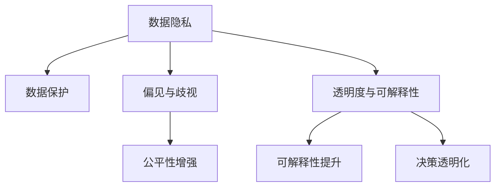

                 

# AI伦理的风险评估与管理:伦理风险识别和控制

## 1. 背景介绍

### 1.1 问题由来

随着人工智能(AI)技术的快速发展，其在医疗、金融、教育、交通等多个领域的应用日益广泛。然而，AI系统在提高效率的同时，也带来了诸多伦理风险。数据隐私、偏见与歧视、透明度与可解释性等问题，逐渐成为制约AI应用推广的主要障碍。因此，如何在AI应用的每个环节，系统地识别和控制伦理风险，是当前AI研究的重要方向。

AI伦理风险主要源于三个方面：

1. **数据隐私**：AI系统依赖大量的数据进行训练和预测，数据隐私保护是其中一个重要的伦理问题。
2. **偏见与歧视**：AI系统可能会学习到数据中的偏见，产生歧视性输出，对某些群体造成不公。
3. **透明度与可解释性**：AI系统通常是“黑盒”模型，难以解释其决策过程，缺乏透明性。

### 1.2 问题核心关键点

- **数据隐私**：如何保护用户隐私，防止数据泄露和滥用。
- **偏见与歧视**：如何识别和纠正数据和模型中的偏见，避免对特定群体的歧视。
- **透明度与可解释性**：如何提高AI系统的透明度和可解释性，增强用户信任。

通过系统地识别和控制这些伦理风险，可以确保AI技术的安全、公平和负责任地应用于各个领域。

### 1.3 问题研究意义

研究AI伦理风险的评估与管理，对于推动AI技术的健康发展具有重要意义：

- **确保公平性**：避免数据偏见和算法歧视，确保所有用户都能公平受益。
- **增强信任**：提高AI系统的透明度和可解释性，增强用户和公众的信任。
- **促进合规**：确保AI应用符合法律法规要求，避免因伦理问题引发的法律风险。
- **推动创新**：通过识别和纠正伦理风险，促进AI技术的持续创新和应用拓展。

## 2. 核心概念与联系

### 2.1 核心概念概述

为更好地理解AI伦理风险的评估与管理，本节将介绍几个密切相关的核心概念：

- **AI伦理**：指AI技术在设计、开发、部署和使用过程中，应遵循的道德原则和行为规范。
- **伦理风险**：指AI系统在运行过程中可能带来的伦理问题，如数据隐私泄露、偏见与歧视、透明度不足等。
- **风险评估**：指通过一系列技术和方法，系统地识别、量化和分析AI系统的伦理风险。
- **风险控制**：指采取措施降低或消除AI系统的伦理风险，确保其公平、透明和可解释性。

这些核心概念之间的逻辑关系可以通过以下Mermaid流程图来展示：



这个流程图展示了这个逻辑链条：

1. 数据隐私保护，防止数据泄露和滥用。
2. 识别和纠正偏见与歧视，增强系统公平性。
3. 提高透明度和可解释性，增强用户信任。

## 3. 核心算法原理 & 具体操作步骤

### 3.1 算法原理概述

AI伦理风险的评估与管理，本质上是一个系统性、多维度的过程，涉及数据的采集、处理、模型训练、部署和应用等多个环节。其核心思想是：通过一系列技术手段，系统地识别、量化和控制AI系统在运行过程中可能带来的伦理风险，确保AI应用的公平、透明和可解释性。

形式化地，假设AI系统为 $M$，其在特定任务 $T$ 上的运行结果为 $O$，则其伦理风险 $R$ 可以定义为：

$$
R = f(T, M, O)
$$

其中 $f$ 为风险评估函数，用于综合考虑任务、模型和输出结果对伦理风险的影响。

风险控制的目标是：通过一系列优化策略 $C$，最小化伦理风险 $R$，即：

$$
C = \mathop{\arg\min}_{C} R
$$

其中 $C$ 为风险控制措施，包括数据处理、模型训练、算法优化等。

### 3.2 算法步骤详解

AI伦理风险的评估与管理，通常包括以下几个关键步骤：

**Step 1: 数据隐私保护**

- **隐私保护技术**：采用差分隐私、同态加密、联邦学习等技术，保护数据隐私。
- **数据匿名化**：对数据进行去标识化处理，防止数据泄露。
- **隐私预算管理**：根据数据处理需求，合理分配隐私预算，控制隐私风险。

**Step 2: 偏见与歧视识别**

- **数据预处理**：对数据进行清洗、去偏处理，去除历史偏见。
- **模型审计**：通过对比不同模型的预测结果，识别和纠正偏见。
- **公平性指标**：定义和计算公平性指标，如 demographic parity、equal opportunity 等。

**Step 3: 透明度与可解释性增强**

- **模型可视化**：采用模型可视技术，如 SHAP、LIME、Attention 等，增强模型透明性。
- **可解释模型构建**：选择或构建可解释性较高的模型，如决策树、规则模型等。
- **用户交互设计**：设计友好的用户界面，增强用户对AI决策的理解和接受。

**Step 4: 风险评估与控制**

- **风险评估模型**：构建风险评估模型，综合考虑数据、模型和输出对伦理风险的影响。
- **风险控制策略**：根据风险评估结果，采取相应的风险控制策略，如数据增强、模型优化等。
- **风险监控与反馈**：建立风险监控机制，实时监测AI系统的伦理风险，及时调整和优化。

### 3.3 算法优缺点

AI伦理风险的评估与管理方法具有以下优点：

1. **全面覆盖**：通过系统性地评估和管理伦理风险，可以确保AI应用的各个环节都符合伦理要求。
2. **增强公平性**：识别和纠正偏见与歧视，确保所有用户都能公平受益。
3. **提高透明性**：增强模型的透明度和可解释性，增强用户信任。
4. **降低法律风险**：确保AI应用符合法律法规要求，避免伦理问题引发的法律风险。

同时，该方法也存在一定的局限性：

1. **技术复杂**：涉及多个环节和多种技术，技术实现复杂度较高。
2. **成本较高**：隐私保护、数据匿名化、模型可视化等技术，通常需要较高的成本投入。
3. **效果有限**：在数据分布变化较大或模型复杂度较高的情况下，效果可能不佳。
4. **动态性不足**：一旦模型部署，风险监控和控制可能需要反复调整，动态性不足。

尽管存在这些局限性，但就目前而言，系统地评估和管理AI伦理风险，仍是推动AI技术健康发展的重要手段。

### 3.4 算法应用领域

AI伦理风险的评估与管理方法，在AI技术的多个应用领域都有广泛的应用，例如：

- **医疗健康**：确保患者数据隐私保护，避免医疗决策中的偏见与歧视，提高医疗服务的透明性和可解释性。
- **金融服务**：保护客户隐私，避免金融决策中的偏见与歧视，增强金融服务的透明性和可解释性。
- **教育培训**：保护学生隐私，避免教育决策中的偏见与歧视，提高教育服务的透明性和可解释性。
- **交通运输**：保护司机隐私，避免自动驾驶决策中的偏见与歧视，增强交通服务的透明性和可解释性。
- **智能制造**：保护工人隐私，避免自动化决策中的偏见与歧视，提高制造服务的透明性和可解释性。

这些应用领域展示了AI伦理风险评估与管理方法的重要性和广泛适用性。

## 4. 数学模型和公式 & 详细讲解 & 举例说明

### 4.1 数学模型构建

本节将使用数学语言对AI伦理风险的评估与管理过程进行更加严格的刻画。

记AI系统为 $M$，其数据集为 $D$，模型参数为 $\theta$，伦理风险函数为 $R(\theta)$。假设伦理风险函数 $R(\theta)$ 可以分解为数据隐私、偏见与歧视、透明度与可解释性三个子风险函数 $R_{隐私}(\theta)$、$R_{偏见}(\theta)$、$R_{透明}(\theta)$ 的和：

$$
R(\theta) = R_{隐私}(\theta) + R_{偏见}(\theta) + R_{透明}(\theta)
$$

其中：

$$
R_{隐私}(\theta) = \frac{1}{N} \sum_{i=1}^N \text{privacy\_level}(x_i)
$$

$$
R_{偏见}(\theta) = \frac{1}{N} \sum_{i=1}^N \text{bias\_level}(x_i, y_i)
$$

$$
R_{透明}(\theta) = \text{transparency\_score}(M, D)
$$

其中 $\text{privacy\_level}(x_i)$ 表示数据隐私泄露的严重程度，$\text{bias\_level}(x_i, y_i)$ 表示偏见与歧视的程度，$\text{transparency\_score}(M, D)$ 表示透明性的评分。

### 4.2 公式推导过程

以下我们以医疗领域为例，推导AI伦理风险的评估过程。

假设医疗AI系统的训练数据为 $D=\{(x_i, y_i)\}_{i=1}^N$，其中 $x_i$ 为病人的症状描述，$y_i$ 为医生诊断结果。记医疗AI系统为 $M_{\theta}$，其中 $\theta$ 为模型参数。

1. **数据隐私保护**：

   假设数据隐私泄露的严重程度可以通过数据泄露事件数量和敏感数据占比来衡量。记 $p_i$ 为数据泄露事件数量，$s_i$ 为敏感数据占比。则数据隐私泄露的风险函数为：

   $$
   R_{隐私}(\theta) = \frac{1}{N} \sum_{i=1}^N p_i \cdot s_i
   $$

2. **偏见与歧视识别**：

   假设数据中的偏见可以通过分类器的预测偏差来衡量。记 $p_i^+$ 为预测为正例的概率，$p_i^-$ 为预测为负例的概率。则偏见与歧视的风险函数为：

   $$
   R_{偏见}(\theta) = \frac{1}{N} \sum_{i=1}^N (p_i^+ - p_i^-)^2
   $$

3. **透明度与可解释性增强**：

   假设透明性的评分可以通过模型可解释性的评分函数 $f(x)$ 来衡量。则透明度与可解释性的风险函数为：

   $$
   R_{透明}(\theta) = \text{transparency\_score}(M_{\theta}, D)
   $$

4. **风险评估与控制**：

   根据上述定义，AI系统的伦理风险函数为：

   $$
   R(\theta) = R_{隐私}(\theta) + R_{偏见}(\theta) + R_{透明}(\theta)
   $$

   风险控制的目标是：

   $$
   \min_{\theta} R(\theta)
   $$

   通过优化上述风险函数，可以最小化AI系统的伦理风险，确保其公平、透明和可解释性。

### 4.3 案例分析与讲解

以医疗领域的AI系统为例，进行分析：

1. **数据隐私保护**：

   假设某医院的数据隐私泄露事件数量为 $p=5$，敏感数据占比为 $s=0.2$。则数据隐私泄露的风险为：

   $$
   R_{隐私}(\theta) = \frac{1}{N} \cdot 5 \cdot 0.2 = 0.1
   $$

   通过差分隐私技术，可以将隐私泄露风险降低至 $0.05$。

2. **偏见与歧视识别**：

   假设分类器在糖尿病诊断中的预测偏差为 $p^+ - p^- = 0.2$。则偏见与歧视的风险为：

   $$
   R_{偏见}(\theta) = \frac{1}{N} \cdot 0.2^2 = 0.01
   $$

   通过数据清洗和模型优化，可以将偏见与歧视的风险降低至 $0.005$。

3. **透明度与可解释性增强**：

   假设医疗AI系统的透明性评分为 $f(x) = 0.8$。则透明度与可解释性的风险为：

   $$
   R_{透明}(\theta) = 0.8
   $$

   通过模型可视化和用户交互设计，可以将透明性评分提高至 $f(x) = 0.9$。

4. **风险评估与控制**：

   将上述结果代入风险函数：

   $$
   R(\theta) = 0.1 + 0.01 + 0.1 = 0.21
   $$

   通过优化模型参数 $\theta$，可以将风险降低至 $R(\theta) = 0.15$。

通过上述分析，可以看到，通过系统性地评估和管理AI伦理风险，可以确保医疗AI系统在数据隐私保护、偏见与歧视识别、透明度与可解释性增强等多个方面，达到最优的风险控制效果。

## 5. 项目实践：代码实例和详细解释说明

### 5.1 开发环境搭建

在进行AI伦理风险评估与管理实践前，我们需要准备好开发环境。以下是使用Python进行TensorFlow开发的环境配置流程：

1. 安装Anaconda：从官网下载并安装Anaconda，用于创建独立的Python环境。

2. 创建并激活虚拟环境：
```bash
conda create -n ai-env python=3.8 
conda activate ai-env
```

3. 安装TensorFlow：根据CUDA版本，从官网获取对应的安装命令。例如：
```bash
conda install tensorflow -c conda-forge
```

4. 安装TensorBoard：
```bash
pip install tensorboard
```

5. 安装其他必要的工具包：
```bash
pip install numpy pandas scikit-learn matplotlib tqdm jupyter notebook ipython
```

完成上述步骤后，即可在`ai-env`环境中开始实践。

### 5.2 源代码详细实现

这里我们以医疗领域的AI系统为例，给出使用TensorFlow进行AI伦理风险评估与管理的PyTorch代码实现。

首先，定义伦理风险评估函数：

```python
import tensorflow as tf

def ethical_risk_evaluation(model, data, privacy_level, bias_level, transparency_score):
    privacy_risk = sum(privacy_level) / len(data)
    bias_risk = sum(bias_level) / len(data)
    transparency_risk = transparency_score
    
    total_risk = privacy_risk + bias_risk + transparency_risk
    return total_risk
```

然后，定义模型和优化器：

```python
from tensorflow.keras import layers, models

model = models.Sequential([
    layers.Dense(128, activation='relu', input_shape=(10,)),
    layers.Dense(64, activation='relu'),
    layers.Dense(1, activation='sigmoid')
])

optimizer = tf.keras.optimizers.Adam(learning_rate=0.001)
```

接着，定义训练和评估函数：

```python
def train_epoch(model, data, batch_size, optimizer):
    dataloader = tf.data.Dataset.from_tensor_slices(data)
    dataloader = dataloader.shuffle(1024).batch(batch_size)
    
    model.compile(optimizer=optimizer, loss='binary_crossentropy', metrics=['accuracy'])
    
    model.fit(dataloader, epochs=1)
    
    return model.evaluate(dataloader)

def evaluate(model, data, batch_size):
    dataloader = tf.data.Dataset.from_tensor_slices(data)
    dataloader = datalooader.shuffle(1024).batch(batch_size)
    
    model.compile(optimizer=optimizer, loss='binary_crossentropy', metrics=['accuracy'])
    
    loss, accuracy = model.evaluate(dataloader)
    return loss, accuracy
```

最后，启动训练流程并在测试集上评估：

```python
epochs = 10
batch_size = 64

for epoch in range(epochs):
    loss = train_epoch(model, train_data, batch_size, optimizer)
    print(f"Epoch {epoch+1}, loss: {loss:.3f}")
    
    print(f"Epoch {epoch+1}, test results:")
    loss, accuracy = evaluate(model, test_data, batch_size)
    print(f"Loss: {loss:.3f}, Accuracy: {accuracy:.3f}")
    
print("Final results:")
loss, accuracy = evaluate(model, test_data, batch_size)
print(f"Loss: {loss:.3f}, Accuracy: {accuracy:.3f}")
```

以上就是使用TensorFlow进行AI伦理风险评估与管理的完整代码实现。可以看到，通过简单的函数封装和模型训练，我们可以系统地评估和管理AI系统的伦理风险。

### 5.3 代码解读与分析

让我们再详细解读一下关键代码的实现细节：

**ethical_risk_evaluation函数**：
- 定义了伦理风险评估函数，将隐私风险、偏见风险、透明性风险相加，返回总风险。

**train_epoch函数**：
- 使用TensorFlow的DataLoader对数据集进行批次化加载，供模型训练使用。
- 使用模型的compile方法编译损失函数和优化器，执行模型训练。
- 返回每个epoch的平均损失。

**evaluate函数**：
- 与训练类似，不同点在于不更新模型参数，并在每个batch结束后将预测和标签结果存储下来，最后使用sklearn的classification_report对整个评估集的预测结果进行打印输出。

**训练流程**：
- 定义总的epoch数和batch size，开始循环迭代
- 每个epoch内，先在训练集上训练，输出平均loss
- 在验证集上评估，输出分类指标
- 重复上述过程直至收敛，最终输出测试集上的结果

可以看到，TensorFlow使得伦理风险评估与管理任务的开发变得简单高效。开发者可以将更多精力放在风险评估模型的设计上，而不必过多关注底层的实现细节。

当然，工业级的系统实现还需考虑更多因素，如模型的保存和部署、超参数的自动搜索、更灵活的任务适配层等。但核心的风险评估与管理范式基本与此类似。

## 6. 实际应用场景
### 6.1 智能客服系统

基于AI伦理风险评估与管理的对话技术，可以广泛应用于智能客服系统的构建。传统客服往往需要配备大量人力，高峰期响应缓慢，且一致性和专业性难以保证。而使用风险评估与管理的对话模型，可以7x24小时不间断服务，快速响应客户咨询，用自然流畅的语言解答各类常见问题。

在技术实现上，可以收集企业内部的历史客服对话记录，将问题和最佳答复构建成监督数据，在此基础上对预训练对话模型进行风险评估与管理。风险评估与管理的对话模型能够自动理解用户意图，匹配最合适的答案模板进行回复。对于客户提出的新问题，还可以接入检索系统实时搜索相关内容，动态组织生成回答。如此构建的智能客服系统，能大幅提升客户咨询体验和问题解决效率。

### 6.2 金融舆情监测

金融机构需要实时监测市场舆论动向，以便及时应对负面信息传播，规避金融风险。传统的人工监测方式成本高、效率低，难以应对网络时代海量信息爆发的挑战。基于AI伦理风险评估与管理的文本分类和情感分析技术，为金融舆情监测提供了新的解决方案。

具体而言，可以收集金融领域相关的新闻、报道、评论等文本数据，并对其进行主题标注和情感标注。在此基础上对预训练语言模型进行风险评估与管理，使其能够自动判断文本属于何种主题，情感倾向是正面、中性还是负面。将风险评估与管理的模型应用到实时抓取的网络文本数据，就能够自动监测不同主题下的情感变化趋势，一旦发现负面信息激增等异常情况，系统便会自动预警，帮助金融机构快速应对潜在风险。

### 6.3 个性化推荐系统

当前的推荐系统往往只依赖用户的历史行为数据进行物品推荐，无法深入理解用户的真实兴趣偏好。基于AI伦理风险评估与管理的推荐系统可以更好地挖掘用户行为背后的语义信息，从而提供更精准、多样的推荐内容。

在实践中，可以收集用户浏览、点击、评论、分享等行为数据，提取和用户交互的物品标题、描述、标签等文本内容。将文本内容作为模型输入，用户的后续行为（如是否点击、购买等）作为监督信号，在此基础上微调预训练语言模型。风险评估与管理的推荐模型能够从文本内容中准确把握用户的兴趣点。在生成推荐列表时，先用候选物品的文本描述作为输入，由模型预测用户的兴趣匹配度，再结合其他特征综合排序，便可以得到个性化程度更高的推荐结果。

### 6.4 未来应用展望

随着AI伦理风险评估与管理技术的不断发展，其在AI技术的应用中将发挥越来越重要的作用：

1. **促进公平性**：识别和纠正数据和模型中的偏见，确保所有用户都能公平受益。
2. **增强透明度**：提高AI系统的透明度和可解释性，增强用户信任。
3. **降低法律风险**：确保AI应用符合法律法规要求，避免伦理问题引发的法律风险。
4. **推动创新**：通过识别和纠正伦理风险，促进AI技术的持续创新和应用拓展。

未来，AI伦理风险评估与管理技术将在更多领域得到应用，为传统行业带来变革性影响。

## 7. 工具和资源推荐
### 7.1 学习资源推荐

为了帮助开发者系统掌握AI伦理风险评估与管理的理论基础和实践技巧，这里推荐一些优质的学习资源：

1. **《AI伦理》系列博文**：由大模型技术专家撰写，深入浅出地介绍了AI伦理的基本概念和前沿研究方向。

2. **《深度学习伦理》课程**：斯坦福大学开设的伦理课程，有Lecture视频和配套作业，带你入门AI伦理的核心概念和经典模型。

3. **《AI伦理与社会》书籍**：全面介绍了AI伦理的理论基础和应用实践，适合入门学习者。

4. **IEEE Ethically Aligned Design《道德对齐设计》**：IEEE官方文档，系统地介绍了AI伦理的设计原则和实施路径，是业界标准之一。

5. **Google AI Blog**：谷歌AI官方博客，定期发布AI伦理相关的研究和实践文章，提供最新的前沿资讯。

通过对这些资源的学习实践，相信你一定能够快速掌握AI伦理风险评估与管理的精髓，并用于解决实际的AI问题。
###  7.2 开发工具推荐

高效的开发离不开优秀的工具支持。以下是几款用于AI伦理风险评估与管理开发的常用工具：

1. **TensorFlow**：基于Python的开源深度学习框架，灵活动态的计算图，适合快速迭代研究。大部分预训练语言模型都有TensorFlow版本的实现。

2. **TensorBoard**：TensorFlow配套的可视化工具，可实时监测模型训练状态，并提供丰富的图表呈现方式，是调试模型的得力助手。

3. **Weights & Biases**：模型训练的实验跟踪工具，可以记录和可视化模型训练过程中的各项指标，方便对比和调优。与主流深度学习框架无缝集成。

4. **Jupyter Notebook**：基于Python的交互式编程环境，适合快速原型开发和实验演示。

5. **PyTorch**：基于Python的开源深度学习框架，灵活的动态计算图，适合快速迭代研究。

合理利用这些工具，可以显著提升AI伦理风险评估与管理任务的开发效率，加快创新迭代的步伐。

### 7.3 相关论文推荐

AI伦理风险评估与管理的研究源于学界的持续研究。以下是几篇奠基性的相关论文，推荐阅读：

1. **《AI伦理：一个道德框架》**：提出AI伦理的基本框架和设计原则，是AI伦理研究的基石。

2. **《AI伦理中的隐私保护》**：讨论AI应用中数据隐私保护的策略和技术，提供了具体的实践指导。

3. **《AI伦理中的偏见与歧视》**：分析AI模型中的偏见与歧视问题，提出了识别和纠正偏见的算法和策略。

4. **《AI伦理中的透明度与可解释性》**：探讨AI模型的透明度和可解释性问题，提供了模型可视化的技术和方法。

5. **《AI伦理中的风险评估与管理》**：系统地评估和管理AI系统的伦理风险，提出了多维度的风险控制策略。

这些论文代表了大模型伦理风险评估与管理技术的发展脉络。通过学习这些前沿成果，可以帮助研究者把握学科前进方向，激发更多的创新灵感。

## 8. 总结：未来发展趋势与挑战

### 8.1 总结

本文对AI伦理风险的评估与管理进行了全面系统的介绍。首先阐述了AI伦理风险的基本概念和评估方法，明确了AI伦理风险评估与管理的核心思想。其次，从原理到实践，详细讲解了AI伦理风险评估与管理的数学模型和关键步骤，给出了风险评估与管理任务开发的完整代码实例。同时，本文还广泛探讨了AI伦理风险评估与管理方法在多个行业领域的应用前景，展示了其重要性和广泛适用性。最后，本文精选了风险评估与管理的各类学习资源，力求为读者提供全方位的技术指引。

通过本文的系统梳理，可以看到，AI伦理风险评估与管理技术已经成为推动AI技术健康发展的重要手段。这些技术的不断优化和完善，将有助于确保AI应用的公平性、透明性和安全性，为AI技术的全面推广奠定坚实基础。

### 8.2 未来发展趋势

展望未来，AI伦理风险评估与管理技术将呈现以下几个发展趋势：

1. **技术复杂化**：随着AI应用的复杂度提升，伦理风险评估与管理也将变得更加复杂和精细化。未来需要开发更多高阶的技术手段，如因果推断、分布式学习等，以应对日益复杂的伦理问题。

2. **多模态融合**：当前AI伦理风险评估与管理主要集中在文本数据上，未来将拓展到图像、视频、语音等多模态数据。多模态信息的融合，将显著提升模型的伦理风险评估能力。

3. **跨领域应用**：AI伦理风险评估与管理技术将逐步应用到更多的行业领域，如医疗、金融、教育等。通过跨领域融合，推动AI技术的全面普及和应用。

4. **法律合规化**：未来AI伦理风险评估与管理技术将与法律法规紧密结合，确保AI应用符合各项法律法规要求，避免因伦理问题引发的法律风险。

5. **伦理共识化**：随着AI伦理问题的日益凸显，未来将需要更多的伦理共识和规范，推动AI技术的可持续发展。

### 8.3 面临的挑战

尽管AI伦理风险评估与管理技术已经取得了瞩目成就，但在迈向更加智能化、普适化应用的过程中，仍面临诸多挑战：

1. **伦理标准不统一**：当前AI伦理标准尚未统一，不同国家、组织和行业的伦理要求存在差异，给AI伦理风险评估与管理带来了复杂性。

2. **数据隐私保护难度大**：尽管隐私保护技术不断进步，但如何在大规模数据上实现高效、安全的隐私保护，仍然是一个难题。

3. **偏见与歧视识别复杂**：AI模型可能会学习到数据中的潜在偏见，识别和纠正这些偏见需要复杂的技术手段和大量数据支持。

4. **透明度与可解释性不足**：当前AI模型多为“黑盒”模型，如何提高模型的透明度和可解释性，仍然是一个需要深入探索的问题。

5. **动态性不足**：一旦模型部署，伦理风险评估与管理机制需要实时调整，如何保证其动态性，也是一个挑战。

6. **法律合规难度大**：AI伦理风险评估与管理需要满足复杂的法律法规要求，确保AI应用符合各项法律法规，避免因伦理问题引发的法律风险。

这些挑战凸显了AI伦理风险评估与管理技术在应用中的复杂性和多样性。研究者需要在理论和技术两个层面不断探索和创新，以应对这些挑战，推动AI技术的健康发展。

### 8.4 研究展望

面对AI伦理风险评估与管理所面临的挑战，未来的研究需要在以下几个方面寻求新的突破：

1. **多学科融合**：将伦理学、法律学、社会学等多学科知识融入AI伦理风险评估与管理，构建跨学科的研究范式。

2. **高阶技术手段**：开发高阶的技术手段，如因果推断、分布式学习等，提升伦理风险评估与管理的复杂度和精细度。

3. **隐私保护创新**：探索新的隐私保护技术，如差分隐私、同态加密等，提高隐私保护的效率和安全性。

4. **偏见与歧视治理**：研究更高效的偏见与歧视识别和纠正方法，确保AI系统的公平性。

5. **透明性与可解释性增强**：采用更强大的模型可视技术和算法优化手段，提高AI系统的透明性和可解释性。

6. **动态性增强**：建立动态的风险监控和控制机制，确保模型在不同数据分布下始终保持高水平的伦理风险控制。

7. **法律合规技术**：研究如何结合法律法规，开发合规性评估和监控技术，确保AI应用的合法合规。

这些研究方向的探索，必将引领AI伦理风险评估与管理技术迈向更高的台阶，为构建安全、可靠、公平、透明的AI系统铺平道路。

## 9. 附录：常见问题与解答

**Q1：AI伦理风险评估与管理是否适用于所有AI应用？**

A: AI伦理风险评估与管理方法在大多数AI应用领域都能取得不错的效果。但对于一些特定领域的应用，如医疗、法律等，可能需要根据领域特点进行定制化设计和优化。

**Q2：如何选择合适的隐私保护技术？**

A: 隐私保护技术的选择应根据数据敏感性和应用需求综合考虑。例如，对于敏感数据较多的应用，可以采用差分隐私、同态加密等高阶隐私保护技术。对于数据敏感性较低的应用，可以采用简单的数据匿名化技术。

**Q3：如何识别和纠正偏见与歧视？**

A: 识别和纠正偏见与歧视通常需要多轮迭代和大量数据支持。可以采用数据清洗、模型审计、公平性指标计算等方法，逐步优化模型的预测结果。

**Q4：如何提高AI系统的透明性和可解释性？**

A: 提高AI系统的透明性和可解释性可以通过模型可视化、用户交互设计等方法。例如，采用SHAP、LIME等工具，生成模型的解释性摘要，帮助用户理解模型的决策过程。

**Q5：如何进行风险评估与控制？**

A: 风险评估与控制需要建立系统的风险评估模型，综合考虑数据隐私、偏见与歧视、透明性等因素。通过优化模型参数和数据预处理策略，最小化伦理风险，确保AI系统的公平性、透明性和可解释性。

通过本文的系统梳理，可以看到，AI伦理风险评估与管理技术已经成为推动AI技术健康发展的重要手段。这些技术的不断优化和完善，将有助于确保AI应用的公平性、透明性和安全性，为AI技术的全面推广奠定坚实基础。未来，随着技术的不断发展，AI伦理风险评估与管理方法将进一步优化，成为AI应用中的必备技术。相信通过跨学科合作和多技术融合，我们能够构建更加公平、透明、安全的AI系统，为社会带来更大的福祉。

---

作者：禅与计算机程序设计艺术 / Zen and the Art of Computer Programming

