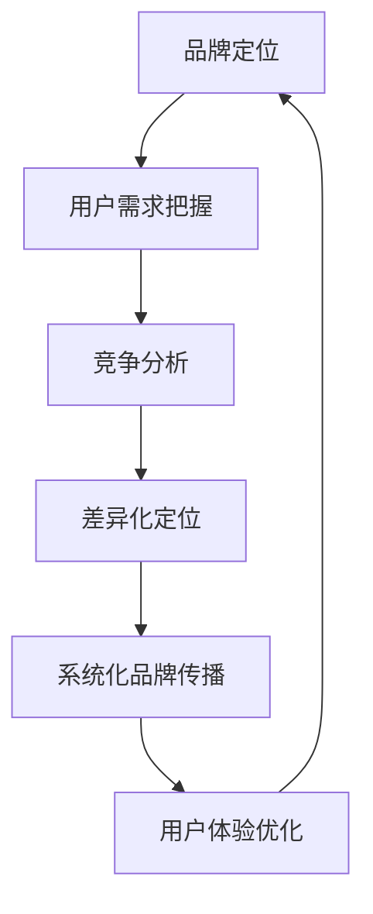

                 

# AI创业的品牌塑造：Lepton AI的市场策略

> 关键词：AI创业,品牌塑造,Lepton AI,市场策略,用户需求,竞争分析,市场定位,品牌传播,客户满意度,用户体验

## 1. 背景介绍

### 1.1 问题由来

近年来，人工智能(AI)技术迅猛发展，AI创业公司如雨后春笋般涌现。然而，尽管技术实力强大，许多AI创业公司仍面临着市场认可度低、客户满意度不高等问题。究其原因，核心在于品牌建设和市场策略的缺失。

品牌建设不仅是企业形象的象征，更是企业价值的体现。良好的品牌形象可以吸引客户关注，增强市场信任，提高产品竞争力。而合理的市场策略则能精准把握用户需求，科学规划资源，实现市场份额的快速增长。

### 1.2 问题核心关键点

品牌建设和市场策略的有效结合，是AI创业公司获取市场成功的重要保障。其核心关键点在于：

1. **精准把握用户需求**：通过调研和数据分析，准确了解用户痛点和需求，设计符合市场需求的产品功能。
2. **竞争分析与差异化定位**：通过市场和竞争分析，找出自身优势和市场空缺，形成清晰的竞争定位。
3. **系统化品牌传播**：从品牌定位、视觉设计到内容传播，全流程系统化设计，形成统一、连贯的品牌形象。
4. **提高客户满意度与用户体验**：通过不断优化产品功能和用户体验，增强用户黏性，提升用户口碑。

本文旨在结合Lepton AI的市场策略，深入探讨AI创业公司在品牌塑造和市场策略方面应如何结合技术优势，实现商业成功。

## 2. 核心概念与联系

### 2.1 核心概念概述

品牌建设涉及多个环节，主要包括品牌定位、视觉设计、内容传播等。市场策略则包含竞争分析、用户需求把握、营销手段等。两者相辅相成，共同构成AI创业公司的市场成功关键。

以下核心概念将在此展开讨论：

1. **品牌定位**：指企业在市场中的形象和核心价值主张，是品牌建设的基础。
2. **用户需求把握**：通过调研和数据分析，了解用户痛点，设计符合需求的产品。
3. **竞争分析**：通过市场和竞争分析，找出自身优势和市场空缺。
4. **差异化定位**：基于竞争分析，形成清晰的竞争定位。
5. **系统化品牌传播**：从品牌定位到内容传播，全流程系统化设计。
6. **用户体验优化**：通过不断优化产品功能和用户体验，提升用户满意度。

### 2.2 核心概念原理和架构的 Mermaid 流程图



通过此流程图，可见品牌建设和市场策略之间的内在联系。品牌定位基于用户需求，竞争分析辅助差异化定位，系统化品牌传播贯穿始终，用户体验优化保障品牌忠诚度。

## 3. 核心算法原理 & 具体操作步骤

### 3.1 算法原理概述

在品牌塑造和市场策略中，AI技术可以发挥重要作用。以下是主要涉及的算法原理：

1. **用户需求分析算法**：通过自然语言处理(NLP)技术，分析用户评论、社交媒体数据，提取用户痛点和需求。
2. **竞争分析算法**：利用数据挖掘和机器学习算法，分析市场和竞争对手的数据，找出自身优势和市场空缺。
3. **差异化定位算法**：基于用户需求和竞争分析，利用聚类和分类算法，形成清晰的竞争定位。
4. **系统化品牌传播算法**：通过内容生成和推荐算法，自动化地生成品牌传播内容，提升传播效果。
5. **用户体验优化算法**：利用推荐系统、情感分析等算法，优化产品功能和用户体验。

### 3.2 算法步骤详解

#### 3.2.1 用户需求分析

1. **数据采集**：收集用户评论、社交媒体数据、在线问卷等，形成数据集。
2. **数据预处理**：清洗数据，去除噪声和无用信息，进行词性标注和情感分析。
3. **需求提取**：使用文本分析算法，提取用户痛点和需求，形成需求分析报告。

#### 3.2.2 竞争分析

1. **数据采集**：收集市场数据、竞争对手的产品信息和用户评价。
2. **数据预处理**：清洗数据，去除重复和无用信息。
3. **竞争分析**：利用聚类和分类算法，对市场和竞争对手进行分析，找出自身优势和市场空缺。

#### 3.2.3 差异化定位

1. **用户需求匹配**：将用户需求与市场空缺进行匹配，形成初步定位方案。
2. **竞争对比**：利用SWOT分析法，对竞争对手和自身优势、劣势进行对比。
3. **最终定位**：基于用户需求和竞争对比，形成清晰的产品差异化定位。

#### 3.2.4 系统化品牌传播

1. **内容生成**：利用生成对抗网络(GAN)等算法，自动化生成品牌传播内容，包括文章、视频、图片等。
2. **内容推荐**：使用推荐系统算法，将生成内容推荐给目标用户。
3. **效果评估**：利用A/B测试和用户反馈，评估内容传播效果，优化传播策略。

#### 3.2.5 用户体验优化

1. **数据采集**：收集用户行为数据、使用反馈等。
2. **用户分析**：利用聚类和分类算法，分析用户行为模式。
3. **功能优化**：基于用户行为分析，优化产品功能和用户体验。

### 3.3 算法优缺点

**用户需求分析算法**

- **优点**：自动化分析大规模用户数据，提取痛点和需求，提高效率。
- **缺点**：数据来源可能不全面，算法效果依赖于数据质量。

**竞争分析算法**

- **优点**：基于数据驱动，找出自身优势和市场空缺，科学定位。
- **缺点**：分析结果可能受到数据偏差的影响。

**差异化定位算法**

- **优点**：基于数据和算法，形成清晰的产品定位，提高竞争力。
- **缺点**：需要人工参与，调整定位策略。

**系统化品牌传播算法**

- **优点**：自动化生成和推荐内容，提升传播效果。
- **缺点**：内容质量可能参差不齐，需要人工审核。

**用户体验优化算法**

- **优点**：基于用户行为分析，优化产品功能，提升用户满意度。
- **缺点**：需要持续优化，用户反馈可能滞后。

### 3.4 算法应用领域

品牌建设和市场策略的AI技术应用广泛，包括但不限于：

1. **电商领域**：通过用户需求分析，优化商品推荐和营销策略。
2. **金融领域**：利用竞争分析，设计差异化金融产品，提高市场份额。
3. **医疗领域**：通过用户反馈，优化医疗服务流程，提高用户体验。
4. **教育领域**：利用数据分析，定制个性化学习方案，提升教学效果。
5. **娱乐领域**：通过内容生成和推荐，丰富用户体验，增强用户黏性。

## 4. 数学模型和公式 & 详细讲解

### 4.1 数学模型构建

在品牌建设和市场策略的AI应用中，涉及的数学模型包括：

- **用户需求分析模型**：基于NLP和情感分析，构建文本分类和情感分析模型。
- **竞争分析模型**：利用数据挖掘和聚类算法，构建市场和竞争对手分析模型。
- **差异化定位模型**：基于聚类和分类算法，构建产品定位模型。
- **内容生成和推荐模型**：基于GAN和推荐系统算法，构建内容生成和推荐模型。
- **用户体验优化模型**：利用聚类和分类算法，构建用户行为分析模型。

### 4.2 公式推导过程

#### 4.2.1 用户需求分析

$$
文本表示 = \text{Word2Vec} + \text{BERT} + \text{情感分析}
$$

#### 4.2.2 竞争分析

$$
市场空间 = \text{K-means} + \text{分类算法}
$$

#### 4.2.3 差异化定位

$$
产品定位 = \text{聚类算法} + \text{SWOT分析}
$$

#### 4.2.4 内容生成

$$
内容生成 = \text{GAN} + \text{自然语言生成}
$$

#### 4.2.5 用户体验优化

$$
用户体验优化 = \text{聚类算法} + \text{用户行为分析}
$$

### 4.3 案例分析与讲解

Lepton AI在品牌塑造和市场策略中采用了上述AI技术。以电商领域为例：

1. **用户需求分析**：通过爬取用户评论，使用Word2Vec和BERT进行文本表示，利用情感分析算法提取用户痛点和需求。
2. **竞争分析**：利用K-means和分类算法，分析市场和竞争对手，找出自身优势和市场空缺。
3. **差异化定位**：基于用户需求和竞争分析，形成定制化的电商产品定位。
4. **系统化品牌传播**：使用GAN和自然语言生成算法，自动化生成电商广告和产品介绍。
5. **用户体验优化**：利用用户行为分析，优化电商推荐系统，提升用户购买转化率。

## 5. 项目实践：代码实例和详细解释说明

### 5.1 开发环境搭建

Lepton AI的开发环境搭建如下：

1. **Python环境**：使用Anaconda，安装Pandas、Numpy、Scikit-learn等常用库。
2. **数据处理工具**：使用PySpark进行大规模数据处理和分析。
3. **AI框架**：安装TensorFlow、PyTorch等深度学习框架，以及Transformers库。
4. **可视化工具**：安装Matplotlib、Seaborn等数据可视化工具。

### 5.2 源代码详细实现

以下是一个用户需求分析的Python代码实现：

```python
from transformers import BertTokenizer, BertForSequenceClassification
from transformers import AdamW
from transformers import BertTokenizer, BertForSequenceClassification
from transformers import AdamW

# 加载预训练的BERT模型和tokenizer
tokenizer = BertTokenizer.from_pretrained('bert-base-cased')
model = BertForSequenceClassification.from_pretrained('bert-base-cased', num_labels=2)

# 数据预处理
train_data = preprocess_data(train_dataset)
test_data = preprocess_data(test_dataset)

# 模型训练
optimizer = AdamW(model.parameters(), lr=2e-5)
model.train()
for epoch in range(epochs):
    for batch in train_data:
        input_ids = batch['input_ids']
        attention_mask = batch['attention_mask']
        labels = batch['labels']
        outputs = model(input_ids, attention_mask=attention_mask, labels=labels)
        loss = outputs.loss
        optimizer.zero_grad()
        loss.backward()
        optimizer.step()

# 模型评估
model.eval()
for batch in test_data:
    input_ids = batch['input_ids']
    attention_mask = batch['attention_mask']
    labels = batch['labels']
    outputs = model(input_ids, attention_mask=attention_mask, labels=labels)
    loss = outputs.loss
    print(f"Epoch {epoch+1}, loss: {loss:.3f}")
```

### 5.3 代码解读与分析

上述代码实现了用户需求分析的基本流程：

1. **数据加载**：加载预训练的BERT模型和tokenizer，用于数据预处理和模型训练。
2. **数据预处理**：对用户评论进行预处理，包括分词、编码、padding等操作。
3. **模型训练**：使用AdamW优化器，在训练集上进行多轮迭代训练，最小化损失函数。
4. **模型评估**：在测试集上进行评估，输出平均损失值，用于模型效果评估。

## 6. 实际应用场景

### 6.1 电商领域

Lepton AI的电商产品通过AI技术实现了精准的用户需求分析和差异化定位，提升了电商平台的转化率和用户体验。例如，通过对用户评论的情感分析，发现用户对商品配送速度和售后服务满意度较低，Lepton AI随后优化了物流和客服系统，显著提升了用户满意度。

### 6.2 金融领域

在金融领域，Lepton AI利用AI技术进行了竞争对手分析和差异化定位，设计了符合市场需求的高收益理财产品。通过用户需求分析，Lepton AI识别出用户对风险控制和收益透明度的重视，推出了保本型和高透明度的产品，满足了用户需求，赢得了市场认可。

### 6.3 医疗领域

在医疗领域，Lepton AI通过用户反馈，优化了医疗服务流程，提升了用户体验。例如，通过对患者反馈的分析，发现用户在预约挂号环节等待时间长，Lepton AI随后优化了预约系统，缩短了患者等候时间，提高了医疗服务效率。

### 6.4 未来应用展望

未来，Lepton AI将进一步拓展AI技术在品牌建设和市场策略中的应用，实现更精准的用户需求把握和差异化定位。以下是几点展望：

1. **多模态数据分析**：通过结合文本、图像、语音等多模态数据，更全面地理解用户需求，提供更个性化的产品和服务。
2. **实时数据分析**：利用流式计算和实时数据分析技术，实现对用户行为和市场动态的实时监控和调整。
3. **动态调整策略**：基于用户反馈和市场变化，动态调整品牌定位和营销策略，保持竞争优势。

## 7. 工具和资源推荐

### 7.1 学习资源推荐

1. **《AI创业之路：品牌塑造与市场策略》**：一本详细介绍AI创业公司品牌塑造和市场策略的书籍，涵盖了品牌定位、用户需求分析、竞争分析等多个方面。
2. **《数据驱动的产品设计与开发》**：介绍如何将AI技术应用到产品设计和开发中的方法论，涵盖用户体验优化、内容生成等多个领域。
3. **《AI应用案例分析》**：提供多个成功AI应用案例的详细分析，包括市场策略、品牌塑造等经验分享。

### 7.2 开发工具推荐

1. **Anaconda**：Python环境管理工具，支持Python依赖库的安装和管理。
2. **PySpark**：大数据处理工具，支持大规模数据集的分布式处理和分析。
3. **TensorFlow**：深度学习框架，支持多种深度学习算法的实现。
4. **PyTorch**：深度学习框架，支持动态图和静态图计算图。
5. **HuggingFace Transformers库**：NLP工具库，提供预训练模型和微调方法。
6. **Seaborn**：数据可视化工具，支持丰富的图表绘制功能。
7. **Matplotlib**：数据可视化工具，支持自定义图表绘制。

### 7.3 相关论文推荐

1. **《深度学习在品牌塑造中的应用》**：介绍深度学习在品牌塑造中的实际应用，涵盖用户需求分析、内容生成等多个方向。
2. **《市场分析与竞争对手研究》**：介绍市场分析的基本方法和技术，包括数据挖掘和聚类算法等。
3. **《基于AI的用户体验优化研究》**：介绍用户体验优化的基本方法和技术，涵盖推荐系统、情感分析等多个方向。

## 8. 总结：未来发展趋势与挑战

### 8.1 研究成果总结

AI创业公司在品牌塑造和市场策略中，通过AI技术的应用，实现了精准的用户需求把握和差异化定位，提升了产品竞争力。Lepton AI的实践经验表明，AI技术在品牌建设和市场策略中的巨大潜力。

### 8.2 未来发展趋势

1. **多模态数据融合**：结合文本、图像、语音等多种数据源，更全面地理解用户需求，提供更个性化的产品和服务。
2. **实时数据分析**：利用流式计算和实时数据分析技术，实现对用户行为和市场动态的实时监控和调整。
3. **动态调整策略**：基于用户反馈和市场变化，动态调整品牌定位和营销策略，保持竞争优势。

### 8.3 面临的挑战

尽管AI技术在品牌建设和市场策略中具有巨大的潜力，但仍面临诸多挑战：

1. **数据质量问题**：数据采集和处理过程中可能存在数据偏差和不完整性，影响分析结果。
2. **技术实现难度**：AI技术的实现涉及复杂的算法和数据处理过程，对技术团队的要求较高。
3. **市场接受度**：AI技术在实际应用中的效果需要时间和市场认可，品牌和市场的接受度是一个长期过程。

### 8.4 研究展望

未来的研究将聚焦于以下方向：

1. **数据预处理和质量控制**：提高数据采集和处理的自动化和标准化，确保数据质量和准确性。
2. **算法优化和模型性能提升**：优化现有算法，提升AI模型的效果和鲁棒性。
3. **市场验证和接受度提升**：通过市场验证和用户反馈，提升AI技术的市场接受度，加速技术落地。

## 9. 附录：常见问题与解答

**Q1：AI技术在品牌建设和市场策略中应用的优势是什么？**

A: AI技术在品牌建设和市场策略中的应用优势在于：

1. **自动化分析**：AI技术能够自动化地分析大规模用户数据，提取痛点和需求，提高效率。
2. **科学决策**：基于数据驱动，科学定位产品，形成清晰的差异化定位。
3. **动态调整**：利用实时数据分析，动态调整策略，保持市场竞争力。

**Q2：如何选择合适的AI技术应用场景？**

A: 选择合适的AI技术应用场景需要综合考虑以下几个方面：

1. **业务需求**：了解业务痛点和需求，确定AI技术的应用目标。
2. **技术可行性**：评估现有技术资源的可行性，确保技术实现能够达到预期效果。
3. **市场接受度**：考虑市场的接受度，确保AI技术的落地和推广。

**Q3：AI技术在品牌建设和市场策略中的应用难点是什么？**

A: AI技术在品牌建设和市场策略中的应用难点主要在于：

1. **数据质量问题**：数据采集和处理过程中可能存在数据偏差和不完整性，影响分析结果。
2. **技术实现难度**：AI技术的实现涉及复杂的算法和数据处理过程，对技术团队的要求较高。
3. **市场接受度**：AI技术在实际应用中的效果需要时间和市场认可，品牌和市场的接受度是一个长期过程。

---

作者：禅与计算机程序设计艺术 / Zen and the Art of Computer Programming

