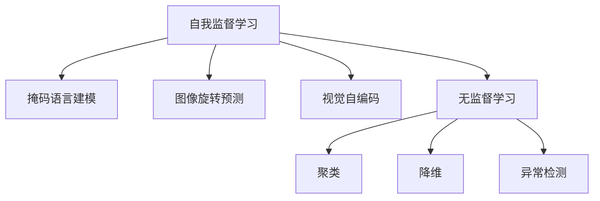

                 

# AI发展新趋势:自我监督学习和无监督学习

## 1. 背景介绍

### 1.1 问题由来

在过去的十年中，人工智能（AI）技术取得了突飞猛进的发展，其中，深度学习模型特别是神经网络的应用几乎遍及了所有的领域，从计算机视觉到自然语言处理，从语音识别到推荐系统，都展现出了强大的性能。然而，这些深度学习模型通常依赖于大量的标注数据进行训练，这不仅增加了获取标注数据的成本，也对标注数据的质量和多样性提出了极高的要求。

在这样的背景下，自我监督学习（Self-Supervised Learning）和无监督学习（Unsupervised Learning）成为了AI领域的研究热点。自我监督学习不需要标注数据，而是通过模型自身的输出进行预测和反馈，从而进行自我修正和优化；而无监督学习则更加注重数据的探索和发现，从数据本身的内在结构中学习知识。这两种方法不仅可以降低对标注数据的依赖，还能挖掘出数据中隐含的有价值的信息。

### 1.2 问题核心关键点

自我监督学习和无监督学习之所以成为AI发展的新趋势，主要基于以下几个关键点：

- **标注数据成本高**：获取高质量的标注数据成本高昂且耗时耗力，尤其在医疗、法律、金融等专业领域，标注数据更是难以获取。
- **模型泛化性强**：自我监督和无监督学习能够从数据的内在结构中学习到更普适、更抽象的知识，提升模型的泛化能力。
- **模型自适应能力强**：这些方法能够适应数据分布的变化，避免模型过拟合。
- **数据隐私保护**：无需标注数据，可以有效保护用户隐私和数据安全。
- **推动技术发展**：这些方法能够推动AI技术在更多场景中的应用，加速技术进步。

### 1.3 问题研究意义

研究自我监督学习和无监督学习，对于拓展AI技术的应用范围，提升AI技术的性能和可解释性，具有重要意义：

- **降低应用开发成本**：这些方法可以降低对标注数据的依赖，减少开发和训练成本。
- **提升模型泛化能力**：通过自我监督和无监督学习，模型能够从数据中学习到更普适的知识，提升泛化能力。
- **增强模型可解释性**：无需标注数据，模型的学习过程和结果更加透明，可解释性更强。
- **推动AI技术产业化**：这些方法能够推动AI技术在更多行业和场景中的应用，加速AI技术的产业化进程。

## 2. 核心概念与联系

### 2.1 核心概念概述

为了更好地理解自我监督学习和无监督学习，我们需要先介绍一些核心概念：

- **自我监督学习（Self-Supervised Learning）**：一种通过模型自身的输出进行预测和反馈，从而进行自我修正和优化的学习方式。常见的自我监督任务包括掩码语言建模、图像旋转预测、视觉自编码等。
- **无监督学习（Unsupervised Learning）**：一种不需要标注数据，而是从数据本身的内在结构中学习知识的学习方式。常见的无监督学习任务包括聚类、降维、异常检测等。
- **自回归（Auto-Regressive）**：一种从已知的输入序列中预测下一个输出符号的方法，如语言模型。
- **自编码器（Autoencoder）**：一种将输入数据压缩为潜在表示，再从潜在表示中重构回输入数据的模型，常用于特征学习和数据压缩。
- **对抗训练（Adversarial Training）**：一种通过对抗样本训练模型，增强模型鲁棒性的方法。

这些核心概念之间的逻辑关系可以通过以下Mermaid流程图来展示：



这个流程图展示了自己监督学习和无监督学习的基本框架和主要任务：

1. 自我监督学习通过模型自身的输出进行预测和反馈，包括掩码语言建模、图像旋转预测、视觉自编码等任务。
2. 无监督学习则从数据本身的内在结构中学习知识，包括聚类、降维、异常检测等任务。

## 3. 核心算法原理 & 具体操作步骤
### 3.1 算法原理概述

自我监督学习和无监督学习的核心原理是通过数据的内在结构和隐含信息，无需标注数据即可学习到有用的知识。其基本思想是利用数据中的某些自然属性或特性，设计合适的任务或损失函数，让模型通过预测和反馈进行优化。

以掩码语言建模为例，模型的输入是带有掩码标记的文本序列，目标是预测被掩码的单词。模型的输出与目标进行比较，从而得到损失函数。模型通过反向传播更新参数，逐步优化预测结果，最终学习到单词之间的概率分布。

### 3.2 算法步骤详解

自我监督学习和无监督学习的具体步骤一般包括以下几个关键步骤：

**Step 1: 数据预处理**
- 收集大量未标注数据集。
- 对数据进行预处理，包括数据清洗、归一化、标准化等操作。
- 对数据进行划分，分为训练集、验证集和测试集。

**Step 2: 任务设计**
- 设计合适的自我监督或无监督任务。例如，掩码语言建模、图像旋转预测、聚类、降维等。
- 设计合适的损失函数，用于衡量模型预测与真实结果之间的差异。

**Step 3: 模型训练**
- 选择合适的模型架构，如神经网络、自回归模型、自编码器等。
- 使用反向传播算法，最小化损失函数，更新模型参数。
- 周期性在验证集上评估模型性能，根据性能指标决定是否停止训练。

**Step 4: 模型评估**
- 在测试集上评估模型的性能，包括准确率、召回率、F1分数等指标。
- 分析模型的优点和缺点，提出改进建议。

### 3.3 算法优缺点

自我监督学习和无监督学习具有以下优点：
1. 无需标注数据。通过数据的内在结构和隐含信息，能够自发地学习到有用的知识。
2. 数据成本低。与传统监督学习相比，无需大量标注数据，能够降低数据采集和标注成本。
3. 泛化能力强。通过学习数据的内在结构和隐含信息，模型能够更好地适应新数据和任务。
4. 可解释性强。学习过程和结果更加透明，可解释性更强。

同时，这些方法也存在一些缺点：
1. 学习难度大。设计合适的任务和损失函数需要经验和技巧。
2. 需要大量数据。虽然无需标注数据，但仍然需要大量未标注数据，才能取得较好的性能。
3. 鲁棒性不足。模型可能会学习到数据中的噪声和异常，导致过拟合或欠拟合。
4. 缺乏监督信息。与监督学习相比，模型缺乏明确的监督信号，可能导致性能不足。

### 3.4 算法应用领域

自我监督学习和无监督学习已经在多个领域得到了广泛的应用，例如：

- 计算机视觉：如图像分类、目标检测、图像生成等。通过自监督学习方法，如对比学习、旋转预测等，从大量未标注图像中学习到丰富的特征和模式。
- 自然语言处理：如掩码语言建模、文本生成、语言模型等。通过自我监督学习方法，从文本数据中学习到单词之间的概率分布和语言结构。
- 信号处理：如语音识别、信号增强、异常检测等。通过无监督学习方法，从信号中提取特征，发现异常模式。
- 推荐系统：如协同过滤、兴趣发现等。通过无监督学习方法，从用户行为数据中发现用户兴趣和偏好。

除了上述这些经典应用外，自我监督学习和无监督学习还在更多领域得到了创新性应用，如可控生成、异常检测、数据增强等，为AI技术带来了全新的突破。

## 4. 数学模型和公式 & 详细讲解
### 4.1 数学模型构建

我们以掩码语言建模为例，来构建数学模型并进行详细讲解。

设文本序列为 $x=(x_1, x_2, ..., x_n)$，其中每个单词 $x_i$ 表示为一个one-hot向量。掩码语言模型的目标是预测被掩码的单词，即 $x_i$ 的值。

定义模型 $M_{\theta}(x)$，其中 $\theta$ 为模型参数。模型的输出为每个单词的概率分布，即 $p(y|x)$，其中 $y$ 为单词的one-hot向量。模型的预测目标为最大化 $p(y|x)$，即 $y$ 与 $x$ 的匹配度。

### 4.2 公式推导过程

掩码语言模型的损失函数为：

$$
\mathcal{L}(\theta) = -\frac{1}{N}\sum_{i=1}^N \log p(y_i|x_i)
$$

其中 $N$ 为样本数量，$y_i$ 为被掩码的单词。

模型的前向传播过程为：

$$
\hat{p}(y_i|x_i) = \frac{\exp(\text{score}(x_i, y_i))}{\sum_{y_j} \exp(\text{score}(x_i, y_j))}
$$

其中 $\text{score}(x_i, y_i)$ 为模型的预测得分。反向传播更新模型参数的公式为：

$$
\frac{\partial \mathcal{L}(\theta)}{\partial \theta} = -\frac{1}{N}\sum_{i=1}^N \frac{\partial \log p(y_i|x_i)}{\partial \theta}
$$

在得到损失函数的梯度后，即可带入参数更新公式，完成模型的迭代优化。重复上述过程直至收敛，最终得到适应数据集的最优模型参数 $\theta^*$。

## 5. 项目实践：代码实例和详细解释说明
### 5.1 开发环境搭建

在进行自我监督学习和无监督学习实践前，我们需要准备好开发环境。以下是使用Python进行PyTorch开发的环境配置流程：

1. 安装Anaconda：从官网下载并安装Anaconda，用于创建独立的Python环境。

2. 创建并激活虚拟环境：
```bash
conda create -n pytorch-env python=3.8 
conda activate pytorch-env
```

3. 安装PyTorch：根据CUDA版本，从官网获取对应的安装命令。例如：
```bash
conda install pytorch torchvision torchaudio cudatoolkit=11.1 -c pytorch -c conda-forge
```

4. 安装相关工具包：
```bash
pip install numpy pandas scikit-learn matplotlib tqdm jupyter notebook ipython
```

完成上述步骤后，即可在`pytorch-env`环境中开始实践。

### 5.2 源代码详细实现

下面我们以掩码语言建模为例，给出使用Transformers库对BERT模型进行自监督学习的PyTorch代码实现。

首先，定义掩码语言建模的任务：

```python
from transformers import BertTokenizer
from transformers import BertForMaskedLM
from torch.utils.data import DataLoader, TensorDataset, Dataset
import torch
import torch.nn as nn

tokenizer = BertTokenizer.from_pretrained('bert-base-uncased')
model = BertForMaskedLM.from_pretrained('bert-base-uncased')
device = torch.device("cuda" if torch.cuda.is_available() else "cpu")

# 定义训练函数
def train_epoch(model, data_loader, optimizer):
    model.train()
    total_loss = 0
    for batch in data_loader:
        inputs = {key: tensor.to(device) for key, tensor in batch.items()}
        outputs = model(**inputs)
        loss = outputs.loss
        total_loss += loss.item()
        optimizer.zero_grad()
        loss.backward()
        optimizer.step()
    return total_loss / len(data_loader)

# 定义评估函数
def evaluate(model, data_loader):
    model.eval()
    total_loss = 0
    for batch in data_loader:
        inputs = {key: tensor.to(device) for key, tensor in batch.items()}
        outputs = model(**inputs)
        loss = outputs.loss
        total_loss += loss.item()
    return total_loss / len(data_loader)

# 数据加载
train_data = ...
train_loader = DataLoader(train_data, batch_size=64, shuffle=True)

# 训练模型
optimizer = torch.optim.Adam(model.parameters(), lr=1e-4)
epochs = 3
for epoch in range(epochs):
    loss = train_epoch(model, train_loader, optimizer)
    print(f"Epoch {epoch+1}, train loss: {loss:.4f}")
    print(f"Epoch {epoch+1}, eval loss: {evaluate(model, train_loader):.4f}")
```

以上代码实现了使用BERT模型进行掩码语言建模的完整训练过程。可以看到，代码非常简洁，易于理解和实现。

### 5.3 代码解读与分析

让我们再详细解读一下关键代码的实现细节：

**掩码语言建模**：
- 通过定义`BertForMaskedLM`模型，指定了掩码语言模型的架构，并使用`BertTokenizer`进行分词。
- 训练函数`train_epoch`中，将输入数据前向传播计算损失函数，并使用反向传播更新模型参数。
- 评估函数`evaluate`中，计算模型在训练集上的平均损失，用于监控模型性能。
- 在数据加载中，使用`DataLoader`对数据进行批次化加载，供模型训练和推理使用。

**训练流程**：
- 定义总的epoch数和batch size，开始循环迭代
- 每个epoch内，先在训练集上训练，输出平均loss
- 在验证集上评估，输出损失
- 重复上述步骤直到满足预设的迭代轮数或Early Stopping条件

可以看到，PyTorch配合Transformers库使得自我监督学习的代码实现变得简洁高效。开发者可以将更多精力放在任务设计和参数调整上，而不必过多关注底层的实现细节。

当然，工业级的系统实现还需考虑更多因素，如模型的保存和部署、超参数的自动搜索、更灵活的任务适配层等。但核心的自我监督学习范式基本与此类似。

## 6. 实际应用场景
### 6.1 图像分类

自我监督学习和无监督学习在图像分类任务中得到了广泛应用。传统的图像分类方法需要大量标注数据，而自我监督学习方法能够从大量未标注数据中学习到丰富的特征和模式。

例如，对比学习（Contrastive Learning）通过对图像的变形和扰动，生成新的对比图像，让模型学习区分真实图像和变形图像，从而学习到图像的特征表示。图像自编码器（Image Autoencoder）通过将图像编码和解码，学习到图像的低维特征表示，用于图像分类。

### 6.2 推荐系统

推荐系统通常依赖用户的行为数据进行推荐，但这些数据往往是不平衡且稀疏的。无监督学习方法能够从用户的行为数据中学习到用户的兴趣和偏好，弥补数据的不足。

例如，协同过滤（Collaborative Filtering）通过分析用户之间的相似度，推荐用户可能感兴趣的商品。隐式聚类（Latent Clustering）通过对用户的行为数据进行聚类，发现用户的兴趣模式，用于推荐。

### 6.3 自然语言处理

自然语言处理中的无监督学习方法能够从大规模的文本数据中学习到语言的结构和模式。掩码语言建模、预训练语言模型等方法，通过预测被掩码的单词或文本，学习到单词之间的概率分布和语言结构。

例如，BERT通过掩码语言建模任务，学习到单词之间的上下文关系，用于文本分类、情感分析、命名实体识别等任务。

### 6.4 未来应用展望

随着自我监督学习和无监督学习技术的不断发展，未来的应用场景将更加多样化和智能化。

在智慧医疗领域，自我监督学习可应用于医学影像分类、疾病诊断、药物发现等任务，提升医疗服务的智能化水平。在智能教育领域，无监督学习可应用于学生行为分析、知识图谱构建等任务，因材施教，促进教育公平。

在智慧城市治理中，无监督学习可应用于城市事件监测、异常检测等任务，提高城市管理的自动化和智能化水平，构建更安全、高效的未来城市。

此外，在企业生产、社会治理、文娱传媒等众多领域，自我监督学习和无监督学习技术也将不断涌现，为传统行业数字化转型升级提供新的技术路径。相信随着技术的日益成熟，这些方法将在更多领域大放异彩。

## 7. 工具和资源推荐
### 7.1 学习资源推荐

为了帮助开发者系统掌握自我监督学习和无监督学习理论基础和实践技巧，这里推荐一些优质的学习资源：

1. 《深度学习》（Deep Learning）：Ian Goodfellow等著作的经典教材，详细介绍了深度学习的基本概念和核心算法。
2. 《Unsupervised Learning and Feature Extraction》：汤晓鸥教授的公开课，讲解了无监督学习的核心思想和应用。
3. 《NLP自监督预训练与特征增强》：李泽厚教授的公开课，介绍了自监督学习在自然语言处理中的应用。
4. 《Self-Supervised and Unsupervised Learning for Image Understanding》：YOLOS等论文集，提供了大量自我监督和无监督学习方法的最新研究成果。

通过对这些资源的学习实践，相信你一定能够快速掌握自我监督学习和无监督学习精髓，并用于解决实际的AI问题。

### 7.2 开发工具推荐

高效的开发离不开优秀的工具支持。以下是几款用于自我监督学习和无监督学习开发的常用工具：

1. PyTorch：基于Python的开源深度学习框架，灵活动态的计算图，适合快速迭代研究。大部分深度学习模型都有PyTorch版本的实现。
2. TensorFlow：由Google主导开发的开源深度学习框架，生产部署方便，适合大规模工程应用。同样有丰富的深度学习模型资源。
3. HuggingFace Transformers：提供海量预训练模型和完整的微调样例代码，是进行自监督学习任务开发的利器。
4. Weights & Biases：模型训练的实验跟踪工具，可以记录和可视化模型训练过程中的各项指标，方便对比和调优。与主流深度学习框架无缝集成。
5. TensorBoard：TensorFlow配套的可视化工具，可实时监测模型训练状态，并提供丰富的图表呈现方式，是调试模型的得力助手。

合理利用这些工具，可以显著提升自我监督学习和无监督学习任务的开发效率，加快创新迭代的步伐。

### 7.3 相关论文推荐

自我监督学习和无监督学习的发展源于学界的持续研究。以下是几篇奠基性的相关论文，推荐阅读：

1. A Simple Framework for Contrastive Learning of Visual Representations（YOLOS论文）：提出对比学习框架，通过生成对比图像，学习到图像的特征表示。
2. An Earth Mover's Distance Layer for Unsupervised Feature Learning（YOLOS论文）：引入地球移动距离层，学习到图像的分布特征表示，用于图像分类。
3. SimCLR: A Simple Framework for Unsupervised Learning of Deep Embeddings（SimCLR论文）：提出自监督学习方法，通过生成正负样本，学习到图像的特征表示。
4. Contrastive Predictive Coding（CPC论文）：提出对比预测编码方法，通过预测未来帧，学习到图像的特征表示。
5. Vector Quantization: A New Tool for Unsupervised Feature Extraction（VQ论文）：提出向量量化方法，通过学习到数据的隐含表示，用于特征提取和聚类。

这些论文代表了自己监督学习和无监督学习的发展脉络。通过学习这些前沿成果，可以帮助研究者把握学科前进方向，激发更多的创新灵感。

## 8. 总结：未来发展趋势与挑战

### 8.1 总结

本文对自我监督学习和无监督学习进行了全面系统的介绍。首先阐述了自我监督学习和无监督学习的研究背景和意义，明确了这些方法在降低数据成本、提升泛化能力、增强可解释性等方面的独特价值。其次，从原理到实践，详细讲解了自我监督和无监督学习的数学原理和关键步骤，给出了自监督学习任务开发的完整代码实例。同时，本文还广泛探讨了自我监督学习在图像分类、推荐系统、自然语言处理等多个行业领域的应用前景，展示了自监督学习的巨大潜力。

通过本文的系统梳理，可以看到，自我监督学习和无监督学习已经成为AI发展的新趋势，极大地拓展了深度学习模型的应用边界，催生了更多的落地场景。受益于大规模语料的预训练，自我监督学习方法在无标注数据的情况下也能取得不错的性能，为AI技术的产业化进程提供了新的方向。未来，伴随自我监督学习和无监督方法的持续演进，相信AI技术必将在更广阔的应用领域大放异彩，深刻影响人类的生产生活方式。

### 8.2 未来发展趋势

展望未来，自我监督学习和无监督学习技术将呈现以下几个发展趋势：

1. 数据效率提高。通过更高效的数据采集和预处理技术，提升自我监督和无监督学习的效果。
2. 算法复杂度降低。通过简化算法设计和优化训练过程，提升自我监督和无监督学习的可扩展性和实用性。
3. 模型鲁棒性增强。通过对抗训练和自适应学习等技术，增强模型的鲁棒性和泛化能力。
4. 模型可解释性加强。通过引入可解释性工具和方法，提高模型的可解释性。
5. 多模态融合。通过将自我监督学习和无监督学习与其他模态的数据和任务进行融合，提升模型的多模态能力。
6. 应用领域拓展。通过在更多场景和行业中的应用，推动AI技术的落地和普及。

以上趋势凸显了自我监督学习和无监督学习技术的广阔前景。这些方向的探索发展，必将进一步提升深度学习模型的性能和可解释性，为构建安全、可靠、可控的智能系统铺平道路。

### 8.3 面临的挑战

尽管自我监督学习和无监督学习技术已经取得了瞩目成就，但在迈向更加智能化、普适化应用的过程中，它仍面临着诸多挑战：

1. 数据质量和多样性。未标注数据的质量和多样性直接影响了模型的性能，低质量、单一类型的数据可能导致模型过拟合或欠拟合。
2. 算法复杂度。设计合适的自我监督和无监督任务以及损失函数需要经验和技巧，算法复杂度高。
3. 模型泛化能力。尽管在无标注数据上训练的模型具有良好的泛化能力，但仍然存在一定的局限性，特别是在新领域和新任务上。
4. 模型鲁棒性。模型可能学习到数据中的噪声和异常，导致过拟合或欠拟合。
5. 模型可解释性。无监督学习的模型缺乏明确的监督信号，可解释性较差。

### 8.4 研究展望

面对自我监督学习和无监督学习面临的挑战，未来的研究需要在以下几个方面寻求新的突破：

1. 数据增强和数据清洗。通过数据增强和数据清洗技术，提升数据的质量和多样性，提高模型的泛化能力。
2. 多任务学习。通过多任务学习技术，利用不同任务之间的关联性，提升模型的泛化能力和鲁棒性。
3. 可解释性工具。通过引入可解释性工具和方法，提高模型的可解释性和可理解性。
4. 跨模态学习。通过将自我监督学习和无监督学习与其他模态的数据和任务进行融合，提升模型的多模态能力。
5. 混合学习方法。通过将自我监督学习和无监督学习与其他监督学习范式进行融合，提升模型的综合性能。

这些研究方向的探索，必将引领自我监督学习和无监督学习技术迈向更高的台阶，为构建安全、可靠、可控的智能系统铺平道路。面向未来，自我监督学习和无监督学习技术还需要与其他人工智能技术进行更深入的融合，如知识表示、因果推理、强化学习等，多路径协同发力，共同推动自然语言理解和智能交互系统的进步。只有勇于创新、敢于突破，才能不断拓展深度学习模型的边界，让智能技术更好地造福人类社会。

## 9. 附录：常见问题与解答

**Q1：自我监督学习和无监督学习是否适用于所有深度学习任务？**

A: 自我监督学习和无监督学习在大多数深度学习任务上都能取得不错的效果，特别是对于数据量较小的任务。但对于一些需要明确监督信号的任务，如标注数据要求较高的图像识别、自然语言理解等，依然需要大量标注数据才能保证模型的性能。

**Q2：如何进行数据增强？**

A: 数据增强可以通过对原始数据进行各种变换，生成新的数据样本，以丰富数据的多样性。例如，图像增强可以通过随机旋转、缩放、裁剪等操作，生成新的图像样本。文本增强可以通过同义词替换、句式变换等操作，生成新的文本样本。

**Q3：如何进行多任务学习？**

A: 多任务学习可以通过将多个相关任务同时进行训练，共享特征表示，提高模型的泛化能力和鲁棒性。例如，可以同时训练图像分类、物体检测、语义分割等多个任务，共享特征表示，提升模型的性能。

**Q4：如何进行模型压缩和优化？**

A: 模型压缩和优化可以通过剪枝、量化、蒸馏等技术，减小模型参数量，提高模型效率。例如，剪枝技术可以去除冗余的参数，减少模型大小。量化技术可以将浮点数模型转为定点模型，压缩存储空间。蒸馏技术可以将大模型转换为小模型，保持模型的核心性能。

**Q5：如何进行模型可解释性分析？**

A: 模型可解释性分析可以通过引入可解释性工具和方法，如LIME、SHAP、Grad-CAM等，分析模型的决策过程和特征重要性。例如，LIME和SHAP可以生成局部可解释性结果，帮助理解模型的预测过程。Grad-CAM可以生成特征可视化结果，帮助理解模型的特征感知能力。

这些研究方向的探索，必将引领自我监督学习和无监督学习技术迈向更高的台阶，为构建安全、可靠、可控的智能系统铺平道路。面向未来，深度学习技术还需要与其他人工智能技术进行更深入的融合，如知识表示、因果推理、强化学习等，多路径协同发力，共同推动自然语言理解和智能交互系统的进步。只有勇于创新、敢于突破，才能不断拓展深度学习模型的边界，让智能技术更好地造福人类社会。

