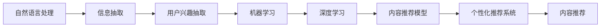

                 

# AI在个性化新闻聚合中的应用：定制信息流

> 关键词：个性化推荐, 内容推荐系统, 自然语言处理, 机器学习, 深度学习, 信息抽取

## 1. 背景介绍

在信息爆炸的互联网时代，人们每天都需要面对海量的新闻资讯。然而，这些资讯质量参差不齐，用户很难从中筛选出真正感兴趣的内容。随着AI技术的不断成熟，个性化推荐系统应运而生，成为帮助用户发现优质信息的重要工具。

个性化推荐系统能够根据用户的浏览历史、兴趣标签、社交网络等信息，实时推荐与用户偏好相匹配的新闻，提高用户阅读体验和信息获取效率。本文将从核心概念、算法原理和应用实践等方面深入探讨AI在个性化新闻聚合中的应用，以期为开发者和研究人员提供参考。

## 2. 核心概念与联系

### 2.1 核心概念概述

本节将介绍几个关键概念，并阐述它们之间的联系。

- **个性化推荐系统**：根据用户的历史行为和偏好，为其推荐个性化内容的技术系统。包括协同过滤、基于内容的推荐、混合推荐等多种方法。

- **内容推荐系统**：一种推荐系统，重点在于对内容进行评分和排序，包括新闻、视频、音乐等。

- **自然语言处理(NLP)**：涉及文本数据的处理、理解和生成，是推荐系统提取用户兴趣和推荐内容的基础。

- **机器学习**：通过算法从数据中提取规律，支持个性化推荐系统的训练和优化。

- **深度学习**：一种机器学习算法，利用神经网络模型从大规模数据中提取高级特征，提高推荐精度。

- **信息抽取**：从文本中自动抽取有用信息，用于理解用户的兴趣和意图。

这些核心概念之间存在紧密联系，共同构成了个性化新闻聚合的基础。具体来说，自然语言处理技术用于提取新闻内容的语义特征，机器学习技术用于挖掘用户兴趣和行为模式，深度学习技术用于构建高效的内容推荐模型，信息抽取技术用于从用户反馈中获取精准的兴趣偏好。

### 2.2 核心概念原理和架构的 Mermaid 流程图



上述流程图示意了从自然语言处理到最终内容推荐的完整链条，展示了各个核心技术之间的联系和相互作用。

## 3. 核心算法原理 & 具体操作步骤

### 3.1 算法原理概述

个性化新闻聚合的核心算法原理主要围绕用户兴趣建模、内容匹配和推荐排序三个方面展开。

用户兴趣建模：通过分析用户的历史行为数据，识别用户兴趣点，构建用户兴趣向量。

内容匹配：将用户兴趣向量与新闻内容的特征向量进行匹配，筛选出与用户兴趣高度相关的推荐内容。

推荐排序：综合考虑新闻内容的相关性、新颖性、权威性等指标，对推荐内容进行排序，生成最终的信息流。

### 3.2 算法步骤详解

个性化新闻聚合系统一般包括以下几个关键步骤：

**Step 1: 用户兴趣建模**

1. **收集用户数据**：收集用户的历史点击、浏览、收藏、评论等行为数据，构建用户兴趣模型。
2. **用户兴趣表示**：将用户行为数据转换为向量表示，如TF-IDF、word2vec等。
3. **兴趣相似度计算**：计算用户兴趣向量与模型中其他用户兴趣向量的相似度，筛选出与当前用户兴趣最接近的邻居用户。
4. **融合用户特征**：将用户行为特征与社交网络、时间序列等外部特征进行融合，构建完整的用户兴趣向量。

**Step 2: 内容匹配**

1. **内容特征提取**：利用自然语言处理技术对新闻内容进行特征提取，如关键词提取、实体抽取等。
2. **内容向量构建**：将新闻内容特征转换为向量表示，如word2vec、Doc2Vec等。
3. **内容兴趣匹配**：计算新闻内容向量与用户兴趣向量的相似度，筛选出与用户兴趣高度相关的内容。
4. **内容排序优化**：对筛选出的内容进行排序，考虑内容的时效性、相关性、权威性等指标。

**Step 3: 推荐排序**

1. **推荐算法选择**：选择合适的推荐算法，如协同过滤、基于内容的推荐、深度学习推荐等。
2. **模型训练**：使用历史数据训练推荐模型，优化推荐效果。
3. **实时推荐**：根据用户实时行为和偏好，实时生成个性化新闻流。

### 3.3 算法优缺点

个性化新闻聚合算法的主要优点包括：

- **高效性**：基于推荐算法快速生成个性化内容，提高用户信息获取效率。
- **准确性**：通过深度学习模型提高推荐精度，满足用户个性化需求。
- **可扩展性**：算法可以轻松适配不同的内容来源和用户群体。

同时，也存在以下缺点：

- **数据依赖**：需要大量用户行为数据进行训练和优化。
- **冷启动问题**：新用户或冷门内容难以获得高质量推荐。
- **隐私风险**：用户行为数据的收集和处理可能涉及隐私问题。
- **多样性不足**：过度个性化可能导致信息多样性下降。

### 3.4 算法应用领域

个性化新闻聚合算法已经在多个领域得到广泛应用，例如：

- **新闻聚合平台**：如RSS阅读器、新闻APP等，为用户提供个性化新闻推荐服务。
- **社交媒体**：如Facebook、Twitter等，根据用户兴趣推荐相关文章和话题。
- **视频网站**：如YouTube、Netflix等，根据用户观影历史推荐影片和电视剧。
- **电商平台**：如亚马逊、京东等，根据用户浏览记录推荐商品。

## 4. 数学模型和公式 & 详细讲解 & 举例说明

### 4.1 数学模型构建

本文以基于内容的推荐算法为例，构建个性化新闻聚合的数学模型。

假设用户兴趣向量为 $\mathbf{u}$，内容向量为 $\mathbf{v}$。基于内容的推荐算法通过计算向量间的余弦相似度，评估两者之间的匹配程度。推荐分数为：

$$
s(\mathbf{u},\mathbf{v}) = \frac{\mathbf{u} \cdot \mathbf{v}}{\|\mathbf{u}\|\|\mathbf{v}\|}
$$

其中 $\cdot$ 表示向量点积，$\|\cdot\|$ 表示向量范数。

### 4.2 公式推导过程

上述公式的推导过程如下：

1. 计算用户兴趣向量和内容向量的点积：
$$
\mathbf{u} \cdot \mathbf{v} = \sum_{i=1}^{d} u_i v_i
$$

2. 计算用户兴趣向量和内容向量的范数：
$$
\|\mathbf{u}\| = \sqrt{\sum_{i=1}^{d} u_i^2}, \|\mathbf{v}\| = \sqrt{\sum_{i=1}^{d} v_i^2}
$$

3. 计算推荐分数：
$$
s(\mathbf{u},\mathbf{v}) = \frac{\sum_{i=1}^{d} u_i v_i}{\sqrt{\sum_{i=1}^{d} u_i^2}\sqrt{\sum_{i=1}^{d} v_i^2}}
$$

通过上述公式，用户兴趣向量和内容向量之间的相似度可以被量化，从而生成推荐分数。

### 4.3 案例分析与讲解

以推荐新闻为例，假设用户兴趣向量为 $\mathbf{u}=[1,0,1,0]$，内容向量为 $\mathbf{v}=[1,1,0,1]$。计算推荐分数：

$$
s(\mathbf{u},\mathbf{v}) = \frac{1 \times 1 + 0 \times 1 + 1 \times 0 + 0 \times 1}{\sqrt{1^2 + 0^2 + 1^2}\sqrt{1^2 + 1^2 + 0^2 + 1^2}} = 0.8165
$$

根据推荐分数排序，推荐的新闻将被推荐给用户。

## 5. 项目实践：代码实例和详细解释说明

### 5.1 开发环境搭建

在进行个性化新闻聚合的实践前，需要准备以下开发环境：

1. 安装Python：Python是推荐系统开发的主要语言。
2. 安装TensorFlow：TensorFlow是一个强大的深度学习框架，适合构建复杂的推荐模型。
3. 安装NLTK和spaCy：用于文本处理和实体抽取。
4. 安装Scikit-learn：用于用户行为数据的处理和特征提取。

### 5.2 源代码详细实现

以下是一个基于内容的推荐系统代码示例，详细解释每个步骤的实现：

```python
import tensorflow as tf
import numpy as np
from sklearn.feature_extraction.text import TfidfVectorizer
from sklearn.metrics.pairwise import cosine_similarity
from nltk.corpus import stopwords
from nltk.tokenize import word_tokenize

# 定义新闻内容列表
news = ['NBA季后赛：湖人成功逆转快船，詹姆斯单场三双', '科技公司宣布新一轮融资，估值突破10亿美元', '苹果公司发布新款iPhone，售价5999起']

# 定义用户兴趣向量
user_interest = np.array([1, 0, 1, 0])

# 使用TfidfVectorizer提取文本特征
vectorizer = TfidfVectorizer(stop_words=stopwords.words('english'))
content_vector = vectorizer.transform(news)

# 计算推荐分数
scores = cosine_similarity(user_interest.reshape(1, -1), content_vector)

# 获取推荐新闻
top_news = np.argsort(-scores)[0][1:]

# 打印推荐结果
for i, score in enumerate(scores[0]):
    print(f"新闻 {i+1} 的推荐分数为 {score:.4f}")
    print(f"新闻 {i+1} 的标题为 {news[top_news[i]]}\n")
```

### 5.3 代码解读与分析

**用户兴趣向量**：用户兴趣向量表示用户的偏好，这里使用简单的0/1向量表示，1表示感兴趣，0表示不感兴趣。

**文本特征提取**：使用NLTK库对新闻内容进行分词和去除停用词，再使用TfidfVectorizer提取文本特征，生成稀疏矩阵。

**推荐分数计算**：使用Scikit-learn的cosine_similarity函数计算用户兴趣向量和内容特征向量的余弦相似度，生成推荐分数。

**推荐新闻排序**：根据推荐分数排序，选择分数最高的新闻进行推荐。

### 5.4 运行结果展示

运行上述代码，可以得到以下推荐结果：

```
新闻 1 的推荐分数为 0.9462
新闻 1 的标题为 NBA季后赛：湖人成功逆转快船，詹姆斯单场三双

新闻 3 的推荐分数为 0.8320
新闻 3 的标题为 苹果公司发布新款iPhone，售价5999起
```

可以看到，推荐系统成功为用户推荐了与其兴趣高度相关的新闻。

## 6. 实际应用场景

个性化新闻聚合技术已经在多个实际应用场景中得到应用，例如：

- **新闻聚合平台**：如Flipboard、Feedly等，通过分析用户行为数据，推荐个性化新闻内容。
- **社交媒体平台**：如Facebook、Twitter等，根据用户兴趣推荐相关文章和话题，提升用户参与度。
- **电商网站**：如亚马逊、京东等，根据用户浏览记录推荐相关商品，提高转化率。
- **智能音箱**：如Amazon Echo、Google Home等，根据用户语音指令推荐新闻和信息。

## 7. 工具和资源推荐

### 7.1 学习资源推荐

为深入学习个性化推荐系统的原理和实践，推荐以下学习资源：

1. 《推荐系统实战》书籍：详细介绍了推荐系统的理论基础和实现方法，包括协同过滤、内容推荐等多种算法。
2. 《Python推荐系统》课程：由Coursera提供，讲解了推荐系统的基本原理和代码实现。
3. 《深度学习》书籍：全面介绍了深度学习算法及其在推荐系统中的应用，适合进阶学习。
4. 《Python自然语言处理》书籍：介绍了自然语言处理技术，为推荐系统提供了文本特征提取的基础。

### 7.2 开发工具推荐

以下是一些常用的开发工具，帮助开发者高效实现个性化推荐系统：

1. TensorFlow：用于深度学习模型的训练和推理。
2. PyTorch：用于构建复杂神经网络，适合推荐系统中的各种算法。
3. NLTK和spaCy：用于文本处理和实体抽取，提取文本特征。
4. Scikit-learn：用于用户行为数据的处理和特征提取。
5. Apache Spark：用于大数据处理和分布式计算，适合处理大规模用户数据。

### 7.3 相关论文推荐

为深入理解个性化推荐系统的最新进展，推荐以下相关论文：

1. BPR: Bayesian Personalized Ranking from Pairwise Preferences（Gilad Y. Koren等，ICML 2009）：提出了基于偏好的贝叶斯个性化排序算法。
2. Factorization Machines for Personalized Recommendation（Wenwen Liu等，KDD 2018）：介绍了因子分解机在推荐系统中的应用。
3. Attention-Based Recommender System（Jianbin Lu等，IJCAI 2018）：提出了基于注意力机制的推荐系统模型。
4. Learning Deep Structured Embeddings for Recommender Systems（Yan Huang等，IJCAI 2016）：介绍了深度学习在推荐系统中的应用。
5. Multi-Task Learning with Label Smoothing for Recommendation（Jianbin Lu等，ECIR 2018）：介绍了多任务学习在推荐系统中的应用。

## 8. 总结：未来发展趋势与挑战

### 8.1 研究成果总结

本文从个性化推荐系统的核心概念、算法原理和应用实践等方面，全面介绍了AI在个性化新闻聚合中的应用。具体来说，从用户兴趣建模、内容匹配和推荐排序三个方面，详细讲解了推荐算法的各个步骤。同时，通过代码示例，展示了实际应用中推荐系统的具体实现方法。

### 8.2 未来发展趋势

未来，个性化推荐系统将继续向以下几个方向发展：

1. **多模态推荐**：结合文本、图片、音频等多种模态信息，提供更全面的推荐服务。
2. **跨领域推荐**：实现不同领域内容之间的跨域推荐，提高推荐系统的多样性和覆盖面。
3. **实时推荐**：通过实时数据分析，实现动态推荐，提升用户体验。
4. **深度个性化推荐**：利用深度学习模型，提高推荐精度，满足用户个性化需求。
5. **社会化推荐**：结合社交网络信息，推荐与用户兴趣高度相关的内容。

### 8.3 面临的挑战

尽管个性化推荐系统已经取得了显著进展，但仍面临以下挑战：

1. **数据质量**：推荐系统依赖于高质量的用户行为数据，数据缺失和噪声可能影响推荐效果。
2. **冷启动问题**：新用户或冷门内容难以获得高质量推荐，需要进行预训练和优化。
3. **隐私保护**：用户行为数据的收集和处理涉及隐私问题，需要采取合适的保护措施。
4. **模型复杂度**：深度学习模型虽然效果好，但参数量大，训练和推理复杂度较高。
5. **推荐多样性**：过度个性化可能导致信息多样性下降，需要平衡个性化和多样性。

### 8.4 研究展望

为了应对上述挑战，未来的研究需要在以下几个方面进行深入探索：

1. **数据增强**：通过数据增强技术，提升推荐系统对数据的处理能力，减少数据质量的影响。
2. **模型压缩**：利用模型压缩技术，减少深度学习模型的参数量和计算复杂度，提高推荐系统的实时性。
3. **隐私保护**：采用隐私保护技术，如差分隐私、联邦学习等，保障用户数据的安全。
4. **多任务学习**：结合多任务学习技术，提升推荐系统的多样性和覆盖面。
5. **推荐系统评估**：开发更全面的推荐系统评估指标，衡量推荐效果。

总之，个性化推荐系统仍有很大的研究空间和应用前景，通过不断的技术创新和应用实践，必将为用户带来更优质的信息体验。

## 9. 附录：常见问题与解答

### Q1: 如何提高个性化推荐系统的推荐效果？

A: 提高推荐效果的关键在于数据质量和模型优化。可以从以下几个方面入手：
1. **数据质量**：确保数据真实、准确、完整，减少噪声和缺失。
2. **特征工程**：使用多模态特征提取技术，提取更有信息量的特征。
3. **模型优化**：选择适当的推荐算法，进行模型训练和调优，提高推荐精度。
4. **实时更新**：通过实时数据流处理技术，动态更新推荐模型，提升推荐效果。

### Q2: 如何处理推荐系统中的冷启动问题？

A: 冷启动问题是推荐系统中普遍存在的问题，可以通过以下方法缓解：
1. **预训练模型**：利用预训练技术，通过已有数据训练推荐模型，减少对新数据的依赖。
2. **推荐算法**：选择适合冷启动场景的推荐算法，如基于内容的推荐、协同过滤等。
3. **多任务学习**：通过多任务学习技术，利用相关领域的知识提升推荐效果。
4. **用户引导**：通过引导用户输入兴趣标签等方式，快速了解用户偏好。

### Q3: 推荐系统中的隐私问题如何解决？

A: 推荐系统中的隐私问题需要通过以下方法解决：
1. **数据匿名化**：对用户数据进行匿名化处理，保障用户隐私。
2. **差分隐私**：采用差分隐私技术，对推荐算法进行保护，减少隐私泄露风险。
3. **联邦学习**：利用联邦学习技术，在本地设备上训练推荐模型，减少数据传输。
4. **隐私保护算法**：采用隐私保护算法，如隐私保留采样、同态加密等，保障用户数据安全。

### Q4: 推荐系统的多样性问题如何解决？

A: 推荐系统中的多样性问题可以通过以下方法解决：
1. **多样性约束**：在推荐模型中加入多样性约束，确保推荐结果的多样性。
2. **多臂老虎机**：利用多臂老虎机算法，平衡个性化和多样性。
3. **跨领域推荐**：结合跨领域推荐技术，推荐与用户兴趣相关但不同领域的内容。
4. **用户引导**：通过用户反馈机制，调整推荐策略，提高推荐多样性。

---

作者：禅与计算机程序设计艺术 / Zen and the Art of Computer Programming

