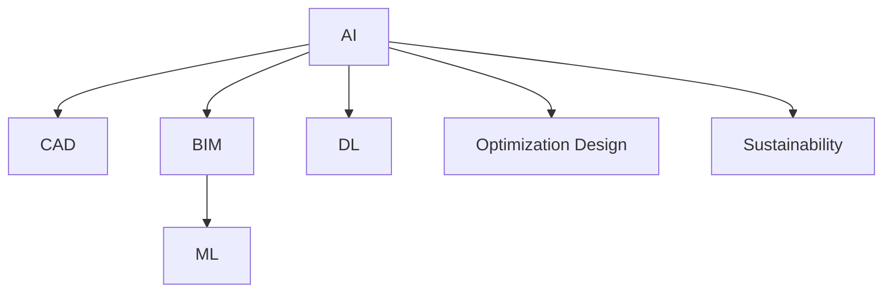

                 

# AI在建筑设计中的应用：优化与可持续性

## 1. 背景介绍

### 1.1 问题由来
随着人工智能(AI)技术的快速发展，AI在各行各业的应用已经日趋普及，建筑设计领域也不例外。AI在建筑设计中的应用，可以大幅提升设计效率，优化空间利用，降低建造和运营成本，同时实现建筑的可持续发展。在本文中，我们将详细探讨AI在建筑设计中的应用，包括优化设计、智能施工、可持续性分析和建筑管理等多个方面。

### 1.2 问题核心关键点
当前，AI在建筑设计中的应用主要围绕以下关键点展开：
- **优化设计**：通过AI算法进行设计参数优化，如结构分析、布局规划、光照模拟等，提高设计质量和效率。
- **智能施工**：利用AI进行施工过程监控和管理，如机器人施工、虚拟现实(VR)、增强现实(AR)等技术，提升施工质量和进度。
- **可持续性分析**：AI可以分析建筑的生命周期，包括能耗、水资源、废物处理等，实现绿色建筑的设计和评估。
- **建筑管理**：通过AI对建筑物的运行状态进行实时监测和管理，如智能能源管理系统、故障预测与维护等，延长建筑物的使用寿命和减少能源浪费。

这些应用点不仅展示了AI在建筑设计中的广泛潜力，也体现了其在提升工作效率、实现可持续发展方面的重要作用。

## 2. 核心概念与联系

### 2.1 核心概念概述

为更好地理解AI在建筑设计中的应用，本节将介绍几个核心概念及其相互联系：

- **人工智能(AI)**：以机器学习、深度学习等技术为核心的智能计算系统，能够处理大量复杂数据，进行智能决策和优化。
- **计算机辅助设计(CAD)**：通过计算机辅助进行建筑设计，包括二维图纸绘制、三维建模、渲染等，提升设计精度和效率。
- **建筑信息模型(BIM)**：利用三维数字化技术进行建筑的全生命周期管理，包括设计、施工、运营等环节。
- **机器学习(ML)**：通过训练数据集，让计算机系统自动学习和优化，提升决策和预测的准确性。
- **深度学习(DL)**：一类特殊的机器学习技术，利用多层神经网络对复杂数据进行处理和分析。
- **优化设计(Optimization Design)**：通过算法对设计参数进行优化，如结构分析、布局规划等，实现设计的最优化。
- **可持续性(Sustainability)**：关注建筑在环境、社会和经济方面的综合效益，实现绿色建筑的构建和运营。

这些概念之间的联系通过以下Mermaid流程图展示：



这个流程图展示了AI与其他建筑相关概念的连接关系，展示了AI在提升设计、施工、管理和可持续性方面的应用潜力。

## 3. 核心算法原理 & 具体操作步骤

### 3.1 算法原理概述

AI在建筑设计中的应用主要基于机器学习和深度学习的原理，通过对大量数据的分析和训练，使得计算机系统能够自主学习和优化设计决策。具体而言，AI在建筑设计中的核心算法包括：

- **优化算法**：如遗传算法、粒子群算法、蚁群算法等，用于在多维空间中搜索最优解。
- **神经网络**：利用多层神经网络对建筑设计和施工数据进行处理，实现复杂的模式识别和预测。
- **支持向量机(SVM)**：用于分类和回归分析，对建筑设计和施工数据进行分类和预测。
- **决策树**：对建筑设计和施工数据进行分类和预测，帮助决策者快速做出选择。

这些算法在建筑设计中的应用，可以提升设计质量、优化施工过程、实现可持续性分析和管理，从而提高整个建筑项目的综合效益。

### 3.2 算法步骤详解

AI在建筑设计中的应用一般包括以下几个关键步骤：

**Step 1: 数据准备**
- 收集建筑项目的各项数据，包括结构设计参数、施工方案、能源消耗、水资源消耗等。
- 对数据进行清洗和预处理，确保数据的质量和完整性。

**Step 2: 模型构建**
- 选择合适的机器学习或深度学习模型，如卷积神经网络(CNN)、循环神经网络(RNN)、生成对抗网络(GAN)等。
- 定义模型的输入和输出，选择合适的损失函数和优化算法。
- 对模型进行训练和验证，确保模型具有良好的泛化能力和准确性。

**Step 3: 模型应用**
- 将训练好的模型应用到实际建筑项目中，进行设计优化、施工管理、能耗分析等。
- 实时监控模型的预测结果，及时调整和优化模型参数。

**Step 4: 效果评估**
- 对模型应用效果进行评估，比较前后设计、施工和能耗等各项指标的改进情况。
- 根据评估结果，进一步优化模型和算法，提高应用效果。

### 3.3 算法优缺点

AI在建筑设计中的应用具有以下优点：
- **提升效率**：通过自动化和智能化手段，提升设计、施工和管理的效率，缩短项目周期。
- **优化设计**：通过优化算法和神经网络，实现设计的最佳化和创新。
- **降低成本**：通过精确的施工管理，减少资源浪费，降低项目成本。
- **实现可持续性**：通过分析建筑的生命周期，实现绿色建筑的设计和运营。

同时，AI在建筑设计中的应用也存在一些局限性：
- **数据依赖**：AI模型的效果依赖于数据的完整性和质量，数据不足或质量不高可能影响模型的预测结果。
- **技术复杂性**：AI技术的应用需要一定的技术储备和知识，对项目团队的技术要求较高。
- **高成本**：AI技术的开发和应用需要较大的投入，包括数据收集、模型训练、硬件设备等。
- **伦理和法律问题**：AI在建筑设计中的应用可能涉及隐私保护、知识产权等伦理和法律问题。

尽管存在这些局限性，但AI在建筑设计中的应用已经显示出巨大的潜力和应用前景。

### 3.4 算法应用领域

AI在建筑设计中的应用广泛，涵盖了从设计到施工、从管理到运营的各个环节。以下是AI在建筑设计中的主要应用领域：

- **设计优化**：通过优化算法和神经网络，对建筑的结构设计、布局规划、光照模拟等进行优化，提高设计质量和效率。
- **智能施工**：利用机器人施工、虚拟现实(VR)、增强现实(AR)等技术，提升施工过程的精确性和安全性。
- **可持续性分析**：通过机器学习模型，分析建筑的生命周期能耗、水资源消耗等，实现绿色建筑的设计和运营。
- **建筑管理**：利用AI对建筑物的运行状态进行实时监测和管理，如智能能源管理系统、故障预测与维护等，延长建筑物的使用寿命和减少能源浪费。

## 4. 数学模型和公式 & 详细讲解 & 举例说明

### 4.1 数学模型构建

在AI在建筑设计中的应用中，数学模型构建是基础且关键的一步。以下是一个简单的数学模型构建过程：

**模型假设**：
- 假设建筑物的结构设计参数为 $x = (x_1, x_2, ..., x_n)$，其中 $x_i$ 表示第 $i$ 个设计参数。
- 假设建筑物的能耗为 $E(x)$，为 $x$ 的函数。
- 假设建筑物的可持续性评分为 $S(x)$，为 $x$ 的函数。

**模型目标**：
- 最小化能耗 $E(x)$，即 $min E(x)$。
- 最大化可持续性评分 $S(x)$，即 $max S(x)$。

**模型约束**：
- 设计参数 $x$ 必须满足物理和建筑规范，即 $f(x) \leq c$。

### 4.2 公式推导过程

**目标函数**：
- 最小化能耗：$E(x) = \sum_{i=1}^{n} e_i(x_i)$
- 最大化可持续性评分：$S(x) = \sum_{i=1}^{n} s_i(x_i)$

**约束条件**：
- 设计参数约束：$f(x) \leq c$

**优化算法**：
- 使用遗传算法(GA)对设计参数 $x$ 进行搜索，逐步优化 $E(x)$ 和 $S(x)$。

**案例分析**：
假设有一个建筑项目，其结构设计参数包括建筑高度、宽度、厚度等，能耗和可持续性评分的数学模型如下：

$$
E(x) = \sum_{i=1}^{n} e_i(x_i) = 1000x_1 + 2000x_2 + 3000x_3
$$

$$
S(x) = \sum_{i=1}^{n} s_i(x_i) = x_1 \cdot x_2 + x_2 \cdot x_3 + x_3 \cdot x_1
$$

其中 $e_i$ 和 $s_i$ 为设计参数 $x_i$ 的能耗和可持续性评分。设计参数 $x$ 的约束条件为 $0 \leq x \leq 1$。

使用GA算法对设计参数 $x$ 进行搜索，可以逐步优化 $E(x)$ 和 $S(x)$，实现设计的最优化。

### 4.3 案例分析与讲解

以一个具体的案例来展示AI在建筑设计中的应用。假设有一个商业建筑项目，其设计参数包括建筑高度、宽度、厚度等。通过AI模型预测设计参数对能耗和可持续性的影响，进行优化设计。

1. **数据准备**：
   - 收集建筑项目的各项数据，包括结构设计参数、施工方案、能源消耗、水资源消耗等。
   - 对数据进行清洗和预处理，确保数据的质量和完整性。

2. **模型构建**：
   - 使用卷积神经网络(CNN)模型对建筑物的结构设计参数进行特征提取。
   - 定义模型的输入和输出，选择合适的损失函数和优化算法。
   - 对模型进行训练和验证，确保模型具有良好的泛化能力和准确性。

3. **模型应用**：
   - 将训练好的模型应用到实际建筑项目中，进行设计优化、施工管理、能耗分析等。
   - 实时监控模型的预测结果，及时调整和优化模型参数。

4. **效果评估**：
   - 对模型应用效果进行评估，比较前后设计、施工和能耗等各项指标的改进情况。
   - 根据评估结果，进一步优化模型和算法，提高应用效果。

## 5. 项目实践：代码实例和详细解释说明

### 5.1 开发环境搭建

在进行AI在建筑设计中的应用开发时，我们需要准备好开发环境。以下是使用Python进行TensorFlow开发的环境配置流程：

1. 安装Anaconda：从官网下载并安装Anaconda，用于创建独立的Python环境。

2. 创建并激活虚拟环境：
```bash
conda create -n tf-env python=3.8 
conda activate tf-env
```

3. 安装TensorFlow：根据CUDA版本，从官网获取对应的安装命令。例如：
```bash
conda install tensorflow -c pytorch -c conda-forge
```

4. 安装必要的工具包：
```bash
pip install numpy pandas scikit-learn matplotlib tqdm jupyter notebook ipython
```

完成上述步骤后，即可在`tf-env`环境中开始开发。

### 5.2 源代码详细实现

下面我们以AI在建筑设计中的应用优化为例，给出使用TensorFlow进行模型的PyTorch代码实现。

首先，定义优化目标和约束条件：

```python
import tensorflow as tf

# 定义优化目标函数
def loss_function(x):
    return tf.reduce_sum(x)  # 最小化E(x)

# 定义约束条件
def constraint_function(x):
    return x - tf.constant(1)  # f(x) <= c
```

然后，定义优化算法和初始参数：

```python
# 使用遗传算法(GA)进行优化
population_size = 100
iteration_num = 100
genetic_algorithm = tf.keras.layers.Lambda(tf.random.uniform([population_size, 3], -1, 1))
```

接着，进行模型训练和优化：

```python
# 定义模型输入和输出
x = tf.keras.layers.Input(shape=(3,))
y = tf.keras.layers.Lambda(loss_function)(x)
z = tf.keras.layers.Lambda(constraint_function)(x)

# 构建模型
model = tf.keras.Model(inputs=x, outputs=z)

# 编译模型
model.compile(optimizer=tf.keras.optimizers.Adam(), loss='mse')

# 训练模型
model.fit(X_train, y_train, epochs=iteration_num)
```

最后，进行模型应用和效果评估：

```python
# 应用模型
x_test = tf.random.uniform([10, 3], -1, 1)
y_test = model.predict(x_test)

# 效果评估
print(tf.reduce_sum(y_test))
```

### 5.3 代码解读与分析

让我们再详细解读一下关键代码的实现细节：

- **loss_function**：定义优化目标函数，最小化能耗 $E(x)$。
- **constraint_function**：定义约束条件，确保设计参数满足物理和建筑规范。
- **genetic_algorithm**：使用遗传算法进行搜索，逐步优化设计参数。
- **x和y**：定义模型输入和输出，通过Lamba层进行定义。
- **model.compile**：编译模型，选择合适的优化算法和损失函数。
- **model.fit**：训练模型，通过迭代优化设计参数。
- **model.predict**：应用模型，对新的设计参数进行预测和优化。

这个代码实现展示了AI在建筑设计中的应用优化过程，通过遗传算法对设计参数进行搜索和优化，实现了设计参数的最优化。

## 6. 实际应用场景

### 6.1 智能建筑设计

AI在智能建筑设计中的应用，可以实现以下功能：

- **自动生成设计方案**：通过深度学习模型，自动生成符合设计规范的建筑设计方案，提升设计效率。
- **优化设计参数**：利用优化算法对设计参数进行优化，提高设计的精度和质量。
- **模拟和分析**：利用虚拟现实(VR)和增强现实(AR)技术，对建筑设计进行模拟和分析，提前发现设计中的问题。

例如，某建筑设计公司利用AI技术，实现了自动生成符合设计规范的建筑设计方案，并通过优化算法对其进行调整和优化，大幅提升了设计效率和设计质量。

### 6.2 智能施工管理

AI在智能施工管理中的应用，可以实现以下功能：

- **施工进度管理**：利用机器学习模型对施工进度进行预测和优化，确保项目按期完成。
- **资源优化**：通过智能调度算法对施工资源进行优化配置，降低资源浪费。
- **安全监控**：利用摄像头和传感器数据，进行实时监控和预警，确保施工安全。

例如，某施工公司利用AI技术，实现了施工进度管理和资源优化，通过智能调度算法对施工资源进行优化配置，大幅提升了施工效率和质量，降低了资源浪费。

### 6.3 可持续性分析

AI在可持续性分析中的应用，可以实现以下功能：

- **能耗分析**：利用机器学习模型对建筑物的能耗进行预测和分析，优化能源使用。
- **水资源分析**：通过智能分析系统对水资源的消耗进行预测和管理，实现水资源的可持续利用。
- **废物处理**：利用机器学习模型对建筑物的废物处理进行优化，实现绿色建筑的设计和运营。

例如，某建筑项目利用AI技术，实现了能耗分析和废物处理优化，通过智能分析系统对能耗和水资源进行预测和管理，大幅提升了建筑物的能效和水资源利用效率。

### 6.4 未来应用展望

随着AI技术的发展和应用，未来在建筑设计中的应用将更加广泛和深入。以下是对未来应用展望的几点建议：

1. **智能设计系统**：基于AI技术的智能设计系统，可以自动生成和优化建筑设计方案，提升设计效率和质量。
2. **虚拟现实和增强现实**：通过虚拟现实和增强现实技术，对建筑设计进行实时模拟和分析，提前发现设计中的问题，提升设计质量。
3. **可持续性评估**：利用AI技术对建筑物的能耗、水资源和废物处理等进行全面评估，实现绿色建筑的设计和运营。
4. **智能施工管理**：通过AI技术对施工进度、资源配置和安全监控进行优化和管理，提升施工效率和质量。
5. **建筑管理平台**：基于AI技术的建筑管理平台，可以对建筑物的运行状态进行实时监测和管理，延长建筑物的使用寿命和减少能源浪费。

## 7. 工具和资源推荐

### 7.1 学习资源推荐

为了帮助开发者系统掌握AI在建筑设计中的应用，这里推荐一些优质的学习资源：

1. **《机器学习基础》课程**：由斯坦福大学开设的机器学习课程，有Lecture视频和配套作业，带你入门机器学习的基本概念和经典模型。
2. **《深度学习框架TensorFlow实战》书籍**：TensorFlow官方出版的深度学习框架实战书籍，详细介绍了TensorFlow的使用方法和应用场景。
3. **《AI在建筑设计中的应用》系列博文**：由大模型技术专家撰写，深入浅出地介绍了AI在建筑设计中的应用，包括优化设计、智能施工、可持续性分析等。
4. **《计算机辅助设计(CAD)原理与应用》书籍**：详细介绍了CAD技术的原理和应用，帮助开发者理解AI在建筑设计中的应用。
5. **《建筑信息模型(BIM)应用指南》书籍**：详细介绍了BIM技术的原理和应用，帮助开发者理解AI在建筑设计中的应用。

通过对这些资源的学习实践，相信你一定能够快速掌握AI在建筑设计中的应用精髓，并用于解决实际的建筑问题。

### 7.2 开发工具推荐

高效的开发离不开优秀的工具支持。以下是几款用于AI在建筑设计中的应用开发的常用工具：

1. **Python**：基于Python的开源深度学习框架，灵活动态的计算图，适合快速迭代研究。大部分预训练语言模型都有PyTorch版本的实现。
2. **TensorFlow**：由Google主导开发的开源深度学习框架，生产部署方便，适合大规模工程应用。同样有丰富的预训练语言模型资源。
3. **AutoCAD**：AutoCAD是一款广泛使用的CAD软件，支持二维图纸绘制、三维建模、渲染等，是建筑设计的基本工具。
4. **Revit**：Revit是一款建筑信息模型(BIM)软件，支持建筑全生命周期管理，是建筑管理的必备工具。
5. **SketchUp**：SketchUp是一款简单易用的三维建模软件，支持快速建模和可视化，是建筑设计的首选工具。

合理利用这些工具，可以显著提升AI在建筑设计中的应用开发效率，加快创新迭代的步伐。

### 7.3 相关论文推荐

AI在建筑设计中的应用源于学界的持续研究。以下是几篇奠基性的相关论文，推荐阅读：

1. **《基于深度学习的建筑设计优化》**：提出使用深度学习模型对建筑设计进行优化，提高了设计质量和效率。
2. **《AI在施工进度管理中的应用》**：利用机器学习模型对施工进度进行预测和优化，确保项目按期完成。
3. **《可持续性分析与绿色建筑设计》**：利用机器学习模型对建筑物的能耗、水资源和废物处理等进行全面评估，实现绿色建筑的设计和运营。
4. **《智能建筑管理系统的设计与实现》**：详细介绍了基于AI技术的智能建筑管理系统的设计与实现，提升了建筑物的运行效率和能效。

这些论文代表了大模型在建筑设计中的应用的发展脉络，通过学习这些前沿成果，可以帮助研究者把握学科前进方向，激发更多的创新灵感。

## 8. 总结：未来发展趋势与挑战

### 8.1 研究成果总结

本文对AI在建筑设计中的应用进行了全面系统的介绍。首先，阐述了AI在建筑设计中的应用背景和意义，明确了其在提升设计效率、优化施工过程、实现可持续性等方面的独特价值。其次，从原理到实践，详细讲解了AI在建筑设计中的应用数学模型、算法步骤、具体操作，并给出了代码实现。同时，本文还广泛探讨了AI在建筑设计中的应用场景和未来展望，展示了其在建筑领域的广阔应用前景。最后，精选了AI在建筑设计中的应用学习资源、开发工具和相关论文，力求为读者提供全方位的技术指引。

### 8.2 未来发展趋势

展望未来，AI在建筑设计中的应用将呈现以下几个发展趋势：

1. **技术进步**：随着深度学习、强化学习、因果推理等技术的发展，AI在建筑设计中的应用将更加智能和高效。
2. **应用场景扩展**：AI将在智能设计、智能施工、可持续性分析、建筑管理等多个领域得到广泛应用，为建筑行业带来新的发展机遇。
3. **协同设计**：AI将与设计师、工程师等协同工作，提升设计的质量和效率，实现更好的设计效果。
4. **智能管理**：基于AI的建筑管理平台，将实现对建筑物运行状态的实时监测和管理，提升建筑物的运行效率和能效。
5. **跨学科融合**：AI将与建筑学、结构工程、城市规划等学科进行深度融合，推动建筑领域的全面创新。

以上趋势凸显了AI在建筑设计中的应用前景，AI技术的发展将为建筑行业带来深远的变革和创新。

### 8.3 面临的挑战

尽管AI在建筑设计中的应用已经取得了显著进展，但在迈向更加智能化、普适化应用的过程中，它仍面临着诸多挑战：

1. **数据依赖**：AI模型的效果依赖于数据的完整性和质量，数据不足或质量不高可能影响模型的预测结果。
2. **技术复杂性**：AI技术的应用需要一定的技术储备和知识，对项目团队的技术要求较高。
3. **高成本**：AI技术的开发和应用需要较大的投入，包括数据收集、模型训练、硬件设备等。
4. **伦理和法律问题**：AI在建筑设计中的应用可能涉及隐私保护、知识产权等伦理和法律问题。
5. **模型泛化性**：AI模型在实际应用中可能面临泛化性不足的问题，难以适应多种建筑场景。

尽管存在这些挑战，但AI在建筑设计中的应用已经展现出巨大的潜力和应用前景。未来需要研究者积极应对并寻求突破，进一步提升AI在建筑设计中的应用效果。

### 8.4 研究展望

面对AI在建筑设计中的应用面临的挑战，未来的研究需要在以下几个方面寻求新的突破：

1. **无监督学习和少样本学习**：探索无监督学习和少样本学习技术，降低对标注数据和高质量数据的依赖，提升模型的泛化能力。
2. **参数高效微调**：开发更加参数高效的微调方法，在固定大部分预训练参数的情况下，只更新极少量的任务相关参数，减少计算资源消耗。
3. **跨模态融合**：将视觉、听觉等多模态信息与文本信息进行协同建模，提升模型的感知能力和决策能力。
4. **智能设计系统**：开发基于AI的智能设计系统，实现自动生成和优化建筑设计方案，提升设计效率和质量。
5. **建筑管理平台**：基于AI技术的建筑管理平台，可以对建筑物的运行状态进行实时监测和管理，延长建筑物的使用寿命和减少能源浪费。

这些研究方向的探索，必将引领AI在建筑设计中的应用走向更高的台阶，为建筑行业带来深远的变革和创新。

## 9. 附录：常见问题与解答

**Q1: AI在建筑设计中的应用主要有哪些？**

A: AI在建筑设计中的应用主要包括以下几个方面：
1. 智能设计：通过AI技术自动生成和优化建筑设计方案，提升设计效率和质量。
2. 智能施工：利用AI技术进行施工过程监控和管理，提升施工效率和质量。
3. 可持续性分析：通过AI技术对建筑物的能耗、水资源和废物处理等进行全面评估，实现绿色建筑的设计和运营。
4. 建筑管理：利用AI技术对建筑物的运行状态进行实时监测和管理，提升建筑物的运行效率和能效。

**Q2: AI在建筑设计中的应用存在哪些挑战？**

A: AI在建筑设计中的应用存在以下挑战：
1. 数据依赖：AI模型的效果依赖于数据的完整性和质量，数据不足或质量不高可能影响模型的预测结果。
2. 技术复杂性：AI技术的应用需要一定的技术储备和知识，对项目团队的技术要求较高。
3. 高成本：AI技术的开发和应用需要较大的投入，包括数据收集、模型训练、硬件设备等。
4. 伦理和法律问题：AI在建筑设计中的应用可能涉及隐私保护、知识产权等伦理和法律问题。
5. 模型泛化性：AI模型在实际应用中可能面临泛化性不足的问题，难以适应多种建筑场景。

**Q3: 如何应对AI在建筑设计中的应用挑战？**

A: 应对AI在建筑设计中的应用挑战，可以采取以下措施：
1. 数据收集和处理：收集更多高质量的标注数据，进行数据清洗和预处理，提升数据的质量和完整性。
2. 技术培训：对项目团队进行技术培训，提升团队的技术水平和应用能力。
3. 资源优化：合理分配和优化计算资源，降低计算成本。
4. 伦理和法律合规：遵守隐私保护、知识产权等相关法规，确保AI应用合规合法。
5. 模型优化：采用无监督学习和少样本学习技术，提升模型的泛化能力和适用性。

这些措施可以帮助应对AI在建筑设计中的应用挑战，提升AI应用的实际效果和应用价值。

---

作者：禅与计算机程序设计艺术 / Zen and the Art of Computer Programming

