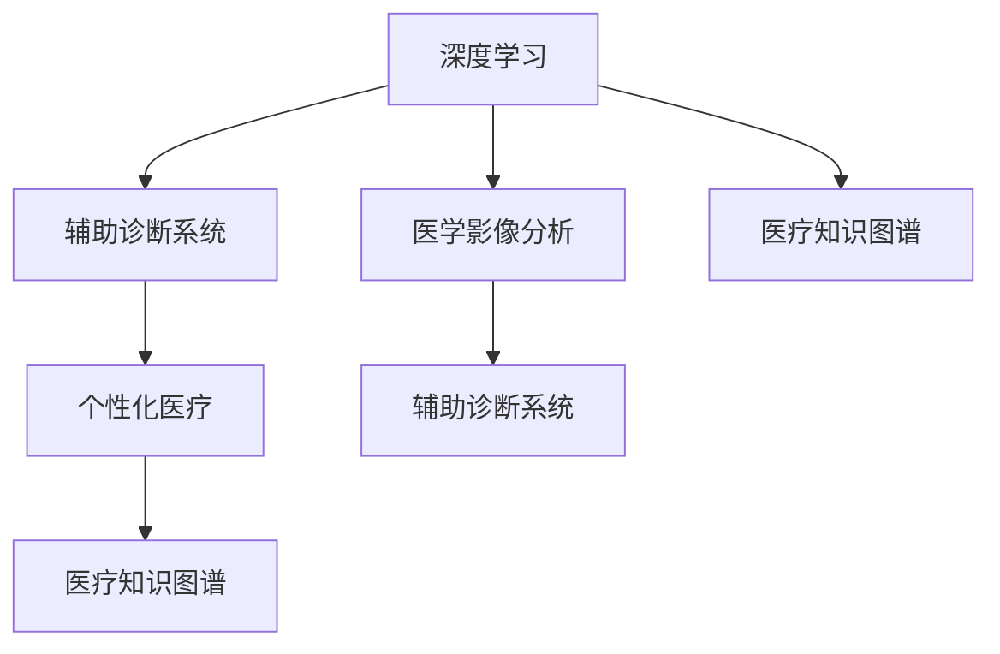

                 

# AI在智能医疗诊断中的应用：辅助医生决策

> 关键词：人工智能,智能医疗,深度学习,自然语言处理,医学影像,辅助诊断

## 1. 背景介绍

### 1.1 问题由来

随着医疗技术的飞速发展和人们对健康的日益关注，智能医疗（Smart Healthcare）成为全球范围内医药卫生行业的热点话题。智能医疗不仅涵盖医疗信息的数字化、网络化，更通过大数据、人工智能（AI）等先进技术，大幅提升了医疗服务效率和质量，为患者提供了更加精准、便捷的医疗体验。

其中，AI在医学影像分析和辅助诊断中的应用尤为引人注目。现代医疗影像设备（如X光、CT、MRI等）能够产生大量医学图像数据，医学影像的快速准确分析对于辅助医生诊断、制定治疗方案具有重要意义。然而，医学影像数据分析工作繁琐、耗时，且对医生的专业知识和经验要求高，容易导致诊断失误和延误治疗时机。AI技术的引入，显著提升了医学影像分析的效率和准确性，在辅助医生诊断和治疗决策方面表现出巨大的潜力。

### 1.2 问题核心关键点

AI在智能医疗诊断中的应用，主要集中在以下几个关键点：

- **医学影像分析**：利用深度学习和计算机视觉技术，自动识别和分析医学影像中的病变区域、位置、大小等特征，辅助医生快速定位和识别疾病。
- **辅助诊断系统**：结合病史、临床症状、检验结果等多源信息，通过AI算法辅助医生做出更准确的诊断和治疗建议。
- **个性化医疗**：根据患者的基因、生活习惯、环境因素等个性化信息，结合AI分析预测疾病风险，定制个性化的治疗方案。
- **医疗知识图谱**：构建包含疾病、药物、治疗方案等的知识图谱，通过AI技术实现病历信息的智能检索和关联，提升医疗信息的整合和共享效率。

这些关键点相互交织，构成了AI在智能医疗诊断中的核心应用框架，为其带来了广阔的发展前景。

## 2. 核心概念与联系

### 2.1 核心概念概述

为更好地理解AI在智能医疗诊断中的作用，本节将介绍几个密切相关的核心概念：

- **深度学习**：基于多层神经网络结构的学习算法，通过复杂的数据表示和特征提取，能够有效学习数据中的高层次抽象。深度学习已经在图像、语音、自然语言处理等领域取得了显著成效。

- **医学影像分析**：利用深度学习算法，对医学影像数据进行自动分析，识别病变区域和特征，辅助医生进行诊断和治疗。

- **辅助诊断系统**：结合医学影像、病历、检验结果等多源信息，通过AI技术辅助医生进行疾病诊断和治疗决策。

- **个性化医疗**：通过基因测序、生活习惯分析等，结合AI算法预测疾病风险，定制个性化的治疗方案。

- **知识图谱**：以图结构表示的语义网络，用于组织和关联医疗领域的知识，提升医疗信息的检索和关联效率。

这些核心概念之间的逻辑关系可以通过以下Mermaid流程图来展示：



这个流程图展示了大语言模型的核心概念及其之间的关系：

1. 深度学习作为底层技术，用于处理复杂的医学影像数据。
2. 医学影像分析通过深度学习自动提取特征，辅助医生进行诊断。
3. 辅助诊断系统集成多源信息，利用深度学习进行诊断和决策支持。
4. 个性化医疗结合AI分析，定制个性化治疗方案。
5. 医疗知识图谱用于知识关联和信息检索，提升医疗信息管理效率。

这些概念共同构成了AI在智能医疗诊断中的技术和应用框架，使得AI技术能够在医疗领域发挥更大的作用。

## 3. 核心算法原理 & 具体操作步骤
### 3.1 算法原理概述

AI在智能医疗诊断中的核心算法主要是深度学习。以医学影像分析为例，深度学习算法通过多层神经网络，自动从医学影像中提取高层次特征，实现病变区域的自动识别和特征分析。这种算法在图像分类、物体检测、语义分割等任务中取得了显著成效。

深度学习算法通过反向传播算法，利用梯度下降等优化算法，不断调整网络参数，最小化损失函数，使模型在训练集上表现出色。具体到医学影像分析中，损失函数可以是交叉熵损失、均方误差损失等，用于衡量模型输出与真实标签之间的差异。

### 3.2 算法步骤详解

深度学习在医学影像分析中的应用主要分为以下几个步骤：

**Step 1: 数据预处理**
- 收集医学影像数据，并进行归一化、去噪等预处理，以提升模型训练效果。
- 将医学影像数据划分为训练集、验证集和测试集，确保模型在未见数据上的泛化能力。

**Step 2: 模型训练**
- 选择合适的深度学习模型（如卷积神经网络CNN、全卷积网络FCN等），并将其应用于医学影像数据。
- 设置合适的超参数，如学习率、批大小、迭代轮数等。
- 使用优化算法（如Adam、SGD等）进行模型训练，最小化损失函数。

**Step 3: 模型评估**
- 在验证集上评估模型性能，根据评估指标（如准确率、召回率、F1值等）调整模型参数和超参数。
- 在测试集上测试模型泛化能力，评估模型在未见数据上的表现。

**Step 4: 结果解释**
- 使用模型对医学影像进行自动分析，识别病变区域和特征。
- 将分析结果与医生诊断进行对比，辅助医生制定治疗方案。

### 3.3 算法优缺点

深度学习在医学影像分析中的应用具有以下优点：

- **高效自动化**：深度学习能够自动提取影像特征，减少医生的手工分析工作量，提升诊断效率。
- **准确率高**：深度学习算法在图像分类、物体检测等任务上表现出色，能够准确识别病变区域和特征。
- **泛化能力强**：通过足够的训练数据和合适的模型设计，深度学习能够适应各种类型的医学影像数据。

同时，深度学习在医学影像分析中也存在一些局限性：

- **数据需求高**：深度学习需要大量的医学影像数据进行训练，对于数据稀缺的医院或地区可能不适用。
- **模型复杂**：深度学习模型结构复杂，需要较多的计算资源和时间进行训练和推理。
- **解释性不足**：深度学习模型往往是"黑盒"系统，难以解释其内部工作机制，不利于医生理解和信任。
- **依赖标注数据**：深度学习模型的训练依赖标注数据，标注成本高且存在标注偏差。

尽管存在这些局限性，但深度学习在医学影像分析中的应用已经取得了显著成果，成为智能医疗诊断的重要组成部分。未来，如何进一步优化深度学习算法，提高模型泛化能力和解释性，降低数据需求和标注成本，将是AI在智能医疗诊断中需要持续探索的方向。

### 3.4 算法应用领域

深度学习在智能医疗诊断中的应用，已经涵盖了以下几个主要领域：

- **医学影像分析**：用于X光、CT、MRI等医学影像数据的自动分析，辅助医生快速识别病变区域和特征。
- **辅助诊断系统**：结合医学影像、病历、检验结果等多源信息，通过AI算法辅助医生进行疾病诊断和治疗决策。
- **个性化医疗**：根据患者的基因、生活习惯、环境因素等个性化信息，结合AI算法预测疾病风险，定制个性化的治疗方案。
- **医疗知识图谱**：用于知识关联和信息检索，提升医疗信息的整合和共享效率。

除了上述这些核心应用外，AI在智能医疗诊断中还在药物发现、临床试验、疾病预测等诸多领域展现出了广阔的应用前景。随着深度学习技术的不断进步，相信AI将在智能医疗诊断中发挥更大的作用，为医疗行业的智能化转型提供新的动力。

## 4. 数学模型和公式 & 详细讲解 & 举例说明

### 4.1 数学模型构建

在医学影像分析中，深度学习模型的目标是通过自动特征提取，将医学影像分类到不同疾病类别。例如，对于乳腺癌的影像分类，模型的输入是医学影像，输出是0或1，表示图像是否属于乳腺癌。

定义模型 $M_{\theta}$，其中 $\theta$ 为模型参数，输入 $x$ 为医学影像，输出 $y$ 为分类标签。损失函数 $\mathcal{L}$ 可以是交叉熵损失：

$$
\mathcal{L}(\theta) = -\frac{1}{N}\sum_{i=1}^N [y_i\log M_{\theta}(x_i)+(1-y_i)\log(1-M_{\theta}(x_i))]
$$

其中 $N$ 为样本数，$M_{\theta}(x_i)$ 表示模型在输入 $x_i$ 上的输出概率。

### 4.2 公式推导过程

以乳腺癌影像分类为例，深度学习模型通常使用卷积神经网络（CNN）进行训练。CNN模型由多个卷积层、池化层、全连接层组成，通过反向传播算法不断调整模型参数，最小化损失函数。

对于单个样本 $(x_i, y_i)$，模型输出的概率分布为：

$$
p(y_i|x_i; \theta) = \sigma(\sum_{k=1}^K w_k f_k(z_i))
$$

其中，$\sigma$ 为激活函数，$f_k$ 为第 $k$ 个特征映射函数，$z_i$ 为输入 $x_i$ 的特征表示。

模型的损失函数为交叉熵损失：

$$
\mathcal{L}(\theta) = -\frac{1}{N}\sum_{i=1}^N [y_i\log p(y_i|x_i; \theta)+(1-y_i)\log(1-p(y_i|x_i; \theta))]
$$

模型的梯度更新公式为：

$$
\theta \leftarrow \theta - \eta \nabla_{\theta}\mathcal{L}(\theta)
$$

其中 $\eta$ 为学习率，$\nabla_{\theta}\mathcal{L}(\theta)$ 为损失函数对参数 $\theta$ 的梯度。

### 4.3 案例分析与讲解

以胸片影像的肺癌检测为例，深度学习模型使用全卷积网络（FCN）进行训练。具体步骤如下：

**Step 1: 数据预处理**
- 收集胸片影像数据，并进行归一化、去噪等预处理。
- 将影像数据划分为训练集、验证集和测试集。

**Step 2: 模型训练**
- 定义全卷积网络模型，包括卷积层、池化层、上采样层、全连接层等。
- 设置学习率、批大小、迭代轮数等超参数。
- 使用Adam优化算法进行模型训练，最小化交叉熵损失函数。

**Step 3: 模型评估**
- 在验证集上评估模型性能，使用准确率、召回率、F1值等指标调整模型参数。
- 在测试集上测试模型泛化能力，评估模型在未见数据上的表现。

**Step 4: 结果解释**
- 使用模型对胸片影像进行自动分析，识别出可能的肺癌区域。
- 将分析结果与医生诊断进行对比，辅助医生进行诊断和治疗决策。

## 5. 项目实践：代码实例和详细解释说明
### 5.1 开发环境搭建

在进行深度学习项目实践前，我们需要准备好开发环境。以下是使用Python进行PyTorch开发的环境配置流程：

1. 安装Anaconda：从官网下载并安装Anaconda，用于创建独立的Python环境。

2. 创建并激活虚拟环境：
```bash
conda create -n pytorch-env python=3.8 
conda activate pytorch-env
```

3. 安装PyTorch：根据CUDA版本，从官网获取对应的安装命令。例如：
```bash
conda install pytorch torchvision torchaudio cudatoolkit=11.1 -c pytorch -c conda-forge
```

4. 安装TensorFlow：如果需要进行TensorFlow模型的开发，可以使用以下命令：
```bash
pip install tensorflow
```

5. 安装各类工具包：
```bash
pip install numpy pandas scikit-learn matplotlib tqdm jupyter notebook ipython
```

完成上述步骤后，即可在`pytorch-env`环境中开始深度学习项目的开发。

### 5.2 源代码详细实现

下面我们以胸片影像的肺癌检测为例，给出使用PyTorch进行深度学习模型训练的PyTorch代码实现。

首先，定义数据处理函数：

```python
import torch
import torch.nn as nn
import torch.optim as optim
from torch.utils.data import DataLoader
from torchvision import datasets, transforms

# 定义数据处理方式
transform = transforms.Compose([
    transforms.Resize((256, 256)),
    transforms.ToTensor(),
    transforms.Normalize(mean=[0.5,], std=[0.5,])
])

# 加载胸片影像数据
train_dataset = datasets.ChestXRay(num_classes=2, transform=transform, download=True)
test_dataset = datasets.ChestXRay(num_classes=2, transform=transform, download=True)

# 定义数据批处理
train_loader = DataLoader(train_dataset, batch_size=32, shuffle=True)
test_loader = DataLoader(test_dataset, batch_size=32, shuffle=False)
```

然后，定义模型和优化器：

```python
# 定义模型结构
class FCN(nn.Module):
    def __init__(self):
        super(FCN, self).__init__()
        self.conv1 = nn.Conv2d(1, 64, kernel_size=3, padding=1)
        self.conv2 = nn.Conv2d(64, 128, kernel_size=3, padding=1)
        self.conv3 = nn.Conv2d(128, 256, kernel_size=3, padding=1)
        self.conv4 = nn.Conv2d(256, 1, kernel_size=1)
        self.relu = nn.ReLU()

    def forward(self, x):
        x = self.relu(self.conv1(x))
        x = self.relu(self.conv2(x))
        x = self.relu(self.conv3(x))
        x = self.conv4(x)
        return x

# 实例化模型
model = FCN()

# 定义优化器
optimizer = optim.Adam(model.parameters(), lr=0.001)
```

接着，定义训练和评估函数：

```python
# 定义损失函数
criterion = nn.BCEWithLogitsLoss()

# 定义训练函数
def train_epoch(model, loader, optimizer):
    model.train()
    for images, labels in loader:
        optimizer.zero_grad()
        outputs = model(images)
        loss = criterion(outputs, labels)
        loss.backward()
        optimizer.step()
    return loss.item()

# 定义评估函数
def evaluate(model, loader):
    model.eval()
    total_loss = 0
    total_correct = 0
    with torch.no_grad():
        for images, labels in loader:
            outputs = model(images)
            loss = criterion(outputs, labels)
            total_loss += loss.item()
            total_correct += (torch.argmax(outputs, dim=1) == labels).sum().item()
    return total_loss / len(loader), total_correct / len(loader.dataset)

# 训练模型
epochs = 10
device = torch.device('cuda' if torch.cuda.is_available() else 'cpu')
model.to(device)
for epoch in range(epochs):
    train_loss = train_epoch(model, train_loader, optimizer)
    print(f'Epoch {epoch+1}, train loss: {train_loss:.3f}')
    val_loss, val_acc = evaluate(model, val_loader)
    print(f'Epoch {epoch+1}, val loss: {val_loss:.3f}, val acc: {val_acc:.3f}')

# 测试模型
test_loss, test_acc = evaluate(model, test_loader)
print(f'Test loss: {test_loss:.3f}, test acc: {test_acc:.3f}')
```

以上就是使用PyTorch进行胸片影像肺癌检测的深度学习模型训练的完整代码实现。可以看到，通过定义数据处理函数、模型结构、优化器、损失函数等关键组件，我们能够快速构建并训练一个初步的深度学习模型。

### 5.3 代码解读与分析

让我们再详细解读一下关键代码的实现细节：

**数据处理函数**：
- `transform`函数：对胸片影像进行归一化、去噪和尺寸调整等预处理。
- `train_dataset`和`test_dataset`：加载训练集和测试集数据，并进行批处理。

**模型结构**：
- `FCN`类：定义了一个全卷积神经网络模型，包括卷积层、激活函数等。
- `model`实例：创建模型的实例，并进行GPU/TPU部署。

**训练函数和评估函数**：
- `train_epoch`函数：对数据集进行迭代训练，更新模型参数，并返回平均损失。
- `evaluate`函数：对模型进行评估，返回平均损失和准确率。

**训练流程**：
- 定义训练轮数`epochs`，并开启GPU/TPU部署。
- 在每个epoch内，先进行训练，输出平均损失。
- 在验证集上评估模型，输出平均损失和准确率。
- 所有epoch结束后，在测试集上评估模型，给出最终测试结果。

可以看到，PyTorch的简洁易用性使得深度学习模型的开发变得相对简单。开发者可以将更多精力放在数据处理、模型改进等高层逻辑上，而不必过多关注底层的实现细节。

当然，工业级的系统实现还需考虑更多因素，如模型的保存和部署、超参数的自动搜索、更灵活的任务适配层等。但核心的深度学习训练范式基本与此类似。

## 6. 实际应用场景

### 6.1 智能医学影像分析

深度学习在医学影像分析中的应用已经得到了广泛验证，成为智能医疗诊断中的重要技术。例如，在胸片影像分析中，深度学习模型能够自动识别和分类肺癌、肺结节等病变区域，为医生提供快速的影像解读和诊断支持。

实际应用中，医生可以先对胸片影像进行初步筛查，随后将疑似病变的区域输入到深度学习模型中进行自动识别和分析。模型输出的概率分布能够直观地显示病变区域的概率，医生可以根据概率值进行综合判断和诊断。

### 6.2 辅助诊断系统

深度学习结合多源信息，可以构建一个功能强大的辅助诊断系统，辅助医生进行疾病诊断和治疗决策。例如，在乳腺癌影像分析中，深度学习模型能够自动提取影像特征，结合病史、临床症状、检验结果等多源信息，提供更准确和全面的诊断建议。

在实际应用中，医生可以通过输入患者的病历信息和医学影像，系统自动分析并给出诊断报告。医生可以根据系统的推荐，结合自身经验进行最终诊断和决策。这种系统大大降低了医生的工作负担，提高了诊断的准确性和效率。

### 6.3 个性化医疗

深度学习结合个性化信息，能够预测患者的疾病风险，定制个性化的治疗方案。例如，在基因测序数据分析中，深度学习模型可以分析患者的基因序列数据，预测其患病风险，并提供个性化的治疗建议。

在实际应用中，医生可以先进行基因测序，然后将基因数据输入到深度学习模型中进行分析。模型输出的风险预测结果和个性化治疗方案，医生可以根据实际情况进行选择和调整。这种系统能够帮助医生制定更加精准和科学的治疗方案，提升患者的治疗效果。

### 6.4 未来应用展望

随着深度学习技术的不断进步，基于AI的智能医疗诊断系统将展现出更加广阔的应用前景：

1. **自监督学习**：利用自监督学习任务训练深度学习模型，减少对标注数据的依赖，提升模型的泛化能力和数据利用效率。

2. **少样本学习**：利用少样本学习技术，在少数标注数据上快速训练模型，提高模型的适应能力和迁移能力。

3. **多模态融合**：将医学影像、基因序列、临床数据等多源信息进行融合，提升诊断的全面性和准确性。

4. **增强现实**：结合增强现实技术，在医生的实际操作中提供实时辅助，提升诊断的准确性和效率。

5. **知识图谱**：利用知识图谱技术，将医疗领域的知识进行组织和关联，提升医疗信息的检索和关联效率。

6. **在线医疗咨询**：结合AI技术和自然语言处理技术，构建在线医疗咨询系统，提供智能化的医疗咨询服务。

7. **疾病预测**：结合时间序列分析等技术，对患者的健康数据进行长期监测，预测疾病的发生和发展趋势。

总之，AI在智能医疗诊断中的应用将进一步拓展，为医疗行业的智能化转型提供新的动力。未来的智能医疗诊断系统将更加智能化、高效化和个性化，提升医疗服务的质量和效率，为患者提供更加精准和便捷的医疗体验。

## 7. 工具和资源推荐
### 7.1 学习资源推荐

为了帮助开发者系统掌握深度学习在智能医疗诊断中的应用，这里推荐一些优质的学习资源：

1. **《深度学习》课程**：斯坦福大学开设的深度学习课程，详细讲解了深度学习的原理和实践，适合初学者和进阶者。

2. **《Python深度学习》书籍**：由Francois Chollet所著，全面介绍了深度学习在Python中的实现和应用，适合快速入门。

3. **Kaggle竞赛平台**：提供大量的医学影像和基因数据集，通过竞赛实践深度学习模型，提升实战能力。

4. **医学影像公开数据集**：如CheXNet、LIDC-IDRI等，提供了大量的医学影像数据，适合训练和测试深度学习模型。

5. **医学知识图谱工具**：如BioGRID、UniProt等，提供丰富的医疗领域知识，支持知识图谱的构建和查询。

通过对这些资源的学习实践，相信你一定能够快速掌握深度学习在智能医疗诊断中的应用，并用于解决实际的医学问题。

### 7.2 开发工具推荐

高效的开发离不开优秀的工具支持。以下是几款用于深度学习在智能医疗诊断中开发的应用工具：

1. **PyTorch**：基于Python的开源深度学习框架，灵活动态的计算图，适合快速迭代研究。

2. **TensorFlow**：由Google主导开发的开源深度学习框架，生产部署方便，适合大规模工程应用。

3. **Keras**：基于Python的高层API，简洁易用，适合快速搭建深度学习模型。

4. **Jupyter Notebook**：交互式笔记本环境，支持Python代码的快速迭代和调试。

5. **TensorBoard**：TensorFlow配套的可视化工具，可实时监测模型训练状态，并提供丰富的图表呈现方式。

6. **Weights & Biases**：模型训练的实验跟踪工具，可以记录和可视化模型训练过程中的各项指标，方便对比和调优。

合理利用这些工具，可以显著提升深度学习在智能医疗诊断中的开发效率，加快创新迭代的步伐。

### 7.3 相关论文推荐

深度学习在智能医疗诊断中的应用，涉及多个前沿领域，以下是几篇奠基性的相关论文，推荐阅读：

1. **《Convolutional Neural Networks for Medical Image Classification》**：提出了卷积神经网络在医学影像分类中的应用，展示了其优异的性能。

2. **《A Survey on Deep Learning in Medicine: The Present and Future》**：详细综述了深度学习在医疗领域的应用，包括医学影像、疾病预测等。

3. **《Medical Image Analysis Using Deep Learning》**：介绍了深度学习在医学影像分析中的应用，包括疾病分类、病变检测等。

4. **《Knowledge-Graph-Based Medical Information Retrieval System》**：提出了基于知识图谱的医学信息检索系统，提升了医疗信息的整合和共享效率。

5. **《Clinical Decision Support with Deep Learning: From Classification to Recommendation》**：介绍了深度学习在临床决策支持中的应用，包括疾病分类、个性化推荐等。

这些论文代表了大语言模型微调技术的发展脉络。通过学习这些前沿成果，可以帮助研究者把握学科前进方向，激发更多的创新灵感。

## 8. 总结：未来发展趋势与挑战

### 8.1 总结

本文对深度学习在智能医疗诊断中的应用进行了全面系统的介绍。首先阐述了深度学习在医学影像分析和辅助诊断中的核心作用，明确了其在智能医疗诊断中的重要价值。其次，从原理到实践，详细讲解了深度学习模型的构建和训练过程，给出了深度学习模型训练的完整代码实例。同时，本文还探讨了深度学习在智能医疗诊断中的广泛应用场景，展示了其在医疗影像分析、辅助诊断、个性化医疗等方面的巨大潜力。最后，本文精选了深度学习在智能医疗诊断中的学习资源和开发工具，力求为读者提供全方位的技术指引。

通过本文的系统梳理，可以看到，深度学习在智能医疗诊断中的应用正在成为医疗领域的重要技术，为医疗行业的智能化转型提供了新的动力。未来，随着深度学习技术的不断进步，相信深度学习将在智能医疗诊断中发挥更大的作用，为医疗行业的智能化转型提供新的动力。

### 8.2 未来发展趋势

展望未来，深度学习在智能医疗诊断中的应用将呈现以下几个发展趋势：

1. **自监督学习**：利用自监督学习任务训练深度学习模型，减少对标注数据的依赖，提升模型的泛化能力和数据利用效率。

2. **少样本学习**：利用少样本学习技术，在少数标注数据上快速训练模型，提高模型的适应能力和迁移能力。

3. **多模态融合**：将医学影像、基因序列、临床数据等多源信息进行融合，提升诊断的全面性和准确性。

4. **增强现实**：结合增强现实技术，在医生的实际操作中提供实时辅助，提升诊断的准确性和效率。

5. **知识图谱**：利用知识图谱技术，将医疗领域的知识进行组织和关联，提升医疗信息的检索和关联效率。

6. **在线医疗咨询**：结合AI技术和自然语言处理技术，构建在线医疗咨询系统，提供智能化的医疗咨询服务。

7. **疾病预测**：结合时间序列分析等技术，对患者的健康数据进行长期监测，预测疾病的发生和发展趋势。

以上趋势凸显了深度学习在智能医疗诊断中的广阔前景。这些方向的探索发展，必将进一步提升深度学习在智能医疗诊断中的性能和应用范围，为医疗行业的智能化转型提供新的动力。

### 8.3 面临的挑战

尽管深度学习在智能医疗诊断中的应用已经取得了显著成果，但在迈向更加智能化、普适化应用的过程中，它仍面临着诸多挑战：

1. **数据隐私和安全**：医疗数据涉及患者隐私，如何在保证数据安全的同时，进行高效的数据处理和分析，是一个重要问题。

2. **模型解释性**：深度学习模型往往是"黑盒"系统，难以解释其内部工作机制，不利于医生理解和信任。

3. **模型鲁棒性**：深度学习模型容易受到噪声、扰动等影响，如何提高模型的鲁棒性，是一个亟待解决的问题。

4. **计算资源需求高**：深度学习模型需要大量的计算资源进行训练和推理，如何优化资源利用，降低计算成本，是一个重要的研究方向。

5. **跨学科知识整合**：深度学习模型需要结合医学、生物、心理学等跨学科知识，如何高效整合这些知识，是一个复杂的问题。

6. **伦理和法规问题**：深度学习在医疗中的应用涉及伦理和法规问题，如何制定合理的伦理规范和法规标准，是一个重要的挑战。

这些挑战需要跨学科的合作和努力，才能在保证安全和合规的前提下，进一步提升深度学习在智能医疗诊断中的性能和应用范围。相信随着技术的不断进步和相关政策的完善，这些挑战终将一一被克服，深度学习在智能医疗诊断中必将展现出更加广阔的应用前景。

### 8.4 研究展望

面对深度学习在智能医疗诊断中所面临的挑战，未来的研究需要在以下几个方面寻求新的突破：

1. **自监督学习**：探索更多自监督学习任务，提升模型的泛化能力和数据利用效率。

2. **少样本学习**：开发更加高效的少样本学习技术，在少数标注数据上实现高效训练和快速适应。

3. **多模态融合**：研究多模态数据的融合方法，提升诊断的全面性和准确性。

4. **增强现实**：结合增强现实技术，提升诊断的实时性和交互性。

5. **知识图谱**：构建更加丰富的医疗知识图谱，提升医疗信息的检索和关联效率。

6. **在线医疗咨询**：结合自然语言处理技术，构建更加智能的在线医疗咨询系统。

7. **疾病预测**：结合时间序列分析等技术，实现长期健康数据的监测和预测。

这些研究方向的探索，必将引领深度学习在智能医疗诊断中的技术进步，推动医疗行业的智能化转型。唯有勇于创新、敢于突破，才能不断拓展深度学习在智能医疗诊断中的边界，为医疗行业的智能化转型提供新的动力。

## 9. 附录：常见问题与解答

**Q1：深度学习在医学影像分析中的优点和缺点是什么？**

A: 深度学习在医学影像分析中的优点包括：

1. **高效自动化**：深度学习能够自动提取影像特征，减少医生的手工分析工作量，提升诊断效率。
2. **准确率高**：深度学习算法在图像分类、物体检测等任务上表现出色，能够准确识别病变区域和特征。
3. **泛化能力强**：通过足够的训练数据和合适的模型设计，深度学习能够适应各种类型的医学影像数据。

深度学习在医学影像分析中的缺点包括：

1. **数据需求高**：深度学习需要大量的医学影像数据进行训练，对于数据稀缺的医院或地区可能不适用。
2. **模型复杂**：深度学习模型结构复杂，需要较多的计算资源和时间进行训练和推理。
3. **解释性不足**：深度学习模型往往是"黑盒"系统，难以解释其内部工作机制，不利于医生理解和信任。
4. **依赖标注数据**：深度学习模型的训练依赖标注数据，标注成本高且存在标注偏差。

尽管存在这些局限性，但深度学习在医学影像分析中的应用已经取得了显著成果，成为智能医疗诊断中的重要技术。未来，如何进一步优化深度学习算法，提高模型泛化能力和解释性，降低数据需求和标注成本，将是AI在智能医疗诊断中需要持续探索的方向。

**Q2：深度学习在智能医疗诊断中的未来发展方向是什么？**

A: 深度学习在智能医疗诊断中的未来发展方向包括：

1. **自监督学习**：利用自监督学习任务训练深度学习模型，减少对标注数据的依赖，提升模型的泛化能力和数据利用效率。

2. **少样本学习**：利用少样本学习技术，在少数标注数据上快速训练模型，提高模型的适应能力和迁移能力。

3. **多模态融合**：将医学影像、基因序列、临床数据等多源信息进行融合，提升诊断的全面性和准确性。

4. **增强现实**：结合增强现实技术，在医生的实际操作中提供实时辅助，提升诊断的准确性和效率。

5. **知识图谱**：利用知识图谱技术，将医疗领域的知识进行组织和关联，提升医疗信息的检索和关联效率。

6. **在线医疗咨询**：结合AI技术和自然语言处理技术，构建在线医疗咨询系统，提供智能化的医疗咨询服务。

7. **疾病预测**：结合时间序列分析等技术，对患者的健康数据进行长期监测，预测疾病的发生和发展趋势。

这些方向凸显了深度学习在智能医疗诊断中的广阔前景。未来的智能医疗诊断系统将更加智能化、高效化和个性化，提升医疗服务的质量和效率，为患者提供更加精准和便捷的医疗体验。

**Q3：如何保护深度学习在智能医疗诊断中的数据隐私和安全？**

A: 在深度学习在智能医疗诊断中，保护数据隐私和安全至关重要。以下是一些常见的保护措施：

1. **数据匿名化**：对患者数据进行匿名化处理，去除可能泄露患者身份的信息。

2. **数据加密**：在数据传输和存储过程中，采用加密技术保护数据的安全。

3. **访问控制**：对数据访问进行严格控制，确保只有授权人员可以访问敏感数据。

4. **数据审计**：对数据使用情况进行审计，记录和监控数据的访问和使用情况。

5. **隐私保护算法**：使用隐私保护算法，如差分隐私、联邦学习等，保护数据隐私。

6. **合规性管理**：遵守相关法律法规，确保数据处理和使用的合规性。

通过这些措施，可以在保护患者隐私的同时，进行高效的数据处理和分析，提升深度学习在智能医疗诊断中的应用价值。

**Q4：深度学习在智能医疗诊断中如何提高模型的解释性？**

A: 提高深度学习在智能医疗诊断中的模型解释性是一个重要研究方向。以下是一些常用的方法：

1. **可解释模型**：使用可解释性较高的模型，如决策树、逻辑回归等，代替复杂的深度学习模型。

2. **模型可视化**：通过可视化技术，展示模型的内部工作机制和特征提取过程，帮助医生理解模型的决策。

3. **特征重要性分析**：分析模型中各个特征的重要性，帮助医生理解哪些特征对诊断和治疗决策最为关键。

4. **模型交互界面**：构建友好的用户界面，医生可以通过输入特定参数，了解模型的输出结果和决策依据。

5. **模型融合**：将多个模型的输出进行融合，提升模型的整体解释性和可靠性。

通过这些方法，可以增强深度学习在智能医疗诊断中的模型解释性，提升医生的信任和接受度。

**Q5：深度学习在智能医疗诊断中如何处理跨学科知识整合？**

A: 深度学习在智能医疗诊断中，需要整合跨学科知识，提升诊断的全面性和准确性。以下是一些常用的方法：

1. **知识图谱**：构建包含医疗领域知识的知识图谱，支持跨学科知识的组织和关联。

2. **多模态融合**：将医学影像、基因序列、临床数据等多源信息进行融合，提升诊断的全面性和准确性。

3. **跨学科协作**：与临床医生、生物学家等跨学科专家进行合作，共同开发深度学习模型。

4. **领域知识嵌入**：将领域知识嵌入到深度学习模型中，提升模型对领域知识的理解和应用。

5. **知识迁移**：将其他领域的技术和知识迁移到医疗领域，提升模型的适应能力和迁移能力。

通过这些方法，可以高效整合跨学科知识，提升深度学习在智能医疗诊断中的性能和应用范围。

---

作者：禅与计算机程序设计艺术 / Zen and the Art of Computer Programming

