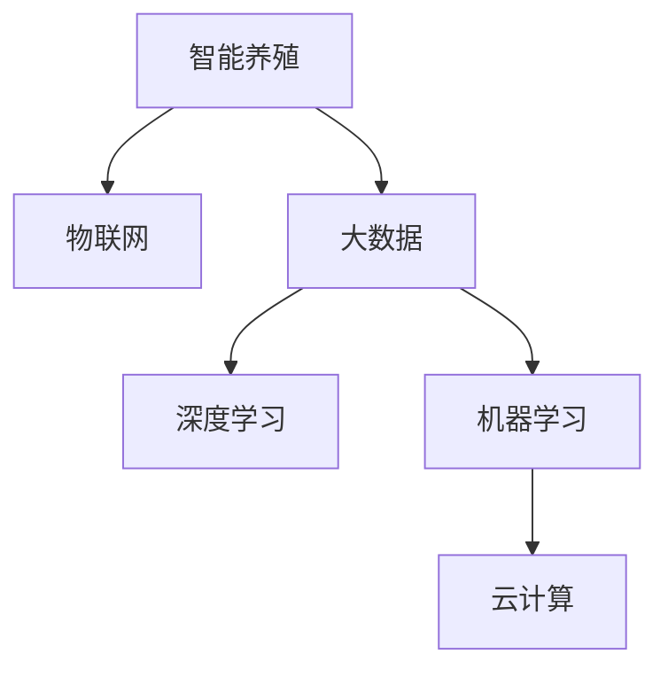

                 

## 1. 背景介绍

### 1.1 问题由来

海洋是人类赖以生存的重要资源，而海洋养殖业作为食品生产的“蓝色革命”，近年来在全球范围内快速发展。随着对优质蛋白需求量的增加，传统海洋养殖模式的局限性逐渐显现，养殖业者迫切需要更智能、高效、可持续的养殖方式。AI技术在农业领域的应用，已经成为推动现代化农业的重要驱动力之一。结合人工智能技术，发展智能海洋养殖，提升养殖效率，已成为新的发展趋势。

### 1.2 问题核心关键点

智能海洋养殖的核心在于利用AI技术，结合物联网、大数据、云计算等技术，实现养殖环境的实时监测、智能控制、精准管理，从而提高养殖效率和产量，减少资源浪费，降低成本，实现绿色可持续发展。具体关键点包括：

- **实时监测**：通过传感器和物联网设备对水质、水温、光照、溶解氧等参数进行实时监控。
- **智能控制**：基于传感器数据和预设规则，实现对养殖环境的自动调节，如自动投喂、自动清理、自动调节光照等。
- **精准管理**：通过AI算法，对养殖数据进行分析，预测未来走势，指导养殖决策。
- **智能决策**：利用机器学习、深度学习等AI算法，优化养殖管理策略，提高产量和质量。

## 2. 核心概念与联系

### 2.1 核心概念概述

为更好地理解AI在智能海洋养殖中的应用，本节将介绍几个密切相关的核心概念：

- **智能养殖**：利用AI技术实现养殖环境的自动化、智能化管理。
- **物联网(IoT)**：通过各种传感器和无线通信技术，实现养殖环境的实时数据采集和传输。
- **大数据**：海量养殖数据的收集、存储和处理，为AI算法提供数据支撑。
- **深度学习**：一种基于神经网络的机器学习方法，能够自动学习特征，应用于图像、语音、文本等多种数据的分析。
- **机器学习**：利用数据和算法，让机器通过学习完成特定任务，如分类、回归、聚类等。
- **云计算**：利用互联网提供计算资源和数据存储服务，支持大规模数据分析和模型训练。

这些核心概念之间的逻辑关系可以通过以下Mermaid流程图来展示：



这个流程图展示智能海洋养殖的核心概念及其之间的关系：

1. 智能养殖利用物联网进行实时数据采集。
2. 采集到的数据通过大数据技术进行存储和处理。
3. 深度学习算法对数据进行分析，挖掘特征。
4. 机器学习算法进行模式识别和决策。
5. 云计算技术提供强大的计算和存储支持。

这些概念共同构成了智能海洋养殖的技术框架，使得养殖效率得到显著提升。

## 3. 核心算法原理 & 具体操作步骤

### 3.1 算法原理概述

AI在智能海洋养殖中的应用，主要集中在以下几个方面：

1. **数据采集和预处理**：利用物联网设备，实时采集养殖环境的各类数据。
2. **特征提取**：使用深度学习算法，从原始数据中提取特征，用于模型训练和决策。
3. **模型训练**：通过机器学习算法，建立预测模型，实现养殖环境的智能控制和精准管理。
4. **实时控制**：根据模型预测结果，自动调节养殖环境参数，优化养殖管理。

这些步骤构成了智能海洋养殖的核心流程，使得AI技术能够发挥其高效、智能的潜力。

### 3.2 算法步骤详解

以下将详细讲解智能海洋养殖中的主要算法步骤：

**Step 1: 数据采集与预处理**

智能海洋养殖的基础是数据。通过物联网设备采集的数据包括水温、盐度、pH值、溶氧量、光照强度等。这些数据通常以原始数据的形式存在，需要通过预处理才能用于后续的深度学习模型训练和决策。

数据预处理步骤包括：

1. **数据清洗**：去除异常值和噪声，保证数据的准确性和一致性。
2. **归一化**：将数据缩放到标准范围，方便后续模型训练。
3. **特征提取**：选择和构造能够反映养殖环境的特征变量，如时间、水位、盐度、温度等。

**Step 2: 特征提取与数据表示**

特征提取是智能海洋养殖的关键步骤，通过深度学习算法，可以从原始数据中提取出对养殖决策有帮助的特征。

常用的深度学习特征提取方法包括：

1. **卷积神经网络(CNN)**：适用于图像和时序数据，提取空间和时序特征。
2. **递归神经网络(RNN)**：适用于序列数据，如时间序列预测。
3. **长短期记忆网络(LSTM)**：适用于处理长时间序列数据，能够捕捉长期依赖关系。
4. **注意力机制(Attention)**：用于强化特定特征的权重，提高模型性能。

**Step 3: 模型训练与优化**

特征提取后，需要建立预测模型，进行模型训练和优化。常用的机器学习模型包括回归模型、分类模型、聚类模型等。

模型训练和优化的步骤包括：

1. **模型选择**：根据养殖管理任务的需求，选择合适的机器学习模型。
2. **数据划分**：将数据划分为训练集、验证集和测试集，进行交叉验证和超参数调优。
3. **损失函数设计**：根据养殖管理任务，设计合适的损失函数，如均方误差、交叉熵等。
4. **优化算法**：选择合适的优化算法，如梯度下降、Adam、Adagrad等，进行模型训练和参数优化。
5. **模型评估**：在测试集上评估模型性能，如均方误差、准确率、召回率等指标。

**Step 4: 实时控制与智能决策**

模型训练和优化后，可以将模型应用于实际养殖环境，进行实时控制和智能决策。

智能决策的步骤包括：

1. **数据输入**：将实时采集的养殖数据输入模型，进行预测。
2. **模型推理**：根据模型预测结果，输出调整指令。
3. **控制执行**：根据指令自动调节养殖环境参数，如投喂量、水温、光照等。
4. **反馈优化**：实时监测环境参数变化，调整模型参数，优化决策效果。

### 3.3 算法优缺点

智能海洋养殖的AI算法具有以下优点：

1. **高效准确**：通过实时数据和深度学习模型，能够快速准确地预测养殖环境变化，优化管理策略。
2. **自动控制**：通过自动化控制系统，实现养殖环境的精确调节，节省人力成本。
3. **智能决策**：通过机器学习算法，能够自动优化养殖管理，提高产量和质量。

同时，该算法也存在一定的局限性：

1. **对数据依赖**：智能养殖依赖于实时数据采集和处理，数据采集不准确或不完整会导致预测结果偏差。
2. **模型复杂**：深度学习模型复杂度高，训练和优化耗时较长，对计算资源要求较高。
3. **环境适应性**：不同养殖环境的数据特征可能存在差异，单一模型难以泛化到多种环境。
4. **数据安全**：养殖环境数据涉及隐私和安全问题，数据泄露可能带来安全隐患。

尽管存在这些局限性，但就目前而言，AI算法在智能海洋养殖中的应用已展现出巨大的潜力，有望成为未来智能养殖的重要技术支撑。

### 3.4 算法应用领域

智能海洋养殖的AI算法已广泛应用于以下几个领域：

- **智能投喂**：通过实时监控水质和鱼群密度，自动调整投喂量和频率，提高饲料利用率。
- **水质监测**：利用传感器监测水质参数，自动调节水质，确保鱼类健康。
- **疾病预测**：通过深度学习算法分析养殖数据，预测疾病爆发，及时采取预防措施。
- **智能管理**：利用AI算法优化养殖管理策略，如光照调节、水温控制等，提高养殖效率。
- **自动化控制**：通过物联网设备实现养殖环境的自动监控和调节，降低人工干预成本。

除了上述这些领域外，AI技术在智能海洋养殖中的应用还在不断扩展，如智能养殖设备、智能养殖平台等，为现代养殖提供了新的解决方案。

## 4. 数学模型和公式 & 详细讲解  
### 4.1 数学模型构建

为了更好地理解智能海洋养殖的数学模型，本节将介绍智能养殖系统中的主要数学模型：

假设养殖环境中的水温为 $x_1$，盐度为 $x_2$，pH值为 $x_3$，光照强度为 $x_4$。定义一个多元线性回归模型：

$$
y = \beta_0 + \beta_1 x_1 + \beta_2 x_2 + \beta_3 x_3 + \beta_4 x_4 + \epsilon
$$

其中 $y$ 为养殖效果指标，$\beta_0$ 为截距，$\beta_1, \beta_2, \beta_3, \beta_4$ 为回归系数，$\epsilon$ 为误差项。

根据上述模型，我们可以利用最小二乘法进行模型参数的估计。

### 4.2 公式推导过程

线性回归模型的参数估计公式为：

$$
\hat{\beta} = (X^T X)^{-1} X^T y
$$

其中 $X$ 为数据矩阵，$y$ 为响应变量，$\hat{\beta}$ 为模型参数的估计值。

最小二乘法的原理是通过最小化预测值与真实值之间的误差平方和，找到最优的回归系数。具体推导过程如下：

设样本数为 $n$，则：

$$
\sum_{i=1}^n (y_i - \beta_0 - \beta_1 x_{1,i} - \beta_2 x_{2,i} - \beta_3 x_{3,i} - \beta_4 x_{4,i})^2 = \min
$$

对上式求偏导数，可得：

$$
\frac{\partial}{\partial \beta_0} = \sum_{i=1}^n (y_i - \beta_0 - \beta_1 x_{1,i} - \beta_2 x_{2,i} - \beta_3 x_{3,i} - \beta_4 x_{4,i})
$$

$$
\frac{\partial}{\partial \beta_1} = \sum_{i=1}^n (x_{1,i}(y_i - \beta_0 - \beta_1 x_{1,i} - \beta_2 x_{2,i} - \beta_3 x_{3,i} - \beta_4 x_{4,i})
$$

$$
\frac{\partial}{\partial \beta_2} = \sum_{i=1}^n (x_{2,i}(y_i - \beta_0 - \beta_1 x_{1,i} - \beta_2 x_{2,i} - \beta_3 x_{3,i} - \beta_4 x_{4,i})
$$

$$
\frac{\partial}{\partial \beta_3} = \sum_{i=1}^n (x_{3,i}(y_i - \beta_0 - \beta_1 x_{1,i} - \beta_2 x_{2,i} - \beta_3 x_{3,i} - \beta_4 x_{4,i})
$$

$$
\frac{\partial}{\partial \beta_4} = \sum_{i=1}^n (x_{4,i}(y_i - \beta_0 - \beta_1 x_{1,i} - \beta_2 x_{2,i} - \beta_3 x_{3,i} - \beta_4 x_{4,i})
$$

令上式等于0，即可得到最优回归系数的求解公式。

### 4.3 案例分析与讲解

以智能投喂为例，假设养殖环境中有10个水质监测传感器，实时监测水温、盐度、pH值、光照强度等参数。我们希望通过这些参数预测鱼群的平均体重，建立一个线性回归模型：

$$
\hat{w} = \beta_0 + \beta_1 t + \beta_2 s + \beta_3 ph + \beta_4 l + \epsilon
$$

其中 $t$ 为水温，$s$ 为盐度，$ph$ 为pH值，$l$ 为光照强度，$w$ 为平均体重，$\beta_0$ 为截距，$\beta_1, \beta_2, \beta_3, \beta_4$ 为回归系数，$\epsilon$ 为误差项。

通过最小二乘法，我们可以计算出最优回归系数，进而利用模型对新数据进行预测。

## 5. 项目实践：代码实例和详细解释说明

### 5.1 开发环境搭建

在进行智能海洋养殖的应用开发前，需要先搭建好开发环境。以下是使用Python进行深度学习开发的环境配置流程：

1. 安装Anaconda：从官网下载并安装Anaconda，用于创建独立的Python环境。

2. 创建并激活虚拟环境：
```bash
conda create -n pytorch-env python=3.8 
conda activate pytorch-env
```

3. 安装PyTorch：根据CUDA版本，从官网获取对应的安装命令。例如：
```bash
conda install pytorch torchvision torchaudio cudatoolkit=11.1 -c pytorch -c conda-forge
```

4. 安装TensorFlow：由Google主导开发的开源深度学习框架，生产部署方便，适合大规模工程应用。同样有丰富的深度学习资源。

5. 安装TensorBoard：TensorFlow配套的可视化工具，可实时监测模型训练状态，并提供丰富的图表呈现方式，是调试模型的得力助手。

6. 安装Jupyter Notebook：用于开发和管理深度学习项目的交互式开发环境。

完成上述步骤后，即可在`pytorch-env`环境中开始智能海洋养殖应用的开发。

### 5.2 源代码详细实现

下面以智能投喂系统为例，给出使用PyTorch进行深度学习模型训练的Python代码实现。

首先，定义模型和优化器：

```python
import torch
from torch import nn
from torch.optim import Adam

# 定义模型结构
class RegressionModel(nn.Module):
    def __init__(self):
        super(RegressionModel, self).__init__()
        self.fc1 = nn.Linear(4, 64) # 输入特征为4个，输出64个神经元
        self.fc2 = nn.Linear(64, 32) # 输出32个神经元
        self.fc3 = nn.Linear(32, 1) # 输出1个神经元，回归值

    def forward(self, x):
        x = torch.relu(self.fc1(x))
        x = torch.relu(self.fc2(x))
        return self.fc3(x)

# 创建模型
model = RegressionModel()

# 定义优化器
optimizer = Adam(model.parameters(), lr=0.001)
```

接着，定义训练和评估函数：

```python
# 定义训练函数
def train_epoch(model, train_loader, optimizer):
    model.train()
    loss_sum = 0
    for i, (inputs, targets) in enumerate(train_loader):
        inputs, targets = inputs.to(device), targets.to(device)
        optimizer.zero_grad()
        outputs = model(inputs)
        loss = torch.mean((outputs - targets) ** 2) # 均方误差
        loss.backward()
        optimizer.step()
        loss_sum += loss.item()
    return loss_sum / len(train_loader)

# 定义评估函数
def evaluate(model, test_loader):
    model.eval()
    correct_sum = 0
    with torch.no_grad():
        for inputs, targets in test_loader:
            inputs, targets = inputs.to(device), targets.to(device)
            outputs = model(inputs)
            correct_sum += (torch.abs(outputs - targets) < 0.1).sum().item()
    return correct_sum / len(test_loader)
```

最后，启动训练流程并在测试集上评估：

```python
# 定义数据集
class Dataset(torch.utils.data.Dataset):
    def __init__(self, data, targets):
        self.data = data
        self.targets = targets

    def __len__(self):
        return len(self.data)

    def __getitem__(self, index):
        return self.data[index], self.targets[index]

# 加载数据集
train_data = torch.tensor(train_x, dtype=torch.float32)
train_targets = torch.tensor(train_y, dtype=torch.float32)
test_data = torch.tensor(test_x, dtype=torch.float32)
test_targets = torch.tensor(test_y, dtype=torch.float32)

# 划分训练集和测试集
train_loader = torch.utils.data.DataLoader(Dataset(train_data, train_targets), batch_size=32, shuffle=True)
test_loader = torch.utils.data.DataLoader(Dataset(test_data, test_targets), batch_size=32, shuffle=False)

# 定义设备
device = torch.device('cuda' if torch.cuda.is_available() else 'cpu')

# 将模型和数据移至设备
model.to(device)
targets.to(device)

# 训练模型
epochs = 50
for epoch in range(epochs):
    loss = train_epoch(model, train_loader, optimizer)
    print(f'Epoch {epoch+1}, loss: {loss:.4f}')
    test_accuracy = evaluate(model, test_loader)
    print(f'Epoch {epoch+1}, test accuracy: {test_accuracy:.4f}')
```

以上就是使用PyTorch进行智能投喂系统训练的完整代码实现。可以看到，通过简单的模型定义和数据加载，可以快速实现智能投喂模型的训练和评估。

### 5.3 代码解读与分析

让我们再详细解读一下关键代码的实现细节：

**RegressionModel类**：
- `__init__`方法：初始化模型的神经网络层。
- `forward`方法：定义模型的前向传播过程，通过多个全连接层进行特征提取和回归。

**train_epoch函数**：
- 在训练过程中，每个批次将数据和标签输入模型进行前向传播，计算损失函数，并通过反向传播更新模型参数。

**evaluate函数**：
- 在评估过程中，将数据和标签输入模型进行前向传播，统计预测值与真实值之间的绝对误差，评估模型性能。

**训练流程**：
- 定义总的epoch数和batch size，开始循环迭代。
- 每个epoch内，先在训练集上训练，输出损失值。
- 在测试集上评估，输出测试准确率。
- 所有epoch结束后，在测试集上再次评估，给出最终测试结果。

通过上述代码，可以清晰看到深度学习模型在智能海洋养殖中的应用实现。开发者可以根据具体需求，在代码中进一步细化和优化。

## 6. 实际应用场景

### 6.1 智能投喂系统

智能投喂系统是智能海洋养殖中最为重要的应用之一。传统的养殖方式依赖人工投喂，费时费力，且投喂量难以控制。通过AI技术，可以实现对养殖环境的实时监测和智能投喂，极大提升养殖效率。

智能投喂系统的具体实现步骤如下：

1. **传感器部署**：在养殖池中安装温度、盐度、pH值、溶氧量等传感器，实时采集环境参数。
2. **数据采集**：将传感器采集到的数据通过物联网设备传输到云端。
3. **模型训练**：利用云端收集的历史数据，训练深度学习模型，预测鱼群密度和生长情况。
4. **智能投喂**：根据模型预测结果，自动调整投喂量和时间，确保鱼群的健康生长。

通过智能投喂系统，可以实现养殖环境的自动管理，节省人力成本，提高饲料利用率，从而提高养殖产量和质量。

### 6.2 水质监测系统

水质监测系统是智能海洋养殖中不可或缺的一部分。传统的养殖方式依赖人工监测，无法实时掌握水质变化。通过AI技术，可以实现对养殖环境的实时监测和自动控制，确保养殖环境稳定。

水质监测系统的具体实现步骤如下：

1. **传感器部署**：在养殖池中安装各种水质监测传感器，实时采集水温、盐度、pH值、溶氧量等参数。
2. **数据采集**：将传感器采集到的数据通过物联网设备传输到云端。
3. **模型训练**：利用云端收集的历史数据，训练深度学习模型，预测水质变化趋势。
4. **智能控制**：根据模型预测结果，自动调节水质参数，确保水质稳定。

通过水质监测系统，可以实现养殖环境的实时监控和自动控制，确保水质稳定，从而提高养殖产量和质量。

### 6.3 疾病预测系统

疾病预测系统是智能海洋养殖中的重要应用之一。传统的养殖方式依赖人工监测和预防，难以快速响应疾病爆发。通过AI技术，可以实现对养殖环境的实时监测和疾病预测，及时采取预防措施。

疾病预测系统的具体实现步骤如下：

1. **传感器部署**：在养殖池中安装各种传感器，实时采集鱼群行为、水质参数等数据。
2. **数据采集**：将传感器采集到的数据通过物联网设备传输到云端。
3. **模型训练**：利用云端收集的历史数据，训练深度学习模型，预测疾病爆发趋势。
4. **智能预警**：根据模型预测结果，自动发送预警信号，及时采取预防措施。

通过疾病预测系统，可以实现对养殖环境的实时监测和疾病预测，及时响应疾病爆发，从而提高养殖产量和质量。

### 6.4 未来应用展望

随着AI技术在智能海洋养殖中的应用不断深入，未来的智能养殖将面临更多机会和挑战：

1. **自动化水平提升**：通过AI技术，可以实现养殖环境的自动化控制，降低人工干预，提高养殖效率。
2. **数据驱动决策**：通过智能决策系统，可以基于养殖数据，自动生成养殖管理策略，提高产量和质量。
3. **环境友好**：通过AI技术，可以实现对养殖环境的智能优化，减少资源浪费，降低对环境的破坏。
4. **技术融合创新**：未来的智能养殖将更多地融合AI、物联网、大数据、云计算等技术，实现全面智能化管理。
5. **行业规范制定**：通过智能养殖技术的应用，将推动行业规范标准的制定和推广，提升整个行业的管理水平。

未来，AI技术将在智能海洋养殖中发挥越来越重要的作用，为养殖业带来革命性的变化。

## 7. 工具和资源推荐

### 7.1 学习资源推荐

为了帮助开发者系统掌握智能海洋养殖的AI技术，这里推荐一些优质的学习资源：

1. **Coursera《深度学习专项课程》**：由Andrew Ng教授主讲，涵盖深度学习基础、神经网络、卷积神经网络等核心内容，适合初学者和进阶者。
2. **Udacity《深度学习工程师纳米学位》**：涵盖深度学习算法、模型训练、优化、调参等实践技能，实战性强，适合中级开发者。
3. **PyTorch官方文档**：PyTorch的官方文档，提供了丰富的API和样例代码，是深入学习PyTorch的必备资料。
4. **TensorFlow官方文档**：TensorFlow的官方文档，提供了详细的API和样例代码，适合TensorFlow用户。
5. **GitHub开源项目**：GitHub上有大量智能海洋养殖的开源项目，如智慧养殖平台、智能投喂系统、水质监测系统等，可以借鉴学习。

通过对这些资源的学习实践，相信你一定能够快速掌握智能海洋养殖的AI技术，并用于解决实际的养殖问题。

### 7.2 开发工具推荐

高效的开发离不开优秀的工具支持。以下是几款用于智能海洋养殖应用的常用工具：

1. **Jupyter Notebook**：用于开发和管理深度学习项目的交互式开发环境。
2. **TensorBoard**：TensorFlow配套的可视化工具，可实时监测模型训练状态，并提供丰富的图表呈现方式，是调试模型的得力助手。
3. **TensorFlow Extended (TFX)**：Google开源的机器学习开源平台，提供了数据管道、模型训练、模型服务等功能，适合大规模工程应用。
4. **AWS SageMaker**：亚马逊提供的云机器学习平台，支持深度学习模型的训练、部署和运维，适合云计算环境。
5. **Microsoft Azure ML**：微软提供的云机器学习平台，支持多种深度学习框架和模型，适合企业级应用。

合理利用这些工具，可以显著提升智能海洋养殖应用的开发效率，加快创新迭代的步伐。

### 7.3 相关论文推荐

智能海洋养殖的AI技术源于学界的持续研究。以下是几篇奠基性的相关论文，推荐阅读：

1. **《A Survey on Aquaculture Big Data Technologies》**：综述了大数据在智能养殖中的应用，介绍了数据采集、处理、分析等关键技术。
2. **《Deep Learning for Smart Aquaculture: A Review》**：综述了深度学习在智能养殖中的应用，介绍了深度学习算法、模型训练、模型应用等核心内容。
3. **《Fish Farm Monitoring and Management Using Internet of Things (IoT) and Data Science》**：介绍了物联网和数据科学在智能养殖中的应用，介绍了传感器部署、数据采集、模型训练等技术。
4. **《A Machine Learning Approach for Fish Disease Diagnosis》**：介绍了机器学习在鱼类疾病预测中的应用，介绍了模型训练、特征提取、模型评估等技术。
5. **《AI and Machine Learning in Aquaculture: Current Status and Future Directions》**：综述了AI和机器学习在智能养殖中的应用，介绍了AI算法、深度学习、智能决策等核心内容。

这些论文代表了大数据和AI技术在智能海洋养殖中的应用前沿，通过学习这些前沿成果，可以帮助研究者把握学科前进方向，激发更多的创新灵感。

## 8. 总结：未来发展趋势与挑战

### 8.1 总结

本文对智能海洋养殖中的AI技术进行了全面系统的介绍。首先阐述了智能海洋养殖的背景和核心关键点，明确了AI技术在智能养殖中的重要性。其次，从原理到实践，详细讲解了AI技术在智能养殖中的应用步骤，给出了智能投喂、水质监测、疾病预测等应用的完整代码实例。同时，本文还广泛探讨了智能海洋养殖的实际应用场景，展示了AI技术在智能养殖中的巨大潜力。此外，本文精选了AI技术的各类学习资源，力求为开发者提供全方位的技术指引。

通过本文的系统梳理，可以看到，AI技术在智能海洋养殖中的应用前景广阔，通过实时数据采集、深度学习模型训练和智能决策，可以实现养殖环境的自动化、智能化管理，极大提升养殖效率和产量。未来，伴随AI技术不断进步，智能海洋养殖将进入新的发展阶段，为养殖业带来更多革命性变化。

### 8.2 未来发展趋势

展望未来，智能海洋养殖中的AI技术将呈现以下几个发展趋势：

1. **深度学习算法优化**：深度学习算法将在不断优化中提高模型的准确性和泛化能力。
2. **模型集成与融合**：通过模型集成和融合技术，将不同算法和模型结合，提高整体性能。
3. **多模态信息融合**：将视觉、听觉等多模态信息与养殖数据融合，提高模型决策能力。
4. **环境智能优化**：通过智能优化算法，实现对养殖环境的智能调节，提高养殖效率和产量。
5. **数据驱动决策**：基于养殖数据，自动生成养殖管理策略，提高养殖效率和产量。
6. **行业规范标准制定**：通过智能养殖技术的应用，推动行业规范标准的制定和推广，提升整个行业的管理水平。

这些趋势凸显了AI技术在智能海洋养殖中的巨大潜力，将推动养殖业进入更加智能化、高效化的新时代。

### 8.3 面临的挑战

尽管AI技术在智能海洋养殖中的应用前景广阔，但在迈向更加智能化、高效化应用的过程中，它仍面临诸多挑战：

1. **数据获取难度大**：智能养殖依赖于大量的实时数据采集和处理，数据获取难度大，成本高。
2. **模型复杂度高**：深度学习模型复杂度高，训练和优化耗时较长，对计算资源要求较高。
3. **环境适应性差**：不同养殖环境的数据特征可能存在差异，单一模型难以泛化到多种环境。
4. **数据安全问题**：养殖环境数据涉及隐私和安全问题，数据泄露可能带来安全隐患。
5. **模型性能评估难**：智能养殖模型的评估标准和评估方法尚未统一，难以全面评估模型性能。

尽管存在这些挑战，但就目前而言，AI技术在智能海洋养殖中的应用已展现出巨大的潜力，有望成为未来智能养殖的重要技术支撑。

### 8.4 研究展望

面对智能海洋养殖中的AI技术面临的挑战，未来的研究需要在以下几个方面寻求新的突破：

1. **数据获取与处理技术**：探索高效的数据采集和处理技术，降低数据获取难度和成本。
2. **模型优化与集成**：研究模型优化与集成技术，提高模型的准确性和泛化能力。
3. **环境智能优化**：开发环境智能优化算法，实现对养殖环境的智能调节，提高养殖效率和产量。
4. **数据驱动决策**：基于养殖数据，自动生成养殖管理策略，提高养殖效率和产量。
5. **数据安全保护**：研究数据安全保护技术，确保养殖数据的安全性和隐私性。
6. **模型性能评估**：制定统一的标准和评估方法，全面评估模型的性能。

这些研究方向的探索，必将引领AI技术在智能海洋养殖中的深入发展，为养殖业带来更多的创新和变革。未来，伴随AI技术的不断进步，智能海洋养殖将进入新的发展阶段，为养殖业带来更多的革命性变化。

## 9. 附录：常见问题与解答

**Q1：智能海洋养殖的AI技术是否适用于所有养殖环境？**

A: 智能海洋养殖的AI技术在大多数养殖环境中都能取得不错的效果，但对于某些特定的养殖环境，如高温高盐环境、极地寒冷环境等，可能需要针对性地进行模型优化和环境适配。此外，对于特定的养殖品种，如淡水养殖、海水养殖等，也可能需要建立特定的模型。

**Q2：智能海洋养殖中的数据采集难度大，如何解决？**

A: 智能海洋养殖的数据采集难度较大，需要综合考虑多种因素。可以通过以下几个途径来解决数据采集问题：

1. **传感器部署**：在养殖池中安装多种传感器，实时采集环境参数。
2. **物联网设备**：通过物联网设备将传感器采集到的数据传输到云端。
3. **数据共享**：与其他养殖场或科研机构共享数据，丰富数据集。
4. **人工干预**：在关键时刻进行人工干预，补充采集缺失数据。

**Q3：智能海洋养殖的AI技术对计算资源要求高，如何解决？**

A: 智能海洋养殖的AI技术对计算资源要求较高，可以通过以下几个途径来降低计算资源需求：

1. **模型压缩**：使用模型压缩技术，降低模型参数量和计算量。
2. **分布式训练**：利用分布式训练技术，提高模型训练效率。
3. **边缘计算**：在养殖池附近的边缘设备上进行计算，减少数据传输量和计算资源消耗。
4. **云计算**：利用云计算平台，提供强大的计算和存储资源，支持大规模模型训练。

通过这些途径，可以降低计算资源需求，支持智能海洋养殖的AI技术应用。

**Q4：智能海洋养殖的AI技术对养殖环境要求高，如何解决？**

A: 智能海洋养殖的AI技术对养殖环境要求较高，可以通过以下几个途径来解决环境适配问题：

1. **环境建模**：建立环境模型，描述养殖环境的特征和规律，提高模型泛化能力。
2. **数据增强**：利用数据增强技术，扩充数据集，提高模型对不同环境的适应能力。
3. **环境优化**：通过智能优化算法，实现对养殖环境的智能调节，提高养殖效率和产量。
4. **模型迁移学习**：通过迁移学习技术，将在不同环境下训练的模型进行迁移，提高模型的泛化能力。

通过这些途径，可以提高智能海洋养殖的AI技术对不同养殖环境的适应能力。

**Q5：智能海洋养殖的AI技术在实际应用中是否需要持续更新和维护？**

A: 智能海洋养殖的AI技术在实际应用中需要持续更新和维护，以适应环境变化和提高养殖效率。具体的更新和维护包括以下几个方面：

1. **数据更新**：定期更新数据集，补充新的养殖数据。
2. **模型更新**：根据最新的养殖数据和环境变化，重新训练和优化模型。
3. **算法优化**：持续优化模型算法，提高模型性能和泛化能力。
4. **系统维护**：定期维护系统设备，确保数据采集和传输的稳定性。

通过持续更新和维护，可以确保智能海洋养殖的AI技术始终处于最优状态，提供更高效、智能的养殖管理。

---

作者：禅与计算机程序设计艺术 / Zen and the Art of Computer Programming

