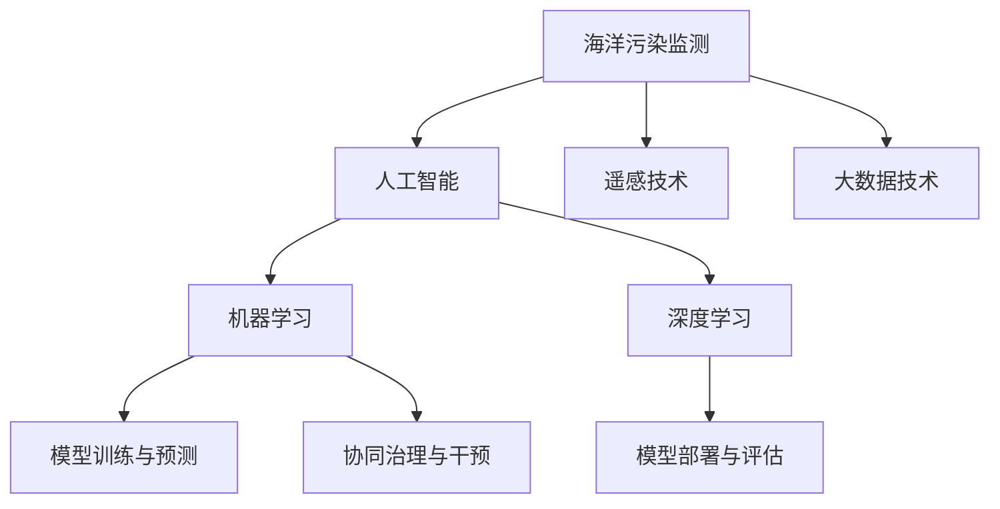

                 

# AI在海洋污染监测中的应用：保护生态环境

> 关键词：海洋污染监测,人工智能,机器学习,深度学习,大数据,遥感技术,海洋生态,可持续发展

## 1. 背景介绍

### 1.1 问题由来

随着工业化进程的加快，海洋污染问题日益严重，对海洋生态系统构成了巨大威胁。海洋污染不仅包括化学污染（如塑料微粒、石油泄漏）、生物污染（如海洋垃圾、入侵物种），还包括物理污染（如海水温度升高、酸化）等多方面。海洋污染监测与治理的迫切需求，推动了人工智能技术在海洋监测中的应用。

### 1.2 问题核心关键点

AI在海洋污染监测中的应用，主要聚焦于以下几个核心关键点：

- **数据采集与处理**：通过遥感技术、传感器网络等手段，获取海洋环境数据，并进行预处理，提取出有价值的信息。
- **模型训练与预测**：构建基于机器学习和深度学习的模型，对监测数据进行建模和预测，识别污染源和污染类型。
- **模型部署与评估**：将训练好的模型部署到实际应用场景中，进行实时监测和评估，确保模型效果和稳定运行。
- **协同治理与干预**：与政府、环保组织、渔民等协作，通过模型输出的信息，制定科学的治理措施，并适时干预。

这些关键点共同构成了AI在海洋污染监测中的全流程应用框架，为海洋生态保护提供了有力支持。

## 2. 核心概念与联系

### 2.1 核心概念概述

为了更好地理解AI在海洋污染监测中的应用，本节将介绍几个关键概念：

- **海洋污染监测**：通过传感器、遥感技术等手段，收集海洋环境数据，识别和量化污染情况。
- **人工智能**：以数据为输入，通过机器学习、深度学习等算法进行数据建模和预测的技术。
- **遥感技术**：通过搭载在卫星、无人机上的传感器，获取地表、水体等环境的监测数据。
- **大数据技术**：处理和分析大规模海洋环境数据，提供精准的污染监测和分析结果。
- **海洋生态**：包括海洋生物多样性、海洋生态系统平衡等方面，保护海洋生态是AI技术应用的最终目标。

这些核心概念之间的逻辑关系可以通过以下Mermaid流程图来展示：



这个流程图展示了大语言模型的核心概念及其之间的关系：

1. 海洋污染监测通过遥感和大数据技术获取数据。
2. 人工智能技术通过模型训练与预测，对数据进行处理和分析。
3. 深度学习是机器学习的一个分支，更适用于复杂的非线性问题，如识别污染源和预测趋势。
4. 模型训练与预测、模型部署与评估、协同治理与干预等环节，共同构成AI在海洋污染监测中的应用全流程。

## 3. 核心算法原理 & 具体操作步骤
### 3.1 算法原理概述

AI在海洋污染监测中的应用，主要基于机器学习和深度学习技术，通过构建模型对海洋环境数据进行预测和分类。核心算法原理如下：

1. **数据预处理**：对传感器采集到的原始数据进行清洗、去噪、归一化等预处理，提取出有效的海洋环境特征。
2. **特征提取**：通过卷积神经网络(CNN)、长短期记忆网络(LSTM)等模型，自动从数据中提取特征，为预测提供支持。
3. **模型训练**：利用标注数据集，通过反向传播算法优化模型参数，使其能够对新的数据进行准确预测。
4. **模型评估与部署**：通过测试集评估模型效果，并在实际监测系统中部署模型，进行实时预测。

### 3.2 算法步骤详解

以下是AI在海洋污染监测中的具体操作步骤：

**Step 1: 数据采集与处理**

- 选择合适的遥感设备和传感器，采集海洋环境数据，如海水温度、盐度、化学成分等。
- 数据预处理：清洗数据，去除异常值，进行归一化，生成特征向量。

**Step 2: 模型选择与设计**

- 根据具体任务，选择合适的模型，如卷积神经网络(CNN)、长短期记忆网络(LSTM)等。
- 设计模型的输入和输出结构，确定隐藏层数量、激活函数等超参数。

**Step 3: 数据分割与标注**

- 将数据集划分为训练集、验证集和测试集，确保数据分布一致。
- 对训练集进行标注，如标注污染源位置、污染类型等，生成有监督的学习样本。

**Step 4: 模型训练与优化**

- 使用训练集对模型进行训练，利用反向传播算法更新参数。
- 在验证集上评估模型效果，调整超参数，防止过拟合。
- 在测试集上评估最终模型效果，确保泛化能力。

**Step 5: 模型部署与评估**

- 将训练好的模型部署到实时监测系统中，进行数据输入和处理。
- 实时监测数据，利用模型进行预测，生成污染监测报告。
- 定期评估模型效果，更新训练数据，提高预测精度。

**Step 6: 协同治理与干预**

- 将模型输出的监测结果与政府、环保组织、渔民等利益相关者分享。
- 根据模型输出信息，制定科学的治理措施，如污染源排查、海洋区域保护等。
- 适时干预，减少污染对海洋生态的影响，确保海洋生态的可持续发展。

### 3.3 算法优缺点

AI在海洋污染监测中的应用，具有以下优点：

1. **实时性高**：通过部署实时监测系统，能够及时捕捉污染事件，迅速响应。
2. **数据量大**：遥感和大数据技术可以覆盖大面积海域，提供高分辨率的数据。
3. **精度高**：深度学习模型能够自动提取特征，提高预测准确度。
4. **成本低**：相比传统人工监测，AI模型可以在不增加人力成本的情况下，实现大规模监测。

同时，该方法也存在一定的局限性：

1. **数据质量依赖**：模型训练效果依赖于数据的准确性和完整性，低质量数据可能导致误判。
2. **模型复杂度高**：深度学习模型参数多，训练和推理时间较长，需要高性能计算资源。
3. **应用场景局限**：模型主要适用于已标注的污染源和类型，对未知污染源识别效果可能不足。
4. **维护复杂**：需要定期更新训练数据和调整模型参数，以适应海洋环境的变化。

尽管存在这些局限性，AI在海洋污染监测中的应用前景广阔，能够有效提升监测效率和预测精度。

### 3.4 算法应用领域

AI在海洋污染监测中的应用，已经在多个领域得到广泛应用：

- **海洋生态保护**：监测海洋生态系统变化，评估海洋生物多样性。
- **海洋污染预警**：预测污染源位置和传播路径，及时发布预警信息。
- **海洋资源管理**：监测海洋渔业资源，优化渔业管理。
- **海洋灾害防范**：监测海啸、海温变化等灾害，保障公共安全。
- **环境污染治理**：分析污染源分布，制定治理措施，减少污染排放。

除了上述这些经典应用外，AI在海洋污染监测中的应用还在不断拓展，如智能垃圾桶监测、海洋塑料垃圾追踪等，为海洋生态保护提供新的技术支持。

## 4. 数学模型和公式 & 详细讲解  
### 4.1 数学模型构建

本节将使用数学语言对AI在海洋污染监测中的应用进行更加严格的刻画。

记原始数据集为 $D=\{x_i\}_{i=1}^N$，其中 $x_i$ 表示第 $i$ 个监测点，包括海水温度、盐度、化学成分等。设 $y$ 为标签，表示污染类型或污染源位置。

定义模型的输入特征为 $x$，输出为 $y$，训练集为 $D=\{(x_i, y_i)\}_{i=1}^N$。模型的目标是最小化损失函数 $\mathcal{L}(\theta)$，其中 $\theta$ 为模型参数。

### 4.2 公式推导过程

以深度学习模型为例，假设使用卷积神经网络(CNN)进行特征提取和分类，其基本结构如图：

```
Input -> Conv -> Pool -> FC -> Output
```

其中，Conv 为卷积层，用于提取空间特征；Pool 为池化层，用于降低特征维度；FC 为全连接层，用于分类。

模型的损失函数可以定义为交叉熵损失函数：

$$
\mathcal{L}(\theta) = -\frac{1}{N}\sum_{i=1}^N \sum_{j=1}^C y_{ij}\log \hat{y}_{ij}
$$

其中 $C$ 为类别数，$y_{ij}$ 为第 $i$ 个样本的第 $j$ 个类别标签，$\hat{y}_{ij}$ 为模型的预测概率。

反向传播算法通过链式法则计算损失函数对模型参数的梯度：

$$
\frac{\partial \mathcal{L}(\theta)}{\partial \theta} = -\frac{1}{N}\sum_{i=1}^N \sum_{j=1}^C (\hat{y}_{ij}-y_{ij})\frac{\partial \hat{y}_{ij}}{\partial \theta}
$$

在得到梯度后，即可带入参数更新公式，完成模型的迭代优化：

$$
\theta \leftarrow \theta - \eta \nabla_{\theta}\mathcal{L}(\theta)
$$

其中 $\eta$ 为学习率，$\nabla_{\theta}\mathcal{L}(\theta)$ 为损失函数对参数 $\theta$ 的梯度。

### 4.3 案例分析与讲解

以海洋污染预警系统为例，假设利用深度学习模型预测某海域的污染类型，并设置阈值生成预警。

**Step 1: 数据预处理**

- 采集海洋环境数据，如海水温度、盐度、化学成分等。
- 清洗数据，去除异常值，进行归一化，生成特征向量。

**Step 2: 模型训练**

- 将数据集划分为训练集、验证集和测试集，标注污染类型。
- 选择CNN模型，设计输入输出结构，确定超参数。
- 使用训练集对模型进行训练，利用交叉熵损失函数进行优化。
- 在验证集上评估模型效果，调整超参数。

**Step 3: 模型部署**

- 将训练好的模型部署到实时监测系统中，进行数据输入和处理。
- 实时监测数据，利用模型进行预测，生成污染类型和污染预警。
- 定期更新训练数据和调整模型参数，以适应海洋环境的变化。

**Step 4: 协同治理**

- 将模型输出的监测结果与政府、环保组织、渔民等分享。
- 根据模型输出信息，制定科学的治理措施，如污染源排查、海洋区域保护等。
- 适时干预，减少污染对海洋生态的影响，确保海洋生态的可持续发展。

## 5. 项目实践：代码实例和详细解释说明
### 5.1 开发环境搭建

在进行AI在海洋污染监测中的应用实践前，我们需要准备好开发环境。以下是使用Python进行TensorFlow开发的环境配置流程：

1. 安装Anaconda：从官网下载并安装Anaconda，用于创建独立的Python环境。

2. 创建并激活虚拟环境：
```bash
conda create -n tf-env python=3.8 
conda activate tf-env
```

3. 安装TensorFlow：根据CUDA版本，从官网获取对应的安装命令。例如：
```bash
conda install tensorflow -c tf -c conda-forge
```

4. 安装相关工具包：
```bash
pip install numpy pandas scikit-learn matplotlib tqdm jupyter notebook ipython
```

完成上述步骤后，即可在`tf-env`环境中开始项目实践。

### 5.2 源代码详细实现

下面我们以海洋污染预警系统为例，给出使用TensorFlow进行模型训练和部署的代码实现。

首先，定义模型结构：

```python
import tensorflow as tf

model = tf.keras.Sequential([
    tf.keras.layers.Conv2D(32, (3, 3), activation='relu', input_shape=(64, 64, 3)),
    tf.keras.layers.MaxPooling2D((2, 2)),
    tf.keras.layers.Flatten(),
    tf.keras.layers.Dense(64, activation='relu'),
    tf.keras.layers.Dense(5, activation='softmax')
])
```

然后，定义损失函数和优化器：

```python
loss_fn = tf.keras.losses.CategoricalCrossentropy()
optimizer = tf.keras.optimizers.Adam(learning_rate=0.001)
```

接着，定义训练和评估函数：

```python
def train_epoch(model, dataset, batch_size, optimizer):
    model.compile(optimizer=optimizer, loss=loss_fn, metrics=['accuracy'])
    model.fit(dataset, batch_size=batch_size, epochs=10)
    
def evaluate(model, dataset, batch_size):
    model.evaluate(dataset, batch_size=batch_size)
```

最后，启动训练流程并在测试集上评估：

```python
train_data = ...
test_data = ...
train_epoch(model, train_data, batch_size=32, optimizer=optimizer)
evaluate(model, test_data, batch_size=32)
```

以上就是使用TensorFlow进行海洋污染预警系统模型训练和部署的完整代码实现。可以看到，TensorFlow提供了强大的API和工具，使得模型构建和训练变得简洁高效。

### 5.3 代码解读与分析

让我们再详细解读一下关键代码的实现细节：

**模型定义**：
- `tf.keras.Sequential`：定义模型为顺序层模型，依次添加卷积层、池化层、全连接层。
- `tf.keras.layers.Conv2D`：添加二维卷积层，提取空间特征。
- `tf.keras.layers.MaxPooling2D`：添加池化层，降低特征维度。
- `tf.keras.layers.Flatten`：将卷积层的输出展平，准备输入全连接层。
- `tf.keras.layers.Dense`：添加全连接层，进行分类。

**损失函数定义**：
- `tf.keras.losses.CategoricalCrossentropy`：定义交叉熵损失函数，适用于多分类问题。

**优化器定义**：
- `tf.keras.optimizers.Adam`：定义Adam优化器，调整模型参数。

**训练与评估函数**：
- `train_epoch`：定义模型训练过程，使用交叉熵损失函数和Adam优化器。
- `evaluate`：定义模型评估过程，输出模型的准确率。

**训练流程**：
- 定义训练数据 `train_data` 和测试数据 `test_data`。
- 调用 `train_epoch` 函数训练模型。
- 调用 `evaluate` 函数评估模型效果。

可以看到，TensorFlow提供了丰富的工具和函数，使得模型构建和训练变得简单高效。开发者可以快速上手实现复杂的AI模型，并应用于实际场景。

## 6. 实际应用场景
### 6.1 智能垃圾桶监测

智能垃圾桶监测系统通过AI技术对垃圾桶内部的垃圾进行分类，生成统计信息。系统主要包括以下几个步骤：

**Step 1: 数据采集**

- 安装摄像头和传感器，采集垃圾桶内部的图像和数据。
- 对数据进行清洗和预处理，提取有用的特征。

**Step 2: 模型训练**

- 选择适合的分类模型，如CNN或RNN，进行训练。
- 在标注数据集上训练模型，调整超参数。

**Step 3: 实时监测**

- 部署训练好的模型，实时监测垃圾桶内部的垃圾情况。
- 根据监测结果，生成垃圾分类统计信息。

**Step 4: 协同治理**

- 将监测结果与环卫部门共享，优化垃圾收集和处理策略。
- 定期更新训练数据和模型参数，提高垃圾分类准确率。

**应用场景分析**：
- 智能垃圾桶监测系统可广泛应用于公共卫生、垃圾分类等领域，提高垃圾处理的效率和准确率。
- 通过协同治理，能够有效减少垃圾分类错误，降低环境污染，促进垃圾回收利用。

### 6.2 海洋塑料垃圾追踪

海洋塑料垃圾追踪系统通过AI技术识别和追踪海洋中的塑料垃圾，生成分布图。系统主要包括以下几个步骤：

**Step 1: 数据采集**

- 通过卫星遥感技术采集海洋表面数据，识别塑料垃圾位置。
- 结合历史数据和地理信息，生成塑料垃圾分布图。

**Step 2: 模型训练**

- 选择适合的检测模型，如YOLO或Faster R-CNN，进行训练。
- 在标注数据集上训练模型，调整超参数。

**Step 3: 实时监测**

- 部署训练好的模型，实时监测海洋表面的塑料垃圾。
- 生成塑料垃圾分布图，可视化垃圾分布情况。

**Step 4: 协同治理**

- 将监测结果与政府、环保组织等共享，制定垃圾清理计划。
- 定期更新训练数据和模型参数，提高垃圾追踪准确率。

**应用场景分析**：
- 海洋塑料垃圾追踪系统可广泛应用于海洋环保、海洋生态保护等领域，提高塑料垃圾清理效率。
- 通过协同治理，能够有效减少塑料垃圾对海洋生态系统的破坏，保护海洋生物多样性。

### 6.3 未来应用展望

随着AI技术的不断进步，海洋污染监测的应用场景将进一步拓展，推动海洋生态保护的发展。

**智能海洋监测平台**：
- 结合卫星、无人机等多种遥感技术，构建智能海洋监测平台。
- 实时监测海洋环境数据，预警海洋污染事件。

**智慧海洋生态保护**：
- 利用AI技术分析海洋生态系统数据，评估生态系统健康状况。
- 制定科学的生态保护措施，推动海洋可持续发展。

**海洋灾害预测系统**：
- 利用深度学习模型预测海啸、海温变化等灾害。
- 及时发布预警信息，保障公共安全。

## 7. 工具和资源推荐
### 7.1 学习资源推荐

为了帮助开发者系统掌握AI在海洋污染监测中的应用，这里推荐一些优质的学习资源：

1. TensorFlow官方文档：官方文档提供了完整的TensorFlow学习路径和示例代码，涵盖从基础到高级的各种模型。

2. Coursera《深度学习与神经网络》课程：由斯坦福大学Andrew Ng教授授课，讲解深度学习的基本原理和实际应用。

3. PyTorch官方文档：官方文档提供了丰富的PyTorch学习资源和示例代码，适用于构建各种深度学习模型。

4. Kaggle海洋数据集：Kaggle提供了多种海洋环境数据集，适合进行模型训练和评估。

5. GitHub开源项目：GitHub上众多AI在海洋污染监测的项目，可以借鉴和学习实际应用中的经验和做法。

通过对这些资源的学习实践，相信你一定能够快速掌握AI在海洋污染监测中的应用技巧，并用于解决实际的海洋环境问题。

### 7.2 开发工具推荐

高效的开发离不开优秀的工具支持。以下是几款用于AI在海洋污染监测开发的工具：

1. TensorFlow：由Google主导开发的开源深度学习框架，生产部署方便，适合大规模工程应用。

2. PyTorch：基于Python的开源深度学习框架，灵活动态的计算图，适合快速迭代研究。

3. Jupyter Notebook：免费的交互式笔记本环境，支持多语言代码执行，方便进行数据探索和模型调试。

4. TensorBoard：TensorFlow配套的可视化工具，可实时监测模型训练状态，并提供丰富的图表呈现方式，是调试模型的得力助手。

5. Weights & Biases：模型训练的实验跟踪工具，可以记录和可视化模型训练过程中的各项指标，方便对比和调优。

合理利用这些工具，可以显著提升AI在海洋污染监测中的开发效率，加快创新迭代的步伐。

### 7.3 相关论文推荐

AI在海洋污染监测的应用研究源于学界的持续探索。以下是几篇奠基性的相关论文，推荐阅读：

1. CNN用于海洋垃圾检测：论文提出使用卷积神经网络(CNN)对海洋垃圾进行检测，在测试集上取得了较高的准确率。

2. RNN用于海洋生态系统分析：论文提出使用长短期记忆网络(RNN)分析海洋生态系统数据，评估生态系统健康状况。

3. 基于LSTM的海洋灾害预警系统：论文提出使用LSTM模型预测海啸、海温变化等灾害，提高了预警系统的准确率。

4. AI用于海洋垃圾清理：论文提出利用AI技术识别和追踪海洋垃圾，优化垃圾清理策略，提高了垃圾清理效率。

5. 深度学习在海洋污染监测中的应用：综述论文总结了深度学习在海洋污染监测中的各类应用，指出了未来的研究方向。

这些论文代表了大语言模型微调技术的发展脉络。通过学习这些前沿成果，可以帮助研究者把握学科前进方向，激发更多的创新灵感。

## 8. 总结：未来发展趋势与挑战
### 8.1 研究成果总结

AI在海洋污染监测中的应用，已经在多个领域得到广泛应用，显著提升了海洋环境监测和治理的效率和准确率。主要成果包括：

1. 智能垃圾桶监测系统：通过AI技术对垃圾桶内部的垃圾进行分类，生成统计信息，提高了垃圾处理效率。
2. 海洋塑料垃圾追踪系统：利用AI技术识别和追踪海洋中的塑料垃圾，生成分布图，减少了塑料垃圾对海洋生态系统的破坏。
3. 海洋灾害预警系统：通过深度学习模型预测海啸、海温变化等灾害，提高了预警系统的准确率，保障了公共安全。

这些应用成果，展示了AI在海洋污染监测中的强大潜力和广阔前景。

### 8.2 未来发展趋势

展望未来，AI在海洋污染监测中的应用将呈现以下几个发展趋势：

1. **多模态数据融合**：结合遥感、传感器、地理信息等多种数据源，提高监测的全面性和准确性。
2. **实时性增强**：通过边缘计算、5G网络等技术，实现实时监测和快速响应。
3. **模型自适应**：利用迁移学习、元学习等技术，使模型能够自动适应不同的海洋环境。
4. **智能化治理**：结合智能算法和大数据技术，制定科学的治理措施，优化海洋环境管理。
5. **协同治理**：与政府、环保组织、渔民等利益相关者协同治理，形成多方合作的机制。

这些趋势将进一步提升AI在海洋污染监测中的应用效果，推动海洋生态保护的发展。

### 8.3 面临的挑战

尽管AI在海洋污染监测中的应用前景广阔，但在迈向更加智能化、普适化应用的过程中，它仍面临诸多挑战：

1. **数据质量问题**：海洋环境数据来源多样，数据质量参差不齐，影响模型训练效果。
2. **模型复杂性**：深度学习模型参数多，训练和推理时间较长，需要高性能计算资源。
3. **应用场景局限**：部分海洋环境数据采集和处理成本较高，难以广泛应用。
4. **技术标准化**：缺乏统一的监测标准和数据规范，影响不同系统间的协同工作。
5. **伦理和隐私问题**：海洋数据涉及敏感信息，需保护数据隐私和用户隐私。

尽管存在这些挑战，但随着技术的不断进步和应用的推广，AI在海洋污染监测中的问题将逐步得到解决，为海洋生态保护提供更强有力的技术支撑。

### 8.4 研究展望

面对AI在海洋污染监测中所面临的挑战，未来的研究需要在以下几个方面寻求新的突破：

1. **数据治理和标准化**：制定统一的海洋环境监测标准和数据规范，提高数据质量。
2. **高效模型算法**：开发更高效、更轻量级的模型算法，降低计算资源消耗，提高实时性。
3. **跨模态融合技术**：研究多模态数据融合技术，提升模型的全面性和准确性。
4. **隐私保护技术**：研究数据隐私保护技术，保障数据和用户隐私。
5. **协同治理机制**：研究多方协同治理机制，形成多方合作的生态系统。

这些研究方向的探索，必将引领AI在海洋污染监测中的应用迈向更高的台阶，为海洋生态保护提供更加科学、高效的技术手段。

## 9. 附录：常见问题与解答

**Q1：AI在海洋污染监测中的数据质量问题如何解决？**

A: 数据质量问题是AI在海洋污染监测中面临的主要挑战之一。为解决这一问题，可以采取以下措施：

1. **数据预处理**：对采集到的数据进行清洗、去噪、归一化等预处理，去除异常值和噪声，提高数据质量。
2. **数据融合**：结合多种数据源，如卫星遥感、传感器、地理信息等，综合利用多种数据信息，提高监测的全面性和准确性。
3. **数据标注**：对采集到的数据进行标注，生成有监督学习样本，提高模型的泛化能力和准确率。
4. **模型评估**：在模型训练和部署过程中，不断评估模型效果，及时调整超参数和模型结构，优化数据使用策略。

通过以上措施，可以显著提升AI在海洋污染监测中的数据质量，提高模型效果和应用可靠性。

**Q2：AI在海洋污染监测中的模型复杂性问题如何解决？**

A: 模型复杂性是AI在海洋污染监测中面临的另一大挑战。为解决这一问题，可以采取以下措施：

1. **模型压缩**：采用模型压缩技术，如量化、剪枝等，降低模型参数和计算资源消耗，提高实时性。
2. **分布式训练**：利用分布式计算框架，如TensorFlow分布式训练、Horovod等，将模型训练任务分布到多个计算节点，提高训练效率。
3. **模型并行**：利用模型并行技术，如模型并行、数据并行等，提高模型训练和推理的效率和性能。
4. **轻量级模型**：开发轻量级模型算法，如MobileNet、ShuffleNet等，降低计算资源消耗，提高实时性。

通过以上措施，可以显著降低AI在海洋污染监测中的模型复杂性，提升实时性和应用性能。

**Q3：AI在海洋污染监测中的应用场景有哪些局限性？**

A: AI在海洋污染监测中的应用场景，主要面临以下几个局限性：

1. **数据采集成本高**：部分海洋环境数据采集和处理成本较高，难以广泛应用。
2. **数据标注困难**：部分海洋环境数据难以标注，影响模型训练效果。
3. **模型泛化能力不足**：模型主要适用于已标注的污染源和类型，对未知污染源识别效果可能不足。
4. **模型应用复杂**：模型部署和维护需要高性能计算资源，操作复杂。

尽管存在这些局限性，但通过优化数据采集和处理、改进模型算法和优化应用方式，可以有效克服这些挑战，拓展AI在海洋污染监测中的应用场景。

**Q4：AI在海洋污染监测中如何实现多模态融合？**

A: 多模态融合是AI在海洋污染监测中的重要研究方向，主要通过以下方法实现：

1. **数据融合**：将不同模态的数据融合在一起，如遥感数据、传感器数据、地理信息等，生成综合数据集。
2. **特征提取**：通过多模态特征提取方法，如CNN、LSTM等，从不同模态的数据中提取有用特征。
3. **模型融合**：将不同模态的模型融合在一起，形成多模态混合模型，提高模型性能和鲁棒性。
4. **数据关联**：利用时间和空间关联，将不同模态的数据关联起来，提高模型的全面性和准确性。

通过以上方法，可以实现多模态数据的融合，提高AI在海洋污染监测中的应用效果和精度。

**Q5：AI在海洋污染监测中的应用中如何保障数据隐私？**

A: 数据隐私保护是AI在海洋污染监测中面临的重要伦理问题。为保障数据隐私，可以采取以下措施：

1. **数据脱敏**：对敏感数据进行脱敏处理，如模糊化、泛化等，保护数据隐私。
2. **访问控制**：设置数据访问权限，限制数据的访问和使用范围，保障数据安全。
3. **加密技术**：采用数据加密技术，如对称加密、非对称加密等，保护数据传输和存储的安全性。
4. **匿名化处理**：对数据进行匿名化处理，去除个人信息，保护用户隐私。

通过以上措施，可以有效保障AI在海洋污染监测中的数据隐私，避免数据泄露和滥用。

---

作者：禅与计算机程序设计艺术 / Zen and the Art of Computer Programming

