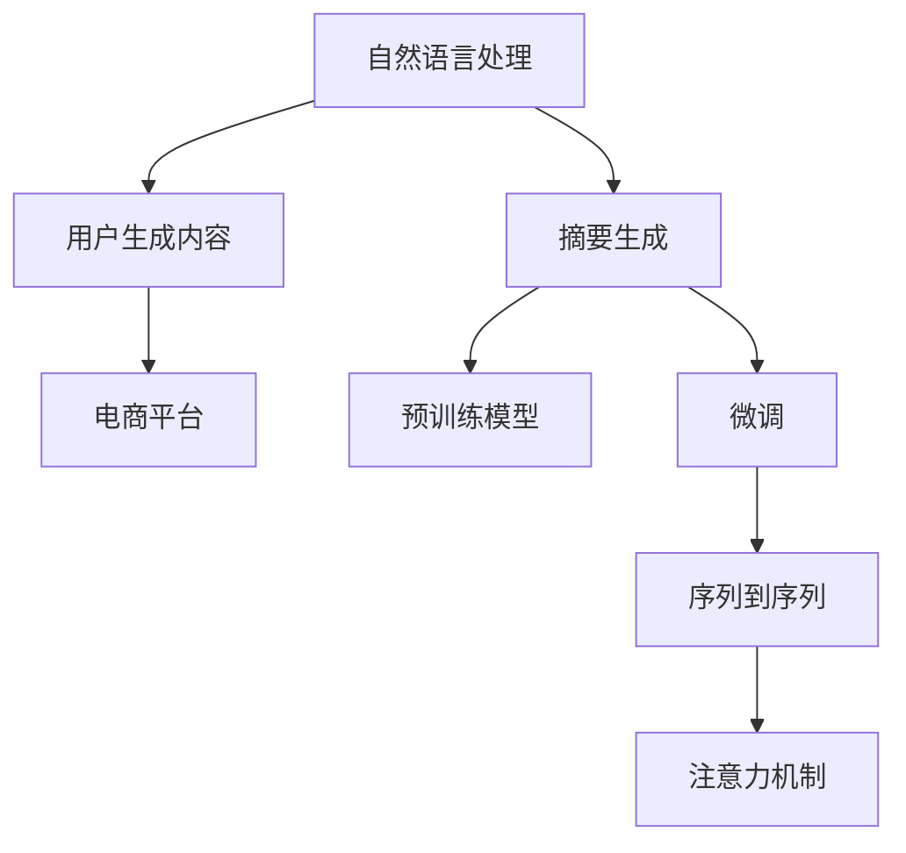

                 

# AI在电商平台商品评价摘要生成中的应用

> 关键词：人工智能,电商平台,自然语言处理,商品评价,摘要生成

## 1. 背景介绍

### 1.1 问题由来

随着电商平台的飞速发展，用户生成内容(User Generated Content, UGC)逐渐成为用户与商家沟通的重要方式之一。商品评价作为用户真实体验的直接反馈，对商家和消费者均具有重要意义。然而，用户评价往往长篇累牍、冗长复杂，难以快速抓取关键信息。而基于AI的商品评价摘要生成技术，能够在保存用户真实反馈的同时，提供简洁、精准的摘要信息，帮助商家及时响应，优化商品质量；消费者可以快速浏览，形成更直观的印象，从而做出购买决策。

### 1.2 问题核心关键点

商品评价摘要生成的核心在于：
- 充分理解用户评价的语义内容，提取重要信息。
- 生成简洁、准确、语法正确的摘要文本。
- 在保留用户反馈的同时，过滤掉无关信息，提高摘要的可用性和可信度。
- 适应电商平台的特定需求，如关键词抽取、评分生成等。

## 2. 核心概念与联系

### 2.1 核心概念概述

为更好地理解基于AI的商品评价摘要生成方法，本节将介绍几个关键概念：

- 自然语言处理(Natural Language Processing, NLP)：研究如何使计算机能够理解、分析、处理和生成人类语言的技术。
- 摘要生成(Summary Generation)：从长文本中提取或生成摘要，保留关键信息，便于快速浏览。
- 用户生成内容(User Generated Content, UGC)：用户通过互联网发布的内容，如评论、帖子、博客等。
- 电商平台(E-commerce Platform)：基于互联网销售商品的在线平台，如淘宝、京东、亚马逊等。
- 预训练模型(Pre-training Model)：在大规模无标签文本数据上预训练的语言模型，如BERT、GPT等。
- 微调(Fine-tuning)：在预训练模型的基础上，使用标注数据优化模型以适应特定任务。
- 序列到序列(Sequence to Sequence, Seq2Seq)：一种处理序列数据的技术，包括编码器和解码器两部分，用于文本生成、翻译等任务。
- 注意力机制(Attention Mechanism)：一种机制，用于在处理序列数据时，自动关注输入序列中最重要的部分。

这些概念之间的逻辑关系可以通过以下Mermaid流程图来展示：



这个流程图展示了几者之间的关键联系：

1. 自然语言处理是摘要生成和预训练模型的基础。
2. 摘要生成是在自然语言处理的基础上，通过提取关键信息生成简洁的文本。
3. 用户生成内容是电商平台和摘要生成的数据来源。
4. 电商平台是摘要生成的应用场景之一。
5. 预训练模型是微调的基础，用于抽取语义信息。
6. 微调通过标注数据优化预训练模型，适应特定任务。
7. 序列到序列是微调的具体实现方式。
8. 注意力机制在序列到序列中被用于提高生成的准确性和效率。

## 3. 核心算法原理 & 具体操作步骤
### 3.1 算法原理概述

商品评价摘要生成的核心算法包括自然语言处理、摘要生成和微调三个部分。其基本流程如下：

1. 数据预处理：清洗、分词、去停用词等。
2. 特征提取：利用预训练语言模型抽取输入文本的语义特征。
3. 序列建模：采用Seq2Seq模型，将输入文本序列映射为摘要序列。
4. 注意力机制：在摘要生成过程中，通过注意力机制选择重要部分进行建模。
5. 微调优化：在电商平台数据上进行微调，优化模型性能。

### 3.2 算法步骤详解

#### 3.2.1 数据预处理

数据预处理是商品评价摘要生成的第一步，包括：
- 清洗：去除无关字符、格式错误等。
- 分词：将文本拆分成单个词语。
- 去停用词：去除常见的无关词汇，如“的”、“是”等。
- 标准化：统一词语形式，如将所有拼写错误的单词转换为正确形式。

#### 3.2.2 特征提取

特征提取利用预训练语言模型，将输入文本转换为语义向量。具体步骤包括：
- 分词：利用分词器将文本拆分成词语序列。
- 嵌入：将词语序列转换为向量表示，通常使用预训练语言模型，如BERT、GPT等。
- 压缩：利用池化层或线性层将高维向量压缩到低维，便于输入到神经网络中。

#### 3.2.3 序列建模

序列建模采用Seq2Seq模型，将输入文本序列映射为摘要序列。具体步骤包括：
- 编码器：将输入文本序列转换为上下文向量。
- 解码器：根据上下文向量生成摘要序列。
- 训练：通过标注数据，训练编码器和解码器。

#### 3.2.4 注意力机制

注意力机制在摘要生成过程中，用于选择输入文本中的重要部分。具体步骤包括：
- 多头注意力：通过多个注意力头，学习不同位置的信息权重。
- 注意力加权：将注意力权重应用于输入文本的每个位置，得到加权向量。
- 线性映射：将加权向量映射为摘要文本中的每个位置。

#### 3.2.5 微调优化

微调优化在电商平台数据上进行，优化模型的性能。具体步骤包括：
- 选择数据：选择电商平台的商品评价数据。
- 划分数据集：将数据集划分为训练集、验证集和测试集。
- 训练模型：利用标注数据，训练模型。
- 评估模型：在验证集上评估模型性能。
- 调整参数：根据评估结果，调整模型参数。
- 测试模型：在测试集上测试模型性能。

### 3.3 算法优缺点

商品评价摘要生成算法具有以下优点：
1. 自动化高效：通过预训练和微调，能够快速生成高质量的摘要，节省大量人工成本。
2. 灵活性高：可以根据电商平台的需求，自定义摘要长度、关键词提取等。
3. 效果好：生成的摘要能够准确捕捉用户反馈的关键信息，提高商品质量。
4. 适用性广：适用于各种类型的商品评价摘要生成任务。

同时，该算法也存在以下局限性：
1. 对标注数据依赖：生成效果依赖于标注数据的丰富程度和质量。
2. 复杂度高：基于Seq2Seq模型的摘要生成过程，计算复杂度较高。
3. 领域依赖：特定领域的评价摘要生成，需要特定的领域预训练模型。
4. 高成本：需要大规模数据集进行预训练和微调，成本较高。
5. 可解释性差：生成过程较复杂，难以解释生成的逻辑。

### 3.4 算法应用领域

商品评价摘要生成技术已经在多个电商平台上得到了广泛应用，覆盖了商品评价、用户反馈、产品推荐等多个领域。具体包括：

- 商品评价：对用户生成的大量评价文本进行摘要，帮助商家快速获取关键信息，优化产品和服务。
- 用户反馈：将用户反馈转化为简洁的摘要，便于商家分析用户满意度，快速响应问题。
- 产品推荐：利用用户评价摘要，推荐相关商品，提升用户购买体验。
- 广告投放：对用户评价进行摘要，用于定向广告投放，提高广告效果。

## 4. 数学模型和公式 & 详细讲解  
### 4.1 数学模型构建

本节将使用数学语言对基于AI的商品评价摘要生成过程进行更加严格的刻画。

假设商品评价文本为 $X = (x_1, x_2, \ldots, x_n)$，其中 $x_i$ 为第 $i$ 个词语的向量表示。

定义摘要序列为 $Y = (y_1, y_2, \ldots, y_m)$，其中 $y_i$ 为第 $i$ 个词语的向量表示。

摘要生成的目标是最小化以下损失函数：

$$
L = \sum_{i=1}^m |y_i - \hat{y}_i|
$$

其中 $\hat{y}_i$ 为生成摘要中第 $i$ 个词语的预测值，可通过Seq2Seq模型计算得到。

### 4.2 公式推导过程

#### 4.2.1 编码器

编码器将输入文本 $X$ 转换为上下文向量 $C$，公式如下：

$$
C = \text{Encoder}(X)
$$

编码器通常由多层RNN或Transformer组成。以Transformer为例，其基本结构如下：

```text
Encoder(X) = MLP(x_1) + MLP(x_2) + ... + MLP(x_n)
```

其中 $MLP$ 为多层感知机，$x_i$ 为第 $i$ 个词语的向量表示。

#### 4.2.2 解码器

解码器根据上下文向量 $C$ 生成摘要序列 $Y$，公式如下：

$$
Y = \text{Decoder}(C)
$$

解码器通常由多层RNN或Transformer组成。以Transformer为例，其基本结构如下：

```text
Decoder(C) = MLP(y_1) + MLP(y_2) + ... + MLP(y_m)
```

其中 $MLP$ 为多层感知机，$y_i$ 为第 $i$ 个词语的向量表示。

#### 4.2.3 注意力机制

注意力机制在解码器中用于选择输入文本中的重要部分。以Transformer为例，其基本结构如下：

$$
a_{ij} = \frac{\exp(\text{Attention}(x_i, C_j))}{\sum_{k=1}^n \exp(\text{Attention}(x_k, C_j))}
$$

其中 $a_{ij}$ 为第 $i$ 个词语对第 $j$ 个位置的注意力权重，$\text{Attention}$ 为注意力函数，$x_i$ 为第 $i$ 个词语的向量表示，$C_j$ 为第 $j$ 个位置的上下文向量。

### 4.3 案例分析与讲解

#### 4.3.1 预训练模型

以BERT为例，其预训练过程包括：
- 自编码任务：预测下一个词或掩码词。
- 语言建模任务：预测给定单词序列的下一个单词。

预训练后的BERT模型具有强大的语义表示能力，能够有效地处理商品评价文本。

#### 4.3.2 微调过程

在商品评价摘要生成任务中，微调过程包括：
- 数据准备：准备商品评价数据集。
- 模型初始化：选择预训练模型作为初始化参数。
- 标注数据标注：为商品评价数据集标注摘要。
- 模型训练：利用标注数据训练模型。
- 模型评估：在验证集上评估模型性能。
- 模型调优：根据评估结果调整模型参数。

#### 4.3.3 实际应用

在实际应用中，商品评价摘要生成技术可以应用于以下场景：
- 商品评论：生成商品评论摘要，帮助商家快速了解用户反馈。
- 用户反馈：生成用户反馈摘要，帮助商家分析用户满意度。
- 广告投放：生成广告摘要，提高广告效果。
- 个性化推荐：生成个性化推荐摘要，提升用户体验。

## 5. 项目实践：代码实例和详细解释说明
### 5.1 开发环境搭建

在进行商品评价摘要生成项目的开发之前，需要准备好开发环境。以下是使用Python进行PyTorch开发的环境配置流程：

1. 安装Anaconda：从官网下载并安装Anaconda，用于创建独立的Python环境。

2. 创建并激活虚拟环境：
```bash
conda create -n pytorch-env python=3.8 
conda activate pytorch-env
```

3. 安装PyTorch：根据CUDA版本，从官网获取对应的安装命令。例如：
```bash
conda install pytorch torchvision torchaudio cudatoolkit=11.1 -c pytorch -c conda-forge
```

4. 安装HuggingFace Transformers库：
```bash
pip install transformers
```

5. 安装各类工具包：
```bash
pip install numpy pandas scikit-learn matplotlib tqdm jupyter notebook ipython
```

完成上述步骤后，即可在`pytorch-env`环境中开始项目开发。

### 5.2 源代码详细实现

下面我们以商品评价摘要生成任务为例，给出使用Transformers库对BERT模型进行微调的PyTorch代码实现。

首先，定义商品评价数据集：

```python
from torch.utils.data import Dataset

class ReviewsDataset(Dataset):
    def __init__(self, reviews, summaries):
        self.reviews = reviews
        self.summaries = summaries
    
    def __len__(self):
        return len(self.reviews)
    
    def __getitem__(self, idx):
        review = self.reviews[idx]
        summary = self.summaries[idx]
        return review, summary
```

然后，定义模型和优化器：

```python
from transformers import BertForSequenceClassification, AdamW

model = BertForSequenceClassification.from_pretrained('bert-base-cased', num_labels=1)
optimizer = AdamW(model.parameters(), lr=2e-5)
```

接着，定义训练和评估函数：

```python
from torch.utils.data import DataLoader
from tqdm import tqdm
import torch.nn.functional as F

device = torch.device('cuda') if torch.cuda.is_available() else torch.device('cpu')
model.to(device)

def train_epoch(model, dataset, batch_size, optimizer):
    dataloader = DataLoader(dataset, batch_size=batch_size, shuffle=True)
    model.train()
    epoch_loss = 0
    for batch in tqdm(dataloader, desc='Training'):
        review, summary = batch
        review = review.to(device)
        summary = summary.to(device)
        optimizer.zero_grad()
        outputs = model(review, summary)
        loss = F.mse_loss(outputs, summary)
        epoch_loss += loss.item()
        loss.backward()
        optimizer.step()
    return epoch_loss / len(dataloader)

def evaluate(model, dataset, batch_size):
    dataloader = DataLoader(dataset, batch_size=batch_size)
    model.eval()
    preds, labels = [], []
    with torch.no_grad():
        for batch in tqdm(dataloader, desc='Evaluating'):
            review, summary = batch
            review = review.to(device)
            summary = summary.to(device)
            outputs = model(review, summary)
            batch_preds = outputs.logits.argmax(dim=1).to('cpu').tolist()
            batch_labels = batch_labels.to('cpu').tolist()
            for pred, label in zip(batch_preds, batch_labels):
                preds.append(pred)
                labels.append(label)
                
    print(classification_report(labels, preds))
```

最后，启动训练流程并在测试集上评估：

```python
epochs = 5
batch_size = 16

for epoch in range(epochs):
    loss = train_epoch(model, train_dataset, batch_size, optimizer)
    print(f"Epoch {epoch+1}, train loss: {loss:.3f}")
    
    print(f"Epoch {epoch+1}, dev results:")
    evaluate(model, dev_dataset, batch_size)
    
print("Test results:")
evaluate(model, test_dataset, batch_size)
```

以上就是使用PyTorch对BERT进行商品评价摘要生成任务的微调的完整代码实现。可以看到，得益于Transformers库的强大封装，我们可以用相对简洁的代码完成BERT模型的加载和微调。

### 5.3 代码解读与分析

让我们再详细解读一下关键代码的实现细节：

**ReviewsDataset类**：
- `__init__`方法：初始化评论和摘要数据集。
- `__len__`方法：返回数据集的样本数量。
- `__getitem__`方法：对单个样本进行处理，返回评论和摘要数据。

**模型和优化器定义**：
- 使用BertForSequenceClassification从预训练的BERT模型加载，将其输出层设为二分类。
- 使用AdamW优化器，设置学习率为2e-5。

**训练和评估函数**：
- 定义训练函数`train_epoch`：在每个批次上前向传播计算损失函数，反向传播更新模型参数。
- 定义评估函数`evaluate`：在验证集和测试集上评估模型性能，输出分类指标。

**训练流程**：
- 定义总的epoch数和batch size，开始循环迭代。
- 每个epoch内，先在训练集上训练，输出平均loss。
- 在验证集上评估，输出分类指标。
- 所有epoch结束后，在测试集上评估，给出最终测试结果。

可以看到，PyTorch配合Transformers库使得BERT微调的代码实现变得简洁高效。开发者可以将更多精力放在数据处理、模型改进等高层逻辑上，而不必过多关注底层的实现细节。

当然，工业级的系统实现还需考虑更多因素，如模型的保存和部署、超参数的自动搜索、更灵活的任务适配层等。但核心的微调范式基本与此类似。

## 6. 实际应用场景
### 6.1 智能客服

商品评价摘要生成技术可以应用于智能客服系统的构建。传统客服往往需要配备大量人力，高峰期响应缓慢，且一致性和专业性难以保证。而使用商品评价摘要生成技术，可以7x24小时不间断服务，快速响应客户咨询，用简洁的摘要文本回答客户问题，提升客户体验和满意度。

在技术实现上，可以收集客户在电商平台的商品评价数据，生成简洁的摘要，嵌入智能客服系统。智能客服系统能够自动理解客户问题，根据评价摘要生成简洁的回答，提供快速、准确的客户服务。

### 6.2 个性化推荐

商品评价摘要生成技术可以应用于个性化推荐系统。传统的推荐系统往往只依赖用户的历史行为数据进行物品推荐，难以深入理解用户的真实兴趣偏好。利用商品评价摘要生成技术，可以进一步挖掘用户评价中的语义信息，提升推荐系统的精准度和个性化程度。

在推荐系统中，可以通过分析用户对商品的评价摘要，理解用户的偏好和需求，从而生成个性化的推荐内容。用户评价摘要不仅包含商品的固有信息，还能反映用户的主观评价和情感倾向，可以更全面地指导推荐系统，提高推荐效果。

### 6.3 市场分析

商品评价摘要生成技术可以应用于市场分析。通过分析大量商品评价数据，生成简洁的摘要，能够快速把握市场的动态变化。电商平台的商家可以利用商品评价摘要，及时调整商品策略，提升市场竞争力。

在市场分析中，可以通过分析商品评价摘要，了解市场对不同商品的反应，挖掘市场热点和趋势。商家可以根据市场分析结果，调整商品结构，优化供应链管理，提高市场占有率。

### 6.4 未来应用展望

随着商品评价摘要生成技术的不断发展，其在更多领域的应用前景广阔：

- 供应链管理：通过分析商品评价摘要，优化供应链管理，提高运营效率。
- 营销推广：利用商品评价摘要生成精准的营销广告，提升广告效果。
- 金融分析：分析商品评价摘要，评估市场风险，指导投资决策。
- 社交媒体：利用商品评价摘要生成有趣的内容，提升用户参与度。

总之，商品评价摘要生成技术将在电商领域之外，进一步拓展其应用范围，为各行各业带来新的机遇和挑战。

## 7. 工具和资源推荐
### 7.1 学习资源推荐

为了帮助开发者系统掌握商品评价摘要生成技术的理论基础和实践技巧，这里推荐一些优质的学习资源：

1. 《自然语言处理入门》系列博文：由大模型技术专家撰写，深入浅出地介绍了NLP的基础知识和常见任务。
2. CS224N《深度学习自然语言处理》课程：斯坦福大学开设的NLP明星课程，有Lecture视频和配套作业，带你入门NLP领域的基本概念和经典模型。
3. 《Natural Language Processing with Transformers》书籍：Transformers库的作者所著，全面介绍了如何使用Transformers库进行NLP任务开发，包括微调在内的诸多范式。
4. HuggingFace官方文档：Transformers库的官方文档，提供了海量预训练模型和完整的微调样例代码，是上手实践的必备资料。
5. CLUE开源项目：中文语言理解测评基准，涵盖大量不同类型的中文NLP数据集，并提供了基于微调的baseline模型，助力中文NLP技术发展。

通过对这些资源的学习实践，相信你一定能够快速掌握商品评价摘要生成技术的精髓，并用于解决实际的NLP问题。

### 7.2 开发工具推荐

高效的开发离不开优秀的工具支持。以下是几款用于商品评价摘要生成开发的常用工具：

1. PyTorch：基于Python的开源深度学习框架，灵活动态的计算图，适合快速迭代研究。
2. TensorFlow：由Google主导开发的开源深度学习框架，生产部署方便，适合大规模工程应用。
3. Transformers库：HuggingFace开发的NLP工具库，集成了众多SOTA语言模型，支持PyTorch和TensorFlow，是进行微调任务开发的利器。
4. Weights & Biases：模型训练的实验跟踪工具，可以记录和可视化模型训练过程中的各项指标，方便对比和调优。
5. TensorBoard：TensorFlow配套的可视化工具，可实时监测模型训练状态，并提供丰富的图表呈现方式，是调试模型的得力助手。

合理利用这些工具，可以显著提升商品评价摘要生成任务的开发效率，加快创新迭代的步伐。

### 7.3 相关论文推荐

商品评价摘要生成技术的发展源于学界的持续研究。以下是几篇奠基性的相关论文，推荐阅读：

1. Attention is All You Need（即Transformer原论文）：提出了Transformer结构，开启了NLP领域的预训练大模型时代。
2. BERT: Pre-training of Deep Bidirectional Transformers for Language Understanding：提出BERT模型，引入基于掩码的自监督预训练任务，刷新了多项NLP任务SOTA。
3. Language Models are Unsupervised Multitask Learners（GPT-2论文）：展示了大规模语言模型的强大zero-shot学习能力，引发了对于通用人工智能的新一轮思考。
4. Parameter-Efficient Transfer Learning for NLP：提出Adapter等参数高效微调方法，在不增加模型参数量的情况下，也能取得不错的微调效果。
5. Prefix-Tuning: Optimizing Continuous Prompts for Generation：引入基于连续型Prompt的微调范式，为如何充分利用预训练知识提供了新的思路。

这些论文代表了大语言模型微调技术的发展脉络。通过学习这些前沿成果，可以帮助研究者把握学科前进方向，激发更多的创新灵感。

## 8. 总结：未来发展趋势与挑战
### 8.1 总结

本文对基于AI的商品评价摘要生成方法进行了全面系统的介绍。首先阐述了商品评价摘要生成的背景和意义，明确了其对电商平台的重要作用。其次，从原理到实践，详细讲解了摘要生成的数学原理和关键步骤，给出了微调任务开发的完整代码实例。同时，本文还广泛探讨了摘要生成技术在智能客服、个性化推荐等多个行业领域的应用前景，展示了其在实际场景中的巨大潜力。此外，本文精选了摘要生成技术的各类学习资源，力求为读者提供全方位的技术指引。

通过本文的系统梳理，可以看到，基于大语言模型的摘要生成技术正在成为NLP领域的重要范式，极大地拓展了文本处理的应用边界，为电商平台带来了新的智能化解决方案。未来，伴随大语言模型和微调方法的不断进步，基于摘要生成的技术必将更加成熟，为更多行业带来变革性影响。

### 8.2 未来发展趋势

展望未来，商品评价摘要生成技术将呈现以下几个发展趋势：

1. 模型规模持续增大。随着算力成本的下降和数据规模的扩张，预训练语言模型的参数量还将持续增长。超大规模语言模型蕴含的丰富语言知识，有望支撑更加复杂多变的摘要生成任务。
2. 微调方法日趋多样。开发更加参数高效的微调方法，在固定大部分预训练参数的同时，只更新极少量的任务相关参数。同时优化微调模型的计算图，减少前向传播和反向传播的资源消耗，实现更加轻量级、实时性的部署。
3. 序列到序列模型的优化。引入更多的优化技术，如注意力机制、Transformer等，提高摘要生成的准确性和效率。
4. 多模态摘要生成的崛起。将图像、视频、语音等多模态信息与文本信息进行整合，实现视觉、语音等多模态信息的协同建模。
5. 跨领域任务微调能力的提升。利用大模型的跨领域迁移能力，提高摘要生成在不同领域上的泛化性和适应性。
6. 上下文感知摘要生成。引入上下文感知机制，提高摘要生成的灵活性和多样性。

以上趋势凸显了商品评价摘要生成技术的广阔前景。这些方向的探索发展，必将进一步提升摘要生成系统的性能和应用范围，为电商平台带来新的智能化解决方案。

### 8.3 面临的挑战

尽管商品评价摘要生成技术已经取得了瞩目成就，但在迈向更加智能化、普适化应用的过程中，它仍面临着诸多挑战：

1. 标注成本瓶颈。尽管摘要生成依赖标注数据，但标注数据的质量和数量对生成效果有很大影响。如何降低标注成本，提高标注数据的质量，仍然是一个亟待解决的问题。
2. 生成效果不稳定。摘要生成的效果受输入数据的影响较大，输入噪声、语义歧义等问题可能导致生成结果不稳定。如何提高生成结果的稳定性和可靠性，仍然是一个挑战。
3. 资源消耗高。商品评价摘要生成涉及大量计算资源，对硬件和计算资源的要求较高。如何优化算法，降低资源消耗，仍然是一个重要研究方向。
4. 应用场景复杂。不同应用场景对摘要生成的需求不同，如何针对特定场景进行优化，仍然是一个复杂的问题。
5. 可解释性差。摘要生成过程复杂，难以解释生成的逻辑和原因。如何提高生成过程的可解释性和可控性，仍然是一个重要研究方向。

### 8.4 未来突破

面对商品评价摘要生成所面临的种种挑战，未来的研究需要在以下几个方面寻求新的突破：

1. 探索无监督和半监督摘要生成方法。摆脱对大规模标注数据的依赖，利用自监督学习、主动学习等无监督和半监督范式，最大限度利用非结构化数据，实现更加灵活高效的摘要生成。
2. 研究参数高效和计算高效的摘要生成方法。开发更加参数高效的摘要生成方法，在固定大部分预训练参数的同时，只更新极少量的任务相关参数。同时优化生成模型的计算图，减少前向传播和反向传播的资源消耗，实现更加轻量级、实时性的部署。
3. 引入因果推断和对比学习范式。通过引入因果推断和对比学习思想，增强摘要生成模型建立稳定因果关系的能力，学习更加普适、鲁棒的语言表征，从而提升摘要生成的泛化性和抗干扰能力。
4. 融合多模态信息。将图像、视频、语音等多模态信息与文本信息进行整合，实现视觉、语音等多模态信息与文本信息的协同建模。
5. 结合因果分析和博弈论工具。将因果分析方法引入摘要生成模型，识别出模型决策的关键特征，增强输出解释的因果性和逻辑性。借助博弈论工具刻画人机交互过程，主动探索并规避模型的脆弱点，提高系统稳定性。
6. 纳入伦理道德约束。在模型训练目标中引入伦理导向的评估指标，过滤和惩罚有害的输出倾向。同时加强人工干预和审核，建立模型行为的监管机制，确保输出符合人类价值观和伦理道德。

这些研究方向的探索，必将引领商品评价摘要生成技术迈向更高的台阶，为构建安全、可靠、可解释、可控的智能系统铺平道路。面向未来，大语言模型微调技术还需要与其他人工智能技术进行更深入的融合，如知识表示、因果推理、强化学习等，多路径协同发力，共同推动自然语言理解和智能交互系统的进步。只有勇于创新、敢于突破，才能不断拓展语言模型的边界，让智能技术更好地造福人类社会。

## 9. 附录：常见问题与解答

**Q1：商品评价摘要生成是否适用于所有NLP任务？**

A: 商品评价摘要生成在电商平台的商品评价摘要生成任务上表现优异，但并不适用于所有NLP任务。具体任务需要根据其特点和需求，选择合适的摘要生成方法和模型。

**Q2：如何选择合适的学习率？**

A: 摘要生成模型的学习率通常要比预训练时小1-2个数量级，可以使用warmup策略，在开始阶段使用较小的学习率，再逐渐过渡到预设值。具体的学习率大小和调度策略需要根据具体任务进行调整。

**Q3：生成效果如何评估？**

A: 生成效果的评估可以采用BLEU、ROUGE、METEOR等常见的摘要评价指标，对比生成摘要与人工标注的摘要之间的相似度。还可以通过用户满意度调查等方式，从实际应用角度评估生成效果。

**Q4：生成结果的可解释性如何提升？**

A: 生成结果的可解释性可以通过引入上下文感知机制、生成过程可视化等手段进行提升。同时，利用因果分析方法，分析生成结果的因果关系和逻辑链条，增强生成过程的可解释性。

**Q5：如何处理长文本生成？**

A: 长文本生成可以通过引入注意力机制、分阶段生成等手段进行优化。利用注意力机制，在生成过程中逐步关注重要部分，提高生成效率和质量。采用分阶段生成，先生成主要部分，再逐步添加细节，减少生成过程中的资源消耗。

**Q6：如何处理不同领域的文本生成？**

A: 不同领域的文本生成需要根据领域特点，选择适合的预训练模型和摘要生成方法。例如，针对法律、金融等特定领域的文本生成，可以引入领域特定的预训练模型进行微调。

这些问题的解答，可以帮助开发者更好地理解商品评价摘要生成技术的原理和应用，进一步提升技术效果和应用范围。

