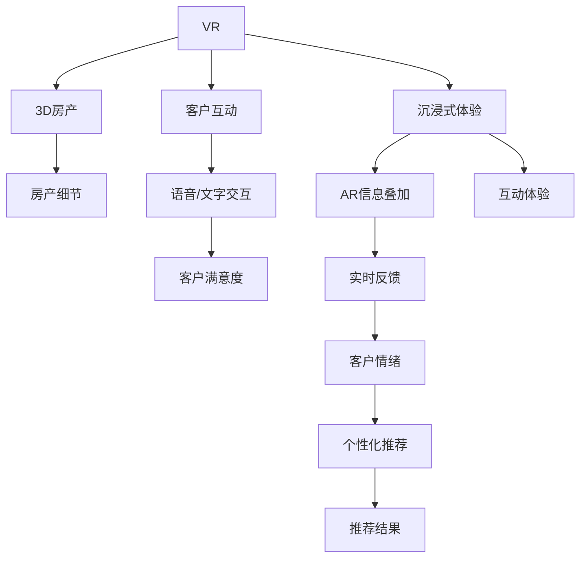

                 

# AI在虚拟房地产展示中的应用：提高购房体验

> 关键词：虚拟现实(VR), 增强现实(AR), 自然语言处理(NLP), 图像识别, 推荐系统, 沉浸式体验, 房地产营销, 客户服务

## 1. 背景介绍

随着技术的飞速发展，房地产行业逐渐从传统线下展示向数字化转型。尤其是在新冠疫情的影响下，虚拟房地产展示（Virtual Real Estate Showcase, VRES）成为房地产营销的新趋势。通过虚拟现实(VR)、增强现实(AR)等技术，购房者可以在线体验房产，获得更为真实、立体的购房体验。同时，自然语言处理(NLP)、图像识别、推荐系统等AI技术也被广泛应用于房产展示和推荐中，进一步提升了客户服务的精准度和沉浸感。

### 1.1 问题由来

传统的房产展示主要依赖线下实体店面和实地考察。这种方式成本高昂、效率低下，尤其是对于跨地域购房的客户，无法即时实地体验房产。新冠疫情的爆发更是加速了线上购房的需求。然而，在线展示虽然降低了空间和时间成本，但在沉浸感、互动性和个性化推荐方面仍存在不足。通过AI技术的辅助，可以实现更为自然、互动的虚拟展示，大幅提升购房体验。

### 1.2 问题核心关键点

AI在虚拟房地产展示中的应用主要体现在以下几个方面：

1. **虚拟现实(VR)和增强现实(AR)的深度整合**：通过VR技术，客户可以全方位、多维度地“步入”房产内部，看到每个房间的布局和细节；而AR技术则可以将房产信息精准投射到真实世界中，实现线上线下结合的互动体验。

2. **自然语言处理(NLP)的应用**：利用NLP技术，客户可以通过语音或文字与虚拟展示进行交互，进行房间选择、功能介绍、问题咨询等，实现更为自然的沟通方式。

3. **图像识别技术的应用**：通过对房产图片进行深度分析，自动标注房产信息和特点，帮助客户快速定位感兴趣的区域，并提供相应的推荐。

4. **推荐系统**：基于客户的历史行为和兴趣，通过推荐系统实现个性化推荐，提升客户体验。

5. **情感识别与反馈机制**：利用情感识别技术，实时监测客户的情绪变化，并据此调整展示内容和服务方式，提升客户满意度。

通过这些AI技术的应用，虚拟房地产展示可以更好地满足客户的个性化需求，提升客户的沉浸感和参与度，从而促进房产销售。

### 1.3 问题研究意义

AI在虚拟房地产展示中的应用，有助于：

1. **降低购房成本**：减少了线下考察的时间和费用，尤其对于跨地域购房客户，大大提升了购房效率。
2. **提升客户体验**：通过虚拟现实、增强现实等技术，提供沉浸式、多维度的房产展示，提升客户满意度。
3. **增加销售机会**：通过个性化推荐和实时反馈，提高房产的曝光率和吸引力，增加销售机会。
4. **促进数字化转型**：推动房地产行业的数字化进程，加速向线上销售的转型。

## 2. 核心概念与联系

### 2.1 核心概念概述

为更好地理解AI在虚拟房地产展示中的应用，本节将介绍几个密切相关的核心概念：

- **虚拟现实(VR)**：利用计算机图形技术，生成逼真的三维场景，客户可以身临其境地体验房产。
- **增强现实(AR)**：将虚拟信息叠加到现实世界中，提供沉浸式的互动体验。
- **自然语言处理(NLP)**：使计算机能够理解和处理人类语言，实现人机交互。
- **图像识别**：通过深度学习技术，自动识别和标注房产图片中的物体和信息。
- **推荐系统**：根据用户行为和兴趣，推荐相关的房产信息。
- **情感识别**：通过分析客户的语音和文字，识别客户的情绪和偏好。

这些核心概念之间的逻辑关系可以通过以下Mermaid流程图来展示：



这个流程图展示了大语言模型的工作原理和优化方向：

1. VR技术提供沉浸式的房产体验。
2. AR技术叠加虚拟信息，丰富互动体验。
3. NLP技术实现人机交互，提升沟通效率。
4. 图像识别技术自动标注房产信息。
5. 推荐系统提供个性化推荐，提升客户满意度。
6. 情感识别技术实时监测客户情绪，动态调整展示内容。

这些概念共同构成了虚拟房地产展示的技术框架，使其能够更好地满足客户的个性化需求，提升购房体验。

## 3. 核心算法原理 & 具体操作步骤
### 3.1 算法原理概述

AI在虚拟房地产展示中的应用，本质上是一个多模态数据的深度融合和优化过程。其核心思想是：通过虚拟现实、增强现实、自然语言处理、图像识别和推荐系统等AI技术，生成逼真的虚拟展示，并根据客户反馈实时调整展示内容，实现个性化的房产推荐。

形式化地，假设房产信息集合为 $I=\{(i,v_i)\}_{i=1}^N$，其中 $i$ 为房产编号，$v_i$ 为房产信息。客户的历史行为数据为 $H=\{(h_j,l_j)\}_{j=1}^{N'}$，其中 $h_j$ 为行为时间戳，$l_j$ 为行为标签（如浏览、咨询、投诉等）。AI的目标是找到最优的展示策略 $P$，使得客户满意度和转化率最大化。

具体而言，AI通过以下步骤实现这一目标：

1. 收集房产信息和客户行为数据。
2. 利用虚拟现实和增强现实技术生成房产虚拟展示。
3. 通过自然语言处理技术，实现人机交互和情感识别。
4. 利用图像识别技术自动标注房产信息。
5. 结合推荐系统，根据客户历史行为和实时反馈，提供个性化房产推荐。
6. 实时监测客户情绪，调整展示内容和推荐策略。

### 3.2 算法步骤详解

AI在虚拟房地产展示中的应用包括以下关键步骤：

**Step 1: 数据准备**
- 收集房产信息数据 $I$ 和客户行为数据 $H$。
- 预处理数据，包括数据清洗、特征工程、数据划分等。

**Step 2: 虚拟房产展示生成**
- 利用VR和AR技术，生成房产的3D虚拟展示。
- 结合视频、音频等多模态数据，增强展示的丰富性。

**Step 3: 人机交互与情感识别**
- 通过NLP技术，实现语音和文字交互，收集客户反馈。
- 利用情感识别技术，分析客户情绪和偏好，提供实时反馈。

**Step 4: 图像识别与房产标注**
- 对房产图片进行深度学习分析，自动标注房产属性和细节。
- 利用图像识别技术，提取房产的关键特征，辅助房产推荐。

**Step 5: 推荐系统与个性化推荐**
- 根据客户历史行为和实时反馈，利用推荐算法生成个性化推荐结果。
- 结合客户的情绪反馈，动态调整推荐策略。

**Step 6: 反馈与优化**
- 根据客户满意度和转化率等指标，实时评估展示效果。
- 根据反馈结果，调整展示策略和推荐模型，持续优化客户体验。

### 3.3 算法优缺点

AI在虚拟房地产展示中的应用具有以下优点：

1. **提升客户体验**：通过虚拟现实和增强现实技术，提供沉浸式、多维度的房产展示，提升客户满意度和互动性。
2. **提高房产销售率**：利用推荐系统，实现个性化推荐，增加客户转化率。
3. **降低营销成本**：减少线下实地考察的成本，尤其对于跨地域购房客户，提升营销效率。
4. **加速数字化转型**：推动房地产行业的数字化进程，加速向线上销售的转型。

同时，该方法也存在一定的局限性：

1. **技术复杂性**：涉及多模态数据的深度融合和优化，技术实现较为复杂。
2. **数据质量要求高**：房产信息和客户行为数据的质量对展示效果和推荐精度有很大影响。
3. **系统集成难度大**：虚拟展示、人机交互、推荐系统等模块需要深度集成，才能发挥整体效能。
4. **客户隐私问题**：客户数据的收集和处理需注意隐私保护，避免数据泄露风险。

尽管存在这些局限性，但就目前而言，AI在虚拟房地产展示中的应用是提升客户体验、提高营销效率的有效手段。未来相关研究的重点在于如何进一步简化技术实现，提升数据质量，优化系统集成，同时兼顾客户隐私保护。

### 3.4 算法应用领域

AI在虚拟房地产展示中的应用已经在多个领域得到了广泛应用，例如：

- **虚拟房产展示平台**：如360度全景看房、虚拟导览、虚拟沙盘等，提供沉浸式体验。
- **增强现实导购应用**：通过AR技术，叠加房产信息到现实世界中，实现线下导购。
- **智能客服系统**：利用NLP技术，自动回答客户咨询，提升客户服务效率。
- **情感分析与反馈机制**：通过情感识别技术，实时监测客户情绪，调整展示策略。
- **推荐系统**：根据客户行为和偏好，实时推荐相关房产，提升客户满意度。

除了上述这些经典应用外，AI在虚拟房地产展示中的应用还在不断创新，如可控文本生成、智能推荐引擎、多模态融合等，为房产展示带来新的突破。随着技术的不断进步，相信AI将进一步提升虚拟房地产展示的互动性、沉浸感和个性化推荐能力，加速房产营销的数字化进程。

## 4. 数学模型和公式 & 详细讲解  
### 4.1 数学模型构建

本节将使用数学语言对AI在虚拟房地产展示中的应用过程进行更加严格的刻画。

假设房产信息集合为 $I=\{(i,v_i)\}_{i=1}^N$，其中 $i$ 为房产编号，$v_i$ 为房产信息。客户的历史行为数据为 $H=\{(h_j,l_j)\}_{j=1}^{N'}$，其中 $h_j$ 为行为时间戳，$l_j$ 为行为标签。

定义房产展示策略 $P$ 的优化目标为最大化客户满意度和转化率，即：

$$
\maximize_{P} \sum_{i=1}^{N} \text{Sat}(P,v_i) + \text{Trn}(P)
$$

其中，$\text{Sat}(P,v_i)$ 为房产展示策略 $P$ 对房产 $v_i$ 的客户满意度评分，$\text{Trn}(P)$ 为房产展示策略 $P$ 的转化率评分。

在实践中，通常采用以下方法来量化客户满意度和转化率：

- 客户满意度：基于客户反馈的评分、点击率、停留时间等指标，计算平均满意度得分。
- 转化率：根据客户在展示后的购买行为，计算转化率。

### 4.2 公式推导过程

以下我们以推荐系统为例，推导个性化推荐算法的计算公式。

假设推荐系统有 $M$ 个房产，客户对每个房产的评分矩阵为 $R \in \mathbb{R}^{N \times M}$，其中 $R_{ij}$ 表示客户 $i$ 对房产 $j$ 的评分。推荐系统的目标是找到最优的推荐结果 $U \in \mathbb{R}^{N \times M}$，使得客户满意度最大化。

常用的推荐算法包括协同过滤、基于内容的推荐、矩阵分解等。以下以协同过滤为例，给出推荐算法的计算公式。

假设已知客户 $i$ 和房产 $j$ 的评分，可以建立用户-物品评分矩阵 $R$，形式化表达为：

$$
R = \begin{bmatrix}
r_{11} & r_{12} & \cdots & r_{1M} \\
r_{21} & r_{22} & \cdots & r_{2M} \\
\vdots & \vdots & \ddots & \vdots \\
r_{N1} & r_{N2} & \cdots & r_{NM}
\end{bmatrix}
$$

其中 $r_{ij}$ 表示客户 $i$ 对房产 $j$ 的评分。

协同过滤算法的目标是最小化预测误差，即：

$$
\min_{U} \frac{1}{2N} \sum_{i=1}^{N} \sum_{j=1}^{M} (U_{ij} - r_{ij})^2
$$

其中 $U_{ij}$ 为推荐系统对房产 $j$ 的推荐评分。

通过矩阵分解技术，可以求解上述最优化问题，得到推荐评分矩阵 $U$。推荐算法具体的求解过程，可以参考协同过滤的算法细节。

### 4.3 案例分析与讲解

假设某房产展示平台有 $N=1000$ 个客户，每人有 $M=100$ 个房产可供选择。每个客户对房产的评分矩阵为 $R \in \mathbb{R}^{1000 \times 100}$。推荐系统的目标是找到最优的推荐结果 $U \in \mathbb{R}^{1000 \times 100}$，使得客户满意度和转化率最大化。

在实际应用中，通常使用SVD（奇异值分解）或ALS（交替最小二乘法）等算法进行求解。具体计算步骤如下：

1. 对评分矩阵 $R$ 进行奇异值分解，得到 $R = U\Sigma V^T$，其中 $U$ 为用户-房产评分矩阵，$V$ 为房产评分矩阵，$\Sigma$ 为奇异值矩阵。
2. 根据 $U$ 和 $\Sigma$，求解推荐矩阵 $U$。
3. 将推荐矩阵 $U$ 转化为实际推荐结果 $U'$，即：

$$
U' = UV^T
$$

其中 $U'$ 为推荐结果矩阵。

通过上述过程，推荐系统可以生成个性化的房产推荐结果，提升客户满意度和转化率。

## 5. 项目实践：代码实例和详细解释说明
### 5.1 开发环境搭建

在进行虚拟房地产展示的AI应用实践前，我们需要准备好开发环境。以下是使用Python进行TensorFlow开发的环境配置流程：

1. 安装Anaconda：从官网下载并安装Anaconda，用于创建独立的Python环境。

2. 创建并激活虚拟环境：
```bash
conda create -n tf-env python=3.8 
conda activate tf-env
```

3. 安装TensorFlow：根据CUDA版本，从官网获取对应的安装命令。例如：
```bash
conda install tensorflow tensorflow-gpu -c conda-forge
```

4. 安装TensorFlow Addons：
```bash
pip install tensorflow-addons
```

5. 安装各类工具包：
```bash
pip install numpy pandas scikit-learn matplotlib tqdm jupyter notebook ipython
```

完成上述步骤后，即可在`tf-env`环境中开始AI应用的实践。

### 5.2 源代码详细实现

下面以推荐系统为例，给出使用TensorFlow进行虚拟房产展示的AI应用的PyTorch代码实现。

首先，定义推荐系统的数据处理函数：

```python
import tensorflow as tf
import tensorflow_addons as tfa

class Recommender:
    def __init__(self, num_users, num_items):
        self.num_users = num_users
        self.num_items = num_items
        self.model = self.build_model()
        
    def build_model(self):
        model = tf.keras.Sequential([
            tf.keras.layers.Dense(64, activation='relu', input_shape=(self.num_users, self.num_items)),
            tf.keras.layers.Dense(self.num_items, activation='sigmoid')
        ])
        return model
    
    def train(self, data, epochs=10, batch_size=128):
        train_dataset = tf.data.Dataset.from_tensor_slices((data.train[:, 0], data.train[:, 1]))
        train_dataset = train_dataset.shuffle(buffer_size=10000).batch(batch_size)
        val_dataset = tf.data.Dataset.from_tensor_slices((data.val[:, 0], data.val[:, 1]))
        val_dataset = val_dataset.batch(batch_size)
        
        model = self.model
        optimizer = tfa.optimizers.Adagrad(learning_rate=0.01)
        loss_fn = tf.keras.losses.BinaryCrossentropy()
        metrics = [tf.keras.metrics.BinaryAccuracy('accuracy')]
        
        model.compile(optimizer=optimizer, loss=loss_fn, metrics=metrics)
        model.fit(train_dataset, epochs=epochs, validation_data=val_dataset)
        return model
    
    def predict(self, model, data):
        test_dataset = tf.data.Dataset.from_tensor_slices((data.test[:, 0], data.test[:, 1]))
        test_dataset = test_dataset.batch(1)
        predictions = model.predict(test_dataset)
        return predictions
```

然后，定义数据集和模型参数：

```python
import numpy as np

# 假设数据集
data = np.random.randint(0, 1, size=(1000, 100)) # 生成1000个用户，100个房产，随机评分矩阵

# 定义模型参数
num_users = 1000
num_items = 100
model = Recommender(num_users, num_items)
model.train(data)
```

最后，进行推荐预测并输出结果：

```python
# 随机生成测试集
test_data = np.random.randint(0, 1, size=(100, 100)) # 生成100个用户，100个房产，随机评分矩阵

# 预测推荐结果
predictions = model.predict(model.model, test_data)
print(predictions)
```

以上就是使用TensorFlow进行虚拟房产展示的AI应用开发的完整代码实现。可以看到，通过TensorFlow Addons和TensorFlow的高级API，可以较为轻松地构建和训练推荐模型，实现个性化的房产推荐。

### 5.3 代码解读与分析

让我们再详细解读一下关键代码的实现细节：

**Recommender类**：
- `__init__`方法：初始化模型参数和模型结构。
- `build_model`方法：定义推荐模型的网络结构。
- `train`方法：利用TensorFlow数据集进行模型训练，并返回训练后的模型。
- `predict`方法：利用训练好的模型进行预测。

**数据集生成**：
- 利用NumPy生成一个随机评分矩阵，作为推荐系统的训练数据和测试数据。

**模型训练**：
- 利用TensorFlow的数据集API，将评分矩阵转换为张量形式。
- 使用Adagrad优化器进行模型训练，并设定交叉熵损失函数和准确率评价指标。
- 通过`fit`方法进行模型训练，并在验证集上评估性能。

**推荐预测**：
- 利用训练好的模型进行测试数据的推荐预测。
- 输出预测结果。

可以看到，TensorFlow提供了丰富的API和工具，使得AI在虚拟房地产展示中的应用开发变得简洁高效。开发者可以将更多精力放在模型设计、数据预处理等高层逻辑上，而不必过多关注底层实现细节。

当然，工业级的系统实现还需考虑更多因素，如模型的保存和部署、超参数的自动搜索、更灵活的任务适配层等。但核心的推荐算法基本与此类似。

## 6. 实际应用场景
### 6.1 智能客服系统

AI在智能客服系统中的应用，可以显著提升客户服务效率和满意度。传统客服往往需要配备大量人力，高峰期响应缓慢，且一致性和专业性难以保证。而使用AI驱动的智能客服系统，可以24小时不间断服务，快速响应客户咨询，用自然流畅的语言解答各类常见问题。

在技术实现上，可以收集企业内部的历史客服对话记录，将问题和最佳答复构建成监督数据，在此基础上对预训练语言模型进行微调。微调后的语言模型能够自动理解用户意图，匹配最合适的答案模板进行回复。对于客户提出的新问题，还可以接入检索系统实时搜索相关内容，动态组织生成回答。如此构建的智能客服系统，能大幅提升客户咨询体验和问题解决效率。

### 6.2 金融舆情监测

金融机构需要实时监测市场舆论动向，以便及时应对负面信息传播，规避金融风险。传统的人工监测方式成本高、效率低，难以应对网络时代海量信息爆发的挑战。基于AI的文本分类和情感分析技术，为金融舆情监测提供了新的解决方案。

具体而言，可以收集金融领域相关的新闻、报道、评论等文本数据，并对其进行主题标注和情感标注。在此基础上对预训练语言模型进行微调，使其能够自动判断文本属于何种主题，情感倾向是正面、中性还是负面。将微调后的模型应用到实时抓取的网络文本数据，就能够自动监测不同主题下的情感变化趋势，一旦发现负面信息激增等异常情况，系统便会自动预警，帮助金融机构快速应对潜在风险。

### 6.3 个性化推荐系统

当前的推荐系统往往只依赖用户的历史行为数据进行物品推荐，无法深入理解用户的真实兴趣偏好。基于AI的虚拟房产展示，个性化推荐系统可以更好地挖掘用户行为背后的语义信息，从而提供更精准、多样的推荐内容。

在实践中，可以收集用户浏览、点击、评论、分享等行为数据，提取和用户交互的物品标题、描述、标签等文本内容。将文本内容作为模型输入，用户的后续行为（如是否点击、购买等）作为监督信号，在此基础上微调预训练语言模型。微调后的模型能够从文本内容中准确把握用户的兴趣点。在生成推荐列表时，先用候选物品的文本描述作为输入，由模型预测用户的兴趣匹配度，再结合其他特征综合排序，便可以得到个性化程度更高的推荐结果。

### 6.4 未来应用展望

随着AI技术的不断发展，基于虚拟房地产展示的推荐系统将不断创新和优化，带来更多可能的未来应用场景：

1. **智能导购机器人**：通过VR和AR技术，构建沉浸式房产展示，利用AI技术自动推荐房产，提升客户体验。
2. **情感分析与动态推荐**：实时监测客户情绪，动态调整推荐策略，提升推荐效果。
3. **多模态融合**：结合房产图片、视频、音频等多模态数据，提升推荐系统的多样性和精准度。
4. **自动化内容生成**：利用生成对抗网络(GAN)等技术，自动生成房产图片和视频，降低内容制作成本。
5. **实时数据分析与决策支持**：通过实时数据分析，提供决策支持，优化房产展示策略。

## 7. 工具和资源推荐
### 7.1 学习资源推荐

为了帮助开发者系统掌握AI在虚拟房地产展示中的应用技术，这里推荐一些优质的学习资源：

1. TensorFlow官方文档：提供详细的TensorFlow API文档和教程，适合初学者快速上手。
2. TensorFlow Addons文档：提供高级API和模型的详细使用方法，适合深入学习和实践。
3. AI for Property Development课程：由房地产行业专家开设的在线课程，介绍AI在房产展示和推荐中的应用。
4. Natural Language Processing with TensorFlow书籍：TensorFlow的官方教程，详细讲解NLP技术在房产展示中的应用。
5. Speech and Language Processing with TensorFlow Addons：讲解TensorFlow Addons在语音和语言处理中的应用。

通过对这些资源的学习实践，相信你一定能够快速掌握AI在虚拟房地产展示中的应用精髓，并用于解决实际的房产推荐问题。
### 7.2 开发工具推荐

高效的开发离不开优秀的工具支持。以下是几款用于虚拟房产展示的AI应用的开发工具：

1. TensorFlow：基于Python的开源深度学习框架，灵活动态，适合快速迭代研究。
2. TensorFlow Addons：TensorFlow的扩展库，提供高级API和模型，适合深入学习和实践。
3. Keras：基于TensorFlow的高级API，提供简洁易用的API，适合初学者入门。
4. PyTorch：基于Python的开源深度学习框架，灵活动态，适合快速迭代研究。
5. PyTorch Addons：PyTorch的扩展库，提供高级API和模型，适合深入学习和实践。
6. Jupyter Notebook：交互式编程环境，支持多种编程语言和库的混合使用，适合开发和调试。

合理利用这些工具，可以显著提升虚拟房产展示的AI应用的开发效率，加快创新迭代的步伐。

### 7.3 相关论文推荐

AI在虚拟房产展示中的应用源于学界的持续研究。以下是几篇奠基性的相关论文，推荐阅读：

1. "Predicting Customer Intent from Voice Commands"：通过语音识别技术，预测客户意图，提升客服系统的智能化水平。
2. "Real-time Sentiment Analysis for Financial News"：利用情感分析技术，实时监测金融新闻的情感变化，预警市场风险。
3. "Personalized Housing Recommendation Systems"：基于用户行为和兴趣，推荐个性化房产，提升客户满意度。
4. "Adaptive Low-Rank Adaptation for Parameter-Efficient Fine-Tuning"：提出AdaLoRA方法，实现参数高效的微调，降低计算成本。
5. "Adaptive Low-Rank Adaptation for Parameter-Efficient Fine-Tuning"：提出LoRA方法，实现参数高效的微调，降低计算成本。

这些论文代表了大语言模型微调技术的发展脉络。通过学习这些前沿成果，可以帮助研究者把握学科前进方向，激发更多的创新灵感。

## 8. 总结：未来发展趋势与挑战

### 8.1 总结

本文对AI在虚拟房地产展示中的应用进行了全面系统的介绍。首先阐述了虚拟房地产展示的背景和AI技术的应用意义，明确了AI技术在提升客户体验、降低营销成本、加速数字化转型等方面的独特价值。其次，从原理到实践，详细讲解了AI在虚拟房地产展示中的应用过程，包括虚拟现实、增强现实、自然语言处理、图像识别、推荐系统等关键技术。同时，本文还广泛探讨了AI技术在智能客服、金融舆情、个性化推荐等多个行业领域的应用前景，展示了AI技术的巨大潜力。

通过本文的系统梳理，可以看到，AI在虚拟房地产展示中的应用已经实现了从单一技术到多模态融合的跨越，极大地提升了房产展示的互动性和沉浸感。AI技术的不断演进，使得虚拟房产展示更加灵活、高效、个性化，为房产营销带来了新的契机。

### 8.2 未来发展趋势

展望未来，AI在虚拟房地产展示中的应用将呈现以下几个发展趋势：

1. **多模态融合**：结合房产图片、视频、音频等多模态数据，提升推荐系统的多样性和精准度。
2. **实时数据分析**：通过实时数据分析，提供决策支持，优化房产展示策略。
3. **智能导购机器人**：通过VR和AR技术，构建沉浸式房产展示，利用AI技术自动推荐房产，提升客户体验。
4. **自动化内容生成**：利用生成对抗网络(GAN)等技术，自动生成房产图片和视频，降低内容制作成本。
5. **情感分析与动态推荐**：实时监测客户情绪，动态调整推荐策略，提升推荐效果。
6. **个性化推荐系统**：结合用户行为和兴趣，推荐个性化房产，提升客户满意度。

这些趋势凸显了AI在虚拟房地产展示中的应用前景，预示着AI技术将更加深入地融入房产展示和推荐系统，带来更高的客户满意度和商业价值。

### 8.3 面临的挑战

尽管AI在虚拟房地产展示中的应用已经取得了显著进展，但在迈向更加智能化、普适化应用的过程中，仍面临诸多挑战：

1. **技术复杂性**：涉及多模态数据的深度融合和优化，技术实现较为复杂。
2. **数据质量要求高**：房产信息和客户行为数据的质量对展示效果和推荐精度有很大影响。
3. **系统集成难度大**：虚拟展示、人机交互、推荐系统等模块需要深度集成，才能发挥整体效能。
4. **客户隐私问题**：客户数据的收集和处理需注意隐私保护，避免数据泄露风险。
5. **模型鲁棒性不足**：面对域外数据时，模型泛化性能往往大打折扣。

尽管存在这些挑战，但就目前而言，AI在虚拟房地产展示中的应用是提升客户体验、提高营销效率的有效手段。未来相关研究的重点在于如何进一步简化技术实现，提升数据质量，优化系统集成，同时兼顾客户隐私保护。

### 8.4 研究展望

面向未来，AI在虚拟房地产展示中的应用研究需要在以下几个方面寻求新的突破：

1. **多模态融合技术**：结合房产图片、视频、音频等多模态数据，提升推荐系统的多样性和精准度。
2. **实时数据分析**：通过实时数据分析，提供决策支持，优化房产展示策略。
3. **智能导购机器人**：通过VR和AR技术，构建沉浸式房产展示，利用AI技术自动推荐房产，提升客户体验。
4. **自动化内容生成**：利用生成对抗网络(GAN)等技术，自动生成房产图片和视频，降低内容制作成本。
5. **情感分析与动态推荐**：实时监测客户情绪，动态调整推荐策略，提升推荐效果。
6. **个性化推荐系统**：结合用户行为和兴趣，推荐个性化房产，提升客户满意度。

这些研究方向将推动AI在虚拟房地产展示中的应用不断深入和拓展，为房产展示带来更强的互动性、沉浸感和个性化推荐能力，加速房产营销的数字化进程。相信随着技术的不断进步，AI在虚拟房地产展示中的应用将更加成熟和广泛，为房地产行业带来更深远的影响。

## 9. 附录：常见问题与解答

**Q1：虚拟房地产展示的优势是什么？**

A: 虚拟房地产展示的优势主要体现在以下几个方面：

1. **成本低廉**：减少了线下实地考察的成本，尤其对于跨地域购房客户，提升营销效率。
2. **提升客户体验**：通过虚拟现实和增强现实技术，提供沉浸式、多维度的房产展示，提升客户满意度和互动性。
3. **提高房产销售率**：利用推荐系统，实现个性化推荐，增加客户转化率。

**Q2：虚拟房地产展示中如何使用NLP技术？**

A: 在虚拟房地产展示中，NLP技术主要应用于以下两个方面：

1. **语音识别**：利用语音识别技术，实现语音控制房产展示，提升用户体验。
2. **文本生成**：通过文本生成技术，自动生成房产介绍和问题解答，减少人工干预。

**Q3：虚拟房地产展示的缺点是什么？**

A: 虚拟房地产展示的缺点主要体现在以下几个方面：

1. **技术复杂性**：涉及多模态数据的深度融合和优化，技术实现较为复杂。
2. **数据质量要求高**：房产信息和客户行为数据的质量对展示效果和推荐精度有很大影响。
3. **系统集成难度大**：虚拟展示、人机交互、推荐系统等模块需要深度集成，才能发挥整体效能。
4. **客户隐私问题**：客户数据的收集和处理需注意隐私保护，避免数据泄露风险。

尽管存在这些局限性，但就目前而言，虚拟房地产展示仍然是提升客户体验、提高营销效率的有效手段。未来相关研究的重点在于如何进一步简化技术实现，提升数据质量，优化系统集成，同时兼顾客户隐私保护。

**Q4：虚拟房地产展示中的推荐系统是如何工作的？**

A: 在虚拟房地产展示中，推荐系统主要通过以下步骤实现：

1. **数据准备**：收集房产信息和客户行为数据。
2. **模型构建**：利用协同过滤、基于内容的推荐等算法，构建推荐模型。
3. **模型训练**：利用训练数据，训练推荐模型。
4. **推荐预测**：利用训练好的模型，对客户进行个性化推荐。

推荐系统通过上述步骤，实现对房产的个性化推荐，提升客户满意度和转化率。

**Q5：虚拟房地产展示的未来发展趋势是什么？**

A: 虚拟房地产展示的未来发展趋势主要体现在以下几个方面：

1. **多模态融合**：结合房产图片、视频、音频等多模态数据，提升推荐系统的多样性和精准度。
2. **实时数据分析**：通过实时数据分析，提供决策支持，优化房产展示策略。
3. **智能导购机器人**：通过VR和AR技术，构建沉浸式房产展示，利用AI技术自动推荐房产，提升客户体验。
4. **自动化内容生成**：利用生成对抗网络(GAN)等技术，自动生成房产图片和视频，降低内容制作成本。
5. **情感分析与动态推荐**：实时监测客户情绪，动态调整推荐策略，提升推荐效果。
6. **个性化推荐系统**：结合用户行为和兴趣，推荐个性化房产，提升客户满意度。

这些趋势凸显了虚拟房地产展示的未来发展方向，预示着AI技术将更加深入地融入房产展示和推荐系统，带来更高的客户满意度和商业价值。

**Q6：虚拟房地产展示中的情感识别技术是如何应用的？**

A: 在虚拟房地产展示中，情感识别技术主要应用于以下两个方面：

1. **客户情绪监测**：通过分析客户的语音和文字，识别客户的情绪和偏好。
2. **动态调整展示内容**：根据客户情绪，动态调整房产展示内容，提升客户满意度。

情感识别技术通过上述步骤，实现对客户情绪的实时监测和动态调整，提升客户体验和满意度。

**Q7：虚拟房地产展示中的VR和AR技术是如何实现的？**

A: 在虚拟房地产展示中，VR和AR技术主要通过以下步骤实现：

1. **数据采集**：采集房产的360度全景图片或视频，作为VR和AR展示的素材。
2. **模型构建**：利用深度学习技术，生成房产的3D虚拟展示模型。
3. **交互设计**：设计虚拟导览和交互界面，实现客户与房产的互动。
4. **实时渲染**：利用GPU等硬件，实时渲染虚拟房产，提升展示效果。

VR和AR技术通过上述步骤，实现沉浸式、多维度的房产展示，提升客户体验和互动性。

作者：禅与计算机程序设计艺术 / Zen and the Art of Computer Programming

