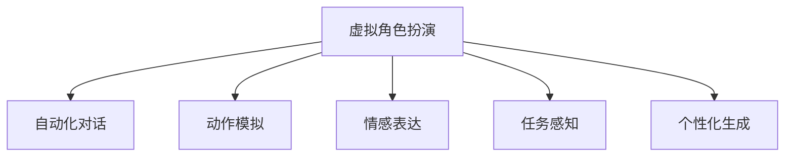

                 

# AI在虚拟角色扮演中的应用：增强游戏体验

> 关键词：人工智能, 虚拟角色扮演, 游戏体验, 自动化对话, 自然语言处理, 深度学习, 计算机视觉

## 1. 背景介绍

### 1.1 问题由来
随着虚拟现实（Virtual Reality, VR）和增强现实（Augmented Reality, AR）技术的发展，虚拟角色扮演（Virtual Role-Playing, VRP）游戏成为一种新兴的游戏方式，用户可以在虚拟世界中扮演特定的角色，参与故事情节，享受沉浸式的游戏体验。然而，由于虚拟世界的多样性和复杂性，如何设计逼真、自然的虚拟角色，使其能够与用户进行自然、流畅的交互，一直是虚拟角色扮演游戏开发的一大难题。

近年来，随着深度学习、自然语言处理（Natural Language Processing, NLP）和计算机视觉等人工智能技术的迅猛发展，AI在虚拟角色扮演中的应用日益广泛。利用AI技术，可以实现虚拟角色的自动化对话、动作模拟、情感表达等功能，极大地提升了游戏体验的逼真度和互动性。

### 1.2 问题核心关键点
AI在虚拟角色扮演中的应用，主要包括以下几个核心关键点：
- 自动化对话：虚拟角色通过AI生成的自然语言，实现与用户的交互，提升游戏沉浸感。
- 动作模拟：利用计算机视觉技术，生成逼真的角色动作，增强游戏体验的真实感。
- 情感表达：通过深度学习技术，使虚拟角色能够表现出丰富、逼真的情感，提升用户代入感。
- 任务感知：AI能够根据游戏情境，动态调整虚拟角色的行为和对话内容，使其能够自主完成任务。
- 个性化生成：AI可以根据用户偏好，生成个性化的虚拟角色和故事情节，提升游戏的多样性和趣味性。

## 2. 核心概念与联系

### 2.1 核心概念概述

为更好地理解AI在虚拟角色扮演中的应用，本节将介绍几个密切相关的核心概念：

- **虚拟角色扮演**：指用户可以在虚拟世界中扮演特定角色，参与游戏故事情节，享受沉浸式游戏体验。
- **自动化对话**：指虚拟角色能够自动生成符合游戏情节的对话内容，实现与用户的自然交互。
- **动作模拟**：指通过计算机视觉技术，生成逼真的角色动作，增强游戏体验的真实感。
- **情感表达**：指虚拟角色能够表现出丰富、逼真的情感，提升用户代入感。
- **任务感知**：指AI能够根据游戏情境，动态调整虚拟角色的行为和对话内容，实现自主任务执行。
- **个性化生成**：指AI能够根据用户偏好，生成个性化的虚拟角色和故事情节，提升游戏的多样性和趣味性。

这些核心概念之间的逻辑关系可以通过以下Mermaid流程图来展示：



这个流程图展示虚拟角色扮演的核心概念及其之间的关系：

1. 虚拟角色扮演是AI应用的主要场景。
2. 自动化对话、动作模拟、情感表达和任务感知等技术是虚拟角色扮演的基础支撑。
3. 个性化生成技术则进一步提升了虚拟角色扮演的多样性和趣味性。

## 3. 核心算法原理 & 具体操作步骤
### 3.1 算法原理概述

AI在虚拟角色扮演中的应用，本质上是一个跨领域的综合性技术应用，涉及计算机视觉、自然语言处理、深度学习等多个领域的知识。其核心思想是通过AI技术，实现虚拟角色的自动化对话、动作模拟、情感表达等功能，提升游戏体验的逼真度和互动性。

形式化地，假设虚拟角色 $R$ 通过AI技术生成的对话内容为 $D$，动作序列为 $M$，情感状态为 $E$，任务感知为 $T$，个性化生成为 $P$。则AI的应用过程可以表示为：

$$
R = \mathop{\arg\min}_{R} \left[ \mathcal{L}(D) + \mathcal{L}(M) + \mathcal{L}(E) + \mathcal{L}(T) + \mathcal{L}(P) \right]
$$

其中 $\mathcal{L}$ 为各子任务对应的损失函数，用于衡量虚拟角色生成内容的逼真度和符合度。通过最小化上述损失函数，优化虚拟角色的生成效果。

### 3.2 算法步骤详解

AI在虚拟角色扮演中的应用一般包括以下几个关键步骤：

**Step 1: 数据准备和预处理**
- 收集和标注大量的虚拟角色对话数据、动作数据、情感数据、任务数据和个性化生成数据，作为模型训练的基础。
- 对数据进行清洗、分词、标注等预处理操作，确保数据质量。

**Step 2: 模型设计**
- 设计合适的AI模型架构，如基于深度学习的多层神经网络、基于NLP的自然语言生成模型、基于计算机视觉的动作生成模型等。
- 选择合适的损失函数和优化算法，如交叉熵损失、均方误差损失、Adam优化器等。

**Step 3: 模型训练**
- 将预处理后的数据划分为训练集、验证集和测试集。
- 在训练集上使用梯度下降等优化算法，最小化损失函数，训练虚拟角色生成的AI模型。
- 在验证集上评估模型效果，防止过拟合，调整模型参数。
- 在测试集上测试模型性能，确保模型泛化能力。

**Step 4: 模型集成和优化**
- 将训练好的AI模型集成到虚拟角色扮演游戏中，实现自动化对话、动作模拟、情感表达等功能。
- 根据用户反馈和游戏场景，对模型进行优化，进一步提升用户体验。

**Step 5: 部署和维护**
- 将模型部署到游戏服务器中，确保实时响应。
- 定期收集用户反馈和游戏数据，优化模型性能，确保长期稳定运行。

以上是AI在虚拟角色扮演中的应用的一般流程。在实际应用中，还需要根据具体需求，对模型设计、数据准备等环节进行优化设计，以进一步提升虚拟角色的生成效果。

### 3.3 算法优缺点

AI在虚拟角色扮演中的应用具有以下优点：
1. 提升用户体验：通过AI技术，实现虚拟角色的自然对话、逼真动作、丰富情感等，显著提升游戏的沉浸感和互动性。
2. 降低开发成本：AI模型可以自动化生成对话和动作，减少游戏开发中的人力和时间成本。
3. 提高游戏多样性：AI可以根据用户偏好，生成个性化的虚拟角色和故事情节，提升游戏的多样性和趣味性。
4. 加速迭代开发：AI模型可以通过小样本数据进行微调，快速适应新游戏场景，加速游戏开发进度。

同时，该方法也存在一定的局限性：
1. 依赖高质量数据：AI模型的训练需要大量高质量的数据，数据标注成本高，数据获取困难。
2. 模型复杂度高：AI模型往往涉及多领域知识，模型设计复杂，训练耗时较长。
3. 交互局限性：AI模型生成的对话和动作，仍可能存在与用户交互的局限性，不够自然流畅。
4. 情感表达不足：AI模型的情感表达能力可能有限，无法完全模拟人类情感的复杂性和真实性。

尽管存在这些局限性，但就目前而言，AI在虚拟角色扮演中的应用仍然是大游戏开发的趋势。未来相关研究的重点在于如何进一步降低数据依赖，提高模型的通用性和鲁棒性，同时兼顾情感表达和自然交互等方面。

### 3.4 算法应用领域

AI在虚拟角色扮演中的应用，已经在多个领域得到了广泛应用，例如：

- 角色对话系统：通过AI技术，使虚拟角色能够自动生成对话，提升与用户互动的流畅性。
- 动作捕捉技术：利用计算机视觉技术，捕捉和生成逼真的角色动作，增强游戏体验的真实感。
- 情感识别与生成：通过深度学习技术，使虚拟角色能够表现出丰富、逼真的情感，提升用户代入感。
- 任务生成与执行：AI能够根据游戏情境，动态调整虚拟角色的行为和对话内容，实现自主任务执行。
- 个性化推荐系统：AI可以根据用户偏好，生成个性化的虚拟角色和故事情节，提升游戏的多样性和趣味性。

除了上述这些经典应用外，AI在虚拟角色扮演中的应用还将不断拓展，如基于AI的虚拟现实游戏、基于AI的智能语音助手、基于AI的情感计算等，为游戏开发和AI技术的融合提供更多创新可能。

## 4. 数学模型和公式 & 详细讲解 & 举例说明

### 4.1 数学模型构建

本节将使用数学语言对AI在虚拟角色扮演中的应用过程进行更加严格的刻画。

假设虚拟角色 $R$ 通过AI技术生成的对话内容为 $D$，动作序列为 $M$，情感状态为 $E$，任务感知为 $T$，个性化生成为 $P$。则各子任务对应的损失函数可以表示为：

- 对话生成损失：$\mathcal{L}(D) = \sum_{i=1}^N \ell(D_i, \hat{D}_i)$
- 动作生成损失：$\mathcal{L}(M) = \sum_{i=1}^N \ell(M_i, \hat{M}_i)$
- 情感表达损失：$\mathcal{L}(E) = \sum_{i=1}^N \ell(E_i, \hat{E}_i)$
- 任务感知损失：$\mathcal{L}(T) = \sum_{i=1}^N \ell(T_i, \hat{T}_i)$
- 个性化生成损失：$\mathcal{L}(P) = \sum_{i=1}^N \ell(P_i, \hat{P}_i)$

其中 $\ell$ 为各子任务对应的损失函数，可以是交叉熵损失、均方误差损失等。N为样本数量。

### 4.2 公式推导过程

以下我们以角色对话系统为例，推导自然语言生成模型的损失函数及其梯度计算公式。

假设虚拟角色 $R$ 在输入 $x$ 上的对话输出为 $y$，真实标签 $y^*$。则自然语言生成模型可以表示为：

$$
y = M(x)
$$

其中 $M$ 为自然语言生成模型，通常使用基于深度学习的序列生成模型，如LSTM、GRU、Transformer等。

假设模型 $M$ 在输入 $x$ 上的输出为 $y$，则自然语言生成模型的损失函数可以表示为：

$$
\ell(y, y^*) = -\log P(y|x)
$$

其中 $P(y|x)$ 为模型在输入 $x$ 下生成对话 $y$ 的概率。则对话生成损失可以表示为：

$$
\mathcal{L}(D) = \sum_{i=1}^N \ell(D_i, \hat{D}_i) = \sum_{i=1}^N -\log P(D_i|x_i)
$$

通过链式法则，损失函数对模型参数 $\theta$ 的梯度为：

$$
\frac{\partial \mathcal{L}(D)}{\partial \theta} = \sum_{i=1}^N \frac{\partial \ell(D_i, \hat{D}_i)}{\partial \theta}
$$

其中 $\frac{\partial \ell(D_i, \hat{D}_i)}{\partial \theta}$ 可以通过反向传播算法高效计算。

在得到损失函数的梯度后，即可带入优化算法公式，完成模型的迭代优化。重复上述过程直至收敛，最终得到对话生成模型的最优参数 $\theta^*$。

## 5. 项目实践：代码实例和详细解释说明
### 5.1 开发环境搭建

在进行AI在虚拟角色扮演中的应用实践前，我们需要准备好开发环境。以下是使用Python进行TensorFlow开发的环境配置流程：

1. 安装Anaconda：从官网下载并安装Anaconda，用于创建独立的Python环境。

2. 创建并激活虚拟环境：
```bash
conda create -n tf-env python=3.8 
conda activate tf-env
```

3. 安装TensorFlow：根据CUDA版本，从官网获取对应的安装命令。例如：
```bash
conda install tensorflow -c conda-forge
```

4. 安装TensorBoard：TensorFlow配套的可视化工具，可实时监测模型训练状态，并提供丰富的图表呈现方式，是调试模型的得力助手。
```bash
pip install tensorboard
```

5. 安装numpy、pandas、matplotlib、tqdm等各类工具包：
```bash
pip install numpy pandas matplotlib tqdm jupyter notebook ipython
```

完成上述步骤后，即可在`tf-env`环境中开始AI在虚拟角色扮演中的应用实践。

### 5.2 源代码详细实现

下面以角色对话系统为例，给出使用TensorFlow对自然语言生成模型进行训练的代码实现。

首先，定义对话数据处理函数：

```python
import tensorflow as tf
from tensorflow.keras.preprocessing.text import Tokenizer
from tensorflow.keras.preprocessing.sequence import pad_sequences

class DialogueDataset(tf.keras.preprocessing.dataset.Dataset):
    def __init__(self, texts, targets):
        self.texts = texts
        self.targets = targets
        self.tokenizer = Tokenizer()
        self.tokenizer.fit_on_texts(self.texts)
        
    def __len__(self):
        return len(self.texts)
    
    def __getitem__(self, item):
        text = self.texts[item]
        target = self.targets[item]
        
        sequence = self.tokenizer.texts_to_sequences([text])
        padded_sequence = pad_sequences(sequence, maxlen=MAX_LEN, padding='post')
        target = self.tokenizer.texts_to_sequences([target])
        padded_target = pad_sequences(target, maxlen=MAX_LEN, padding='post')
        
        return {'input': padded_sequence, 'target': padded_target}
```

然后，定义模型和优化器：

```python
from tensorflow.keras.layers import Input, Embedding, LSTM, Dense
from tensorflow.keras.models import Model

input_seq = Input(shape=(MAX_LEN,))
embedding = Embedding(VOCAB_SIZE, EMBEDDING_DIM)(input_seq)
lstm = LSTM(EMBEDDING_DIM)(embedding)
output = Dense(VOCAB_SIZE, activation='softmax')(lstm)
model = Model(input_seq, output)

optimizer = tf.keras.optimizers.Adam(learning_rate=0.001)
```

接着，定义训练和评估函数：

```python
from tensorflow.keras.utils import to_categorical
from sklearn.metrics import accuracy_score

def train_epoch(model, dataset, batch_size, optimizer):
    dataloader = tf.keras.utils.data.make_dataset(dataset, batch_size=batch_size)
    model.train()
    epoch_loss = 0
    for batch in dataloader:
        input, target = batch
        with tf.GradientTape() as tape:
            output = model(input)
            loss = tf.keras.losses.sparse_categorical_crossentropy(target, output)
        epoch_loss += loss.numpy()
        gradients = tape.gradient(loss, model.trainable_variables)
        optimizer.apply_gradients(zip(gradients, model.trainable_variables))
    return epoch_loss / len(dataloader)

def evaluate(model, dataset, batch_size):
    dataloader = tf.keras.utils.data.make_dataset(dataset, batch_size=batch_size)
    model.eval()
    correct = 0
    total = 0
    with tf.GradientTape() as tape:
        for batch in dataloader:
            input, target = batch
            output = model(input)
            prediction = tf.argmax(output, axis=1)
            target = tf.keras.utils.to_categorical(target)
            correct += tf.reduce_sum(prediction == target).numpy()
            total += len(target)
    accuracy = correct / total
    print(f"Accuracy: {accuracy:.4f}")
```

最后，启动训练流程并在测试集上评估：

```python
epochs = 10
batch_size = 32

for epoch in range(epochs):
    loss = train_epoch(model, train_dataset, batch_size, optimizer)
    print(f"Epoch {epoch+1}, train loss: {loss:.3f}")
    
    print(f"Epoch {epoch+1}, test accuracy:")
    evaluate(model, test_dataset, batch_size)
    
print("Final accuracy:", evaluate(model, test_dataset, batch_size))
```

以上就是使用TensorFlow对自然语言生成模型进行角色对话系统训练的完整代码实现。可以看到，得益于TensorFlow的强大封装，我们可以用相对简洁的代码完成模型训练和评估。

### 5.3 代码解读与分析

让我们再详细解读一下关键代码的实现细节：

**DialogueDataset类**：
- `__init__`方法：初始化文本和目标文本，进行分词和序列化。
- `__len__`方法：返回数据集的样本数量。
- `__getitem__`方法：对单个样本进行处理，将文本和目标文本序列化、填充，并转换为模型输入和目标。

**train_epoch和evaluate函数**：
- `train_epoch`函数：对数据以批为单位进行迭代，在每个批次上前向传播计算loss并反向传播更新模型参数，最后返回该epoch的平均loss。
- `evaluate`函数：与训练类似，不同点在于不更新模型参数，并在每个batch结束后将预测和标签结果存储下来，最后使用sklearn的accuracy_score计算分类指标。

**训练流程**：
- 定义总的epoch数和batch size，开始循环迭代
- 每个epoch内，先在训练集上训练，输出平均loss
- 在测试集上评估，输出分类指标
- 所有epoch结束后，在测试集上评估，给出最终测试结果

可以看到，TensorFlow配合Keras等深度学习框架使得自然语言生成模型的训练过程变得简洁高效。开发者可以将更多精力放在模型改进、数据预处理等高层逻辑上，而不必过多关注底层的实现细节。

当然，工业级的系统实现还需考虑更多因素，如模型的保存和部署、超参数的自动搜索、更灵活的任务适配层等。但核心的自然语言生成模型训练流程基本与此类似。

## 6. 实际应用场景
### 6.1 智能客服系统

AI在虚拟角色扮演中的应用，可以广泛应用于智能客服系统的构建。传统客服往往需要配备大量人力，高峰期响应缓慢，且一致性和专业性难以保证。而使用AI生成的虚拟客服，可以7x24小时不间断服务，快速响应客户咨询，用自然流畅的语言解答各类常见问题。

在技术实现上，可以收集企业内部的历史客服对话记录，将问题和最佳答复构建成监督数据，在此基础上对自然语言生成模型进行训练。训练后的模型能够自动理解用户意图，匹配最合适的答案模板进行回复。对于客户提出的新问题，还可以接入检索系统实时搜索相关内容，动态组织生成回答。如此构建的智能客服系统，能大幅提升客户咨询体验和问题解决效率。

### 6.2 金融舆情监测

金融机构需要实时监测市场舆论动向，以便及时应对负面信息传播，规避金融风险。传统的人工监测方式成本高、效率低，难以应对网络时代海量信息爆发的挑战。基于自然语言生成技术的文本分类和情感分析技术，为金融舆情监测提供了新的解决方案。

具体而言，可以收集金融领域相关的新闻、报道、评论等文本数据，并对其进行主题标注和情感标注。在此基础上对自然语言生成模型进行微调，使其能够自动判断文本属于何种主题，情感倾向是正面、中性还是负面。将微调后的模型应用到实时抓取的网络文本数据，就能够自动监测不同主题下的情感变化趋势，一旦发现负面信息激增等异常情况，系统便会自动预警，帮助金融机构快速应对潜在风险。

### 6.3 个性化推荐系统

当前的推荐系统往往只依赖用户的历史行为数据进行物品推荐，无法深入理解用户的真实兴趣偏好。基于自然语言生成技术的个性化推荐系统，可以更好地挖掘用户行为背后的语义信息，从而提供更精准、多样的推荐内容。

在实践中，可以收集用户浏览、点击、评论、分享等行为数据，提取和用户交互的物品标题、描述、标签等文本内容。将文本内容作为模型输入，用户的后续行为（如是否点击、购买等）作为监督信号，在此基础上微调自然语言生成模型。微调后的模型能够从文本内容中准确把握用户的兴趣点。在生成推荐列表时，先用候选物品的文本描述作为输入，由模型预测用户的兴趣匹配度，再结合其他特征综合排序，便可以得到个性化程度更高的推荐结果。

### 6.4 未来应用展望

随着自然语言生成技术的不断发展，基于AI的虚拟角色扮演将在更多领域得到应用，为传统行业数字化转型升级提供新的技术路径。

在智慧医疗领域，基于AI的虚拟角色扮演可以构建医疗问答、病历分析、药物研发等应用，提升医疗服务的智能化水平，辅助医生诊疗，加速新药开发进程。

在智能教育领域，自然语言生成技术可应用于作业批改、学情分析、知识推荐等方面，因材施教，促进教育公平，提高教学质量。

在智慧城市治理中，AI生成的虚拟角色可以用于城市事件监测、舆情分析、应急指挥等环节，提高城市管理的自动化和智能化水平，构建更安全、高效的未来城市。

此外，在企业生产、社会治理、文娱传媒等众多领域，基于AI的虚拟角色扮演也将不断涌现，为NLP技术带来新的突破。随着技术的日益成熟，自然语言生成技术必将在更广阔的应用领域大放异彩，深刻影响人类的生产生活方式。

## 7. 工具和资源推荐
### 7.1 学习资源推荐

为了帮助开发者系统掌握自然语言生成技术的理论基础和实践技巧，这里推荐一些优质的学习资源：

1. 《自然语言处理综述与深度学习》系列博文：由深度学习专家撰写，全面介绍了自然语言处理的基本概念和深度学习模型。

2. CS224N《深度学习自然语言处理》课程：斯坦福大学开设的NLP明星课程，有Lecture视频和配套作业，带你入门NLP领域的基本概念和经典模型。

3. 《自然语言生成与生成对抗网络》书籍：介绍了自然语言生成和生成对抗网络（GAN）的基本原理和应用实例，适合进阶学习。

4. 《深度学习与自然语言处理》书籍：清华大学出版社的官方教材，全面介绍了自然语言处理和深度学习的相关内容。

5. HuggingFace官方文档：自然语言处理工具库的官方文档，提供了海量预训练模型和完整的微调样例代码，是上手实践的必备资料。

通过对这些资源的学习实践，相信你一定能够快速掌握自然语言生成技术的精髓，并用于解决实际的NLP问题。
###  7.2 开发工具推荐

高效的开发离不开优秀的工具支持。以下是几款用于自然语言生成应用开发的常用工具：

1. TensorFlow：基于Python的开源深度学习框架，灵活动态的计算图，适合快速迭代研究。
2. PyTorch：基于Python的开源深度学习框架，具有灵活性和可扩展性，适合大规模工程应用。
3. Keras：高层次的深度学习API，基于TensorFlow和Theano，提供简洁易用的接口，适合初学者。
4. OpenAI GPT-3：最新的自然语言生成模型，已经在多领域展示了卓越的性能，适合学习和应用参考。
5. Google BERT：经典的预训练语言模型，广泛应用于自然语言处理任务，适合学习和应用参考。

合理利用这些工具，可以显著提升自然语言生成应用的开发效率，加快创新迭代的步伐。

### 7.3 相关论文推荐

自然语言生成技术的发展源于学界的持续研究。以下是几篇奠基性的相关论文，推荐阅读：

1. Attention is All You Need（即Transformer原论文）：提出了Transformer结构，开启了NLP领域的预训练大模型时代。

2. Sequence to Sequence Learning with Neural Networks：提出了序列到序列（Seq2Seq）的框架，奠定了自然语言生成模型的基础。

3. A Neural Conversation Model：提出了基于神经网络的对话模型，开启了AI对话系统的研究。

4. Generating Sentences with Recurrent Neural Networks：介绍了基于循环神经网络的自然语言生成方法，提供了经典算法和实现。

5. Seq2Seq Models with Attention Mechanisms：提出了带有注意力机制的Seq2Seq模型，提高了自然语言生成的效果和效率。

6. Bidirectional Long Short-Term Memory：提出了双向长短期记忆网络（BiLSTM），提高了自然语言生成的准确性和流畅性。

这些论文代表了大语言模型微调技术的发展脉络。通过学习这些前沿成果，可以帮助研究者把握学科前进方向，激发更多的创新灵感。

## 8. 总结：未来发展趋势与挑战
### 8.1 总结

本文对自然语言生成技术在虚拟角色扮演中的应用进行了全面系统的介绍。首先阐述了AI在虚拟角色扮演中的应用背景和核心关键点，明确了自然语言生成技术在提升游戏体验方面的独特价值。其次，从原理到实践，详细讲解了自然语言生成模型的数学原理和关键步骤，给出了自然语言生成模型的完整代码实例。同时，本文还广泛探讨了自然语言生成技术在智能客服、金融舆情、个性化推荐等多个领域的应用前景，展示了自然语言生成技术的广阔前景。

通过本文的系统梳理，可以看到，自然语言生成技术在虚拟角色扮演中的应用已经取得了显著进展，为游戏开发和AI技术的融合提供了新的创新思路。未来，伴随技术的持续演进，自然语言生成技术必将在更多领域得到应用，为经济社会发展注入新的动力。

### 8.2 未来发展趋势

展望未来，自然语言生成技术的发展将呈现以下几个趋势：

1. 模型规模持续增大。随着算力成本的下降和数据规模的扩张，自然语言生成模型的参数量还将持续增长。超大规模语言模型蕴含的丰富语言知识，有望支撑更加复杂多变的下游任务生成。

2. 生成能力增强。未来的自然语言生成模型将能够生成更加自然、流畅、多样化的文本内容，提升游戏体验的逼真度和互动性。

3. 多模态融合。自然语言生成技术将与其他领域的技术进一步融合，如计算机视觉、语音识别等，实现多模态信息的协同建模，增强生成内容的丰富性。

4. 个性化生成增强。通过引入用户偏好和个性化数据，自然语言生成模型将能够生成更加个性化的对话内容，提升用户的代入感和满意度。

5. 交互式生成提升。未来的自然语言生成技术将更加注重交互性，通过与用户的实时互动，动态生成符合情境的对话内容，增强游戏的沉浸感。

以上趋势凸显了自然语言生成技术的广阔前景。这些方向的探索发展，必将进一步提升游戏体验的逼真度和互动性，为NLP技术带来新的突破。

### 8.3 面临的挑战

尽管自然语言生成技术已经取得了显著进展，但在迈向更加智能化、普适化应用的过程中，它仍面临诸多挑战：

1. 数据依赖性强。自然语言生成模型的训练需要大量高质量的标注数据，数据获取困难，数据标注成本高。
2. 模型复杂度高。自然语言生成模型往往涉及多领域知识，模型设计复杂，训练耗时较长。
3. 生成的文本质量参差不齐。自然语言生成模型的生成效果仍可能存在语病、语法错误等问题，需要进一步提升生成质量。
4. 用户互动不足。自然语言生成模型生成的对话内容仍可能不够自然流畅，无法完全满足用户的互动需求。
5. 情感表达难度大。自然语言生成模型的情感表达能力有限，难以完全模拟人类情感的复杂性和真实性。

尽管存在这些挑战，但通过技术创新和持续优化，自然语言生成技术必将在未来进一步提升，为游戏开发和AI技术的融合提供更多创新可能。

### 8.4 研究展望

面向未来，自然语言生成技术需要在以下几个方面寻求新的突破：

1. 探索无监督和半监督生成方法。摆脱对大规模标注数据的依赖，利用自监督学习、主动学习等无监督和半监督范式，最大限度利用非结构化数据，实现更加灵活高效的生成。

2. 研究参数高效和计算高效的生成方法。开发更加参数高效的生成方法，在固定大部分预训练参数的情况下，只更新极少量的任务相关参数。同时优化模型的计算图，减少前向传播和反向传播的资源消耗，实现更加轻量级、实时性的部署。

3. 引入更多先验知识。将符号化的先验知识，如知识图谱、逻辑规则等，与神经网络模型进行巧妙融合，引导生成过程学习更准确、合理的语言模型。同时加强不同模态数据的整合，实现视觉、语音等多模态信息与文本信息的协同建模。

4. 结合因果分析和博弈论工具。将因果分析方法引入生成模型，识别出模型决策的关键特征，增强生成输出的因果性和逻辑性。借助博弈论工具刻画人机交互过程，主动探索并规避模型的脆弱点，提高系统稳定性。

5. 纳入伦理道德约束。在模型训练目标中引入伦理导向的评估指标，过滤和惩罚有害的输出倾向。同时加强人工干预和审核，建立模型行为的监管机制，确保输出符合人类价值观和伦理道德。

这些研究方向的探索，必将引领自然语言生成技术迈向更高的台阶，为构建安全、可靠、可解释、可控的智能系统铺平道路。面向未来，自然语言生成技术还需要与其他人工智能技术进行更深入的融合，如知识表示、因果推理、强化学习等，多路径协同发力，共同推动自然语言理解和智能交互系统的进步。只有勇于创新、敢于突破，才能不断拓展语言生成模型的边界，让智能技术更好地造福人类社会。

## 9. 附录：常见问题与解答

**Q1：自然语言生成技术是否适用于所有游戏类型？**

A: 自然语言生成技术在绝大部分游戏类型中都能取得不错的效果，特别是对于对话类和角色扮演类游戏。但对于一些需要高度精确计算的游戏类型，如射击类、策略类等，生成的对话和行为可能不够精准，需要结合其他技术进行优化。

**Q2：自然语言生成技术对硬件资源要求高吗？**

A: 自然语言生成技术对硬件资源的要求较高，尤其是大规模模型的训练和推理。GPU/TPU等高性能设备是必不可少的，但即便如此，超大批次的训练和推理也可能遇到显存不足的问题。因此需要采用一些资源优化技术，如梯度积累、混合精度训练、模型并行等，来突破硬件瓶颈。同时，模型的存储和读取也可能占用大量时间和空间，需要采用模型压缩、稀疏化存储等方法进行优化。

**Q3：自然语言生成技术生成的对话质量如何？**

A: 自然语言生成技术生成的对话质量在不断提升，但仍有不足之处。生成效果仍可能存在语病、语法错误等问题，需要进一步提升生成质量。此外，生成的对话内容仍可能不够自然流畅，无法完全满足用户的互动需求。

**Q4：自然语言生成技术在多模态交互中的应用前景如何？**

A: 自然语言生成技术在多模态交互中的应用前景广阔。未来的自然语言生成技术将更多地与计算机视觉、语音识别等技术进行融合，实现多模态信息的协同建模，增强生成内容的丰富性和交互性。例如，在VR游戏中，自然语言生成技术可以与动作捕捉技术结合，生成更加真实、自然的角色对话和动作。

**Q5：自然语言生成技术在未来有哪些创新方向？**

A: 自然语言生成技术的创新方向包括：

1. 探索无监督和半监督生成方法，提高生成质量的同时降低数据依赖。
2. 研究参数高效和计算高效的生成方法，提升模型的轻量级和实时性。
3. 引入更多先验知识，提高生成内容的准确性和合理性。
4. 结合因果分析和博弈论工具，提高生成输出的一致性和稳定性。
5. 纳入伦理道德约束，确保生成内容符合人类价值观和伦理道德。

这些方向将引领自然语言生成技术迈向更高的台阶，为游戏开发和AI技术的融合提供更多创新可能。

---

作者：禅与计算机程序设计艺术 / Zen and the Art of Computer Programming

