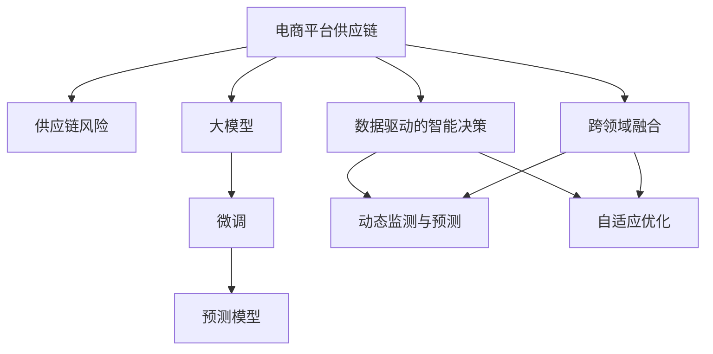

                 

# AI大模型在电商平台供应链风险预警中的应用

> 关键词：AI大模型, 供应链风险预警, 电商平台, 机器学习, 数据挖掘, 预测模型, 业务智能

## 1. 背景介绍

### 1.1 问题由来

随着电子商务的快速发展，电商平台的规模和复杂度迅速上升，供应链管理成为平台运营的重要环节。然而，供应链的复杂性和不确定性，使得风险预警成为电商平台亟需解决的问题。传统的基于规则和专家知识的供应链风险预警方法，难以应对快速变化的市场环境，且易受人为因素影响。

大模型技术为解决这一问题提供了新的解决方案。大模型经过大规模语料库的预训练，具备了强大的数据处理和模式识别能力。通过将其应用于电商平台供应链数据的分析，可以发现潜在的风险因素，并提前采取应对措施，降低运营风险。

### 1.2 问题核心关键点

大模型在电商平台供应链风险预警中的应用，主要集中在以下几个核心关键点：

- **数据驱动的智能决策**：大模型能够处理海量数据，从中提取有价值的模式和特征，辅助决策。
- **动态监测与预测**：大模型可以实时监测供应链变化，预测潜在的风险点，提供及时预警。
- **自适应优化**：大模型能够不断学习新的数据，调整模型参数，适应市场的动态变化。
- **跨领域融合**：大模型能够整合不同领域的知识，如物流、库存、需求预测等，提升预测的全面性和准确性。
- **业务智能增强**：大模型能够提升业务决策的智能化水平，辅助管理人员快速识别和解决风险。

这些关键点体现了大模型在电商平台供应链风险预警中的独特优势，有助于提升供应链的透明度和稳定性。

### 1.3 问题研究意义

研究大模型在电商平台供应链风险预警中的应用，对于电商平台优化供应链管理、降低运营成本、提升用户体验，具有重要意义：

- **提高决策效率**：大模型能够快速处理大量数据，提供智能化的风险预警建议，帮助管理人员快速做出决策。
- **降低运营成本**：及时发现和处理供应链风险，减少因延误或错判造成的损失，降低运营成本。
- **提升用户体验**：通过优化供应链管理，减少物流延误、库存短缺等问题，提升用户满意度。
- **推动技术创新**：结合大数据、机器学习等前沿技术，推动电商平台供应链管理的数字化转型。
- **赋能行业升级**：为传统零售行业提供智能化升级方案，提升供应链管理的自动化和智能化水平。

## 2. 核心概念与联系

### 2.1 核心概念概述

为更好地理解大模型在电商平台供应链风险预警中的应用，本节将介绍几个密切相关的核心概念：

- **电商平台供应链**：指电商平台上商品从采购到配送的全流程管理，包括物流、库存、仓储、配送等环节。
- **供应链风险**：指供应链运行中可能出现的各种不确定性和中断事件，如物流延误、库存不足、需求波动等。
- **大模型**：以自回归(如GPT)或自编码(如BERT)模型为代表的大规模预训练语言模型。通过在大规模无标签文本语料上进行预训练，学习通用的语言表示，具备强大的语言理解和生成能力。
- **微调**：指在预训练模型的基础上，使用下游任务的少量标注数据，通过有监督地训练来优化模型在该任务上的性能。
- **预测模型**：通过训练数据，学习输入和输出之间的关系，用于进行未来数据的预测和分类。

这些核心概念之间的逻辑关系可以通过以下Mermaid流程图来展示：



这个流程图展示了大模型在电商平台供应链风险预警中的核心概念及其之间的关系：

1. 电商平台的供应链是大模型分析的主要对象。
2. 供应链风险是需要预测和预警的关键内容。
3. 大模型通过微调技术，提升了预测模型的性能。
4. 数据驱动的智能决策、动态监测与预测、自适应优化、跨领域融合等技术，共同构成预警系统。

这些概念共同构成了电商平台供应链风险预警的框架，为大模型技术的应用提供了明确的指导。

## 3. 核心算法原理 & 具体操作步骤
### 3.1 算法原理概述

大模型在电商平台供应链风险预警中的应用，主要基于预测模型的训练和优化。其核心思想是：将大模型视作强大的特征提取器，通过在供应链相关数据上进行有监督的微调，学习到供应链中各环节的关联关系，从而对供应链风险进行预测和预警。

形式化地，假设电商平台供应链数据为 $D=\{(x_i, y_i)\}_{i=1}^N$，其中 $x_i$ 为供应链相关特征向量，$y_i$ 为风险标签（如0表示未风险，1表示风险）。大模型的预测模型 $M_{\theta}$ 通过最小化损失函数 $\mathcal{L}(M_{\theta},D)$，来优化模型参数 $\theta$，使得模型能够准确预测供应链风险：

$$
\theta^* = \mathop{\arg\min}_{\theta} \mathcal{L}(M_{\theta},D)
$$

其中 $\mathcal{L}$ 为风险预测任务定义的损失函数，用于衡量模型预测输出与真实标签之间的差异。

### 3.2 算法步骤详解

基于大模型在电商平台供应链风险预警中的应用，具体的微调过程包括以下几个关键步骤：

**Step 1: 准备数据集和模型**
- 收集电商平台供应链的历史数据，包括订单信息、物流数据、库存数据等，划分为训练集、验证集和测试集。
- 选择合适的预训练大模型（如BERT、GPT等）作为初始化参数。

**Step 2: 设计风险预测模型**
- 根据具体应用场景，选择合适的预测模型结构，如线性回归、神经网络、集成模型等。
- 确定模型输入和输出，将供应链相关特征作为输入，风险标签作为输出。
- 选择适合的损失函数，如均方误差、交叉熵等。

**Step 3: 微调预测模型**
- 使用训练集数据对预测模型进行微调，优化模型参数，最小化损失函数。
- 在验证集上评估模型性能，调整模型参数，防止过拟合。
- 在测试集上最终评估模型预测效果，验证模型的泛化能力。

**Step 4: 应用风险预警**
- 根据微调后的预测模型，对供应链当前数据进行实时预测，判别风险等级。
- 结合实时数据和历史数据，综合评估供应链风险，生成预警信息。
- 通过可视化工具，将预警信息展示给供应链管理人员，辅助决策。

### 3.3 算法优缺点

大模型在电商平台供应链风险预警中的应用具有以下优点：

- **预测精度高**：大模型具备强大的数据处理能力，能够学习到供应链各环节之间的复杂关系，预测结果准确性较高。
- **适应性强**：大模型能够根据实时数据进行自适应优化，灵活应对市场变化。
- **数据利用充分**：大模型能够处理多模态数据，如文本、图像、时间序列等，充分利用供应链的多维信息。
- **可扩展性强**：大模型能够通过不断微调和学习新数据，提升预测模型的性能。

同时，该方法也存在一些局限性：

- **数据质量要求高**：预测模型的效果高度依赖于供应链数据的完整性和准确性，数据质量问题可能导致误判。
- **模型复杂度大**：大模型参数量巨大，训练和推理过程较为复杂，对算力和存储资源要求较高。
- **解释性不足**：大模型作为黑盒模型，缺乏对预测结果的直观解释，难以进行模型调试和优化。
- **隐私和伦理问题**：供应链数据涉及用户隐私和商业机密，如何在保护隐私的前提下进行预测，是一个重要挑战。

尽管存在这些局限性，但就目前而言，基于大模型的风险预警方法仍然是大数据技术在供应链领域应用的重要手段。未来相关研究的重点在于如何进一步提升模型的可解释性，降低数据质量对预测结果的影响，同时兼顾隐私保护和数据安全。

### 3.4 算法应用领域

大模型在电商平台供应链风险预警中的应用，已在多个行业得到了广泛应用，具体如下：

- **物流配送**：预测物流配送中的延误、损毁等问题，优化配送路径，降低配送成本。
- **库存管理**：预测库存不足、积压等风险，调整库存策略，提升库存利用率。
- **需求预测**：预测市场需求变化，平衡供需关系，减少库存压力。
- **供应链监控**：实时监测供应链关键指标，及时发现异常，避免延误和风险。
- **安全管理**：预测供应链中的安全漏洞和风险，提前采取防范措施。

除了这些核心应用外，大模型还被创新性地应用到更多场景中，如异常检测、智能推荐、风险评估等，为电商平台供应链管理带来了新的突破。

## 4. 数学模型和公式 & 详细讲解  
### 4.1 数学模型构建

本节将使用数学语言对大模型在电商平台供应链风险预警中的应用进行更加严格的刻画。

假设电商平台供应链数据为 $D=\{(x_i, y_i)\}_{i=1}^N, x_i \in \mathbb{R}^d$，其中 $x_i$ 为供应链相关特征向量，$y_i \in \{0,1\}$ 为风险标签。大模型的预测模型 $M_{\theta}$ 通过最小化损失函数 $\mathcal{L}(M_{\theta},D)$ 来优化模型参数 $\theta$，其中：

$$
\mathcal{L}(M_{\theta},D) = \frac{1}{N}\sum_{i=1}^N \ell(M_{\theta}(x_i),y_i)
$$

其中 $\ell$ 为预测模型的损失函数，如均方误差、交叉熵等。大模型的预测模型一般采用神经网络结构，输出为预测值 $\hat{y}_i=M_{\theta}(x_i)$，风险标签为 $y_i$。

### 4.2 公式推导过程

以下我们以线性回归模型为例，推导供应链风险预测的损失函数及其梯度的计算公式。

假设预测模型为 $M_{\theta}(x) = \theta^T x + b$，其中 $\theta \in \mathbb{R}^d$ 为模型参数，$b$ 为截距。风险标签 $y \in \{0,1\}$。则均方误差损失函数为：

$$
\ell(M_{\theta}(x),y) = \frac{1}{2}\left(y-\hat{y}\right)^2
$$

将上述损失函数代入经验风险公式，得：

$$
\mathcal{L}(\theta) = \frac{1}{N}\sum_{i=1}^N \frac{1}{2}\left(y_i-\hat{y}_i\right)^2
$$

根据链式法则，损失函数对参数 $\theta_k$ 的梯度为：

$$
\frac{\partial \mathcal{L}(\theta)}{\partial \theta_k} = -\frac{1}{N}\sum_{i=1}^N (y_i-\hat{y}_i) x_{i,k}
$$

其中 $x_{i,k}$ 为特征向量 $x_i$ 中第 $k$ 维特征。

在得到损失函数的梯度后，即可带入参数更新公式，完成模型的迭代优化。重复上述过程直至收敛，最终得到适应电商平台供应链的预测模型。

## 5. 项目实践：代码实例和详细解释说明
### 5.1 开发环境搭建

在进行微调实践前，我们需要准备好开发环境。以下是使用Python进行TensorFlow开发的环境配置流程：

1. 安装Anaconda：从官网下载并安装Anaconda，用于创建独立的Python环境。

2. 创建并激活虚拟环境：
```bash
conda create -n tf-env python=3.8 
conda activate tf-env
```

3. 安装TensorFlow：根据CUDA版本，从官网获取对应的安装命令。例如：
```bash
conda install tensorflow -c pytorch -c conda-forge
```

4. 安装各类工具包：
```bash
pip install numpy pandas scikit-learn matplotlib tqdm jupyter notebook ipython
```

完成上述步骤后，即可在`tf-env`环境中开始微调实践。

### 5.2 源代码详细实现

下面我以电商平台供应链物流配送风险预测为例，给出使用TensorFlow对大模型进行微调的Python代码实现。

首先，定义供应链物流配送数据处理函数：

```python
import tensorflow as tf
from tensorflow.keras import layers, models

def prepare_data(data_path):
    # 读取供应链数据
    data = pd.read_csv(data_path)
    # 特征工程，将日期类型转换为时间戳，编码分类特征等
    # ...
    # 分割数据集为训练集、验证集和测试集
    train_data, dev_data, test_data = train_test_split(data, test_size=0.2, random_state=42)
    train_data, val_data = train_test_split(train_data, test_size=0.2, random_state=42)
    # 将数据转换为TensorFlow可处理的格式
    # ...
    return train_data, dev_data, test_data

# 定义特征工程函数
def process_features(data):
    # 对数据进行特征工程，如日期特征编码、分类特征独热编码等
    # ...
    return processed_data

# 定义模型结构
def build_model(input_shape):
    model = models.Sequential([
        layers.Dense(64, activation='relu', input_shape=input_shape),
        layers.Dense(32, activation='relu'),
        layers.Dense(1, activation='sigmoid')
    ])
    return model

# 定义损失函数和优化器
def compile_model(model):
    model.compile(optimizer=tf.keras.optimizers.Adam(learning_rate=0.001),
                  loss='binary_crossentropy',
                  metrics=['accuracy'])

# 定义评估函数
def evaluate_model(model, data):
    # 在数据集上评估模型性能
    # ...
    return model.evaluate(data)
```

然后，定义训练和评估函数：

```python
from sklearn.metrics import classification_report
from tensorflow.keras.callbacks import EarlyStopping

def train_model(model, train_data, dev_data, epochs=10, batch_size=32):
    # 训练模型
    model.fit(train_data, epochs=epochs, batch_size=batch_size,
              validation_data=dev_data, callbacks=[EarlyStopping(patience=3)])
    # 在验证集上评估模型性能
    dev_loss, dev_acc = model.evaluate(dev_data)
    print('Validation loss:', dev_loss)
    print('Validation accuracy:', dev_acc)

# 启动训练流程并在测试集上评估
train_data, dev_data, test_data = prepare_data('data.csv')
model = build_model(input_shape)
compile_model(model)
train_model(model, train_data, dev_data)
evaluate_model(model, test_data)
```

以上就是使用TensorFlow对供应链物流配送风险预测模型进行微调的完整代码实现。可以看到，得益于TensorFlow的强大封装，我们可以用相对简洁的代码完成模型的训练和评估。

### 5.3 代码解读与分析

让我们再详细解读一下关键代码的实现细节：

**prepare_data函数**：
- 定义了数据读取和预处理的过程，包括特征工程和数据分割。
- 使用Pandas库读取供应链数据，进行必要的特征工程处理，如时间戳编码、分类特征独热编码等。
- 使用train_test_split将数据集划分为训练集、验证集和测试集，供模型训练和评估使用。

**process_features函数**：
- 在特征工程中，对供应链数据进行必要的预处理，如时间戳编码、类别特征编码等。
- 具体实现过程中，需要根据数据集的特点进行相应处理，确保特征的稳定性和可解释性。

**build_model函数**：
- 定义了供应链物流配送风险预测模型的结构。
- 模型一般采用多层感知器(MLP)结构，以两个隐藏层和输出层组成。
- 输出层采用sigmoid激活函数，用于二分类任务。

**compile_model函数**：
- 定义了模型的优化器、损失函数和评估指标。
- 使用Adam优化器，设定较小的学习率，以防止梯度消失和过拟合问题。
- 采用二分类交叉熵损失函数，用于计算模型预测与真实标签之间的差异。

**train_model函数**：
- 启动模型训练流程，设定训练轮数和批次大小。
- 使用EarlyStopping回调，一旦模型连续多个epoch未提升，即停止训练，防止过拟合。
- 在验证集上评估模型性能，输出验证集的损失和准确率。

**evaluate_model函数**：
- 定义了在测试集上的模型评估函数。
- 使用TensorFlow的evaluate函数，计算模型在测试集上的损失和准确率。
- 返回模型在测试集上的评估结果。

通过以上代码实现，可以看出，TensorFlow提供了一系列的高级API，使得模型构建和训练过程变得更加便捷和高效。开发者只需关注核心算法和业务逻辑，即可快速实现供应链风险预警系统。

## 6. 实际应用场景

### 6.1 智能库存管理

电商平台供应链中的库存管理是大模型应用的典型场景。通过大模型的预测模型，可以实时监测库存水平，预测未来的需求变化，提前调整库存策略，减少库存积压和缺货现象。

在实践中，可以收集电商平台的订单数据、物流数据和销售数据，作为供应链风险的输入特征。通过大模型对这些特征进行训练，得到一个供应链风险预测模型。该模型能够实时预测未来的库存需求，并生成预警信息，辅助管理人员及时调整库存。

### 6.2 物流配送优化

物流配送是电商平台供应链管理的另一个重要环节。物流配送中的延误、损毁等问题，不仅影响用户体验，还会带来额外的运营成本。通过大模型进行风险预警，可以及时发现和处理这些问题，优化配送路径和资源配置。

具体而言，可以收集物流配送的各类数据，如配送时间、位置、货物状态等，作为供应链风险的输入特征。通过大模型对这些特征进行训练，得到一个供应链风险预测模型。该模型能够实时预测配送中的风险，并提供预警信息，辅助配送中心及时采取应对措施，减少物流延误和损失。

### 6.3 异常检测与监控

电商平台供应链中的异常检测和监控是大模型应用的另一个重要方向。异常检测能够及时发现供应链中的异常情况，如订单异常、物流异常、库存异常等，确保供应链的稳定运行。

在实践中，可以收集供应链中的各类监控数据，如订单状态、物流状态、库存状态等，作为供应链风险的输入特征。通过大模型对这些特征进行训练，得到一个供应链风险预测模型。该模型能够实时监测供应链的各项指标，并生成预警信息，辅助管理人员及时发现和处理异常情况，保障供应链的正常运行。

### 6.4 未来应用展望

随着大模型技术的不断演进，其在电商平台供应链风险预警中的应用前景将更加广阔。未来，基于大模型的风险预警系统将具备以下几个方面的突破：

1. **实时预测**：大模型能够实时处理供应链数据，进行实时预测，快速响应市场变化，提升供应链的动态适应能力。

2. **多模态融合**：大模型能够整合多种数据源，如订单数据、物流数据、客户反馈等，实现多模态信息的融合，提升预测的全面性和准确性。

3. **跨领域迁移**：大模型能够进行跨领域迁移学习，将供应链管理的知识和经验应用于其他领域，如医疗、金融等，提升领域知识的泛化能力。

4. **自适应优化**：大模型能够根据实时数据进行自适应优化，自动调整预测模型，提升预测的实时性和准确性。

5. **隐私保护**：大模型能够采用差分隐私等技术，保护供应链数据的隐私和安全，避免数据泄露和滥用。

这些突破将进一步提升大模型在电商平台供应链风险预警中的应用价值，为电商平台供应链管理的智能化、自动化提供强有力的支持。

## 7. 工具和资源推荐
### 7.1 学习资源推荐

为了帮助开发者系统掌握大模型在电商平台供应链风险预警中的应用，这里推荐一些优质的学习资源：

1. TensorFlow官方文档：TensorFlow作为深度学习框架的翘楚，提供了详细的API文档和示例代码，是学习大模型微调的重要参考资料。

2. TensorFlow Extended(TFE)：TensorFlow Extended是TensorFlow的高层次API，提供了更多的模型构建和训练功能，适合初学者快速上手。

3. PyTorch官方文档：PyTorch作为深度学习框架的另一重要代表，提供了丰富的预训练模型和微调范例，是学习大模型的重要资源。

4. PyTorch Extended(PEx)：PyTorch Extended是PyTorch的高层次API，提供了更多的模型构建和训练功能，适合开发者高效开发。

5. Weights & Biases：模型训练的实验跟踪工具，可以记录和可视化模型训练过程中的各项指标，方便对比和调优。与主流深度学习框架无缝集成。

通过这些学习资源的学习实践，相信你一定能够快速掌握大模型在电商平台供应链风险预警中的应用，并用于解决实际的供应链问题。

### 7.2 开发工具推荐

高效的开发离不开优秀的工具支持。以下是几款用于大模型微调开发的常用工具：

1. TensorFlow：基于Python的开源深度学习框架，灵活动态的计算图，适合快速迭代研究。大部分预训练语言模型都有TensorFlow版本的实现。

2. PyTorch：基于Python的开源深度学习框架，动态计算图，易于调试和优化。同样有丰富的预训练语言模型资源。

3. HuggingFace Transformers：HuggingFace开发的NLP工具库，集成了众多SOTA语言模型，支持PyTorch和TensorFlow，是进行微调任务开发的利器。

4. Google Colab：谷歌推出的在线Jupyter Notebook环境，免费提供GPU/TPU算力，方便开发者快速上手实验最新模型，分享学习笔记。

5. Jupyter Notebook：Python开发中常用的交互式开发环境，支持代码编辑、运行、调试等，是进行模型实验的好帮手。

合理利用这些工具，可以显著提升大模型微调的开发效率，加快创新迭代的步伐。

### 7.3 相关论文推荐

大模型在电商平台供应链风险预警中的应用，得益于学界的持续研究。以下是几篇奠基性的相关论文，推荐阅读：

1. Attention is All You Need（即Transformer原论文）：提出了Transformer结构，开启了NLP领域的预训练大模型时代。

2. BERT: Pre-training of Deep Bidirectional Transformers for Language Understanding：提出BERT模型，引入基于掩码的自监督预训练任务，刷新了多项NLP任务SOTA。

3. Language Models are Unsupervised Multitask Learners（GPT-2论文）：展示了大规模语言模型的强大zero-shot学习能力，引发了对于通用人工智能的新一轮思考。

4. Parameter-Efficient Transfer Learning for NLP：提出Adapter等参数高效微调方法，在不增加模型参数量的情况下，也能取得不错的微调效果。

5. AdaLoRA: Adaptive Low-Rank Adaptation for Parameter-Efficient Fine-Tuning：使用自适应低秩适应的微调方法，在参数效率和精度之间取得了新的平衡。

这些论文代表了大模型在电商平台供应链风险预警中的应用发展脉络。通过学习这些前沿成果，可以帮助研究者把握学科前进方向，激发更多的创新灵感。

## 8. 总结：未来发展趋势与挑战

### 8.1 总结

本文对大模型在电商平台供应链风险预警中的应用进行了全面系统的介绍。首先阐述了供应链风险预警的重要性和大模型技术的优势，明确了微调在电商平台供应链管理中的应用价值。其次，从原理到实践，详细讲解了大模型在供应链风险预警中的数学模型和算法步骤，给出了微调任务开发的完整代码实例。同时，本文还探讨了大模型在电商平台供应链风险预警中的实际应用场景，展示了微调范式的巨大潜力。最后，本文精选了微调技术的各类学习资源，力求为读者提供全方位的技术指引。

通过本文的系统梳理，可以看到，基于大模型的供应链风险预警方法正在成为电商平台供应链管理的重要手段，极大地提升了供应链的透明度和稳定性。未来，伴随大模型技术的不断演进，基于微调范式将引领电商平台供应链管理的数字化转型，为传统零售行业带来变革性影响。

### 8.2 未来发展趋势

展望未来，大模型在电商平台供应链风险预警中的应用将呈现以下几个发展趋势：

1. **多模态融合**：大模型能够整合多种数据源，如订单数据、物流数据、客户反馈等，实现多模态信息的融合，提升预测的全面性和准确性。

2. **实时预测**：大模型能够实时处理供应链数据，进行实时预测，快速响应市场变化，提升供应链的动态适应能力。

3. **跨领域迁移**：大模型能够进行跨领域迁移学习，将供应链管理的知识和经验应用于其他领域，如医疗、金融等，提升领域知识的泛化能力。

4. **自适应优化**：大模型能够根据实时数据进行自适应优化，自动调整预测模型，提升预测的实时性和准确性。

5. **隐私保护**：大模型能够采用差分隐私等技术，保护供应链数据的隐私和安全，避免数据泄露和滥用。

以上趋势凸显了大模型在电商平台供应链风险预警中的广阔前景。这些方向的探索发展，必将进一步提升大模型在电商平台供应链管理中的应用价值，为电商平台供应链管理的智能化、自动化提供强有力的支持。

### 8.3 面临的挑战

尽管大模型在电商平台供应链风险预警中的应用已经取得了显著成效，但在迈向更加智能化、普适化应用的过程中，仍面临诸多挑战：

1. **数据质量问题**：预测模型的效果高度依赖于供应链数据的完整性和准确性，数据质量问题可能导致误判。如何进一步提升数据质量，确保供应链数据的准确性和完备性，将是未来的一大挑战。

2. **模型鲁棒性不足**：大模型在面对异常数据和噪声时，可能表现出较差的鲁棒性，容易受到数据波动的影响。如何提高模型的鲁棒性，增强其对异常数据的处理能力，需要更多的研究和实践。

3. **解释性不足**：大模型作为黑盒模型，缺乏对预测结果的直观解释，难以进行模型调试和优化。如何提高大模型的可解释性，赋予其更加合理的预测逻辑，是未来的重要研究方向。

4. **资源消耗大**：大模型参数量巨大，训练和推理过程较为复杂，对算力和存储资源要求较高。如何降低资源消耗，优化大模型的计算效率，是实现其大规模部署的关键。

5. **隐私保护问题**：供应链数据涉及用户隐私和商业机密，如何在保护隐私的前提下进行预测，是一个重要挑战。如何采用差分隐私等技术，保护供应链数据的隐私和安全，需要更多的研究和实践。

尽管存在这些挑战，但未来相关研究的重点在于如何进一步提升大模型的可解释性、数据处理能力、鲁棒性和隐私保护能力，使其更加适应电商平台供应链管理的实际需求。

### 8.4 研究展望

面对大模型在电商平台供应链风险预警中所面临的挑战，未来的研究需要在以下几个方面寻求新的突破：

1. **多模态融合技术**：探索将多模态数据进行有效融合的技术，提升预测模型的全面性和准确性。

2. **实时预测算法**：研究如何快速高效地处理大规模实时数据，实现实时预测，提升供应链的动态适应能力。

3. **自适应优化方法**：开发更加自适应的优化方法，确保大模型在面对市场变化时能够及时调整预测模型，提升预测的实时性和准确性。

4. **隐私保护技术**：研究如何在保护供应链数据隐私的前提下，进行预测和学习，确保数据安全。

5. **可解释性增强**：开发更加可解释的大模型，赋予其更加合理的预测逻辑，提升模型的可解释性和可解释性。

6. **资源优化技术**：研究如何通过优化模型结构、采用混合精度训练等技术，降低大模型的计算资源消耗，提升其计算效率。

这些研究方向将引领大模型在电商平台供应链风险预警中的应用走向成熟，为电商平台供应链管理的智能化、自动化提供强有力的支持。

## 9. 附录：常见问题与解答

**Q1：电商平台供应链中的风险主要包括哪些？**

A: 电商平台供应链中的风险主要包括：

1. **物流延误**：货物在配送过程中出现延误、丢失、损坏等问题。
2. **库存积压**：货物库存过多，导致资金占用和仓储成本增加。
3. **需求波动**：市场需求变化，导致货物供需不平衡。
4. **供应链中断**：供应链中的供应商、物流商、仓储商等关键节点出现问题，导致供应链中断。

这些风险问题会影响电商平台的正常运营，需要及时预警和处理。

**Q2：大模型在电商平台供应链风险预警中的应用有哪些优缺点？**

A: 大模型在电商平台供应链风险预警中的应用具有以下优点：

- **预测精度高**：大模型具备强大的数据处理能力，能够学习到供应链各环节之间的复杂关系，预测结果准确性较高。
- **适应性强**：大模型能够根据实时数据进行自适应优化，灵活应对市场变化。
- **数据利用充分**：大模型能够处理多模态数据，如文本、图像、时间序列等，充分利用供应链的多维信息。

同时，该方法也存在一些局限性：

- **数据质量要求高**：预测模型的效果高度依赖于供应链数据的完整性和准确性，数据质量问题可能导致误判。
- **模型鲁棒性不足**：大模型在面对异常数据和噪声时，可能表现出较差的鲁棒性，容易受到数据波动的影响。
- **解释性不足**：大模型作为黑盒模型，缺乏对预测结果的直观解释，难以进行模型调试和优化。
- **资源消耗大**：大模型参数量巨大，训练和推理过程较为复杂，对算力和存储资源要求较高。

尽管存在这些局限性，但就目前而言，基于大模型的风险预警方法仍然是大数据技术在供应链领域应用的重要手段。未来相关研究的重点在于如何进一步提升模型的可解释性、数据处理能力、鲁棒性和隐私保护能力，使其更加适应电商平台供应链管理的实际需求。

**Q3：如何提高电商平台供应链中大模型的可解释性？**

A: 提高电商平台供应链中大模型的可解释性，可以从以下几个方面入手：

1. **模型结构简化**：简化大模型的结构，减少隐藏层的数量和深度，提升模型的可解释性。

2. **特征重要性分析**：分析模型中各特征的重要性，帮助理解模型预测的依据。

3. **局部可解释性技术**：采用局部可解释性技术，如LIME、SHAP等，对特定输入进行解释，展示模型预测的逻辑。

4. **可视化工具**：使用可视化工具，如TensorBoard、Tune、Weights & Biases等，可视化模型的训练过程和预测结果，帮助理解模型行为。

5. **知识图谱嵌入**：将先验知识嵌入模型，提升模型对供应链中各类知识的理解能力，增强预测的可解释性。

通过这些方法，可以逐步提升大模型的可解释性，增强其对供应链决策的支持力度。

**Q4：电商平台供应链中的异常检测与监控是如何实现的？**

A: 电商平台供应链中的异常检测与监控，主要通过以下步骤实现：

1. **数据收集**：收集供应链中的各类监控数据，如订单状态、物流状态、库存状态等。

2. **数据预处理**：对收集到的数据进行清洗、归一化、编码等预处理操作，确保数据质量。

3. **特征工程**：根据异常检测任务的特点，设计合适的特征工程流程，提取有价值的特征。

4. **模型训练**：使用异常检测模型，如Isolation Forest、One-Class SVM等，对供应链数据进行训练，得到一个异常检测模型。

5. **实时监控**：在供应链运行过程中，实时采集监控数据，输入异常检测模型，判断是否存在异常。

6. **预警与处理**：一旦发现异常，及时生成预警信息，辅助管理人员采取应对措施，如调整物流计划、调整库存策略等。

通过这些步骤，可以实现对电商平台供应链的异常检测与监控，及时发现和处理供应链中的异常情况，保障供应链的正常运行。

**Q5：电商平台供应链中的库存管理如何利用大模型进行优化？**

A: 电商平台供应链中的库存管理，可以通过以下步骤利用大模型进行优化：

1. **数据收集**：收集电商平台的订单数据、物流数据和销售数据，作为供应链风险的输入特征。

2. **特征工程**：对收集到的数据进行清洗、归一化、编码等预处理操作，确保数据质量。

3. **模型训练**：使用供应链风险预测模型，如线性回归、神经网络等，对供应链数据进行训练，得到一个供应链风险预测模型。

4. **实时预测**：在供应链运行过程中，实时采集订单数据和销售数据，输入供应链风险预测模型，预测未来的库存需求。

5. **库存调整**：根据预测结果，及时调整库存策略，如增加或减少库存量，确保库存水平在合理范围内。

6. **预警与处理**：一旦发现库存异常，及时生成预警信息，辅助管理人员采取应对措施，如调整采购计划、优化配送策略等。

通过这些步骤，可以实现对电商平台供应链的库存管理优化，提升库存利用率，减少库存积压和缺货现象，提升供应链的整体效率。

---

作者：禅与计算机程序设计艺术 / Zen and the Art of Computer Programming

