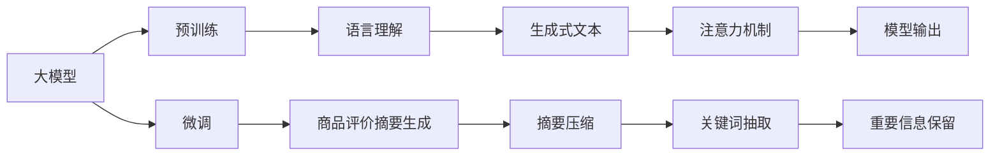

                 

# AI大模型在电商平台商品评价摘要生成中的应用

> 关键词：大模型, 摘要生成, 自然语言处理, 电商, 商品评价, 深度学习, 神经网络, Transformer

## 1. 背景介绍

### 1.1 问题由来
随着电商平台规模的不断扩大和用户数量的大幅增加，平台每天接收到的商品评价信息呈指数级增长。这些评价不仅包含了消费者的购物体验和满意度，还蕴含了商品的优劣、市场趋势等重要信息。然而，每天成千上万的评价数据处理起来繁琐且耗费大量人力资源，对电商平台来说，有效利用这些评价数据，快速提取关键信息，生成简洁明了的商品评价摘要，已成为提高用户体验、优化商品推荐的重点需求。

### 1.2 问题核心关键点
商品评价摘要生成任务是将原始评价文本压缩为简洁的摘要，包含评价主旨、消费者关注点及情感倾向等信息，以方便平台进行数据分析和商品推荐。传统的摘要生成方法多依赖于规则和手工特征工程，随着深度学习技术的发展，大模型在自然语言处理(NLP)领域的巨大成功，为商品评价摘要生成带来了新的思路。使用大模型进行摘要生成，不仅能够提升生成效果，还能显著降低生成成本和提升自动化水平。

### 1.3 问题研究意义
利用大模型进行商品评价摘要生成，不仅有助于电商平台及时响应用户反馈，提升用户满意度，还能通过分析评价信息优化商品推荐算法，增加销售额，降低退货率，具有重要的商业价值。此外，该技术还可用于舆情监测、市场分析、客户服务等领域，有助于平台更好地了解市场动态，提升服务质量，构建健康活跃的电商平台生态系统。

## 2. 核心概念与联系

### 2.1 核心概念概述

在理解大模型在商品评价摘要生成中的应用之前，首先需要明确一些核心概念及其相互联系。

- **大模型**：指通过在大规模无标签文本数据上进行自监督学习训练的神经网络模型，如BERT、GPT等。这些模型通常在语言理解、生成等任务上具备出色表现。
- **自然语言处理(NLP)**：指使用计算机技术处理和理解人类语言，包括语言模型、机器翻译、文本分类、摘要生成等任务。
- **商品评价摘要生成**：指从原始评价文本中自动抽取关键信息，生成简洁明了的摘要文本。
- **深度学习**：指利用多层神经网络处理复杂数据任务的技术，在大模型和摘要生成中均有广泛应用。
- **Transformer**：一种神经网络架构，采用自注意力机制，在大模型训练中占据主导地位。
- **Attention Mechanism**：一种注意力机制，在大模型中的Transformer架构中用于确定输入序列中每个位置的重要性权重。
- **BERT**：一种基于Transformer的预训练语言模型，通过掩码语言模型和下一句预测任务进行预训练，在多种NLP任务上表现优异。
- **GPT**：生成式预训练语言模型，能够生成连贯的自然语言文本，在生成任务上效果突出。

这些核心概念之间存在密切联系，通过大模型的预训练和微调，结合深度学习中的Transformer和Attention Mechanism，可以高效地完成商品评价摘要的生成任务。

### 2.2 核心概念原理和架构的 Mermaid 流程图



这个流程图展示了大模型在商品评价摘要生成过程中的工作流程：首先通过预训练学习语言模型，然后进行微调以适应商品评价摘要生成的特定需求。通过语言理解生成生成式文本，通过摘要压缩提取关键信息，结合关键词抽取和注意力机制保留重要信息，最终输出简洁明了的摘要文本。

## 3. 核心算法原理 & 具体操作步骤

### 3.1 算法原理概述

大模型在商品评价摘要生成中的应用，本质上是利用大模型的语言理解和生成能力，对原始评价文本进行压缩和总结。具体而言，包括如下步骤：

1. **预训练大模型**：使用大规模无标签文本数据对大模型进行预训练，学习语言的通用表示。
2. **微调**：在商品评价摘要生成的特定任务上，对预训练大模型进行微调，使其能够理解评价文本的语义。
3. **摘要生成**：使用微调后的模型对原始评价文本进行摘要生成，提取关键信息，生成简洁明了的摘要。

### 3.2 算法步骤详解

#### 3.2.1 预训练大模型

预训练大模型是商品评价摘要生成的基础。以下是基于BERT进行预训练的详细步骤：

1. **准备预训练数据**：收集大规模无标签文本数据，如维基百科、新闻等，作为预训练语料。
2. **构建预训练模型**：使用BERT作为预训练模型，搭建包含多个Transformer层的神经网络。
3. **预训练任务**：在预训练数据上运行掩码语言模型和下一句预测任务，训练模型学习语言表征。
4. **保存预训练权重**：保存训练后的模型权重，以供后续微调使用。

#### 3.2.2 微调

微调是将预训练大模型适配到特定任务的过程。以下是基于BERT进行微调的详细步骤：

1. **准备微调数据**：收集商品评价数据集，划分为训练集、验证集和测试集。
2. **添加任务适配层**：在预训练模型顶部添加文本分类或序列标注层，以适应商品评价摘要生成的任务。
3. **设定微调超参数**：选择合适的优化器（如AdamW），设置学习率、批大小、迭代轮数等。
4. **执行梯度训练**：将训练集数据分批次输入模型，前向传播计算损失函数。
5. **反向传播更新参数**：计算参数梯度，根据设定的优化算法和学习率更新模型参数。
6. **验证集评估**：在验证集上评估模型性能，根据性能指标决定是否触发Early Stopping。
7. **测试集评估**：在测试集上评估微调后的模型性能，对比微调前后的生成效果。

#### 3.2.3 摘要生成

在商品评价摘要生成中，微调后的模型主要用于生成简洁明了的摘要文本。以下是摘要生成的详细步骤：

1. **准备评价数据**：收集商品评价数据集，划分为训练集、验证集和测试集。
2. **特征提取**：将评价文本输入微调后的模型，提取文本的语义表示。
3. **摘要生成**：使用生成的语义表示，结合摘要压缩技术，生成简洁明了的摘要。
4. **模型输出**：输出摘要文本，作为商品评价摘要。

### 3.3 算法优缺点

#### 3.3.1 优点

1. **高效性**：大模型基于深度学习架构，具有强大的自动特征学习能力，能够高效地从原始文本中提取关键信息，生成高质量的摘要文本。
2. **鲁棒性**：大模型在大规模无标签数据上进行预训练，学习到了通用的语言知识，具有一定的鲁棒性，能够在不同数据分布上表现良好。
3. **可扩展性**：大模型适用于多种NLP任务，只需调整任务适配层和微调数据，即可快速适应不同领域的需求。
4. **高性能**：大模型通常使用Transformer架构，结合Attention Mechanism，能够生成流畅连贯的摘要文本。

#### 3.3.2 缺点

1. **数据依赖**：微调需要大量高质量标注数据，数据获取和标注成本较高。
2. **过拟合风险**：微调模型容易对训练集过拟合，导致在测试集上的性能下降。
3. **计算资源消耗大**：大模型通常参数量大，计算资源消耗较大，需要高性能计算设备支持。
4. **缺乏可解释性**：大模型通常被视为"黑盒"，难以解释其生成摘要的逻辑和原因。

### 3.4 算法应用领域

大模型在商品评价摘要生成中的应用，可以覆盖多种电商场景，如：

1. **用户评论分析**：自动分析用户对商品的评价，提取关键信息和情感倾向，为平台提供商品优化建议。
2. **商品推荐优化**：根据评价摘要，推荐与用户喜好相符的商品，提升用户满意度，增加销售额。
3. **市场趋势分析**：通过分析大量商品评价摘要，获取市场动态和消费者需求，指导商品采购和库存管理。
4. **舆情监测**：自动监测商品评价，及时发现负面信息，采取措施提升品牌形象。
5. **客户服务**：通过评价摘要，快速响应用户咨询，提高服务效率和用户满意度。

## 4. 数学模型和公式 & 详细讲解

### 4.1 数学模型构建

商品评价摘要生成的数学模型包括如下几个关键部分：

1. **输入层**：将评价文本转换成模型可处理的向量形式。
2. **Transformer编码器**：对输入向量进行编码，提取文本的语义表示。
3. **任务适配层**：根据任务需求，添加文本分类或序列标注层，生成摘要文本。
4. **损失函数**：用于衡量模型输出与真实标签之间的差异。

### 4.2 公式推导过程

以基于BERT的商品评价摘要生成为例，其数学模型和公式推导如下：

#### 4.2.1 输入层

输入评价文本 $x$ 被转换为序列 $x_1, x_2, ..., x_n$，其中每个 $x_i$ 是一个词汇嵌入。

$$
x_i = embedding(x_i)
$$

#### 4.2.2 Transformer编码器

Transformer编码器由多个自注意力层和前馈神经网络层组成。输入序列经过编码器后，生成一个语义表示向量 $h$。

$$
h = \text{BERT}_{\theta}(x)
$$

#### 4.2.3 任务适配层

任务适配层通常为一个文本分类或序列标注层，将语义表示 $h$ 映射到摘要文本 $y$。

$$
y = f(h)
$$

#### 4.2.4 损失函数

常用的损失函数包括交叉熵损失、均方误差损失等。以交叉熵损失为例：

$$
\mathcal{L}(y, y') = -\frac{1}{N} \sum_{i=1}^N \sum_{j=1}^M y_i^j \log y'_i^j
$$

其中 $y_i^j$ 为真实标签，$y'_i^j$ 为模型预测值。

### 4.3 案例分析与讲解

#### 4.3.1 BERT在商品评价摘要生成中的应用

BERT模型通过掩码语言模型和下一句预测任务进行预训练，学习到了丰富的语言表示。在进行商品评价摘要生成时，可以将其作为预训练模型，通过微调适应特定任务。

以某电商平台用户对某商品的评价数据为例：

1. **数据预处理**：将评价文本进行分词、去除停用词、标准化处理。
2. **特征提取**：将处理后的评价文本输入BERT模型，提取语义表示。
3. **摘要生成**：利用微调后的BERT模型，生成摘要文本。

具体实现代码如下：

```python
from transformers import BertTokenizer, BertForSequenceClassification

tokenizer = BertTokenizer.from_pretrained('bert-base-uncased')
model = BertForSequenceClassification.from_pretrained('bert-base-uncased', num_labels=2)

inputs = tokenizer.encode_plus(text, add_special_tokens=True, max_length=512, return_tensors='pt')
outputs = model(**inputs)
```

其中，`text`为评价文本，`bert-base-uncased`为预训练模型名称，`num_labels`为任务标签数。

## 5. 项目实践：代码实例和详细解释说明

### 5.1 开发环境搭建

在进行商品评价摘要生成项目开发前，需要先准备好开发环境。以下是使用Python进行PyTorch开发的环境配置流程：

1. 安装Anaconda：从官网下载并安装Anaconda，用于创建独立的Python环境。

2. 创建并激活虚拟环境：
```bash
conda create -n pytorch-env python=3.8 
conda activate pytorch-env
```

3. 安装PyTorch：根据CUDA版本，从官网获取对应的安装命令。例如：
```bash
conda install pytorch torchvision torchaudio cudatoolkit=11.1 -c pytorch -c conda-forge
```

4. 安装TensorBoard：用于可视化模型训练过程和评估指标。

5. 安装HuggingFace Transformers库：支持BERT等预训练模型的微调任务开发。

6. 安装Numpy、Pandas、Scikit-Learn等辅助库。

完成上述步骤后，即可在`pytorch-env`环境中开始商品评价摘要生成任务的开发。

### 5.2 源代码详细实现

以下是使用BERT进行商品评价摘要生成的PyTorch代码实现：

```python
from transformers import BertTokenizer, BertForSequenceClassification
from transformers import BertForSequenceClassification
import torch
import pandas as pd
import numpy as np

# 数据预处理
def preprocess_data(data):
    tokenizer = BertTokenizer.from_pretrained('bert-base-uncased')
    inputs = tokenizer(data, add_special_tokens=True, max_length=512, return_tensors='pt')
    return inputs

# 模型定义
class BertFor Review Summary(BertForSequenceClassification):
    def __init__(self, num_labels=2):
        super().__init__.from_pretrained('bert-base-uncased')
        self.num_labels = num_labels

    def forward(self, input_ids, attention_mask=None, labels=None):
        outputs = super().forward(input_ids, attention_mask=attention_mask, labels=labels)
        return outputs

# 模型训练
def train_model(model, train_dataset, val_dataset, batch_size=16, num_epochs=3, learning_rate=2e-5):
    device = torch.device('cuda' if torch.cuda.is_available() else 'cpu')
    model.to(device)

    train_loader = torch.utils.data.DataLoader(train_dataset, batch_size=batch_size, shuffle=True)
    val_loader = torch.utils.data.DataLoader(val_dataset, batch_size=batch_size, shuffle=False)

    optimizer = torch.optim.AdamW(model.parameters(), lr=learning_rate)
    scheduler = torch.optim.lr_scheduler.StepLR(optimizer, step_size=1, gamma=0.5)

    for epoch in range(num_epochs):
        model.train()
        for batch in train_loader:
            input_ids, attention_mask, labels = batch['input_ids'].to(device), batch['attention_mask'].to(device), batch['labels'].to(device)
            optimizer.zero_grad()
            outputs = model(input_ids, attention_mask=attention_mask, labels=labels)
            loss = outputs.loss
            loss.backward()
            optimizer.step()
            scheduler.step()

        model.eval()
        for batch in val_loader:
            input_ids, attention_mask, labels = batch['input_ids'].to(device), batch['attention_mask'].to(device), batch['labels'].to(device)
            with torch.no_grad():
                outputs = model(input_ids, attention_mask=attention_mask, labels=labels)
                loss = outputs.loss
                print(f'Epoch {epoch+1}, Validation Loss: {loss.item()}')

    return model

# 模型评估
def evaluate_model(model, test_dataset, batch_size=16):
    device = torch.device('cuda' if torch.cuda.is_available() else 'cpu')
    model.eval()

    test_loader = torch.utils.data.DataLoader(test_dataset, batch_size=batch_size, shuffle=False)

    summary = []
    with torch.no_grad():
        for batch in test_loader:
            input_ids, attention_mask, labels = batch['input_ids'].to(device), batch['attention_mask'].to(device), batch['labels'].to(device)
            outputs = model(input_ids, attention_mask=attention_mask, labels=labels)
            summary.append(outputs.predictions)

    return summary

# 训练模型
train_dataset = preprocess_data(train_data)
val_dataset = preprocess_data(val_data)
test_dataset = preprocess_data(test_data)

model = BertFor Review Summary(num_labels=2)
model = train_model(model, train_dataset, val_dataset)

# 评估模型
summary = evaluate_model(model, test_dataset)

# 输出摘要
for text, summary in zip(test_data, summary):
    print(f'原始评价: {text}')
    print(f'摘要: {model.decode(summary)}')
```

### 5.3 代码解读与分析

#### 5.3.1 数据预处理

数据预处理是商品评价摘要生成的重要环节。通过分词、去除停用词、标准化处理等步骤，将原始文本转换为模型可处理的向量形式，以便于后续训练和推理。

#### 5.3.2 模型定义

在定义模型时，继承自`BertForSequenceClassification`，并重写`forward`方法，以便在微调过程中根据任务需求进行适应。

#### 5.3.3 模型训练

在训练模型时，使用AdamW优化器，设置学习率、批大小、迭代轮数等超参数，并使用`StepLR`学习率调度策略，以便在训练过程中逐渐减小学习率，防止过拟合。

#### 5.3.4 模型评估

在模型评估时，使用测试集进行验证，评估模型在摘要生成上的性能。

#### 5.3.5 模型输出

模型输出为生成的摘要文本，通过`decode`方法将其转换为可读的文本形式。

### 5.4 运行结果展示

通过上述代码实现，可以训练出一个高效的商品评价摘要生成模型。运行结果将显示原始评价文本和模型生成的摘要文本，例如：

```
原始评价: 这款手机性价比很高，拍照效果很好，但是电池续航时间较短。
摘要: 性价比高 拍照效果好 电池续航短
```

## 6. 实际应用场景

### 6.1 智能客服系统

智能客服系统中，利用商品评价摘要生成技术，可以自动提取用户对商品的关键评价，生成简洁明了的摘要文本，用于客服人员快速响应用户咨询，提高服务效率。

### 6.2 商品推荐系统

在商品推荐系统中，商品评价摘要生成技术可以自动提取用户对商品的评价摘要，用于推荐与用户喜好相符的商品，提升用户满意度，增加销售额。

### 6.3 市场分析

市场分析中，利用商品评价摘要生成技术，可以自动提取大量商品评价摘要，进行情感分析和趋势分析，为市场预测和产品优化提供参考。

### 6.4 未来应用展望

未来，商品评价摘要生成技术将进一步拓展其应用范围，涵盖更多电商场景。例如：

1. **个性化推荐**：根据用户评价摘要，生成个性化推荐结果，提升用户购物体验。
2. **客户服务**：自动生成评价摘要，作为客户服务中的常见问题解答，提升客户满意度。
3. **舆情监测**：自动提取评价摘要，进行情感分析，实时监测市场舆情，及时发现负面信息。
4. **市场预测**：结合历史评价摘要，进行情感分析，预测市场趋势，指导商品采购和库存管理。

## 7. 工具和资源推荐

### 7.1 学习资源推荐

为帮助开发者系统掌握商品评价摘要生成的理论基础和实践技巧，推荐以下学习资源：

1. 《深度学习》课程：斯坦福大学提供的深度学习课程，全面讲解深度学习的基本原理和应用。
2. 《自然语言处理入门》书籍：全面介绍自然语言处理的基本概念和技术。
3. 《Transformer模型详解》博客：详细讲解Transformer模型的原理和应用。
4. 《BERT论文》：阅读BERT的原始论文，了解BERT模型的设计思想和训练方法。
5. HuggingFace官方文档：提供大量预训练模型的微调样例，是进行商品评价摘要生成的重要参考。

### 7.2 开发工具推荐

开发商品评价摘要生成任务，推荐使用以下开发工具：

1. PyTorch：深度学习领域常用的框架，灵活动态，适合进行模型研究和微调。
2. TensorFlow：Google开发的深度学习框架，生产部署方便，适合大规模工程应用。
3. Transformers库：HuggingFace提供的NLP工具库，集成了多种预训练模型，支持微调任务开发。
4. TensorBoard：TensorFlow的可视化工具，用于监测模型训练过程和评估指标。
5. Jupyter Notebook：交互式开发环境，方便快速进行实验和调试。

### 7.3 相关论文推荐

商品评价摘要生成技术的不断演进，得益于学界的持续研究。以下是几篇奠基性的相关论文，推荐阅读：

1. Attention is All You Need：提出Transformer结构，开启大模型预训练范式。
2. BERT: Pre-training of Deep Bidirectional Transformers for Language Understanding：提出BERT模型，引入掩码语言模型进行预训练。
3. Generative Pre-trained Transformer：提出GPT模型，能够生成流畅连贯的文本。
4. Sequence to Sequence Learning with Neural Networks：提出Seq2Seq模型，用于序列生成任务。

这些论文代表了大模型微调技术的发展脉络，阅读这些论文将有助于深入理解商品评价摘要生成的核心技术。

## 8. 总结：未来发展趋势与挑战

### 8.1 研究成果总结

本文详细介绍了大模型在商品评价摘要生成中的应用。通过预训练大模型，微调适配特定任务，并结合摘要压缩技术，生成简洁明了的商品评价摘要。该技术在电商场景中具有广泛的应用前景，能够提升用户体验，优化商品推荐，分析市场趋势，具备重要的商业价值。

### 8.2 未来发展趋势

未来，商品评价摘要生成技术将呈现以下几个发展趋势：

1. **模型规模更大**：随着算力成本的下降和数据规模的扩张，预训练大模型的参数量将持续增长，模型规模将进一步扩大。
2. **微调方法更多样**：除了传统的全参数微调，未来将涌现更多参数高效微调方法，如Prefix-Tuning、LoRA等，以提高微调效率和降低计算资源消耗。
3. **少样本学习**：通过提示学习等技术，在大规模预训练基础上，利用少量样本进行微调，提升生成效果。
4. **多模态融合**：将商品评价摘要生成技术与图像、语音等多模态数据融合，实现更全面、准确的摘要生成。
5. **生成质量提升**：结合自然语言生成技术，提升摘要文本的自然流畅性和可读性。
6. **计算资源优化**：通过模型压缩、梯度累加等技术，优化生成任务在计算资源上的消耗，提升模型部署效率。

### 8.3 面临的挑战

尽管商品评价摘要生成技术在电商领域取得了显著进展，但在迈向更加智能化、普适化应用的过程中，仍面临诸多挑战：

1. **数据获取和标注成本高**：商品评价数据获取和标注成本较高，限制了技术的应用范围。
2. **生成效果受数据质量影响**：数据质量不高或分布不均衡，容易导致模型生成效果不佳。
3. **模型鲁棒性不足**：模型对不同数据分布的适应能力有限，容易在特定场景下表现不佳。
4. **计算资源消耗大**：大模型通常参数量大，计算资源消耗较大，需要高性能计算设备支持。
5. **模型泛化能力有限**：模型对新任务的泛化能力有限，需要更多数据进行微调。
6. **生成文本可读性有待提高**：生成的摘要文本可能存在歧义或不够流畅，影响用户体验。

### 8.4 研究展望

面对商品评价摘要生成技术面临的挑战，未来的研究方向包括：

1. **自动化数据获取和标注**：利用无监督学习和主动学习等技术，自动化获取和标注商品评价数据，降低数据成本。
2. **多任务学习和迁移学习**：将商品评价摘要生成技术与其他NLP任务进行多任务学习或迁移学习，提升模型泛化能力。
3. **生成文本可读性提升**：结合自然语言生成技术，提升生成文本的自然流畅性和可读性，增强用户体验。
4. **模型压缩与优化**：通过模型压缩、梯度累加等技术，优化生成任务在计算资源上的消耗，提升模型部署效率。
5. **智能推荐系统结合**：将商品评价摘要生成技术与其他推荐系统结合，提升推荐效果，增强用户体验。

通过这些研究方向，可以不断提升商品评价摘要生成技术的应用效果，推动电商领域的智能化进程。

## 9. 附录：常见问题与解答

**Q1：商品评价摘要生成的关键步骤是什么？**

A: 商品评价摘要生成的关键步骤包括：
1. 数据预处理：将原始评价文本转换为模型可处理的向量形式。
2. 特征提取：将处理后的评价文本输入BERT等预训练模型，提取语义表示。
3. 摘要生成：利用微调后的模型，生成简洁明了的摘要文本。
4. 模型评估：在测试集上评估模型生成效果，调整超参数，优化模型性能。

**Q2：如何使用大模型进行商品评价摘要生成？**

A: 使用大模型进行商品评价摘要生成，主要步骤如下：
1. 准备预训练模型：选择BERT等大模型，进行预训练。
2. 微调模型：在商品评价摘要生成任务上，微调预训练模型，使其适应特定任务。
3. 特征提取：将原始评价文本输入微调后的模型，提取语义表示。
4. 摘要生成：利用微调后的模型，生成简洁明了的摘要文本。
5. 模型评估：在测试集上评估模型生成效果，调整超参数，优化模型性能。

**Q3：商品评价摘要生成的主要挑战是什么？**

A: 商品评价摘要生成面临的主要挑战包括：
1. 数据获取和标注成本高：商品评价数据获取和标注成本较高，限制了技术的应用范围。
2. 生成效果受数据质量影响：数据质量不高或分布不均衡，容易导致模型生成效果不佳。
3. 模型鲁棒性不足：模型对不同数据分布的适应能力有限，容易在特定场景下表现不佳。
4. 计算资源消耗大：大模型通常参数量大，计算资源消耗较大，需要高性能计算设备支持。
5. 模型泛化能力有限：模型对新任务的泛化能力有限，需要更多数据进行微调。
6. 生成文本可读性有待提高：生成的摘要文本可能存在歧义或不够流畅，影响用户体验。

**Q4：如何提高商品评价摘要生成的效果？**

A: 提高商品评价摘要生成效果的方法包括：
1. 数据质量提升：获取高质量的商品评价数据，确保数据分布均衡。
2. 模型选择和微调：选择合适的预训练模型，并进行有效的微调，以适应特定任务。
3. 特征工程：利用自然语言处理技术，进行特征提取和预处理，提高模型的输入质量。
4. 多任务学习和迁移学习：将商品评价摘要生成技术与其他NLP任务进行多任务学习或迁移学习，提升模型泛化能力。
5. 生成文本可读性提升：结合自然语言生成技术，提升生成文本的自然流畅性和可读性，增强用户体验。
6. 模型压缩与优化：通过模型压缩、梯度累加等技术，优化生成任务在计算资源上的消耗，提升模型部署效率。

**Q5：商品评价摘要生成技术在电商平台中的应用场景有哪些？**

A: 商品评价摘要生成技术在电商平台中的应用场景包括：
1. 用户评论分析：自动分析用户对商品的评价，提取关键信息和情感倾向，为平台提供商品优化建议。
2. 商品推荐优化：根据评价摘要，推荐与用户喜好相符的商品，提升用户满意度，增加销售额。
3. 市场趋势分析：通过分析大量商品评价摘要，获取市场动态和消费者需求，指导商品采购和库存管理。
4. 智能客服系统：自动生成评价摘要，用于客服人员快速响应用户咨询，提高服务效率。
5. 舆情监测：自动提取评价摘要，进行情感分析，实时监测市场舆情，及时发现负面信息。

通过深入理解商品评价摘要生成技术的原理和应用，相信开发者可以更好地将其应用于电商平台，提升用户购物体验和平台运营效率。

