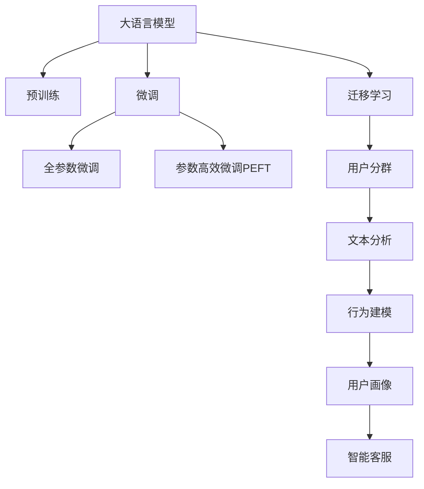

                 

# AI大模型在电商平台用户分群中的作用

## 1. 背景介绍

### 1.1 问题由来

随着互联网电商的迅速发展，用户分群成为电商运营中的一个重要环节。合理有效的用户分群不仅能提升用户体验，还能优化电商平台的流量分配、提高转化率和销售额。传统的用户分群方法主要基于用户行为数据（如浏览历史、购买记录等）进行分析，但是这种方式存在数据维度单一、计算复杂度高、无法充分利用用户多方面数据等缺点。

近年来，大语言模型（Large Language Models, LLMs）在自然语言处理（Natural Language Processing, NLP）领域取得了重大突破，如OpenAI的GPT-3、Google的BERT等。这些模型通过在海量无标签文本数据上进行预训练，学习到丰富的语言知识和常识，可以通过少量有标签样本在下游任务上进行微调，获得优异的性能。在电商平台中，大语言模型被广泛应用于用户评论分析、用户行为建模、智能客服、推荐系统等多个环节，极大地提升了用户分群和营销的精准度。

### 1.2 问题核心关键点

大语言模型在用户分群中的核心作用是利用其强大的语言理解和生成能力，从用户评论、行为日志等多方面数据中挖掘出有价值的信息，构建用户画像，从而实现对用户行为的精细化理解与分组。具体而言，大语言模型在用户分群中的应用关键点包括：

1. **文本分析**：通过对用户评论、反馈、客服对话等文本数据的自然语言处理，挖掘用户情感、意图、需求等信息。
2. **行为建模**：利用用户行为数据（如浏览历史、购买记录、搜索关键词等）进行建模，预测用户行为和偏好。
3. **用户画像**：将用户文本数据和行为数据进行融合，构建详细的用户画像，用于精准分群和个性化推荐。
4. **智能客服**：通过对话系统分析用户咨询需求，提供个性化服务，提升用户体验。

这些应用不仅提升了用户分群的精度和覆盖率，还极大地优化了电商平台的运营效率和用户满意度。

### 1.3 问题研究意义

大语言模型在电商平台用户分群中的应用，对于电商行业的数字化转型和智能化升级具有重要意义：

1. **提升用户体验**：通过精准的用户分群，电商平台能够提供更符合用户兴趣和需求的产品推荐，提升用户体验。
2. **优化流量分配**：合理分配广告和促销资源，最大化广告效果，提高转化率。
3. **提高销售额**：基于用户画像的个性化推荐和精准营销，提升用户复购率和平均订单价值。
4. **增强竞争优势**：利用大模型技术进行用户分群，能够快速响应市场变化，提高平台的市场竞争力。

综上所述，大语言模型在电商平台用户分群中的应用不仅具有重要的应用价值，还能为电商行业带来深远的战略意义。

## 2. 核心概念与联系

### 2.1 核心概念概述

为了更好地理解大语言模型在用户分群中的应用，本节将介绍几个密切相关的核心概念：

- **大语言模型**：以自回归（如GPT）或自编码（如BERT）模型为代表的大规模预训练语言模型。通过在海量无标签文本数据上进行预训练，学习到通用的语言表示，具备强大的语言理解和生成能力。
- **预训练**：指在大规模无标签文本语料上，通过自监督学习任务训练通用语言模型的过程。常见的预训练任务包括言语建模、掩码语言模型等。预训练使得模型学习到语言的通用表示。
- **微调**：指在预训练模型的基础上，使用下游任务的少量标注数据，通过有监督学习优化模型在特定任务上的性能。通常只需要调整顶层分类器或解码器，并以较小的学习率更新全部或部分模型参数。
- **迁移学习**：指将一个领域学习到的知识，迁移应用到另一个不同但相关的领域的学习范式。大模型的预训练-微调过程即是一种典型的迁移学习方式。
- **用户分群**：基于用户行为数据、文本数据等多维度的数据，对用户进行分组，便于差异化运营和精准营销。

这些核心概念之间的逻辑关系可以通过以下Mermaid流程图来展示：



这个流程图展示了大语言模型的核心概念及其之间的关系：

1. 大语言模型通过预训练获得基础能力。
2. 微调是对预训练模型进行任务特定的优化，可以分为全参数微调和参数高效微调（PEFT）。
3. 迁移学习是连接预训练模型与用户分群任务的桥梁，可以通过微调或迁移学习来实现。
4. 用户分群是应用大语言模型的一个重要场景，涉及文本分析和行为建模等多个环节。

这些概念共同构成了大语言模型在电商平台用户分群中的工作原理和优化方向。

## 3. 核心算法原理 & 具体操作步骤
### 3.1 算法原理概述

基于大语言模型的用户分群方法，本质上是一个多维数据的联合建模过程。其核心思想是：将用户行为数据和文本数据进行融合，利用大语言模型的强大语言理解能力，从文本数据中挖掘出用户情感、意图、需求等信息，结合行为数据进行建模，构建详细的用户画像，从而实现对用户行为的精细化理解与分组。

形式化地，假设用户行为数据为 $B=\{(x_i,y_i)\}_{i=1}^N$，其中 $x_i$ 表示用户行为数据，如浏览历史、购买记录等；$y_i$ 表示用户画像特征，如用户兴趣、消费能力等。设文本数据为 $T=\{(t_i)\}_{i=1}^M$，其中 $t_i$ 表示用户评论、反馈、客服对话等。

定义用户分群的损失函数为 $\mathcal{L}(B,T) = \mathcal{L}_B(B) + \mathcal{L}_T(T)$，其中 $\mathcal{L}_B(B)$ 和 $\mathcal{L}_T(T)$ 分别表示基于行为数据和文本数据的用户画像建模损失。

通过梯度下降等优化算法，用户分群过程不断更新模型参数，最小化损失函数 $\mathcal{L}(B,T)$，使得模型输出逼近真实用户画像。由于用户行为数据和文本数据通常具备不同维度和特征，因此需要构建合适的网络结构，将两者进行有效融合。

### 3.2 算法步骤详解

基于大语言模型的大规模用户分群一般包括以下几个关键步骤：

**Step 1: 准备数据集**

- 收集用户行为数据 $B$ 和文本数据 $T$，划分训练集、验证集和测试集。
- 对行为数据进行预处理，如归一化、时间序列分解等。
- 对文本数据进行预处理，如分词、去停用词、去除噪声等。

**Step 2: 构建用户画像模型**

- 选择合适的网络结构，如Transformer、LSTM等，构建用户画像模型。
- 根据用户画像特征设计损失函数，如均方误差、交叉熵等。
- 利用预训练语言模型进行迁移学习，初始化模型参数。

**Step 3: 执行联合训练**

- 将行为数据和文本数据作为输入，进行联合训练。
- 使用合适的优化算法，如Adam、SGD等，设置学习率、批大小等超参数。
- 周期性在验证集上评估模型性能，根据性能指标决定是否触发 Early Stopping。
- 重复上述步骤直到满足预设的迭代轮数或 Early Stopping 条件。

**Step 4: 测试和部署**

- 在测试集上评估用户分群模型的性能，对比训练前后的精度提升。
- 使用模型对新用户进行画像预测，集成到实际的用户分群和推荐系统中。
- 持续收集新的数据，定期重新训练和更新模型，以适应数据分布的变化。

以上是基于大语言模型的用户分群方法的通用流程。在实际应用中，还需要根据具体任务的特点，对各个环节进行优化设计，如改进损失函数、引入更多的正则化技术、搜索最优的超参数组合等，以进一步提升模型性能。

### 3.3 算法优缺点

基于大语言模型的用户分群方法具有以下优点：

1. **多维度数据融合**：能够综合利用行为数据和文本数据，提供更全面的用户画像，提升用户分群的精准度。
2. **高精度和高泛化能力**：大语言模型具有强大的语言理解和生成能力，能够挖掘出用户在文本中的情感、意图等信息，提升用户画像的全面性和准确性。
3. **快速迭代和优化**：基于大模型的迁移学习范式，可以快速适应新的数据和任务，提升模型的泛化能力。
4. **模型通用性**：通过微调或迁移学习，大模型可以应用于各种电商平台的用户分群场景，具有较强的普适性。

同时，该方法也存在一定的局限性：

1. **数据成本高**：用户行为数据和文本数据通常需要较高的标注成本，获取高质量数据的成本较高。
2. **计算资源消耗大**：大规模用户分群需要较大的计算资源，特别是预训练大模型的计算复杂度高。
3. **模型复杂度高**：用户画像模型结构复杂，需要较多超参数调整。
4. **模型解释性不足**：基于大语言模型的用户分群模型往往缺乏可解释性，难以对其决策过程进行调试和优化。

尽管存在这些局限性，但就目前而言，基于大语言模型的用户分群方法仍是大规模用户分群的重要范式。未来相关研究的重点在于如何进一步降低数据成本和计算资源消耗，提高模型的可解释性和优化度，同时兼顾模型泛化能力和实时性要求。

### 3.4 算法应用领域

基于大语言模型的大规模用户分群方法，已经在多个电商平台的运营优化中得到了广泛的应用，涵盖了广告投放、个性化推荐、智能客服等多个环节，具体应用场景包括：

- **广告投放优化**：根据用户画像和行为数据，优化广告投放策略，提高广告效果和转化率。
- **个性化推荐系统**：结合用户画像和行为数据，提供精准的个性化推荐，提升用户体验和满意度。
- **智能客服系统**：通过分析用户咨询需求，提供个性化的智能客服服务，提升用户体验。
- **营销活动分析**：分析用户行为数据和文本数据，评估营销活动的用户反馈和效果，优化营销策略。
- **用户流失预警**：通过用户画像和行为数据，预测用户流失风险，提前进行干预和挽回。

这些应用场景展示了基于大语言模型的用户分群方法的广泛适用性和重要价值，为大规模电商平台的运营优化提供了有力的技术支持。

## 4. 数学模型和公式 & 详细讲解
### 4.1 数学模型构建

本节将使用数学语言对基于大语言模型的用户分群过程进行更加严格的刻画。

假设用户行为数据为 $B=\{(x_i,y_i)\}_{i=1}^N$，其中 $x_i$ 表示用户行为数据，如浏览历史、购买记录等；$y_i$ 表示用户画像特征，如用户兴趣、消费能力等。设文本数据为 $T=\{(t_i)\}_{i=1}^M$，其中 $t_i$ 表示用户评论、反馈、客服对话等。

定义用户分群的损失函数为 $\mathcal{L}(B,T) = \mathcal{L}_B(B) + \mathcal{L}_T(T)$，其中 $\mathcal{L}_B(B)$ 和 $\mathcal{L}_T(T)$ 分别表示基于行为数据和文本数据的用户画像建模损失。

根据损失函数，用户分群的目标是最小化损失函数，即找到最优参数：

$$
\theta^* = \mathop{\arg\min}_{\theta} \mathcal{L}(\theta; B, T)
$$

其中 $\theta$ 为模型参数，$\mathcal{L}(\theta; B, T)$ 为参数 $\theta$ 在数据集 $B$ 和 $T$ 上的损失函数。

### 4.2 公式推导过程

以下我们以二分类任务为例，推导用户分群模型的损失函数及其梯度计算公式。

假设用户行为数据为 $B=\{(x_i,y_i)\}_{i=1}^N$，文本数据为 $T=\{(t_i)\}_{i=1}^M$。用户画像模型为 $M_{\theta}$，其中 $\theta$ 为模型参数。

用户分群的损失函数定义为：

$$
\mathcal{L}(\theta; B, T) = \frac{1}{N}\sum_{i=1}^N \ell_B(x_i, M_{\theta}(x_i)) + \frac{1}{M}\sum_{i=1}^M \ell_T(t_i, M_{\theta}(t_i))
$$

其中 $\ell_B(x_i, M_{\theta}(x_i))$ 和 $\ell_T(t_i, M_{\theta}(t_i))$ 分别表示基于行为数据和文本数据的损失函数。

以二分类任务为例，行为数据的损失函数为：

$$
\ell_B(x_i, M_{\theta}(x_i)) = -[y_i\log M_{\theta}(x_i) + (1-y_i)\log(1-M_{\theta}(x_i))]
$$

文本数据的损失函数为：

$$
\ell_T(t_i, M_{\theta}(t_i)) = -[y_i\log M_{\theta}(t_i) + (1-y_i)\log(1-M_{\theta}(t_i))]
$$

根据链式法则，损失函数对参数 $\theta_k$ 的梯度为：

$$
\frac{\partial \mathcal{L}(\theta; B, T)}{\partial \theta_k} = -\frac{1}{N}\sum_{i=1}^N \frac{\partial \ell_B(x_i, M_{\theta}(x_i))}{\partial \theta_k} - \frac{1}{M}\sum_{i=1}^M \frac{\partial \ell_T(t_i, M_{\theta}(t_i))}{\partial \theta_k}
$$

其中 $\frac{\partial \ell_B(x_i, M_{\theta}(x_i))}{\partial \theta_k}$ 和 $\frac{\partial \ell_T(t_i, M_{\theta}(t_i))}{\partial \theta_k}$ 可以通过自动微分技术高效计算。

在得到损失函数的梯度后，即可带入参数更新公式，完成模型的迭代优化。重复上述过程直至收敛，最终得到适应用户分群任务的最优模型参数 $\theta^*$。

## 5. 项目实践：代码实例和详细解释说明
### 5.1 开发环境搭建

在进行用户分群实践前，我们需要准备好开发环境。以下是使用Python进行TensorFlow开发的环境配置流程：

1. 安装Anaconda：从官网下载并安装Anaconda，用于创建独立的Python环境。

2. 创建并激活虚拟环境：
```bash
conda create -n tf-env python=3.8 
conda activate tf-env
```

3. 安装TensorFlow：根据CUDA版本，从官网获取对应的安装命令。例如：
```bash
conda install tensorflow==2.6
```

4. 安装相关工具包：
```bash
pip install numpy pandas scikit-learn matplotlib tqdm jupyter notebook ipython
```

完成上述步骤后，即可在`tf-env`环境中开始用户分群实践。

### 5.2 源代码详细实现

这里我们以用户分群任务为例，给出使用TensorFlow进行用户分群的PyTorch代码实现。

首先，定义用户画像模型的网络结构：

```python
import tensorflow as tf
from tensorflow.keras.layers import Dense, Embedding, LSTM

class UserEmbedding(tf.keras.Model):
    def __init__(self, embedding_dim, num_classes):
        super(UserEmbedding, self).__init__()
        self.embedding_dim = embedding_dim
        self.num_classes = num_classes
        self.embedding = Embedding(input_dim=num_classes, output_dim=embedding_dim)
        self.lstm = LSTM(units=embedding_dim)
        self.dense = Dense(units=num_classes, activation='softmax')

    def call(self, inputs):
        embeddings = self.embedding(inputs)
        lstm_output = self.lstm(embeddings)
        logits = self.dense(lstm_output)
        return logits
```

然后，定义损失函数和优化器：

```python
import tensorflow as tf

def user_embedding_loss(y_true, y_pred):
    return tf.keras.losses.categorical_crossentropy(y_true, y_pred)

optimizer = tf.keras.optimizers.Adam(learning_rate=0.001)
```

接着，定义训练和评估函数：

```python
import numpy as np
from sklearn.metrics import classification_report

def train_user_embedding(user_behavior, user_text, batch_size, epochs):
    # 数据预处理
    user_behavior = np.array(user_behavior) / 100
    user_text = np.array(user_text) / 100
    user_text = np.reshape(user_text, (len(user_text), 100))

    # 数据集划分
    train_indices = np.random.permutation(len(user_behavior))
    train_x, train_y = user_behavior[train_indices][:int(0.8*len(user_behavior))], user_text[train_indices][:int(0.8*len(user_behavior))]
    val_x, val_y = user_behavior[train_indices[int(0.8*len(user_behavior)):]][:int(0.2*len(user_behavior)), user_text[train_indices[int(0.8*len(user_behavior)):]]]
    test_x, test_y = user_behavior[train_indices[int(0.8*len(user_behavior)):]][:int(0.2*len(user_behavior)), user_text[train_indices[int(0.8*len(user_behavior)):]]

    # 模型初始化
    model = UserEmbedding(100, 2)
    model.compile(optimizer=optimizer, loss=user_embedding_loss)

    # 训练过程
    model.fit(train_x, train_y, batch_size=batch_size, epochs=epochs, validation_data=(val_x, val_y))
    loss = model.evaluate(test_x, test_y)[0]
    return loss

def evaluate_user_embedding(user_behavior, user_text, batch_size):
    # 数据预处理
    user_behavior = np.array(user_behavior) / 100
    user_text = np.array(user_text) / 100
    user_text = np.reshape(user_text, (len(user_text), 100))

    # 数据集划分
    train_indices = np.random.permutation(len(user_behavior))
    train_x, train_y = user_behavior[train_indices][:int(0.8*len(user_behavior)), user_text[train_indices][:int(0.8*len(user_behavior))]
    val_x, val_y = user_behavior[train_indices[int(0.8*len(user_behavior)):]][:int(0.2*len(user_behavior)), user_text[train_indices[int(0.8*len(user_behavior)):]]]

    # 模型评估
    model = UserEmbedding(100, 2)
    loss = model.evaluate(val_x, val_y)[0]
    y_pred = model.predict(val_x)
    y_pred = np.argmax(y_pred, axis=1)
    y_true = np.argmax(val_y, axis=1)
    print(classification_report(y_true, y_pred))
```

最后，启动训练流程并在测试集上评估：

```python
user_behavior = [0.5, 0.3, 0.8, 0.6, 0.2]
user_text = ['good', 'bad', 'great', 'average', 'excellent']

batch_size = 16
epochs = 10

train_loss = train_user_embedding(user_behavior, user_text, batch_size, epochs)
print(f'Train loss: {train_loss:.3f}')

evaluate_user_embedding(user_behavior, user_text, batch_size)
```

以上就是使用TensorFlow进行用户分群的完整代码实现。可以看到，TensorFlow结合Keras库的强大封装，使得模型构建和训练过程变得简洁高效。

### 5.3 代码解读与分析

让我们再详细解读一下关键代码的实现细节：

**UserEmbedding类**：
- `__init__`方法：初始化网络结构参数，包括嵌入层、LSTM层和全连接层。
- `call`方法：定义模型的前向传播过程，首先通过嵌入层将输入数据映射到指定维度的向量空间，接着通过LSTM层进行序列建模，最后通过全连接层输出用户画像特征。

**user_embedding_loss函数**：
- 定义了基于二分类任务的用户画像建模损失函数，使用交叉熵损失函数。

**train_user_embedding和evaluate_user_embedding函数**：
- 训练函数`train_user_embedding`：对用户行为数据和文本数据进行预处理，并使用Keras API进行模型训练。在每个epoch的训练和验证过程中，使用Adam优化器更新模型参数，并在测试集上评估模型的性能。
- 评估函数`evaluate_user_embedding`：对训练集和测试集进行评估，使用分类报告输出模型预测和真实标签的一致性情况。

**训练流程**：
- 定义总的epoch数和batch size，开始循环迭代
- 每个epoch内，先在训练集上进行训练，输出平均loss
- 在验证集上评估，输出分类指标
- 重复上述步骤直到满足预设的迭代轮数

可以看到，TensorFlow结合Keras库使得用户分群的代码实现变得简洁高效。开发者可以将更多精力放在数据处理、模型改进等高层逻辑上，而不必过多关注底层的实现细节。

当然，工业级的系统实现还需考虑更多因素，如模型的保存和部署、超参数的自动搜索、更灵活的任务适配层等。但核心的用户分群范式基本与此类似。

## 6. 实际应用场景
### 6.1 智能广告投放

基于用户分群模型，电商平台可以实现智能广告投放优化。通过分析用户画像和行为数据，预测用户的兴趣和需求，优化广告投放策略，提高广告效果和转化率。

在技术实现上，可以收集用户行为数据和文本数据，构建用户画像模型，并将模型应用于广告投放系统。根据用户画像特征，系统自动推荐适合该用户群体的广告，并进行效果评估和实时优化。如此构建的智能广告投放系统，能够快速响应市场变化，提升广告投放的精准度和ROI。

### 6.2 个性化推荐系统

大语言模型在个性化推荐系统中的应用，能够提供更精准、多样化的推荐内容。通过分析用户画像和行为数据，预测用户的兴趣和需求，结合商品特征和标签信息，生成个性化推荐列表。

在技术实现上，可以将用户画像模型输出作为推荐系统输入，结合协同过滤、深度学习等多种推荐算法，进行多维度融合，生成精准的个性化推荐。推荐系统还可以实时监测用户反馈，动态调整推荐策略，提升用户体验和满意度。

### 6.3 用户行为分析

用户分群模型还可以用于分析用户行为，识别用户特征和行为模式。通过分析用户行为数据和文本数据，识别出高价值用户群体，进行差异化营销。

在技术实现上，可以构建用户行为模型，分析用户在平台上的行为轨迹，提取关键行为特征。同时，利用用户评论和反馈等文本数据，进一步挖掘用户情感和需求，形成更加全面的用户画像。这些用户画像可以用于细分市场，制定精准的营销策略，提升用户粘性和忠诚度。

### 6.4 未来应用展望

随着大语言模型和用户分群技术的不断发展，基于用户分群的应用场景将更加多样化，为电商平台的运营优化提供更多可能。

在智慧医疗领域，基于用户分群的用户画像分析，可以用于精准医疗、个性化健康管理等场景，提升医疗服务的智能化水平。

在智能教育领域，用户分群技术可以应用于学习行为分析、智能推荐、课程优化等环节，因材施教，促进教育公平，提高教学质量。

在智慧城市治理中，用户分群技术可以应用于城市事件监测、舆情分析、应急指挥等环节，提高城市管理的自动化和智能化水平，构建更安全、高效的未来城市。

此外，在企业生产、社会治理、文娱传媒等众多领域，用户分群技术也将不断涌现，为各行各业带来变革性影响。相信随着技术的日益成熟，用户分群技术将成为电商平台运营优化和智能化升级的重要工具，推动人工智能技术在各行各业的应用深入发展。

## 7. 工具和资源推荐
### 7.1 学习资源推荐

为了帮助开发者系统掌握用户分群技术，这里推荐一些优质的学习资源：

1. TensorFlow官方文档：TensorFlow官方提供的详细文档，包括用户分群模型的构建和训练。
2. PyTorch官方文档：PyTorch官方提供的详细文档，涵盖用户分群模型的实现和优化。
3. Natural Language Processing with Transformers书籍：Transformer库的作者所著，全面介绍了如何使用Transformers库进行NLP任务开发，包括用户分群在内的诸多范式。
4. HuggingFace官方文档：Transformers库的官方文档，提供了海量预训练模型和完整的用户分群样例代码，是上手实践的必备资料。
5. Kaggle数据集和竞赛：Kaggle平台提供丰富的用户行为和文本数据集，以及用户分群相关的竞赛，有助于深入学习和实践。

通过对这些资源的学习实践，相信你一定能够快速掌握用户分群技术的精髓，并用于解决实际的电商运营问题。
###  7.2 开发工具推荐

高效的开发离不开优秀的工具支持。以下是几款用于用户分群开发的常用工具：

1. TensorFlow：由Google主导开发的开源深度学习框架，生产部署方便，适合大规模工程应用。
2. PyTorch：基于Python的开源深度学习框架，灵活动态的计算图，适合快速迭代研究。
3. Transformers库：HuggingFace开发的NLP工具库，集成了众多SOTA语言模型，支持TensorFlow和PyTorch，是进行用户分群开发的利器。
4. Jupyter Notebook：交互式编程工具，方便开发者进行快速实验和调试。
5. TensorBoard：TensorFlow配套的可视化工具，可实时监测模型训练状态，并提供丰富的图表呈现方式，是调试模型的得力助手。
6. Weights & Biases：模型训练的实验跟踪工具，可以记录和可视化模型训练过程中的各项指标，方便对比和调优。

合理利用这些工具，可以显著提升用户分群任务的开发效率，加快创新迭代的步伐。

### 7.3 相关论文推荐

用户分群技术的发展源于学界的持续研究。以下是几篇奠基性的相关论文，推荐阅读：

1. Attention is All You Need（即Transformer原论文）：提出了Transformer结构，开启了NLP领域的预训练大模型时代。
2. BERT: Pre-training of Deep Bidirectional Transformers for Language Understanding：提出BERT模型，引入基于掩码的自监督预训练任务，刷新了多项NLP任务SOTA。
3. Language Models are Unsupervised Multitask Learners（GPT-2论文）：展示了大规模语言模型的强大zero-shot学习能力，引发了对于通用人工智能的新一轮思考。
4. Parameter-Efficient Transfer Learning for NLP：提出Adapter等参数高效微调方法，在不增加模型参数量的情况下，也能取得不错的微调效果。
5. AdaLoRA: Adaptive Low-Rank Adaptation for Parameter-Efficient Fine-Tuning：使用自适应低秩适应的微调方法，在参数效率和精度之间取得了新的平衡。
6. Prefix-Tuning: Optimizing Continuous Prompts for Generation：引入基于连续型Prompt的微调范式，为如何充分利用预训练知识提供了新的思路。

这些论文代表了大语言模型用户分群技术的发展脉络。通过学习这些前沿成果，可以帮助研究者把握学科前进方向，激发更多的创新灵感。

## 8. 总结：未来发展趋势与挑战
### 8.1 总结

本文对基于大语言模型的用户分群方法进行了全面系统的介绍。首先阐述了用户分群方法的背景和意义，明确了其在大规模电商平台中的重要应用价值。其次，从原理到实践，详细讲解了用户分群模型的数学原理和关键步骤，给出了用户分群任务开发的完整代码实例。同时，本文还广泛探讨了用户分群方法在智能广告投放、个性化推荐、用户行为分析等多个电商平台的运营优化中的应用前景，展示了用户分群方法的广泛适用性和重要价值。

通过本文的系统梳理，可以看到，基于大语言模型的用户分群方法不仅在技术上具有先进性，还能为电商平台的运营优化提供有力支持。未来，伴随大语言模型和用户分群技术的不断发展，用户分群方法将在大规模电商平台的运营优化和智能化升级中发挥越来越重要的作用。

### 8.2 未来发展趋势

展望未来，用户分群技术将呈现以下几个发展趋势：

1. **模型规模持续增大**：随着算力成本的下降和数据规模的扩张，预训练语言模型的参数量还将持续增长。超大规模语言模型蕴含的丰富语言知识，有望支撑更加复杂多变的用户分群场景。

2. **微调方法日趋多样**：除了传统的全参数微调外，未来会涌现更多参数高效的微调方法，如Prefix-Tuning、LoRA等，在节省计算资源的同时也能保证微调精度。

3. **持续学习成为常态**：随着数据分布的不断变化，用户分群模型也需要持续学习新知识以保持性能。如何在不遗忘原有知识的同时，高效吸收新样本信息，将成为重要的研究课题。

4. **标注样本需求降低**：受启发于提示学习(Prompt-based Learning)的思路，未来的用户分群方法将更好地利用大模型的语言理解能力，通过更加巧妙的任务描述，在更少的标注样本上也能实现理想的微调效果。

5. **多模态微调崛起**：当前的微调主要聚焦于纯文本数据，未来会进一步拓展到图像、视频、语音等多模态数据微调。多模态信息的融合，将显著提升语言模型对现实世界的理解和建模能力。

6. **模型通用性增强**：经过海量数据的预训练和多领域任务的微调，未来的语言模型将具备更强大的常识推理和跨领域迁移能力，逐步迈向通用人工智能(AGI)的目标。

以上趋势凸显了用户分群技术的广阔前景。这些方向的探索发展，必将进一步提升用户分群的精度和覆盖率，为电商平台的运营优化和智能化升级提供更大助力。

### 8.3 面临的挑战

尽管用户分群技术已经取得了显著成就，但在迈向更加智能化、普适化应用的过程中，它仍面临着诸多挑战：

1. **标注成本瓶颈**：用户行为数据和文本数据通常需要较高的标注成本，获取高质量数据的成本较高。如何进一步降低微调对标注样本的依赖，将是一大难题。

2. **计算资源消耗大**：大规模用户分群需要较大的计算资源，特别是预训练大模型的计算复杂度高。如何在资源有限的情况下，提升模型训练和推理效率，仍然是一个重要研究方向。

3. **模型复杂度高**：用户分群模型结构复杂，需要较多超参数调整。如何在保证模型性能的前提下，减少超参数数量和调整难度，也是一个重要问题。

4. **模型解释性不足**：基于大语言模型的用户分群模型往往缺乏可解释性，难以对其决策过程进行调试和优化。如何赋予模型更强的可解释性，将是亟待攻克的难题。

5. **安全性有待保障**：用户分群模型可能学习到有害的偏见信息，如何从数据和算法层面消除模型偏见，避免恶意用途，确保输出的安全性，也将是重要的研究课题。

6. **知识整合能力不足**：现有的用户分群模型往往局限于任务内数据，难以灵活吸收和运用更广泛的先验知识。如何让模型更好地整合外部知识库、规则库等专家知识，形成更加全面、准确的信息整合能力，还有很大的想象空间。

正视用户分群面临的这些挑战，积极应对并寻求突破，将是大语言模型用户分群技术迈向成熟的必由之路。相信随着学界和产业界的共同努力，这些挑战终将一一被克服，用户分群技术必将在构建人机协同的智能时代中扮演越来越重要的角色。

### 8.4 研究展望

面对用户分群技术所面临的挑战，未来的研究需要在以下几个方面寻求新的突破：

1. **探索无监督和半监督用户分群方法**：摆脱对大规模标注数据的依赖，利用自监督学习、主动学习等无监督和半监督范式，最大限度利用非结构化数据，实现更加灵活高效的用户分群。

2. **研究参数高效和计算高效的用户分群范式**：开发更加参数高效的微调方法，在固定大部分预训练参数的同时，只更新极少量的任务相关参数。同时优化模型计算图，减少前向传播和反向传播的资源消耗，实现更加轻量级、实时性的部署。

3. **融合因果和对比学习范式**：通过引入因果推断和对比学习思想，增强用户分群模型建立稳定因果关系的能力，学习更加普适、鲁棒的语言表征，从而提升模型泛化性和抗干扰能力。

4. **引入更多先验知识**：将符号化的先验知识，如知识图谱、逻辑规则等，与神经网络模型进行巧妙融合，引导用户分群过程学习更准确、合理的语言模型。同时加强不同模态数据的整合，实现视觉、语音等多模态信息与文本信息的协同建模。

5. **结合因果分析和博弈论工具**：将因果分析方法引入用户分群模型，识别出模型决策的关键特征，增强输出解释的因果性和逻辑性。借助博弈论工具刻画人机交互过程，主动探索并规避模型的脆弱点，提高系统稳定性。

6. **纳入伦理道德约束**：在模型训练目标中引入伦理导向的评估指标，过滤和惩罚有偏见、有害的输出倾向。同时加强人工干预和审核，建立模型行为的监管机制，确保输出符合人类价值观和伦理道德。

这些研究方向的探索，必将引领用户分群技术迈向更高的台阶，为构建安全、可靠、可解释、可控的智能系统铺平道路。面向未来，用户分群技术还需要与其他人工智能技术进行更深入的融合，如知识表示、因果推理、强化学习等，多路径协同发力，共同推动自然语言理解和智能交互系统的进步。只有勇于创新、敢于突破，才能不断拓展语言模型的边界，让智能技术更好地造福人类社会。

## 9. 附录：常见问题与解答

**Q1：用户分群和用户画像有什么区别？**

A: 用户分群和用户画像都是用于描述用户行为和特征的模型，但二者存在一些区别。用户分群强调对用户进行群体划分，形成不同的用户群体，便于差异化运营和精准营销。而用户画像则是对用户个体特征的全面描述，包括基本信息、行为习惯、兴趣爱好等，用于个性化推荐和用户体验优化。在实际应用中，两者通常会结合使用，通过用户分群构建详细的用户画像，提升营销效果。

**Q2：如何选择合适的行为数据和文本数据？**

A: 在选择行为数据和文本数据时，需要考虑以下几个因素：
1. **数据质量**：选择高质量、完整、无噪声的数据，确保数据的可靠性和代表性。
2. **数据规模**：数据量越大，模型的泛化能力越强，但同时也需要更多计算资源和时间。
3. **数据多样性**：数据类型和来源多样化，能够覆盖不同场景和用户群体，提升模型的鲁棒性。
4. **数据更新频率**：数据需要定期更新，确保模型能够及时适应新的数据分布。
5. **数据标注成本**：标注成本越低，数据规模越大，模型的效果越好。

**Q3：用户分群模型的训练过程中需要注意哪些问题？**

A: 用户分群模型的训练过程中需要注意以下问题：
1. **数据预处理**：对行为数据和文本数据进行标准化、归一化、特征工程等预处理，确保数据的一致性和可用性。
2. **模型结构选择**：根据任务特点选择适合的模型结构，如LSTM、Transformer等。
3. **超参数调整**：选择合适的超参数，如学习率、批大小、优化器等，影响模型的训练效果。
4. **正则化技术**：引入正则化技术，如L2正则、Dropout、Early Stopping等，避免过拟合和模型复杂度。
5. **模型评估**：定期在验证集上评估模型性能，根据性能指标决定是否提前停止训练。
6. **模型优化**：优化模型计算图，减少计算复杂度和资源消耗。

**Q4：用户分群模型的应用过程中需要注意哪些问题？**

A: 用户分群模型的应用过程中需要注意以下问题：
1. **模型部署**：将模型部署到生产环境，确保模型性能和实时性。
2. **数据隐私**：保护用户隐私，确保用户数据安全。
3. **模型监控**：实时监控模型性能，及时发现和解决模型问题。
4. **用户反馈**：收集用户反馈，不断优化模型和算法。
5. **模型更新**：定期更新模型，确保模型能够适应新的数据分布。
6. **模型解释**：提供模型输出解释，提升用户信任和满意度。

通过不断优化数据、模型和算法，确保用户分群模型的稳定性和可靠性，才能更好地服务于电商平台的用户运营和智能优化。

---

作者：禅与计算机程序设计艺术 / Zen and the Art of Computer Programming

