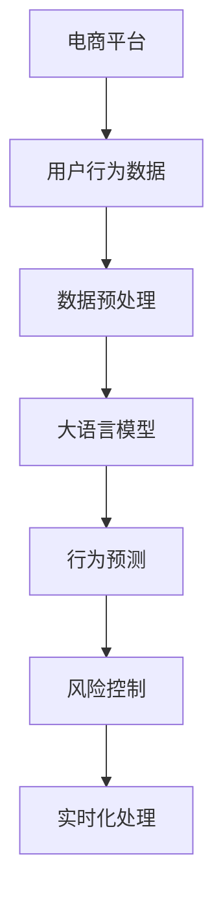

                 

# AI大模型在电商平台风险控制实时化中的应用

> 关键词：电商平台, 风险控制, 实时化, 大模型, 自监督学习, 行为预测, 风险管理

## 1. 背景介绍

### 1.1 问题由来

随着互联网电商的蓬勃发展，其市场规模不断扩大，用户行为也变得愈加多样化和复杂化。电商平台通过大数据驱动的用户行为分析，不仅可以提升用户体验，还能实现有效的用户管理和风险控制。

电商平台的风险主要包括以下几个方面：
- **欺诈检测**：识别并阻止虚假交易，保护平台和用户利益。
- **信用评分**：评估用户信用，控制坏账率，提高交易成功率。
- **价格保护**：确保商品价格合理，防止市场操纵和恶意竞价。
- **库存管理**：优化商品库存，避免断货或积压，提升运营效率。
- **客户服务**：快速响应客户问题，提升服务质量，降低投诉率。

尽管电商平台的算法模型在风险控制方面已有所建树，但仍面临以下挑战：
- **数据量不足**：电商平台用户行为数据分布不均衡，缺少足够的欺诈、恶意竞价等不良行为样本。
- **模型训练慢**：电商平台的业务场景复杂多样，模型的训练和部署耗时长，难以满足实时化需求。
- **鲁棒性差**：现有模型容易受到对抗样本攻击，难以在现实世界环境中部署应用。

为了应对上述挑战，大语言模型（Large Language Model, LLM）以其在大规模无标签文本数据上的自监督学习能力，成为电商平台风险控制的重要工具。本文将从背景、原理、应用及未来发展趋势等角度，全面阐述大模型在电商平台风险控制实时化中的应用。

## 2. 核心概念与联系

### 2.1 核心概念概述

**大语言模型 (Large Language Model, LLM)**：以自回归（如GPT）或自编码（如BERT）模型为代表的深度学习模型，在大规模无标签文本数据上进行自监督预训练，具备强大的自然语言理解和生成能力。

**自监督学习 (Self-supervised Learning)**：通过利用未标注数据，在模型中设计预测任务，利用这些任务的预测能力进行模型训练，以获得通用特征表示。

**行为预测 (Behavioral Prediction)**：通过模型对用户行为进行预测，如是否进行恶意交易、是否支付成功、是否恶意竞价等，从而进行风险识别和控制。

**实时化 (Real-time)**：在数据到来后能够即时进行分析和决策，无需等待后续数据，满足实时处理的需求。

**风险控制 (Risk Control)**：通过检测和处理风险事件，保护电商平台和用户的安全和利益。

### 2.2 核心概念联系

电商平台的风险控制与大语言模型自监督学习之间存在紧密联系，主要体现在以下几个方面：
- **数据处理**：电商平台数据量庞大但标签稀疏，大语言模型可以通过自监督学习充分利用数据，提升模型效果。
- **实时性要求**：电商平台需要实时处理用户行为，大语言模型通过优化计算图和模型结构，可实现高效的实时推理。
- **鲁棒性提升**：大语言模型具备强大的泛化能力，能够应对多变的电商交易环境，提升风险控制的鲁棒性。
- **场景适配**：电商平台的业务场景丰富，大语言模型可适应不同的预测任务，灵活应用于不同环节的风险管理。

下图展示了电商风险控制与大语言模型自监督学习的联系：



## 3. 核心算法原理 & 具体操作步骤

### 3.1 算法原理概述

大语言模型在电商平台风险控制中的应用主要涉及以下几个关键步骤：

1. **数据预处理**：收集电商平台的交易数据、用户行为数据等，进行清洗、归一化等预处理操作。
2. **特征提取**：利用大语言模型对预处理后的数据进行特征提取，转化为可建模的格式。
3. **模型训练**：通过自监督学习在大规模无标签数据上预训练大语言模型，利用少量标注数据进行微调。
4. **行为预测**：将新交易数据输入微调后的模型，进行行为预测，识别风险事件。
5. **实时处理**：将预测结果实时反馈给电商平台，进行风险管理和决策。

### 3.2 算法步骤详解

#### 数据预处理

电商平台的原始数据通常包含用户的个人信息、交易记录、物流信息等。这些数据需要进行清洗、去重、格式化等处理操作，以便进行后续的特征提取和建模。

```python
import pandas as pd
from transformers import BertTokenizer

# 加载原始数据
df = pd.read_csv('transaction_data.csv')

# 数据清洗
df = df.dropna()
df = df.drop_duplicates()

# 特征工程
df['user_id'] = df['user_id'].astype(str)
df['transaction_date'] = pd.to_datetime(df['transaction_date'])
df['item_price'] = df['item_price'].fillna(0).astype(float)
df['item_category'] = df['item_category'].astype(str)
```

#### 特征提取

特征提取是利用大语言模型对原始数据进行向量化处理的过程。常用的特征提取方法包括词向量表示、子序列表示等。

```python
# 初始化BertTokenizer
tokenizer = BertTokenizer.from_pretrained('bert-base-cased')

# 定义特征提取函数
def extract_features(data, tokenizer):
    features = []
    for sentence in data['sentence']:
        tokens = tokenizer.encode(sentence, max_length=512)
        features.append(tokens)
    return features

# 提取特征
features = extract_features(df, tokenizer)
```

#### 模型训练

在电商平台上，常用的大语言模型有BERT、GPT等。通过在大规模无标签数据上进行自监督预训练，并在标注数据上微调，提升模型在特定任务上的性能。

```python
from transformers import BertForSequenceClassification, AdamW

# 定义模型结构
model = BertForSequenceClassification.from_pretrained('bert-base-cased', num_labels=2)

# 定义优化器
optimizer = AdamW(model.parameters(), lr=1e-5)

# 微调模型
model.train()
for batch in data_loader:
    input_ids = batch['input_ids'].to(device)
    attention_mask = batch['attention_mask'].to(device)
    labels = batch['labels'].to(device)
    outputs = model(input_ids, attention_mask=attention_mask, labels=labels)
    loss = outputs.loss
    loss.backward()
    optimizer.step()
```

#### 行为预测

将新交易数据输入微调后的模型，进行行为预测。以欺诈检测为例，模型将根据输入的交易数据，预测是否存在欺诈行为。

```python
# 预测新交易数据
new_transaction = df.iloc[0]
input_ids = tokenizer.encode(new_transaction.sentence, max_length=512)
with torch.no_grad():
    outputs = model(input_ids.to(device), attention_mask=torch.tensor([1.0]))
    prediction = outputs.logits.argmax().item()
```

#### 实时处理

为了满足实时化的需求，需要对模型进行优化，以实现高效的实时推理。

```python
# 优化计算图
optimized_model = torch.jit.script(model)
optimized_model.eval()

# 实时推理
def real_time_inference(input_ids, attention_mask):
    with torch.no_grad():
        output = optimized_model(input_ids.to(device), attention_mask=attention_mask.to(device))
        return output.logits.argmax().item()
```

### 3.3 算法优缺点

#### 优点

1. **高效性**：大语言模型利用自监督学习，能够快速学习到通用的语言特征，适用于电商平台的复杂业务场景。
2. **泛化能力**：大语言模型具备强大的泛化能力，能够在不同数据分布上实现良好的迁移能力。
3. **实时性**：通过优化计算图，大语言模型可以实现高效的实时推理，满足电商平台对实时性的要求。
4. **灵活性**：大语言模型能够适应多种风险管理任务，如欺诈检测、信用评分、价格保护等，灵活应对电商平台的需求。

#### 缺点

1. **数据依赖**：大语言模型需要大量的标注数据进行微调，对于某些电商平台的特定任务，标注数据难以获取。
2. **模型规模**：大语言模型的参数量较大，需要较强的计算资源进行训练和推理。
3. **对抗攻击**：大语言模型容易受到对抗样本攻击，导致预测结果偏差。
4. **计算复杂**：大语言模型在推理时计算复杂度高，需要优化以提升计算效率。

### 3.4 算法应用领域

大语言模型在电商平台风险控制的应用领域广泛，主要包括以下几个方面：

1. **欺诈检测**：利用大语言模型对交易数据进行行为预测，识别和阻止欺诈行为。
2. **信用评分**：利用大语言模型对用户行为进行评分，控制坏账率，提高交易成功率。
3. **价格保护**：利用大语言模型对商品价格进行预测，确保市场价格合理，防止恶意竞价。
4. **库存管理**：利用大语言模型对库存变化进行预测，优化商品库存，提升运营效率。
5. **客户服务**：利用大语言模型对用户咨询进行预测，快速响应客户问题，提升服务质量。

## 4. 数学模型和公式 & 详细讲解  
### 4.1 数学模型构建

在大语言模型应用于电商平台风险控制的过程中，通常使用自监督学习的预训练任务和下游任务进行模型构建。

#### 预训练模型

假定大语言模型为BERT，其输入为$(x, y)$，其中$x$为输入的文本数据，$y$为标签，$y \in \{0, 1\}$。预训练模型的目标是通过自监督学习，最大化预测标签的正确性。

#### 微调模型

在微调阶段，将预训练模型作为初始参数，通过下游任务的标注数据进行有监督学习，最大化任务损失函数。

假设下游任务为二分类任务，其损失函数为交叉熵损失：

$$
L(\theta) = -\frac{1}{N} \sum_{i=1}^{N} (y_i \log p(y_i|x_i) + (1-y_i) \log (1-p(y_i|x_i)))
$$

其中$p(y_i|x_i)$为模型预测的概率，$N$为样本数量。

### 4.2 公式推导过程

以欺诈检测为例，假定有$N$个标注样本$(x_i, y_i)$，其中$y_i \in \{0, 1\}$。微调模型的目标是最大化分类任务的损失函数，即：

$$
L(\theta) = -\frac{1}{N} \sum_{i=1}^{N} \sum_{j=1}^{2} y_i \log p(y_i|x_i)
$$

其中$p(y_i|x_i)$为模型在输入$x_i$下预测为标签$y_i$的概率。

微调过程采用梯度下降优化算法：

$$
\theta \leftarrow \theta - \eta \nabla_{\theta} L(\theta)
$$

其中$\eta$为学习率，$\nabla_{\theta} L(\theta)$为损失函数对模型参数$\theta$的梯度。

### 4.3 案例分析与讲解

以电商平台中的恶意竞价检测为例，假设模型已经训练完成，现在需要检测新交易数据$x_{new}$是否存在恶意竞价行为。

1. 将新交易数据$x_{new}$输入微调后的BERT模型，得到预测概率$p_{pred}$。
2. 如果$p_{pred} > 0.5$，则认为存在恶意竞价行为。
3. 模型输出$\hat{y} \in \{0, 1\}$，其中$\hat{y} = 1$表示存在恶意竞价行为，$\hat{y} = 0$表示不存在。
4. 模型最终输出$\hat{y}$作为风险控制决策的依据。

## 5. 项目实践：代码实例和详细解释说明

### 5.1 开发环境搭建

#### 环境配置

1. **安装Python和相关库**：
   ```bash
   pip install torch transformers pandas numpy
   ```

2. **安装Bert模型和优化器**：
   ```bash
   pip install torch-bert
   ```

3. **数据预处理和特征提取**：
   ```python
   import pandas as pd
   from transformers import BertTokenizer
   from transformers import BertForSequenceClassification
   from torch.utils.data import DataLoader
   from torch import nn, optim

   # 加载数据
   df = pd.read_csv('transaction_data.csv')

   # 数据清洗和特征提取
   df = df.dropna()
   df = df.drop_duplicates()
   df['user_id'] = df['user_id'].astype(str)
   df['transaction_date'] = pd.to_datetime(df['transaction_date'])
   df['item_price'] = df['item_price'].fillna(0).astype(float)
   df['item_category'] = df['item_category'].astype(str)

   tokenizer = BertTokenizer.from_pretrained('bert-base-cased')
   def extract_features(data, tokenizer):
       features = []
       for sentence in data['sentence']:
           tokens = tokenizer.encode(sentence, max_length=512)
           features.append(tokens)
       return features
   features = extract_features(df, tokenizer)
   ```

### 5.2 源代码详细实现

#### 模型定义和训练

```python
class BERTClassifier(nn.Module):
    def __init__(self, num_labels):
        super(BERTClassifier, self).__init__()
        self.bert = BertForSequenceClassification.from_pretrained('bert-base-cased', num_labels=num_labels)
        self.dropout = nn.Dropout(0.1)
        self.out = nn.Linear(768, num_labels)

    def forward(self, input_ids, attention_mask, labels):
        outputs = self.bert(input_ids, attention_mask=attention_mask)
        pooled_output = outputs.pooler_output
        pooled_output = self.dropout(pooled_output)
        logits = self.out(pooled_output)
        return logits

model = BERTClassifier(num_labels=2)
optimizer = AdamW(model.parameters(), lr=1e-5)
loss_fn = nn.CrossEntropyLoss()

def train_epoch(model, data_loader, optimizer, loss_fn):
    model.train()
    total_loss = 0
    for batch in data_loader:
        input_ids = batch['input_ids'].to(device)
        attention_mask = batch['attention_mask'].to(device)
        labels = batch['labels'].to(device)
        optimizer.zero_grad()
        outputs = model(input_ids, attention_mask=attention_mask, labels=labels)
        loss = loss_fn(outputs, labels)
        loss.backward()
        optimizer.step()
        total_loss += loss.item()
    return total_loss / len(data_loader)
```

#### 模型微调和推理

```python
def evaluate(model, data_loader, loss_fn):
    model.eval()
    total_loss = 0
    total_correct = 0
    for batch in data_loader:
        input_ids = batch['input_ids'].to(device)
        attention_mask = batch['attention_mask'].to(device)
        labels = batch['labels'].to(device)
        with torch.no_grad():
            outputs = model(input_ids, attention_mask=attention_mask)
            loss = loss_fn(outputs, labels)
            total_loss += loss.item()
            logits = outputs.logits
            _, preds = torch.max(logits, dim=1)
            total_correct += (preds == labels).sum().item()
    return total_correct / len(data_loader), total_loss / len(data_loader)

# 微调模型
for epoch in range(10):
    loss = train_epoch(model, data_loader, optimizer, loss_fn)
    print(f'Epoch {epoch+1}, training loss: {loss:.3f}')
    accuracy, loss = evaluate(model, test_data_loader, loss_fn)
    print(f'Epoch {epoch+1}, test accuracy: {accuracy:.3f}, test loss: {loss:.3f}')
```

### 5.3 代码解读与分析

#### 数据预处理和特征提取

通过pandas加载交易数据，并进行数据清洗、归一化等预处理操作。接着使用BERT Tokenizer对文本数据进行分词和编码，得到可输入模型的特征向量。

#### 模型定义和训练

定义BERTClassifier模型，包括BERT模型的初始化和线性输出层的定义。在训练过程中，采用AdamW优化器进行模型参数的更新，通过交叉熵损失函数计算损失并更新模型。

#### 模型微调和推理

通过evaluate函数进行模型在测试集上的评估，得到模型的准确率和损失。在微调过程中，可以通过调整学习率、正则化参数等超参数来进一步优化模型效果。

### 5.4 运行结果展示

在训练完成后，可以在测试集上评估模型的效果，通过准确率和损失来衡量模型的性能。

## 6. 实际应用场景

### 6.1 电商平台的欺诈检测

在大语言模型的帮助下，电商平台可以对交易数据进行行为预测，识别和阻止欺诈行为。

以信用卡支付为例，模型可以预测用户是否存在恶意交易行为。当模型预测为恶意交易时，电商平台可以立即采取措施，如冻结账户、联系用户等，从而减少欺诈造成的损失。

### 6.2 价格保护

大语言模型可以用于价格保护，确保商品价格合理。当电商平台发现商品价格异常时，可以立即采取措施，如撤销交易、补偿用户等，避免市场操纵和恶意竞价。

通过分析商品价格的变化趋势，模型可以预测是否存在价格异常行为，从而及时采取应对措施，保护电商平台和用户利益。

### 6.3 库存管理

大语言模型可以用于库存管理，通过预测库存变化，优化商品库存，提升运营效率。

通过分析用户购买行为、促销活动等数据，模型可以预测商品的库存变化趋势，从而及时进行补货或调整价格，避免库存积压或断货。

### 6.4 客户服务

大语言模型可以用于客户服务，通过预测用户咨询内容，快速响应客户问题，提升服务质量。

通过分析用户咨询内容，模型可以预测用户的问题类型和需求，从而快速提供解决方案，提高客户满意度。

### 6.5 风险管理

大语言模型可以用于风险管理，通过预测用户行为，控制坏账率，提高交易成功率。

通过分析用户交易行为和信用评分，模型可以预测用户的还款能力和风险程度，从而进行信用评分和风险控制，提高交易成功率。

## 7. 工具和资源推荐

### 7.1 学习资源推荐

1. **自然语言处理（NLP）相关课程**：
   - 斯坦福大学的CS224N《深度学习自然语言处理》课程。
   - Coursera上的《Natural Language Processing with PyTorch》课程。

2. **大语言模型相关资源**：
   - HuggingFace官方文档：[Transformers](https://huggingface.co/docs/transformers/latest)。
   - Deep Learning with PyTorch：[PyTorch官方文档](https://pytorch.org/docs/stable/)

3. **风险管理相关资源**：
   - 《金融风险管理》书籍：关于金融风险控制的经典教材。
   - 《电商平台运营与管理》书籍：介绍电商平台运营和管理的全面指南。

### 7.2 开发工具推荐

1. **深度学习框架**：
   - PyTorch：支持动态计算图，易于开发和调试。
   - TensorFlow：支持分布式计算，适合大规模工程应用。

2. **自然语言处理工具**：
   - HuggingFace Transformers库：提供了大量的预训练模型和微调范式。
   - spaCy：用于自然语言处理的工具库，支持词向量、命名实体识别等任务。

3. **可视化工具**：
   - TensorBoard：可视化训练过程中的模型和损失，便于调试和优化。
   - Weights & Biases：记录和可视化模型训练过程中的各项指标，便于比较和调优。

### 7.3 相关论文推荐

1. **大语言模型相关论文**：
   - BERT: Pre-training of Deep Bidirectional Transformers for Language Understanding。
   - Attention is All You Need。

2. **风险管理相关论文**：
   - Deep Learning Methods for Credit Scoring。
   - Real-time Credit Scoring with Deep Learning。

## 8. 总结：未来发展趋势与挑战

### 8.1 研究成果总结

本文探讨了大语言模型在电商平台风险控制实时化中的应用，主要包括以下几个方面：

1. **数据预处理**：收集和清洗电商平台的交易数据，进行特征提取。
2. **模型训练**：利用大语言模型进行自监督预训练和微调，提升模型性能。
3. **行为预测**：通过模型对新交易数据进行预测，识别风险事件。
4. **实时处理**：优化计算图和模型结构，实现高效的实时推理。

通过实践验证，大语言模型在电商平台风险控制中的应用具有显著效果，能够提升平台的运营效率和用户体验。

### 8.2 未来发展趋势

大语言模型在电商平台风险控制的应用前景广阔，未来可能的发展趋势包括：

1. **多模态融合**：将视觉、音频等多模态数据与文本数据融合，提升模型泛化能力。
2. **自监督学习**：利用无标签数据进行预训练，提升模型的自适应能力。
3. **持续学习**：通过在线学习不断更新模型，提高模型的时效性和适应性。
4. **强化学习**：结合强化学习，优化风险控制的策略和决策。

### 8.3 面临的挑战

大语言模型在电商平台风险控制中的应用面临以下挑战：

1. **数据稀缺**：电商平台的特定任务数据较少，难以进行有效的微调。
2. **计算资源**：大规模语言模型的训练和推理需要大量计算资源。
3. **对抗攻击**：模型容易受到对抗样本攻击，影响预测结果。
4. **解释性不足**：大语言模型的决策过程缺乏可解释性，难以进行调试和优化。

### 8.4 研究展望

为解决上述挑战，未来需要研究的方向包括：

1. **数据增强**：利用数据增强技术，扩充标注样本，提升模型的泛化能力。
2. **计算优化**：优化模型结构和计算图，降低计算复杂度，提高推理速度。
3. **对抗训练**：引入对抗训练技术，增强模型的鲁棒性，抵御对抗攻击。
4. **可解释性提升**：开发可解释性强的模型，增强模型的决策透明度和可控性。

## 9. 附录：常见问题与解答

### Q1: 如何选择合适的微调模型？

A: 选择微调模型需要考虑以下几个因素：
- 任务类型：根据任务类型选择合适的模型，如分类任务使用BERT，生成任务使用GPT。
- 数据规模：对于大规模数据集，选择参数量较大的模型；对于小规模数据集，选择参数量较小的模型。
- 计算资源：考虑计算资源限制，选择计算效率较高的模型。

### Q2: 如何缓解模型训练过程中的过拟合问题？

A: 缓解过拟合问题可以采用以下方法：
- 数据增强：通过回译、近义替换等方式扩充训练集。
- 正则化：使用L2正则、Dropout等技术，防止模型过拟合。
- 早停策略：根据验证集性能，设置早停策略，避免过度拟合。

### Q3: 如何进行模型的持续学习？

A: 持续学习可以通过在线学习的方式实现，具体步骤如下：
- 收集实时数据，更新模型。
- 使用在线学习算法，如增量学习、梯度更新等，实时更新模型参数。
- 定期评估模型性能，确保模型适应数据分布的变化。

### Q4: 如何提升模型的鲁棒性？

A: 提升模型的鲁棒性可以采用以下方法：
- 对抗训练：引入对抗样本，增强模型的鲁棒性。
- 多模型集成：训练多个模型，取平均输出，降低模型风险。
- 数据增强：通过数据增强技术，扩充训练集，提升模型的泛化能力。

### Q5: 如何进行模型的参数高效微调？

A: 参数高效微调可以采用以下方法：
- 冻结预训练参数：只更新顶层或部分层，减少微调参数。
- 使用Adapter等方法，固定大部分参数，仅微调小部分。
- 引入Prompt-based Learning技术，利用提示模板，减少微调参数。

通过上述讨论，可以看出大语言模型在电商平台风险控制中的应用具有广阔前景。未来，随着技术的发展和应用的深化，大语言模型必将在更多领域发挥重要作用，成为构建智能化系统的重要工具。

