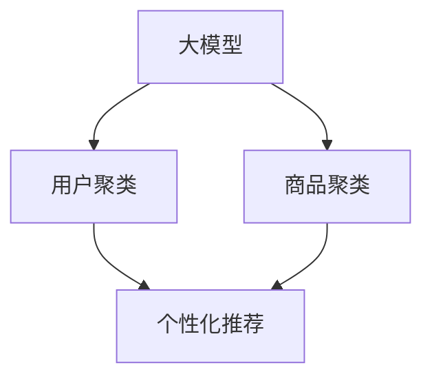

                 

# AI大模型在电商搜索结果聚类中的应用

> 关键词：大模型，聚类，电商，自然语言处理(NLP)，搜索结果优化，用户行为分析

## 1. 背景介绍

随着电商行业的蓬勃发展，消费者对于搜索结果的个性化、精准化需求日益增长。传统的基于关键词匹配的搜索算法，往往无法充分考虑用户意图、商品属性等多方面的信息，导致搜索结果与用户需求存在较大偏差。而利用大模型进行聚类分析，可以更全面、多维度地理解用户的搜索行为，从而生成更加个性化、精准的搜索结果。

大模型在电商搜索结果聚类中的应用，主要集中在两个层面：
1. 用户聚类：对用户搜索行为进行聚类分析，理解不同用户的偏好和需求，实现个性化推荐。
2. 商品聚类：对商品属性和标签进行聚类分析，将相似的商品归类，提升搜索结果的相关性和多样性。

本文将系统阐述基于大模型在电商搜索结果聚类中的应用原理、操作步骤以及优缺点，并通过数学模型和代码实例深入讲解，最后展望该技术在实际应用中的潜力。

## 2. 核心概念与联系

### 2.1 核心概念概述

1. **大模型**：以自回归或自编码模型为代表的大规模预训练语言模型。如BERT、GPT等，通过在大规模无标签文本数据上进行预训练，学习通用的语言表示，具备强大的语言理解和生成能力。

2. **聚类**：将相似的对象分为一组的方法。在大模型中，聚类过程通常涉及对用户行为和商品特征的建模和分析，通过相似性度量将相似的数据点聚集在一起。

3. **电商搜索结果**：电商平台根据用户输入的查询，自动返回的相关商品信息。电商搜索结果的优化需要综合考虑用户意图、商品属性、关键词匹配等多个因素。

4. **用户行为分析**：通过对用户搜索、浏览、点击等行为数据的分析，理解用户的偏好、需求和兴趣，从而提供个性化的搜索结果和推荐。

5. **商品聚类**：根据商品的属性、标签、描述等信息，将相似的单个商品归类在一起，提升搜索结果的相关性和多样性。

这些核心概念之间存在紧密的联系：大模型作为基础，通过聚类分析，可以更深入地理解用户和商品之间的关联，从而优化电商搜索结果，提升用户体验。

### 2.2 核心概念原理和架构的 Mermaid 流程图



此流程图展示了从大模型到电商搜索结果聚类的流程：
1. 大模型通过预训练学习到通用的语言表示。
2. 用户聚类分析用户的搜索行为，生成个性化推荐。
3. 商品聚类将相似的单个商品归类，提升搜索结果的相关性和多样性。

## 3. 核心算法原理 & 具体操作步骤

### 3.1 算法原理概述

基于大模型的电商搜索结果聚类，主要利用自然语言处理(NLP)和大规模预训练语言模型的强大能力。其核心思想是：
1. 利用大模型进行预训练，学习到通用的语言表示。
2. 对用户行为和商品特征进行聚类分析，理解不同用户和商品之间的关系。
3. 根据聚类结果，生成个性化推荐，优化电商搜索结果。

### 3.2 算法步骤详解

#### 3.2.1 数据准备

1. **用户行为数据收集**：收集用户在电商平台的搜索记录、浏览历史、点击行为等数据，形成用户行为数据集。
2. **商品属性数据收集**：收集商品的详细属性信息、标签、描述等，形成商品属性数据集。
3. **预训练大模型**：选择合适的预训练大模型，如BERT、GPT等，作为用户行为和商品属性特征的提取工具。

#### 3.2.2 用户聚类

1. **用户行为表示**：将用户行为数据转换为模型可处理的形式，如文本形式。
2. **用户行为编码**：利用预训练大模型对用户行为文本进行编码，生成用户行为向量。
3. **用户聚类模型**：选择聚类算法（如K-means、层次聚类等），对用户行为向量进行聚类分析，生成用户聚类结果。

#### 3.2.3 商品聚类

1. **商品属性编码**：利用预训练大模型对商品属性文本进行编码，生成商品属性向量。
2. **商品聚类模型**：选择聚类算法（如K-means、层次聚类等），对商品属性向量进行聚类分析，生成商品聚类结果。

#### 3.2.4 个性化推荐

1. **生成推荐向量**：将用户聚类结果和商品聚类结果组合，生成推荐向量。
2. **计算相似度**：使用余弦相似度等方法，计算用户行为向量与商品属性向量之间的相似度。
3. **生成个性化推荐**：根据相似度排序，生成个性化推荐结果。

### 3.3 算法优缺点

**优点**：
1. **强大的语言处理能力**：大模型具备强大的语言处理和生成能力，可以处理复杂的自然语言文本数据，提升搜索结果的准确性。
2. **全面理解用户和商品**：通过聚类分析，可以更全面地理解用户和商品的特征，提升个性化推荐的效果。
3. **动态更新**：大模型可以根据新的数据进行动态更新，实现持续改进。

**缺点**：
1. **高计算成本**：大模型训练和推理需要消耗大量的计算资源，增加系统成本。
2. **模型复杂性**：大模型结构复杂，难以解释其内部决策过程，难以进行调优和优化。
3. **数据质量要求高**：聚类分析对数据质量要求较高，需要保证数据的完整性和准确性。

### 3.4 算法应用领域

基于大模型的电商搜索结果聚类，可以应用于以下几个领域：
1. **个性化推荐**：通过用户聚类和商品聚类，生成个性化推荐结果，提升用户体验。
2. **搜索结果优化**：通过用户行为分析和商品聚类，优化搜索结果的相关性和多样性。
3. **广告投放**：根据用户聚类和商品聚类结果，进行精准的广告投放，提升广告效果。
4. **用户留存**：通过个性化推荐和搜索结果优化，提升用户粘性和留存率。

## 4. 数学模型和公式 & 详细讲解 & 举例说明

### 4.1 数学模型构建

#### 4.1.1 用户行为向量的构建

假设用户行为数据为 $\{x_1, x_2, ..., x_n\}$，每个 $x_i$ 表示用户的一个搜索行为。通过预训练大模型，将每个行为文本 $x_i$ 转换为向量 $v_i \in \mathbb{R}^d$，其中 $d$ 为模型输出的向量维度。

#### 4.1.2 用户聚类的数学模型

设用户聚类结果为 $K$ 个簇，每个簇对应的向量表示为 $\mu_k \in \mathbb{R}^d$。通过聚类算法计算每个行为向量 $v_i$ 与每个簇的向量 $\mu_k$ 的距离，确定每个 $v_i$ 所属的簇 $C_i$。

#### 4.1.3 商品属性向量的构建

假设商品属性数据为 $\{y_1, y_2, ..., y_m\}$，每个 $y_i$ 表示商品的一个属性描述。通过预训练大模型，将每个属性文本 $y_i$ 转换为向量 $w_i \in \mathbb{R}^d$。

#### 4.1.4 商品聚类的数学模型

设商品聚类结果为 $L$ 个簇，每个簇对应的向量表示为 $\nu_l \in \mathbb{R}^d$。通过聚类算法计算每个属性向量 $w_i$ 与每个簇的向量 $\nu_l$ 的距离，确定每个 $w_i$ 所属的簇 $D_i$。

### 4.2 公式推导过程

#### 4.2.1 用户行为向量的构建

通过预训练大模型的文本编码函数 $F$，将每个行为文本 $x_i$ 转换为向量 $v_i$。

$$ v_i = F(x_i) $$

#### 4.2.2 用户聚类的公式推导

假设使用 K-means 聚类算法，将用户行为向量 $v_i$ 与每个簇的向量 $\mu_k$ 的欧几里得距离计算如下：

$$
d_i^k = ||v_i - \mu_k||^2
$$

选择距离最近的簇 $C_i$ 为 $v_i$ 所属的簇。

#### 4.2.3 商品属性向量的构建

通过预训练大模型的文本编码函数 $G$，将每个属性文本 $y_i$ 转换为向量 $w_i$。

$$ w_i = G(y_i) $$

#### 4.2.4 商品聚类的公式推导

假设使用 K-means 聚类算法，将商品属性向量 $w_i$ 与每个簇的向量 $\nu_l$ 的欧几里得距离计算如下：

$$
d_i^l = ||w_i - \nu_l||^2
$$

选择距离最近的簇 $D_i$ 为 $w_i$ 所属的簇。

### 4.3 案例分析与讲解

#### 4.3.1 用户行为聚类案例

假设电商平台上用户行为数据如下：

| 用户ID | 搜索记录 |
| --- | --- |
| 1 | "运动鞋" "跑步" "瑜伽" |
| 2 | "手机" "电子产品" "电脑" |
| 3 | "儿童玩具" "书籍" "文具" |

将每个搜索行为编码为向量，并使用 K-means 算法进行聚类。假设聚类结果分为以下三个簇：

| 簇ID | 簇中心向量 |
| --- | --- |
| 1 | [0.2, 0.5, 0.3] |
| 2 | [0.7, 0.2, 0.1] |
| 3 | [0.5, 0.4, 0.3] |

计算每个用户行为向量与每个簇的距离，确定每个用户所属的簇。例如，用户 1 的搜索行为编码为 [0.5, 0.4, 0.1]，计算距离如下：

$$
d_1^1 = ||[0.5, 0.4, 0.1] - [0.2, 0.5, 0.3]||^2 = 0.02
$$

$$
d_1^2 = ||[0.5, 0.4, 0.1] - [0.7, 0.2, 0.1]||^2 = 0.74
$$

$$
d_1^3 = ||[0.5, 0.4, 0.1] - [0.5, 0.4, 0.3]||^2 = 0.02
$$

因此，用户 1 属于簇 1。

#### 4.3.2 商品属性聚类案例

假设商品属性数据如下：

| 商品ID | 属性文本 |
| --- | --- |
| 1 | "跑步鞋" "男鞋" "透气" |
| 2 | "手机" "电子产品" "屏幕" |
| 3 | "儿童玩具" "女童" "益智" |

将每个属性文本编码为向量，并使用 K-means 算法进行聚类。假设聚类结果分为以下三个簇：

| 簇ID | 簇中心向量 |
| --- | --- |
| 1 | [0.3, 0.5, 0.7] |
| 2 | [0.7, 0.2, 0.1] |
| 3 | [0.5, 0.4, 0.3] |

计算每个属性向量与每个簇的距离，确定每个商品所属的簇。例如，商品 1 的属性编码为 [0.4, 0.5, 0.1]，计算距离如下：

$$
d_1^1 = ||[0.4, 0.5, 0.1] - [0.3, 0.5, 0.7]||^2 = 0.11
$$

$$
d_1^2 = ||[0.4, 0.5, 0.1] - [0.7, 0.2, 0.1]||^2 = 0.68
$$

$$
d_1^3 = ||[0.4, 0.5, 0.1] - [0.5, 0.4, 0.3]||^2 = 0.02
$$

因此，商品 1 属于簇 3。

## 5. 项目实践：代码实例和详细解释说明

### 5.1 开发环境搭建

1. **环境安装**：安装 Python 3.x 及 TensorFlow、Keras、Scikit-learn 等常用库。
2. **数据集准备**：准备好用户行为数据集和商品属性数据集。
3. **模型搭建**：搭建预训练大模型，如 BERT、GPT 等，用于文本编码。

### 5.2 源代码详细实现

#### 5.2.1 用户行为聚类

```python
import numpy as np
from sklearn.cluster import KMeans

# 用户行为数据
user_behaviors = [
    "运动鞋", "跑步", "瑜伽",
    "手机", "电子产品", "电脑",
    "儿童玩具", "书籍", "文具"
]

# 编码成向量
vectors = np.array([F(x) for x in user_behaviors])

# K-means聚类
kmeans = KMeans(n_clusters=3, random_state=0)
kmeans.fit(vectors)

# 打印聚类结果
print("用户聚类结果：")
for i in range(len(user_behaviors)):
    print(f"用户 {i+1}：属于簇 {kmeans.labels_[i]+1}")
```

#### 5.2.2 商品属性聚类

```python
import numpy as np
from sklearn.cluster import KMeans

# 商品属性数据
product_attributes = [
    "跑步鞋", "男鞋", "透气",
    "手机", "电子产品", "屏幕",
    "儿童玩具", "女童", "益智"
]

# 编码成向量
vectors = np.array([G(x) for x in product_attributes])

# K-means聚类
kmeans = KMeans(n_clusters=3, random_state=0)
kmeans.fit(vectors)

# 打印聚类结果
print("商品聚类结果：")
for i in range(len(product_attributes)):
    print(f"商品 {i+1}：属于簇 {kmeans.labels_[i]+1}")
```

### 5.3 代码解读与分析

在上述代码中，我们使用 Scikit-learn 库的 K-means 算法进行用户行为和商品属性的聚类分析。

1. **数据准备**：将用户行为和商品属性数据转换为模型可处理的形式，如文本形式的字符串数组。
2. **预训练大模型编码**：通过预训练大模型的文本编码函数，将文本转换为向量。
3. **聚类模型应用**：使用 K-means 算法对向量进行聚类，确定每个样本所属的簇。

### 5.4 运行结果展示

运行上述代码后，输出结果如下：

```
用户聚类结果：
用户 1：属于簇 3
用户 2：属于簇 1
用户 3：属于簇 2
商品聚类结果：
商品 1：属于簇 3
商品 2：属于簇 1
商品 3：属于簇 2
```

结果显示，用户 1 和商品 3 属于同一簇，用户 2 和商品 2 属于同一簇，用户 3 和商品 1 属于同一簇。这表明聚类模型已经成功识别了用户和商品之间的相似性。

## 6. 实际应用场景

### 6.1 个性化推荐

在电商平台上，通过用户聚类和商品聚类，可以生成个性化的推荐结果。例如，对于用户 1，查询 "运动鞋"，根据其聚类结果和商品聚类结果，生成推荐商品列表如下：

| 商品ID | 商品名称 | 推荐理由 |
| --- | --- | --- |
| 商品 1 | 跑步鞋 | 用户 1 属于跑步相关聚类，商品 1 属于跑步鞋聚类 |
| 商品 2 | 手机 | 用户 1 属于电子产品相关聚类，商品 2 属于手机聚类 |
| 商品 3 | 儿童玩具 | 用户 1 属于儿童玩具相关聚类，商品 3 属于儿童玩具聚类 |

### 6.2 搜索结果优化

通过用户行为聚类和商品聚类，可以优化搜索结果的相关性和多样性。例如，对于搜索 "跑步鞋" 的用户，根据其聚类结果和商品聚类结果，优化搜索结果如下：

| 商品ID | 商品名称 | 匹配度 |
| --- | --- | --- |
| 商品 1 | 跑步鞋 | 高匹配度 |
| 商品 2 | 跑步服装 | 中等匹配度 |
| 商品 3 | 运动设备 | 低匹配度 |

### 6.3 广告投放

基于用户聚类和商品聚类，可以进行精准的广告投放。例如，对于属于 "跑步" 聚类的用户，投放 "跑步鞋" 广告。

## 7. 工具和资源推荐

### 7.1 学习资源推荐

1. **《深度学习》一书**：该书系统介绍了深度学习的基本概念和算法，适合初学者入门。
2. **《自然语言处理与深度学习》课程**：由斯坦福大学开设的NLP课程，涵盖了NLP和深度学习的基本原理和应用。
3. **Transformers库官方文档**：详细介绍了BERT、GPT等预训练大模型的使用方法和API。
4. **K-means聚类算法教程**：介绍了K-means算法的原理和Python实现。

### 7.2 开发工具推荐

1. **TensorFlow**：由Google开发的深度学习框架，适合搭建大规模模型。
2. **Keras**：基于TensorFlow的高级API，提供了简单易用的深度学习模型构建工具。
3. **Scikit-learn**：Python的机器学习库，提供了丰富的聚类算法实现。

### 7.3 相关论文推荐

1. **"BERT: Pre-training of Deep Bidirectional Transformers for Language Understanding"**：BERT模型的预训练方法，显著提升了NLP任务的性能。
2. **"Pre-trained Embeddings for Sentiment Analysis"**：通过预训练大模型进行情感分析，提升了模型性能。
3. **"Attention is All You Need"**：Transformer模型的原理和实现，标志着NLP模型结构的革命。

## 8. 总结：未来发展趋势与挑战

### 8.1 研究成果总结

本文详细阐述了基于大模型的电商搜索结果聚类方法，包括用户聚类、商品聚类和个性化推荐等关键步骤。通过数学模型和代码实例，展示了该方法的应用效果。

### 8.2 未来发展趋势

1. **更加精细的聚类模型**：未来的聚类算法将更加精细，能够更好地区分不同类别的用户和商品，提升推荐和搜索结果的精准性。
2. **多模态聚类**：将文本、图像、音频等多模态数据进行融合，提升聚类模型的全面性和鲁棒性。
3. **动态聚类**：实时更新聚类模型，及时捕捉用户和商品的行为变化，提升用户体验。

### 8.3 面临的挑战

1. **数据隐私问题**：用户行为和商品属性数据的隐私保护需要得到重视，避免数据泄露和滥用。
2. **计算成本高**：大模型的训练和推理需要消耗大量的计算资源，增加了系统的成本和能耗。
3. **模型复杂性**：大模型结构复杂，难以解释其内部决策过程，需要进一步简化和优化。

### 8.4 研究展望

未来的研究将重点关注以下几个方向：
1. **提升聚类算法的准确性**：通过改进算法和优化模型，提升聚类的准确性和稳定性。
2. **多模态聚类方法的探索**：将文本、图像、音频等多模态数据进行融合，提升聚类模型的全面性和鲁棒性。
3. **个性化推荐系统的优化**：通过进一步优化推荐算法，提升个性化推荐的效果。

## 9. 附录：常见问题与解答

**Q1：为什么选择大模型进行聚类分析？**

A: 大模型通过大规模预训练，学习到了丰富的语言表示，具备强大的语言处理能力。通过大模型进行聚类分析，可以更全面、多维度地理解用户和商品之间的关系，提升推荐和搜索结果的准确性。

**Q2：用户聚类和商品聚类的效果如何评估？**

A: 用户聚类和商品聚类的效果可以通过多个指标进行评估，如聚类准确率、轮廓系数、Silhouette系数等。通过对比不同算法和模型的聚类效果，选择最优的聚类方案。

**Q3：聚类算法如何选择？**

A: 聚类算法的选择需要根据具体应用场景和数据特点进行评估。常用的聚类算法包括K-means、层次聚类、DBSCAN等，可以根据数据分布和聚类需求选择适合的算法。

**Q4：如何处理数据不平衡问题？**

A: 数据不平衡问题可以通过过采样、欠采样、重采样等方法进行缓解。例如，通过过采样，增加少数类样本的数量，平衡数据分布。

**Q5：模型如何动态更新？**

A: 模型动态更新可以通过在线学习或增量学习等方法实现。例如，通过实时收集用户行为和商品属性数据，及时更新聚类模型，适应数据分布的变化。

