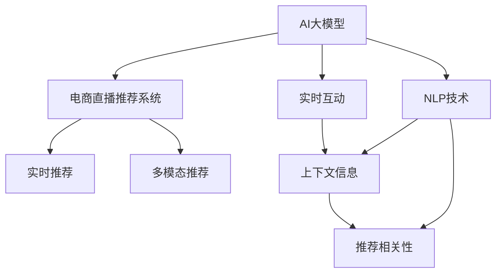

                 

## 1. 背景介绍

### 1.1 问题由来
随着电商直播行业的蓬勃发展，如何提升直播推荐系统的效果，增强用户体验，成为电商直播平台亟待解决的难题。传统推荐系统通常依赖于用户历史行为数据进行物品推荐，但在直播场景下，用户行为具有突发性、即时性、强社交性的特点，传统推荐算法难以应对。

### 1.2 问题核心关键点
本文聚焦于AI大模型在电商直播推荐系统中的应用，主要关注以下核心问题：

- 如何利用大模型强大的语言理解和生成能力，提升直播推荐系统的效果？
- 如何构建一个能够快速响应用户互动、个性化推荐直播内容的系统？
- 如何在直播推荐过程中，引入更多的上下文信息，增强推荐相关性？
- 如何优化直播推荐系统的算力和存储成本，提升系统响应速度？

### 1.3 问题研究意义
大模型在电商直播推荐中的应用，可以带来以下显著优势：

- 提升推荐精度：大模型能够综合利用用户历史行为数据、实时互动信息，进行更精准的物品推荐。
- 增强推荐相关性：大模型可以理解复杂的上下文信息，如主播特点、产品属性、互动行为等，生成相关性更高的推荐。
- 支持实时响应：大模型快速生成推荐结果，能够即时响应用户互动，提升用户体验。
- 降低推荐成本：大模型可以大幅减少对历史行为数据的依赖，降低推荐系统的开发和维护成本。

总之，AI大模型在电商直播推荐中的应用，将大幅提升推荐系统的效果和用户体验，为电商直播平台带来显著的商业价值。

## 2. 核心概念与联系

### 2.1 核心概念概述

为更好地理解AI大模型在电商直播推荐中的应用，本文将介绍几个关键概念：

- AI大模型：以BERT、GPT-3、Transformer等结构为代表，在大规模无标签数据上进行预训练，具备强大的语言理解和生成能力的模型。
- 电商直播推荐系统：利用AI大模型对直播内容进行推荐，提升用户观看体验，促进商品销售的系统。
- 自然语言处理(NLP)：大模型在电商直播推荐中广泛应用的技术，通过处理主播、用户、商品等文本信息，提升推荐系统的效果。
- 实时推荐系统：根据用户实时互动信息，动态生成个性化推荐，支持快速响应用户需求。
- 多模态推荐系统：结合文本、图像、视频等多种模态信息，提升推荐系统的丰富性和精准性。

这些概念通过以下Mermaid流程图展示了它们之间的联系：



这个流程图展示了AI大模型在电商直播推荐中的应用过程：

1. AI大模型通过预训练获得通用语言表示，用于理解主播、用户、商品等文本信息。
2. 电商直播推荐系统利用大模型处理文本信息，生成个性化推荐。
3. 实时推荐系统根据用户实时互动信息，动态更新推荐结果。
4. 多模态推荐系统结合文本、图像、视频等多种信息，提升推荐丰富性和精准性。

## 3. 核心算法原理 & 具体操作步骤
### 3.1 算法原理概述

AI大模型在电商直播推荐中的应用，主要基于以下算法原理：

- 基于自然语言处理(NLP)技术，利用大模型处理主播、用户、商品等文本信息，提取关键特征。
- 结合实时互动信息，动态生成个性化推荐。
- 通过多模态融合，提升推荐系统的丰富性和精准性。
- 使用在线学习、增量学习等技术，支持快速响应用户需求，适应数据分布变化。

### 3.2 算法步骤详解

以下是AI大模型在电商直播推荐系统中的应用步骤：

**Step 1: 数据准备**

- 收集电商直播平台的历史数据，包括主播互动信息、用户历史行为、商品属性、观看时长等。
- 清洗和预处理数据，提取文本、图像、音频等多模态特征。
- 划分训练集、验证集和测试集，按比例分为不同部分。

**Step 2: 模型构建**

- 选择适合的预训练模型，如BERT、GPT-3等，作为初始化参数。
- 设计任务适配层，如分类层、回归层、生成层等，根据具体推荐任务需求进行设计。
- 确定微调策略，如参数冻结、逐层微调等，减少计算成本。

**Step 3: 数据输入**

- 设计数据输入接口，将主播、用户、商品等文本信息，以及实时互动信息输入到模型中。
- 对文本信息进行分词、编码等预处理，保证模型能够理解输入。

**Step 4: 特征提取**

- 利用大模型的预训练表示，提取主播、用户、商品等文本特征。
- 将提取的特征与实时互动信息、多模态信息进行融合，生成综合特征向量。

**Step 5: 推荐生成**

- 根据融合后的特征向量，利用任务适配层进行推荐生成，输出推荐结果。
- 使用在线学习或增量学习技术，根据实时互动信息动态更新推荐结果。

**Step 6: 结果评估与优化**

- 在验证集和测试集上评估推荐效果，计算准确率、召回率、F1-score等指标。
- 根据评估结果进行模型优化，调整任务适配层、微调策略等参数。

### 3.3 算法优缺点

AI大模型在电商直播推荐中的应用，具有以下优点：

- 提升推荐精度：大模型能够综合利用多模态信息，提取丰富的特征，生成更精准的推荐。
- 增强推荐相关性：大模型能够理解复杂的上下文信息，生成相关性更高的推荐。
- 支持实时响应：大模型快速生成推荐结果，能够即时响应用户需求。
- 降低推荐成本：大模型可以大幅减少对历史行为数据的依赖，降低推荐系统的开发和维护成本。

同时，也存在以下局限性：

- 数据依赖：推荐效果依赖于高质量、多样化的标注数据。
- 资源消耗：大模型计算量较大，对算力、存储资源有较高要求。
- 模型复杂度：大模型参数量庞大，模型复杂度较高。

### 3.4 算法应用领域

AI大模型在电商直播推荐系统中的应用，已经广泛应用于以下领域：

- 直播内容推荐：根据主播特点、直播内容等文本信息，推荐相关直播内容。
- 商品推荐：结合用户历史行为数据、实时互动信息，推荐相关商品。
- 互动信息生成：利用大模型生成互动提示、引导语等，提升用户互动质量。
- 用户画像生成：利用大模型分析用户行为，生成详细用户画像，提升推荐精度。

## 4. 数学模型和公式 & 详细讲解 & 举例说明

### 4.1 数学模型构建

为了更好地理解AI大模型在电商直播推荐中的应用，本节将介绍几个关键数学模型。

设电商直播平台的历史数据集为 $D=\{(x_i,y_i)\}_{i=1}^N, x_i \in \mathcal{X}, y_i \in \mathcal{Y}$，其中 $\mathcal{X}$ 为文本特征空间，$\mathcal{Y}$ 为推荐结果空间。假设使用BERT作为预训练模型，其参数为 $\theta$，任务适配层为 $f$，则推荐模型的损失函数为：

$$
\mathcal{L}(\theta) = \frac{1}{N} \sum_{i=1}^N \ell(f(M_{\theta}(x_i)),y_i)
$$

其中 $\ell$ 为推荐任务的损失函数，可以是交叉熵、均方误差等。

### 4.2 公式推导过程

以直播内容推荐为例，假设主播的文本编码为 $x$，推荐结果为 $y$，则模型输出的预测概率为：

$$
\hat{y} = f(M_{\theta}(x))
$$

推荐损失函数为：

$$
\ell(f(M_{\theta}(x)),y) = -[y\log \hat{y} + (1-y)\log (1-\hat{y})]
$$

在训练过程中，根据梯度下降等优化算法，更新模型参数 $\theta$ 和任务适配层 $f$，使得模型输出逼近真实标签 $y$，最小化损失函数 $\mathcal{L}(\theta)$。

### 4.3 案例分析与讲解

假设电商直播平台需要推荐某主播的直播内容，根据用户的历史行为数据，大模型提取出用户画像特征 $u$ 和主播特征 $p$，生成推荐结果 $r$。具体过程如下：

1. 收集用户历史行为数据，提取文本特征 $u$。
2. 将 $u$ 输入到预训练的BERT模型中，提取用户特征向量 $u_v$。
3. 收集主播直播内容，提取文本特征 $p$。
4. 将 $p$ 输入到预训练的BERT模型中，提取主播特征向量 $p_v$。
5. 将 $u_v$ 和 $p_v$ 输入到任务适配层 $f$，生成推荐结果 $r$。
6. 根据用户实时互动信息，动态更新推荐结果 $r$。
7. 在验证集和测试集上评估推荐效果，优化模型参数和任务适配层 $f$。

## 5. 项目实践：代码实例和详细解释说明

### 5.1 开发环境搭建

在进行项目实践前，我们需要准备好开发环境。以下是使用Python进行PyTorch开发的环境配置流程：

1. 安装Anaconda：从官网下载并安装Anaconda，用于创建独立的Python环境。

2. 创建并激活虚拟环境：
```bash
conda create -n pytorch-env python=3.8 
conda activate pytorch-env
```

3. 安装PyTorch：根据CUDA版本，从官网获取对应的安装命令。例如：
```bash
conda install pytorch torchvision torchaudio cudatoolkit=11.1 -c pytorch -c conda-forge
```

4. 安装TensorFlow：
```bash
pip install tensorflow
```

5. 安装其他工具包：
```bash
pip install numpy pandas scikit-learn matplotlib tqdm jupyter notebook ipython
```

完成上述步骤后，即可在`pytorch-env`环境中开始项目实践。

### 5.2 源代码详细实现

下面以电商直播推荐系统为例，给出使用PyTorch对BERT模型进行直播内容推荐的PyTorch代码实现。

首先，定义直播内容推荐的数据处理函数：

```python
from transformers import BertTokenizer
from torch.utils.data import Dataset
import torch

class LiveStreamDataset(Dataset):
    def __init__(self, text_features, user_features, teacher_labels, tokenizer, max_len=128):
        self.text_features = text_features
        self.user_features = user_features
        self.teacher_labels = teacher_labels
        self.tokenizer = tokenizer
        self.max_len = max_len
        
    def __len__(self):
        return len(self.text_features)
    
    def __getitem__(self, item):
        text_tokens = self.tokenizer.tokenize(self.text_features[item])
        text_tokens = text_tokens[:self.max_len]
        text_features = [self.tokenizer.convert_tokens_to_ids(token) for token in text_tokens]
        text_features = torch.tensor(text_features, dtype=torch.long)
        
        user_tokens = self.tokenizer.tokenize(self.user_features[item])
        user_tokens = user_tokens[:self.max_len]
        user_features = [self.tokenizer.convert_tokens_to_ids(token) for token in user_tokens]
        user_features = torch.tensor(user_features, dtype=torch.long)
        
        teacher_labels = torch.tensor(self.teacher_labels[item], dtype=torch.long)
        
        return {'text_features': text_features, 
                'user_features': user_features,
                'teacher_labels': teacher_labels}
```

然后，定义模型和优化器：

```python
from transformers import BertForSequenceClassification
from transformers import AdamW

model = BertForSequenceClassification.from_pretrained('bert-base-cased', num_labels=1)

optimizer = AdamW(model.parameters(), lr=2e-5)
```

接着，定义训练和评估函数：

```python
from torch.utils.data import DataLoader
from tqdm import tqdm
from sklearn.metrics import roc_auc_score

device = torch.device('cuda') if torch.cuda.is_available() else torch.device('cpu')
model.to(device)

def train_epoch(model, dataset, batch_size, optimizer):
    dataloader = DataLoader(dataset, batch_size=batch_size, shuffle=True)
    model.train()
    epoch_loss = 0
    for batch in tqdm(dataloader, desc='Training'):
        text_features = batch['text_features'].to(device)
        user_features = batch['user_features'].to(device)
        teacher_labels = batch['teacher_labels'].to(device)
        model.zero_grad()
        outputs = model(text_features, attention_mask=None, labels=None)
        loss = outputs.loss
        epoch_loss += loss.item()
        loss.backward()
        optimizer.step()
    return epoch_loss / len(dataloader)

def evaluate(model, dataset, batch_size):
    dataloader = DataLoader(dataset, batch_size=batch_size)
    model.eval()
    y_preds, y_labels = [], []
    with torch.no_grad():
        for batch in tqdm(dataloader, desc='Evaluating'):
            text_features = batch['text_features'].to(device)
            user_features = batch['user_features'].to(device)
            teacher_labels = batch['teacher_labels'].to(device)
            outputs = model(text_features, attention_mask=None, labels=None)
            y_preds.append(outputs.logits)
            y_labels.append(teacher_labels)
                
    y_preds = torch.cat(y_preds, dim=0).squeeze().numpy()
    y_labels = torch.cat(y_labels, dim=0).squeeze().numpy()
    print(f"ROC AUC: {roc_auc_score(y_labels, y_preds)}")
```

最后，启动训练流程并在测试集上评估：

```python
epochs = 5
batch_size = 16

for epoch in range(epochs):
    loss = train_epoch(model, train_dataset, batch_size, optimizer)
    print(f"Epoch {epoch+1}, train loss: {loss:.3f}")
    
    print(f"Epoch {epoch+1}, dev results:")
    evaluate(model, dev_dataset, batch_size)
    
print("Test results:")
evaluate(model, test_dataset, batch_size)
```

以上就是使用PyTorch对BERT进行电商直播内容推荐的完整代码实现。可以看到，借助Transformers库，可以简单实现直播内容推荐系统的搭建。

### 5.3 代码解读与分析

让我们再详细解读一下关键代码的实现细节：

**LiveStreamDataset类**：
- `__init__`方法：初始化直播内容、用户画像和教师标签等关键组件。
- `__len__`方法：返回数据集的样本数量。
- `__getitem__`方法：对单个样本进行处理，将直播内容、用户画像编码为token ids，将教师标签转换为张量。

**BERTForSequenceClassification类**：
- 选择合适的预训练模型BERT作为初始化参数。

**训练和评估函数**：
- 使用PyTorch的DataLoader对数据集进行批次化加载，供模型训练和推理使用。
- 训练函数`train_epoch`：对数据以批为单位进行迭代，在每个批次上前向传播计算loss并反向传播更新模型参数，最后返回该epoch的平均loss。
- 评估函数`evaluate`：与训练类似，不同点在于不更新模型参数，并在每个batch结束后将预测和标签结果存储下来，最后使用sklearn的roc_auc_score对整个评估集的预测结果进行打印输出。

**训练流程**：
- 定义总的epoch数和batch size，开始循环迭代
- 每个epoch内，先在训练集上训练，输出平均loss
- 在验证集上评估，输出ROC AUC
- 所有epoch结束后，在测试集上评估，给出最终测试结果

可以看到，PyTorch配合Transformers库使得BERT直播内容推荐的代码实现变得简洁高效。开发者可以将更多精力放在数据处理、模型改进等高层逻辑上，而不必过多关注底层的实现细节。

当然，工业级的系统实现还需考虑更多因素，如模型的保存和部署、超参数的自动搜索、更灵活的任务适配层等。但核心的推荐范式基本与此类似。

## 6. 实际应用场景
### 6.1 智能客服系统

AI大模型在电商直播推荐中的应用，可以为智能客服系统的构建提供技术支持。传统客服往往需要配备大量人力，高峰期响应缓慢，且一致性和专业性难以保证。而使用直播推荐系统，可以推荐用户感兴趣的直播内容，提高用户观看体验，提升客服效率。

在技术实现上，可以收集用户历史行为数据，结合实时互动信息，动态生成个性化推荐，引导用户观看直播内容。推荐系统可以根据用户反馈，不断优化推荐策略，提升用户满意度。同时，智能客服系统可以结合推荐结果，自动推荐相关商品，提升用户消费意愿。

### 6.2 电商购物助手

AI大模型在电商直播推荐中的应用，可以构建电商购物助手，帮助用户快速找到所需商品。通过推荐系统，用户可以了解主播推荐的商品，了解商品属性和评价，进行智能决策。购物助手可以根据用户偏好，推荐相关商品，提供定制化推荐，提升用户购物体验。

在技术实现上，推荐系统可以基于用户历史行为数据、直播互动信息，生成个性化推荐。购物助手可以结合推荐结果，提供商品详情、用户评价等信息，辅助用户决策。同时，购物助手还可以根据用户实时互动，动态更新推荐结果，提供及时反馈，提升用户体验。

### 6.3 用户行为分析

AI大模型在电商直播推荐中的应用，还可以用于用户行为分析。通过分析用户观看直播内容、购买商品等行为，推荐系统可以生成详细用户画像，提供用户行为洞察。用户画像可以用于分析用户兴趣、行为模式等，为电商直播平台提供用户行为分析，优化推荐策略，提升用户粘性。

在技术实现上，推荐系统可以基于用户行为数据，生成详细用户画像。用户画像可以用于分析用户兴趣、行为模式等，为电商直播平台提供用户行为分析，优化推荐策略，提升用户粘性。

## 7. 工具和资源推荐
### 7.1 学习资源推荐

为了帮助开发者系统掌握AI大模型在电商直播推荐中的应用，这里推荐一些优质的学习资源：

1. 《Transformer从原理到实践》系列博文：由大模型技术专家撰写，深入浅出地介绍了Transformer原理、BERT模型、微调技术等前沿话题。

2. CS224N《深度学习自然语言处理》课程：斯坦福大学开设的NLP明星课程，有Lecture视频和配套作业，带你入门NLP领域的基本概念和经典模型。

3. 《Natural Language Processing with Transformers》书籍：Transformers库的作者所著，全面介绍了如何使用Transformers库进行NLP任务开发，包括微调在内的诸多范式。

4. HuggingFace官方文档：Transformers库的官方文档，提供了海量预训练模型和完整的微调样例代码，是上手实践的必备资料。

5. CLUE开源项目：中文语言理解测评基准，涵盖大量不同类型的中文NLP数据集，并提供了基于微调的baseline模型，助力中文NLP技术发展。

通过对这些资源的学习实践，相信你一定能够快速掌握AI大模型在电商直播推荐中的应用精髓，并用于解决实际的NLP问题。

### 7.2 开发工具推荐

高效的开发离不开优秀的工具支持。以下是几款用于AI大模型在电商直播推荐开发的常用工具：

1. PyTorch：基于Python的开源深度学习框架，灵活动态的计算图，适合快速迭代研究。大部分预训练语言模型都有PyTorch版本的实现。

2. TensorFlow：由Google主导开发的开源深度学习框架，生产部署方便，适合大规模工程应用。同样有丰富的预训练语言模型资源。

3. Transformers库：HuggingFace开发的NLP工具库，集成了众多SOTA语言模型，支持PyTorch和TensorFlow，是进行电商直播推荐开发的利器。

4. Weights & Biases：模型训练的实验跟踪工具，可以记录和可视化模型训练过程中的各项指标，方便对比和调优。与主流深度学习框架无缝集成。

5. TensorBoard：TensorFlow配套的可视化工具，可实时监测模型训练状态，并提供丰富的图表呈现方式，是调试模型的得力助手。

6. Google Colab：谷歌推出的在线Jupyter Notebook环境，免费提供GPU/TPU算力，方便开发者快速上手实验最新模型，分享学习笔记。

合理利用这些工具，可以显著提升电商直播推荐系统的开发效率，加快创新迭代的步伐。

### 7.3 相关论文推荐

AI大模型在电商直播推荐技术的发展源于学界的持续研究。以下是几篇奠基性的相关论文，推荐阅读：

1. Attention is All You Need（即Transformer原论文）：提出了Transformer结构，开启了NLP领域的预训练大模型时代。

2. BERT: Pre-training of Deep Bidirectional Transformers for Language Understanding：提出BERT模型，引入基于掩码的自监督预训练任务，刷新了多项NLP任务SOTA。

3. Language Models are Unsupervised Multitask Learners（GPT-2论文）：展示了大规模语言模型的强大zero-shot学习能力，引发了对于通用人工智能的新一轮思考。

4. Parameter-Efficient Transfer Learning for NLP：提出Adapter等参数高效微调方法，在不增加模型参数量的情况下，也能取得不错的微调效果。

5. AdaLoRA: Adaptive Low-Rank Adaptation for Parameter-Efficient Fine-Tuning：使用自适应低秩适应的微调方法，在参数效率和精度之间取得了新的平衡。

这些论文代表了大模型在电商直播推荐技术的发展脉络。通过学习这些前沿成果，可以帮助研究者把握学科前进方向，激发更多的创新灵感。

## 8. 总结：未来发展趋势与挑战

### 8.1 总结

本文对AI大模型在电商直播推荐系统中的应用进行了全面系统的介绍。首先阐述了电商直播推荐系统面临的问题和挑战，明确了AI大模型在这一领域的独特价值。其次，从原理到实践，详细讲解了电商直播推荐系统和大模型的数学模型、关键步骤和代码实现。同时，本文还广泛探讨了AI大模型在电商直播推荐系统的实际应用场景，展示了其广泛的应用前景。最后，本文精选了相关学习资源、开发工具和论文推荐，力求为开发者提供全方位的技术指引。

通过本文的系统梳理，可以看到，AI大模型在电商直播推荐中的应用前景广阔，能够显著提升推荐系统的效果和用户体验，为电商直播平台带来显著的商业价值。

### 8.2 未来发展趋势

展望未来，AI大模型在电商直播推荐系统中的应用将呈现以下几个发展趋势：

1. 推荐精度提升：通过引入更多上下文信息、多模态融合等技术，提升推荐系统的效果。
2. 实时响应优化：优化模型计算图，提升推荐速度，支持快速响应用户需求。
3. 跨领域应用拓展：将电商直播推荐技术拓展到更多领域，如智能客服、医疗、金融等。
4. 模型鲁棒性增强：引入因果推断、对比学习等技术，增强推荐系统的鲁棒性和泛化能力。
5. 隐私保护机制完善：引入差分隐私、联邦学习等技术，保护用户隐私和数据安全。
6. 算法透明性提高：提高推荐算法的透明性和可解释性，增强用户信任。

这些趋势凸显了AI大模型在电商直播推荐系统中的广阔前景。这些方向的探索发展，必将进一步提升推荐系统的效果和用户体验，为电商直播平台带来更大的商业价值。

### 8.3 面临的挑战

尽管AI大模型在电商直播推荐系统中的应用已经取得了显著进展，但在迈向更加智能化、普适化应用的过程中，仍面临诸多挑战：

1. 数据质量和数量：电商直播平台的数据质量和数量直接决定了推荐系统的准确性。如何收集更多高质量、多样化的数据，是一个重要挑战。
2. 计算资源消耗：AI大模型在计算和存储资源上的消耗较大，如何优化模型结构，降低计算成本，是一个重要问题。
3. 算法透明性和公平性：推荐算法的透明性和公平性是一个重要问题。如何提高算法的透明性，避免算法偏见，是一个重要挑战。
4. 隐私保护和数据安全：电商直播推荐系统涉及用户隐私和数据安全问题。如何保护用户隐私，是一个重要挑战。
5. 跨领域应用适应性：将电商直播推荐技术拓展到其他领域，需要适应不同领域的特性，是一个重要挑战。

正视这些挑战，积极应对并寻求突破，将是大模型在电商直播推荐系统走向成熟的必由之路。相信随着学界和产业界的共同努力，这些挑战终将一一被克服，大模型在电商直播推荐系统中的应用将更加广泛和深入。

### 8.4 研究展望

面向未来，AI大模型在电商直播推荐系统的研究需要以下几个方面的进一步探索：

1. 探索更多无监督和半监督推荐方法，降低对标注数据的依赖。
2. 引入更多的因果推断和对比学习技术，提高推荐系统的鲁棒性和泛化能力。
3. 引入更多跨领域知识，提高推荐系统的跨领域适应性。
4. 结合更多先验知识，提高推荐系统的准确性和可信度。
5. 引入更多隐私保护和数据安全技术，保护用户隐私和数据安全。
6. 提高推荐算法的透明性和可解释性，增强用户信任。

这些研究方向的探索，必将引领大模型在电商直播推荐系统迈向更高的台阶，为构建更智能化、普适化的推荐系统铺平道路。面向未来，大模型在电商直播推荐系统的研究还需要与其他人工智能技术进行更深入的融合，如知识表示、因果推理、强化学习等，多路径协同发力，共同推动自然语言理解和智能交互系统的进步。只有勇于创新、敢于突破，才能不断拓展大模型的边界，让智能技术更好地造福电商直播平台和用户。

## 9. 附录：常见问题与解答

**Q1：AI大模型在电商直播推荐中的应用是否依赖于用户历史行为数据？**

A: AI大模型在电商直播推荐中的应用，通常依赖于用户历史行为数据。通过历史行为数据，大模型可以理解用户的兴趣偏好，生成个性化推荐。但也可以使用推荐系统与用户实时互动，动态生成推荐，减少对历史行为数据的依赖。

**Q2：AI大模型在电商直播推荐中的应用是否适合所有电商直播平台？**

A: AI大模型在电商直播推荐中的应用，适合大部分电商直播平台。特别是那些数据量较大、用户互动频繁的平台，将受益于大模型的强大语言理解和生成能力。但不同的平台有其独特的业务需求和特性，需要针对性地调整推荐策略。

**Q3：AI大模型在电商直播推荐中的应用是否需要昂贵的计算资源？**

A: AI大模型在电商直播推荐中的应用，确实需要一定的计算资源。但通过模型裁剪、量化加速等技术，可以显著降低计算成本。同时，随着算力成本的下降和模型压缩技术的进步，AI大模型在电商直播推荐中的应用成本将进一步降低。

**Q4：AI大模型在电商直播推荐中的应用是否容易产生偏见和歧视？**

A: AI大模型在电商直播推荐中的应用，容易产生偏见和歧视。主要原因在于训练数据和模型设计的局限性。为了避免这些问题，需要引入差分隐私、联邦学习等技术，保护用户隐私和数据安全，同时确保推荐算法的透明性和公平性。

**Q5：AI大模型在电商直播推荐中的应用是否容易受到广告影响？**

A: AI大模型在电商直播推荐中的应用，容易受到广告影响。主要原因在于推荐算法的复杂性和多样性。为了避免这些问题，需要优化推荐算法，引入反垃圾广告技术，保护用户体验。

通过本文的系统梳理，可以看到，AI大模型在电商直播推荐中的应用前景广阔，能够显著提升推荐系统的效果和用户体验，为电商直播平台带来显著的商业价值。但同时，也需要注意数据依赖、计算资源消耗、算法透明性和公平性等问题，积极应对并寻求突破，才能真正实现人工智能技术在电商直播领域的落地应用。

