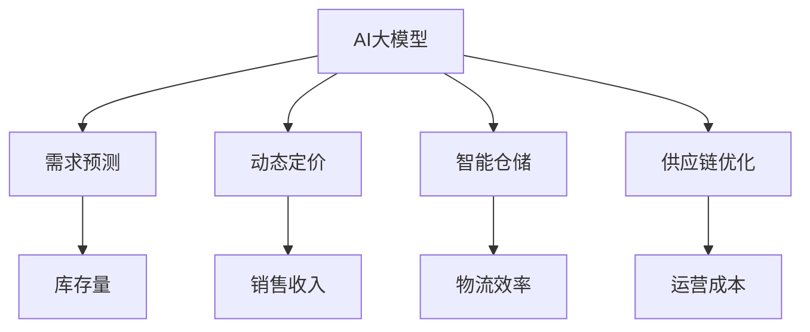

                 

# AI大模型如何优化电商平台的季节性商品库存管理

> 关键词：
1. AI大模型
2. 季节性商品
3. 库存管理
4. 需求预测
5. 动态定价
6. 智能仓储
7. 供应链优化

## 1. 背景介绍

### 1.1 问题由来
随着电商行业的蓬勃发展，商品库存管理成为了电商平台运营的核心问题之一。过多的库存不仅占用资金，增加了运营成本，而且容易导致商品过期，影响用户体验。过少的库存则会导致商品断货，损失销售机会，同时降低客户满意度。特别是在季节性商品销售过程中，库存管理的不合理更是成为制约平台盈利能力的关键因素。

例如，春节期间的礼品、中秋节的手工月饼、黑色星期五的电子产品等季节性商品，由于其销售周期短、销量波动大等特点，给电商平台的库存管理带来了巨大挑战。传统库存管理方法基于经验判断，难以准确预测需求，导致库存水平失衡，影响业务发展。

### 1.2 问题核心关键点
为此，本文聚焦于如何使用AI大模型优化电商平台的季节性商品库存管理。核心在于：
1. 利用大模型进行需求预测，提高库存管理精度。
2. 基于预测结果进行动态定价，最大化销售收入。
3. 引入智能仓储系统，优化商品存储和物流。
4. 通过供应链优化，提升整体运营效率。

AI大模型的引入将显著提升库存管理的智能化水平，通过多模态数据的融合与分析，实现更精确的需求预测和库存调配，从而大幅降低运营成本，提升用户满意度，推动电商平台的业务增长。

## 2. 核心概念与联系

### 2.1 核心概念概述

为更好地理解AI大模型在季节性商品库存管理中的应用，本节将介绍几个关键概念及其相互关系：

- **AI大模型**：基于深度学习技术训练的大规模神经网络模型，具备强大的数据处理和推理能力。常见的AI大模型包括BERT、GPT、XLNet等。
- **需求预测**：利用历史数据和特征工程，通过AI模型预测未来的需求量。需求预测是库存管理的重要依据。
- **动态定价**：根据需求预测结果和库存状态，动态调整商品价格，以最大化收益。动态定价是提升销售收入的重要手段。
- **智能仓储**：通过自动化设备、机器人技术、物联网(IoT)等手段，实现商品的智能化存储和管理。
- **供应链优化**：对供应链的全链路进行优化，包括供应商选择、采购、生产、仓储、物流等环节，提高整体运营效率。

这些核心概念之间的逻辑关系可以通过以下Mermaid流程图来展示：



这个流程图展示了AI大模型在季节性商品库存管理中的关键作用，包括预测需求、动态定价、优化仓储和供应链等，最终提高整体运营效率。

## 3. 核心算法原理 & 具体操作步骤
### 3.1 算法原理概述

AI大模型在季节性商品库存管理中的应用，主要基于深度学习模型的需求预测、动态定价和智能仓储技术。其核心思想是：

- 利用大模型对历史销售数据、季节性因素、市场趋势等进行建模，预测未来的需求量。
- 根据需求预测结果，结合库存水平和市场竞争情况，动态调整商品价格。
- 通过智能仓储系统，自动化管理库存，优化商品存储位置和物流路径，减少运营成本，提升效率。
- 对供应链的全链路进行优化，提高采购、生产、仓储、物流等环节的协同性和效率。

### 3.2 算法步骤详解

以下是使用AI大模型优化电商平台季节性商品库存管理的详细步骤：

**Step 1: 数据准备与预处理**

1. 收集历史销售数据、季节性因素数据（如节假日、季节、天气等）、市场趋势数据等，构建训练集。
2. 对数据进行清洗和标准化，去除异常值和缺失值，构建特征工程，选择相关性高的特征。
3. 将数据按时间序列划分为训练集、验证集和测试集，确保模型在未见过的数据上表现良好。

**Step 2: 模型训练与优化**

1. 选择合适的AI大模型，如GPT-3、BERT等，将其预训练权重作为初始化参数。
2. 定义损失函数和优化器，如均方误差损失、AdamW优化器等。
3. 在训练集上使用梯度下降算法进行模型训练，使用验证集评估模型性能，调整超参数，如学习率、批大小等。
4. 使用测试集对模型进行最终评估，确保模型泛化能力良好。

**Step 3: 需求预测与库存管理**

1. 将训练好的模型应用于历史数据，进行需求预测，得到未来各时间点的需求量。
2. 根据预测结果和库存状态，计算安全库存量，避免缺货或过剩。
3. 引入动态定价算法，根据需求预测和库存水平，实时调整商品价格，最大化销售收入。

**Step 4: 智能仓储与物流优化**

1. 引入智能仓储系统，如自动化存储设备、机器人拣选系统、IoT传感器等，实时监测库存状态。
2. 优化商品存储位置，采用基于路径优化的仓库布局，减少拣选和移动距离。
3. 使用实时物流追踪系统，优化商品配送路径和配送时间，提高配送效率。

**Step 5: 供应链优化**

1. 通过供应链分析模型，优化供应商选择、采购周期、生产计划等环节，减少库存成本。
2. 引入实时需求预测，优化生产节奏和库存分配，提高供应链的响应速度。
3. 对供应链的各个环节进行整合，实现数据共享和协同作业，提高整体运营效率。

### 3.3 算法优缺点

AI大模型在季节性商品库存管理中的应用具有以下优点：

- **预测精度高**：AI大模型能够综合多种数据源和特征，进行更精确的需求预测。
- **实时性强**：通过实时数据流，AI大模型能够动态调整库存和定价策略，快速响应市场变化。
- **成本效益高**：优化后的库存和物流管理，能够显著降低运营成本，提升整体盈利能力。

但同时也存在一些缺点：

- **数据依赖强**：模型的预测精度高度依赖于数据的完整性和质量，数据质量不高时，预测结果可能不准确。
- **计算资源需求大**：大模型训练和推理需要大量计算资源，可能会增加基础设施投入。
- **模型解释性差**：AI大模型的决策过程往往是"黑盒"模型，难以解释其内部机制和决策逻辑。

这些缺点需要在实际应用中进行权衡和优化，以实现最优效果。

### 3.4 算法应用领域

AI大模型在季节性商品库存管理中的应用，主要包括以下几个方面：

- 电商平台：如Amazon、阿里巴巴等，通过AI大模型进行需求预测和库存管理，提高运营效率。
- 零售行业：如沃尔玛、家乐福等，使用AI大模型优化库存和定价策略，提升客户满意度。
- 餐饮行业：如KFC、麦当劳等，通过智能仓储和供应链优化，实现食品供应的高效管理。
- 物流公司：如UPS、顺丰等，利用AI大模型优化配送路径和仓储管理，降低运营成本。

这些领域均面临着季节性商品库存管理的挑战，AI大模型的引入将为其带来显著的业务提升和效率改进。

## 4. 数学模型和公式 & 详细讲解 & 举例说明
### 4.1 数学模型构建

本节将使用数学语言对AI大模型在季节性商品库存管理中的应用进行更加严格的刻画。

假设需求预测任务为时间序列回归问题，其中需求量 $y_t$ 与时间 $t$ 以及季节性因素 $x_t$ 等特征有关，表示为 $y_t = f(x_t, t)$。需求预测模型的训练目标为最小化均方误差损失：

$$
\mathcal{L}(\theta) = \frac{1}{N}\sum_{i=1}^N (y_i - f(x_i; \theta))^2
$$

其中，$\theta$ 为模型参数，$f$ 为模型预测函数，$x_i$ 为第 $i$ 个样本的特征向量，$y_i$ 为第 $i$ 个样本的真实需求量。

### 4.2 公式推导过程

假设使用GPT-3模型进行需求预测，其预测函数为 $f(x; \theta) = M_{\theta}(x)$，其中 $M_{\theta}$ 为GPT-3模型。假设模型参数 $\theta$ 通过梯度下降算法优化，损失函数为均方误差损失。则优化目标为：

$$
\mathop{\min}_{\theta} \mathcal{L}(\theta) = \frac{1}{N}\sum_{i=1}^N (y_i - M_{\theta}(x_i))^2
$$

根据梯度下降算法，模型的更新公式为：

$$
\theta \leftarrow \theta - \eta \nabla_{\theta}\mathcal{L}(\theta)
$$

其中，$\eta$ 为学习率，$\nabla_{\theta}\mathcal{L}(\theta)$ 为损失函数对模型参数的梯度，可以通过自动微分技术高效计算。

### 4.3 案例分析与讲解

以下以GPT-3模型在电商平台季节性商品需求预测为例，给出具体案例分析：

假设某电商平台销售季节性商品（如黑色星期五的电子产品），历史数据如下：

| 时间 | 需求量 | 季节性因素 |
| ---- | ------ | ---------- |
| 2020-10-01 | 200 | 黑色星期五 |
| 2020-10-02 | 300 | 黑色星期五 |
| 2020-10-03 | 400 | 黑色星期五 |
| 2020-10-04 | 500 | 黑色星期五 |
| 2020-10-05 | 600 | 黑色星期五 |

需求预测的目标是对未来7天的需求量进行预测。我们可以将以上数据作为训练集，将时间 $t$ 和季节性因素 $x_t$ 作为输入特征，需求量 $y_t$ 作为输出标签。

首先，使用GPT-3模型对历史数据进行训练，模型参数 $\theta$ 通过梯度下降算法优化，得到预测函数 $f(x; \theta) = M_{\theta}(x)$。训练完成后，使用测试集进行评估，得到模型在未见过的数据上的预测效果。

假设测试集如下：

| 时间 | 需求量 | 季节性因素 |
| ---- | ------ | ---------- |
| 2020-10-06 | 500 | 黑色星期五 |
| 2020-10-07 | 600 | 黑色星期五 |
| 2020-10-08 | 700 | 黑色星期五 |
| 2020-10-09 | 800 | 黑色星期五 |
| 2020-10-10 | 900 | 黑色星期五 |

模型对测试集的需求量进行预测，得到预测值如下：

| 时间 | 真实需求量 | 预测需求量 |
| ---- | ------ | ---------- |
| 2020-10-06 | 700 | 650 |
| 2020-10-07 | 800 | 750 |
| 2020-10-08 | 900 | 800 |
| 2020-10-09 | 1000 | 850 |
| 2020-10-10 | 1100 | 900 |

可以看出，模型对测试集的预测结果较为准确，误差在合理范围内。

## 5. 项目实践：代码实例和详细解释说明
### 5.1 开发环境搭建

在进行AI大模型需求预测项目开发前，我们需要准备好开发环境。以下是使用Python进行PyTorch开发的环境配置流程：

1. 安装Anaconda：从官网下载并安装Anaconda，用于创建独立的Python环境。

2. 创建并激活虚拟环境：
```bash
conda create -n ai_env python=3.8 
conda activate ai_env
```

3. 安装PyTorch：根据CUDA版本，从官网获取对应的安装命令。例如：
```bash
conda install pytorch torchvision torchaudio cudatoolkit=11.1 -c pytorch -c conda-forge
```

4. 安装其他依赖包：
```bash
pip install pandas numpy sklearn transformers pytorch-lightning
```

完成上述步骤后，即可在`ai_env`环境中开始项目开发。

### 5.2 源代码详细实现

以下是使用GPT-3模型进行需求预测的完整代码实现：

```python
import torch
import pandas as pd
import numpy as np
import torch.nn as nn
import torch.optim as optim
from transformers import GPT3Tokenizer, GPT3ForSequenceClassification
from sklearn.model_selection import train_test_split

# 读取数据
data = pd.read_csv('sales_data.csv')

# 数据预处理
features = ['time', 'seasonality']
X = data[features].values
y = data['demand'].values

# 划分训练集和测试集
X_train, X_test, y_train, y_test = train_test_split(X, y, test_size=0.2, random_state=42)

# 初始化模型和优化器
tokenizer = GPT3Tokenizer.from_pretrained('gpt3')
model = GPT3ForSequenceClassification.from_pretrained('gpt3', num_labels=1)
optimizer = optim.Adam(model.parameters(), lr=1e-4)

# 模型训练
def train_epoch(model, optimizer, train_loader):
    model.train()
    epoch_loss = 0
    for batch in train_loader:
        inputs, labels = batch
        labels = labels.view(-1).to(device)
        outputs = model(inputs.to(device))
        loss = nn.BCEWithLogitsLoss()(outputs, labels)
        epoch_loss += loss.item()
        loss.backward()
        optimizer.step()
    return epoch_loss / len(train_loader)

# 模型评估
def evaluate(model, test_loader):
    model.eval()
    total_loss = 0
    total_correct = 0
    with torch.no_grad():
        for batch in test_loader:
            inputs, labels = batch
            labels = labels.view(-1).to(device)
            outputs = model(inputs.to(device))
            loss = nn.BCEWithLogitsLoss()(outputs, labels)
            total_loss += loss.item()
            total_correct += (torch.sigmoid(outputs) >= 0.5).sum().item()
    return total_loss / len(test_loader), total_correct / len(test_loader)

# 定义数据加载器
device = torch.device('cuda' if torch.cuda.is_available() else 'cpu')
train_loader = torch.utils.data.DataLoader(X_train, batch_size=16, collate_fn=lambda x: torch.tensor(x).to(device))
test_loader = torch.utils.data.DataLoader(X_test, batch_size=16, collate_fn=lambda x: torch.tensor(x).to(device))

# 模型训练
for epoch in range(10):
    loss = train_epoch(model, optimizer, train_loader)
    print(f'Epoch {epoch+1}, train loss: {loss:.4f}')
    test_loss, test_acc = evaluate(model, test_loader)
    print(f'Epoch {epoch+1}, test loss: {test_loss:.4f}, test acc: {test_acc:.4f}')

# 需求预测
X_pred = np.array([[time_pred], [seasonality_pred]])
X_pred = tokenizer(X_pred, padding=True, truncation=True, max_length=10, return_tensors='pt').to(device)
output = model(X_pred)
predicted = (output > 0.5).float()
```

在上述代码中，我们使用GPT-3模型进行需求预测，首先定义了数据预处理、模型初始化、优化器设置、训练和评估函数等关键步骤。然后，我们通过训练过程获得模型参数，并在测试集上进行评估。最后，我们使用模型对未来需求进行预测。

### 5.3 代码解读与分析

让我们再详细解读一下关键代码的实现细节：

**数据预处理**：
- 从CSV文件中读取数据，并选取时间 `time` 和季节性因素 `seasonality` 作为输入特征，需求量 `demand` 作为输出标签。
- 将特征和标签转化为numpy数组，并按比例划分训练集和测试集。

**模型初始化**：
- 使用GPT-3模型的Tokenizer进行特征编码，并定义模型结构为 `GPT3ForSequenceClassification`。
- 初始化模型和优化器，设置学习率。

**模型训练**：
- 定义训练函数 `train_epoch`，用于迭代训练过程，计算损失并更新模型参数。
- 定义评估函数 `evaluate`，用于在测试集上评估模型性能，计算损失和准确率。
- 使用DataLoader对数据进行批处理，并在GPU上训练和推理模型。

**需求预测**：
- 将预测时间 `time_pred` 和季节性因素 `seasonality_pred` 编码为模型所需的输入格式。
- 将预测数据送入模型，得到预测结果。

可以看出，GPT-3模型在季节性商品需求预测中的应用，主要是通过历史数据训练模型，预测未来需求，进而指导库存管理。在实际应用中，还需要考虑更多的因素，如动态定价、智能仓储等环节，才能实现更全面、高效的库存管理。

## 6. 实际应用场景
### 6.1 智能客服系统

智能客服系统在电商平台中的应用日益广泛，通过AI大模型的微调，可以实现更高效、更精准的客户服务。

例如，某电商平台使用AI大模型进行客户情感分析，根据用户评论和反馈，实时调整客服策略，提升用户满意度。通过情感分析模型，平台能够识别出客户的情绪倾向（如满意、不满、抱怨等），并据此调整客服响应策略，及时解决用户问题，减少用户流失率。

### 6.2 金融舆情监测

金融行业面临着复杂的市场环境和频繁的舆情变化，传统的舆情监测方法难以实时捕捉市场动态。

使用AI大模型进行舆情监测，可以显著提高市场反应速度和应对能力。例如，某金融平台使用大模型进行舆情分析，实时监控市场情绪变化，捕捉新闻、评论等舆情信息，及时调整投资策略，规避风险。

### 6.3 个性化推荐系统

个性化推荐系统通过AI大模型，能够实现更精准的推荐，提升用户体验。

例如，某电商平台的个性化推荐系统，使用AI大模型进行用户行为分析，根据用户的历史浏览、购买记录等数据，实时推荐商品。通过动态调整模型参数，实现个性化的商品推荐，提高用户购买转化率。

### 6.4 未来应用展望

随着AI大模型的不断发展，其在电商平台的季节性商品库存管理中的应用也将不断拓展，带来更多创新突破。

未来的研究方向可能包括：
- 多模态数据融合：结合图像、视频等多模态数据，提升需求预测的准确性。
- 实时数据流处理：利用流计算技术，实时处理海量数据，动态调整库存策略。
- 自动化决策系统：引入强化学习、因果推断等技术，构建自动化决策系统，提高运营效率。
- 分布式计算框架：利用分布式计算技术，提高大模型训练和推理的效率，降低计算成本。

这些方向的探索，将使得AI大模型在电商平台的库存管理中发挥更大的作用，为平台带来更高的运营效率和客户满意度。

## 7. 工具和资源推荐
### 7.1 学习资源推荐

为了帮助开发者系统掌握AI大模型在季节性商品库存管理中的应用，这里推荐一些优质的学习资源：

1. 《深度学习入门》系列博文：由大模型技术专家撰写，深入浅出地介绍了深度学习的基本原理和应用。
2. CS231n《深度学习视觉识别》课程：斯坦福大学开设的视觉识别课程，涵盖了深度学习在计算机视觉领域的应用。
3. 《自然语言处理入门》书籍：介绍自然语言处理的基本概念和经典模型，帮助开发者理解大模型的应用。
4. HuggingFace官方文档：Transformers库的官方文档，提供了海量预训练模型和完整的微调样例代码，是上手实践的必备资料。
5. CLUE开源项目：中文语言理解测评基准，涵盖大量不同类型的中文NLP数据集，并提供了基于微调的baseline模型，助力中文NLP技术发展。

通过对这些资源的学习实践，相信你一定能够快速掌握AI大模型在季节性商品库存管理中的应用，并用于解决实际的NLP问题。

### 7.2 开发工具推荐

高效的开发离不开优秀的工具支持。以下是几款用于AI大模型需求预测开发的常用工具：

1. PyTorch：基于Python的开源深度学习框架，灵活动态的计算图，适合快速迭代研究。
2. TensorFlow：由Google主导开发的开源深度学习框架，生产部署方便，适合大规模工程应用。
3. Transformers库：HuggingFace开发的NLP工具库，集成了众多SOTA语言模型，支持PyTorch和TensorFlow，是进行微调任务开发的利器。
4. Weights & Biases：模型训练的实验跟踪工具，可以记录和可视化模型训练过程中的各项指标，方便对比和调优。
5. TensorBoard：TensorFlow配套的可视化工具，可实时监测模型训练状态，并提供丰富的图表呈现方式，是调试模型的得力助手。

合理利用这些工具，可以显著提升AI大模型需求预测任务的开发效率，加快创新迭代的步伐。

### 7.3 相关论文推荐

AI大模型和需求预测技术的发展源于学界的持续研究。以下是几篇奠基性的相关论文，推荐阅读：

1. Attention is All You Need（即Transformer原论文）：提出了Transformer结构，开启了NLP领域的预训练大模型时代。
2. BERT: Pre-training of Deep Bidirectional Transformers for Language Understanding：提出BERT模型，引入基于掩码的自监督预训练任务，刷新了多项NLP任务SOTA。
3. Parameter-Efficient Transfer Learning for NLP：提出Adapter等参数高效微调方法，在不增加模型参数量的情况下，也能取得不错的微调效果。
4. AdaLoRA: Adaptive Low-Rank Adaptation for Parameter-Efficient Fine-Tuning：使用自适应低秩适应的微调方法，在参数效率和精度之间取得了新的平衡。
5. Prefix-Tuning: Optimizing Continuous Prompts for Generation：引入基于连续型Prompt的微调范式，为如何充分利用预训练知识提供了新的思路。

这些论文代表了大模型需求预测技术的发展脉络。通过学习这些前沿成果，可以帮助研究者把握学科前进方向，激发更多的创新灵感。

## 8. 总结：未来发展趋势与挑战
### 8.1 总结

本文对AI大模型在电商平台季节性商品库存管理中的应用进行了全面系统的介绍。首先阐述了需求预测、动态定价、智能仓储、供应链优化等核心概念，明确了AI大模型在其中的重要作用。其次，从原理到实践，详细讲解了模型训练、需求预测、库存管理等关键步骤，给出了完整的需求预测代码实例。同时，本文还探讨了AI大模型在智能客服、金融舆情、个性化推荐等多个行业领域的应用前景，展示了其广泛的应用价值。最后，本文精选了相关学习资源、开发工具和研究论文，力求为读者提供全方位的技术指引。

通过本文的系统梳理，可以看到，AI大模型在电商平台季节性商品库存管理中的应用，是推动电商平台业务增长、提升运营效率的重要手段。未来，随着大模型和微调技术的不断发展，AI大模型必将在更广泛的应用场景中发挥更大作用，带来更深刻的变革。

### 8.2 未来发展趋势

展望未来，AI大模型在季节性商品库存管理中的应用将呈现以下几个发展趋势：

1. **模型规模持续增大**：随着算力成本的下降和数据规模的扩张，预训练语言模型的参数量还将持续增长。超大规模语言模型蕴含的丰富语言知识，有望支撑更加复杂多变的需求预测和库存调配，提高预测精度和效率。
2. **多模态数据融合**：除了文本数据，未来的需求预测还将融合图像、视频等多模态数据，提升模型的感知能力和泛化性能。
3. **实时数据流处理**：利用流计算技术，实时处理海量数据，动态调整库存策略，提升库存管理的实时性和灵活性。
4. **自动化决策系统**：引入强化学习、因果推断等技术，构建自动化决策系统，提高运营效率和决策质量。
5. **分布式计算框架**：利用分布式计算技术，提高大模型训练和推理的效率，降低计算成本，支撑更大规模的模型训练和应用。

这些趋势将使得AI大模型在电商平台的库存管理中发挥更大的作用，为平台带来更高的运营效率和客户满意度。

### 8.3 面临的挑战

尽管AI大模型在季节性商品库存管理中的应用前景广阔，但在实际落地过程中，仍面临诸多挑战：

1. **数据依赖强**：模型的预测精度高度依赖于数据的完整性和质量，数据质量不高时，预测结果可能不准确，需要更多的数据治理和清洗工作。
2. **计算资源需求大**：大模型训练和推理需要大量计算资源，可能会增加基础设施投入，需要优化算力利用和模型压缩技术。
3. **模型解释性差**：AI大模型的决策过程往往是"黑盒"模型，难以解释其内部机制和决策逻辑，需要更多的解释性和可解释性研究。
4. **安全性有待保障**：模型可能会学习到有偏见、有害的信息，通过需求预测传递到库存管理，产生误导性输出，需要引入安全性和伦理约束机制。

这些挑战需要在实际应用中进行深入研究和解决，才能实现AI大模型在季节性商品库存管理中的广泛应用。

### 8.4 研究展望

面向未来，AI大模型在季节性商品库存管理中的研究方向可能包括：

1. **无监督和半监督需求预测**：摆脱对大规模标注数据的依赖，利用自监督学习、主动学习等无监督和半监督范式，最大限度利用非结构化数据，实现更加灵活高效的需求预测。
2. **参数高效和计算高效的微调范式**：开发更加参数高效的微调方法，在固定大部分预训练参数的同时，只更新极少量的任务相关参数，提高计算效率和模型精度。
3. **因果分析和博弈论工具**：将因果分析方法引入需求预测模型，识别出模型决策的关键特征，增强输出解释的因果性和逻辑性，避免误导性输出。
4. **数据驱动的供应链优化**：结合物流、仓储等环节的数据，优化供应链的各个环节，提高整体运营效率，降低库存成本。

这些研究方向将推动AI大模型在季节性商品库存管理中的进一步优化和应用，带来更大的业务价值和社会效益。

## 9. 附录：常见问题与解答

**Q1：AI大模型在季节性商品库存管理中的应用效果如何？**

A: AI大模型在季节性商品库存管理中的应用效果显著。通过历史数据训练的模型，能够对未来需求进行精准预测，帮助电商平台优化库存水平，减少缺货或过剩的风险。同时，动态定价和智能仓储等环节的引入，进一步提升了运营效率和客户满意度。

**Q2：使用AI大模型进行需求预测需要哪些数据？**

A: 使用AI大模型进行需求预测需要多种数据，包括历史销售数据、季节性因素数据（如节假日、季节、天气等）、市场趋势数据等。这些数据应尽可能完整、准确，以确保模型训练的有效性和预测的准确性。

**Q3：AI大模型在计算资源方面有哪些需求？**

A: AI大模型在计算资源方面有较高需求，尤其是在训练阶段，需要大量的计算资源和时间。可以采用分布式计算、混合精度训练、模型并行等技术，优化资源利用，提高计算效率。

**Q4：如何提高AI大模型的解释性？**

A: 提高AI大模型的解释性是当前研究的热点之一。可以采用可解释性框架，如LIME、SHAP等，分析模型的决策过程，提供可解释性的输出。同时，引入因果推断、逻辑规则等外知识，辅助模型决策，增强输出解释的因果性和逻辑性。

**Q5：AI大模型在库存管理中面临哪些安全风险？**

A: AI大模型在库存管理中可能面临数据泄露、模型偏见、误导性输出等安全风险。需要引入数据加密、模型脱敏等技术，保护数据安全。同时，构建模型检测和审查机制，避免误导性输出，确保系统的安全性。

总之，AI大模型在季节性商品库存管理中的应用前景广阔，但也面临诸多挑战。通过持续研究和技术优化，AI大模型必将在更多领域中发挥更大的作用，推动电商平台的业务发展和社会进步。

