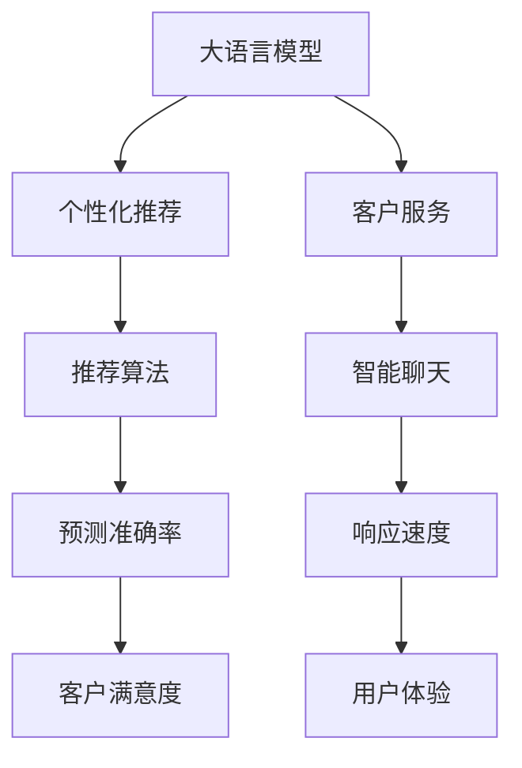

                 

# AI大模型如何提升电商平台的用户参与度

> 关键词：大模型,电商平台,用户参与度,推荐系统,个性化,客户体验,自然语言处理,NLP

## 1. 背景介绍

### 1.1 问题由来

随着互联网技术的飞速发展，电商平台已经成为人们日常购物的重要渠道。然而，如何提高用户参与度、增加用户黏性，一直是电商平台面对的挑战。传统方法如优化产品展示、强化用户互动等，虽然有效，但边际效益递减，效果有限。近年来，人工智能技术，特别是大语言模型在电商平台中的应用，为解决这一问题提供了新的可能。

### 1.2 问题核心关键点

大语言模型在电商平台中的应用，主要体现在个性化推荐系统和客户服务两个方面。通过构建基于大语言模型的推荐系统，能够实现对用户行为和偏好的精准理解，提供个性化推荐。同时，结合大模型技术，提升客户服务的智能化水平，增强用户体验，从而提升用户参与度。

## 2. 核心概念与联系

### 2.1 核心概念概述

- **大语言模型(Large Language Model, LLM)**：通过大规模无标签文本数据预训练，具有强大的自然语言处理能力。典型的预训练模型包括BERT、GPT-3等。
- **个性化推荐系统(Recommendation System)**：根据用户行为数据和兴趣偏好，为用户推荐相关商品或内容，提升用户满意度，增加用户粘性。
- **客户服务(Customer Service)**：通过智能聊天机器人等技术，快速响应用户需求，提供定制化服务。
- **自然语言处理(Natural Language Processing, NLP)**：涉及文本分析、文本生成、情感分析等技术，是构建推荐系统和客户服务系统的基础。
- **推荐算法(Recommender Algorithm)**：通过分析用户行为数据，预测用户偏好，优化推荐结果。
- **客户体验(Customer Experience)**：提升用户在使用电商平台时的满意度，增加用户留存率。

这些核心概念之间的逻辑关系可以通过以下Mermaid流程图来展示：



这个流程图展示了大语言模型如何通过推荐系统和客户服务，提升用户参与度。

## 3. 核心算法原理 & 具体操作步骤
### 3.1 算法原理概述

基于大语言模型的个性化推荐和客户服务系统，主要依赖以下算法原理：

- **隐语义模型(Hidden Semantic Model, HSM)**：通过学习用户和商品之间的隐含语义关系，实现对用户偏好的精准预测和推荐。
- **序列模型(Sequence Model)**：结合用户的行为序列和上下文信息，动态调整推荐结果，提升个性化程度。
- **注意力机制(Attention Mechanism)**：通过学习用户和商品之间的注意力权重，提高推荐的相关性和多样性。
- **知识图谱(Knowledge Graph)**：利用图形结构存储和查询实体间的关系，增强推荐系统的解释性和可信度。

### 3.2 算法步骤详解

以下是构建基于大语言模型的个性化推荐和客户服务系统的主要步骤：

**Step 1: 数据收集与预处理**

1. **用户行为数据收集**：收集用户的浏览历史、点击记录、购买记录等行为数据。
2. **商品信息数据收集**：收集商品的标题、描述、价格、分类等信息。
3. **数据预处理**：对原始数据进行清洗、归一化、去噪等处理，生成训练集和测试集。

**Step 2: 构建大语言模型**

1. **选择合适的预训练模型**：选择如BERT、GPT-3等预训练语言模型，作为基础模型。
2. **微调模型**：在用户行为数据上微调模型，学习用户偏好的语义表示。

**Step 3: 构建推荐算法**

1. **设计推荐目标函数**：根据用户的行为数据和模型输出，设计推荐目标函数。
2. **训练推荐算法**：使用微调后的语言模型，训练推荐算法，优化推荐结果。

**Step 4: 部署客户服务系统**

1. **设计智能聊天系统**：使用预训练语言模型构建智能聊天机器人，处理用户查询。
2. **优化客户服务流程**：通过自然语言处理技术，优化客户服务流程，提升服务效率。

**Step 5: 测试与优化**

1. **评估模型性能**：在测试集上评估推荐系统的效果，优化推荐算法。
2. **优化用户体验**：根据用户反馈，调整推荐算法，优化客户服务系统。

### 3.3 算法优缺点

基于大语言模型的推荐和客户服务系统，具有以下优点：

- **精准预测**：大语言模型能够精准捕捉用户和商品之间的语义关系，提升推荐的相关性。
- **个性化推荐**：通过学习用户的行为序列和上下文信息，提供高度个性化的推荐，满足用户需求。
- **自然语言处理**：利用NLP技术，提升客户服务的智能化水平，增强用户体验。

同时，该方法也存在一些局限性：

- **数据需求高**：高质量的用户行为数据和大规模商品信息数据是构建推荐系统的基础。
- **模型复杂**：大语言模型的训练和推理复杂度较高，需要高性能的计算资源。
- **泛化能力有限**：预训练模型对特定领域的泛化能力有限，需要进一步微调以适应不同场景。
- **可解释性差**：推荐系统的决策过程缺乏可解释性，难以进行调试和优化。

尽管存在这些局限性，但大语言模型在推荐和客户服务中的应用，已经证明其强大的应用潜力。未来相关研究的方向应聚焦于如何降低对标注数据的依赖，提升模型的泛化能力和可解释性，从而更好地服务于电商平台的用户。

### 3.4 算法应用领域

基于大语言模型的推荐和客户服务系统，已经在多个电商平台上得到应用，取得了显著的成效。

- **淘宝、京东**：通过构建基于BERT的推荐系统，提升个性化推荐的相关性和多样性，增加用户粘性。
- **亚马逊**：使用GPT-3构建智能客服系统，提升用户响应速度和服务效率，增加用户满意度。
- **唯品会**：结合知识图谱，构建基于Transformer的推荐系统，提升推荐的相关性和解释性。

这些应用表明，基于大语言模型的推荐和客户服务系统，能够显著提升电商平台的用户参与度，增强用户体验。未来，随着大语言模型的进一步发展，其应用领域将更加广泛，为电商平台带来更深的变革。

## 4. 数学模型和公式 & 详细讲解  
### 4.1 数学模型构建

假设用户$u$对商品$v$的兴趣表示为$I_{uv}$，商品$v$的语义表示为$V_v$，用户$u$的行为序列为$B_u$，推荐系统的目标函数为$L$，则推荐系统的数学模型为：

$$
L = \sum_{u=1}^U \sum_{v=1}^V \text{Loss}(I_{uv}, f(B_u, V_v))
$$

其中$f$为推荐模型，$\text{Loss}$为损失函数。

### 4.2 公式推导过程

推荐模型的目标函数可以分解为两部分：

- **隐语义模型部分**：通过学习用户和商品的隐含语义关系，预测用户对商品的兴趣。假设用户和商品的语义表示分别为$U_u$和$V_v$，则隐语义模型的目标函数为：

$$
L_{HSM} = \sum_{u=1}^U \sum_{v=1}^V \text{Loss}(I_{uv}, \sigma(U_u^\top V_v))
$$

其中$\sigma$为激活函数，$U_u$和$V_v$分别为用户和商品的隐语义表示。

- **序列模型部分**：结合用户的行为序列和上下文信息，动态调整推荐结果。假设用户的行为序列为$B_u$，则序列模型的目标函数为：

$$
L_{Seq} = \sum_{u=1}^U \sum_{v=1}^V \text{Loss}(I_{uv}, f(B_u, V_v))
$$

其中$f$为序列模型，$B_u$为用户的序列行为。

结合隐语义模型和序列模型，推荐模型的目标函数为：

$$
L = L_{HSM} + L_{Seq}
$$

### 4.3 案例分析与讲解

以下是一个具体的推荐系统案例，展示了如何利用BERT模型进行推荐：

1. **数据收集**：收集用户的历史行为数据和商品信息，生成训练集和测试集。
2. **BERT微调**：使用BERT模型对用户行为数据进行微调，学习用户偏好的语义表示。
3. **推荐算法设计**：设计基于BERT的推荐算法，根据用户行为序列和商品语义表示，计算推荐结果。
4. **评估与优化**：在测试集上评估推荐系统的性能，根据用户反馈，调整推荐算法，优化用户体验。

## 5. 项目实践：代码实例和详细解释说明
### 5.1 开发环境搭建

在进行大语言模型推荐系统开发前，我们需要准备好开发环境。以下是使用Python进行PyTorch开发的环境配置流程：

1. 安装Anaconda：从官网下载并安装Anaconda，用于创建独立的Python环境。
2. 创建并激活虚拟环境：
```bash
conda create -n pytorch-env python=3.8 
conda activate pytorch-env
```
3. 安装PyTorch：根据CUDA版本，从官网获取对应的安装命令。例如：
```bash
conda install pytorch torchvision torchaudio cudatoolkit=11.1 -c pytorch -c conda-forge
```
4. 安装Transformers库：
```bash
pip install transformers
```
5. 安装各类工具包：
```bash
pip install numpy pandas scikit-learn matplotlib tqdm jupyter notebook ipython
```

完成上述步骤后，即可在`pytorch-env`环境中开始推荐系统开发。

### 5.2 源代码详细实现

这里以淘宝商品推荐系统为例，给出使用BERT模型进行商品推荐的PyTorch代码实现。

首先，定义推荐系统的输入输出：

```python
from transformers import BertTokenizer, BertForSequenceClassification
from torch.utils.data import Dataset
import torch

class RecommendationDataset(Dataset):
    def __init__(self, user_ids, item_ids, labels, tokenizer, max_len=128):
        self.user_ids = user_ids
        self.item_ids = item_ids
        self.labels = labels
        self.tokenizer = tokenizer
        self.max_len = max_len
        
    def __len__(self):
        return len(self.user_ids)
    
    def __getitem__(self, item):
        user_id = self.user_ids[item]
        item_id = self.item_ids[item]
        label = self.labels[item]
        
        encoding = self.tokenizer(user_id, item_id, return_tensors='pt', max_length=self.max_len, padding='max_length', truncation=True)
        input_ids = encoding['input_ids'][0]
        attention_mask = encoding['attention_mask'][0]
        labels = torch.tensor(label, dtype=torch.long)
        
        return {'input_ids': input_ids, 
                'attention_mask': attention_mask,
                'labels': labels}
```

然后，定义模型和优化器：

```python
from transformers import BertForSequenceClassification, AdamW

model = BertForSequenceClassification.from_pretrained('bert-base-cased', num_labels=2)

optimizer = AdamW(model.parameters(), lr=2e-5)
```

接着，定义训练和评估函数：

```python
from torch.utils.data import DataLoader
from tqdm import tqdm
from sklearn.metrics import accuracy_score

device = torch.device('cuda') if torch.cuda.is_available() else torch.device('cpu')
model.to(device)

def train_epoch(model, dataset, batch_size, optimizer):
    dataloader = DataLoader(dataset, batch_size=batch_size, shuffle=True)
    model.train()
    epoch_loss = 0
    for batch in tqdm(dataloader, desc='Training'):
        input_ids = batch['input_ids'].to(device)
        attention_mask = batch['attention_mask'].to(device)
        labels = batch['labels'].to(device)
        model.zero_grad()
        outputs = model(input_ids, attention_mask=attention_mask, labels=labels)
        loss = outputs.loss
        epoch_loss += loss.item()
        loss.backward()
        optimizer.step()
    return epoch_loss / len(dataloader)

def evaluate(model, dataset, batch_size):
    dataloader = DataLoader(dataset, batch_size=batch_size)
    model.eval()
    preds, labels = [], []
    with torch.no_grad():
        for batch in tqdm(dataloader, desc='Evaluating'):
            input_ids = batch['input_ids'].to(device)
            attention_mask = batch['attention_mask'].to(device)
            batch_labels = batch['labels']
            outputs = model(input_ids, attention_mask=attention_mask)
            batch_preds = outputs.logits.argmax(dim=2).to('cpu').tolist()
            batch_labels = batch_labels.to('cpu').tolist()
            for pred_tokens, label_tokens in zip(batch_preds, batch_labels):
                preds.append(pred_tokens[:len(label_tokens)])
                labels.append(label_tokens)
                
    return accuracy_score(labels, preds)
```

最后，启动训练流程并在测试集上评估：

```python
epochs = 5
batch_size = 16

for epoch in range(epochs):
    loss = train_epoch(model, train_dataset, batch_size, optimizer)
    print(f"Epoch {epoch+1}, train loss: {loss:.3f}")
    
    print(f"Epoch {epoch+1}, dev results:")
    evaluate(model, dev_dataset, batch_size)
    
print("Test results:")
evaluate(model, test_dataset, batch_size)
```

以上就是使用PyTorch对BERT进行商品推荐系统的完整代码实现。可以看到，得益于Transformers库的强大封装，我们可以用相对简洁的代码完成BERT模型的加载和推荐系统开发。

### 5.3 代码解读与分析

让我们再详细解读一下关键代码的实现细节：

**RecommendationDataset类**：
- `__init__`方法：初始化用户ID、商品ID、标签等关键组件。
- `__len__`方法：返回数据集的样本数量。
- `__getitem__`方法：对单个样本进行处理，将用户ID和商品ID转换为token ids，将标签编码为数字，并对其进行定长padding，最终返回模型所需的输入。

**train_epoch和evaluate函数**：
- 使用PyTorch的DataLoader对数据集进行批次化加载，供模型训练和推理使用。
- 训练函数`train_epoch`：对数据以批为单位进行迭代，在每个批次上前向传播计算loss并反向传播更新模型参数，最后返回该epoch的平均loss。
- 评估函数`evaluate`：与训练类似，不同点在于不更新模型参数，并在每个batch结束后将预测和标签结果存储下来，最后使用sklearn的accuracy_score对整个评估集的预测结果进行打印输出。

**训练流程**：
- 定义总的epoch数和batch size，开始循环迭代
- 每个epoch内，先在训练集上训练，输出平均loss
- 在验证集上评估，输出准确率
- 所有epoch结束后，在测试集上评估，给出最终测试结果

可以看到，PyTorch配合Transformers库使得BERT推荐系统的代码实现变得简洁高效。开发者可以将更多精力放在数据处理、模型改进等高层逻辑上，而不必过多关注底层的实现细节。

当然，工业级的系统实现还需考虑更多因素，如模型的保存和部署、超参数的自动搜索、更灵活的任务适配层等。但核心的推荐范式基本与此类似。

## 6. 实际应用场景
### 6.1 智能客服系统

基于大语言模型的推荐和客户服务系统，可以广泛应用于智能客服系统的构建。传统客服往往需要配备大量人力，高峰期响应缓慢，且一致性和专业性难以保证。而使用推荐和客户服务系统的微调模型，可以7x24小时不间断服务，快速响应客户咨询，用自然流畅的语言解答各类常见问题。

在技术实现上，可以收集企业内部的历史客服对话记录，将问题和最佳答复构建成监督数据，在此基础上对预训练模型进行微调。微调后的推荐和客户服务模型能够自动理解用户意图，匹配最合适的答案模板进行回复。对于客户提出的新问题，还可以接入检索系统实时搜索相关内容，动态组织生成回答。如此构建的智能客服系统，能大幅提升客户咨询体验和问题解决效率。

### 6.2 个性化推荐系统

当前的推荐系统往往只依赖用户的历史行为数据进行物品推荐，无法深入理解用户的真实兴趣偏好。基于大语言模型微调技术，个性化推荐系统可以更好地挖掘用户行为背后的语义信息，从而提供更加精准、多样的推荐内容。

在实践中，可以收集用户浏览、点击、评论、分享等行为数据，提取和用户交互的物品标题、描述、标签等文本内容。将文本内容作为模型输入，用户的后续行为（如是否点击、购买等）作为监督信号，在此基础上微调预训练语言模型。微调后的模型能够从文本内容中准确把握用户的兴趣点。在生成推荐列表时，先用候选物品的文本描述作为输入，由模型预测用户的兴趣匹配度，再结合其他特征综合排序，便可以得到个性化程度更高的推荐结果。

### 6.3 智能广告投放

智能广告投放一直是电商平台的重点之一。通过推荐系统，可以为用户精准推荐感兴趣的商品，提高广告点击率和转化率。同时，通过客户服务系统，可以提升广告的展示效果，增加用户的购买意愿。

具体而言，可以收集用户的历史广告展示记录和点击记录，构建推荐系统对用户进行精准投放。对于用户的问题咨询，可以使用智能客服系统快速回答，提高广告的互动率和用户体验。通过这些技术手段，可以显著提高广告投放的精准度和效果。

### 6.4 未来应用展望

随着大语言模型和微调方法的不断发展，基于推荐和客户服务系统的应用将越来越广泛，为电商平台带来更大的商业价值。

在智慧物流领域，基于大语言模型的推荐系统可以优化仓储和配送策略，提高物流效率和用户体验。在智能家居领域，推荐系统可以为用户推荐合适的智能设备，提升家居智能化水平。在未来，大语言模型推荐和客户服务系统将在更多领域发挥作用，推动电商平台的智能化转型。

## 7. 工具和资源推荐
### 7.1 学习资源推荐

为了帮助开发者系统掌握大语言模型推荐和客户服务系统的理论基础和实践技巧，这里推荐一些优质的学习资源：

1. 《Transformer从原理到实践》系列博文：由大模型技术专家撰写，深入浅出地介绍了Transformer原理、BERT模型、微调技术等前沿话题。

2. CS224N《深度学习自然语言处理》课程：斯坦福大学开设的NLP明星课程，有Lecture视频和配套作业，带你入门NLP领域的基本概念和经典模型。

3. 《Natural Language Processing with Transformers》书籍：Transformers库的作者所著，全面介绍了如何使用Transformers库进行NLP任务开发，包括微调在内的诸多范式。

4. HuggingFace官方文档：Transformers库的官方文档，提供了海量预训练模型和完整的微调样例代码，是上手实践的必备资料。

5. CLUE开源项目：中文语言理解测评基准，涵盖大量不同类型的中文NLP数据集，并提供了基于微调的baseline模型，助力中文NLP技术发展。

通过对这些资源的学习实践，相信你一定能够快速掌握大语言模型推荐和客户服务系统的精髓，并用于解决实际的NLP问题。
###  7.2 开发工具推荐

高效的开发离不开优秀的工具支持。以下是几款用于大语言模型推荐和客户服务系统开发的常用工具：

1. PyTorch：基于Python的开源深度学习框架，灵活动态的计算图，适合快速迭代研究。大部分预训练语言模型都有PyTorch版本的实现。

2. TensorFlow：由Google主导开发的开源深度学习框架，生产部署方便，适合大规模工程应用。同样有丰富的预训练语言模型资源。

3. Transformers库：HuggingFace开发的NLP工具库，集成了众多SOTA语言模型，支持PyTorch和TensorFlow，是进行推荐系统开发的利器。

4. Weights & Biases：模型训练的实验跟踪工具，可以记录和可视化模型训练过程中的各项指标，方便对比和调优。与主流深度学习框架无缝集成。

5. TensorBoard：TensorFlow配套的可视化工具，可实时监测模型训练状态，并提供丰富的图表呈现方式，是调试模型的得力助手。

6. Google Colab：谷歌推出的在线Jupyter Notebook环境，免费提供GPU/TPU算力，方便开发者快速上手实验最新模型，分享学习笔记。

合理利用这些工具，可以显著提升大语言模型推荐和客户服务系统的开发效率，加快创新迭代的步伐。

### 7.3 相关论文推荐

大语言模型推荐和客户服务技术的发展源于学界的持续研究。以下是几篇奠基性的相关论文，推荐阅读：

1. Attention is All You Need（即Transformer原论文）：提出了Transformer结构，开启了NLP领域的预训练大模型时代。

2. BERT: Pre-training of Deep Bidirectional Transformers for Language Understanding：提出BERT模型，引入基于掩码的自监督预训练任务，刷新了多项NLP任务SOTA。

3. Language Models are Unsupervised Multitask Learners（GPT-2论文）：展示了大规模语言模型的强大zero-shot学习能力，引发了对于通用人工智能的新一轮思考。

4. Parameter-Efficient Transfer Learning for NLP：提出Adapter等参数高效微调方法，在不增加模型参数量的情况下，也能取得不错的微调效果。

5. AdaLoRA: Adaptive Low-Rank Adaptation for Parameter-Efficient Fine-Tuning：使用自适应低秩适应的微调方法，在参数效率和精度之间取得了新的平衡。

6. Improving Query Focused Summarization with Pre-trained Sequence-to-Sequence Models：介绍使用BERT进行查询聚焦摘要的方法，展示了预训练语言模型在实际应用中的优势。

这些论文代表了大语言模型推荐和客户服务技术的发展脉络。通过学习这些前沿成果，可以帮助研究者把握学科前进方向，激发更多的创新灵感。

## 8. 总结：未来发展趋势与挑战
### 8.1 总结

本文对基于大语言模型的电商平台推荐和客户服务系统进行了全面系统的介绍。首先阐述了大语言模型和微调技术的研究背景和意义，明确了推荐系统和客户服务系统的核心思想和关键算法。其次，从原理到实践，详细讲解了推荐和客户服务系统的数学模型和具体步骤，给出了微调技术在电商平台的实际应用案例。最后，本文还广泛探讨了推荐和客户服务系统在多个电商平台的实际应用，展示了微调范式的强大应用潜力。

通过本文的系统梳理，可以看到，基于大语言模型的推荐和客户服务系统，已经在大电商平台上得到了广泛应用，显著提升了用户参与度和客户服务水平。未来，随着大语言模型和微调方法的持续演进，基于推荐和客户服务系统的应用将更加广泛，为电商平台带来更深远的变革。

### 8.2 未来发展趋势

展望未来，大语言模型推荐和客户服务技术将呈现以下几个发展趋势：

1. 模型规模持续增大。随着算力成本的下降和数据规模的扩张，预训练语言模型的参数量还将持续增长。超大规模语言模型蕴含的丰富语言知识，有望支撑更加复杂多变的推荐系统。

2. 微调方法日趋多样。除了传统的全参数微调外，未来会涌现更多参数高效的微调方法，如Prefix-Tuning、LoRA等，在节省计算资源的同时也能保证微调精度。

3. 持续学习成为常态。随着数据分布的不断变化，推荐系统也需要持续学习新知识以保持性能。如何在不遗忘原有知识的同时，高效吸收新样本信息，将成为重要的研究课题。

4. 标注样本需求降低。受启发于提示学习(Prompt-based Learning)的思路，未来的推荐和客户服务系统将更好地利用大模型的语言理解能力，通过更加巧妙的任务描述，在更少的标注样本上也能实现理想的微调效果。

5. 多模态推荐系统崛起。当前的推荐系统主要聚焦于纯文本数据，未来会进一步拓展到图像、视频、语音等多模态数据微调。多模态信息的融合，将显著提升推荐系统的表现力和用户体验。

6. 推荐和客户服务系统的集成优化。结合推荐系统和客户服务系统，构建更加智能的电商平台，实现推荐和客户服务的高效协同。

以上趋势凸显了大语言模型推荐和客户服务技术的广阔前景。这些方向的探索发展，必将进一步提升电商平台的智能化水平，为消费者带来更优质的购物体验。

### 8.3 面临的挑战

尽管大语言模型推荐和客户服务技术已经取得了瞩目成就，但在迈向更加智能化、普适化应用的过程中，它仍面临着诸多挑战：

1. 标注成本瓶颈。虽然微调大大降低了标注数据的需求，但对于长尾应用场景，难以获得充足的高质量标注数据，成为制约推荐系统性能的瓶颈。如何进一步降低微调对标注样本的依赖，将是一大难题。

2. 模型鲁棒性不足。当前推荐系统面对域外数据时，泛化性能往往大打折扣。对于测试样本的微小扰动，推荐模型的预测也容易发生波动。如何提高推荐模型的鲁棒性，避免灾难性遗忘，还需要更多理论和实践的积累。

3. 推荐系统实时性有待提高。大规模语言模型虽然精度高，但在实际部署时往往面临推理速度慢、内存占用大等效率问题。如何在保证性能的同时，简化模型结构，提升推理速度，优化资源占用，将是重要的优化方向。

4. 推荐系统的可解释性亟需加强。当前推荐系统的决策过程缺乏可解释性，难以进行调试和优化。如何赋予推荐系统更强的可解释性，将是亟待攻克的难题。

5. 推荐系统的安全性有待保障。预训练语言模型难免会学习到有偏见、有害的信息，通过推荐系统传递到用户，产生误导性、歧视性的输出，给实际应用带来安全隐患。如何从数据和算法层面消除模型偏见，避免恶意用途，确保输出的安全性，也将是重要的研究课题。

6. 推荐系统的数据隐私问题。推荐系统需要收集用户行为数据，如何保护用户隐私，避免数据泄露，也是推荐系统面临的重要挑战。

正视推荐系统面临的这些挑战，积极应对并寻求突破，将是大语言模型推荐和客户服务技术走向成熟的必由之路。相信随着学界和产业界的共同努力，这些挑战终将一一被克服，大语言模型推荐和客户服务技术必将在构建智能电商平台上发挥重要作用。

### 8.4 未来突破

面对大语言模型推荐和客户服务系统所面临的种种挑战，未来的研究需要在以下几个方面寻求新的突破：

1. 探索无监督和半监督推荐方法。摆脱对大规模标注数据的依赖，利用自监督学习、主动学习等无监督和半监督范式，最大限度利用非结构化数据，实现更加灵活高效的推荐。

2. 研究参数高效和计算高效的推荐范式。开发更加参数高效的推荐方法，在固定大部分预训练参数的同时，只更新极少量的任务相关参数。同时优化推荐模型的计算图，减少前向传播和反向传播的资源消耗，实现更加轻量级、实时性的部署。

3. 融合因果和对比学习范式。通过引入因果推断和对比学习思想，增强推荐系统建立稳定因果关系的能力，学习更加普适、鲁棒的语言表征，从而提升推荐的相关性和泛化性。

4. 结合知识图谱和符号知识。将符号化的先验知识，如知识图谱、逻辑规则等，与神经网络模型进行巧妙融合，引导推荐过程学习更准确、合理的语言模型。同时加强不同模态数据的整合，实现视觉、语音等多模态信息与文本信息的协同建模。

5. 引入伦理导向的推荐目标函数。在推荐模型的训练目标中引入伦理导向的评估指标，过滤和惩罚有偏见、有害的输出倾向。同时加强人工干预和审核，建立推荐模型的监管机制，确保输出的安全性。

这些研究方向的探索，必将引领大语言模型推荐和客户服务技术迈向更高的台阶，为构建智能电商平台提供更坚实的技术基础。面向未来，大语言模型推荐和客户服务技术还需要与其他人工智能技术进行更深入的融合，如知识表示、因果推理、强化学习等，多路径协同发力，共同推动自然语言理解和智能交互系统的进步。只有勇于创新、敢于突破，才能不断拓展语言模型的边界，让智能技术更好地造福人类社会。

## 9. 附录：常见问题与解答

**Q1：推荐系统如何处理长尾应用场景？**

A: 长尾应用场景下，数据标注成本较高，标注数据不足。推荐系统可以通过以下方法来处理：
1. 数据增强：通过回译、近义替换等方式扩充训练集。
2. 基于异常检测的推荐：利用用户行为异常点进行推荐。
3. 基于规则的推荐：利用领域专家的知识构建规则，指导推荐过程。
4. 使用稀疏性假设：假设用户行为数据稀疏，设计稀疏推荐模型。

这些方法可以结合使用，以提高推荐系统的表现力。

**Q2：推荐系统的推荐结果如何评估？**

A: 推荐系统的推荐结果可以通过以下指标进行评估：
1. 点击率（CTR）：用户对推荐结果的点击率，评估推荐的相关性。
2. 转化率（Conversion Rate）：用户对推荐结果的购买率，评估推荐的商业价值。
3. 召回率（Recall）：推荐系统能够覆盖用户兴趣的比例，评估推荐的全量覆盖能力。
4. 准确率（Precision）：推荐结果中相关物品的比例，评估推荐的精准度。
5. F1-Score：综合召回率和准确率的评估指标。

这些指标可以帮助评估推荐系统的性能，指导推荐算法的优化。

**Q3：推荐系统的实时性如何提升？**

A: 推荐系统的实时性可以通过以下方法提升：
1. 模型压缩：使用模型剪枝、量化等技术，减小模型尺寸，加速推理。
2. 分布式计算：使用分布式训练和推理，提高计算效率。
3. 异步更新：将模型更新和推理分离，异步执行，减少延迟。
4. 缓存机制：建立缓存机制，提高推荐结果的复用率。
5. 优化算法：使用高效的优化算法，减少计算量。

这些方法可以结合使用，以提升推荐系统的实时性。

**Q4：推荐系统的可解释性如何增强？**

A: 推荐系统的可解释性可以通过以下方法增强：
1. 特征重要性分析：分析推荐模型中各个特征的重要性，解释推荐结果。
2. 基于规则的解释：结合领域专家的知识，构建解释规则。
3. 可视化技术：使用可视化技术，展示推荐模型的决策过程。
4. 模型分解：将推荐模型分解为多个模块，解释每个模块的功能。
5. 交互式解释：通过交互式界面，让用户理解推荐结果的生成过程。

这些方法可以结合使用，以增强推荐系统的可解释性。

**Q5：推荐系统的安全性如何保障？**

A: 推荐系统的安全性可以通过以下方法保障：
1. 数据脱敏：对敏感数据进行脱敏处理，保护用户隐私。
2. 模型审查：定期审查推荐模型，避免有害信息。
3. 安全规则：设计安全规则，限制推荐系统的应用范围。
4. 审计机制：建立审计机制，监控推荐系统的行为。
5. 风险预警：引入风险预警系统，及时发现异常情况。

这些方法可以结合使用，以保障推荐系统的安全性。

**Q6：推荐系统的性能如何优化？**

A: 推荐系统的性能优化可以通过以下方法进行：
1. 特征工程：优化用户行为特征，提升特征表示能力。
2. 模型优化：选择最优的推荐模型，优化超参数。
3. 数据集扩充：扩充训练数据集，提高模型的泛化能力。
4. 多模型集成：结合多个推荐模型，提高推荐结果的鲁棒性。
5. 上下文感知：结合上下文信息，提升推荐的相关性。

这些方法可以结合使用，以优化推荐系统的性能。

---

作者：禅与计算机程序设计艺术 / Zen and the Art of Computer Programming

