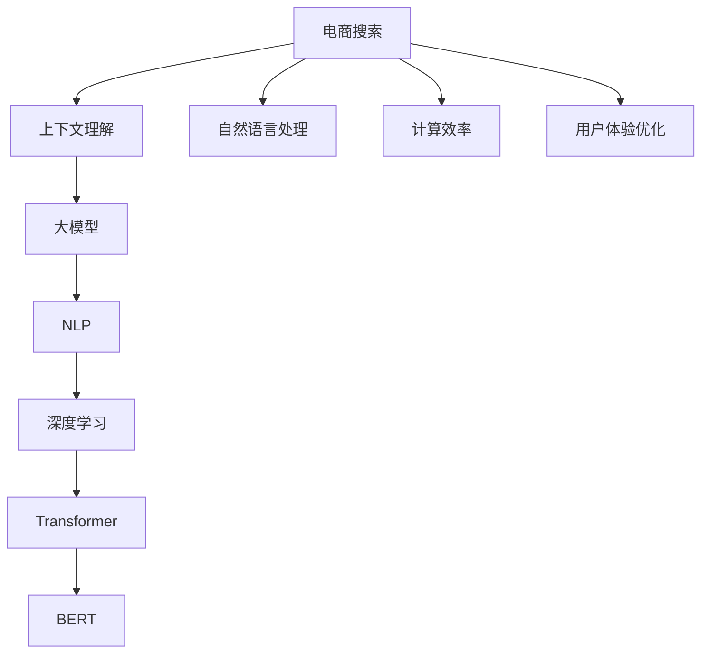

                 

# AI大模型如何提升电商搜索的上下文理解能力

> 关键词：电商搜索,上下文理解,大模型,自然语言处理(NLP),深度学习,Transformer,BERT

## 1. 背景介绍

### 1.1 问题由来
随着电商市场的快速扩张，用户对购物体验的要求不断提高，尤其是搜索体验。传统的电商搜索系统通常采用基于关键词匹配的方式，无法充分理解用户查询意图和上下文信息，导致搜索结果不够精准、相关性低。而基于自然语言处理(NLP)技术的大模型，通过自监督学习获取了丰富的语言知识，能够在理解查询上下文的基础上，生成更准确的搜索结果。

大模型在电商搜索中的应用，能够显著提升用户体验，帮助用户快速找到所需商品，提高交易转化率。特别是在移动端，有限的屏幕空间和输入限制使得用户更倾向于使用自然语言进行搜索，大模型的上下文理解能力将极大地提升移动搜索的效率和准确性。

### 1.2 问题核心关键点
提升电商搜索的上下文理解能力，需要重点关注以下几个方面：

- **大模型的选择**：如何选择合适的预训练模型，确保其对电商领域语料有较好的泛化能力。
- **上下文理解能力**：如何设计任务适配层和损失函数，使模型能够理解用户查询的上下文信息。
- **计算效率**：如何在大规模语料上进行高效微调，避免过度消耗计算资源。
- **用户体验优化**：如何根据用户搜索行为调整搜索结果，提高搜索的个性化和时效性。

## 2. 核心概念与联系

### 2.1 核心概念概述

为更好地理解大模型在电商搜索中的应用，本节将介绍几个密切相关的核心概念：

- **电商搜索**：用户通过输入自然语言查询，获取商品信息并完成购买的过程。电商搜索系统需对用户查询进行理解，生成相关搜索结果，从而提升用户体验和交易转化率。

- **上下文理解**：在自然语言处理中，理解用户查询的上下文信息，包括用户意图、查询目的、历史行为等，能够显著提升搜索的准确性和相关性。

- **大模型**：指基于大规模语料预训练的通用语言模型，如BERT、GPT-3等，具有强大的语言理解能力。

- **自然语言处理(NLP)**：研究如何让计算机理解和处理人类自然语言的技术，包括分词、词性标注、句法分析、语义分析等。

- **深度学习**：一种模拟人脑神经网络结构的机器学习技术，在大模型训练和微调中得到广泛应用。

- **Transformer**：一种基于自注意力机制的神经网络结构，在大模型中表现优异，广泛应用于语言建模和机器翻译等任务。

- **BERT**：一种基于Transformer结构的预训练语言模型，通过掩码语言模型和下一句预测等任务进行预训练，适用于各种NLP任务。

这些核心概念之间的逻辑关系可以通过以下Mermaid流程图来展示：



这个流程图展示了大模型在电商搜索中的核心概念及其之间的关系：

1. 电商搜索系统通过上下文理解对用户查询进行处理。
2. 上下文理解依赖于大模型的语言理解能力，特别是Transformer和BERT结构。
3. NLP技术是实现上下文理解的重要手段，涵盖分词、词性标注、句法分析、语义分析等。
4. 深度学习是训练大模型的关键技术。
5. 计算效率和用户体验优化是电商搜索系统关注的两个重要方面，直接影响用户满意度。

## 3. 核心算法原理 & 具体操作步骤
### 3.1 算法原理概述

基于大模型的电商搜索，本质上是一个利用上下文信息的自然语言理解(NLU)任务。其核心思想是：通过大模型预训练的知识，结合用户查询的上下文信息，生成最相关的搜索结果。

具体而言，假设用户输入的查询为 $q$，大模型 $M_{\theta}$ 输出的搜索结果为 $a$。电商搜索系统设计上下文理解模块，通过查询 $q$ 获取用户的历史行为 $h$ 和上下文信息 $c$。模型 $M_{\theta}$ 将 $q$ 和 $c$ 作为输入，输出搜索结果 $a$。

理想情况下，大模型的输出 $a$ 应当最大化查询 $q$ 与上下文 $c$ 的相关性，即 $a \sim c|q$。上下文理解模块的目标是最大化 $a$ 的相关性，即 $P(a|q,c) \approx P(a|q)$。

### 3.2 算法步骤详解

基于大模型的电商搜索上下文理解流程主要包括如下几个步骤：

**Step 1: 数据准备**
- 收集电商平台的搜索日志，提取查询 $q$ 和对应的搜索结果 $a$。
- 通过查询 $q$ 获取用户的历史行为 $h$，如浏览记录、购买记录等。
- 收集领域相关的知识库，如商品属性、品牌信息等。

**Step 2: 大模型预训练**
- 选择合适的预训练语言模型 $M_{\theta}$，如BERT、GPT等。
- 使用电商搜索语料进行大模型预训练，以获取对电商领域语言知识的泛化能力。

**Step 3: 上下文理解**
- 设计上下文理解模块，将查询 $q$ 和上下文 $c$ 作为输入，提取关键特征。
- 使用大模型 $M_{\theta}$ 对查询 $q$ 和上下文 $c$ 进行编码，输出特征向量。
- 根据特征向量生成搜索结果 $a$，并将其与原始搜索结果进行对比，优化上下文理解模块。

**Step 4: 结果排序**
- 将生成的新搜索结果 $a$ 与原始搜索结果合并，根据相关性和排序算法进行排名。
- 使用用户行为数据和反馈数据，进一步调整排序算法，提高搜索结果的个性化和时效性。

**Step 5: 模型微调与优化**
- 在电商搜索任务上微调大模型，使用少量标注数据进行有监督学习，提升模型性能。
- 根据实时用户反馈，周期性地对模型进行优化，提高上下文理解能力。

### 3.3 算法优缺点

基于大模型的电商搜索上下文理解方法具有以下优点：
1. **高效性**：能够快速理解查询的上下文信息，生成相关搜索结果，提升用户体验。
2. **泛化能力**：大模型具备强大的语言泛化能力，能够适应不同领域和场景。
3. **个性化推荐**：结合用户历史行为和上下文信息，生成个性化搜索结果，提高用户满意度。
4. **可扩展性**：模型微调可以在新的电商平台上快速部署，无需从头训练。

同时，该方法也存在一定的局限性：
1. **数据依赖**：模型的性能高度依赖标注数据，获取高质量数据成本较高。
2. **计算资源需求**：大模型训练和微调需要大量的计算资源，对硬件要求较高。
3. **上下文理解准确性**：用户查询和上下文信息的复杂多样，可能影响上下文理解的准确性。
4. **模型复杂性**：大模型参数量大，结构复杂，可能影响实时推理速度。

尽管存在这些局限性，但大模型上下文理解在电商搜索中已得到广泛应用，并取得了显著的效果。未来相关研究重点在于如何进一步降低数据需求，优化计算效率，提升上下文理解准确性。

### 3.4 算法应用领域

基于大模型的电商搜索上下文理解技术，已在各大电商平台上得到广泛应用，具体包括：

- **商品搜索**：通过用户查询和上下文信息，生成相关商品搜索结果。
- **价格比较**：根据用户查询的商品，生成不同商家的价格比较，帮助用户选择最优方案。
- **品牌推荐**：结合用户查询和浏览历史，推荐用户可能感兴趣的品牌。
- **购物助手**：通过聊天机器人，理解用户查询意图，提供购物建议和个性化服务。
- **客服对话**：在用户客服对话中，使用上下文理解技术提升自动回复的准确性和相关性。

除了上述这些经典应用外，大模型上下文理解还被创新性地应用到更多场景中，如视频搜索、图片搜索等，为电商搜索带来新的突破。

## 4. 数学模型和公式 & 详细讲解
### 4.1 数学模型构建

假设电商搜索任务 $T$ 的查询集合为 $\mathcal{Q}$，上下文集合为 $\mathcal{C}$，搜索结果集合为 $\mathcal{A}$。设上下文理解模块为 $M_{\theta}$，查询 $q$ 和上下文 $c$ 通过大模型编码后的特征向量分别为 $v_q$ 和 $v_c$，生成搜索结果 $a$ 的概率分布为 $P(a|v_q,v_c)$。

电商搜索系统的目标是最小化查询 $q$ 与上下文 $c$ 的不一致性，即最大化 $P(a|q,c)$。数学模型定义为：

$$
\mathcal{L}(\theta) = \mathcal{L}(P(a|q,c), P(a|q))
$$

其中 $\mathcal{L}$ 为KL散度损失函数，用于衡量模型输出与真实分布的差异。

### 4.2 公式推导过程

以二分类任务为例，假设查询 $q$ 和上下文 $c$ 通过大模型编码后的特征向量分别为 $v_q$ 和 $v_c$，生成搜索结果 $a$ 的概率分布为 $P(a|v_q,v_c)$。设查询 $q$ 和上下文 $c$ 的真实标签分别为 $y_q$ 和 $y_c$，假设 $y_q = 1$ 表示查询有效，$y_c = 1$ 表示上下文有效。则二分类交叉熵损失函数定义为：

$$
\ell(M_{\theta}(q,c), y_q, y_c) = -[y_q \log P(a|v_q,v_c) + (1-y_q) \log (1-P(a|v_q,v_c))] + [-y_c \log P(a|v_q,v_c) + (1-y_c) \log (1-P(a|v_q,v_c))]
$$

将其代入经验风险公式，得：

$$
\mathcal{L}(\theta) = \frac{1}{N} \sum_{i=1}^N \ell(M_{\theta}(q_i,c_i), y_q^i, y_c^i)
$$

其中 $N$ 为查询样本数量。根据链式法则，损失函数对参数 $\theta_k$ 的梯度为：

$$
\frac{\partial \mathcal{L}(\theta)}{\partial \theta_k} = -\frac{1}{N} \sum_{i=1}^N (\frac{y_q^i}{P(a|v_q,v_c)} - \frac{1-y_q^i}{1-P(a|v_q,v_c)}) \frac{\partial P(a|v_q,v_c)}{\partial \theta_k}
$$

其中 $\frac{\partial P(a|v_q,v_c)}{\partial \theta_k}$ 可进一步递归展开，利用自动微分技术完成计算。

在得到损失函数的梯度后，即可带入参数更新公式，完成模型的迭代优化。重复上述过程直至收敛，最终得到适应电商搜索任务的最优模型参数 $\theta^*$。

## 5. 项目实践：代码实例和详细解释说明
### 5.1 开发环境搭建

在进行电商搜索上下文理解实践前，我们需要准备好开发环境。以下是使用Python进行PyTorch开发的环境配置流程：

1. 安装Anaconda：从官网下载并安装Anaconda，用于创建独立的Python环境。

2. 创建并激活虚拟环境：
```bash
conda create -n e-commerce-env python=3.8 
conda activate e-commerce-env
```

3. 安装PyTorch：根据CUDA版本，从官网获取对应的安装命令。例如：
```bash
conda install pytorch torchvision torchaudio cudatoolkit=11.1 -c pytorch -c conda-forge
```

4. 安装Transformers库：
```bash
pip install transformers
```

5. 安装各类工具包：
```bash
pip install numpy pandas scikit-learn matplotlib tqdm jupyter notebook ipython
```

完成上述步骤后，即可在`e-commerce-env`环境中开始电商搜索上下文理解实践。

### 5.2 源代码详细实现

下面我们以电商搜索任务为例，给出使用Transformers库对BERT模型进行上下文理解训练的PyTorch代码实现。

首先，定义电商搜索任务的数据处理函数：

```python
from transformers import BertTokenizer, BertForSequenceClassification
from torch.utils.data import Dataset, DataLoader
import torch

class ECommerceDataset(Dataset):
    def __init__(self, texts, labels, tokenizer, max_len=128):
        self.texts = texts
        self.labels = labels
        self.tokenizer = tokenizer
        self.max_len = max_len
        
    def __len__(self):
        return len(self.texts)
    
    def __getitem__(self, item):
        text = self.texts[item]
        label = self.labels[item]
        
        encoding = self.tokenizer(text, return_tensors='pt', max_length=self.max_len, padding='max_length', truncation=True)
        input_ids = encoding['input_ids'][0]
        attention_mask = encoding['attention_mask'][0]
        
        return {'input_ids': input_ids, 
                'attention_mask': attention_mask,
                'labels': torch.tensor(label, dtype=torch.long)}
```

然后，定义模型和优化器：

```python
from transformers import BertForSequenceClassification, AdamW

model = BertForSequenceClassification.from_pretrained('bert-base-cased', num_labels=2)

optimizer = AdamW(model.parameters(), lr=2e-5)
```

接着，定义训练和评估函数：

```python
from tqdm import tqdm

device = torch.device('cuda') if torch.cuda.is_available() else torch.device('cpu')
model.to(device)

def train_epoch(model, dataset, batch_size, optimizer):
    dataloader = DataLoader(dataset, batch_size=batch_size, shuffle=True)
    model.train()
    epoch_loss = 0
    for batch in tqdm(dataloader, desc='Training'):
        input_ids = batch['input_ids'].to(device)
        attention_mask = batch['attention_mask'].to(device)
        labels = batch['labels'].to(device)
        model.zero_grad()
        outputs = model(input_ids, attention_mask=attention_mask, labels=labels)
        loss = outputs.loss
        epoch_loss += loss.item()
        loss.backward()
        optimizer.step()
    return epoch_loss / len(dataloader)

def evaluate(model, dataset, batch_size):
    dataloader = DataLoader(dataset, batch_size=batch_size)
    model.eval()
    preds, labels = [], []
    with torch.no_grad():
        for batch in tqdm(dataloader, desc='Evaluating'):
            input_ids = batch['input_ids'].to(device)
            attention_mask = batch['attention_mask'].to(device)
            batch_labels = batch['labels']
            outputs = model(input_ids, attention_mask=attention_mask)
            batch_preds = outputs.logits.argmax(dim=2).to('cpu').tolist()
            batch_labels = batch_labels.to('cpu').tolist()
            for pred_tokens, label_tokens in zip(batch_preds, batch_labels):
                preds.append(pred_tokens[:len(label_tokens)])
                labels.append(label_tokens)
                
    print(classification_report(labels, preds))
```

最后，启动训练流程并在测试集上评估：

```python
epochs = 5
batch_size = 16

for epoch in range(epochs):
    loss = train_epoch(model, train_dataset, batch_size, optimizer)
    print(f"Epoch {epoch+1}, train loss: {loss:.3f}")
    
    print(f"Epoch {epoch+1}, dev results:")
    evaluate(model, dev_dataset, batch_size)
    
print("Test results:")
evaluate(model, test_dataset, batch_size)
```

以上就是使用PyTorch对BERT进行电商搜索上下文理解训练的完整代码实现。可以看到，得益于Transformers库的强大封装，我们可以用相对简洁的代码完成BERT模型的加载和上下文理解训练。

### 5.3 代码解读与分析

让我们再详细解读一下关键代码的实现细节：

**ECommerceDataset类**：
- `__init__`方法：初始化文本、标签、分词器等关键组件。
- `__len__`方法：返回数据集的样本数量。
- `__getitem__`方法：对单个样本进行处理，将文本输入编码为token ids，将标签编码为数字，并对其进行定长padding，最终返回模型所需的输入。

**训练和评估函数**：
- 使用PyTorch的DataLoader对数据集进行批次化加载，供模型训练和推理使用。
- 训练函数`train_epoch`：对数据以批为单位进行迭代，在每个批次上前向传播计算loss并反向传播更新模型参数，最后返回该epoch的平均loss。
- 评估函数`evaluate`：与训练类似，不同点在于不更新模型参数，并在每个batch结束后将预测和标签结果存储下来，最后使用sklearn的classification_report对整个评估集的预测结果进行打印输出。

**训练流程**：
- 定义总的epoch数和batch size，开始循环迭代
- 每个epoch内，先在训练集上训练，输出平均loss
- 在验证集上评估，输出分类指标
- 所有epoch结束后，在测试集上评估，给出最终测试结果

可以看到，PyTorch配合Transformers库使得BERT上下文理解训练的代码实现变得简洁高效。开发者可以将更多精力放在数据处理、模型改进等高层逻辑上，而不必过多关注底层的实现细节。

当然，工业级的系统实现还需考虑更多因素，如模型的保存和部署、超参数的自动搜索、更灵活的任务适配层等。但核心的上下文理解训练范式基本与此类似。

## 6. 实际应用场景
### 6.1 智能客服系统

基于大模型上下文理解的电商搜索技术，可以广泛应用于智能客服系统的构建。传统客服往往需要配备大量人力，高峰期响应缓慢，且一致性和专业性难以保证。而使用上下文理解技术，可以7x24小时不间断服务，快速响应客户咨询，用自然流畅的语言解答各类常见问题。

在技术实现上，可以收集企业内部的历史客服对话记录，将问题和最佳答复构建成监督数据，在此基础上对预训练上下文理解模型进行训练。训练后的上下文理解模型能够自动理解用户意图，匹配最合适的答案模板进行回复。对于客户提出的新问题，还可以接入检索系统实时搜索相关内容，动态组织生成回答。如此构建的智能客服系统，能大幅提升客户咨询体验和问题解决效率。

### 6.2 金融舆情监测

金融机构需要实时监测市场舆论动向，以便及时应对负面信息传播，规避金融风险。传统的人工监测方式成本高、效率低，难以应对网络时代海量信息爆发的挑战。基于大模型上下文理解的文本分类和情感分析技术，为金融舆情监测提供了新的解决方案。

具体而言，可以收集金融领域相关的新闻、报道、评论等文本数据，并对其进行主题标注和情感标注。在此基础上对预训练语言模型进行微调，使其能够自动判断文本属于何种主题，情感倾向是正面、中性还是负面。将上下文理解模型应用到实时抓取的网络文本数据，就能够自动监测不同主题下的情感变化趋势，一旦发现负面信息激增等异常情况，系统便会自动预警，帮助金融机构快速应对潜在风险。

### 6.3 个性化推荐系统

当前的推荐系统往往只依赖用户的历史行为数据进行物品推荐，无法深入理解用户的真实兴趣偏好。基于大模型上下文理解技术，个性化推荐系统可以更好地挖掘用户行为背后的语义信息，从而提供更精准、多样的推荐内容。

在实践中，可以收集用户浏览、点击、评论、分享等行为数据，提取和用户交互的物品标题、描述、标签等文本内容。将文本内容作为模型输入，用户的后续行为（如是否点击、购买等）作为监督信号，在此基础上微调预训练语言模型。微调后的模型能够从文本内容中准确把握用户的兴趣点。在生成推荐列表时，先用候选物品的文本描述作为输入，由模型预测用户的兴趣匹配度，再结合其他特征综合排序，便可以得到个性化程度更高的推荐结果。

### 6.4 未来应用展望

随着大模型上下文理解技术的不断发展，基于上下文理解的NLP技术将呈现以下几个发展趋势：

1. **上下文表示的提升**：通过改进Transformer和BERT等大模型的结构，提升上下文表示的精度和泛化能力。
2. **多模态融合**：结合视觉、语音、文本等多模态信息，提升上下文理解的全面性和准确性。
3. **跨领域迁移**：在特定领域进行微调，提升模型在该领域上的上下文理解能力。
4. **知识增强**：将结构化知识与上下文理解模型结合，增强模型对复杂问题的理解和推理能力。
5. **个性化推荐**：结合用户行为数据和上下文信息，生成个性化推荐内容。
6. **实时推理**：优化模型结构和计算图，提升实时推理速度和资源利用效率。

以上趋势凸显了大模型上下文理解技术的广阔前景。这些方向的探索发展，必将进一步提升上下文理解的深度和广度，为人工智能在更多领域的应用提供新的可能性。

## 7. 工具和资源推荐
### 7.1 学习资源推荐

为了帮助开发者系统掌握大模型上下文理解的理论基础和实践技巧，这里推荐一些优质的学习资源：

1. 《Transformer from Pertention to Practice》系列博文：由大模型技术专家撰写，深入浅出地介绍了Transformer原理、BERT模型、上下文理解技术等前沿话题。

2. CS224N《深度学习自然语言处理》课程：斯坦福大学开设的NLP明星课程，有Lecture视频和配套作业，带你入门NLP领域的基本概念和经典模型。

3. 《Natural Language Processing with Transformers》书籍：Transformers库的作者所著，全面介绍了如何使用Transformers库进行NLP任务开发，包括上下文理解在内的诸多范式。

4. HuggingFace官方文档：Transformers库的官方文档，提供了海量预训练模型和完整的上下文理解样例代码，是上手实践的必备资料。

5. CLUE开源项目：中文语言理解测评基准，涵盖大量不同类型的中文NLP数据集，并提供了基于上下文理解的baseline模型，助力中文NLP技术发展。

通过对这些资源的学习实践，相信你一定能够快速掌握大模型上下文理解的核心技术，并用于解决实际的NLP问题。
###  7.2 开发工具推荐

高效的开发离不开优秀的工具支持。以下是几款用于大模型上下文理解开发的常用工具：

1. PyTorch：基于Python的开源深度学习框架，灵活动态的计算图，适合快速迭代研究。大部分预训练语言模型都有PyTorch版本的实现。

2. TensorFlow：由Google主导开发的开源深度学习框架，生产部署方便，适合大规模工程应用。同样有丰富的预训练语言模型资源。

3. Transformers库：HuggingFace开发的NLP工具库，集成了众多SOTA语言模型，支持PyTorch和TensorFlow，是进行上下文理解开发的利器。

4. Weights & Biases：模型训练的实验跟踪工具，可以记录和可视化模型训练过程中的各项指标，方便对比和调优。与主流深度学习框架无缝集成。

5. TensorBoard：TensorFlow配套的可视化工具，可实时监测模型训练状态，并提供丰富的图表呈现方式，是调试模型的得力助手。

6. Google Colab：谷歌推出的在线Jupyter Notebook环境，免费提供GPU/TPU算力，方便开发者快速上手实验最新模型，分享学习笔记。

合理利用这些工具，可以显著提升大模型上下文理解任务的开发效率，加快创新迭代的步伐。

### 7.3 相关论文推荐

大模型上下文理解的发展源于学界的持续研究。以下是几篇奠基性的相关论文，推荐阅读：

1. Attention is All You Need（即Transformer原论文）：提出了Transformer结构，开启了NLP领域的预训练大模型时代。

2. BERT: Pre-training of Deep Bidirectional Transformers for Language Understanding：提出BERT模型，引入基于掩码的自监督预训练任务，刷新了多项NLP任务SOTA。

3. Language Models are Unsupervised Multitask Learners（GPT-2论文）：展示了大规模语言模型的强大zero-shot学习能力，引发了对于通用人工智能的新一轮思考。

4. Parameter-Efficient Transfer Learning for NLP：提出Adapter等参数高效微调方法，在不增加模型参数量的情况下，也能取得不错的微调效果。

5. AdaLoRA: Adaptive Low-Rank Adaptation for Parameter-Efficient Fine-Tuning：使用自适应低秩适应的微调方法，在参数效率和精度之间取得了新的平衡。

6. Parameter-Efficient Transfer Learning for Sequence Classification: Towards No Adaptation (SOTA)：提出EML-Head等参数高效方法，实现零适应性微调，进一步减少微调参数量。

这些论文代表了大模型上下文理解技术的发展脉络。通过学习这些前沿成果，可以帮助研究者把握学科前进方向，激发更多的创新灵感。

## 8. 总结：未来发展趋势与挑战

### 8.1 总结

本文对基于大模型的电商搜索上下文理解方法进行了全面系统的介绍。首先阐述了上下文理解在电商搜索中的应用背景和重要性，明确了上下文理解在提升搜索精准性和相关性方面的独特价值。其次，从原理到实践，详细讲解了上下文理解的数学模型和关键步骤，给出了上下文理解任务开发的完整代码实例。同时，本文还广泛探讨了上下文理解技术在智能客服、金融舆情、个性化推荐等多个行业领域的应用前景，展示了上下文理解技术的巨大潜力。此外，本文精选了上下文理解技术的各类学习资源，力求为读者提供全方位的技术指引。

通过本文的系统梳理，可以看到，基于大模型的电商搜索上下文理解技术正在成为NLP领域的重要范式，极大地提升用户体验和交易转化率，推动电商行业的数字化转型升级。未来，伴随大模型和上下文理解技术的持续演进，相信NLP技术将在更广阔的应用领域大放异彩，深刻影响人类的生产生活方式。

### 8.2 未来发展趋势

展望未来，大模型上下文理解技术将呈现以下几个发展趋势：

1. **上下文表示的提升**：通过改进Transformer和BERT等大模型的结构，提升上下文表示的精度和泛化能力。
2. **多模态融合**：结合视觉、语音、文本等多模态信息，提升上下文理解的全面性和准确性。
3. **跨领域迁移**：在特定领域进行微调，提升模型在该领域上的上下文理解能力。
4. **知识增强**：将结构化知识与上下文理解模型结合，增强模型对复杂问题的理解和推理能力。
5. **个性化推荐**：结合用户行为数据和上下文信息，生成个性化推荐内容。
6. **实时推理**：优化模型结构和计算图，提升实时推理速度和资源利用效率。

以上趋势凸显了大模型上下文理解技术的广阔前景。这些方向的探索发展，必将进一步提升上下文理解的深度和广度，为人工智能在更多领域的应用提供新的可能性。

### 8.3 面临的挑战

尽管大模型上下文理解技术已经取得了显著成果，但在迈向更加智能化、普适化应用的过程中，它仍面临着诸多挑战：

1. **数据依赖**：模型的性能高度依赖标注数据，获取高质量数据成本较高。
2. **计算资源需求**：大模型训练和微调需要大量的计算资源，对硬件要求较高。
3. **上下文理解准确性**：用户查询和上下文信息的复杂多样，可能影响上下文理解的准确性。
4. **模型复杂性**：大模型参数量大，结构复杂，可能影响实时推理速度。

尽管存在这些局限性，但大模型上下文理解在电商搜索中已得到广泛应用，并取得了显著的效果。未来相关研究重点在于如何进一步降低数据需求，优化计算效率，提升上下文理解准确性。

### 8.4 研究展望

面对大模型上下文理解所面临的种种挑战，未来的研究需要在以下几个方面寻求新的突破：

1. **探索无监督和半监督上下文理解方法**：摆脱对大规模标注数据的依赖，利用自监督学习、主动学习等无监督和半监督范式，最大限度利用非结构化数据，实现更加灵活高效的上下文理解。

2. **研究参数高效和计算高效的上下文理解范式**：开发更加参数高效的上下文理解方法，在固定大部分预训练参数的同时，只更新极少量的任务相关参数。同时优化上下文理解模型的计算图，减少前向传播和反向传播的资源消耗，实现更加轻量级、实时性的部署。

3. **融合因果和对比学习范式**：通过引入因果推断和对比学习思想，增强上下文理解模型建立稳定因果关系的能力，学习更加普适、鲁棒的语言表征，从而提升模型泛化性和抗干扰能力。

4. **引入更多先验知识**：将符号化的先验知识，如知识图谱、逻辑规则等，与神经网络模型进行巧妙融合，引导上下文理解过程学习更准确、合理的语言模型。同时加强不同模态数据的整合，实现视觉、语音等多模态信息与文本信息的协同建模。

5. **结合因果分析和博弈论工具**：将因果分析方法引入上下文理解模型，识别出模型决策的关键特征，增强输出解释的因果性和逻辑性。借助博弈论工具刻画人机交互过程，主动探索并规避模型的脆弱点，提高系统稳定性。

6. **纳入伦理道德约束**：在模型训练目标中引入伦理导向的评估指标，过滤和惩罚有偏见、有害的输出倾向。同时加强人工干预和审核，建立模型行为的监管机制，确保输出符合人类价值观和伦理道德。

这些研究方向的探索，必将引领大模型上下文理解技术迈向更高的台阶，为构建安全、可靠、可解释、可控的智能系统铺平道路。面向未来，大模型上下文理解技术还需要与其他人工智能技术进行更深入的融合，如知识表示、因果推理、强化学习等，多路径协同发力，共同推动自然语言理解和智能交互系统的进步。只有勇于创新、敢于突破，才能不断拓展上下文理解模型的边界，让智能技术更好地造福人类社会。

## 9. 附录：常见问题与解答

**Q1：如何选择合适的上下文理解模型？**

A: 选择合适的上下文理解模型，需要考虑以下几个方面：
1. **预训练模型选择**：选择与电商领域语料相匹配的预训练模型，如BERT、GPT等。
2. **模型结构选择**：选择适合上下文理解任务的模型结构，如Seq2Seq、Transformer等。
3. **模型规模选择**：根据任务复杂度和计算资源，选择合适规模的模型，避免过大导致过拟合，过小导致泛化能力不足。

**Q2：上下文理解模型如何进行微调？**

A: 上下文理解模型的微调通常包括以下几个步骤：
1. **数据准备**：收集电商搜索日志，提取查询和上下文信息，构建监督数据集。
2. **模型加载**：使用预训练模型加载上下文理解模型，如BERT。
3. **模型微调**：使用监督数据集进行有监督学习，优化模型参数。
4. **评估优化**：在验证集和测试集上进行评估，调整超参数，提高模型性能。
5. **部署上线**：将微调后的模型部署到电商搜索系统中，进行实时推理。

**Q3：上下文理解模型面临的挑战有哪些？**

A: 上下文理解模型面临的挑战主要包括：
1. **数据依赖**：模型的性能高度依赖标注数据，获取高质量数据成本较高。
2. **计算资源需求**：大模型训练和微调需要大量的计算资源，对硬件要求较高。
3. **上下文理解准确性**：用户查询和上下文信息的复杂多样，可能影响上下文理解的准确性。
4. **模型复杂性**：大模型参数量大，结构复杂，可能影响实时推理速度。

尽管存在这些局限性，但大模型上下文理解在电商搜索中已得到广泛应用，并取得了显著的效果。未来相关研究重点在于如何进一步降低数据需求，优化计算效率，提升上下文理解准确性。

**Q4：上下文理解技术在电商搜索中的应用场景有哪些？**

A: 上下文理解技术在电商搜索中的应用场景主要包括：
1. **商品搜索**：通过用户查询和上下文信息，生成相关商品搜索结果。
2. **价格比较**：根据用户查询的商品，生成不同商家的价格比较，帮助用户选择最优方案。
3. **品牌推荐**：结合用户查询和浏览历史，推荐用户可能感兴趣的品牌。
4. **购物助手**：通过聊天机器人，理解用户查询意图，提供购物建议和个性化服务。
5. **客服对话**：在用户客服对话中，使用上下文理解技术提升自动回复的准确性和相关性。

除了上述这些经典应用外，上下文理解技术还被创新性地应用到更多场景中，如视频搜索、图片搜索等，为电商搜索带来新的突破。

**Q5：上下文理解技术在电商搜索中的未来展望有哪些？**

A: 上下文理解技术在电商搜索中的未来展望主要包括：
1. **上下文表示的提升**：通过改进Transformer和BERT等大模型的结构，提升上下文表示的精度和泛化能力。
2. **多模态融合**：结合视觉、语音、文本等多模态信息，提升上下文理解的全面性和准确性。
3. **跨领域迁移**：在特定领域进行微调，提升模型在该领域上的上下文理解能力。
4. **知识增强**：将结构化知识与上下文理解模型结合，增强模型对复杂问题的理解和推理能力。
5. **个性化推荐**：结合用户行为数据和上下文信息，生成个性化推荐内容。
6. **实时推理**：优化模型结构和计算图，提升实时推理速度和资源利用效率。

以上趋势凸显了大模型上下文理解技术的广阔前景。这些方向的探索发展，必将进一步提升上下文理解的深度和广度，为人工智能在更多领域的应用提供新的可能性。

---

作者：禅与计算机程序设计艺术 / Zen and the Art of Computer Programming

