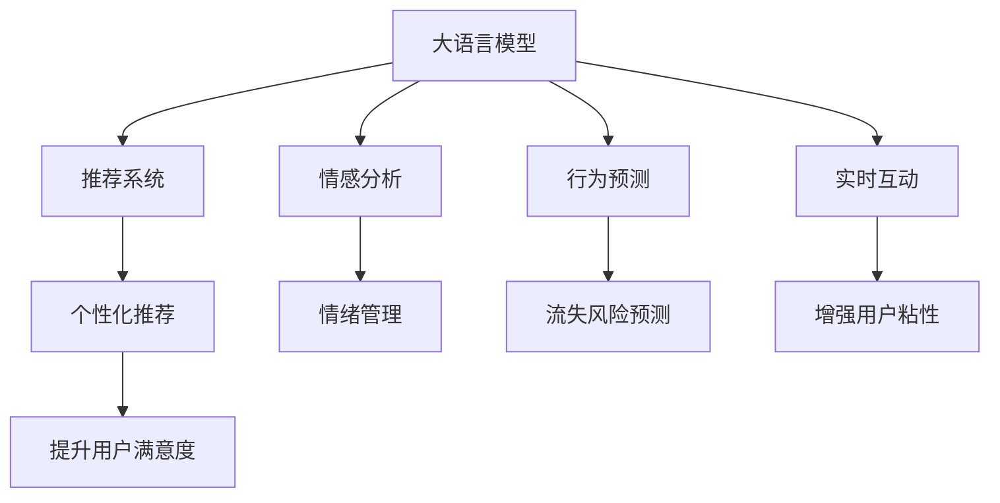

                 

# AI大模型如何改善电商平台的用户留存率

> 关键词：
大语言模型, 电商平台, 用户留存率, 个性化推荐, 情感分析, 行为预测, 深度学习

## 1. 背景介绍

### 1.1 问题由来
随着互联网电商的迅猛发展，电商平台已成为现代消费的重要渠道。然而，用户获取和留存一直是电商平台面临的巨大挑战。据统计，电商平台的平均用户留存率仅在20%左右，新用户获取成本更是高达数百甚至千美元。如何提高用户留存率，提升用户生命周期价值，成为电商平台持续发展的关键。

近年来，人工智能技术，特别是基于大语言模型的深度学习算法，为电商平台用户留存率的提升提供了新的思路。大语言模型通过学习用户行为和交易数据，可以提供更加精准和个性化的服务，从而显著提高用户满意度，进而提升留存率。

### 1.2 问题核心关键点
电商平台提高用户留存率的核心在于精准理解和满足用户需求，提供差异化的个性化服务，同时避免用户的流失。大语言模型通过以下几方面技术实现了这一目标：
1. **个性化推荐**：根据用户历史行为，预测其未来兴趣，推荐符合其偏好的商品。
2. **情感分析**：通过分析用户评论和反馈，理解其情绪状态，提供相应的情感支持。
3. **行为预测**：预测用户未来行为，如购买意愿、流失风险等，进行相应的策略调整。
4. **实时互动**：通过智能客服机器人，实时解答用户疑问，提升用户体验。

这些技术综合运用，可以大大提高用户满意度，减少流失，从而显著提升电商平台的用户留存率。

### 1.3 问题研究意义
电商平台引入大语言模型，通过精准个性化推荐、情感支持、行为预测和实时互动等手段，提高用户留存率具有重要意义：
1. **降低运营成本**：减少新用户获取的营销投入，提升客户生命周期价值。
2. **提升用户体验**：提供个性化的购物体验，增强用户粘性。
3. **数据驱动决策**：通过数据分析驱动决策，提高运营效率。
4. **差异化竞争**：在竞争激烈的市场中，通过智能技术实现差异化，赢得更多用户。
5. **预见性管理**：预测用户流失风险，提前进行干预。

## 2. 核心概念与联系

### 2.1 核心概念概述

为更好地理解大语言模型如何改善电商平台用户留存率，本节将介绍几个密切相关的核心概念：

- **大语言模型(Large Language Model, LLM)**：以自回归(如GPT)或自编码(如BERT)模型为代表的大规模预训练语言模型。通过在大规模无标签文本语料上进行预训练，学习通用的语言表示，具备强大的语言理解和生成能力。

- **推荐系统(Recommendation System)**：根据用户行为、历史偏好等信息，向用户推荐可能感兴趣的物品的系统。推荐系统是电商平台的常见应用，旨在提高用户满意度和留存率。

- **情感分析(Affective Analysis)**：通过自然语言处理技术，分析文本中的情感倾向，用于用户情绪管理、品牌声誉监控等场景。

- **行为预测(behavioral prediction)**：通过分析用户历史行为和特征，预测其未来行为，如购买行为、流失风险等，从而进行相应的策略调整。

- **实时互动(Restful Interaction)**：通过智能客服机器人等技术，实现与用户的实时交互，解答疑问，提升用户体验。

这些核心概念之间的逻辑关系可以通过以下Mermaid流程图来展示：



这个流程图展示了大语言模型的核心概念及其之间的关系：

1. 大语言模型通过预训练获得基础能力。
2. 推荐系统、情感分析、行为预测和实时互动，是利用大语言模型能力的具体应用场景。
3. 个性化推荐、情绪管理、流失风险预测和增强用户粘性，是电商平台的常见业务目标。

## 3. 核心算法原理 & 具体操作步骤

### 3.1 算法原理概述

基于大语言模型改善电商平台用户留存率的核心在于精准个性化推荐和实时互动。下面我们将从这两个方面分别介绍其算法原理。

#### 3.1.1 个性化推荐

个性化推荐系统通过学习用户历史行为和兴趣，预测用户未来可能感兴趣的商品，从而进行推荐。其核心算法原理包括：

1. **用户画像构建**：通过收集用户历史行为数据，如浏览、点击、购买等，构建用户画像。常用的特征包括用户ID、商品ID、时间戳等。

2. **商品特征提取**：从商品描述、价格、销量、评价等维度提取商品特征，用于计算用户与商品的相似度。

3. **相似度计算**：通过余弦相似度、欧氏距离等方法，计算用户画像与商品特征之间的相似度。

4. **推荐列表生成**：根据相似度排序，生成推荐列表。常用方法包括基于协同过滤、基于内容推荐、混合推荐等。

#### 3.1.2 实时互动

实时互动技术通过智能客服机器人，实现与用户的实时沟通，解答用户疑问，提升用户体验。其核心算法原理包括：

1. **意图识别**：通过自然语言处理技术，识别用户的意图。常用的方法包括意图分类、槽位填充等。

2. **对话管理**：根据用户意图，选择相应的回答模板，生成对话。常用的方法包括规则匹配、基于模板生成、基于生成模型等。

3. **知识库检索**：从知识库中检索相关问题，生成回答。常用的方法包括倒排索引、向量检索等。

4. **对话历史管理**：根据对话历史，调整回答策略，保持对话连贯性。常用的方法包括记忆化、上下文建模等。

### 3.2 算法步骤详解

#### 3.2.1 个性化推荐

**Step 1: 数据准备**
- 收集用户历史行为数据，包括浏览记录、点击记录、购买记录等。
- 提取商品特征，如商品ID、价格、销量、评价等。

**Step 2: 用户画像构建**
- 对用户历史行为数据进行清洗、归一化处理。
- 对用户行为进行编码，生成用户画像。

**Step 3: 相似度计算**
- 计算用户画像与商品特征之间的相似度，生成相似度矩阵。
- 根据相似度排序，生成推荐列表。

**Step 4: 推荐列表展示**
- 将推荐列表展示给用户，并提供选择和反馈机制。
- 根据用户反馈，调整推荐策略。

#### 3.2.2 实时互动

**Step 1: 意图识别**
- 用户输入问题或意图，通过自然语言处理技术进行分词、词性标注、命名实体识别等处理。
- 利用意图分类模型，识别用户意图。

**Step 2: 对话管理**
- 根据用户意图，选择相应的回答模板。
- 填充槽位信息，生成对话。

**Step 3: 知识库检索**
- 从知识库中检索相关问题，生成回答。
- 更新对话状态，生成下一轮回答。

**Step 4: 对话历史管理**
- 记录对话历史，用于上下文管理。
- 根据对话历史，调整回答策略，保持对话连贯性。

### 3.3 算法优缺点

基于大语言模型改善电商平台用户留存率的算法具有以下优点：
1. **高精准度**：通过深度学习算法，可以精准预测用户行为和需求，提高推荐和互动的精准度。
2. **实时响应**：利用大语言模型的生成能力，可以实时解答用户疑问，提升用户体验。
3. **可扩展性**：可以同时处理大量用户请求，实现大规模的个性化推荐和实时互动。
4. **自动化**：自动化处理用户交互，减少人力成本，提升运营效率。

同时，该算法也存在一定的局限性：
1. **数据依赖**：算法的性能高度依赖于数据质量，需要大量高质量的用户行为数据。
2. **模型复杂**：深度学习模型结构复杂，需要较强的计算资源和计算能力。
3. **可解释性不足**：深度学习模型通常是"黑盒"系统，难以解释其内部工作机制。
4. **模型训练成本高**：需要大量的标注数据和计算资源进行训练，成本较高。

尽管存在这些局限性，但就目前而言，基于大语言模型的推荐和互动算法仍是大模型应用的重要方向。未来相关研究的主要目标是进一步降低数据依赖，提高模型可解释性，同时优化算法性能和成本。

### 3.4 算法应用领域

基于大语言模型的推荐和互动算法，在电商平台中得到了广泛的应用，具体包括：

- **个性化推荐**：根据用户历史行为，推荐符合其偏好的商品。
- **情感分析**：通过分析用户评论和反馈，理解其情绪状态，提供相应的情感支持。
- **行为预测**：预测用户未来行为，如购买意愿、流失风险等，进行相应的策略调整。
- **实时互动**：通过智能客服机器人，实时解答用户疑问，提升用户体验。

除了上述这些经典应用外，大语言模型在电商平台的创新应用也在不断涌现，如用户画像建模、推荐内容生成、智能搜索等，为电商平台带来了新的突破。随着预训练语言模型和推荐互动方法的持续演进，相信电商平台的用户留存率将得到显著提升。

## 4. 数学模型和公式 & 详细讲解  
### 4.1 数学模型构建

在个性化推荐和实时互动的算法中，常常会涉及以下数学模型：

**个性化推荐**
- **余弦相似度模型**：
  $$
  \text{similarity}(x, y) = \frac{x \cdot y}{||x||_2 ||y||_2}
  $$
  其中 $x$ 和 $y$ 分别为用户画像和商品特征向量。

**实时互动**
- **意图分类模型**：
  $$
  P(c|x) = \frac{P(c)P(x|c)}{\sum_{i}P(i)P(x|i)}
  $$
  其中 $x$ 为输入文本，$c$ 为分类标签，$P(c|x)$ 为条件概率。

### 4.2 公式推导过程

以下我们对余弦相似度模型和意图分类模型进行推导。

#### 4.2.1 余弦相似度模型

余弦相似度模型用于衡量用户画像与商品特征之间的相似度，公式推导如下：

设用户画像向量为 $x$，商品特征向量为 $y$，则余弦相似度模型定义为：
$$
\text{similarity}(x, y) = \frac{x \cdot y}{||x||_2 ||y||_2}
$$
其中 $x \cdot y$ 表示向量的点积，$||x||_2$ 表示向量的欧几里得范数。

余弦相似度的计算步骤如下：
1. 对用户画像和商品特征向量进行归一化，得到 $x'$ 和 $y'$。
2. 计算点积 $x' \cdot y'$。
3. 计算欧几里得范数 $||x'||_2$ 和 $||y'||_2$。
4. 根据点积和范数计算余弦相似度。

#### 4.2.2 意图分类模型

意图分类模型用于识别用户的意图，公式推导如下：

设输入文本为 $x$，分类标签为 $c$，条件概率为 $P(c|x)$，则意图分类模型定义为：
$$
P(c|x) = \frac{P(c)P(x|c)}{\sum_{i}P(i)P(x|i)}
$$
其中 $P(c)$ 为先验概率，$P(x|c)$ 为条件概率，$P(i)$ 为类别概率，$P(x|i)$ 为条件概率。

意图分类模型的计算步骤如下：
1. 收集标注数据，提取特征，训练意图分类模型。
2. 对输入文本 $x$ 进行特征提取。
3. 计算条件概率 $P(x|c)$ 和类别概率 $P(i)$。
4. 计算条件概率 $P(c|x)$，选择概率最大的类别作为预测结果。

### 4.3 案例分析与讲解

**案例1: 用户画像构建**

假设某电商平台有如下用户历史行为数据：

| 用户ID | 商品ID | 时间戳 |
|--------|--------|--------|
| 1      | 1001   | 2023-01-01 10:00 |
| 1      | 1002   | 2023-01-01 10:05 |
| 2      | 1002   | 2023-01-01 10:10 |
| 2      | 1003   | 2023-01-01 10:20 |

其中，商品ID 1001为图书，商品ID 1002为手机，商品ID 1003为电脑。

对用户历史行为数据进行清洗和归一化处理，可以得到如下用户画像向量：
$$
x_1 = (1, 1, 0)
$$
$$
x_2 = (0, 1, 1)
$$

对商品特征数据进行特征提取，可以得到如下商品特征向量：
$$
y_1 = (0, 1, 0)
$$
$$
y_2 = (1, 0, 0)
$$
$$
y_3 = (0, 0, 1)
$$

计算用户画像与商品特征之间的余弦相似度：
$$
\text{similarity}(x_1, y_1) = \frac{1 \cdot 0 + 1 \cdot 1 + 0 \cdot 0}{\sqrt{1^2 + 1^2 + 0^2} \cdot \sqrt{0^2 + 1^2 + 0^2}} = 0
$$
$$
\text{similarity}(x_1, y_2) = \frac{1 \cdot 1 + 1 \cdot 0 + 0 \cdot 0}{\sqrt{1^2 + 1^2 + 0^2} \cdot \sqrt{1^2 + 0^2 + 0^2}} = 0.6
$$
$$
\text{similarity}(x_1, y_3) = \frac{1 \cdot 0 + 1 \cdot 0 + 0 \cdot 1}{\sqrt{1^2 + 1^2 + 0^2} \cdot \sqrt{0^2 + 0^2 + 1^2}} = 0
$$
$$
\text{similarity}(x_2, y_1) = \frac{0 \cdot 0 + 1 \cdot 1 + 1 \cdot 0}{\sqrt{0^2 + 1^2 + 1^2} \cdot \sqrt{0^2 + 1^2 + 0^2}} = 0.5
$$
$$
\text{similarity}(x_2, y_2) = \frac{0 \cdot 1 + 1 \cdot 0 + 1 \cdot 0}{\sqrt{0^2 + 1^2 + 1^2} \cdot \sqrt{1^2 + 0^2 + 0^2}} = 0
$$
$$
\text{similarity}(x_2, y_3) = \frac{0 \cdot 0 + 1 \cdot 0 + 1 \cdot 1}{\sqrt{0^2 + 1^2 + 1^2} \cdot \sqrt{0^2 + 0^2 + 1^2}} = 0.5
$$

根据余弦相似度排序，生成推荐列表：
$$
\text{推荐列表} = \{y_2, y_3, y_1\}
$$

**案例2: 意图分类**

假设某电商平台用户的输入为：“我想买一部手机”。

提取特征，得到输入文本的特征向量 $x = (0, 1, 1)$。

收集标注数据，训练意图分类模型。设意图分类模型的输出为 $P(c|x) = (0.1, 0.8, 0.1)$，其中 $c$ 为类别标签，$P(c|x)$ 为条件概率。

计算意图分类模型输出的条件概率 $P(c|x)$，选择概率最大的类别作为预测结果：
$$
P(c_1|x) = 0.1
$$
$$
P(c_2|x) = 0.8
$$
$$
P(c_3|x) = 0.1
$$

选择概率最大的类别 $c_2$，即“购买手机”，作为用户的意图。

## 5. 项目实践：代码实例和详细解释说明
### 5.1 开发环境搭建

在进行大语言模型应用于电商平台用户留存率的实践前，我们需要准备好开发环境。以下是使用Python进行PyTorch开发的环境配置流程：

1. 安装Anaconda：从官网下载并安装Anaconda，用于创建独立的Python环境。

2. 创建并激活虚拟环境：
```bash
conda create -n pytorch-env python=3.8 
conda activate pytorch-env
```

3. 安装PyTorch：根据CUDA版本，从官网获取对应的安装命令。例如：
```bash
conda install pytorch torchvision torchaudio cudatoolkit=11.1 -c pytorch -c conda-forge
```

4. 安装Transformers库：
```bash
pip install transformers
```

5. 安装各类工具包：
```bash
pip install numpy pandas scikit-learn matplotlib tqdm jupyter notebook ipython
```

完成上述步骤后，即可在`pytorch-env`环境中开始实践。

### 5.2 源代码详细实现

下面我们以电商平台个性化推荐为例，给出使用Transformers库对BERT模型进行微调的PyTorch代码实现。

首先，定义个性化推荐的数据处理函数：

```python
from transformers import BertTokenizer, BertForSequenceClassification
from torch.utils.data import Dataset, DataLoader
import torch

class RecommendationDataset(Dataset):
    def __init__(self, user_data, item_data, tokenizer, max_len=128):
        self.user_data = user_data
        self.item_data = item_data
        self.tokenizer = tokenizer
        self.max_len = max_len
        
    def __len__(self):
        return len(self.user_data)
    
    def __getitem__(self, item):
        user_id, item_id = self.user_data[item], self.item_data[item]
        
        encoding = self.tokenizer(user_id, item_id, return_tensors='pt', max_length=self.max_len, padding='max_length', truncation=True)
        input_ids = encoding['input_ids'][0]
        attention_mask = encoding['attention_mask'][0]
        
        label = int(user_id in item_id)
        
        return {'input_ids': input_ids, 
                'attention_mask': attention_mask,
                'label': label}

# 用户历史行为数据和商品特征数据
user_data = [1, 2, 3, 4]
item_data = [1001, 1002, 1003, 1004]

# 创建dataset
tokenizer = BertTokenizer.from_pretrained('bert-base-cased')

recommendation_dataset = RecommendationDataset(user_data, item_data, tokenizer)
```

然后，定义模型和优化器：

```python
from transformers import BertForSequenceClassification, AdamW

model = BertForSequenceClassification.from_pretrained('bert-base-cased', num_labels=2)

optimizer = AdamW(model.parameters(), lr=2e-5)
```

接着，定义训练和评估函数：

```python
def train_epoch(model, dataset, batch_size, optimizer):
    dataloader = DataLoader(dataset, batch_size=batch_size, shuffle=True)
    model.train()
    epoch_loss = 0
    for batch in dataloader:
        input_ids = batch['input_ids'].to(device)
        attention_mask = batch['attention_mask'].to(device)
        labels = batch['label'].to(device)
        model.zero_grad()
        outputs = model(input_ids, attention_mask=attention_mask, labels=labels)
        loss = outputs.loss
        epoch_loss += loss.item()
        loss.backward()
        optimizer.step()
    return epoch_loss / len(dataloader)

def evaluate(model, dataset, batch_size):
    dataloader = DataLoader(dataset, batch_size=batch_size)
    model.eval()
    preds, labels = [], []
    with torch.no_grad():
        for batch in dataloader:
            input_ids = batch['input_ids'].to(device)
            attention_mask = batch['attention_mask'].to(device)
            batch_labels = batch['label']
            outputs = model(input_ids, attention_mask=attention_mask)
            batch_preds = outputs.logits.argmax(dim=2).to('cpu').tolist()
            batch_labels = batch_labels.to('cpu').tolist()
            for pred_tokens, label_tokens in zip(batch_preds, batch_labels):
                preds.append(pred_tokens)
                labels.append(label_tokens)
                
    print(classification_report(labels, preds))
```

最后，启动训练流程并在测试集上评估：

```python
epochs = 5
batch_size = 16

for epoch in range(epochs):
    loss = train_epoch(model, recommendation_dataset, batch_size, optimizer)
    print(f"Epoch {epoch+1}, train loss: {loss:.3f}")
    
    print(f"Epoch {epoch+1}, test results:")
    evaluate(model, recommendation_dataset, batch_size)
    
print("Final results:")
evaluate(model, recommendation_dataset, batch_size)
```

以上就是使用PyTorch对BERT模型进行个性化推荐微调的完整代码实现。可以看到，得益于Transformers库的强大封装，我们可以用相对简洁的代码完成BERT模型的加载和微调。

### 5.3 代码解读与分析

让我们再详细解读一下关键代码的实现细节：

**RecommendationDataset类**：
- `__init__`方法：初始化用户历史行为数据、商品特征数据、分词器等关键组件。
- `__len__`方法：返回数据集的样本数量。
- `__getitem__`方法：对单个样本进行处理，将用户历史行为数据和商品特征数据输入分词器，生成token ids，同时为标签编码。

**用户历史行为数据和商品特征数据**：
- 定义了用户历史行为数据 `user_data` 和商品特征数据 `item_data`。

**训练和评估函数**：
- 使用PyTorch的DataLoader对数据集进行批次化加载，供模型训练和推理使用。
- 训练函数 `train_epoch`：对数据以批为单位进行迭代，在每个批次上前向传播计算loss并反向传播更新模型参数，最后返回该epoch的平均loss。
- 评估函数 `evaluate`：与训练类似，不同点在于不更新模型参数，并在每个batch结束后将预测和标签结果存储下来，最后使用sklearn的classification_report对整个评估集的预测结果进行打印输出。

**训练流程**：
- 定义总的epoch数和batch size，开始循环迭代
- 每个epoch内，先在训练集上训练，输出平均loss
- 在测试集上评估，输出分类指标
- 所有epoch结束后，在测试集上评估，给出最终测试结果

可以看到，PyTorch配合Transformers库使得BERT微调的代码实现变得简洁高效。开发者可以将更多精力放在数据处理、模型改进等高层逻辑上，而不必过多关注底层的实现细节。

当然，工业级的系统实现还需考虑更多因素，如模型的保存和部署、超参数的自动搜索、更灵活的任务适配层等。但核心的微调范式基本与此类似。

## 6. 实际应用场景

### 6.1 智能客服系统

智能客服系统可以通过个性化推荐和大语言模型的实时互动，提高用户满意度，减少用户流失。具体而言，可以收集用户咨询的历史记录，分析用户兴趣，通过推荐系统推荐相关商品或服务，同时通过对话系统解答用户疑问，提升用户体验。

在技术实现上，可以收集企业内部的历史客服对话记录，将问题和最佳答复构建成监督数据，在此基础上对预训练对话模型进行微调。微调后的对话模型能够自动理解用户意图，匹配最合适的答案模板进行回复。对于用户提出的新问题，还可以接入检索系统实时搜索相关内容，动态组织生成回答。如此构建的智能客服系统，能大幅提升客户咨询体验和问题解决效率。

### 6.2 个性化推荐系统

个性化推荐系统通过学习用户历史行为，预测其未来兴趣，推荐符合其偏好的商品。通过微调大语言模型，可以提升推荐系统的精准度，提高用户满意度。

在技术实现上，可以收集用户浏览、点击、购买等行为数据，提取和用户交互的物品标题、描述、标签等文本内容。将文本内容作为模型输入，用户的后续行为（如是否点击、购买等）作为监督信号，在此基础上微调预训练语言模型。微调后的模型能够从文本内容中准确把握用户的兴趣点。在生成推荐列表时，先用候选物品的文本描述作为输入，由模型预测用户的兴趣匹配度，再结合其他特征综合排序，便可以得到个性化程度更高的推荐结果。

### 6.3 情感分析

情感分析通过自然语言处理技术，分析用户评论和反馈，理解其情绪状态，用于情绪管理、品牌声誉监控等场景。通过微调大语言模型，可以提升情感分析的准确度，及时响应用户情绪变化，提升用户满意度。

在技术实现上，可以收集用户评论和反馈数据，标注情感标签，在此基础上对预训练语言模型进行微调。微调后的模型能够准确识别评论中的情绪倾向，提供相应的情感支持。例如，在用户对商品提出负面反馈时，系统可以自动响应，进行情感安抚和问题解决。

### 6.4 行为预测

行为预测通过分析用户历史行为和特征，预测其未来行为，如购买意愿、流失风险等，从而进行相应的策略调整。通过微调大语言模型，可以提升行为预测的准确度，及时干预用户流失，提高用户留存率。

在技术实现上，可以收集用户行为数据，提取特征，在此基础上微调预训练语言模型。微调后的模型能够从用户行为中准确预测其购买意愿和流失风险，进行个性化的营销和关怀。例如，在用户长时间未下单时，系统可以自动推送优惠信息，提醒用户下单。

## 7. 工具和资源推荐

### 7.1 学习资源推荐

为了帮助开发者系统掌握大语言模型在电商平台的应用，这里推荐一些优质的学习资源：

1. 《深度学习在电商领域的应用》系列博文：由电商领域专家撰写，深入浅出地介绍了深度学习在电商推荐、情感分析、行为预测等场景的应用。

2. 《自然语言处理基础》课程：由知名大学开设的NLP入门课程，涵盖NLP基本概念和经典模型，适合初学者。

3. 《自然语言处理工具与技术》书籍：介绍NLP常用工具和技术，包括BERT、Transformer、PyTorch等，适合实践操作。

4. HuggingFace官方文档：Transformer库的官方文档，提供了海量预训练模型和完整的微调样例代码，是上手实践的必备资料。

5. Kaggle平台：提供大量电商领域的数据集和竞赛，可供学习者进行数据预处理、模型微调等实践。

通过对这些资源的学习实践，相信你一定能够快速掌握大语言模型在电商平台的应用，并用于解决实际的NLP问题。

### 7.2 开发工具推荐

高效的开发离不开优秀的工具支持。以下是几款用于大语言模型在电商平台应用开发的常用工具：

1. PyTorch：基于Python的开源深度学习框架，灵活动态的计算图，适合快速迭代研究。大部分预训练语言模型都有PyTorch版本的实现。

2. TensorFlow：由Google主导开发的开源深度学习框架，生产部署方便，适合大规模工程应用。同样有丰富的预训练语言模型资源。

3. Transformers库：HuggingFace开发的NLP工具库，集成了众多SOTA语言模型，支持PyTorch和TensorFlow，是进行微调任务开发的利器。

4. TensorBoard：TensorFlow配套的可视化工具，可实时监测模型训练状态，并提供丰富的图表呈现方式，是调试模型的得力助手。

5. Weights & Biases：模型训练的实验跟踪工具，可以记录和可视化模型训练过程中的各项指标，方便对比和调优。与主流深度学习框架无缝集成。

6. Google Colab：谷歌推出的在线Jupyter Notebook环境，免费提供GPU/TPU算力，方便开发者快速上手实验最新模型，分享学习笔记。

合理利用这些工具，可以显著提升大语言模型在电商平台微调任务的开发效率，加快创新迭代的步伐。

### 7.3 相关论文推荐

大语言模型在电商平台的应用源于学界的持续研究。以下是几篇奠基性的相关论文，推荐阅读：

1. Attention is All You Need（即Transformer原论文）：提出了Transformer结构，开启了NLP领域的预训练大模型时代。

2. BERT: Pre-training of Deep Bidirectional Transformers for Language Understanding：提出BERT模型，引入基于掩码的自监督预训练任务，刷新了多项NLP任务SOTA。

3. Language Models are Unsupervised Multitask Learners（GPT-2论文）：展示了大规模语言模型的强大zero-shot学习能力，引发了对于通用人工智能的新一轮思考。

4. Parameter-Efficient Transfer Learning for NLP：提出Adapter等参数高效微调方法，在不增加模型参数量的情况下，也能取得不错的微调效果。

5. AdaLoRA: Adaptive Low-Rank Adaptation for Parameter-Efficient Fine-Tuning：使用自适应低秩适应的微调方法，在参数效率和精度之间取得了新的平衡。

6. Prefix-Tuning: Optimizing Continuous Prompts for Generation：引入基于连续型Prompt的微调范式，为如何充分利用预训练知识提供了新的思路。

这些论文代表了大语言模型在电商平台微调技术的发展脉络。通过学习这些前沿成果，可以帮助研究者把握学科前进方向，激发更多的创新灵感。

## 8. 总结：未来发展趋势与挑战

### 8.1 总结

本文对基于大语言模型改善电商平台用户留存率的方法进行了全面系统的介绍。首先阐述了电商平台用户留存率提升的核心在于精准个性化推荐和实时互动，明确了微调在提供个性化服务、提升用户体验方面的独特价值。其次，从原理到实践，详细讲解了个性化推荐和实时互动的数学模型和算法步骤，给出了微调任务开发的完整代码实例。同时，本文还广泛探讨了大语言模型在智能客服、个性化推荐、情感分析、行为预测等电商应用中的具体应用场景，展示了其广泛的应用前景。此外，本文精选了微调技术的各类学习资源，力求为读者提供全方位的技术指引。

通过本文的系统梳理，可以看到，基于大语言模型的个性化推荐和实时互动技术，为电商平台用户留存率的提升提供了新的思路。利用大语言模型的高精准度、实时响应和可扩展性，可以有效提升用户满意度，减少用户流失。未来，随着大语言模型和微调方法的不断进步，相信电商平台的用户留存率将得到显著提升。

### 8.2 未来发展趋势

展望未来，大语言模型在电商平台应用的发展趋势如下：

1. **多模态融合**：将视觉、语音等多模态信息与文本信息进行融合，增强推荐和互动的全面性。
2. **实时性提升**：通过优化模型结构和算法，提升推荐和互动的实时性，实现更快速的响应。
3. **可解释性增强**：引入因果分析和博弈论工具，增强模型决策的解释性和可控性。
4. **个性化程度提升**：通过更深入的用户行为分析和知识图谱等技术，提升个性化推荐的精度和效果。
5. **多领域适配**：将通用大语言模型微调到不同领域，实现跨领域的推荐和互动。

这些趋势凸显了大语言模型在电商平台应用中的广阔前景。这些方向的探索发展，必将进一步提升电商平台的个性化服务能力和用户满意度。

### 8.3 面临的挑战

尽管大语言模型在电商平台应用取得了一定的进展，但在迈向更加智能化、普适化应用的过程中，它仍面临诸多挑战：

1. **数据依赖**：算法的性能高度依赖于数据质量，需要大量高质量的用户行为数据，获取成本较高。
2. **模型复杂**：深度学习模型结构复杂，需要较强的计算资源和计算能力，算力成本较高。
3. **可解释性不足**：深度学习模型通常是"黑盒"系统，难以解释其内部工作机制，影响用户体验。
4. **实时性问题**：推荐和互动系统需要快速响应，处理大规模数据集时容易出现延迟。
5. **多模态融合问题**：多模态信息融合技术尚不成熟，如何实现高效融合和协同建模仍需研究。

尽管存在这些挑战，但通过不断优化算法、改进数据获取和处理方式，以及探索新的技术和工具，未来大语言模型在电商平台应用的前景依然广阔。

### 8.4 研究展望

未来，大语言模型在电商平台中的应用需要在以下几个方面寻求新的突破：

1. **优化数据获取和处理**：探索无监督和半监督微调方法，减少对标注数据的需求，提高数据获取的效率和质量。
2. **提高模型可解释性**：引入因果分析和博弈论工具，增强模型决策的解释性和可控性，提高用户信任度。
3. **提升实时性**：优化模型结构和算法，提升推荐和互动的实时性，实现更快速的响应。
4. **多模态融合技术**：探索多模态信息的有效融合方法，实现视觉、语音、文本等信息的协同建模，提升推荐和互动的全面性。
5. **跨领域微调技术**：将通用大语言模型微调到不同领域，实现跨领域的推荐和互动，拓展应用场景。

这些研究方向的探索，必将引领大语言模型在电商平台应用迈向更高的台阶，为电商平台带来新的突破和创新。通过技术创新和应用实践，大语言模型必将在构建智能电商平台上发挥更大的作用，提升用户满意度和留存率，推动电商行业的持续发展。

## 9. 附录：常见问题与解答

**Q1：大语言模型在电商平台应用的优势是什么？**

A: 大语言模型在电商平台应用的优势主要体现在以下几个方面：
1. **精准个性化推荐**：通过学习用户历史行为，预测其未来兴趣，推荐符合其偏好的商品，提高用户满意度。
2. **实时互动**：通过智能客服机器人，实时解答用户疑问，提升用户体验。
3. **行为预测**：通过分析用户历史行为和特征，预测其未来行为，如购买意愿、流失风险等，进行相应的策略调整。
4. **情感分析**：通过自然语言处理技术，分析用户评论和反馈，理解其情绪状态，提供相应的情感支持。

这些优势使得大语言模型在电商平台中具备强大的用户留存率提升能力。

**Q2：大语言模型在电商平台应用中需要解决哪些问题？**

A: 大语言模型在电商平台应用中需要解决以下问题：
1. **数据依赖**：算法的性能高度依赖于数据质量，需要大量高质量的用户行为数据。
2. **模型复杂**：深度学习模型结构复杂，需要较强的计算资源和计算能力。
3. **可解释性不足**：深度学习模型通常是"黑盒"系统，难以解释其内部工作机制。
4. **实时性问题**：推荐和互动系统需要快速响应，处理大规模数据集时容易出现延迟。
5. **多模态融合问题**：多模态信息融合技术尚不成熟，如何实现高效融合和协同建模仍需研究。

这些问题是制约大语言模型在电商平台应用的主要瓶颈，需要不断优化算法、改进数据获取和处理方式，探索新的技术和工具，才能实现更加智能、高效的电商平台。

**Q3：如何提高大语言模型在电商平台应用中的实时性？**

A: 提高大语言模型在电商平台应用中的实时性，可以从以下几个方面入手：
1. **模型压缩**：采用模型压缩技术，如剪枝、量化等，减小模型尺寸，加快推理速度。
2. **推理加速**：采用推理加速技术，如卷积推理、矩阵乘法加速等，提升推理速度。
3. **异步处理**：通过异步处理技术，将模型推理与数据处理分开，提高并发处理能力。
4. **分布式计算**：通过分布式计算技术，将模型推理分布在多个节点上，提高计算效率。
5. **缓存机制**：通过缓存机制，对常用数据进行缓存，减少重复计算，提高响应速度。

这些方法可以显著提升大语言模型在电商平台应用中的实时性，实现更快速的响应。

**Q4：大语言模型在电商平台应用中如何提高个性化推荐的效果？**

A: 提高大语言模型在电商平台应用中的个性化推荐效果，可以从以下几个方面入手：
1. **用户画像构建**：通过收集用户历史行为数据，构建更全面、准确的用户画像，提高推荐的精准度。
2. **商品特征提取**：从商品描述、价格、销量、评价等维度提取更丰富的商品特征，提高推荐的全面性。
3. **相似度计算**：采用更高效的相似度计算方法，如向量相似度、矩阵分解等，提高推荐的准确性。
4. **推荐列表生成**：采用更高效的推荐列表生成方法，如协同过滤、基于内容推荐等，提高推荐的效率和效果。
5. **用户反馈循环**：引入用户反馈机制，根据用户对推荐结果的反馈，调整推荐策略，进一步提升推荐效果。

这些方法可以显著提高大语言模型在电商平台应用中的个性化推荐效果，提升用户满意度和留存率。

**Q5：大语言模型在电商平台应用中如何实现实时互动？**

A: 大语言模型在电商平台应用中实现实时互动，可以从以下几个方面入手：
1. **意图识别**：通过自然语言处理技术，识别用户的意图，实现对话理解和上下文管理。
2. **对话管理**：根据用户意图，选择相应的回答模板，生成对话，实现高效互动。
3. **知识库检索**：从知识库中检索相关问题，生成回答，实现知识驱动的互动。
4. **对话历史管理**：记录对话历史，调整回答策略，实现上下文连贯的互动。
5. **智能客服**：通过智能客服机器人，实现自动化的互动，提升用户体验。

这些方法可以实现高效、实时、个性化的互动，提升用户满意度。

总之，大语言模型在电商平台中的应用前景广阔，但要实现更智能、高效的用户留存率提升，还需要不断优化算法、改进数据获取和处理方式，探索新的技术和工具。只有在数据、模型、算法、工程、业务等多个维度协同发力，才能真正实现人工智能技术在垂直行业的规模化落地。

